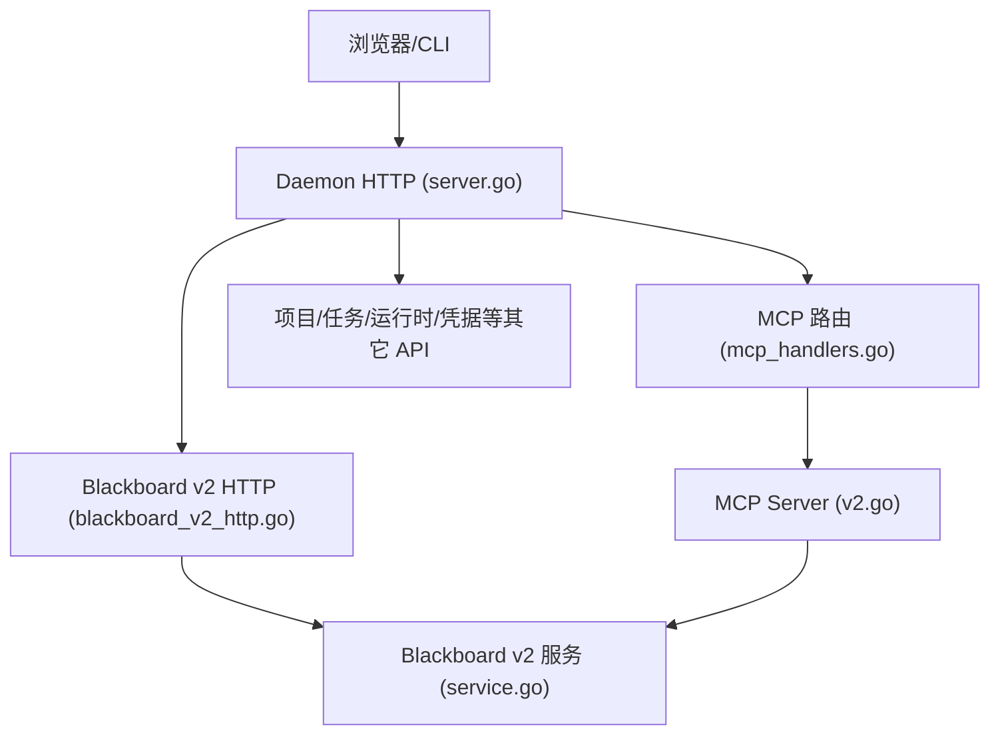
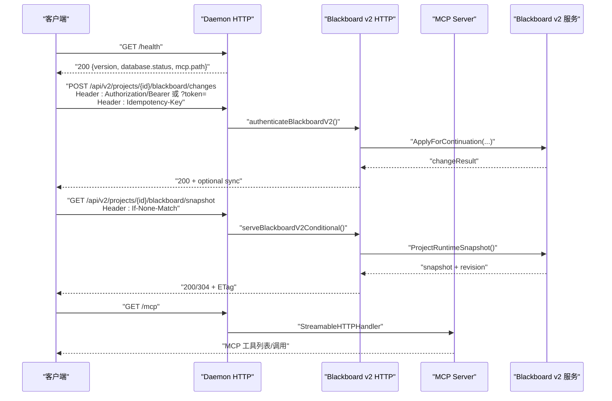
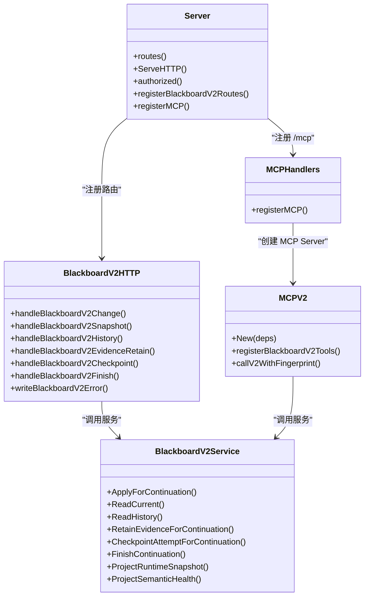

# API 参考

<cite>
**本文引用的文件**   
- [README.md](file://README.md)
- [server.go](file://internal/daemon/server.go)
- [blackboard_v2_http.go](file://internal/daemon/blackboard_v2_http.go)
- [mcp_handlers.go](file://internal/daemon/mcp_handlers.go)
- [v2.go](file://internal/mcpserver/v2.go)
- [openapi.json](file://internal/blackboardv2contract/contractdata/openapi.json)
- [blackboard-v2.schema.json](file://internal/blackboardv2contract/contractdata/schemas/blackboard-v2.schema.json)
- [relationships.json](file://internal/blackboardv2contract/contractdata/relationships.json)
- [service.go](file://internal/blackboardv2/service.go)
- [blackboard-v2-spec.md](file://docs/specs/blackboard-v2-spec.md)
</cite>

## 目录
1. [简介](#简介)
2. [项目结构](#项目结构)
3. [核心组件](#核心组件)
4. [架构总览](#架构总览)
5. [详细组件分析](#详细组件分析)
6. [依赖关系分析](#依赖关系分析)
7. [性能与一致性](#性能与一致性)
8. [故障排查指南](#故障排查指南)
9. [结论](#结论)
10. [附录：客户端实现与调试建议](#附录客户端实现与调试建议)

## 简介
本参考文档面向 CyberPenda 的 RESTful API、MCP Server 工具接口与 Blackboard v2 语义数据模型，覆盖认证方式、HTTP 端点、请求/响应 Schema、错误码、版本兼容性与客户端集成要点。系统由 Go Daemon（控制平面）、React Dashboard（前端）、Sandboxed Runtime（执行平面）与 Blackboard v2（记忆平面）组成。默认监听地址为 127.0.0.1:8787；非回环绑定需配置鉴权令牌。

**章节来源**
- [README.md](file://README.md)

## 项目结构
- cmd/pentestd：Daemon 入口
- internal/daemon：HTTP 路由、认证、Blackboard v2 HTTP 适配、MCP 路由、任务与运行时管理
- internal/mcpserver：MCP Server 注册与六个受信任 Blackboard v2 工具实现
- internal/blackboardv2：Blackboard v2 服务与快照、健康、投影等
- internal/blackboardv2contract：冻结的 OpenAPI 与 JSON Schema 契约
- web：React Dashboard
- docs/specs：Blackboard v2 规范说明

**图表来源**
- [server.go](file://internal/daemon/server.go)
- [blackboard_v2_http.go](file://internal/daemon/blackboard_v2_http.go)
- [mcp_handlers.go](file://internal/daemon/mcp_handlers.go)
- [v2.go](file://internal/mcpserver/v2.go)
- [service.go](file://internal/blackboardv2/service.go)

**章节来源**
- [server.go](file://internal/daemon/server.go)

## 核心组件
- Daemon HTTP 服务器：统一路由、鉴权（Bearer Token / ?token= / Continuation Interface Grant）、CORS 预检、静态 SPA 资源、健康检查
- Blackboard v2 HTTP 适配器：路径版本化 /api/v2，严格 JSON Schema 校验、幂等键 Idempotency-Key、ETag/If-None-Match、结构化错误信封
- MCP Server：暴露六个 Blackboard v2 受信任工具，输入基于冻结契约，返回包含可选同步附件的结构化结果
- Blackboard v2 服务：实体/关系/证据/发现/目标/尝试/解决方案/历史/健康/投影合并/连续性

**章节来源**
- [server.go](file://internal/daemon/server.go)
- [blackboard_v2_http.go](file://internal/daemon/blackboard_v2_http.go)
- [v2.go](file://internal/mcpserver/v2.go)
- [service.go](file://internal/blackboardv2/service.go)

## 架构总览

**图表来源**
- [server.go](file://internal/daemon/server.go)
- [blackboard_v2_http.go](file://internal/daemon/blackboard_v2_http.go)
- [mcp_handlers.go](file://internal/daemon/mcp_handlers.go)
- [v2.go](file://internal/mcpserver/v2.go)
- [service.go](file://internal/blackboardv2/service.go)

## 详细组件分析

### 1) 认证与安全
- 全局鉴权
  - 支持 Authorization: Bearer <token> 或查询参数 ?token=<token>
  - 非回环绑定强制要求设置 PENTEST_AUTH_TOKEN
  - Origin 校验防 DNS Rebinding，允许 host.docker.internal
- Blackboard v2 专用鉴权
  - 支持两种身份：
    - 操作者/UI：使用 daemon 鉴权 + 可选 OperatorActor 头
    - 运行时可信调用：使用 Continuation Interface Grant（Bearer）
  - V2 不接受在查询字符串中携带 bearer 凭证
- MCP 鉴权
  - 通过 StreamableHTTPHandler 解析 Bearer Grant，失败时返回结构化 authority_denied

**章节来源**
- [server.go](file://internal/daemon/server.go)
- [blackboard_v2_http.go](file://internal/daemon/blackboard_v2_http.go)
- [mcp_handlers.go](file://internal/daemon/mcp_handlers.go)

### 2) Blackboard v2 HTTP API
以下端点均位于 /api/v2/projects/{project_id} 下，所有 POST 必须携带 Idempotency-Key 请求头；GET 支持 If-None-Match 与 ETag 缓存。

- POST /api/v2/projects/{project_id}/blackboard/changes
  - 作用：原子提交语义变更批次（schema: semantic-change-batch/v2）
  - 请求体：{ schema, changes[] }
  - 响应：changeResult；可能附带 sync 附件
  - 状态码：200/400/401/403/404/409/410/422/500/503

- GET /api/v2/projects/{project_id}/blackboard/snapshot
  - 作用：获取完整运行时快照（无分页）
  - 响应：runtimeSnapshot + revision ETag；支持 304
  - 状态码：200/304/400/401/403/404/410/500/503

- GET /api/v2/projects/{project_id}/blackboard/health
  - 作用：确定性语义健康与注意力预算
  - 响应：semanticHealth + revision ETag；支持 304
  - 状态码：200/304/400/401/403/404/410/500/503

- GET /api/v2/projects/{project_id}/blackboard/records/{key}
  - 作用：读取当前语义记录详情
  - 响应：currentDetail + revision ETag；支持 304
  - 状态码：200/304/400/401/403/404/410/500/503

- GET /api/v2/projects/{project_id}/blackboard/records/{key}/history
  - 作用：分页语义历史（cursor 游标，limit 默认 20，最大 100）
  - 响应：semanticHistory；next_cursor 仅在存在下一页时返回
  - 状态码：200/400/401/403/404/410/500/503

- POST /api/v2/projects/{project_id}/blackboard/evidence:retain
  - 作用：受限的证据保留（source_path 必须在白名单根内）
  - 请求体：{ key, version?, attempt, source_path, artifact_type, summary, media_type?, captured_at?, links? }
  - 响应：changeResult；可能附带 sync
  - 状态码：200/400/401/403/404/409/410/422/500/503

- POST /api/v2/projects/{project_id}/blackboard/attempts/{key}:checkpoint
  - 作用：尝试断点（version, summary）
  - 响应：changeResult；可能附带 sync
  - 状态码：200/400/401/403/404/409/410/422/500/503

- POST /api/v2/projects/{project_id}/continuation:finish
  - 作用：结束绑定的 Continuation（空体或 {}）
  - 响应：finishResult；可能附带 sync
  - 状态码：200/400/401/403/404/409/410/422/500/503

- GET /api/v2/projects/{project_id}/reports/pentest
  - 作用：生成渗透报告（format=markdown|json，默认 markdown）
  - 响应：reportMarkdown 或 pentestReport；revision ETag；支持 304
  - 状态码：200/304/400/401/403/404/410/422/500/503

- GET /api/v2/projects/{project_id}/reports/ctf-solution
  - 作用：生成 CTF 解法报告（format=markdown|json，默认 markdown）
  - 响应：reportMarkdown 或 ctfSolution；revision ETag；支持 304
  - 状态码：200/304/400/401/403/404/410/422/500/503

注意：
- 所有错误响应统一为 { error: {...}, sync?: ... } 信封
- storage_busy 会返回 503 并带 Retry-After: 1

**章节来源**
- [blackboard_v2_http.go](file://internal/daemon/blackboard_v2_http.go)
- [openapi.json](file://internal/blackboardv2contract/contractdata/openapi.json)
- [blackboard-v2-spec.md](file://docs/specs/blackboard-v2-spec.md)

### 3) MCP Server 工具接口
MCP 端点：/mcp（StreamableHTTP，JSON Response，禁用本地 Host 保护以允许 host.docker.internal）

注册的六个受信任工具（输入基于冻结契约）：
- blackboard_change
  - 输入：ChangeBatch（含 idempotency_key）
  - 行为：按延续上下文 ApplyForContinuation；支持 exact replay 与同步附件
- blackboard_read
  - 输入：{ key }
  - 行为：ReadCurrent（仅 live 读权限）
- blackboard_history
  - 输入：{ key, cursor?, limit? }
  - 行为：ReadHistory（cursor 分页）
- blackboard_retain_evidence
  - 输入：RetainEvidenceRequest（含 idempotency_key）
  - 行为：RetainEvidenceForContinuation；支持 exact replay
- blackboard_checkpoint_attempt
  - 输入：CheckpointAttemptRequest（含 idempotency_key）
  - 行为：CheckpointAttemptForContinuation；支持 exact replay
- blackboard_finish
  - 输入：FinishContinuationRequest（含 idempotency_key）
  - 行为：FinishContinuation；支持 exact replay

每个工具调用返回 { ...payload..., "sync"?: SynchronizationAttachment } 或错误信封 { error: {...}, sync?: ... }。

**章节来源**
- [mcp_handlers.go](file://internal/daemon/mcp_handlers.go)
- [v2.go](file://internal/mcpserver/v2.go)

### 4) 数据模型与契约
- OpenAPI 3.1 定义：internal/blackboardv2contract/contractdata/openapi.json
- JSON Schema 定义：internal/blackboardv2contract/contractdata/schemas/blackboard-v2.schema.json
- 关系矩阵：internal/blackboardv2contract/contractdata/relationships.json

主要类型（节选）：
- 基础类型：blackboardKey、semanticText、conciseText、nonEmptyText、version、revision、scopeStatus
- 记录类型：entityRecord、objectiveRecord、attemptRecord、factRecord、findingInputRecord、findingRecord、solutionRecord、evidenceRecord、evidenceInputRecord
- 历史类型：historical*Record（如 historicalEntityRecord、historicalFindingRecord 等）
- 关系类型：relationType（about/part_of/tests/produced/evidences/supports/contradicts/derived_from/depends_on/satisfies/supersedes）

快照与投影：
- RuntimeSnapshot 聚合 entity/objective/attempt/fact/finding/solution/evidence 等映射
- 健康诊断与注意力预算由 ProjectSemanticHealth 提供

**章节来源**
- [openapi.json](file://internal/blackboardv2contract/contractdata/openapi.json)
- [blackboard-v2.schema.json](file://internal/blackboardv2contract/contractdata/schemas/blackboard-v2.schema.json)
- [relationships.json](file://internal/blackboardv2contract/contractdata/relationships.json)
- [service.go](file://internal/blackboardv2/service.go)

### 5) 错误码与状态码映射
- 语义错误统一信封：{ error: { code, message, path, retryable }, sync?: ... }
- HTTP 状态映射（示例）：
  - invalid_schema → 400
  - authority_denied（authorization）→ 401，否则 403
  - not_found → 404
  - closed_continuation → 410
  - version_conflict/key_conflict/relationship_conflict/idempotency_conflict/finish_conflict → 409
  - semantic_validation/continuation_open_attempts/continuation_pending_writes/project_kind_mismatch → 422
  - storage_busy → 503（带 Retry-After）
  - internal → 500

**章节来源**
- [blackboard_v2_http.go](file://internal/daemon/blackboard_v2_http.go)

### 6) 版本兼容性
- Blackboard v2 采用“单一版本化 Project Interface”，替换旧版 graph-v1 工具/路由目录
- 新增能力仅以增量方式演进，不维护向后兼容别名
- 快照与健康接口使用 revision ETag，客户端应正确处理 304

**章节来源**
- [blackboard-v2-spec.md](file://docs/specs/blackboard-v2-spec.md)

## 依赖关系分析

**图表来源**
- [server.go](file://internal/daemon/server.go)
- [blackboard_v2_http.go](file://internal/daemon/blackboard_v2_http.go)
- [mcp_handlers.go](file://internal/daemon/mcp_handlers.go)
- [v2.go](file://internal/mcpserver/v2.go)
- [service.go](file://internal/blackboardv2/service.go)

**章节来源**
- [server.go](file://internal/daemon/server.go)
- [blackboard_v2_http.go](file://internal/daemon/blackboard_v2_http.go)
- [mcp_handlers.go](file://internal/daemon/mcp_handlers.go)
- [v2.go](file://internal/mcpserver/v2.go)
- [service.go](file://internal/blackboardv2/service.go)

## 性能与一致性
- 幂等性：所有写操作通过 Idempotency-Key 保证精确重放与去抖
- 一致性：SQLite 写入锁忙时返回 503 并提示重试；客户端应实现指数退避
- 缓存：GET 快照/健康/详情使用 revision ETag，客户端可缓存并发送 If-None-Match
- 同步附件：当请求具备稳定指纹且存在 Pending 同步时，服务端会在成功或失败路径附加 sync，确保下一次可信响应携带完整新快照

**章节来源**
- [blackboard_v2_http.go](file://internal/daemon/blackboard_v2_http.go)
- [v2.go](file://internal/mcpserver/v2.go)

## 故障排查指南
- 常见 4xx
  - 400 invalid_schema：请求体不符合冻结 Schema；检查字段名、必填项与长度限制
  - 401/403 authority_denied：缺少或无效 Bearer Grant；确认 token 未过期且 project_id 匹配
  - 404 not_found：项目或记录不存在
  - 409 conflict：版本冲突/键冲突/关系冲突/幂等冲突/完成冲突；检查并发写入与 finish 顺序
  - 410 gone：Continuation 已关闭；无法再执行需要 live 权限的操作
  - 422 unprocessable_entity：语义校验失败（如未完成尝试、待处理写入等）
- 常见 5xx
  - 500 internal：内部错误；查看服务端日志
  - 503 service_unavailable：存储忙；等待并重试（遵循 Retry-After）
- 调试建议
  - 使用 /health 探测服务可用性
  - 对 GET 接口启用 If-None-Match 减少带宽
  - 对 POST 接口始终设置唯一 Idempotency-Key
  - 观察响应中的 sync 附件，必要时二次拉取最新快照

**章节来源**
- [blackboard_v2_http.go](file://internal/daemon/blackboard_v2_http.go)
- [openapi.json](file://internal/blackboardv2contract/contractdata/openapi.json)

## 结论
CyberPenda 的 API 以 Blackboard v2 为核心，通过严格的契约（OpenAPI/Schema）、幂等键与 ETag 机制保障一致性与可靠性；MCP 工具将语义操作封装为受信任调用，适合沙箱运行器安全交互。客户端应遵循认证、幂等、缓存与重试策略，结合健康检查与错误信封进行健壮集成。

## 附录：客户端实现与调试建议
- 认证
  - 操作者/UI：Authorization: Bearer <daemon-token>
  - 运行时可信：Authorization: Bearer <Continuation Interface Grant>
  - 查询参数 ?token= 可用于无法设置头的场景（但 V2 禁止在查询串传 bearer）
- 请求模板
  - 所有 POST 添加 Header: Idempotency-Key: <unique>
  - GET 快照/健康/详情添加 Header: If-None-Match: "<revision>"
- 错误处理
  - 解析 { error: {...}, sync?: ... } 信封
  - 遇到 503 时按 Retry-After 重试；遇到 409/422 修正请求后重试
- SDK 与工具
  - 可使用任意 HTTP 客户端（curl、fetch、axios）直接调用 /api/v2/*
  - MCP 客户端连接 /mcp，调用六个工具名称
- 调试命令示例
  - curl -i http://127.0.0.1:8787/health
  - curl -X POST -H "Authorization: Bearer ..." -H "Idempotency-Key: ..." -d '{"schema":"semantic-change-batch/v2","changes":[...]}' http://127.0.0.1:8787/api/v2/projects/<id>/blackboard/changes
  - curl -i -H "If-None-Match: \"<revision>\"" http://127.0.0.1:8787/api/v2/projects/<id>/blackboard/snapshot

[本节为通用指导，不直接分析具体文件]