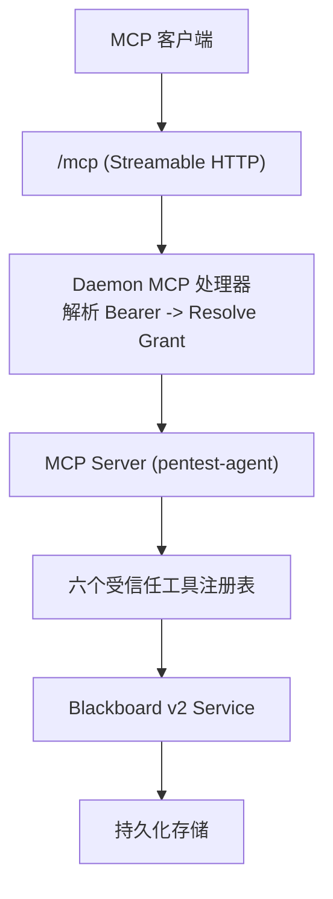
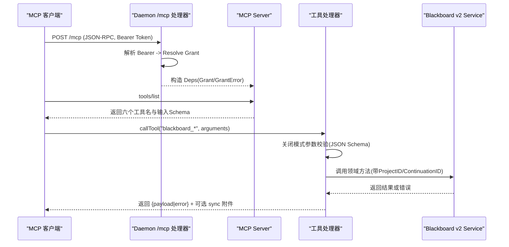
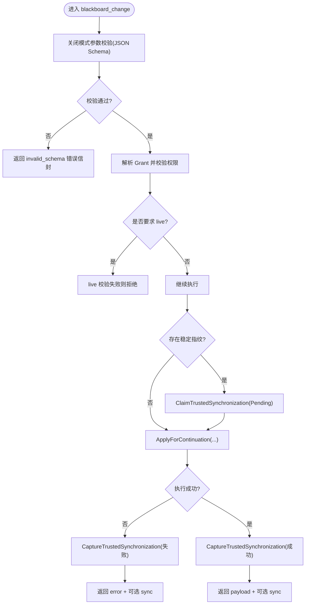
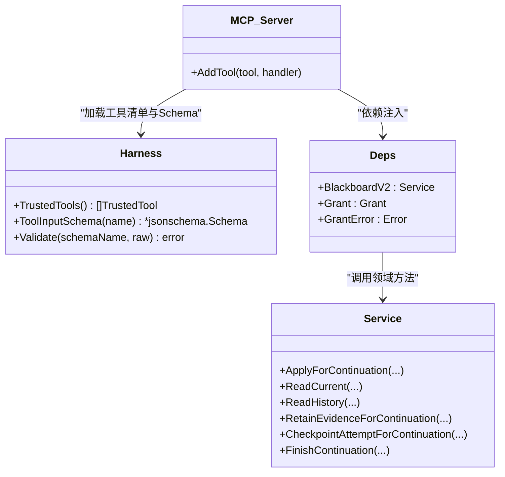

# MCP 工具接口

<cite>
**本文引用的文件**   
- [internal/mcpserver/v2.go](file://internal/mcpserver/v2.go)
- [internal/daemon/mcp_handlers.go](file://internal/daemon/mcp_handlers.go)
- [internal/blackboardv2contract/contract.go](file://internal/blackboardv2contract/contract.go)
- [internal/blackboardv2contract/contractdata/trusted-tools.json](file://internal/blackboardv2contract/contractdata/trusted-tools.json)
- [internal/blackboardv2contract/contractdata/schemas/blackboard-v2.schema.json](file://internal/blackboardv2contract/contractdata/schemas/blackboard-v2.schema.json)
- [internal/blackboardv2/service.go](file://internal/blackboardv2/service.go)
- [internal/daemon/trusted_mcp_smoke_test.go](file://internal/daemon/trusted_mcp_smoke_test.go)
- [scripts/smoke-sandbox-mcp-live.sh](file://scripts/smoke-sandbox-mcp-live.sh)
</cite>

## 目录
1. [简介](#简介)
2. [项目结构](#项目结构)
3. [核心组件](#核心组件)
4. [架构总览](#架构总览)
5. [详细组件分析](#详细组件分析)
6. [依赖关系分析](#依赖关系分析)
7. [性能与幂等性](#性能与幂等性)
8. [故障排查指南](#故障排查指南)
9. [结论](#结论)
10. [附录：MCP 客户端实现示例](#附录mcp-客户端实现示例)

## 简介
本文件面向使用 CyberPenda 的模型侧运行时（Runtime），系统化说明 Blackboard v2 的六个 MCP 工具：blackboard_change、blackboard_read、blackboard_history、blackboard_retain_evidence、blackboard_checkpoint_attempt、blackboard_finish。文档覆盖工具发现、消息协议、会话与授权、错误处理、幂等与同步附件，并给出 MCP 客户端连接与调用流程建议，以及与 HTTP API 的差异和选型建议。

## 项目结构
- MCP Server 注册与路由
  - 通过 Daemon 的 /mcp 端点暴露 Streamable HTTP 传输，解析 Bearer Token 并解析 Continuation Interface Grant，绑定到每个请求的 Deps。
- 工具契约与输入校验
  - 从内嵌契约清单加载六个受信任工具名、描述及输入/结果 JSON Schema；按工具名分发到具体处理器，统一走“关闭模式”的参数校验与错误信封。
- 领域服务
  - 所有工具最终委托给 blackboardv2.Service 的对应方法，完成语义变更、读取、历史分页、证据保留、尝试检查点与结束。

图表来源
- [internal/daemon/mcp_handlers.go:14-43](file://internal/daemon/mcp_handlers.go#L14-L43)
- [internal/mcpserver/v2.go:34-44](file://internal/mcpserver/v2.go#L34-L44)
- [internal/mcpserver/v2.go:46-156](file://internal/mcpserver/v2.go#L46-L156)
- [internal/blackboardv2/service.go:644-656](file://internal/blackboardv2/service.go#L644-L656)

章节来源
- [internal/daemon/mcp_handlers.go:14-43](file://internal/daemon/mcp_handlers.go#L14-L43)
- [internal/mcpserver/v2.go:34-44](file://internal/mcpserver/v2.go#L34-L44)

## 核心组件
- MCP 服务器与工具注册
  - 名称与版本：pentest-agent/0.1.0
  - 工具清单由契约文件提供，包含六个工具名、描述、输入/结果 Schema 引用。
- 参数校验与错误信封
  - 所有工具参数均通过冻结的 JSON Schema 进行严格校验；失败返回 invalid_schema 错误信封，避免泄露 SDK 内部文本。
- 授权与权限边界
  - 仅接受 Continuation Interface Grant；HTTP 路径不携带 Project/Task/Continuation 标识，这些身份由服务端根据 Grant 解析并注入。
- 同步与幂等
  - 写操作支持基于 IdempotencyKey 的请求指纹；在 Pending 状态下可 ClaimTrustedSynchronization，并在成功或失败时附带 SynchronizationAttachment，供后续重试精确重放。

章节来源
- [internal/mcpserver/v2.go:34-44](file://internal/mcpserver/v2.go#L34-L44)
- [internal/mcpserver/v2.go:46-156](file://internal/mcpserver/v2.go#L46-L156)
- [internal/mcpserver/v2.go:168-192](file://internal/mcpserver/v2.go#L168-L192)
- [internal/mcpserver/v2.go:194-248](file://internal/mcpserver/v2.go#L194-L248)
- [internal/blackboardv2contract/contractdata/trusted-tools.json:1-44](file://internal/blackboardv2contract/contractdata/trusted-tools.json#L1-L44)

## 架构总览
下图展示了 MCP 请求从客户端到领域服务的完整链路，包括授权、参数校验、幂等与同步附件的附加逻辑。

图表来源
- [internal/daemon/mcp_handlers.go:14-43](file://internal/daemon/mcp_handlers.go#L14-L43)
- [internal/mcpserver/v2.go:34-44](file://internal/mcpserver/v2.go#L34-L44)
- [internal/mcpserver/v2.go:46-156](file://internal/mcpserver/v2.go#L46-L156)
- [internal/mcpserver/v2.go:194-248](file://internal/mcpserver/v2.go#L194-L248)

## 详细组件分析

### 工具发现与消息协议
- 工具发现
  - 客户端通过 tools/list 获取六个工具名与输入 Schema。测试用例验证工具集合恰好为六个且无多余项。
- 传输协议
  - 采用 Streamable HTTP，JSONResponse 模式；沙箱运行时通过 host.docker.internal 访问，禁用本地回环保护。
- 认证
  - 请求头携带 Bearer Token；若配置了 operator token，则需匹配；随后用该 Token 解析 Continuation Interface Grant，作为本次会话的唯一权限来源。

章节来源
- [internal/daemon/trusted_mcp_smoke_test.go:255-282](file://internal/daemon/trusted_mcp_smoke_test.go#L255-L282)
- [internal/daemon/mcp_handlers.go:14-43](file://internal/daemon/mcp_handlers.go#L14-L43)
- [scripts/smoke-sandbox-mcp-live.sh:29-60](file://scripts/smoke-sandbox-mcp-live.sh#L29-L60)

### 通用参数校验与错误信封
- 参数校验
  - 所有工具参数先经冻结 JSON Schema 校验，再反序列化为领域 DTO；空对象会被规范化为 {}。
- 错误信封
  - 校验失败返回 invalid_schema；业务错误封装为统一 Error 结构体，包含 code/message/path/retryable/details；异常包装为 internal。

章节来源
- [internal/mcpserver/v2.go:168-192](file://internal/mcpserver/v2.go#L168-L192)
- [internal/mcpserver/v2.go:290-315](file://internal/mcpserver/v2.go#L290-L315)
- [internal/blackboardv2/service.go:616-630](file://internal/blackboardv2/service.go#L616-L630)

### 授权与权限边界
- 仅接受 Continuation Interface Grant；未提供或无效将返回 authority_denied。
- 读/写能力区分：部分读工具要求 live 状态；写工具允许非 live 的重放但拒绝新写入。

章节来源
- [internal/mcpserver/v2.go:208-248](file://internal/mcpserver/v2.go#L208-L248)
- [internal/mcpserver/v2.go:250-258](file://internal/mcpserver/v2.go#L250-L258)

### 幂等与同步附件
- 幂等键
  - change/retain/checkpoint/finish 四个写工具以 IdempotencyKey 生成请求指纹；Pending 时可 ClaimTrustedSynchronization，确保重试精确重放。
- 同步附件
  - 成功或失败均可附带 SynchronizationAttachment，用于下一次可信响应携带最新 Runtime Blackboard Snapshot。

章节来源
- [internal/mcpserver/v2.go:194-248](file://internal/mcpserver/v2.go#L194-L248)

### 六大工具详解

#### blackboard_change
- 功能
  - 对已绑定 Project 应用一个原子 semantic-change-batch/v2；适合批量创建/更新实体、事实、发现、关系等。
- 输入
  - 输入 Schema 为 changeBatch；关键字段包括 schema、idempotency_key、changes。
- 输出
  - 返回 changeResult，包含 revision、变更记录、关系变更记录与工作快照指针。
- 幂等与同步
  - 支持基于 idempotency_key 的精确重放；可能附带 sync 附件。
- 典型用法
  - 初始化目标实体、创建 Objective/Attempt、建立 tests 关系等。

章节来源
- [internal/mcpserver/v2.go:71-84](file://internal/mcpserver/v2.go#L71-L84)
- [internal/blackboardv2/service.go:644-656](file://internal/blackboardv2/service.go#L644-L656)
- [internal/blackboardv2/service.go:414-481](file://internal/blackboardv2/service.go#L414-L481)
- [internal/blackboardv2contract/contractdata/trusted-tools.json:6-11](file://internal/blackboardv2contract/contractdata/trusted-tools.json#L6-L11)

#### blackboard_read
- 功能
  - 按 Blackboard Key 读取当前完整语义记录及其当前关系。
- 输入
  - 输入 Schema 为 readRequest，仅含 key。
- 输出
  - 返回 currentDetail，包含 record 与 relationships。
- 权限
  - 需要 live 状态；关闭的 Continuation 不允许当前知识读取。

章节来源
- [internal/mcpserver/v2.go:85-99](file://internal/mcpserver/v2.go#L85-L99)
- [internal/blackboardv2/service.go:483-492](file://internal/blackboardv2/service.go#L483-L492)
- [internal/blackboardv2contract/contractdata/trusted-tools.json:12-17](file://internal/blackboardv2contract/contractdata/trusted-tools.json#L12-L17)

#### blackboard_history
- 功能
  - 按 Blackboard Key 读取显式游标分页的语义历史。
- 输入
  - 输入 Schema 为 historyRequest，包含 key、cursor、limit。
- 输出
  - 返回 semanticHistory，包含 items 与 next_cursor。
- 权限
  - 需要 live 状态。

章节来源
- [internal/mcpserver/v2.go:100-113](file://internal/mcpserver/v2.go#L100-L113)
- [internal/blackboardv2/service.go:497-523](file://internal/blackboardv2/service.go#L497-L523)
- [internal/blackboardv2contract/contractdata/trusted-tools.json:18-23](file://internal/blackboardv2contract/contractdata/trusted-tools.json#L18-L23)

#### blackboard_retain_evidence
- 功能
  - 保留由开放 Attempt 产生的受限 Evidence 载荷，服务端派生 managed_path/sha256/size 等完整性字段。
- 输入
  - 输入 Schema 为 retainEvidenceRequest，包含 key、attempt、source_path、artifact_type、summary 等。
- 输出
  - 返回 changeResult。
- 幂等与同步
  - 支持基于 idempotency_key 的精确重放；可能附带 sync 附件。

章节来源
- [internal/mcpserver/v2.go:114-125](file://internal/mcpserver/v2.go#L114-L125)
- [internal/blackboardv2/service.go:340-359](file://internal/blackboardv2/service.go#L340-L359)
- [internal/blackboardv2contract/contractdata/trusted-tools.json:24-29](file://internal/blackboardv2contract/contractdata/trusted-tools.json#L24-L29)

#### blackboard_checkpoint_attempt
- 功能
  - 为所属开放 Attempt 的版本化摘要，参与待处理的 Blackboard 同步。
- 输入
  - 输入 Schema 为 checkpointAttemptRequest，包含 version、summary。
- 输出
  - 返回 changeResult。
- 幂等与同步
  - 支持基于 idempotency_key 的精确重放；可能附带 sync 附件。

章节来源
- [internal/mcpserver/v2.go:126-137](file://internal/mcpserver/v2.go#L126-L137)
- [internal/blackboardv2contract/contractdata/trusted-tools.json:30-35](file://internal/blackboardv2contract/contractdata/trusted-tools.json#L30-L35)

#### blackboard_finish
- 功能
  - 在完成其下所有 Attempts 后结束已绑定 Continuation；不接受任务摘要或结果副本。
- 输入
  - 输入 Schema 为 finishRequest（空对象）。
- 输出
  - 返回 finishResult。
- 幂等与同步
  - 支持基于 idempotency_key 的精确重放；可能附带 sync 附件。

章节来源
- [internal/mcpserver/v2.go:138-151](file://internal/mcpserver/v2.go#L138-L151)
- [internal/blackboardv2contract/contractdata/trusted-tools.json:36-41](file://internal/blackboardv2contract/contractdata/trusted-tools.json#L36-L41)

### 数据流与处理逻辑（以 change 为例）

图表来源
- [internal/mcpserver/v2.go:71-84](file://internal/mcpserver/v2.go#L71-L84)
- [internal/mcpserver/v2.go:194-248](file://internal/mcpserver/v2.go#L194-L248)

## 依赖关系分析
- 契约层
  - trusted-tools.json 定义六个工具名、描述与输入/结果 Schema 引用；contract.go 负责加载与校验，并提供 ToolInputSchema 裁剪 $defs 的能力。
- 服务层
  - mcpserver/v2.go 将工具名映射到具体处理器，统一走 decodeV2ToolArgs 与 serveV2WithFingerprint。
- 领域层
  - blackboardv2/service.go 提供 ApplyForContinuation、ReadCurrent、ReadHistory、RetainEvidenceForContinuation、CheckpointAttemptForContinuation、FinishContinuation 等方法。

图表来源
- [internal/blackboardv2contract/contract.go:252-290](file://internal/blackboardv2contract/contract.go#L252-L290)
- [internal/mcpserver/v2.go:34-44](file://internal/mcpserver/v2.go#L34-L44)
- [internal/mcpserver/v2.go:46-156](file://internal/mcpserver/v2.go#L46-L156)
- [internal/blackboardv2/service.go:644-656](file://internal/blackboardv2/service.go#L644-L656)

章节来源
- [internal/blackboardv2contract/contract.go:252-290](file://internal/blackboardv2contract/contract.go#L252-L290)
- [internal/mcpserver/v2.go:34-44](file://internal/mcpserver/v2.go#L34-L44)
- [internal/mcpserver/v2.go:46-156](file://internal/mcpserver/v2.go#L46-L156)
- [internal/blackboardv2/service.go:644-656](file://internal/blackboardv2/service.go#L644-L656)

## 性能与幂等性
- 幂等键
  - 写工具必须提供唯一 idempotency_key；相同指纹的请求在服务端会精确重放，避免重复副作用。
- 同步附件
  - 即使语义操作失败，也可能附带 sync 附件，以便下次可信响应携带最新快照，减少往返。
- 只读优化
  - read/history 为 Pending-only 且无持久指纹，适合高频轮询；注意 live 限制。

章节来源
- [internal/mcpserver/v2.go:194-248](file://internal/mcpserver/v2.go#L194-L248)

## 故障排查指南
- 常见错误码
  - invalid_schema：参数不符合冻结 Schema；检查必填字段、类型与长度限制。
  - authority_denied：缺少有效 Continuation Interface Grant 或权限被撤销。
  - internal：未预期的内部错误；查看日志与堆栈。
- 调试步骤
  - 确认 /mcp 可达与 Bearer Token 正确；tools/list 应返回六个工具。
  - 对 write 工具，确保 idempotency_key 全局唯一；观察是否出现 pending 同步。
  - 对 read/history，确认 Continuation 处于 live 状态。
- 参考断言
  - 测试用例断言工具集合与行为一致性，可作为回归基线。

章节来源
- [internal/mcpserver/v2.go:290-315](file://internal/mcpserver/v2.go#L290-L315)
- [internal/daemon/trusted_mcp_smoke_test.go:255-282](file://internal/daemon/trusted_mcp_smoke_test.go#L255-L282)

## 结论
Blackboard v2 的 MCP 工具以“关闭模式”的契约驱动，结合 Continuation Interface Grant 与服务端权威，实现了安全、可审计、可重放的语义交互。通过统一的参数校验、错误信封与同步附件机制，既保证了可靠性，又简化了客户端实现复杂度。建议在沙箱/代理场景优先使用 MCP，而在外部系统直连时使用 HTTP API。

## 附录：MCP 客户端实现示例
以下示例为概念性流程，便于快速上手。实际实现请参考仓库中的测试与脚本。

- 连接建立
  - 使用 Streamable HTTP 连接到 /mcp，设置 Content-Type 与 Accept 头；必要时携带 Authorization: Bearer <token>。
- 工具发现
  - 调用 tools/list，确认返回六个工具名与输入 Schema。
- 调用工具
  - 针对 blackboard_change 等写工具，生成唯一 idempotency_key；按输入 Schema 组装 arguments。
  - 对于 read/history，传入 key 与可选 cursor/limit。
- 结果处理
  - 成功：解析 JSON 正文；若存在 sync 附件，保存以供下次重试携带。
  - 失败：解析 error 信封，依据 code 与 retryable 决定重试策略。
- 异常管理
  - 网络/超时：指数退避重试；幂等键不变。
  - invalid_schema：修正参数后再试。
  - authority_denied：刷新或重新申请 Continuation Interface Grant。

章节来源
- [scripts/smoke-sandbox-mcp-live.sh:29-60](file://scripts/smoke-sandbox-mcp-live.sh#L29-L60)
- [internal/daemon/trusted_mcp_smoke_test.go:255-282](file://internal/daemon/trusted_mcp_smoke_test.go#L255-L282)