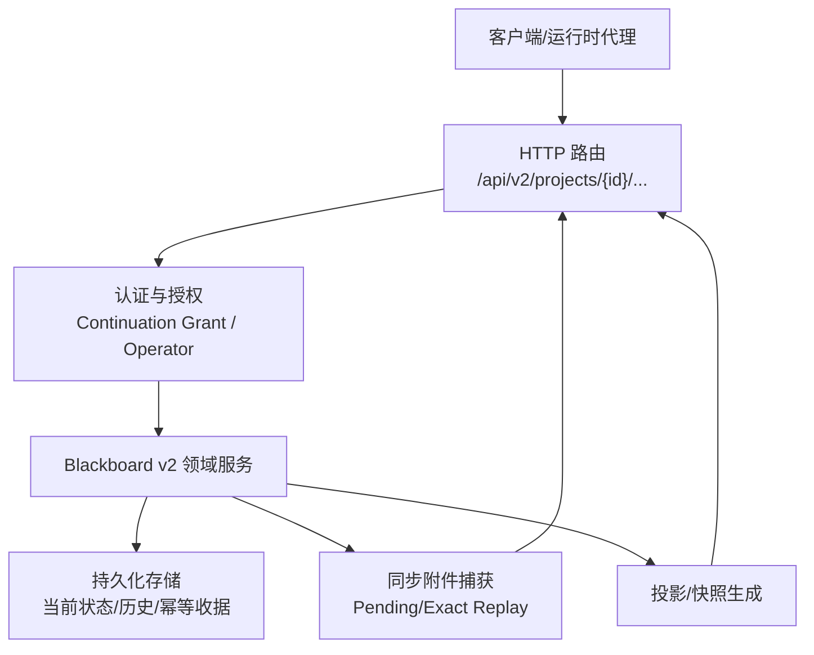
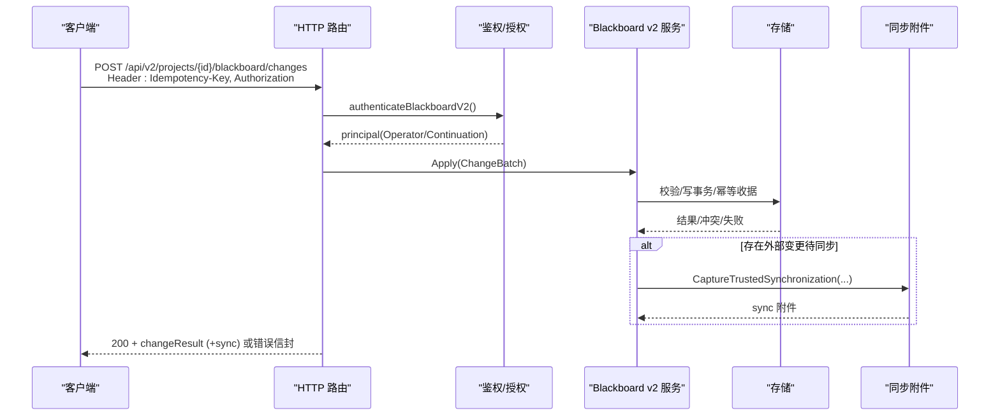
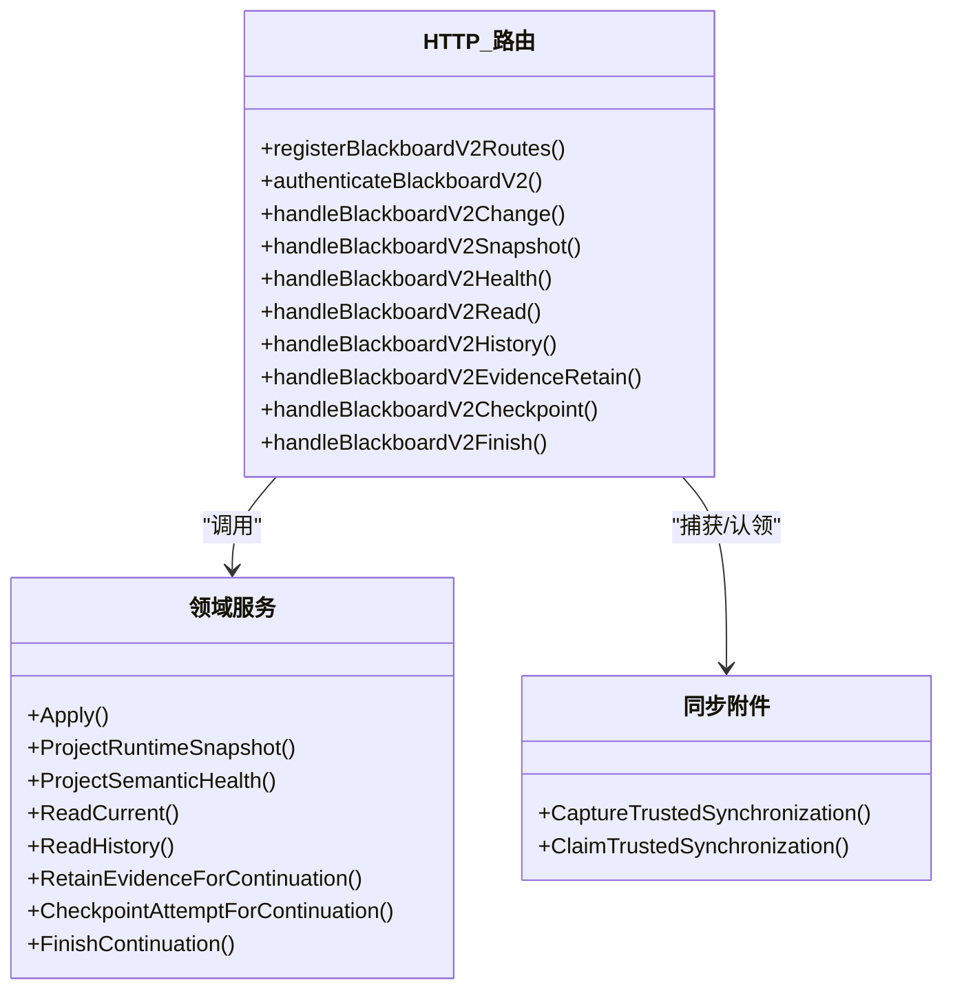

# Blackboard v2 操作接口

<cite>
**本文引用的文件**
- [internal/daemon/blackboard_v2_http.go](file://internal/daemon/blackboard_v2_http.go)
- [docs/specs/blackboard-v2-spec.md](file://docs/specs/blackboard-v2-spec.md)
- [internal/blackboardv2contract/contractdata/openapi.json](file://internal/blackboardv2contract/contractdata/openapi.json)
- [internal/blackboardv2contract/contractdata/schemas/blackboard-v2.schema.json](file://internal/blackboardv2contract/contractdata/schemas/blackboard-v2.schema.json)
- [internal/blackboardv2/finish.go](file://internal/blackboardv2/finish.go)
- [internal/blackboardv2/evidence.go](file://internal/blackboardv2/evidence.go)
- [internal/blackboardv2/projection_service_test.go](file://internal/blackboardv2/projection_service_test.go)
- [internal/blackboardv2/entity_service_test.go](file://internal/blackboardv2/entity_service_test.go)
- [internal/blackboardv2/objective_attempt_service_test.go](file://internal/blackboardv2/objective_attempt_service_test.go)
- [internal/blackboardv2/merge_service_test.go](file://internal/blackboardv2/merge_service_test.go)
- [internal/daemon/blackboard_v2_http_test.go](file://internal/daemon/blackboard_v2_http_test.go)
</cite>

## 目录
1. [简介](#简介)
2. [项目结构](#项目结构)
3. [核心组件](#核心组件)
4. [架构总览](#架构总览)
5. [详细端点说明](#详细端点说明)
6. [依赖关系分析](#依赖关系分析)
7. [性能与一致性特性](#性能与一致性特性)
8. [故障排查指南](#故障排查指南)
9. [结论](#结论)
10. [附录：示例与最佳实践](#附录示例与最佳实践)

## 简介
Blackboard v2 是项目的“语义记忆平面”，为每个 Project 提供当前工作（探索目标、尝试）、项目知识（实体、事实、发现、解决方案、证据）及其类型化关系的紧凑快照。它通过路径版本化的 HTTP v2 暴露统一语义契约，支持原子性语义变更批处理、运行时快照、健康检查、记录读取与历史分页、受限的证据保留、尝试检查点以及 Continuation 结束等能力。认证采用 Continuation Interface Grant（Bearer）或 Daemon 管理员身份；幂等性通过 Idempotency-Key 保障；ETag 基于项目级 revision 实现条件缓存。

## 项目结构
本 API 由 Daemon 的 HTTP 路由层将请求分发到 Blackboard v2 领域服务，后者负责语义校验、持久化、投影与同步附件拼装。OpenAPI 与 JSON Schema 作为机器可读契约，驱动 UI、测试与集成验证。

图表来源
- [internal/daemon/blackboard_v2_http.go:29-46](file://internal/daemon/blackboard_v2_http.go#L29-L46)
- [internal/daemon/blackboard_v2_http.go:368-438](file://internal/daemon/blackboard_v2_http.go#L368-L438)
- [docs/specs/blackboard-v2-spec.md:275-307](file://docs/specs/blackboard-v2-spec.md#L275-L307)

章节来源
- [internal/daemon/blackboard_v2_http.go:29-46](file://internal/daemon/blackboard_v2_http.go#L29-L46)
- [docs/specs/blackboard-v2-spec.md:275-307](file://docs/specs/blackboard-v2-spec.md#L275-L307)

## 核心组件
- HTTP 路由与鉴权：注册 /api/v2 语义端点，解析 Bearer Token 或 Daemon 管理员身份，校验 Project 与 Grant 匹配，拒绝在查询字符串中传递 token。
- 语义变更批处理：统一的 semantic-change-batch/v2 信封，包含 create/update/transition/relate/unrelate/merge/supersede 等操作，按顺序原子执行并返回 changeResult。
- 运行时快照：runtime-blackboard/v2 完整拓扑，带 revision 与 ETag，支持 If-None-Match 条件响应。
- 健康检查：返回确定性语义健康与注意力预算指标。
- 记录读取与历史：按 key 获取当前详情或分页历史（cursor + limit）。
- 受限证据保留：仅允许特定字段与链接，自动派生 produced 关系。
- 尝试检查点：更新 Attempt 摘要并参与同步。
- Continuation 结束：要求所有 Owned Attempts 已终态，应用 pending 同步附件，关闭后续写入。

章节来源
- [internal/daemon/blackboard_v2_http.go:52-95](file://internal/daemon/blackboard_v2_http.go#L52-L95)
- [docs/specs/blackboard-v2-spec.md:185-234](file://docs/specs/blackboard-v2-spec.md#L185-L234)
- [docs/specs/blackboard-v2-spec.md:275-307](file://docs/specs/blackboard-v2-spec.md#L275-L307)

## 架构总览
下图展示一次典型“语义变更批处理”的调用链，包括幂等键校验、Continuation 绑定、同步附件捕获与错误映射。

图表来源
- [internal/daemon/blackboard_v2_http.go:97-125](file://internal/daemon/blackboard_v2_http.go#L97-L125)
- [internal/daemon/blackboard_v2_http.go:368-438](file://internal/daemon/blackboard_v2_http.go#L368-L438)
- [docs/specs/blackboard-v2-spec.md:235-250](file://docs/specs/blackboard-v2-spec.md#L235-L250)

## 详细端点说明

### 通用约定
- 认证
  - 运行时代理：Authorization: Bearer <Continuation Interface Grant>
  - 操作员/UI：Daemon 管理员令牌或无令牌（取决于配置），需携带 operator 标识头
  - 禁止在查询参数中传递 token
- 幂等性
  - 所有 POST 必须携带 Idempotency-Key 请求头
  - 相同 key 的重复请求返回原始语义结果；不同语义使用相同 key 会冲突
- 条件缓存
  - GET Snapshot/Detail/Health 返回 ETag="revision"，支持 If-None-Match；命中则 304
- 错误信封
  - 统一 { error: { code, message, path, retryable, details } }，可能附带 sync 附件
- 同步附件
  - 当检测到其他任务改变了共享项目知识时，成功或某些语义错误可附带 sync，内含完整 runtime-blackboard/v2 快照与原因

章节来源
- [internal/daemon/blackboard_v2_http.go:52-95](file://internal/daemon/blackboard_v2_http.go#L52-L95)
- [internal/daemon/blackboard_v2_http.go:440-471](file://internal/daemon/blackboard_v2_http.go#L440-L471)
- [internal/daemon/blackboard_v2_http.go:500-513](file://internal/daemon/blackboard_v2_http.go#L500-L513)
- [docs/specs/blackboard-v2-spec.md:275-307](file://docs/specs/blackboard-v2-spec.md#L275-L307)

---

### 1) 原子性语义变更批处理
- 方法/路径
  - POST /api/v2/projects/{project_id}/blackboard/changes
- 请求头
  - Authorization: Bearer <Continuation Interface Grant> 或 Daemon 管理员
  - Idempotency-Key: 必填
- 请求体 schema
  - schema: "semantic-change-batch/v2"
  - changes: 数组，每项含 op 及对应字段（create/update/transition/relate/unrelate/merge/supersede）
- 响应
  - 200: changeResult（包含 revision、records、relations、working_snapshot）
  - 可能附带 sync 附件
- 状态码
  - 400 无效模式/JSON
  - 401 未认证
  - 403 权限不足
  - 404 不存在
  - 409 版本/键/关系/幂等冲突
  - 410 已关闭的 Continuation
  - 422 语义校验失败（生命周期守卫、关系规则、长度限制等）
  - 503 存储忙（Retry-After）
  - 500 内部错误

章节来源
- [internal/daemon/blackboard_v2_http.go:97-125](file://internal/daemon/blackboard_v2_http.go#L97-L125)
- [docs/specs/blackboard-v2-spec.md:185-234](file://docs/specs/blackboard-v2-spec.md#L185-L234)
- [internal/blackboardv2contract/contractdata/openapi.json:17-100](file://internal/blackboardv2contract/contractdata/openapi.json#L17-L100)
- [internal/blackboardv2contract/contractdata/schemas/blackboard-v2.schema.json:1-120](file://internal/blackboardv2contract/contractdata/schemas/blackboard-v2.schema.json#L1-L120)

---

### 2) 运行时快照
- 方法/路径
  - GET /api/v2/projects/{project_id}/blackboard/snapshot
- 请求头
  - Authorization: Bearer 或 Daemon 管理员
  - If-None-Match: 可选，用于条件缓存
- 响应
  - 200: runtime-blackboard/v2 完整快照（work/knowledge/relations），带 ETag="revision"
  - 304: 未修改
- 状态码
  - 400/401/403/404/410/500/503

章节来源
- [internal/daemon/blackboard_v2_http.go:127-142](file://internal/daemon/blackboard_v2_http.go#L127-L142)
- [docs/specs/blackboard-v2-spec.md:93-141](file://docs/specs/blackboard-v2-spec.md#L93-L141)
- [internal/daemon/blackboard_v2_http_test.go:553-579](file://internal/daemon/blackboard_v2_http_test.go#L553-L579)
- [internal/blackboardv2contract/contractdata/openapi.json:102-159](file://internal/blackboardv2contract/contractdata/openapi.json#L102-L159)

---

### 3) 健康检查
- 方法/路径
  - GET /api/v2/projects/{project_id}/blackboard/health
- 请求头
  - Authorization: Bearer 或 Daemon 管理员
  - If-None-Match: 可选
- 响应
  - 200: 语义健康与注意力预算（revision 驱动的 ETag）
  - 304: 未修改
- 状态码
  - 400/401/403/404/410/500/503

章节来源
- [internal/daemon/blackboard_v2_http.go:144-159](file://internal/daemon/blackboard_v2_http.go#L144-L159)
- [docs/specs/blackboard-v2-spec.md:337-343](file://docs/specs/blackboard-v2-spec.md#L337-L343)
- [internal/blackboardv2contract/contractdata/openapi.json:161-218](file://internal/blackboardv2contract/contractdata/openapi.json#L161-L218)

---

### 4) 记录读取
- 方法/路径
  - GET /api/v2/projects/{project_id}/blackboard/records/{key}
- 请求头
  - Authorization: Bearer 或 Daemon 管理员
  - If-None-Match: 可选
- 响应
  - 200: 当前语义详情（schema、revision、canonical key、type、version、record、current relations）
  - 304: 未修改
- 状态码
  - 400/401/403/404/410/500/503

章节来源
- [internal/daemon/blackboard_v2_http.go:161-175](file://internal/daemon/blackboard_v2_http.go#L161-L175)
- [docs/specs/blackboard-v2-spec.md:171-184](file://docs/specs/blackboard-v2-spec.md#L171-L184)
- [internal/blackboardv2contract/contractdata/openapi.json:220-281](file://internal/blackboardv2contract/contractdata/openapi.json#L220-L281)

---

### 5) 历史记录
- 方法/路径
  - GET /api/v2/projects/{project_id}/blackboard/records/{key}/history
- 查询参数
  - cursor: 不透明游标（上一页返回）
  - limit: 整数，默认 20，最大 100
- 响应
  - 200: 语义历史页（prior versions 与终态工作记录）
- 状态码
  - 400/401/403/404/410/500/503

章节来源
- [internal/daemon/blackboard_v2_http.go:177-197](file://internal/daemon/blackboard_v2_http.go#L177-L197)
- [docs/specs/blackboard-v2-spec.md:171-184](file://docs/specs/blackboard-v2-spec.md#L171-L184)
- [internal/blackboardv2contract/contractdata/openapi.json:282-348](file://internal/blackboardv2contract/contractdata/openapi.json#L282-L348)

---

### 6) 受限证据保留
- 方法/路径
  - POST /api/v2/projects/{project_id}/blackboard/evidence:retain
- 请求头
  - Authorization: Bearer（需要 Continuation）
  - Idempotency-Key: 必填
- 请求体
  - key, attempt, source_path, artifact_type, summary 必填
  - version, media_type, captured_at, links 可选
  - links 限定 evidences/about 两种关系
- 响应
  - 200: 语义变更结果（changeResult）
- 状态码
  - 400/401/403/404/409/410/422/500/503

章节来源
- [internal/daemon/blackboard_v2_http.go:199-236](file://internal/daemon/blackboard_v2_http.go#L199-L236)
- [docs/specs/blackboard-v2-spec.md:269-273](file://docs/specs/blackboard-v2-spec.md#L269-L273)
- [internal/blackboardv2contract/contractdata/openapi.json:349-457](file://internal/blackboardv2contract/contractdata/openapi.json#L349-L457)
- [internal/blackboardv2/evidence.go:1-30](file://internal/blackboardv2/evidence.go#L1-L30)

---

### 7) 尝试检查点
- 方法/路径
  - POST /api/v2/projects/{project_id}/blackboard/attempts/{key}:checkpoint
- 请求头
  - Authorization: Bearer（需要 Continuation）
  - Idempotency-Key: 必填
- 请求体
  - version, summary 必填
- 响应
  - 200: 语义变更结果（changeResult）
- 状态码
  - 400/401/403/404/409/410/422/500/503

章节来源
- [internal/daemon/blackboard_v2_http.go:238-268](file://internal/daemon/blackboard_v2_http.go#L238-L268)
- [docs/specs/blackboard-v2-spec.md:271-273](file://docs/specs/blackboard-v2-spec.md#L271-L273)
- [internal/blackboardv2contract/contractdata/openapi.json:459-541](file://internal/blackboardv2contract/contractdata/openapi.json#L459-L541)

---

### 8) 结束 Continuation
- 方法/路径
  - POST /api/v2/projects/{project_id}/continuation:finish
- 请求头
  - Authorization: Bearer（需要 Continuation）
  - Idempotency-Key: 必填
- 请求体
  - 空对象 {} 或不传正文
- 响应
  - 200: continuation-finish/v2（status=finished、revision、working_snapshot）
- 状态码
  - 400/401/403/404/409/410/422/500/503

章节来源
- [internal/daemon/blackboard_v2_http.go:330-366](file://internal/daemon/blackboard_v2_http.go#L330-L366)
- [internal/blackboardv2/finish.go:15-52](file://internal/blackboardv2/finish.go#L15-L52)
- [internal/blackboardv2/finish.go:196-228](file://internal/blackboardv2/finish.go#L196-L228)
- [docs/specs/blackboard-v2-spec.md:273-274](file://docs/specs/blackboard-v2-spec.md#L273-L274)
- [internal/blackboardv2contract/contractdata/openapi.json:543-612](file://internal/blackboardv2contract/contractdata/openapi.json#L543-L612)

---

### 9) 报告导出（补充）
- 方法/路径
  - GET /api/v2/projects/{project_id}/reports/pentest?format=markdown|json
  - GET /api/v2/projects/{project_id}/reports/ctf-solution?format=markdown|json
- 行为
  - 返回确定性语义投影或 markdown 产物，带 ETag 与 If-None-Match 支持
- 状态码
  - 200/304/400/401/403/404/410/422/500/503

章节来源
- [internal/daemon/blackboard_v2_http.go:270-328](file://internal/daemon/blackboard_v2_http.go#L270-L328)
- [internal/blackboardv2contract/contractdata/openapi.json:613-778](file://internal/blackboardv2contract/contractdata/openapi.json#L613-L778)

## 依赖关系分析
- 路由层依赖领域服务进行语义校验、持久化与投影；错误映射将底层数据库锁冲突转换为 503 语义错误；同步附件仅在认证后的可信响应中附加。
- OpenAPI 与 JSON Schema 定义约束了请求/响应结构与枚举值，确保跨语言一致性与自动化测试。

图表来源
- [internal/daemon/blackboard_v2_http.go:29-46](file://internal/daemon/blackboard_v2_http.go#L29-L46)
- [internal/daemon/blackboard_v2_http.go:368-438](file://internal/daemon/blackboard_v2_http.go#L368-L438)

章节来源
- [internal/daemon/blackboard_v2_http.go:564-580](file://internal/daemon/blackboard_v2_http.go#L564-L580)
- [internal/blackboardv2contract/contractdata/openapi.json:1-16](file://internal/blackboardv2contract/contractdata/openapi.json#L1-L16)

## 性能与一致性特性
- 原子性与幂等
  - 批处理整体原子提交；同一 Idempotency-Key 精确重放返回原结果，语义变化则冲突
  - merge/supersede 等复杂操作具备并发安全保证
- 条件缓存
  - 基于 revision 的强 ETag，支持 If-None-Match 列表与通配符
- 注意力预算
  - 健康端点提供 16K/32K/64K 阈值提示，但不截断启动或快照
- 同步附件
  - 对 exact replay 与 Pending 通知进行指纹绑定，避免重复投递与丢失

章节来源
- [internal/blackboardv2/merge_service_test.go:855-885](file://internal/blackboardv2/merge_service_test.go#L855-L885)
- [internal/daemon/blackboard_v2_http_test.go:553-579](file://internal/daemon/blackboard_v2_http_test.go#L553-L579)
- [docs/specs/blackboard-v2-spec.md:327-336](file://docs/specs/blackboard-v2-spec.md#L327-L336)
- [internal/daemon/blackboard_v2_http.go:440-463](file://internal/daemon/blackboard_v2_http.go#L440-L463)

## 故障排查指南
- 常见错误码与定位
  - invalid_schema：请求体/头部格式错误，关注 body/path/query 字段
  - authority_denied：缺少/无效 Continuation Grant 或 Project 不匹配
  - not_found：Project 或 key 不存在
  - closed_continuation：Continuation 已结束
  - version_conflict/key_conflict/relationship_conflict/idempotency_conflict/finish_conflict：并发或幂等冲突
  - semantic_validation：生命周期守卫、关系规则、文本长度限制等
  - storage_busy：SQLite 写入繁忙，重试并遵循 Retry-After
  - internal：未知异常
- 调试建议
  - 确认 Idempotency-Key 唯一且稳定；对比 changeResult 中的 records/relations
  - 使用 history 分页逐步回溯关键记录的版本演进
  - 若出现 sync 附件，优先拉取最新 snapshot 以对齐本地 Working Snapshot

章节来源
- [internal/daemon/blackboard_v2_http.go:612-642](file://internal/daemon/blackboard_v2_http.go#L612-L642)
- [internal/daemon/blackboard_v2_http.go:539-562](file://internal/daemon/blackboard_v2_http.go#L539-L562)
- [docs/specs/blackboard-v2-spec.md:293-307](file://docs/specs/blackboard-v2-spec.md#L293-L307)

## 结论
Blackboard v2 通过单一语义契约与路径版本化 HTTP 接口，提供了高内聚、低耦合的“记忆平面”。其设计强调原子批处理、严格的生命周期与关系规则、幂等与同步附件机制，以及基于 revision 的条件缓存。配合 OpenAPI 与 JSON Schema，可实现跨语言一致性与自动化验证。

## 附录：示例与最佳实践

### 认证与幂等
- 运行时代理
  - Authorization: Bearer <Continuation Interface Grant>
  - 所有 POST 携带 Idempotency-Key
- 操作员/UI
  - 使用 Daemon 管理员认证或无令牌（依配置），必要时携带 operator 标识头
- 不要在查询字符串中传递 token

章节来源
- [internal/daemon/blackboard_v2_http.go:52-95](file://internal/daemon/blackboard_v2_http.go#L52-L95)
- [internal/daemon/blackboard_v2_http.go:465-471](file://internal/daemon/blackboard_v2_http.go#L465-L471)

### 条件缓存
- 首次 GET Snapshot/Detail/Health 获取 ETag="revision"
- 后续请求携带 If-None-Match: "revision" 或 "*"，命中返回 304

章节来源
- [internal/daemon/blackboard_v2_http.go:500-513](file://internal/daemon/blackboard_v2_http.go#L500-L513)
- [internal/daemon/blackboard_v2_http_test.go:553-579](file://internal/daemon/blackboard_v2_http_test.go#L553-L579)

### 语义变更批处理要点
- 使用 semantic-change-batch/v2 信封
- 同批次内先 create 后 relate/transition 的顺序可用
- 合并/替代需同时提供源与目标的 current version
- 文本字段受长度限制，超限将触发 semantic_validation

章节来源
- [docs/specs/blackboard-v2-spec.md:185-234](file://docs/specs/blackboard-v2-spec.md#L185-L234)
- [internal/blackboardv2/projection_service_test.go:94-108](file://internal/blackboardv2/projection_service_test.go#L94-L108)
- [internal/blackboardv2/entity_service_test.go:215-240](file://internal/blackboardv2/entity_service_test.go#L215-L240)
- [internal/blackboardv2/objective_attempt_service_test.go:755-764](file://internal/blackboardv2/objective_attempt_service_test.go#L755-L764)

### 同步附件与 exact replay
- 服务端根据 Idempotency-Key 与路径生成 fingerprint，绑定 exact replay
- 当有外部变更时，成功或某些语义错误可附带 sync，客户端应原子替换 Working Snapshot 并 ack revision

章节来源
- [internal/daemon/blackboard_v2_http.go:440-463](file://internal/daemon/blackboard_v2_http.go#L440-L463)
- [docs/specs/blackboard-v2-spec.md:235-250](file://docs/specs/blackboard-v2-spec.md#L235-L250)