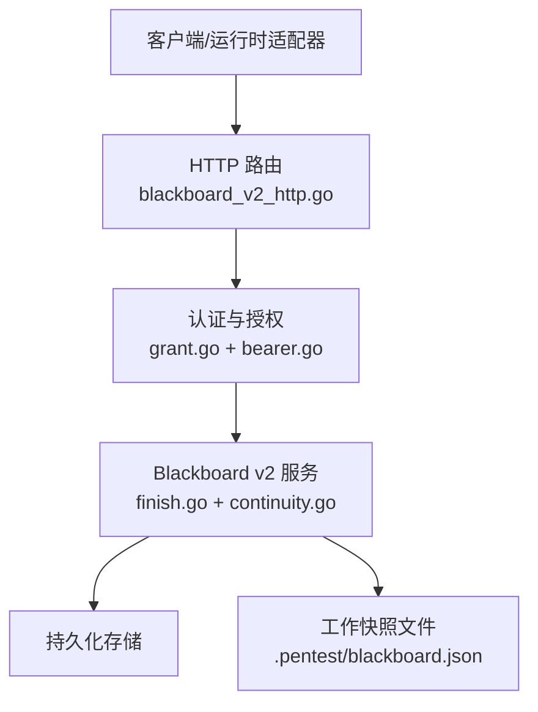
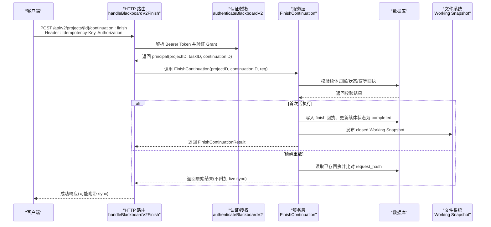
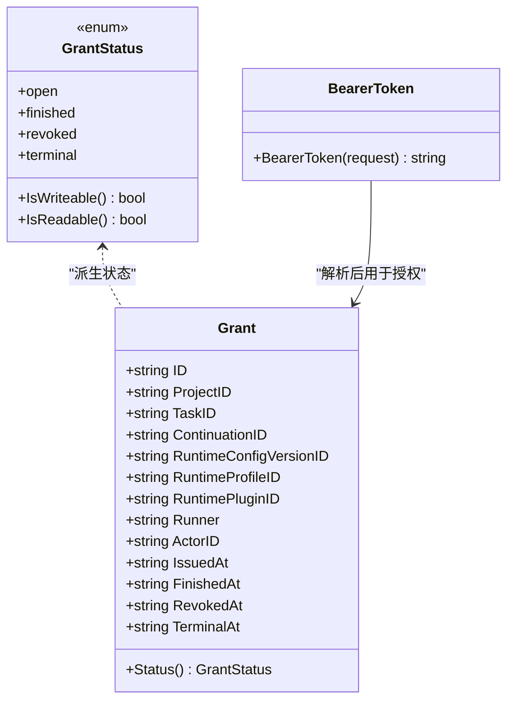
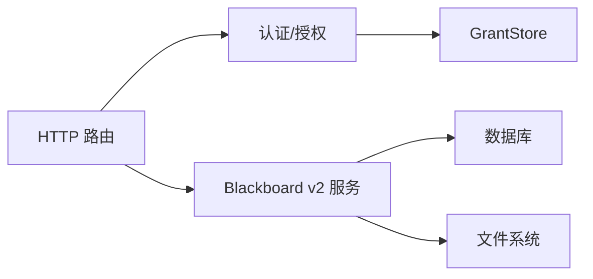

# Continuation 生命周期接口

<cite>
**本文引用的文件**   
- [internal/daemon/blackboard_v2_http.go](file://internal/daemon/blackboard_v2_http.go)
- [internal/blackboardv2/finish.go](file://internal/blackboardv2/finish.go)
- [internal/blackboardv2/continuity.go](file://internal/blackboardv2/continuity.go)
- [internal/projectinterface/grant.go](file://internal/projectinterface/grant.go)
- [internal/projectinterface/bearer.go](file://internal/projectinterface/bearer.go)
- [docs/specs/blackboard-v2-spec.md](file://docs/specs/blackboard-v2-spec.md)
</cite>

## 目录
1. [简介](#简介)
2. [项目结构](#项目结构)
3. [核心组件](#核心组件)
4. [架构总览](#架构总览)
5. [详细组件分析](#详细组件分析)
6. [依赖关系分析](#依赖关系分析)
7. [性能考量](#性能考量)
8. [故障排查指南](#故障排查指南)
9. [结论](#结论)
10. [附录](#附录)

## 简介
本文件聚焦 Blackboard v2 的 Continuation 生命周期管理，重点说明以下能力与边界：
- 会话结束机制：POST /api/v2/projects/{project_id}/continuation:finish 的语义、幂等性保证与资源清理流程。
- 认证与授权：Bearer Token 生成、Grant 权限模型、ProjectID/TaskID/ContinuationID 绑定关系。
- Live vs Exact Replay：首次“活”执行与后续“精确重放”的差异。
- Closed Continuation 的状态限制：关闭后对读写、同步与重放的约束。
- 同步附件 SynchronizationAttachment：工作机制与交付契约。
- 完整认证流程与生命周期示例、错误处理策略与故障恢复指南。

## 项目结构
Blackboard v2 的 HTTP 路由与服务层位于 Daemon 与领域服务之间；认证与授权由 Project Interface Grant 子系统提供；同步与连续性由 Continuity 服务负责。

图表来源
- [internal/daemon/blackboard_v2_http.go:29-46](file://internal/daemon/blackboard_v2_http.go#L29-L46)
- [internal/projectinterface/grant.go:118-149](file://internal/projectinterface/grant.go#L118-L149)
- [internal/blackboardv2/finish.go:65-124](file://internal/blackboardv2/finish.go#L65-L124)
- [internal/blackboardv2/continuity.go:344-389](file://internal/blackboardv2/continuity.go#L344-L389)

章节来源
- [internal/daemon/blackboard_v2_http.go:29-46](file://internal/daemon/blackboard_v2_http.go#L29-L46)
- [docs/specs/blackboard-v2-spec.md:275-292](file://docs/specs/blackboard-v2-spec.md#L275-L292)

## 核心组件
- Finish 请求与结果
  - FinishContinuationRequest：仅包含 idempotency_key，用于幂等控制。
  - FinishContinuationResult：返回 schema、status=finished、当前 revision 与 working_snapshot（路径与版本）。
- 认证与授权
  - BearerToken：从 Authorization 或查询参数提取 token。
  - Grant：绑定 ProjectID/TaskID/ContinuationID，维护 open/finished/revoked/terminal 状态。
- 同步附件
  - SynchronizationAttachment：在响应中携带当前 runtime-blackboard/v2 快照，用于通知并原子替换 Working Snapshot。

章节来源
- [internal/blackboardv2/finish.go:27-61](file://internal/blackboardv2/finish.go#L27-L61)
- [internal/projectinterface/bearer.go:12-21](file://internal/projectinterface/bearer.go#L12-L21)
- [internal/projectinterface/grant.go:118-149](file://internal/projectinterface/grant.go#L118-L149)
- [internal/blackboardv2/continuity.go:102-108](file://internal/blackboardv2/continuity.go#L102-L108)

## 架构总览
Finish 端点通过 HTTP 路由进入，进行身份校验与续体绑定，随后调用领域服务完成关闭、幂等回执与资源清理，并在必要时附加同步信息。

图表来源
- [internal/daemon/blackboard_v2_http.go:330-366](file://internal/daemon/blackboard_v2_http.go#L330-L366)
- [internal/blackboardv2/finish.go:65-124](file://internal/blackboardv2/finish.go#L65-L124)
- [internal/blackboardv2/finish.go:184-227](file://internal/blackboardv2/finish.go#L184-L227)

## 详细组件分析

### 端点：POST /api/v2/projects/{project_id}/continuation:finish
- 功能：结束绑定的 Continuation，拒绝后续新写，返回 exact-replay 回执。
- 输入：
  - 路径参数：project_id
  - 请求头：Authorization: Bearer <token>、Idempotency-Key
  - 请求体：空或 {}（实际幂等键来自 Idempotency-Key）
- 输出：
  - 成功：FinishContinuationResult（schema、status=finished、revision、working_snapshot）
  - 失败：统一错误信封，可能附带 sync（受错误码与上下文限制）

章节来源
- [internal/daemon/blackboard_v2_http.go:330-366](file://internal/daemon/blackboard_v2_http.go#L330-L366)
- [docs/specs/blackboard-v2-spec.md:275-292](file://docs/specs/blackboard-v2-spec.md#L275-L292)

#### FinishContinuationRequest 与幂等性
- 字段：idempotency_key（必填且非空）
- 幂等保证：
  - 同一 continuation_id + idempotency_key 重复提交将返回相同结果。
  - 若使用相同 key 但不同语义（例如 request_hash 不一致），返回 finish_conflict。
  - 幂等回执持久化，重启后可精确重放。

章节来源
- [internal/blackboardv2/finish.go:27-52](file://internal/blackboardv2/finish.go#L27-L52)
- [internal/blackboardv2/finish.go:100-124](file://internal/blackboardv2/finish.go#L100-L124)
- [internal/blackboardv2/finish.go:285-289](file://internal/blackboardv2/finish.go#L285-L289)

#### 资源清理与状态变更
- 关闭续体：将 task_continuations.status 置为 completed，并记录结束时间。
- 同步 Working Snapshot：持久化 last_acknowledged_revision 与 working_snapshot_bytes。
- 发布 closed snapshot：将 .pentest/blackboard.json 写入磁盘，供外部消费。
- 拒绝后续写入：closed 续体对新写、离线读/历史/同步均受限。

章节来源
- [internal/blackboardv2/finish.go:177-227](file://internal/blackboardv2/finish.go#L177-L227)
- [internal/blackboardv2/service.go:3227-3237](file://internal/blackboardv2/service.go#L3227-L3237)

#### 错误与状态码映射
- authority_denied：401/403（取决于 path）
- invalid_schema：400
- not_found：404
- closed_continuation：410
- version_conflict/key_conflict/relationship_conflict/idempotency_conflict/finish_conflict：409
- semantic_validation/continuation_open_attempts/continuation_pending_writes：422
- storage_busy：503（带 Retry-After）
- internal：500

章节来源
- [internal/daemon/blackboard_v2_http.go:612-642](file://internal/daemon/blackboard_v2_http.go#L612-L642)

### 认证与授权：Bearer Token 与 Grant
- BearerToken 提取：优先 Authorization: Bearer，其次 query token。
- Grant 绑定：
  - 每个 Grant 绑定 project_id、task_id、continuation_id。
  - 状态：open（可写）、finished（不可写但可读/重放）、revoked（全部拒绝）、terminal（系统回收）。
- 鉴权流程：
  - 校验 token 存在且未撤销。
  - 校验 path.project_id 与 grant.project_id 一致。
  - 构造 principal 并传递至服务层。

章节来源
- [internal/projectinterface/bearer.go:12-21](file://internal/projectinterface/bearer.go#L12-L21)
- [internal/projectinterface/grant.go:118-149](file://internal/projectinterface/grant.go#L118-L149)
- [internal/daemon/blackboard_v2_http.go:52-95](file://internal/daemon/blackboard_v2_http.go#L52-L95)

#### 类图：Grant 与相关类型

图表来源
- [internal/projectinterface/grant.go:118-149](file://internal/projectinterface/grant.go#L118-L149)
- [internal/projectinterface/bearer.go:12-21](file://internal/projectinterface/bearer.go#L12-L21)

### Live vs Exact Replay
- Live（首次活执行）：
  - 允许附加同步附件（sync），原子替换 Working Snapshot 并返回最新 revision。
  - 写入 finish 回执、更新续体状态、发布 closed snapshot。
- Exact Replay（精确重放）：
  - 基于 request_fingerprint（由 Idempotency-Key 与路径派生）与持久回执，返回与首次完全相同的响应字节。
  - 不再附加 live sync，也不重新发布 closed snapshot。

章节来源
- [internal/daemon/blackboard_v2_http.go:440-463](file://internal/daemon/blackboard_v2_http.go#L440-L463)
- [internal/blackboardv2/continuity.go:344-389](file://internal/blackboardv2/continuity.go#L344-L389)
- [internal/blackboardv2/finish.go:100-124](file://internal/blackboardv2/finish.go#L100-L124)

### Closed Continuation 的状态限制
- 禁止新写：任何新的 change/evidence/checkpoint/finish 将被拒绝。
- 禁止离线读/历史/同步：closed 续体失去 offline read/history/sync 权限。
- 允许精确重放：相同 idempotency_key 的请求仍返回原始结果。

章节来源
- [internal/blackboardv2/continuity.go:154-192](file://internal/blackboardv2/continuity.go#L154-L192)
- [internal/blackboardv2/finish.go:137-146](file://internal/blackboardv2/finish.go#L137-L146)

### 同步附件 SynchronizationAttachment
- 作用：当其他任务改变了共享项目知识时，向当前续体推送完整的 runtime-blackboard/v2 快照，使其原子替换本地 Working Snapshot。
- 触发条件：
  - 活续体且有 pending 同步通知。
  - 请求具备稳定指纹（Idempotency-Key + 路径），支持 response-loss 重放。
- 行为：
  - 先 claim 再 finalize，确保并发安全与崩溃恢复。
  - 活续体：发布最新 snapshot 到磁盘并推进 acknowledged revision。
  - closed 续体：仅返回已持久化的 working_snapshot 字节，不重新发布。

章节来源
- [internal/blackboardv2/continuity.go:344-389](file://internal/blackboardv2/continuity.go#L344-L389)
- [internal/blackboardv2/continuity.go:438-611](file://internal/blackboardv2/continuity.go#L438-L611)
- [internal/blackboardv2/continuity.go:646-751](file://internal/blackboardv2/continuity.go#L646-L751)

### 完整认证与生命周期示例
- 启动续体：创建 Continuation，颁发一次性 Bearer Token，绑定 Project/Task/Continuation。
- 运行期：
  - 使用 Bearer Token 调用 changes/evidence/checkpoint 等接口。
  - 遇到 sync 附件时，原子替换本地 .pentest/blackboard.json 并推进本地 ack。
- 结束会话：
  - 发送 POST /api/v2/projects/{project_id}/continuation:finish，携带 Idempotency-Key。
  - 成功后，续体进入 closed，后续仅允许相同 key 的精确重放。

章节来源
- [internal/projectinterface/grant.go:192-252](file://internal/projectinterface/grant.go#L192-L252)
- [internal/daemon/blackboard_v2_http.go:330-366](file://internal/daemon/blackboard_v2_http.go#L330-L366)
- [docs/specs/blackboard-v2-spec.md:275-292](file://docs/specs/blackboard-v2-spec.md#L275-L292)

## 依赖关系分析
- HTTP 路由依赖认证模块与 Blackboard v2 服务。
- 服务层依赖持久化存储与文件系统（Working Snapshot）。
- 认证模块依赖 GrantStore 与随机令牌源。

图表来源
- [internal/daemon/blackboard_v2_http.go:29-46](file://internal/daemon/blackboard_v2_http.go#L29-L46)
- [internal/projectinterface/grant.go:169-190](file://internal/projectinterface/grant.go#L169-L190)
- [internal/blackboardv2/finish.go:65-124](file://internal/blackboardv2/finish.go#L65-L124)

## 性能考量
- 幂等回执与同步回执均为轻量 JSON，避免大对象频繁落盘。
- Working Snapshot 采用原子替换与回滚保护，减少跨进程竞争风险。
- 同步仅在 Pending 且具备稳定指纹时进行，降低不必要的网络与 I/O。

## 故障排查指南
- 常见错误码与定位
  - authority_denied：检查 Authorization 是否有效、path.project_id 是否与 Grant 一致。
  - invalid_schema：检查请求体是否为空或 {}，Idempotency-Key 是否存在。
  - closed_continuation：确认续体是否已被 finish 或被 supersession 替代。
  - finish_conflict：检查是否用相同 idempotency_key 提交了不同语义的请求。
  - storage_busy：重试策略，关注 Retry-After。
- 恢复建议
  - 对于 response-loss 场景，使用相同 Idempotency-Key 重放以获取原始结果。
  - 遇到 sync 附件时，务必原子替换本地 Working Snapshot 并推进本地 ack。
  - 若 Working Snapshot 文件缺失，可在下次同步或精确重放时自动恢复。

章节来源
- [internal/daemon/blackboard_v2_http.go:539-584](file://internal/daemon/blackboard_v2_http.go#L539-L584)
- [internal/blackboardv2/finish.go:100-124](file://internal/blackboardv2/finish.go#L100-L124)
- [internal/blackboardv2/continuity.go:344-389](file://internal/blackboardv2/continuity.go#L344-L389)

## 结论
POST /api/v2/projects/{project_id}/continuation:finish 提供了强一致的会话结束语义：幂等回执、closed 状态、精确重放与同步附件协作，确保多任务并行下的数据一致性与可恢复性。结合 Bearer Token 与 Grant 绑定，系统在安全性与可靠性之间取得平衡。

## 附录

### API 定义速查
- 方法/路径：POST /api/v2/projects/{project_id}/continuation:finish
- 必需头部：Authorization: Bearer <token>、Idempotency-Key
- 请求体：空或 {}
- 成功响应：FinishContinuationResult（含 schema、status、revision、working_snapshot）
- 错误响应：统一信封 {error}，可能附带 {sync}

章节来源
- [docs/specs/blackboard-v2-spec.md:275-292](file://docs/specs/blackboard-v2-spec.md#L275-L292)
- [internal/daemon/blackboard_v2_http.go:330-366](file://internal/daemon/blackboard_v2_http.go#L330-L366)