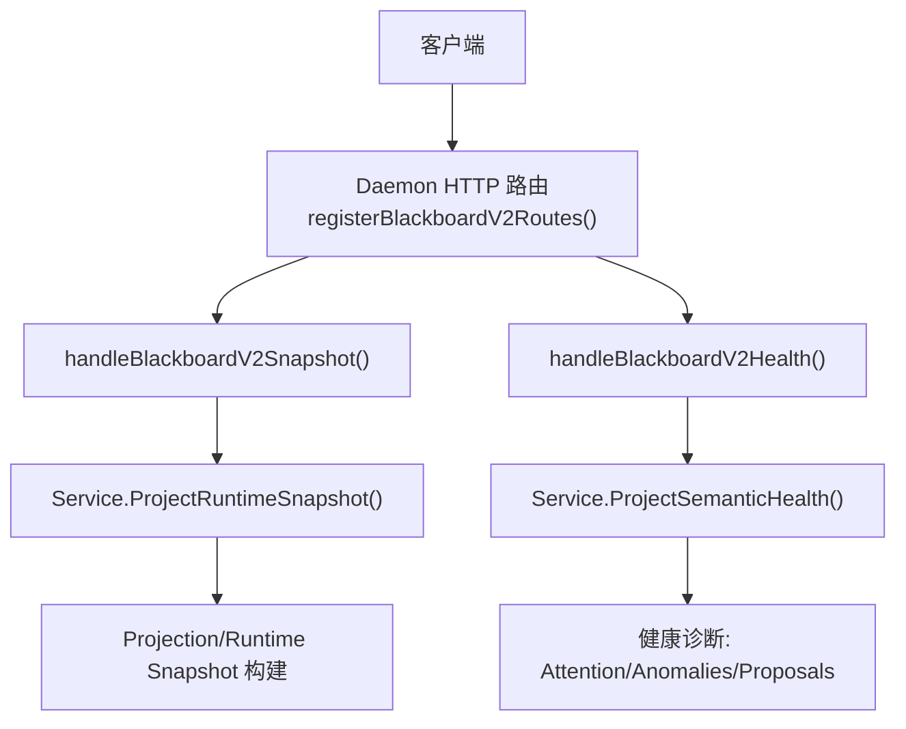
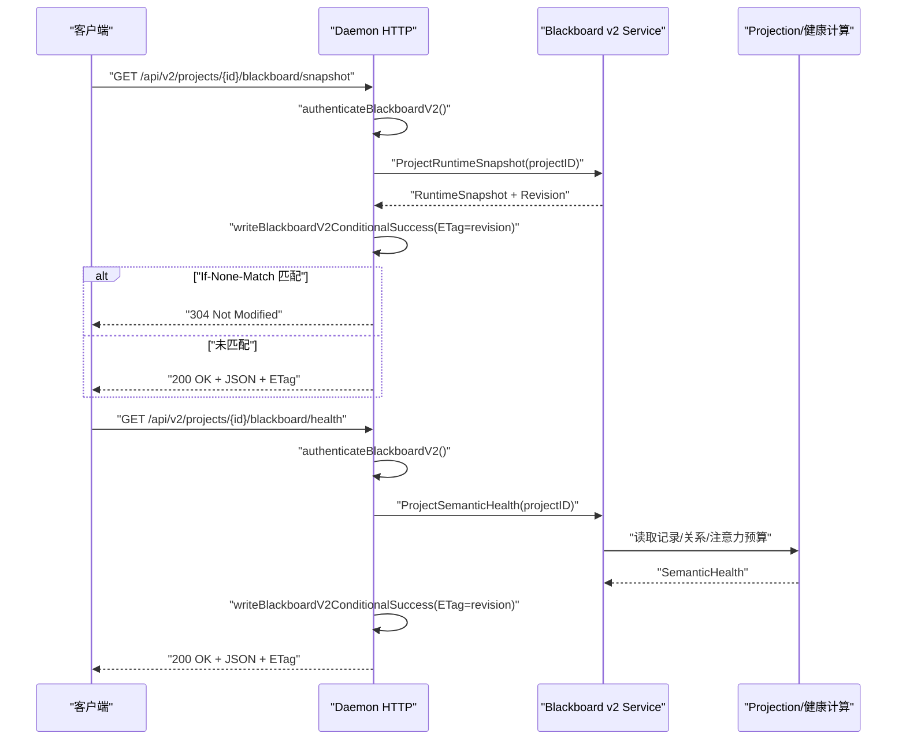
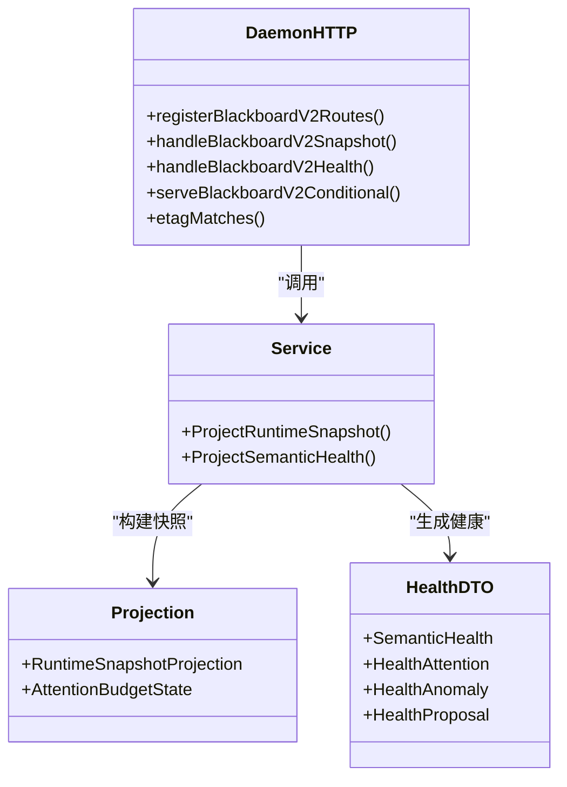

# 快照与健康检查接口

<cite>
**本文引用的文件**   
- [internal/daemon/blackboard_v2_http.go](file://internal/daemon/blackboard_v2_http.go)
- [internal/blackboardv2/health.go](file://internal/blackboardv2/health.go)
- [internal/blackboardv2/projection.go](file://internal/blackboardv2/projection.go)
- [internal/blackboardv2/service.go](file://internal/blackboardv2/service.go)
- [web/src/lib/blackboardv2.ts](file://web/src/lib/blackboardv2.ts)
- [docs/specs/blackboard-v2-spec.md](file://docs/specs/blackboard-v2-spec.md)
- [internal/blackboardv2contract/contractdata/schemas/blackboard-v2.schema.json](file://internal/blackboardv2contract/contractdata/schemas/blackboard-v2.schema.json)
- [internal/daemon/blackboard_v2_http_test.go](file://internal/daemon/blackboard_v2_http_test.go)
</cite>

## 目录
1. [简介](#简介)
2. [项目结构](#项目结构)
3. [核心组件](#核心组件)
4. [架构总览](#架构总览)
5. [详细组件分析](#详细组件分析)
6. [依赖关系分析](#依赖关系分析)
7. [性能与缓存特性](#性能与缓存特性)
8. [故障排查指南](#故障排查指南)
9. [结论](#结论)
10. [附录：HTTP 交互示例与客户端最佳实践](#附录http-交互示例与客户端最佳实践)

## 简介
本文件为 Blackboard v2 的运行时快照与健康检查接口的完整 API 文档，覆盖以下端点：
- GET /api/v2/projects/{project_id}/blackboard/snapshot：获取当前语义快照（Revision、ETag、If-None-Match）
- GET /api/v2/projects/{project_id}/blackboard/health：获取语义健康诊断（状态、异常、建议）

文档同时给出数据结构定义、版本控制与缓存策略、错误码映射、以及客户端 304 Not Modified 处理与缓存最佳实践。

## 项目结构
Blackboard v2 HTTP 路由注册于 Daemon 服务层，具体处理器将请求委派给黑板领域服务；健康检查由领域服务计算并返回只读诊断 DTO。前端通过 TypeScript 库解析响应体并进行严格校验。

图表来源
- [internal/daemon/blackboard_v2_http.go:29-46](file://internal/daemon/blackboard_v2_http.go#L29-L46)
- [internal/daemon/blackboard_v2_http.go:127-159](file://internal/daemon/blackboard_v2_http.go#L127-L159)
- [internal/blackboardv2/service.go:30-38](file://internal/blackboardv2/service.go#L30-L38)
- [internal/blackboardv2/health.go:84-183](file://internal/blackboardv2/health.go#L84-L183)

章节来源
- [internal/daemon/blackboard_v2_http.go:29-46](file://internal/daemon/blackboard_v2_http.go#L29-L46)

## 核心组件
- 路由与鉴权
  - 路由注册包含 snapshot 与 health 两个 GET 端点。
  - 统一鉴权流程支持 operator 模式与 Continuation Token 模式，拒绝在查询字符串中传递 token。
- 条件响应与 ETag
  - 使用 serveBlackboardV2Conditional 实现 revision-based ETag 与 If-None-Match 比较，命中则返回 304。
  - Cache-Control 设置为 private, no-cache，避免共享缓存误用。
- 领域服务
  - ProjectRuntimeSnapshot：生成紧凑、确定性的 runtime-blackboard/v2 快照。
  - ProjectSemanticHealth：基于当前语义状态与快照测量，输出 blackboard-health/v2 诊断。

章节来源
- [internal/daemon/blackboard_v2_http.go:52-95](file://internal/daemon/blackboard_v2_http.go#L52-L95)
- [internal/daemon/blackboard_v2_http.go:375-438](file://internal/daemon/blackboard_v2_http.go#L375-L438)
- [internal/daemon/blackboard_v2_http.go:586-610](file://internal/daemon/blackboard_v2_http.go#L586-L610)
- [internal/blackboardv2/service.go:30-38](file://internal/blackboardv2/service.go#L30-L38)
- [internal/blackboardv2/health.go:84-183](file://internal/blackboardv2/health.go#L84-L183)

## 架构总览
下图展示从客户端到领域服务的调用链，以及 ETag/304 的条件响应路径。

图表来源
- [internal/daemon/blackboard_v2_http.go:127-159](file://internal/daemon/blackboard_v2_http.go#L127-L159)
- [internal/daemon/blackboard_v2_http.go:375-438](file://internal/daemon/blackboard_v2_http.go#L375-L438)
- [internal/blackboardv2/health.go:84-183](file://internal/blackboardv2/health.go#L84-L183)

## 详细组件分析

### 端点：GET /api/v2/projects/{project_id}/blackboard/snapshot
- 功能
  - 返回当前项目的运行时快照（runtime-blackboard/v2），包含 work、knowledge、relations 等字段，以及 schema、semantics、revision。
- 认证
  - 支持 operator 或 Continuation Token；禁止在查询参数中携带 token。
- 条件响应
  - 返回 ETag = 版本号（强 ETag，带引号）。
  - 若请求头 If-None-Match 与 ETag 匹配（含 * 或多值列表），返回 304 Not Modified，无响应体。
  - Cache-Control: private, no-cache。
- 成功响应体关键字段
  - schema: "runtime-blackboard/v2"
  - semantics: 自描述文本，说明工作活跃、知识当前、历史与详情可按 key 读取
  - revision: 整数版本号
  - work: { objectives, attempts }
  - knowledge: { entities, facts, findings, solutions, evidence }
  - relations: 三元组数组，部分可附带 reason
- 错误码
  - 400 invalid_schema：请求格式问题
  - 401 Unauthenticated：授权失败
  - 403 Forbidden：权限不足
  - 404 NotFound：项目不存在
  - 410 Gone：Continuation 已关闭
  - 409 Conflict：版本冲突
  - 422 UnprocessableEntity：语义校验失败
  - 503 ServiceUnavailable：存储繁忙（重试）
  - 500 Internal：内部错误

章节来源
- [internal/daemon/blackboard_v2_http.go:127-142](file://internal/daemon/blackboard_v2_http.go#L127-L142)
- [internal/daemon/blackboard_v2_http.go:500-513](file://internal/daemon/blackboard_v2_http.go#L500-L513)
- [internal/daemon/blackboard_v2_http.go:612-642](file://internal/daemon/blackboard_v2_http.go#L612-L642)
- [docs/specs/blackboard-v2-spec.md:112-141](file://docs/specs/blackboard-v2-spec.md#L112-L141)
- [internal/blackboardv2/service.go:30-38](file://internal/blackboardv2/service.go#L30-L38)

#### 数据结构：RuntimeSnapshot
- 顶层字段
  - schema: 固定为 "runtime-blackboard/v2"
  - semantics: 自描述文本
  - revision: 非负整数
  - work: 对象，仅允许 objectives、attempts 两组
  - knowledge: 对象，仅允许 entities、facts、findings、solutions、evidence 五组
  - relations: 数组，元素为 [from_key, type, to_key] 或 [from_key, type, to_key, reason]
- 字段白名单与长度限制
  - 各类型字段见规范“Snapshot field allowlist”
  - 文本长度限制：主语义文本 1024 UTF-8 字节，可选解释/原因 512 UTF-8 字节
- 序列化顺序
  - 顶层键序：schema、semantics、revision、work、knowledge、relations
  - work 组序：objectives、attempts
  - knowledge 组序：entities、facts、findings/solutions、evidence
  - 键按字典序排序，关系按 from、type、to、reason 排序，保证确定性

章节来源
- [docs/specs/blackboard-v2-spec.md:112-141](file://docs/specs/blackboard-v2-spec.md#L112-L141)
- [web/src/lib/blackboardv2.ts:634-670](file://web/src/lib/blackboardv2.ts#L634-L670)

### 端点：GET /api/v2/projects/{project_id}/blackboard/health
- 功能
  - 返回项目的语义健康诊断（blackboard-health/v2），用于 UI 与操作者监控。
- 认证
  - 与 snapshot 相同的鉴权模型。
- 条件响应
  - 返回 ETag = 健康诊断的 revision；支持 If-None-Match 与 304。
  - Cache-Control: private, no-cache。
- 成功响应体关键字段
  - schema: "blackboard-health/v2"
  - revision: 非负整数
  - status: 全局健康状态（healthy/attention/warning/critical）
  - attention: 快照注意力预算与完整性指标
  - anomalies: 异常清单（code、severity、message、subject_key、related_keys）
  - proposals: 建议的操作项（approval_required、required 等）
- 错误码
  - 同 snapshot 端点的错误码映射一致。

章节来源
- [internal/daemon/blackboard_v2_http.go:144-159](file://internal/daemon/blackboard_v2_http.go#L144-L159)
- [internal/blackboardv2/health.go:34-77](file://internal/blackboardv2/health.go#L34-L77)
- [internal/blackboardv2/health.go:84-183](file://internal/blackboardv2/health.go#L84-L183)

#### 数据结构：SemanticHealth
- 顶层字段
  - schema: "blackboard-health/v2"
  - revision: 非负整数
  - status: 枚举（healthy/attention/warning/critical）
  - attention: 对象，包含 bytes、estimated_tokens、state、complete、launchable、consolidation_offered、consolidation_required
  - anomalies: 数组，每项包含 code、severity、message、subject_key、related_keys
  - proposals: 数组，每项包含 code、action、approval_required、required
- 语义约束
  - 健康诊断是只读且确定性的，不改变知识、不截断快照完整性、不阻塞任务启动。

章节来源
- [internal/blackboardv2/health.go:34-77](file://internal/blackboardv2/health.go#L34-L77)
- [internal/blackboardv2/health.go:84-183](file://internal/blackboardv2/health.go#L84-L183)
- [internal/blackboardv2contract/contractdata/schemas/blackboard-v2.schema.json:3394-3431](file://internal/blackboardv2contract/contractdata/schemas/blackboard-v2.schema.json#L3394-L3431)

#### 注意力预算与状态
- 预算阈值
  - within_target：低于目标
  - above_target：高于目标
  - warning：达到警告阈值
  - required：达到必须合并阈值
- 指标
  - bytes：快照字节数
  - estimated_tokens：估计 token 数
  - complete：是否可用完整快照
  - launchable：是否仍可启动任务
  - consolidation_offered/required：是否提供/要求合并

章节来源
- [internal/blackboardv2/projection.go:10-48](file://internal/blackboardv2/projection.go#L10-L48)
- [internal/blackboardv2/health.go:155-183](file://internal/blackboardv2/health.go#L155-L183)

## 依赖关系分析
- HTTP 层依赖
  - 路由注册与鉴权：internal/daemon/blackboard_v2_http.go
  - 条件响应与 ETag：serveBlackboardV2Conditional、etagMatches、blackboardV2RevisionETag
- 领域服务依赖
  - 快照投影：Service.ProjectRuntimeSnapshot → RuntimeSnapshotProjection
  - 健康诊断：Service.ProjectSemanticHealth → SemanticHealth
- 前端契约
  - web/src/lib/blackboardv2.ts 对 snapshot 与 health 进行严格解析与白名单校验
- 规范与 Schema
  - docs/specs/blackboard-v2-spec.md 定义快照字段白名单、序列化顺序与长度限制
  - internal/blackboardv2contract/contractdata/schemas/blackboard-v2.schema.json 定义健康诊断的结构约束

图表来源
- [internal/daemon/blackboard_v2_http.go:29-46](file://internal/daemon/blackboard_v2_http.go#L29-L46)
- [internal/daemon/blackboard_v2_http.go:127-159](file://internal/daemon/blackboard_v2_http.go#L127-L159)
- [internal/blackboardv2/service.go:30-38](file://internal/blackboardv2/service.go#L30-L38)
- [internal/blackboardv2/projection.go:10-48](file://internal/blackboardv2/projection.go#L10-L48)
- [internal/blackboardv2/health.go:34-77](file://internal/blackboardv2/health.go#L34-L77)

章节来源
- [internal/daemon/blackboard_v2_http.go:29-46](file://internal/daemon/blackboard_v2_http.go#L29-L46)
- [internal/blackboardv2/service.go:30-38](file://internal/blackboardv2/service.go#L30-L38)
- [internal/blackboardv2/projection.go:10-48](file://internal/blackboardv2/projection.go#L10-L48)
- [internal/blackboardv2/health.go:34-77](file://internal/blackboardv2/health.go#L34-L77)

## 性能与缓存特性
- 条件请求优化
  - 使用 revision-based ETag 与 If-None-Match，减少重复传输与解析开销。
- 缓存策略
  - Cache-Control: private, no-cache，确保私有缓存但每次需重新验证，适合频繁更新的语义数据。
- 幂等与同步
  - 对于写端点（changes/evidence/checkpoint/finish）支持 Idempotency-Key 与同步附件；读端点（snapshot/health）不带同步附件，保持简洁。
- 健壮性
  - 存储繁忙时返回 503 并提示 Retry-After，客户端应退避重试。

章节来源
- [internal/daemon/blackboard_v2_http.go:500-513](file://internal/daemon/blackboard_v2_http.go#L500-L513)
- [internal/daemon/blackboard_v2_http.go:552-562](file://internal/daemon/blackboard_v2_http.go#L552-L562)
- [internal/daemon/blackboard_v2_http.go:612-642](file://internal/daemon/blackboard_v2_http.go#L612-L642)

## 故障排查指南
- 常见错误码与定位
  - 400 invalid_schema：检查请求路径、JSON 结构与字段白名单
  - 401 Unauthenticated：确认 Authorization 头或 operator 配置
  - 403 Forbidden：确认 Continuation Token 权限与项目绑定
  - 404 NotFound：确认 project_id 存在
  - 410 Gone：Continuation 已关闭，无法执行当前知识读取
  - 409 Conflict：版本冲突，检查 version 与变更序列
  - 422 UnprocessableEntity：语义校验失败（如关系语法、字段白名单）
  - 503 ServiceUnavailable：存储繁忙，等待并重试
  - 500 Internal：内部错误，查看服务端日志
- 调试要点
  - 对比 ETag 与 revision，确认 304 行为是否符合预期
  - 关注 attention.state 与 anomalies 中的 critical/warning 项，指导合并或修复
  - 前端解析器会拒绝未知字段，便于快速发现协议漂移

章节来源
- [internal/daemon/blackboard_v2_http.go:612-642](file://internal/daemon/blackboard_v2_http.go#L612-L642)
- [internal/blackboardv2/health.go:155-183](file://internal/blackboardv2/health.go#L155-L183)

## 结论
Blackboard v2 的快照与健康检查接口以 revision-based ETag 与严格的字段白名单为核心，提供高效、可缓存、可诊断的语义数据访问能力。客户端应遵循 304 处理与私有缓存策略，结合健康诊断进行主动治理与合并。

## 附录：HTTP 交互示例与客户端最佳实践

### 示例：获取快照与 304 处理
- 首次请求
  - 请求：GET /api/v2/projects/{project_id}/blackboard/snapshot
  - 响应：200 OK，包含 JSON 与 ETag: "N"，Cache-Control: private, no-cache
- 条件请求
  - 请求：GET ... 添加 If-None-Match: "N"
  - 响应：304 Not Modified，空响应体
- 更新后重验证
  - 写入变更后再次请求，若 ETag 变化则返回 200 与新 ETag；否则仍返回 304

章节来源
- [internal/daemon/blackboard_v2_http_test.go:553-583](file://internal/daemon/blackboard_v2_http_test.go#L553-L583)
- [internal/daemon/blackboard_v2_http_test.go:585-611](file://internal/daemon/blackboard_v2_http_test.go#L585-L611)

### 示例：健康检查
- 请求：GET /api/v2/projects/{project_id}/blackboard/health
- 响应：200 OK，包含 schema、revision、status、attention、anomalies、proposals
- 条件请求：If-None-Match 与 ETag 匹配时返回 304

章节来源
- [internal/daemon/blackboard_v2_http_test.go:156-164](file://internal/daemon/blackboard_v2_http_test.go#L156-L164)
- [internal/daemon/blackboard_v2_http_test.go:215-222](file://internal/daemon/blackboard_v2_http_test.go#L215-L222)

### 客户端缓存策略最佳实践
- 使用私有缓存（private）并按需重验证（no-cache）
- 保存上次收到的 ETag，下次请求携带 If-None-Match
- 支持多值与通配符 * 的 If-None-Match 列表
- 遇到 503 时实施指数退避重试
- 前端解析器应严格校验字段白名单与类型，提前捕获协议漂移

章节来源
- [internal/daemon/blackboard_v2_http.go:500-513](file://internal/daemon/blackboard_v2_http.go#L500-L513)
- [internal/daemon/blackboard_v2_http.go:586-610](file://internal/daemon/blackboard_v2_http.go#L586-L610)
- [web/src/lib/blackboardv2.ts:634-670](file://web/src/lib/blackboardv2.ts#L634-L670)
- [web/src/lib/blackboardv2.ts:807-838](file://web/src/lib/blackboardv2.ts#L807-L838)