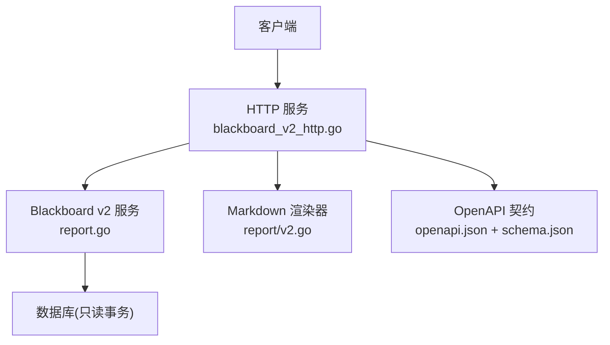
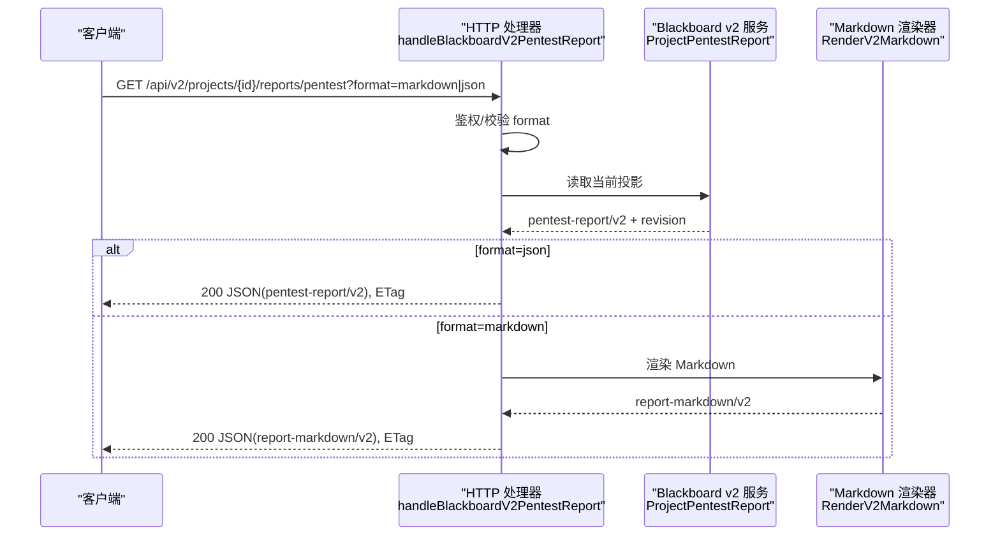
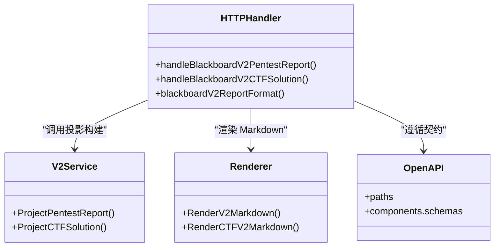
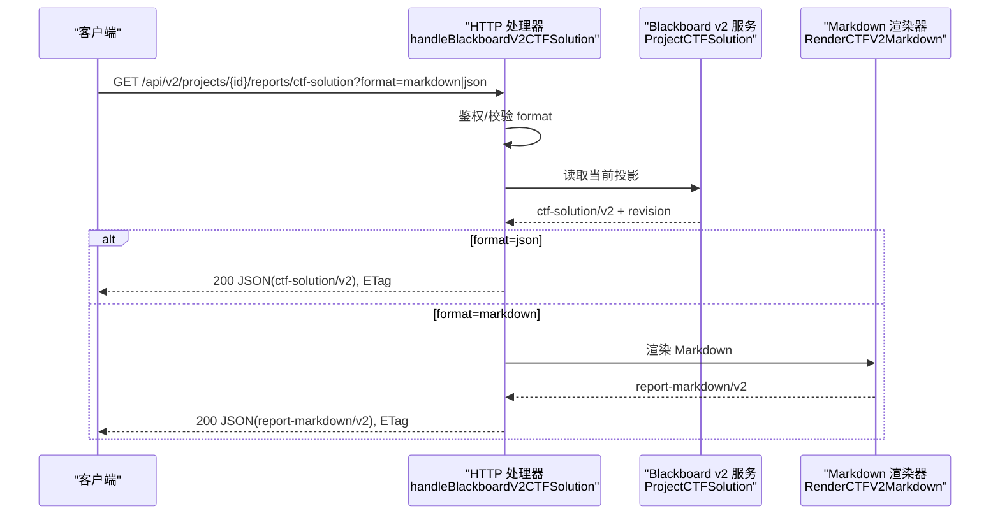

# 报告生成接口

<cite>
**本文引用的文件**   
- [internal/daemon/blackboard_v2_http.go](file://internal/daemon/blackboard_v2_http.go)
- [internal/report/v2.go](file://internal/report/v2.go)
- [internal/blackboardv2/report.go](file://internal/blackboardv2/report.go)
- [internal/blackboardv2contract/contractdata/openapi.json](file://internal/blackboardv2contract/contractdata/openapi.json)
- [internal/blackboardv2contract/contractdata/schemas/blackboard-v2.schema.json](file://internal/blackboardv2contract/contractdata/schemas/blackboard-v2.schema.json)
</cite>

## 目录
1. [简介](#简介)
2. [项目结构](#项目结构)
3. [核心组件](#核心组件)
4. [架构总览](#架构总览)
5. [详细组件分析](#详细组件分析)
6. [依赖关系分析](#依赖关系分析)
7. [性能考虑](#性能考虑)
8. [故障排查指南](#故障排查指南)
9. [结论](#结论)
10. [附录](#附录)

## 简介
本文件为 Blackboard v2 报告生成接口的完整 API 文档，聚焦以下两个端点：
- GET /api/v2/projects/{project_id}/reports/pentest（渗透测试报告）
- GET /api/v2/projects/{project_id}/reports/ctf-solution（CTF 解决方案）

内容涵盖：
- format 查询参数支持 markdown/json 的语义与响应差异
- ReportProjection 数据结构定义（JSON Schema 约束）
- Markdown 渲染模板结构与扩展方式
- 报告生成的语义基础：Findings 聚合、Evidence 引用、Solution 提取
- 不同格式的响应示例说明
- 批量报告生成的最佳实践
- 错误处理与性能优化建议

## 项目结构
与本报告相关的代码组织如下：
- HTTP 路由与鉴权：internal/daemon/blackboard_v2_http.go
- 报告投影与 Markdown 渲染：internal/report/v2.go
- 语义投影构建（PentestReport/CTFSolution）：internal/blackboardv2/report.go
- OpenAPI 契约与 JSON Schema：internal/blackboardv2contract/contractdata/openapi.json 与 schemas/blackboard-v2.schema.json

图表来源
- [internal/daemon/blackboard_v2_http.go:270-328](file://internal/daemon/blackboard_v2_http.go#L270-L328)
- [internal/blackboardv2/report.go:122-339](file://internal/blackboardv2/report.go#L122-L339)
- [internal/report/v2.go:66-74](file://internal/report/v2.go#L66-L74)
- [internal/blackboardv2contract/contractdata/openapi.json:612-778](file://internal/blackboardv2contract/contractdata/openapi.json#L612-L778)

章节来源
- [internal/daemon/blackboard_v2_http.go:270-328](file://internal/daemon/blackboard_v2_http.go#L270-L328)
- [internal/blackboardv2/report.go:122-339](file://internal/blackboardv2/report.go#L122-L339)
- [internal/report/v2.go:66-74](file://internal/report/v2.go#L66-L74)
- [internal/blackboardv2contract/contractdata/openapi.json:612-778](file://internal/blackboardv2contract/contractdata/openapi.json#L612-L778)

## 核心组件
- HTTP 处理器
  - handleBlackboardV2PentestReport：解析 project_id 与 format，调用 ProjectPentestReport，按格式返回 JSON 或 Markdown。
  - handleBlackboardV2CTFSolution：同上，但调用 ProjectCTFSolution。
  - blackboardV2ReportFormat：校验 format 仅允许 markdown/json，默认 markdown。
- 语义投影服务
  - PentestReport/ProjectPentestReport：从当前状态聚合 Findings/Facts/Evidence，输出 pentest-report/v2。
  - CTFSolution/ProjectCTFSolution：从当前状态聚合 Solutions/Facts/Evidence，输出 ctf-solution/v2。
- Markdown 渲染器
  - RenderV2Markdown：将 pentest-report/v2 转换为 report-markdown/v2。
  - RenderCTFV2Markdown：将 ctf-solution/v2 转换为 report-markdown/v2。
- OpenAPI 契约与 JSON Schema
  - 定义路径、参数、响应体、ETag 行为、错误码映射等。
  - 定义 pentest-report/v2、ctf-solution/v2、report-markdown/v2 的结构约束。

章节来源
- [internal/daemon/blackboard_v2_http.go:270-328](file://internal/daemon/blackboard_v2_http.go#L270-L328)
- [internal/blackboardv2/report.go:122-339](file://internal/blackboardv2/report.go#L122-L339)
- [internal/report/v2.go:66-74](file://internal/report/v2.go#L66-L74)
- [internal/blackboardv2contract/contractdata/openapi.json:612-778](file://internal/blackboardv2contract/contractdata/openapi.json#L612-L778)
- [internal/blackboardv2contract/contractdata/schemas/blackboard-v2.schema.json:3647-3784](file://internal/blackboardv2contract/contractdata/schemas/blackboard-v2.schema.json#L3647-L3784)

## 架构总览
报告生成请求在 HTTP 层完成鉴权与参数校验后，进入 Blackboard v2 服务读取当前只读快照并组装投影；若选择 markdown 格式，则通过渲染器生成 Markdown 文本，并以 report-markdown/v2 包装返回。所有报告端点均支持基于 revision 的 ETag 条件缓存。

图表来源
- [internal/daemon/blackboard_v2_http.go:270-293](file://internal/daemon/blackboard_v2_http.go#L270-L293)
- [internal/blackboardv2/report.go:132-339](file://internal/blackboardv2/report.go#L132-L339)
- [internal/report/v2.go:66-74](file://internal/report/v2.go#L66-L74)

## 详细组件分析

### 端点一：GET /api/v2/projects/{project_id}/reports/pentest
- 功能：返回当前项目的渗透测试报告投影或 Markdown 交付物。
- 路径参数
  - project_id：字符串，必填。
- 查询参数
  - format：枚举 ["markdown","json"]，默认 "markdown"。
- 请求头
  - If-None-Match：可选，用于条件缓存。
- 成功响应
  - 200：Content-Type application/json，body 为 oneOf：
    - pentest-report/v2（当 format=json）
    - report-markdown/v2（当 format=markdown）
  - 响应头：ETag 使用 revision 强标签；Cache-Control private, no-cache。
- 条件缓存
  - 304 Not Modified：当 If-None-Match 匹配时返回空体。
- 错误响应
  - 400 invalid_schema：如 format 非法。
  - 401/403 authority_denied：鉴权失败。
  - 404 not_found：项目不存在。
  - 410 closed_continuation：已关闭的 Continuation（不适用于此只读端点）。
  - 422 unprocessable：如项目类型不匹配（非 pentest）。
  - 500 internal：内部错误。
  - 503 unavailable：存储繁忙（storage_busy）。

章节来源
- [internal/daemon/blackboard_v2_http.go:270-293](file://internal/daemon/blackboard_v2_http.go#L270-L293)
- [internal/daemon/blackboard_v2_http.go:319-328](file://internal/daemon/blackboard_v2_http.go#L319-L328)
- [internal/blackboardv2contract/contractdata/openapi.json:612-694](file://internal/blackboardv2contract/contractdata/openapi.json#L612-L694)
- [internal/blackboardv2contract/contractdata/schemas/blackboard-v2.schema.json:3647-3693](file://internal/blackboardv2contract/contractdata/schemas/blackboard-v2.schema.json#L3647-L3693)

#### 数据模型：pentest-report/v2
- schema：固定值 "pentest-report/v2"
- project：包含 name 与可选 description
- confirmed_findings：确认的发现列表
- unconfirmed_findings：未确认的发现列表
- confirmed_facts：已确认的事实列表
- tentative_facts：暂定的事实列表

字段约束详见 JSON Schema 中 reportFinding、reportFact、reportEvidence、reportProject 的定义。

章节来源
- [internal/blackboardv2contract/contractdata/schemas/blackboard-v2.schema.json:3647-3693](file://internal/blackboardv2contract/contractdata/schemas/blackboard-v2.schema.json#L3647-L3693)
- [internal/blackboardv2contract/contractdata/schemas/blackboard-v2.schema.json:3432-3604](file://internal/blackboardv2contract/contractdata/schemas/blackboard-v2.schema.json#L3432-L3604)

#### Markdown 模板：report-markdown/v2
- 顶层标题根据项目名称动态生成
- 段落包含项目描述（可选）
- 分节展示：
  - Confirmed Findings
  - Unconfirmed Findings
  - Confirmed Facts
  - Tentative Facts
- 每个 Finding 包含 Key、Status、Severity/CVSS、Target、Description、Proof、Impact、Recommendation、Supporting Facts、Contradictions、Evidence 列表
- Fact 条目以键值形式呈现，多行内容采用缩进块

章节来源
- [internal/report/v2.go:76-95](file://internal/report/v2.go#L76-L95)
- [internal/report/v2.go:97-153](file://internal/report/v2.go#L97-L153)
- [internal/report/v2.go:155-191](file://internal/report/v2.go#L155-L191)
- [internal/report/v2.go:218-284](file://internal/report/v2.go#L218-L284)

### 端点二：GET /api/v2/projects/{project_id}/reports/ctf-solution
- 功能：返回当前 CTF 挑战项目的解决方案投影或 Markdown 交付物。solved 仅由 verified flags 推导。
- 路径参数
  - project_id：字符串，必填。
- 查询参数
  - format：枚举 ["markdown","json"]，默认 "markdown"。
- 请求头
  - If-None-Match：可选，用于条件缓存。
- 成功响应
  - 200：Content-Type application/json，body 为 oneOf：
    - ctf-solution/v2（当 format=json）
    - report-markdown/v2（当 format=markdown）
  - 响应头：ETag 使用 revision 强标签；Cache-Control private, no-cache。
- 条件缓存
  - 304 Not Modified：当 If-None-Match 匹配时返回空体。
- 错误响应
  - 400 invalid_schema：如 format 非法。
  - 401/403 authority_denied：鉴权失败。
  - 404 not_found：项目不存在。
  - 410 closed_continuation：已关闭的 Continuation（不适用于此只读端点）。
  - 422 unprocessable：如项目类型不匹配（非 ctf_challenge）。
  - 500 internal：内部错误。
  - 503 unavailable：存储繁忙（storage_busy）。

章节来源
- [internal/daemon/blackboard_v2_http.go:295-317](file://internal/daemon/blackboard_v2_http.go#L295-L317)
- [internal/daemon/blackboard_v2_http.go:319-328](file://internal/daemon/blackboard_v2_http.go#L319-L328)
- [internal/blackboardv2contract/contractdata/openapi.json:696-778](file://internal/blackboardv2contract/contractdata/openapi.json#L696-L778)
- [internal/blackboardv2contract/contractdata/schemas/blackboard-v2.schema.json:3694-3765](file://internal/blackboardv2contract/contractdata/schemas/blackboard-v2.schema.json#L3694-L3765)

#### 数据模型：ctf-solution/v2
- schema：固定值 "ctf-solution/v2"
- project：包含 name 与可选 description
- solved：布尔值，仅当存在 verified flag 时为 true
- verified_flags：已验证的 flag 列表
- candidate_flags：候选 flag 列表
- answers：答案列表
- procedures：程序/步骤列表
- confirmed_facts：已确认的事实列表
- tentative_facts：暂定的事实列表
- evidence：证据列表（仅包含与上述目标关联的证据）

字段约束详见 JSON Schema 中 reportSolution、reportFact、reportEvidence、reportProject 的定义。

章节来源
- [internal/blackboardv2contract/contractdata/schemas/blackboard-v2.schema.json:3694-3765](file://internal/blackboardv2contract/contractdata/schemas/blackboard-v2.schema.json#L3694-L3765)
- [internal/blackboardv2contract/contractdata/schemas/blackboard-v2.schema.json:3605-3646](file://internal/blackboardv2contract/contractdata/schemas/blackboard-v2.schema.json#L3605-L3646)
- [internal/blackboardv2contract/contractdata/schemas/blackboard-v2.schema.json:3488-3522](file://internal/blackboardv2contract/contractdata/schemas/blackboard-v2.schema.json#L3488-L3522)

#### Markdown 模板：CTF Solution
- 顶层标题根据挑战名称动态生成
- 段落包含项目描述（可选）
- Solved Status：yes/no
- 分节展示：
  - Verified Flags
  - Candidate Flags
  - Answers
  - Procedures
  - Confirmed Facts
  - Tentative Facts
  - Evidence
- 各条目以键值形式呈现，多行内容采用缩进块

章节来源
- [internal/report/v2.go:286-314](file://internal/report/v2.go#L286-L314)
- [internal/report/v2.go:316-340](file://internal/report/v2.go#L316-L340)
- [internal/report/v2.go:342-368](file://internal/report/v2.go#L342-L368)

### 语义基础与投影构建

#### Findings 聚合（pentest-report/v2）
- 数据来源：当前只读事务下的 fact、finding 记录及其关系 supports/contradicts/evidences。
- 聚合规则：
  - 将 finding 分为 confirmed/unconfirmed 两类。
  - 对每个 finding，聚合其 supporting facts（supports 关系）、contradictions（contradicts 关系）。
  - 证据聚合：直接 evidences 到 finding 的证据，以及被 confirmed supporting facts 所 evidences 的证据合并去重并按 key 排序。
  - 排序：按严重级别降序、target 升序、title 升序、key 升序。
- 输出：PentestReportProjection（pentest-report/v2）。

章节来源
- [internal/blackboardv2/report.go:132-339](file://internal/blackboardv2/report.go#L132-L339)

#### Evidence 引用（pentest-report/v2）
- 证据项仅暴露语义摘要、类型、状态、媒体类型与捕获时间，不包含路径、摘要、大小等实现细节。
- 证据引用范围：
  - 直接指向 finding 的证据
  - 指向 confirmed supporting facts 的证据（间接关联）

章节来源
- [internal/blackboardv2/report.go:288-311](file://internal/blackboardv2/report.go#L288-L311)
- [internal/blackboardv2/report.go:105-114](file://internal/blackboardv2/report.go#L105-L114)

#### Solution 提取（ctf-solution/v2）
- 数据来源：solution、fact、evidence 记录及 evidences 关系。
- 分类：
  - kind=flag 且 status=verified → verified_flags
  - kind=flag 且 status=candidate → candidate_flags
  - kind=answer → answers
  - kind=procedure → procedures
- 事实：
  - confidence=confirmed → confirmed_facts
  - 其他 → tentative_facts
- 证据：
  - 仅包含与上述目标（verified/candidate flags、answers、procedures、confirmed facts）有 evidences 关系的证据。
- solved 推导：只要存在至少一个 verified flag，则为 true。

章节来源
- [internal/blackboardv2/report.go:349-499](file://internal/blackboardv2/report.go#L349-L499)

### 响应示例说明
- JSON 模式
  - pentest-report/v2：包含 schema、project、confirmed_findings、unconfirmed_findings、confirmed_facts、tentative_facts。
  - ctf-solution/v2：包含 schema、project、solved、verified_flags、candidate_flags、answers、procedures、confirmed_facts、tentative_facts、evidence。
- Markdown 模式
  - report-markdown/v2：包含 schema="report-markdown/v2" 与 markdown 文本。

章节来源
- [internal/blackboardv2contract/contractdata/schemas/blackboard-v2.schema.json:3647-3784](file://internal/blackboardv2contract/contractdata/schemas/blackboard-v2.schema.json#L3647-L3784)

### 自定义报告模板的扩展方法
- 当前 Markdown 渲染逻辑位于 report/v2.go，提供 RenderV2Markdown 与 RenderCTFV2Markdown 两个入口。
- 扩展建议：
  - 新增渲染函数并在 HTTP 层增加新的 format 选项（需同步更新 openapi.json 与 schema.json）。
  - 保持幂等与确定性：相同输入应产生相同输出，避免引入时钟或随机性。
  - 遵循现有转义与多行块处理策略，确保 Markdown 安全与可读性。

章节来源
- [internal/report/v2.go:66-74](file://internal/report/v2.go#L66-L74)
- [internal/report/v2.go:277-284](file://internal/report/v2.go#L277-L284)
- [internal/blackboardv2contract/contractdata/openapi.json:612-778](file://internal/blackboardv2contract/contractdata/openapi.json#L612-L778)

### 批量报告生成的最佳实践
- 并行化：对不同 project_id 的请求可并发发起，服务端为只读操作，无写锁竞争。
- 条件缓存：利用 If-None-Match 与 ETag 减少重复传输，降低带宽与 CPU 消耗。
- 分页与限流：前端侧控制并发度与重试退避，避免瞬时峰值导致 503。
- 幂等与重试：虽然报告为只读，但在网络不稳定时可结合 ETag 进行幂等重试。

[本节为通用指导，无需源码引用]

## 依赖关系分析
- HTTP 层依赖 Blackboard v2 服务进行投影构建，依赖渲染器生成 Markdown。
- 投影构建依赖数据库只读事务与关系查询。
- OpenAPI 契约与 JSON Schema 作为对外契约，驱动 HTTP 层与客户端实现一致性。

图表来源
- [internal/daemon/blackboard_v2_http.go:270-328](file://internal/daemon/blackboard_v2_http.go#L270-L328)
- [internal/blackboardv2/report.go:132-499](file://internal/blackboardv2/report.go#L132-L499)
- [internal/report/v2.go:66-74](file://internal/report/v2.go#L66-L74)
- [internal/blackboardv2contract/contractdata/openapi.json:612-778](file://internal/blackboardv2contract/contractdata/openapi.json#L612-L778)

章节来源
- [internal/daemon/blackboard_v2_http.go:270-328](file://internal/daemon/blackboard_v2_http.go#L270-L328)
- [internal/blackboardv2/report.go:132-499](file://internal/blackboardv2/report.go#L132-L499)
- [internal/report/v2.go:66-74](file://internal/report/v2.go#L66-L74)
- [internal/blackboardv2contract/contractdata/openapi.json:612-778](file://internal/blackboardv2contract/contractdata/openapi.json#L612-L778)

## 性能考虑
- 只读事务：报告端点使用只读事务，避免写锁争用，提升并发能力。
- ETag 条件缓存：合理使用 If-None-Match 可减少重复计算与传输。
- 排序与去重：投影构建中对证据与发现进行排序与去重，复杂度受数据规模影响，建议在大规模项目中关注数据库索引与查询计划。
- 输入限制：HTTP 层对请求体有限制（报告端点为 GET，不涉及大请求体），但仍需注意响应体大小。

[本节为通用指导，无需源码引用]

## 故障排查指南
- 常见错误码与含义
  - 400 invalid_schema：format 参数非法或请求结构不符合契约。
  - 401/403 authority_denied：缺少或无效的授权令牌/Continuation Grant。
  - 404 not_found：project_id 不存在。
  - 422 unprocessable：项目类型不匹配（pentest 或 ctf_challenge）。
  - 500 internal：内部异常。
  - 503 unavailable：存储繁忙（SQLite writer lock busy）。
- 诊断步骤
  - 检查 project_id 是否存在且类型正确。
  - 确认 Authorization 或 Continuation Grant 是否有效。
  - 查看响应中的 error.code 与 error.path 定位问题位置。
  - 若出现 503，稍后重试或降低并发度。

章节来源
- [internal/daemon/blackboard_v2_http.go:539-642](file://internal/daemon/blackboard_v2_http.go#L539-L642)
- [internal/blackboardv2contract/contractdata/openapi.json:612-778](file://internal/blackboardv2contract/contractdata/openapi.json#L612-L778)

## 结论
Blackboard v2 的报告生成接口提供了确定性的语义投影与 Markdown 交付物两种消费模式。通过严格的 JSON Schema 约束与清晰的 HTTP 契约，确保了跨系统的一致性与可维护性。建议在生产环境中充分利用 ETag 条件缓存与并发策略，以获得更好的性能与用户体验。

[本节为总结，无需源码引用]

## 附录

### 关键流程时序图（CTF 解决方案）

图表来源
- [internal/daemon/blackboard_v2_http.go:295-317](file://internal/daemon/blackboard_v2_http.go#L295-L317)
- [internal/blackboardv2/report.go:349-499](file://internal/blackboardv2/report.go#L349-L499)
- [internal/report/v2.go:71-74](file://internal/report/v2.go#L71-L74)