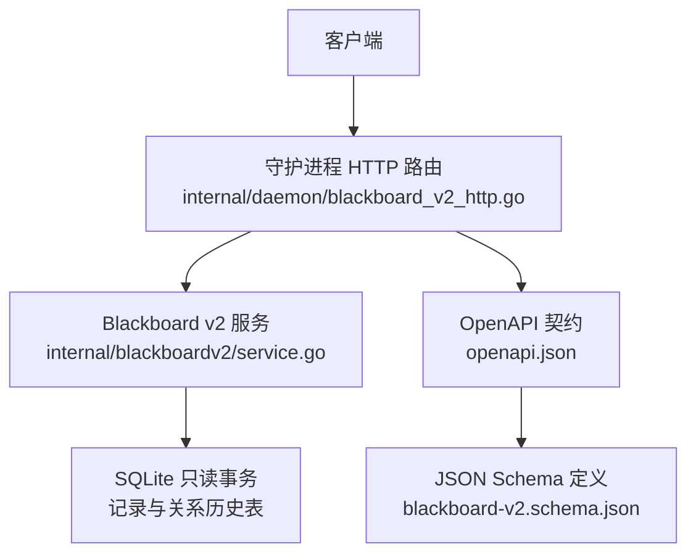
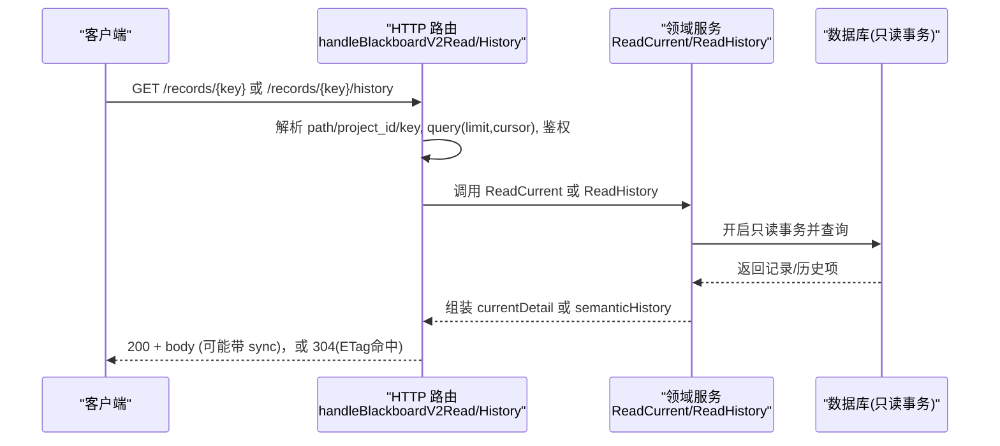
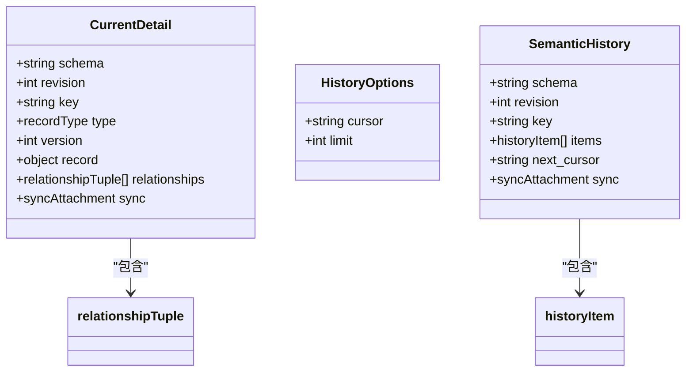
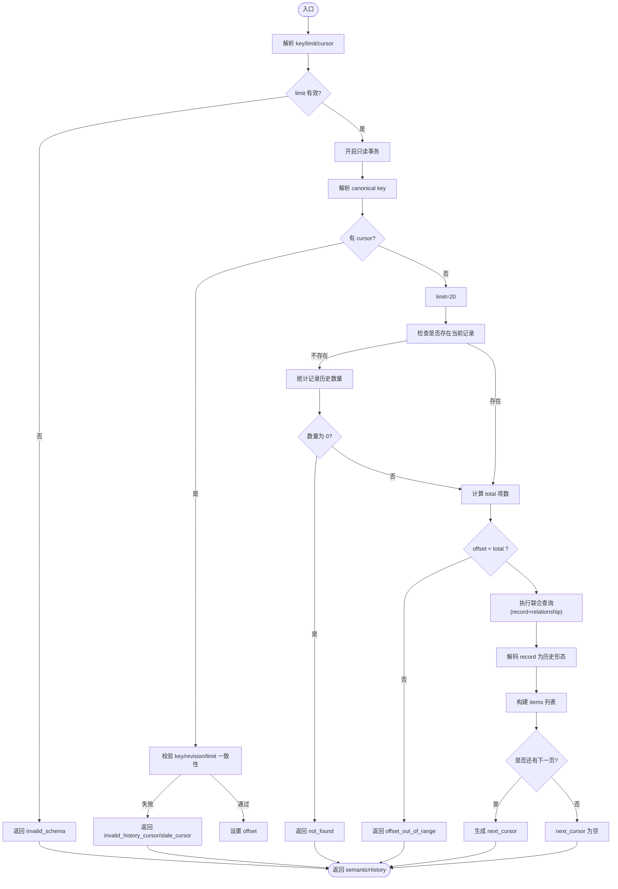
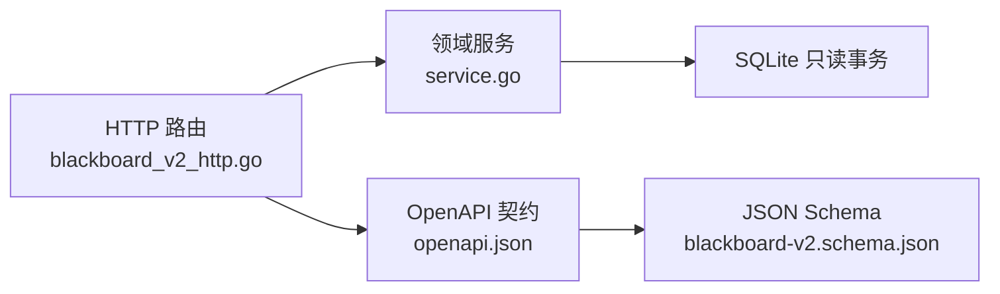

# 记录读取与历史接口

<cite>
**本文引用的文件**
- [internal/daemon/blackboard_v2_http.go](file://internal/daemon/blackboard_v2_http.go)
- [internal/blackboardv2/service.go](file://internal/blackboardv2/service.go)
- [internal/blackboardv2contract/contractdata/openapi.json](file://internal/blackboardv2contract/contractdata/openapi.json)
- [internal/blackboardv2contract/contractdata/schemas/blackboard-v2.schema.json](file://internal/blackboardv2contract/contractdata/schemas/blackboard-v2.schema.json)
</cite>

## 目录
1. [简介](#简介)
2. [项目结构](#项目结构)
3. [核心组件](#核心组件)
4. [架构总览](#架构总览)
5. [详细组件分析](#详细组件分析)
6. [依赖关系分析](#依赖关系分析)
7. [性能考虑](#性能考虑)
8. [故障排查指南](#故障排查指南)
9. [结论](#结论)
10. [附录](#附录)

## 简介
本文件面向 Blackboard v2 的“记录读取”和“历史记录查询”两个 HTTP 接口，提供端到端 API 文档与实现要点说明。重点覆盖：
- GET /api/v2/projects/{project_id}/blackboard/records/{key}：获取当前语义记录及其关系、版本信息，支持 ETag/If-None-Match 缓存控制。
- GET /api/v2/projects/{project_id}/blackboard/records/{key}/history：基于 cursor 的分页语义历史查询，包含 limit/cursor 参数、HistoryEntry 结构与时间线遍历模式。
同时给出分页最佳实践、大数据量处理策略、客户端增量更新示例思路，以及错误处理与边界情况指南。

## 项目结构
Blackboard v2 的 HTTP 路由在守护进程层注册，请求经认证后进入领域服务进行数据读取；响应遵循 OpenAPI 契约与 JSON Schema 定义。

图表来源
- [internal/daemon/blackboard_v2_http.go:29-46](file://internal/daemon/blackboard_v2_http.go#L29-L46)
- [internal/blackboardv2/service.go:1179-1365](file://internal/blackboardv2/service.go#L1179-L1365)
- [internal/blackboardv2contract/contractdata/openapi.json:220-348](file://internal/blackboardv2contract/contractdata/openapi.json#L220-L348)
- [internal/blackboardv2contract/contractdata/schemas/blackboard-v2.schema.json:1421-1620](file://internal/blackboardv2contract/contractdata/schemas/blackboard-v2.schema.json#L1421-L1620)

章节来源
- [internal/daemon/blackboard_v2_http.go:29-46](file://internal/daemon/blackboard_v2_http.go#L29-L46)
- [internal/blackboardv2contract/contractdata/openapi.json:220-348](file://internal/blackboardv2contract/contractdata/openapi.json#L220-L348)

## 核心组件
- HTTP 路由与鉴权
  - 注册两条 GET 路由：records/{key} 与 records/{key}/history。
  - 统一鉴权流程：支持 Operator 与 Continuation Interface Grant；GET 读取仅允许 live 上下文（关闭的 Continuation 不可读）。
- 领域服务
  - ReadCurrent：返回当前记录的完整详情及关联关系，附带 revision 用于 ETag。
  - ReadHistory：按 key 拉取语义历史，支持 cursor 分页与 limit 校验，返回 next_cursor 以继续翻页。
- 契约与类型
  - OpenAPI 路径与响应体引用 currentDetail 与 semanticHistory。
  - JSON Schema 定义 record 多态类型、relationshipTuple、historyItem 等。

章节来源
- [internal/daemon/blackboard_v2_http.go:161-197](file://internal/daemon/blackboard_v2_http.go#L161-L197)
- [internal/blackboardv2/service.go:1179-1365](file://internal/blackboardv2/service.go#L1179-L1365)
- [internal/blackboardv2contract/contractdata/openapi.json:220-348](file://internal/blackboardv2contract/contractdata/openapi.json#L220-L348)
- [internal/blackboardv2contract/contractdata/schemas/blackboard-v2.schema.json:1421-1620](file://internal/blackboardv2contract/contractdata/schemas/blackboard-v2.schema.json#L1421-L1620)

## 架构总览
下图展示从客户端到数据库的调用链路与关键校验点。

图表来源
- [internal/daemon/blackboard_v2_http.go:161-197](file://internal/daemon/blackboard_v2_http.go#L161-L197)
- [internal/blackboardv2/service.go:1179-1365](file://internal/blackboardv2/service.go#L1179-L1365)

## 详细组件分析

### 接口一：获取当前记录
- 方法/路径
  - GET /api/v2/projects/{project_id}/blackboard/records/{key}
- 路径参数
  - project_id：字符串，必填
  - key：Blackboard Key，必填，需符合 schema 约束
- 查询参数
  - If-None-Match：可选，强 ETag 比较，命中返回 304
- 成功响应
  - 状态码：200
  - 响应头：ETag（由 revision 生成），Cache-Control: private, no-cache
  - 响应体：currentDetail 对象
- 失败响应
  - 400 invalid_schema：参数不合法
  - 401/403 authority_denied：鉴权失败
  - 404 not_found：key 不存在
  - 410 closed_continuation：Continuation 已关闭
  - 500 internal：内部错误
  - 503 storage_busy：存储繁忙（可重试）
- 字段说明（currentDetail）
  - schema：固定值 blackboard-record/v2
  - revision：项目级图修订号，用于 ETag
  - key/type/version：当前记录的标识、类型与版本
  - record：多态记录对象，具体结构取决于 type（entity/objective/attempt/finding/solution/evidence/fact）
  - relationships：与该记录相关的关系元组数组
  - sync：可选，同步附件（仅在需要时附加）

章节来源
- [internal/daemon/blackboard_v2_http.go:161-175](file://internal/daemon/blackboard_v2_http.go#L161-L175)
- [internal/blackboardv2/service.go:1179-1212](file://internal/blackboardv2/service.go#L1179-L1212)
- [internal/blackboardv2contract/contractdata/openapi.json:220-280](file://internal/blackboardv2contract/contractdata/openapi.json#L220-L280)
- [internal/blackboardv2contract/contractdata/schemas/blackboard-v2.schema.json:1421-1577](file://internal/blackboardv2contract/contractdata/schemas/blackboard-v2.schema.json#L1421-L1577)

#### 类/数据结构关系（代码映射）

图表来源
- [internal/blackboardv2/service.go:1179-1212](file://internal/blackboardv2/service.go#L1179-L1212)
- [internal/blackboardv2/service.go:1215-1365](file://internal/blackboardv2/service.go#L1215-L1365)
- [internal/blackboardv2contract/contractdata/schemas/blackboard-v2.schema.json:1421-1620](file://internal/blackboardv2contract/contractdata/schemas/blackboard-v2.schema.json#L1421-L1620)
- [internal/blackboardv2contract/contractdata/schemas/blackboard-v2.schema.json:1801-1835](file://internal/blackboardv2contract/contractdata/schemas/blackboard-v2.schema.json#L1801-L1835)

### 接口二：查询历史记录
- 方法/路径
  - GET /api/v2/projects/{project_id}/blackboard/records/{key}/history
- 路径参数
  - project_id：字符串，必填
  - key：Blackboard Key，必填
- 查询参数
  - cursor：可选，上页返回的 opaque 游标
  - limit：可选，整数，范围 1..100，默认 20
- 成功响应
  - 状态码：200
  - 响应体：semanticHistory 对象
- 失败响应
  - 400 invalid_schema：limit 非整数或越界、cursor 格式错误等
  - 401/403 authority_denied：鉴权失败
  - 404 not_found：key 无记录且无历史
  - 410 closed_continuation：Continuation 已关闭
  - 500 internal：内部错误
  - 503 storage_busy：存储繁忙（可重试）
- 字段说明（semanticHistory）
  - schema：固定值 semantic-history/v2
  - revision：项目级图修订号
  - key：规范化后的 canonical key
  - items：历史条目数组，包含 record 变更与关系变更两类
  - next_cursor：若还有下一页则返回，否则为空
  - sync：可选，同步附件（仅在需要时附加）

#### 历史条目结构（HistoryEntry）
- 两种条目类型：
  - record：记录版本变更
    - kind=record
    - key：记录键
    - version：版本号
    - type：记录类型（entity/objective/attempt/fact/finding/solution/evidence）
    - record：该版本的记录快照（历史形态，如 historicalEntityRecord 等）
  - relationship：关系变更
    - kind=relationship
    - version：版本号
    - from/relation/to：三元关系
    - reason：变更原因（可选）
- 排序规则
  - 先按 sort_group（record 优先于 relationship）
  - 再按 recorded_at/version/identity_key/relation/from/to/version 稳定排序
  - 保证时间线与版本顺序一致

章节来源
- [internal/daemon/blackboard_v2_http.go:177-197](file://internal/daemon/blackboard_v2_http.go#L177-L197)
- [internal/blackboardv2/service.go:1215-1365](file://internal/blackboardv2/service.go#L1215-L1365)
- [internal/blackboardv2contract/contractdata/openapi.json:282-348](file://internal/blackboardv2contract/contractdata/openapi.json#L282-L348)
- [internal/blackboardv2contract/contractdata/schemas/blackboard-v2.schema.json:1801-1835](file://internal/blackboardv2contract/contractdata/schemas/blackboard-v2.schema.json#L1801-L1835)
- [internal/blackboardv2contract/contractdata/schemas/blackboard-v2.schema.json:1578-1620](file://internal/blackboardv2contract/contractdata/schemas/blackboard-v2.schema.json#L1578-L1620)

#### 历史查询流程（算法流程图）

图表来源
- [internal/blackboardv2/service.go:1215-1365](file://internal/blackboardv2/service.go#L1215-L1365)

## 依赖关系分析
- HTTP 层依赖领域服务
  - handleBlackboardV2Read → ReadCurrent
  - handleBlackboardV2History → ReadHistory
- 领域服务依赖数据库只读事务
  - 使用单事务内完成 revision、current/历史计数、分页查询
- 契约与类型
  - OpenAPI 路径与响应体引用 currentDetail/semanticHistory
  - JSON Schema 定义 record 多态、historyItem 等

图表来源
- [internal/daemon/blackboard_v2_http.go:161-197](file://internal/daemon/blackboard_v2_http.go#L161-L197)
- [internal/blackboardv2/service.go:1179-1365](file://internal/blackboardv2/service.go#L1179-L1365)
- [internal/blackboardv2contract/contractdata/openapi.json:220-348](file://internal/blackboardv2contract/contractdata/openapi.json#L220-L348)
- [internal/blackboardv2contract/contractdata/schemas/blackboard-v2.schema.json:1421-1620](file://internal/blackboardv2contract/contractdata/schemas/blackboard-v2.schema.json#L1421-L1620)

章节来源
- [internal/daemon/blackboard_v2_http.go:161-197](file://internal/daemon/blackboard_v2_http.go#L161-L197)
- [internal/blackboardv2/service.go:1179-1365](file://internal/blackboardv2/service.go#L1179-L1365)
- [internal/blackboardv2contract/contractdata/openapi.json:220-348](file://internal/blackboardv2contract/contractdata/openapi.json#L220-L348)
- [internal/blackboardv2contract/contractdata/schemas/blackboard-v2.schema.json:1421-1620](file://internal/blackboardv2contract/contractdata/schemas/blackboard-v2.schema.json#L1421-L1620)

## 性能考虑
- 只读事务与单次扫描
  - ReadCurrent/ReadHistory 均在一个只读事务中完成，避免多次往返。
- 分页限制
  - limit 最大 100，默认 20；建议客户端根据 UI 渲染能力选择合理大小。
- 排序与索引
  - 历史查询对时间戳与版本进行稳定排序，确保分页稳定性；大数据量下建议关注数据库索引与 LIMIT/OFFSET 的性能。
- ETag 与缓存
  - currentDetail 支持 ETag/If-None-Match，减少重复传输。
- 同步附件
  - 当服务端需要投递 Pending 同步消息时，会在响应中附加 sync 字段；客户端应忽略其内容但保留幂等处理逻辑。

[本节为通用性能指导，无需特定文件引用]

## 故障排查指南
- 常见错误码与含义
  - invalid_schema：参数不合法（如 limit 非整数、cursor 格式错误、body 非法）
  - authority_denied：鉴权失败（缺少 token、token 无效、Continuation 权限不足）
  - not_found：key 不存在或无历史
  - closed_continuation：Continuation 已关闭，禁止读取
  - storage_busy：存储繁忙，建议指数退避重试
  - internal：内部错误
- 调试建议
  - 检查请求路径与参数是否符合 OpenAPI 契约
  - 确认 Authorization/Bearer Token 是否正确
  - 对于 history 分页，确保 next_cursor 未被篡改（key/revision/limit 必须一致）
  - 遇到 503 时，结合 Retry-After 头部进行重试

章节来源
- [internal/daemon/blackboard_v2_http.go:539-642](file://internal/daemon/blackboard_v2_http.go#L539-L642)
- [internal/blackboardv2/service.go:1215-1365](file://internal/blackboardv2/service.go#L1215-L1365)

## 结论
Blackboard v2 的记录读取与历史查询接口提供了稳定的当前视图与可追溯的历史视图。通过 ETag 与 cursor 分页机制，兼顾了性能与可扩展性。客户端应严格遵循契约、正确处理错误与边界条件，并在大数据量场景下采用合理的分页策略与增量更新方案。

[本节为总结性内容，无需特定文件引用]

## 附录

### 分页查询最佳实践
- 首次查询
  - 不传 cursor，limit 设为 20 或 UI 所需大小
- 后续翻页
  - 使用上一页返回的 next_cursor，保持 limit 不变
  - 若收到 stale_cursor 或 key_mismatch/offset_out_of_range，应从首项重新开始
- 大数据量
  - 将 limit 控制在 20..100 之间，避免过大导致响应体积与延迟
  - 结合 ETag 与增量更新，减少不必要的数据传输

[本节为通用指导，无需特定文件引用]

### 客户端增量更新实现示例（思路）
- 维护本地 state：
  - last_revision：上次 successful 响应的 revision
  - last_cursor：上次 successful 响应的 next_cursor
- 读取当前记录：
  - 携带 If-None-Match: "<last_revision>"，若 304 则跳过
  - 若 200，更新 last_revision 与本地记录
- 拉取历史：
  - 若无 last_cursor，从头开始；若有，带上 next_cursor 继续
  - 合并 items 到本地时间线，去重与排序依据 server 返回顺序
  - 若返回 next_cursor 为空，表示结束
- 错误处理：
  - 404/not_found：清理本地相关状态
  - 410/closed_continuation：停止刷新
  - 503/storage_busy：指数退避重试
  - 400/invalid_schema：重置 last_cursor 并重试

[本节为通用指导，无需特定文件引用]