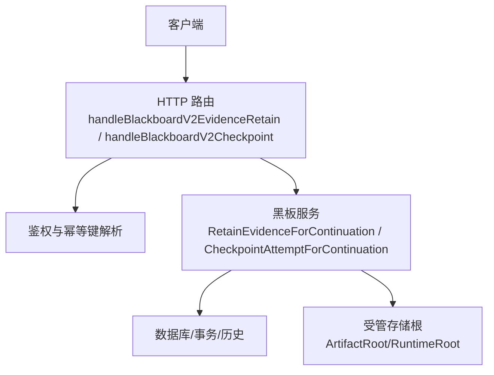
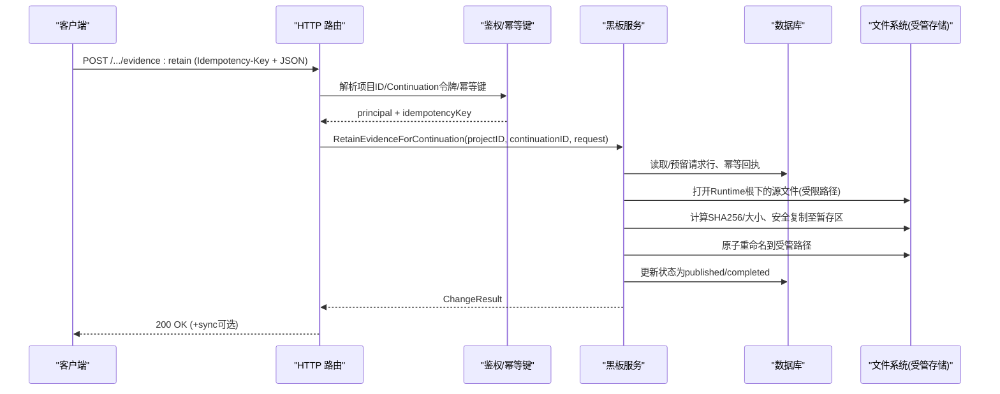
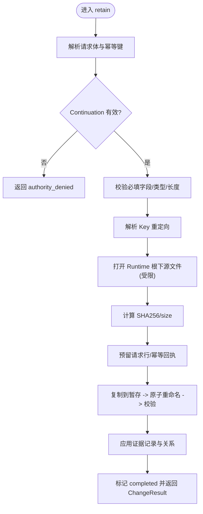
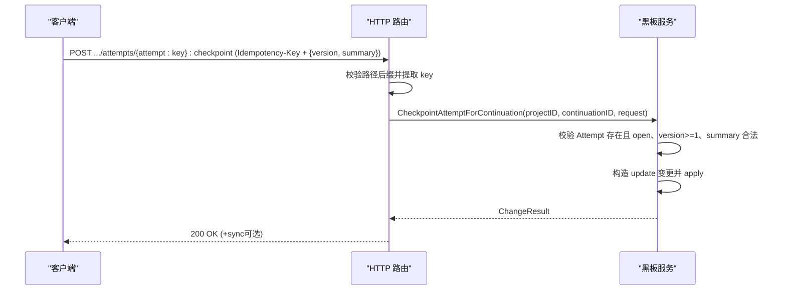
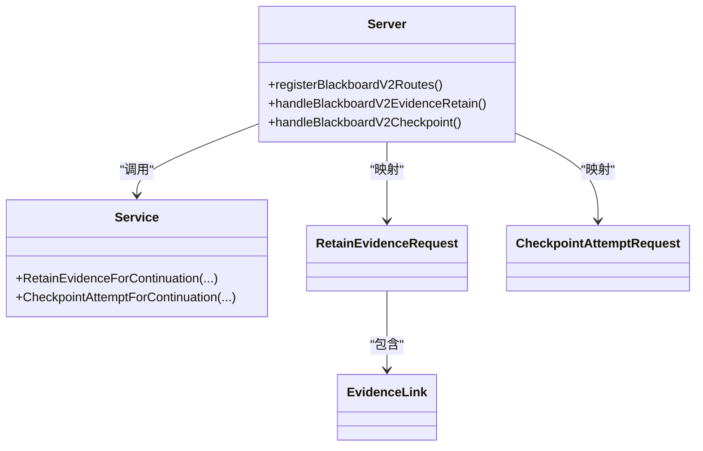

# 证据保留与检查点接口

<cite>
**本文引用的文件**   
- [internal/daemon/blackboard_v2_http.go](file://internal/daemon/blackboard_v2_http.go)
- [internal/blackboardv2/evidence.go](file://internal/blackboardv2/evidence.go)
- [internal/blackboardv2/checkpoint.go](file://internal/blackboardv2/checkpoint.go)
- [internal/blackboardv2/resume.go](file://internal/blackboardv2/resume.go)
- [docs/specs/blackboard-graph-contract.md](file://docs/specs/blackboard-graph-contract.md)
- [internal/blackboardv2contract/contractdata/schemas/blackboard-v2.schema.json](file://internal/blackboardv2contract/contractdata/schemas/blackboard-v2.schema.json)
</cite>

## 目录
1. [简介](#简介)
2. [项目结构](#项目结构)
3. [核心组件](#核心组件)
4. [架构总览](#架构总览)
5. [详细组件分析](#详细组件分析)
6. [依赖关系分析](#依赖关系分析)
7. [性能考虑](#性能考虑)
8. [故障排查指南](#故障排查指南)
9. [结论](#结论)
10. [附录：请求/响应示例与最佳实践](#附录请求响应示例与最佳实践)

## 简介
本文件面向 Blackboard v2 的“证据保留”和“检查点”两个关键 API，提供端到端的技术文档。内容包括：
- POST /api/v2/projects/{project_id}/blackboard/evidence:retain 的证据持久化机制、数据结构与校验规则
- POST /api/v2/projects/{project_id}/blackboard/attempts/{attempt_action}:checkpoint 的检查点创建流程、版本管理与摘要语义
- EvidenceLink 结构、ArtifactType 分类、SourcePath 文件引用、CapturedAt 时间戳说明
- 大文件上传策略、任务恢复中检查点的作用、以及完整的请求/响应示例路径

## 项目结构
Blackboard v2 的 HTTP 路由位于守护进程层，业务逻辑在领域服务层实现；数据契约由 JSON Schema 与规范文档共同约束。

图表来源
- [internal/daemon/blackboard_v2_http.go:29-46](file://internal/daemon/blackboard_v2_http.go#L29-L46)
- [internal/daemon/blackboard_v2_http.go:199-268](file://internal/daemon/blackboard_v2_http.go#L199-L268)
- [internal/blackboardv2/evidence.go:194-360](file://internal/blackboardv2/evidence.go#L194-L360)
- [internal/blackboardv2/checkpoint.go:68-98](file://internal/blackboardv2/checkpoint.go#L68-L98)

章节来源
- [internal/daemon/blackboard_v2_http.go:29-46](file://internal/daemon/blackboard_v2_http.go#L29-L46)

## 核心组件
- 证据保留请求体 RetainEvidenceRequest：包含幂等键、实体 key、可选 version、producing Attempt、SourcePath、ArtifactType、Summary、MediaType、CapturedAt、Links 等字段，并在服务端进行严格闭合校验。
- 证据链接 EvidenceLink：固定为 [relation, target_key] 二元组，仅允许 evidences 或 about 两种关系类型。
- 检查点请求体 CheckpointAttemptRequest：包含幂等键、Attempt key、version、summary，用于对当前 open 的 Attempt 写入紧凑摘要并推进版本。
- ArtifactType 分类：遵循规范定义（如 http_exchange、screenshot、terminal_capture、log、pcap、file、binary、source_code、structured_data、report、other）。
- SourcePath 文件引用：限定于 Task 的 workdir/artifacts 根下，支持绝对路径前缀与相对路径，拒绝越界与符号链接。
- CapturedAt 时间戳：RFC3339 字符串，可选但非空时须合法。

章节来源
- [internal/blackboardv2/evidence.go:77-161](file://internal/blackboardv2/evidence.go#L77-L161)
- [internal/blackboardv2/evidence.go:61-75](file://internal/blackboardv2/evidence.go#L61-L75)
- [internal/blackboardv2/checkpoint.go:10-66](file://internal/blackboardv2/checkpoint.go#L10-L66)
- [docs/specs/blackboard-graph-contract.md:342-360](file://docs/specs/blackboard-graph-contract.md#L342-L360)
- [internal/blackboardv2/evidence.go:540-672](file://internal/blackboardv2/evidence.go#L540-L672)
- [internal/blackboardv2/evidence.go:503-516](file://internal/blackboardv2/evidence.go#L503-L516)

## 架构总览
证据保留与检查点均通过同一套认证与同步框架处理，确保：
- 仅可信 Continuation 可写
- Idempotency-Key 保证精确重放
- Finish/supersession 后仍可重放已完成的写入
- 错误响应可能附带同步附件以驱动后续快照拉取

图表来源
- [internal/daemon/blackboard_v2_http.go:199-236](file://internal/daemon/blackboard_v2_http.go#L199-L236)
- [internal/blackboardv2/evidence.go:194-360](file://internal/blackboardv2/evidence.go#L194-L360)
- [internal/blackboardv2/evidence.go:1264-1466](file://internal/blackboardv2/evidence.go#L1264-L1466)

## 详细组件分析

### 证据保留接口 POST /api/v2/projects/{project_id}/blackboard/evidence:retain
- 路由注册与参数绑定
  - 路径模板：POST /api/v2/projects/{id}/blackboard/evidence:retain
  - 必须携带 Idempotency-Key 请求头
  - 请求体映射到 RetainEvidenceRequest（body 不重复携带权威信息）
- 鉴权与权限
  - 要求可信 Continuation 能力（operator 模式不允许）
  - 校验 project_id 与令牌声明一致
- 幂等与重放
  - 基于 Idempotency-Key 的幂等回执；Finish/supersession 后可重放
- 文件引用与完整性
  - SourcePath 限制在 Task 的 workdir/artifacts 根内，拒绝越界与符号链接
  - 计算 SHA256 与 size，写入受管存储，最终一致性校验
- 语义提交与关系
  - 验证 Attempt 存在且 open、key/version 冲突检测
  - Links 仅允许 evidences/about，目标 key 必须存在
  - 成功后返回 ChangeResult

图表来源
- [internal/daemon/blackboard_v2_http.go:199-236](file://internal/daemon/blackboard_v2_http.go#L199-L236)
- [internal/blackboardv2/evidence.go:194-360](file://internal/blackboardv2/evidence.go#L194-L360)
- [internal/blackboardv2/evidence.go:412-474](file://internal/blackboardv2/evidence.go#L412-L474)
- [internal/blackboardv2/evidence.go:540-672](file://internal/blackboardv2/evidence.go#L540-L672)
- [internal/blackboardv2/evidence.go:1264-1466](file://internal/blackboardv2/evidence.go#L1264-L1466)

章节来源
- [internal/daemon/blackboard_v2_http.go:199-236](file://internal/daemon/blackboard_v2_http.go#L199-L236)
- [internal/blackboardv2/evidence.go:77-161](file://internal/blackboardv2/evidence.go#L77-L161)
- [internal/blackboardv2/evidence.go:412-474](file://internal/blackboardv2/evidence.go#L412-L474)
- [internal/blackboardv2/evidence.go:540-672](file://internal/blackboardv2/evidence.go#L540-L672)
- [internal/blackboardv2/evidence.go:1264-1466](file://internal/blackboardv2/evidence.go#L1264-L1466)

#### 数据结构与约束
- EvidenceLink
  - 固定长度为 2 的数组，元素均为字符串
  - relation 仅允许 evidences 或 about
  - target_key 为有效的 Blackboard Key
- RetainEvidenceRequest
  - 必填：idempotency_key、key、attempt、source_path、artifact_type、summary
  - 可选：version（正整数）、media_type（非空字符串）、captured_at（RFC3339 非空字符串）
  - links：数组，每项为 [relation, target_key]
- ArtifactType 分类
  - 参考规范：http_exchange、screenshot、terminal_capture、log、pcap、file、binary、source_code、structured_data、report、other
- SourcePath 文件引用
  - 支持绝对路径前缀 /task/workdir 与 /task/artifacts，或相对路径
  - 拒绝越界、符号链接与非普通文件
- CapturedAt 时间戳
  - RFC3339 格式，非空时必须合法

章节来源
- [internal/blackboardv2/evidence.go:61-75](file://internal/blackboardv2/evidence.go#L61-L75)
- [internal/blackboardv2/evidence.go:77-161](file://internal/blackboardv2/evidence.go#L77-L161)
- [docs/specs/blackboard-graph-contract.md:342-360](file://docs/specs/blackboard-graph-contract.md#L342-L360)
- [internal/blackboardv2/evidence.go:540-672](file://internal/blackboardv2/evidence.go#L540-L672)
- [internal/blackboardv2/evidence.go:503-516](file://internal/blackboardv2/evidence.go#L503-L516)
- [internal/blackboardv2contract/contractdata/schemas/blackboard-v2.schema.json:2785-2801](file://internal/blackboardv2contract/contractdata/schemas/blackboard-v2.schema.json#L2785-L2801)

### 检查点接口 POST /api/v2/projects/{project_id}/blackboard/attempts/{attempt_action}:checkpoint
- 路由与动作提取
  - 路径模板：POST /api/v2/projects/{id}/blackboard/attempts/{attempt_action}
  - attempt_action 必须以 :checkpoint 结尾，从中提取 Attempt key
- 鉴权与幂等
  - 同样要求可信 Continuation 与 Idempotency-Key
- 请求体 CheckpointAttemptRequest
  - 必填：idempotency_key、key、version（正整数）、summary
- 行为
  - 对当前 open 的 Attempt 写入紧凑摘要，生成一次 update 变更
  - 与正常语义变更共享原子历史与 Working Snapshot 事务
  - Finish/supersession 后可重放

图表来源
- [internal/daemon/blackboard_v2_http.go:238-268](file://internal/daemon/blackboard_v2_http.go#L238-L268)
- [internal/blackboardv2/checkpoint.go:68-98](file://internal/blackboardv2/checkpoint.go#L68-L98)

章节来源
- [internal/daemon/blackboard_v2_http.go:238-268](file://internal/daemon/blackboard_v2_http.go#L238-L268)
- [internal/blackboardv2/checkpoint.go:10-66](file://internal/blackboardv2/checkpoint.go#L10-L66)
- [internal/blackboardv2/checkpoint.go:68-98](file://internal/blackboardv2/checkpoint.go#L68-L98)

## 依赖关系分析
- HTTP 层依赖领域服务方法，负责鉴权、幂等键解析与错误封装
- 证据保留依赖：
  - 数据库：请求行、幂等回执、payload 管理、历史记录
  - 文件系统：RuntimeRoot 下受限读取、ArtifactRoot 下受管写入与原子发布
- 检查点依赖：
  - 领域服务内部 apply 流程，复用统一的事务与幂等机制

图表来源
- [internal/daemon/blackboard_v2_http.go:29-46](file://internal/daemon/blackboard_v2_http.go#L29-L46)
- [internal/daemon/blackboard_v2_http.go:199-268](file://internal/daemon/blackboard_v2_http.go#L199-L268)
- [internal/blackboardv2/evidence.go:77-161](file://internal/blackboardv2/evidence.go#L77-L161)
- [internal/blackboardv2/checkpoint.go:10-66](file://internal/blackboardv2/checkpoint.go#L10-L66)

章节来源
- [internal/daemon/blackboard_v2_http.go:29-46](file://internal/daemon/blackboard_v2_http.go#L29-L46)
- [internal/daemon/blackboard_v2_http.go:199-268](file://internal/daemon/blackboard_v2_http.go#L199-L268)
- [internal/blackboardv2/evidence.go:77-161](file://internal/blackboardv2/evidence.go#L77-L161)
- [internal/blackboardv2/checkpoint.go:10-66](file://internal/blackboardv2/checkpoint.go#L10-L66)

## 性能考虑
- 大文件上传策略
  - 使用 SourcePath 引用 Runtime 根下的文件，避免将二进制内容直接放入 JSON 请求体
  - 服务端会流式读取并计算 SHA256，建议客户端提前准备稳定、不可变的内容
  - 利用幂等键重试，避免重复网络传输
- 并发与锁
  - 证据发布采用文件锁与原子重命名，减少竞争与损坏风险
- 网络与缓存
  - 响应设置 no-store，必要时附带 sync 附件以驱动客户端拉取最新快照

[本节为通用指导，无需源码引用]

## 故障排查指南
- 常见错误码与含义
  - invalid_schema：请求体或路径不符合契约
  - authority_denied：缺少或无效的 Continuation 能力
  - not_found：Attempt/Evidence/目标 key 不存在
  - closed_continuation：Continuation 已关闭，禁止新写入
  - version_conflict/key_conflict/idempotency_conflict：版本/键/幂等冲突
  - evidence_source_forbidden/evidence_source_changed：SourcePath 越界或内容变化
  - evidence_integrity_failed：受管文件完整性校验失败
  - storage_busy：SQLite 写入繁忙，可重试
- 定位要点
  - 确认 Idempotency-Key 唯一且语义不变
  - 检查 SourcePath 是否位于 /task/workdir 或 /task/artifacts 下
  - 核对 Attempt 状态是否为 open，key/version 是否正确
  - 查看响应中的 error.path 与 message 提示

章节来源
- [internal/daemon/blackboard_v2_http.go:539-642](file://internal/daemon/blackboard_v2_http.go#L539-L642)
- [internal/blackboardv2/evidence.go:412-474](file://internal/blackboardv2/evidence.go#L412-L474)
- [internal/blackboardv2/evidence.go:540-672](file://internal/blackboardv2/evidence.go#L540-L672)
- [internal/blackboardv2/evidence.go:1264-1466](file://internal/blackboardv2/evidence.go#L1264-L1466)

## 结论
- 证据保留接口通过严格的 SourcePath 白名单、幂等与完整性校验，确保证据的可追溯性与一致性
- 检查点接口为 Attempt 提供轻量而可靠的进度摘要与版本推进，支撑任务中断后的恢复
- 两者均依托统一的鉴权、幂等与同步框架，保障跨会话与 Finish 后的精确重放

[本节为总结性内容，无需源码引用]

## 附录：请求/响应示例与最佳实践

### 请求/响应示例（路径）
- 证据保留
  - 请求路径：POST /api/v2/projects/{project_id}/blackboard/evidence:retain
  - 请求头：Idempotency-Key
  - 请求体关键字段：key、version（可选）、attempt、source_path、artifact_type、summary、media_type（可选）、captured_at（可选）、links（可选）
  - 响应体：ChangeResult（含 schema、changes 等），可能附带 sync 附件
  - 参考实现路径：
    - [internal/daemon/blackboard_v2_http.go:199-236](file://internal/daemon/blackboard_v2_http.go#L199-L236)
    - [internal/blackboardv2/evidence.go:194-360](file://internal/blackboardv2/evidence.go#L194-L360)
- 检查点
  - 请求路径：POST /api/v2/projects/{project_id}/blackboard/attempts/{attempt:key}:checkpoint
  - 请求头：Idempotency-Key
  - 请求体关键字段：version、summary
  - 响应体：ChangeResult，可能附带 sync 附件
  - 参考实现路径：
    - [internal/daemon/blackboard_v2_http.go:238-268](file://internal/daemon/blackboard_v2_http.go#L238-L268)
    - [internal/blackboardv2/checkpoint.go:68-98](file://internal/blackboardv2/checkpoint.go#L68-L98)

### 最佳实践
- 证据管理
  - 使用 SourcePath 引用 Runtime 根下的文件，避免在请求体中嵌入二进制
  - 合理选择 ArtifactType，便于下游报告与展示
  - 为每个证据建立至少一条 evidences 关系指向 Fact/Finding/Solution
  - 使用 CapturedAt 记录捕获时间，增强审计与溯源
- 大文件上传
  - 优先在 Runtime 侧生成稳定产物，再以 SourcePath 提交
  - 利用幂等键重试，避免重复拷贝
- 检查点在任务恢复中的作用
  - 定期 checkpoint 当前 open Attempt 的摘要，配合 Finish 与中断恢复
  - 使用 InterruptedAttemptCheckpoints 获取中断时的最终摘要集合，辅助重建工作上下文
  - 参考路径：
    - [internal/blackboardv2/resume.go:1-44](file://internal/blackboardv2/resume.go#L1-L44)

章节来源
- [internal/daemon/blackboard_v2_http.go:199-268](file://internal/daemon/blackboard_v2_http.go#L199-L268)
- [internal/blackboardv2/evidence.go:194-360](file://internal/blackboardv2/evidence.go#L194-L360)
- [internal/blackboardv2/checkpoint.go:68-98](file://internal/blackboardv2/checkpoint.go#L68-L98)
- [internal/blackboardv2/resume.go:1-44](file://internal/blackboardv2/resume.go#L1-L44)