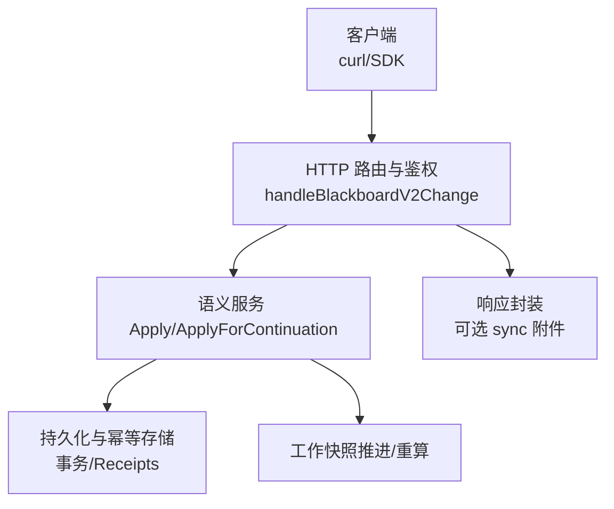
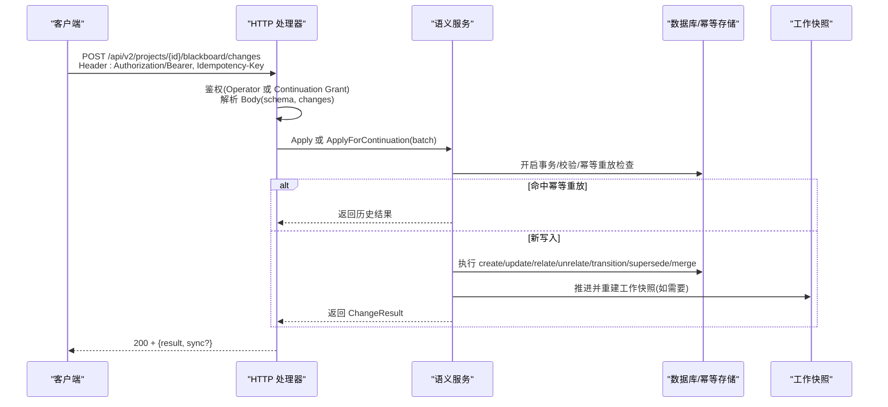
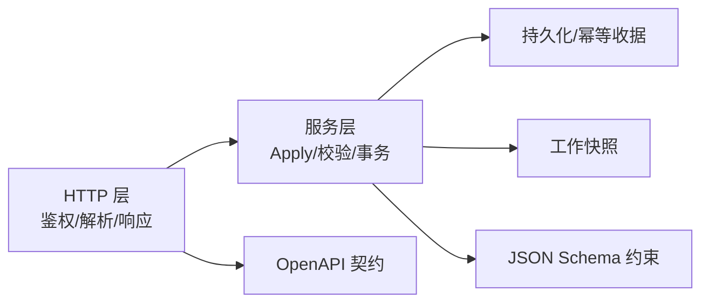
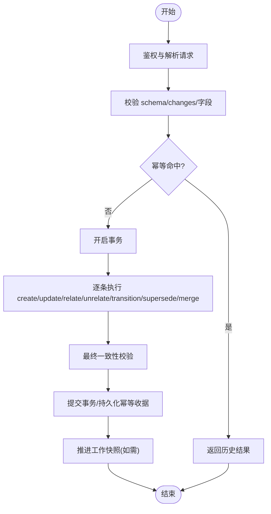

# 语义变更接口

<cite>
**本文引用的文件**   
- [internal/daemon/blackboard_v2_http.go](file://internal/daemon/blackboard_v2_http.go)
- [internal/blackboardv2/service.go](file://internal/blackboardv2/service.go)
- [internal/blackboardv2contract/contractdata/openapi.json](file://internal/blackboardv2contract/contractdata/openapi.json)
- [internal/blackboardv2contract/contractdata/schemas/blackboard-v2.schema.json](file://internal/blackboardv2contract/contractdata/schemas/blackboard-v2.schema.json)
- [scripts/smoke-sandbox-mcp-live.sh](file://scripts/smoke-sandbox-mcp-live.sh)
</cite>

## 目录
1. [简介](#简介)
2. [项目结构](#项目结构)
3. [核心组件](#核心组件)
4. [架构总览](#架构总览)
5. [详细组件分析](#详细组件分析)
6. [依赖关系分析](#依赖关系分析)
7. [性能与并发特性](#性能与并发特性)
8. [故障排查指南](#故障排查指南)
9. [结论](#结论)
10. [附录](#附录)

## 简介
本文件为 Blackboard v2 的“语义变更”接口文档，聚焦 POST /api/v2/projects/{project_id}/blackboard/changes。该端点提供原子性的语义变更批处理机制，支持实体创建、关系建立、事实记录、状态迁移、替代合并等操作类型；通过 Idempotency-Key 保证幂等性，并通过 Schema 版本管理确保协议演进可控。同时说明与 Continuation 认证的结合使用方式、错误处理策略（version_conflict、key_conflict、relationship_conflict）、重试机制与并发控制。

## 项目结构
Blackboard v2 语义变更能力由三层组成：
- HTTP 适配层：负责鉴权、请求解析、同步附件注入、错误映射与响应封装。
- 领域服务层：实现 ChangeBatch 校验、原子事务应用、幂等重放、工作快照推进与结果构建。
- 契约与模式：OpenAPI 描述与 JSON Schema 定义，约束请求/响应结构与字段枚举。

图表来源
- [internal/daemon/blackboard_v2_http.go:29-46](file://internal/daemon/blackboard_v2_http.go#L29-L46)
- [internal/daemon/blackboard_v2_http.go:97-125](file://internal/daemon/blackboard_v2_http.go#L97-L125)
- [internal/blackboardv2/service.go:644-656](file://internal/blackboardv2/service.go#L644-L656)
- [internal/blackboardv2/service.go:824-855](file://internal/blackboardv2/service.go#L824-L855)

章节来源
- [internal/daemon/blackboard_v2_http.go:29-46](file://internal/daemon/blackboard_v2_http.go#L29-L46)
- [internal/blackboardv2/service.go:644-656](file://internal/blackboardv2/service.go#L644-L656)

## 核心组件
- 变更批次 ChangeBatch
  - schema: 固定为 "semantic-change-batch/v2"
  - idempotency_key: 必填，用于幂等重放
  - changes: 数组，每项为一条原子操作
- 变更项 Change
  - op: create/update/relate/unrelate/transition/supersede/merge
  - 各 op 对应不同字段组合，详见后文
- 结果 ChangeResult
  - schema: "semantic-change-result/v2"
  - revision: 项目级全局修订号
  - records/relations: 本次变更影响的记录与关系版本元组
  - working_snapshot: 指向运行时工作快照路径与修订号

章节来源
- [internal/blackboardv2/service.go:72-77](file://internal/blackboardv2/service.go#L72-L77)
- [internal/blackboardv2/service.go:122-147](file://internal/blackboardv2/service.go#L122-L147)
- [internal/blackboardv2/service.go:414-421](file://internal/blackboardv2/service.go#L414-L421)

## 架构总览
POST /api/v2/projects/{project_id}/blackboard/changes 的请求-响应时序如下：

图表来源
- [internal/daemon/blackboard_v2_http.go:97-125](file://internal/daemon/blackboard_v2_http.go#L97-L125)
- [internal/blackboardv2/service.go:824-855](file://internal/blackboardv2/service.go#L824-L855)
- [internal/blackboardv2/service.go:1131-1153](file://internal/blackboardv2/service.go#L1131-L1153)

## 详细组件分析

### 端点定义与认证
- 路径与方法
  - POST /api/v2/projects/{project_id}/blackboard/changes
- 必需请求头
  - Authorization: Bearer <token>
    - Operator 模式：当未配置 daemon token 时，允许无 Bearer 的本地 operator 调用，需携带 CyberPenda-Actor-ID 头
    - Continuation 模式：必须携带有效的 Continuation Interface Grant
  - Idempotency-Key: 必填，字符串非空
- 请求体
  - schema: 固定值 "semantic-change-batch/v2"
  - changes: 变更数组
- 响应体
  - 成功：包含 result 对象，可能附带 sync 同步附件
  - 失败：统一 error 信封，部分错误码可带 Retry-After

章节来源
- [internal/daemon/blackboard_v2_http.go:29-46](file://internal/daemon/blackboard_v2_http.go#L29-L46)
- [internal/daemon/blackboard_v2_http.go:52-95](file://internal/daemon/blackboard_v2_http.go#L52-L95)
- [internal/daemon/blackboard_v2_http.go:97-125](file://internal/daemon/blackboard_v2_http.go#L97-L125)
- [internal/blackboardv2contract/contractdata/openapi.json:17-100](file://internal/blackboardv2contract/contractdata/openapi.json#L17-L100)

### ChangeBatch 与 Schema 版本管理
- 强制 schema 字段为 "semantic-change-batch/v2"
- 禁止未知字段；changes 必须为非 null 数组
- 每个 change 的 op 决定其合法字段集合，未知字段会被拒绝

章节来源
- [internal/blackboardv2/service.go:72-120](file://internal/blackboardv2/service.go#L72-L120)
- [internal/blackboardv2/service.go:149-232](file://internal/blackboardv2/service.go#L149-L232)
- [internal/blackboardv2contract/contractdata/schemas/blackboard-v2.schema.json:1-120](file://internal/blackboardv2contract/contractdata/schemas/blackboard-v2.schema.json#L1-L120)

### Changes 数组中的操作类型
- create
  - 用途：创建实体/目标/尝试/事实/发现/解决方案/证据
  - 关键字段：op, key, type, record
- update
  - 用途：对现有记录进行受控更新，支持 clear 列表清理字段
  - 关键字段：op, key, version, type, record, clear
- relate
  - 用途：建立关系边，支持 reason 与版本控制
  - 关键字段：op, from, relation, to, version, reason
- unrelate
  - 用途：删除关系边
  - 关键字段：op, from, relation, to, version
- transition
  - 用途：记录状态迁移（如事实置信度、尝试终态、方案验证）
  - 关键字段：op, key, version, status, summary, resolution_summary, verification_summary
- supersede
  - 用途：以新版本替换旧版本，自动标记旧版为已替代
  - 关键字段：op, replacement, replacement_version, replaced, replaced_version
- merge
  - 用途：显式身份合并，将源记录归并到规范记录，保留规范稳定键
  - 关键字段：op, source, source_version, canonical, canonical_version, canonical_record, clear

注意：
- 某些操作在 Continuation 模式下受限（例如 merge 仅允许 operator 发起）
- 关系类型、记录类型、状态枚举由 JSON Schema 严格约束

章节来源
- [internal/blackboardv2/service.go:122-147](file://internal/blackboardv2/service.go#L122-L147)
- [internal/blackboardv2/service.go:149-232](file://internal/blackboardv2/service.go#L149-L232)
- [internal/blackboardv2/service.go:965-1054](file://internal/blackboardv2/service.go#L965-L1054)
- [internal/blackboardv2contract/contractdata/schemas/blackboard-v2.schema.json:43-100](file://internal/blackboardv2contract/contractdata/schemas/blackboard-v2.schema.json#L43-L100)

### 幂等性与重放
- 幂等范围
  - 按 project_id 与 continuation_id（若存在）划分作用域
  - 基于规范化后的请求体计算哈希，与 Idempotency-Key 共同作为唯一键
- 行为
  - 相同 scope + key + 相同 payload hash：精确返回历史结果，不产生新版本或重复边
  - 相同 scope + key + 不同 payload hash：返回 idempotency_conflict
  - 同一 key 的 create 重试使用新的 Idempotency-Key 仍会触发 key_conflict
- 存储
  - 幂等收据持久化，包含 request_hash 与 result_json

章节来源
- [internal/blackboardv2/service.go:824-855](file://internal/blackboardv2/service.go#L824-L855)
- [internal/blackboardv2/service.go:867-881](file://internal/blackboardv2/service.go#L867-L881)
- [internal/blackboardv2/service.go:1131-1137](file://internal/blackboardv2/service.go#L1131-L1137)
- [docs/specs/blackboard-graph-contract.md:509-527](file://docs/specs/blackboard-graph-contract.md#L509-L527)

### 原子性与事务边界
- 整个 batch 在一个数据库事务内执行
- 任一变更失败则整体回滚
- 成功后才推进工作快照并持久化幂等收据

章节来源
- [internal/blackboardv2/service.go:824-855](file://internal/blackboardv2/service.go#L824-L855)
- [internal/blackboardv2/service.go:1138-1153](file://internal/blackboardv2/service.go#L1138-L1153)

### 与 Continuation 认证的结合
- Operator 模式
  - 无需 Bearer Token（且 daemon 未配置 server.authToken），可传入 CyberPenda-Actor-ID 标识操作者
- Continuation 模式
  - 必须携带有效的 Bearer Token（Continuation Interface Grant）
  - 服务端校验 grant 可读/可写权限、project_id 匹配、continuation 是否关闭
  - 某些操作（如 merge）在 Continuation 模式下被拒绝
- 同步附件
  - 对于写操作，服务端可能附加 sync 信息，用于跨进程/重启后的确定性重投递

章节来源
- [internal/daemon/blackboard_v2_http.go:52-95](file://internal/daemon/blackboard_v2_http.go#L52-L95)
- [internal/daemon/blackboard_v2_http.go:368-438](file://internal/daemon/blackboard_v2_http.go#L368-L438)
- [internal/blackboardv2/service.go:882-900](file://internal/blackboardv2/service.go#L882-L900)

### 错误处理与状态码
- 常见错误码
  - invalid_schema：请求体/头部/参数不符合协议
  - authority_denied：鉴权失败或权限不足
  - not_found：记录不存在
  - closed_continuation：Continuation 已关闭
  - version_conflict：版本冲突（supersede/transition 等）
  - key_conflict：键冲突（create 重复键）
  - relationship_conflict：关系冲突（方向/循环/自环等）
  - semantic_validation：语义校验失败（字段缺失/枚举非法/生命周期不允许）
  - storage_busy：存储忙（SQLite 锁竞争），可重试
  - internal：内部异常
- HTTP 状态码映射
  - 400 invalid_schema
  - 401/403 authority_denied
  - 404 not_found
  - 409 version_conflict/key_conflict/relationship_conflict/idempotency_conflict/finish_conflict
  - 410 closed_continuation
  - 422 semantic_validation/continuation_open_attempts/continuation_pending_writes/project_kind_mismatch
  - 500 internal
  - 503 storage_busy（带 Retry-After）

章节来源
- [internal/daemon/blackboard_v2_http.go:539-642](file://internal/daemon/blackboard_v2_http.go#L539-L642)
- [internal/blackboardv2contract/contractdata/openapi.json:871-927](file://internal/blackboardv2contract/contractdata/openapi.json#L871-L927)

### 重试机制与并发控制
- 重试建议
  - 收到 503 storage_busy 时，遵循 Retry-After 进行退避重试
  - 幂等键不变的情况下，重试不会导致重复写入
- 并发控制
  - 服务层写锁串行化 Apply 调用，避免并发写入导致的竞态
  - 幂等重放优先于业务逻辑，命中即直接返回历史结果

章节来源
- [internal/daemon/blackboard_v2_http.go:554-556](file://internal/daemon/blackboard_v2_http.go#L554-L556)
- [internal/blackboardv2/service.go:824-831](file://internal/blackboardv2/service.go#L824-L831)
- [internal/blackboardv2/service.go:867-881](file://internal/blackboardv2/service.go#L867-L881)

### 请求/响应示例（路径引用）
- curl 示例（来自沙箱冒烟脚本）
  - 参考路径：[scripts/smoke-sandbox-mcp-live.sh:92-129](file://scripts/smoke-sandbox-mcp-live.sh#L92-L129)
- OpenAPI 契约
  - 路径与响应定义：[internal/blackboardv2contract/contractdata/openapi.json:17-100](file://internal/blackboardv2contract/contractdata/openapi.json#L17-L100)
- Go SDK 调用
  - 通过 blackboardv2.Service.Apply/ApplyForContinuation 调用，参见：
    - [internal/blackboardv2/service.go:644-656](file://internal/blackboardv2/service.go#L644-L656)

## 依赖关系分析
- HTTP 层依赖
  - 鉴权与 Principal 构造
  - 同步附件注入与 ETag/If-None-Match 条件响应
- 服务层依赖
  - 事务与幂等存储
  - 工作快照推进与重算
  - 关系与记录的强校验器
- 契约层依赖
  - OpenAPI 描述与 JSON Schema 约束

图表来源
- [internal/daemon/blackboard_v2_http.go:97-125](file://internal/daemon/blackboard_v2_http.go#L97-L125)
- [internal/blackboardv2/service.go:824-855](file://internal/blackboardv2/service.go#L824-L855)
- [internal/blackboardv2contract/contractdata/openapi.json:17-100](file://internal/blackboardv2contract/contractdata/openapi.json#L17-L100)
- [internal/blackboardv2contract/contractdata/schemas/blackboard-v2.schema.json:1-120](file://internal/blackboardv2contract/contractdata/schemas/blackboard-v2.schema.json#L1-L120)

## 性能与并发特性
- 写锁串行化：服务层 writeMu 保证同一时刻只有一个 Apply 在执行，避免并发写入冲突
- 幂等重放快速路径：命中幂等收据直接返回，减少不必要的计算与 I/O
- 工作快照增量推进：仅在必要时推进并重算，降低开销
- 读优化：读取接口支持 ETag/If-None-Match，减少带宽与 CPU

章节来源
- [internal/blackboardv2/service.go:824-831](file://internal/blackboardv2/service.go#L824-L831)
- [internal/blackboardv2/service.go:867-881](file://internal/blackboardv2/service.go#L867-L881)
- [internal/daemon/blackboard_v2_http.go:375-438](file://internal/daemon/blackboard_v2_http.go#L375-L438)

## 故障排查指南
- 常见问题定位
  - 401/403：检查 Authorization 是否正确、Continuation Grant 是否有效且未被撤销
  - 409 version_conflict：确认 version 字段与当前版本一致，先读取当前记录再提交
  - 409 key_conflict：检查 key 是否已被创建，避免重复 create
  - 409 relationship_conflict：检查关系方向、是否存在自环或循环
  - 422 semantic_validation：根据 path 定位具体字段，对照 JSON Schema 校验
  - 503 storage_busy：等待 Retry-After 后重试
- 调试建议
  - 打印/记录 Idempotency-Key 与请求体哈希，便于复现幂等重放问题
  - 使用 ReadCurrent/ReadHistory 查看关键实体的当前状态与历史

章节来源
- [internal/daemon/blackboard_v2_http.go:539-642](file://internal/daemon/blackboard_v2_http.go#L539-L642)
- [internal/blackboardv2/service.go:824-855](file://internal/blackboardv2/service.go#L824-L855)

## 结论
POST /api/v2/projects/{project_id}/blackboard/changes 提供了面向黑板的原子语义变更能力，具备严格的 Schema 版本管理、完善的幂等保障与清晰的错误分类。配合 Continuation 认证与工作快照机制，可在分布式与不可靠网络环境下可靠地推进项目知识图谱。

## 附录

### 典型操作流程（流程图）

图表来源
- [internal/daemon/blackboard_v2_http.go:97-125](file://internal/daemon/blackboard_v2_http.go#L97-L125)
- [internal/blackboardv2/service.go:824-855](file://internal/blackboardv2/service.go#L824-L855)
- [internal/blackboardv2/service.go:1131-1153](file://internal/blackboardv2/service.go#L1131-L1153)