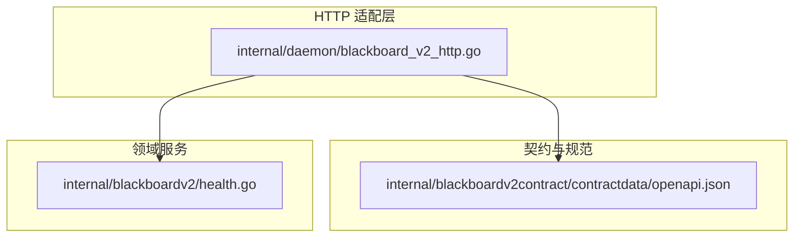
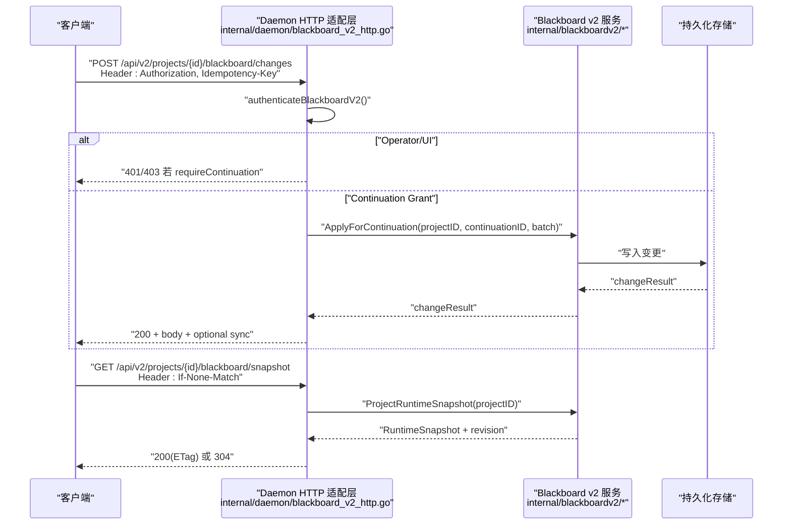
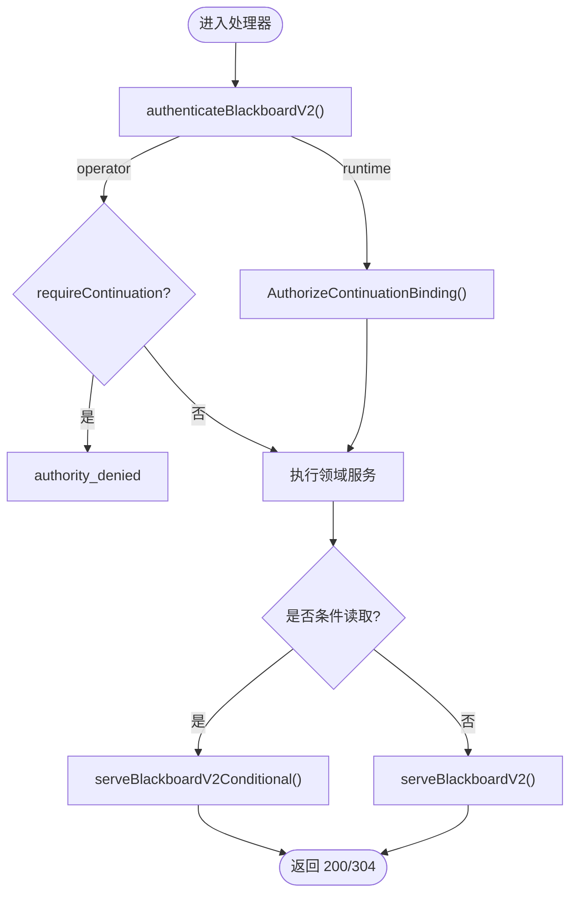

# REST API 接口

<cite>
**本文引用的文件**
- [internal/daemon/blackboard_v2_http.go](file://internal/daemon/blackboard_v2_http.go)
- [internal/blackboardv2contract/contractdata/openapi.json](file://internal/blackboardv2contract/contractdata/openapi.json)
- [internal/blackboardv2/health.go](file://internal/blackboardv2/health.go)
- [README.md](file://README.md)
</cite>

## 目录
1. [简介](#简介)
2. [项目结构](#项目结构)
3. [核心组件](#核心组件)
4. [架构总览](#架构总览)
5. [详细端点文档](#详细端点文档)
6. [依赖关系分析](#依赖关系分析)
7. [性能与缓存](#性能与缓存)
8. [故障排查指南](#故障排查指南)
9. [结论](#结论)
10. [附录：认证与最佳实践](#附录认证与最佳实践)

## 简介
本文件为 CyberPenda Blackboard v2 的完整 REST API 接口文档，聚焦以下核心端点：
- POST /api/v2/projects/{project_id}/blackboard/changes
- GET /api/v2/projects/{project_id}/blackboard/snapshot
- GET /api/v2/projects/{project_id}/blackboard/health
并补充当前读、历史分页、证据保留、尝试检查点、Continuation Finish 以及报告导出等配套端点。文档包含 HTTP 方法、URL 模式、请求参数、请求体 Schema、响应格式、状态码说明、认证机制（Continuation Grant 与 Daemon Auth）使用示例、错误处理策略与最佳实践。

## 项目结构
Blackboard v2 的 HTTP 适配层位于 daemon 包中，OpenAPI 契约定义在 contractdata 下，健康诊断逻辑在 blackboardv2 服务中实现。

图表来源
- [internal/daemon/blackboard_v2_http.go:29-46](file://internal/daemon/blackboard_v2_http.go#L29-L46)
- [internal/blackboardv2contract/contractdata/openapi.json:1-15](file://internal/blackboardv2contract/contractdata/openapi.json#L1-L15)
- [internal/blackboardv2/health.go:84-183](file://internal/blackboardv2/health.go#L84-L183)

章节来源
- [internal/daemon/blackboard_v2_http.go:29-46](file://internal/daemon/blackboard_v2_http.go#L29-L46)
- [internal/blackboardv2contract/contractdata/openapi.json:1-15](file://internal/blackboardv2contract/contractdata/openapi.json#L1-L15)
- [internal/blackboardv2/health.go:84-183](file://internal/blackboardv2/health.go#L84-L183)

## 核心组件
- 路由注册与鉴权：统一通过 authenticateBlackboardV2 完成 Continuation Grant 或 Daemon Auth 校验，并将结果封装为 principal 供后续处理器使用。
- 语义变更流水线：POST changes 支持幂等键 Idempotency-Key，返回 changeResult；可选同步附件 sync 携带最新 Runtime Snapshot。
- 条件读取：snapshot、health、records/{key} 支持 ETag + If-None-Match 的 304 Not Modified。
- 历史分页：records/{key}/history 支持 cursor 和 limit 分页。
- 证据与检查点：evidence:retain 与 attempts/{key}:checkpoint 需要 Continuation 绑定且要求幂等键。
- Finish：continuation:finish 用于结束一个 Continuation，仅允许空体或 {}。
- 报告导出：reports/pentest 与 reports/ctf-solution 支持 markdown/json 两种输出。

章节来源
- [internal/daemon/blackboard_v2_http.go:52-95](file://internal/daemon/blackboard_v2_http.go#L52-L95)
- [internal/daemon/blackboard_v2_http.go:97-125](file://internal/daemon/blackboard_v2_http.go#L97-L125)
- [internal/daemon/blackboard_v2_http.go:127-159](file://internal/daemon/blackboard_v2_http.go#L127-L159)
- [internal/daemon/blackboard_v2_http.go:161-197](file://internal/daemon/blackboard_v2_http.go#L161-L197)
- [internal/daemon/blackboard_v2_http.go:199-268](file://internal/daemon/blackboard_v2_http.go#L199-L268)
- [internal/daemon/blackboard_v2_http.go:330-366](file://internal/daemon/blackboard_v2_http.go#L330-L366)
- [internal/daemon/blackboard_v2_http.go:270-317](file://internal/daemon/blackboard_v2_http.go#L270-L317)

## 架构总览
下图展示了客户端到服务端的关键调用路径与数据流，包括鉴权、语义操作、同步附件与条件响应。

图表来源
- [internal/daemon/blackboard_v2_http.go:97-125](file://internal/daemon/blackboard_v2_http.go#L97-L125)
- [internal/daemon/blackboard_v2_http.go:127-142](file://internal/daemon/blackboard_v2_http.go#L127-L142)
- [internal/daemon/blackboard_v2_http.go:368-438](file://internal/daemon/blackboard_v2_http.go#L368-L438)

## 详细端点文档

### 通用约定
- 基础路径：/api/v2/projects/{project_id}
- 内容类型：application/json
- 输入限制：最大 4 MiB
- 幂等性：写操作需设置 Idempotency-Key 请求头
- 条件读取：部分 GET 端点支持 If-None-Match 与 ETag
- 同步附件：成功或失败时可能附带 sync 字段，携带同一 Project 的最新快照以便重试

章节来源
- [internal/daemon/blackboard_v2_http.go:18](file://internal/daemon/blackboard_v2_http.go#L18)
- [internal/daemon/blackboard_v2_http.go:465-471](file://internal/daemon/blackboard_v2_http.go#L465-L471)
- [internal/daemon/blackboard_v2_http.go:500-513](file://internal/daemon/blackboard_v2_http.go#L500-L513)
- [internal/daemon/blackboard_v2_http.go:515-537](file://internal/daemon/blackboard_v2_http.go#L515-L537)

---

### POST /api/v2/projects/{project_id}/blackboard/changes
- 功能：原子提交一组语义变更（实体、事实、关系等）。
- 认证：
  - Operator/UI：Authorization: Bearer <daemon-token>（当未配置 daemon token 时可免鉴权）
  - Runtime：Authorization: Bearer <Continuation Interface Grant>
- 必填请求头：
  - Idempotency-Key：幂等键，用于精确重放与同步附件关联
- 请求体 Schema：
  - schema: "semantic-change-batch/v2"
  - changes: Change[]
- 响应：
  - 200：changeResult
  - 4xx/5xx：标准语义错误信封 { error, sync? }
- 关键行为：
  - 支持 exact replay（Finish 后仍可重放相同 Idempotency-Key）
  - 可附加 sync 同步附件（含 Revision 与完整 Runtime Snapshot）

章节来源
- [internal/daemon/blackboard_v2_http.go:97-125](file://internal/daemon/blackboard_v2_http.go#L97-L125)
- [internal/blackboardv2contract/contractdata/openapi.json:17-100](file://internal/blackboardv2contract/contractdata/openapi.json#L17-L100)

---

### GET /api/v2/projects/{project_id}/blackboard/snapshot
- 功能：获取完整的运行时快照（工作项与知识图谱），用于 UI 展示与离线消费。
- 认证：同 changes
- 可选请求头：
  - If-None-Match：强 ETag 比较，匹配则返回 304
- 响应：
  - 200：RuntimeSnapshot + ETag
  - 304：未修改
  - 4xx/5xx：标准语义错误信封
- 注意：
  - 关闭的 Continuation 不再具备“当前知识”读取权限（仅保留精确重放能力）

章节来源
- [internal/daemon/blackboard_v2_http.go:127-142](file://internal/daemon/blackboard_v2_http.go#L127-L142)
- [internal/blackboardv2contract/contractdata/openapi.json:102-159](file://internal/blackboardv2contract/contractdata/openapi.json#L102-L159)

---

### GET /api/v2/projects/{project_id}/blackboard/health
- 功能：返回项目的确定性语义健康诊断与注意力预算评估（不阻塞启动）。
- 认证：同 snapshot
- 可选请求头：If-None-Match
- 响应：
  - 200：SemanticHealth（schema、revision、status、attention、anomalies、proposals）+ ETag
  - 304：未修改
  - 4xx/5xx：标准语义错误信封
- 健康指标要点：
  - status：healthy | attention | warning | critical
  - attention：bytes、estimated_tokens、state、complete、launchable、consolidation_offered/required
  - anomalies：按严重级别排序的可行动异常列表
  - proposals：需审批的操作建议（如启动 Reason Task 进行合并）

章节来源
- [internal/daemon/blackboard_v2_http.go:144-159](file://internal/daemon/blackboard_v2_http.go#L144-L159)
- [internal/blackboardv2/health.go:84-183](file://internal/blackboardv2/health.go#L84-L183)
- [internal/blackboardv2contract/contractdata/openapi.json:161-218](file://internal/blackboardv2contract/contractdata/openapi.json#L161-L218)

---

### GET /api/v2/projects/{project_id}/blackboard/records/{key}
- 功能：按 key 获取当前记录详情（entity/fact/finding/solution/evidence 等）。
- 认证：同 snapshot
- 可选请求头：If-None-Match
- 响应：
  - 200：currentDetail + ETag
  - 304：未修改
  - 4xx/5xx：标准语义错误信封

章节来源
- [internal/daemon/blackboard_v2_http.go:161-175](file://internal/daemon/blackboard_v2_http.go#L161-L175)
- [internal/blackboardv2contract/contractdata/openapi.json:220-280](file://internal/blackboardv2contract/contractdata/openapi.json#L220-L280)

---

### GET /api/v2/projects/{project_id}/blackboard/records/{key}/history
- 功能：获取指定 key 的显式语义历史，支持游标分页。
- 认证：同 snapshot
- 查询参数：
  - cursor：上一页返回的不透明游标
  - limit：每页条数（默认 20，范围 1..100）
- 响应：
  - 200：semanticHistory 页面
  - 4xx/5xx：标准语义错误信封

章节来源
- [internal/daemon/blackboard_v2_http.go:177-197](file://internal/daemon/blackboard_v2_http.go#L177-L197)
- [internal/blackboardv2contract/contractdata/openapi.json:282-347](file://internal/blackboardv2contract/contractdata/openapi.json#L282-L347)

---

### POST /api/v2/projects/{project_id}/blackboard/evidence:retain
- 功能：以受信任方式保留证据工件（source_path、artifact_type、summary 等）。
- 认证：必须为 Continuation（requireContinuation=true）
- 必填请求头：Idempotency-Key
- 请求体 Schema：
  - key、attempt、source_path、artifact_type、summary 为必填
  - 可选：version、media_type、captured_at、links
- 响应：
  - 200：changeResult
  - 4xx/5xx：标准语义错误信封

章节来源
- [internal/daemon/blackboard_v2_http.go:199-236](file://internal/daemon/blackboard_v2_http.go#L199-L236)
- [internal/blackboardv2contract/contractdata/openapi.json:349-457](file://internal/blackboardv2contract/contractdata/openapi.json#L349-L457)

---

### POST /api/v2/projects/{project_id}/blackboard/attempts/{key}:checkpoint
- 功能：对 Attempt 进行检查点记录（version、summary）。
- 认证：必须为 Continuation
- 必填请求头：Idempotency-Key
- 请求体 Schema：
  - version、summary 必填
- 响应：
  - 200：changeResult
  - 4xx/5xx：标准语义错误信封

章节来源
- [internal/daemon/blackboard_v2_http.go:238-268](file://internal/daemon/blackboard_v2_http.go#L238-L268)
- [internal/blackboardv2contract/contractdata/openapi.json:459-541](file://internal/blackboardv2contract/contractdata/openapi.json#L459-L541)

---

### POST /api/v2/projects/{project_id}/continuation:finish
- 功能：结束一个 Continuation。
- 认证：必须为 Continuation
- 必填请求头：Idempotency-Key
- 请求体：必须为空或 {}
- 响应：
  - 200：finishResult
  - 4xx/5xx：标准语义错误信封

章节来源
- [internal/daemon/blackboard_v2_http.go:330-366](file://internal/daemon/blackboard_v2_http.go#L330-L366)
- [internal/blackboardv2contract/contractdata/openapi.json:543-611](file://internal/blackboardv2contract/contractdata/openapi.json#L543-L611)

---

### GET /api/v2/projects/{project_id}/reports/pentest
- 功能：生成渗透测试报告（markdown 或 json）。
- 认证：同 snapshot
- 查询参数：
  - format：markdown | json（默认 markdown）
- 可选请求头：If-None-Match
- 响应：
  - 200：reportMarkdown 或 pentestReport + ETag
  - 304：未修改
  - 4xx/5xx：标准语义错误信封

章节来源
- [internal/daemon/blackboard_v2_http.go:270-293](file://internal/daemon/blackboard_v2_http.go#L270-L293)
- [internal/blackboardv2contract/contractdata/openapi.json:613-694](file://internal/blackboardv2contract/contractdata/openapi.json#L613-L694)

---

### GET /api/v2/projects/{project_id}/reports/ctf-solution
- 功能：生成 CTF 解题方案（markdown 或 json）。
- 认证：同 snapshot
- 查询参数：format：markdown | json（默认 markdown）
- 可选请求头：If-None-Match
- 响应：
  - 200：reportMarkdown 或 ctfSolution + ETag
  - 304：未修改
  - 4xx/5xx：标准语义错误信封

章节来源
- [internal/daemon/blackboard_v2_http.go:295-317](file://internal/daemon/blackboard_v2_http.go#L295-L317)
- [internal/blackboardv2contract/contractdata/openapi.json:696-777](file://internal/blackboardv2contract/contractdata/openapi.json#L696-L777)

## 依赖关系分析
- 路由注册：registerBlackboardV2Routes 将 /api/v2 下的所有 Blackboard v2 路径映射至对应处理器。
- 鉴权流程：authenticateBlackboardV2 区分 operator 与 runtime 两类身份，并对 requireContinuation 做强制校验。
- 条件响应：serveBlackboardV2Conditional 基于 revision 计算 ETag，并正确处理 If-None-Match。
- 同步附件：根据 Idempotency-Key 与路径指纹，在错误或成功路径上捕获并附加 sync。

图表来源
- [internal/daemon/blackboard_v2_http.go:29-46](file://internal/daemon/blackboard_v2_http.go#L29-L46)
- [internal/daemon/blackboard_v2_http.go:52-95](file://internal/daemon/blackboard_v2_http.go#L52-L95)
- [internal/daemon/blackboard_v2_http.go:368-438](file://internal/daemon/blackboard_v2_http.go#L368-L438)

章节来源
- [internal/daemon/blackboard_v2_http.go:29-46](file://internal/daemon/blackboard_v2_http.go#L29-L46)
- [internal/daemon/blackboard_v2_http.go:52-95](file://internal/daemon/blackboard_v2_http.go#L52-L95)
- [internal/daemon/blackboard_v2_http.go:368-438](file://internal/daemon/blackboard_v2_http.go#L368-L438)

## 性能与缓存
- 条件读取：snapshot、health、records/{key} 均返回 ETag，客户端应缓存并使用 If-None-Match 避免重复传输。
- 历史分页：history 使用 cursor 分页，limit 上限 100，避免一次性拉取过多数据。
- 同步附件：sync 仅在需要时附加，减少不必要负载。

章节来源
- [internal/daemon/blackboard_v2_http.go:500-513](file://internal/daemon/blackboard_v2_http.go#L500-L513)
- [internal/daemon/blackboard_v2_http.go:177-197](file://internal/daemon/blackboard_v2_http.go#L177-L197)
- [internal/daemon/blackboard_v2_http.go:515-537](file://internal/daemon/blackboard_v2_http.go#L515-L537)

## 故障排查指南
- 常见错误码与含义：
  - 400 invalid_schema：请求体或参数不符合 Schema
  - 401 authority_denied（authorization）：缺少或无效授权
  - 403 authority_denied（非 authorization）：权限不足
  - 404 not_found：资源不存在
  - 409 conflict：版本/键/关系/幂等/finish 冲突
  - 410 closed_continuation：Continuation 已关闭
  - 422 semantic_validation 等：语义校验失败
  - 500 internal：内部错误
  - 503 storage_busy：数据库忙，带 Retry-After
- 错误信封：{ error: { code, message, path, retryable }, sync? }
- 调试建议：
  - 确认 Authorization 与 Idempotency-Key 是否正确
  - 使用 If-None-Match 验证 ETag 一致性
  - 关注 sync 附件中的 revision 与快照，辅助定位不一致

章节来源
- [internal/daemon/blackboard_v2_http.go:539-580](file://internal/daemon/blackboard_v2_http.go#L539-L580)
- [internal/daemon/blackboard_v2_http.go:612-642](file://internal/daemon/blackboard_v2_http.go#L612-L642)
- [internal/daemon/blackboard_v2_http.go:557-562](file://internal/daemon/blackboard_v2_http.go#L557-L562)

## 结论
Blackboard v2 提供一套封闭、稳定、可扩展的语义接口，覆盖变更、快照、健康诊断、历史、证据、检查点与 Finish 等关键能力。通过严格的鉴权模型、幂等性与同步附件机制，确保跨进程与跨容器的可靠协作。配合 ETag 与分页，可在大规模项目中保持高效与一致。

## 附录：认证与最佳实践

### 认证机制
- Continuation Grant（Runtime）
  - 使用 Authorization: Bearer <Continuation Interface Grant>
  - 适用于 changes、evidence:retain、attempts/:checkpoint、continuation:finish 等需要绑定的端点
- Daemon Auth（Operator/UI）
  - 使用 Authorization: Bearer <daemon-token>（当未配置 daemon token 时可免鉴权）
  - 适用于 snapshot、health、records、history、reports 等只读或管理端点

章节来源
- [internal/daemon/blackboard_v2_http.go:52-95](file://internal/daemon/blackboard_v2_http.go#L52-L95)
- [internal/blackboardv2contract/contractdata/openapi.json:781-792](file://internal/blackboardv2contract/contractdata/openapi.json#L781-L792)
- [README.md:110-126](file://README.md#L110-L126)

### 请求/响应示例（路径引用）
- changes 请求体与响应：参见 OpenAPI 定义
  - [internal/blackboardv2contract/contractdata/openapi.json:17-100](file://internal/blackboardv2contract/contractdata/openapi.json#L17-L100)
- snapshot 条件读取与 ETag：参见 OpenAPI 定义
  - [internal/blackboardv2contract/contractdata/openapi.json:102-159](file://internal/blackboardv2contract/contractdata/openapi.json#L102-L159)
- health 健康诊断结构：参见 OpenAPI 定义与服务实现
  - [internal/blackboardv2contract/contractdata/openapi.json:161-218](file://internal/blackboardv2contract/contractdata/openapi.json#L161-L218)
  - [internal/blackboardv2/health.go:84-183](file://internal/blackboardv2/health.go#L84-L183)

### 最佳实践
- 幂等性：所有写操作务必设置唯一且稳定的 Idempotency-Key
- 条件读取：对 snapshot/health/records 使用 If-None-Match 与 ETag 减少带宽
- 错误重试：遇到 503 且带 Retry-After 时遵循退避策略
- 同步附件：解析 sync 中的 revision 与快照，用于快速恢复一致性
- 安全边界：禁止在 URL 查询参数中传递 bearer token；仅使用 Authorization 头部

章节来源
- [internal/daemon/blackboard_v2_http.go:465-471](file://internal/daemon/blackboard_v2_http.go#L465-L471)
- [internal/daemon/blackboard_v2_http.go:500-513](file://internal/daemon/blackboard_v2_http.go#L500-L513)
- [internal/daemon/blackboard_v2_http.go:557-562](file://internal/daemon/blackboard_v2_http.go#L557-L562)
- [internal/daemon/blackboard_v2_http.go:53-55](file://internal/daemon/blackboard_v2_http.go#L53-L55)