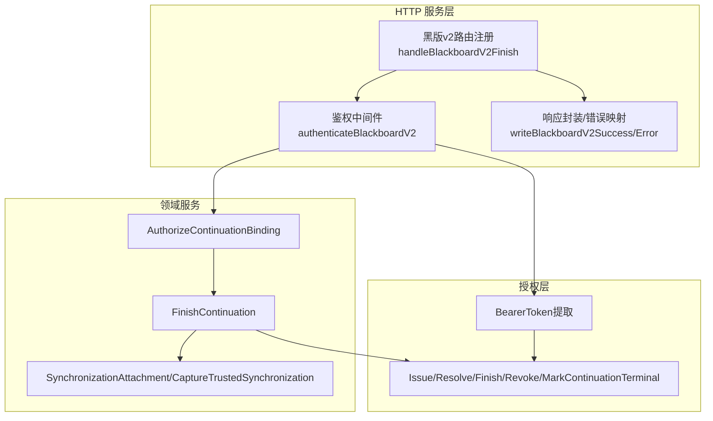
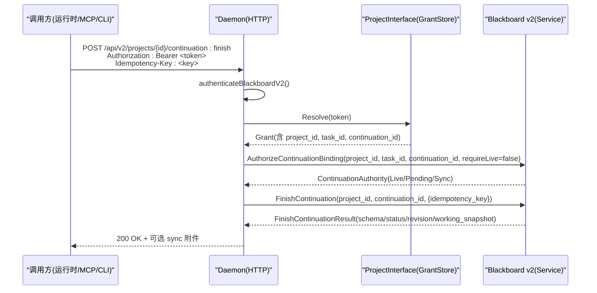
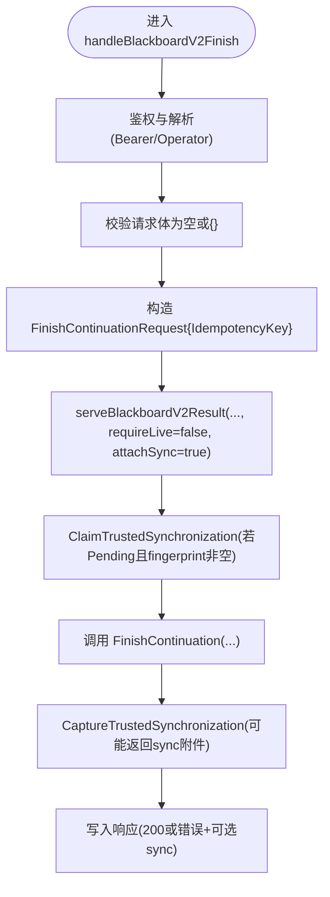
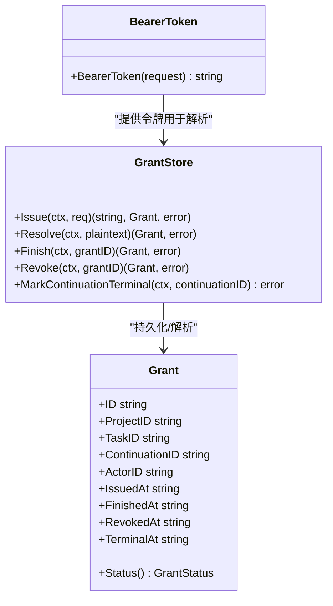
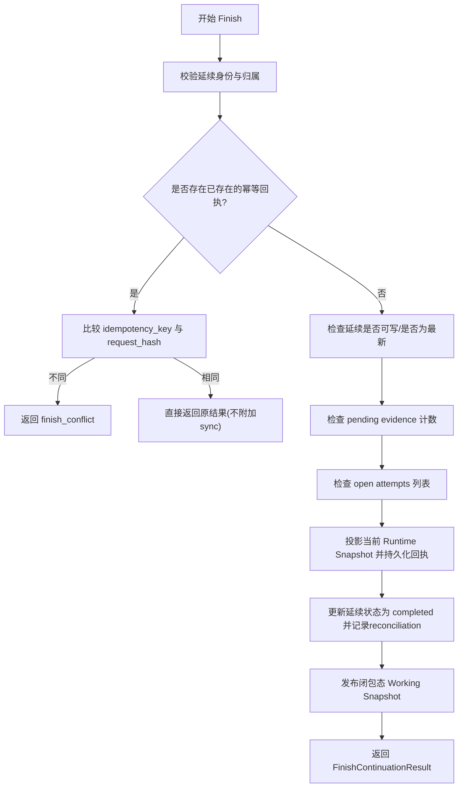
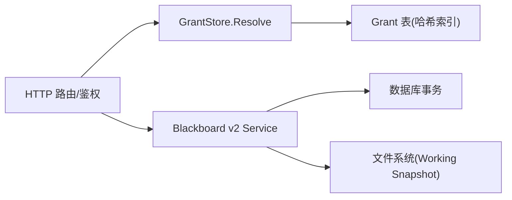

# 延续生命周期接口

<cite>
**本文引用的文件**   
- [blackboard_v2_http.go](file://internal/daemon/blackboard_v2_http.go)
- [finish.go](file://internal/blackboardv2/finish.go)
- [continuity.go](file://internal/blackboardv2/continuity.go)
- [grant.go](file://internal/projectinterface/grant.go)
- [bearer.go](file://internal/projectinterface/bearer.go)
- [server.go](file://internal/daemon/server.go)
- [task_handlers.go](file://internal/daemon/task_handlers.go)
- [blackboard_v2_cli_test.go](file://internal/pentestctl/blackboard_v2_cli_test.go)
</cite>

## 目录
1. [简介](#简介)
2. [项目结构](#项目结构)
3. [核心组件](#核心组件)
4. [架构总览](#架构总览)
5. [详细组件分析](#详细组件分析)
6. [依赖关系分析](#依赖关系分析)
7. [性能与一致性](#性能与一致性)
8. [故障排查指南](#故障排查指南)
9. [结论](#结论)

## 简介
本文件面向“延续（Continuation）生命周期管理”的 API 文档，重点覆盖以下能力：
- 延续接口的创建、管理与结束操作，尤其是 /api/v2/projects/{project_id}/continuation:finish 端点。
- Continuation Interface Grant（延续接口授权）的生成、验证和使用流程。
- 延续状态转换逻辑、超时处理策略、资源清理机制。
- 完整的认证授权示例、错误处理策略，以及与任务生命周期的集成模式。
- 分布式环境下的一致性与可靠性保证（幂等、重放、同步附件、原子提交）。

## 项目结构
延续生命周期相关代码分布在三个层次：
- HTTP 服务层：路由注册、鉴权、请求解析、响应封装、错误映射。
- Blackboard v2 领域服务：延续授权校验、Finish 事务、同步附件、工作快照发布。
- Project Interface 授权层：Grant 签发、解析、生命周期关闭（Finish/Revoke/Terminal）。

图表来源
- [blackboard_v2_http.go:29-46](file://internal/daemon/blackboard_v2_http.go#L29-L46)
- [blackboard_v2_http.go:330-366](file://internal/daemon/blackboard_v2_http.go#L330-L366)
- [blackboard_v2_http.go:52-95](file://internal/daemon/blackboard_v2_http.go#L52-L95)
- [blackboard_v2_http.go:495-562](file://internal/daemon/blackboard_v2_http.go#L495-L562)
- [finish.go:65-228](file://internal/blackboardv2/finish.go#L65-L228)
- [continuity.go:154-192](file://internal/blackboardv2/continuity.go#L154-L192)
- [continuity.go:327-389](file://internal/blackboardv2/continuity.go#L327-L389)
- [grant.go:192-252](file://internal/projectinterface/grant.go#L192-L252)
- [grant.go:318-396](file://internal/projectinterface/grant.go#L318-L396)
- [bearer.go:12-21](file://internal/projectinterface/bearer.go#L12-L21)

章节来源
- [blackboard_v2_http.go:29-46](file://internal/daemon/blackboard_v2_http.go#L29-L46)
- [server.go:120-200](file://internal/daemon/server.go#L120-L200)

## 核心组件
- 延续接口授权（Grant）
  - 签发：绑定 Project/Task/Continuation/Runtime 上下文，返回一次性明文令牌；服务端仅保存哈希。
  - 解析：通过 Authorization/Bearer 或查询参数 token 解析并校验生命周期状态。
  - 生命周期：open → finished/revoked/terminal；finished 后仍允许精确重放与读取，但拒绝新写。
- 延续授权校验（AuthorizeContinuationBinding）
  - 校验 Project/Task/Continuation 归属、是否最新、是否可写（live），并计算同步状态（Pending）。
- Finish 终结
  - 幂等：基于 Idempotency-Key + 请求指纹进行精确重放保护。
  - 前置条件：无待完成证据写入、当前延续的所有 Attempt 必须已终止。
  - 结果：持久化不可变 Finish 回执、更新 Working Snapshot、标记延续为 completed，并释放后续语义变更权限。
- 同步附件（SynchronizationAttachment）
  - 在存在 Pending 时，将当前 Runtime Snapshot 作为可选 sibling 字段附加到成功或错误响应中，确保客户端能拉取最新共享知识。

章节来源
- [grant.go:192-252](file://internal/projectinterface/grant.go#L192-L252)
- [grant.go:318-396](file://internal/projectinterface/grant.go#L318-L396)
- [continuity.go:154-192](file://internal/blackboardv2/continuity.go#L154-L192)
- [finish.go:65-228](file://internal/blackboardv2/finish.go#L65-L228)
- [continuity.go:327-389](file://internal/blackboardv2/continuity.go#L327-L389)

## 架构总览
延续生命周期涉及三层协作：HTTP 服务负责鉴权与协议细节；领域服务负责业务规则与数据一致性；授权层负责能力边界控制。

图表来源
- [blackboard_v2_http.go:330-366](file://internal/daemon/blackboard_v2_http.go#L330-L366)
- [blackboard_v2_http.go:52-95](file://internal/daemon/blackboard_v2_http.go#L52-L95)
- [grant.go:284-302](file://internal/projectinterface/grant.go#L284-L302)
- [continuity.go:154-192](file://internal/blackboardv2/continuity.go#L154-L192)
- [finish.go:65-228](file://internal/blackboardv2/finish.go#L65-L228)

## 详细组件分析

### 端点：POST /api/v2/projects/{project_id}/continuation:finish
- 功能
  - 结束当前受信任的延续，使其不再接受新的语义变更；保留对历史结果的精确重放与只读访问。
- 请求
  - 路径参数：project_id
  - 头部：
    - Authorization: Bearer <continuation-interface-token>
    - Idempotency-Key: <唯一键>
  - 请求体：空或 {}（不允许携带其他字段）
- 响应
  - 成功：200，包含 schema/status/revision/working_snapshot 的 Finish 结果对象。
  - 失败：根据错误码映射到合适的 HTTP 状态码，可能附带 sync 附件。
- 幂等与重放
  - 使用 Idempotency-Key 与请求指纹进行幂等保护；相同 key 的重试返回一致结果且不重复执行副作用。
- 同步附件
  - 当存在 Pending 同步通知时，响应会附带 SynchronizationAttachment，包含 from_revision/revision/snapshot，帮助客户端拉取最新共享知识。

图表来源
- [blackboard_v2_http.go:330-366](file://internal/daemon/blackboard_v2_http.go#L330-L366)
- [blackboard_v2_http.go:389-438](file://internal/daemon/blackboard_v2_http.go#L389-L438)
- [blackboard_v2_http.go:440-463](file://internal/daemon/blackboard_v2_http.go#L440-L463)
- [continuity.go:221-325](file://internal/blackboardv2/continuity.go#L221-L325)
- [continuity.go:327-389](file://internal/blackboardv2/continuity.go#L327-L389)
- [finish.go:65-228](file://internal/blackboardv2/finish.go#L65-L228)

章节来源
- [blackboard_v2_http.go:330-366](file://internal/daemon/blackboard_v2_http.go#L330-L366)
- [blackboard_v2_http.go:389-438](file://internal/daemon/blackboard_v2_http.go#L389-L438)
- [blackboard_v2_http.go:440-463](file://internal/daemon/blackboard_v2_http.go#L440-L463)
- [finish.go:65-228](file://internal/blackboardv2/finish.go#L65-L228)

### 延续接口授权（Grant）的生成、验证与使用
- 生成（Issue）
  - 由 Daemon 在 Launch/Bind 阶段签发，绑定 Project/Task/Continuation/Runtime 上下文，返回一次性明文令牌；服务端仅存储其 SHA-256 哈希。
- 验证（Resolve）
  - 从 Authorization: Bearer 或查询参数 token 中提取令牌，查找对应 Grant，校验生命周期状态（open/finished/revoked/terminal）。
- 使用
  - 所有需要“可信延续”能力的写操作均要求有效的 open 状态 Grant；finished/terminal 仍允许精确重放与读取，revoked 则完全拒绝。
- 生命周期关闭
  - Finish：关闭新写，保留重放与读取。
  - Revoke：彻底拒绝任何使用。
  - MarkContinuationTerminal：当延续变为终态但未显式 Finish 时，系统将其标记为 terminal，使后续语义变更由协调器接管。

图表来源
- [grant.go:192-252](file://internal/projectinterface/grant.go#L192-L252)
- [grant.go:284-302](file://internal/projectinterface/grant.go#L284-L302)
- [grant.go:318-396](file://internal/projectinterface/grant.go#L318-L396)
- [bearer.go:12-21](file://internal/projectinterface/bearer.go#L12-L21)

章节来源
- [grant.go:192-252](file://internal/projectinterface/grant.go#L192-L252)
- [grant.go:284-302](file://internal/projectinterface/grant.go#L284-L302)
- [grant.go:318-396](file://internal/projectinterface/grant.go#L318-L396)
- [bearer.go:12-21](file://internal/projectinterface/bearer.go#L12-L21)

### 延续状态转换与前置条件
- 状态定义
  - open：允许新写。
  - finished：禁止新写，允许重放与读取。
  - revoked：全部拒绝。
  - terminal：延续终态未显式 Finish 时设置，后续变更由协调器负责。
- Finish 前置条件
  - 无待完成的证据写入（pending evidence）。
  - 当前延续下的所有 Attempt 必须已终止。
  - 当前延续必须是 Task 的活跃延续（未被替换）。
- 结果
  - 更新 Working Snapshot 并持久化不可变 Finish 回执。
  - 标记延续为 completed，并记录 reconciliation 完成。
  - 发布闭包态 Working Snapshot 到运行时根目录。

图表来源
- [finish.go:65-228](file://internal/blackboardv2/finish.go#L65-L228)
- [finish.go:235-253](file://internal/blackboardv2/finish.go#L235-L253)
- [finish.go:255-283](file://internal/blackboardv2/finish.go#L255-L283)

章节来源
- [finish.go:65-228](file://internal/blackboardv2/finish.go#L65-L228)
- [finish.go:235-253](file://internal/blackboardv2/finish.go#L235-L253)
- [finish.go:255-283](file://internal/blackboardv2/finish.go#L255-L283)

### 认证与授权示例
- 有效请求头
  - Authorization: Bearer <continuation-interface-token>
  - Idempotency-Key: <唯一键>
  - 可选：CyberPenda-Actor-ID（本地算子标识）
- 无效场景
  - 缺少 Authorization 且 server.authToken 为空：返回 authority_denied。
  - token 无效或已撤销：返回 authority_denied。
  - project_id 与 Grant 绑定的项目不一致：返回 path.project_id 错误。
  - 请求体不为空或非空对象：返回 invalid_schema。
- 本地算子模式
  - 当 Authorization 为空且 server.authToken 也为空时，视为本地算子请求；某些写操作需强制要求可信延续，此时会拒绝。

章节来源
- [blackboard_v2_http.go:52-95](file://internal/daemon/blackboard_v2_http.go#L52-L95)
- [blackboard_v2_http.go:330-366](file://internal/daemon/blackboard_v2_http.go#L330-L366)
- [bearer.go:12-21](file://internal/projectinterface/bearer.go#L12-L21)

### 错误处理策略与 HTTP 状态映射
- 常见错误码
  - invalid_schema：请求格式/字段错误（400）。
  - authority_denied：鉴权/授权失败（401/403）。
  - not_found：资源不存在（404）。
  - closed_continuation：延续已关闭（410）。
  - version_conflict/key_conflict/relationship_conflict/idempotency_conflict/finish_conflict：冲突（409）。
  - semantic_validation/continuation_open_attempts/continuation_pending_writes/project_kind_mismatch：语义校验失败（422）。
  - storage_busy：存储忙（503，带 Retry-After）。
  - internal：内部错误（500）。
- 重试建议
  - 遇到 storage_busy 应遵循 Retry-After 提示进行退避重试。
  - 幂等键冲突或 finish_conflict 不应重试相同语义的请求。

章节来源
- [blackboard_v2_http.go:564-642](file://internal/daemon/blackboard_v2_http.go#L564-L642)

### 与任务生命周期的集成
- 启动与绑定
  - 任务启动时创建 Continuation，并签发 Grant；Grant 绑定 Project/Task/Continuation/Runtime 上下文。
- 运行期
  - 延续在 open 状态下可读写；closed 或 superseded 的延续失去 live 读取与同步权限。
- 结束
  - 算子触发 Task Finish 时，确保延续已完成语义收敛；Finish 成功后标记延续为 completed，并释放资源。
- 恢复与重连
  - 进程重启不会热重连旧 stdio bridge；采用 fail-closed 策略，清理陈旧容器，并通过新的 Continuation pin 恢复。

章节来源
- [task_handlers.go:683-714](file://internal/daemon/task_handlers.go#L683-L714)
- [runtime/runtime.go:153-189](file://internal/runtime/runtime.go#L153-L189)
- [CONTEXT.md:920-935](file://CONTEXT.md#L920-L935)

## 依赖关系分析
- HTTP 层依赖
  - 鉴权：BearerToken 提取 + GrantStore.Resolve。
  - 领域服务：AuthorizeContinuationBinding、FinishContinuation、SynchronizationAttachment。
- 领域层依赖
  - 数据库事务：Finish 回执、Working Snapshot、延续状态更新。
  - 文件系统：发布闭包态 Working Snapshot 到运行时根目录。
- 授权层依赖
  - 随机 ID/Token 源、时钟注入，保证可测试性。

图表来源
- [blackboard_v2_http.go:52-95](file://internal/daemon/blackboard_v2_http.go#L52-L95)
- [finish.go:65-228](file://internal/blackboardv2/finish.go#L65-L228)
- [grant.go:284-302](file://internal/projectinterface/grant.go#L284-L302)

章节来源
- [blackboard_v2_http.go:52-95](file://internal/daemon/blackboard_v2_http.go#L52-L95)
- [finish.go:65-228](file://internal/blackboardv2/finish.go#L65-L228)
- [grant.go:284-302](file://internal/projectinterface/grant.go#L284-L302)

## 性能与一致性
- 幂等与重放
  - Idempotency-Key 与请求指纹确保同一操作的多次投递不会产生副作用；Finish 支持精确重放。
- 同步附件
  - Pending-only 与 fingerprint 两种交付路径，保证丢失响应后可重放；避免 304 丢弃正文导致无法重放。
- 原子提交与回滚
  - Finish 在事务内完成：更新 Working Snapshot、持久化回执、更新延续状态、发布快照；任一失败均回滚。
- 并发与锁
  - 使用 snapshotMu/writeMu 串行化快照投影与写路径，避免竞态。
- 超时与重试
  - storage_busy 返回 503 并带 Retry-After；客户端应实现指数退避与最大重试限制。

章节来源
- [blackboard_v2_http.go:389-438](file://internal/daemon/blackboard_v2_http.go#L389-L438)
- [blackboard_v2_http.go:564-642](file://internal/daemon/blackboard_v2_http.go#L564-L642)
- [finish.go:65-228](file://internal/blackboardv2/finish.go#L65-L228)
- [continuity.go:221-325](file://internal/blackboardv2/continuity.go#L221-L325)

## 故障排查指南
- 常见问题
  - 401/403 authority_denied：检查 Authorization 是否正确、token 是否有效、project_id 是否与 Grant 绑定一致。
  - 409 finish_conflict：尝试以不同语义重试 Finish；确认 Idempotency-Key 唯一。
  - 422 continuation_open_attempts：先终止当前延续下所有 open Attempt 再调用 Finish。
  - 422 continuation_pending_writes：等待证据写入完成后再调用 Finish。
  - 410 closed_continuation：延续已关闭或被替换，无法继续写或 Finish。
  - 503 storage_busy：按 Retry-After 提示重试。
- 调试建议
  - 开启日志输出，关注 Finish 事务各阶段的错误信息。
  - 检查 Working Snapshot 文件是否成功发布到运行时根目录。
  - 核对 Idempotency-Key 与请求指纹是否稳定。

章节来源
- [blackboard_v2_http.go:564-642](file://internal/daemon/blackboard_v2_http.go#L564-L642)
- [finish.go:65-228](file://internal/blackboardv2/finish.go#L65-L228)

## 结论
延续生命周期管理通过“授权层 + 领域服务 + HTTP 服务”的分层设计，提供了强一致、幂等、可重放的 Finish 能力。结合同步附件与严格的授权校验，系统在分布式环境下具备高可靠性和良好的可观测性。生产部署时应严格配置 AuthToken、合理设置重试与退避策略，并确保运行时根目录可写以完成快照发布。