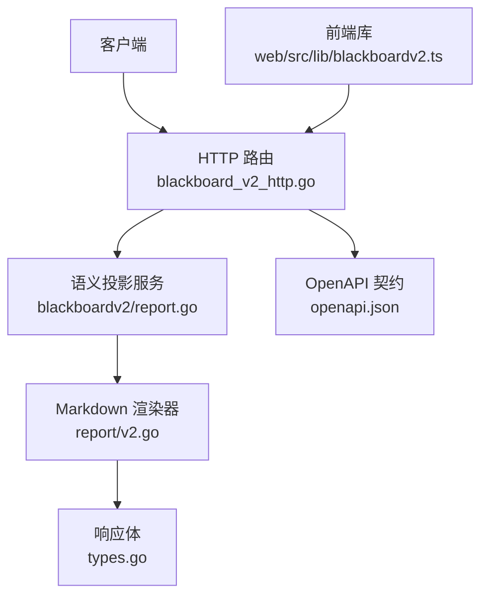
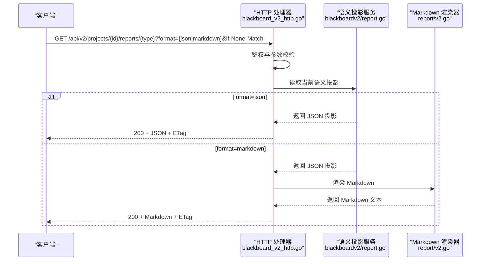
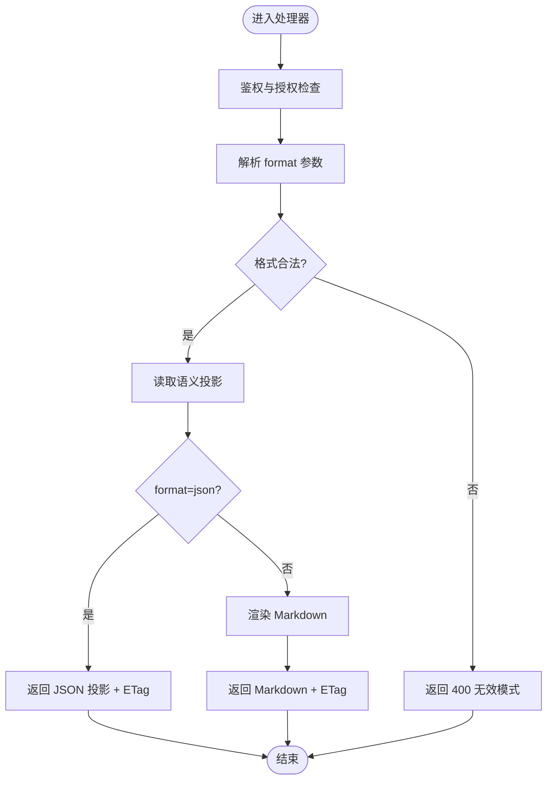
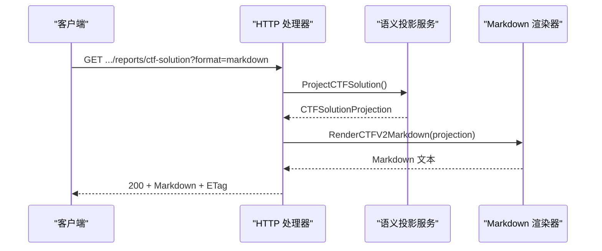
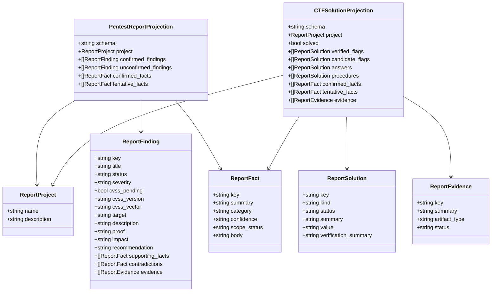
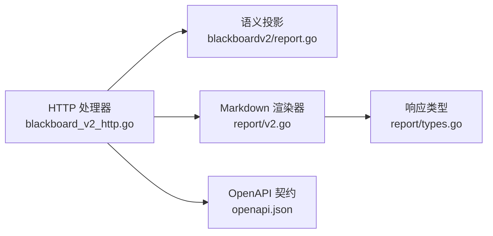

# 报告生成接口

<cite>
**本文引用的文件**   
- [blackboard_v2_http.go](file://internal/daemon/blackboard_v2_http.go)
- [openapi.json](file://internal/blackboardv2contract/contractdata/openapi.json)
- [report.go](file://internal/blackboardv2/report.go)
- [types.go](file://internal/report/types.go)
- [v2.go](file://internal/report/v2.go)
- [blackboardv2.ts](file://web/src/lib/blackboardv2.ts)
</cite>

## 目录
1. [简介](#简介)
2. [项目结构](#项目结构)
3. [核心组件](#核心组件)
4. [架构总览](#架构总览)
5. [详细组件分析](#详细组件分析)
6. [依赖关系分析](#依赖关系分析)
7. [性能与缓存](#性能与缓存)
8. [故障排查指南](#故障排查指南)
9. [结论](#结论)
10. [附录：请求与响应示例](#附录请求与响应示例)

## 简介
本文件为“报告生成系统”的 API 文档，聚焦以下两个端点：
- GET /api/v2/projects/{project_id}/reports/pentest
- GET /api/v2/projects/{project_id}/reports/ctf-solution

两者均支持两种输出格式：
- format=markdown：返回 report-markdown/v2（纯文本 Markdown）
- format=json：返回语义投影（pentest-report/v2 或 ctf-solution/v2）

同时说明：
- 报告模板系统：当前实现为内置 Markdown 渲染器，按固定结构组织内容。
- 数据投影机制：从 Blackboard v2 语义层抽取确定性投影，过滤审计面与内部标识。
- 证据链接生成：证据项包含 key、artifact_type、status 等字段，便于前端构建详情/历史链接。
- 配置选项：仅支持 format 与 If-None-Match；无自定义模板扩展参数。
- 批量导出：未提供批量导出端点；可通过循环调用单个项目端点实现。

## 项目结构
与报告生成相关的代码主要分布在以下模块：
- HTTP 路由与鉴权：internal/daemon/blackboard_v2_http.go
- OpenAPI 契约定义：internal/blackboardv2contract/contractdata/openapi.json
- 语义投影服务：internal/blackboardv2/report.go
- Markdown 渲染器：internal/report/v2.go、internal/report/types.go
- 前端调用封装：web/src/lib/blackboardv2.ts

**图示来源** 
- [blackboard_v2_http.go:270-317](file://internal/daemon/blackboard_v2_http.go#L270-L317)
- [report.go:123-162](file://internal/blackboardv2/report.go#L123-L162)
- [v2.go:66-74](file://internal/report/v2.go#L66-L74)
- [types.go:1-9](file://internal/report/types.go#L1-L9)
- [openapi.json:612-694](file://internal/blackboardv2contract/contractdata/openapi.json#L612-L694)
- [openapi.json:696-778](file://internal/blackboardv2contract/contractdata/openapi.json#L696-L778)
- [blackboardv2.ts:1536-1562](file://web/src/lib/blackboardv2.ts#L1536-L1562)

**章节来源**
- [blackboard_v2_http.go:270-317](file://internal/daemon/blackboard_v2_http.go#L270-L317)
- [openapi.json:612-694](file://internal/blackboardv2contract/contractdata/openapi.json#L612-L694)
- [openapi.json:696-778](file://internal/blackboardv2contract/contractdata/openapi.json#L696-L778)
- [report.go:123-162](file://internal/blackboardv2/report.go#L123-L162)
- [v2.go:66-74](file://internal/report/v2.go#L66-L74)
- [types.go:1-9](file://internal/report/types.go#L1-L9)
- [blackboardv2.ts:1536-1562](file://web/src/lib/blackboardv2.ts#L1536-L1562)

## 核心组件
- HTTP 处理器
  - 解析路径 project_id、查询参数 format、条件请求头 If-None-Match。
  - 鉴权：支持 Continuation Interface Grant 或 Daemon Operator 认证。
  - 调用语义投影服务获取 JSON 投影或 Markdown 文本。
  - 设置 ETag 与 Cache-Control，支持 304 Not Modified。
- 语义投影服务
  - PentestReportProjection：仅暴露报告所需字段，过滤审计面与内部标识。
  - CTFSolutionProjection：基于已验证 Flag 推导 solved 状态，并聚合证据与事实。
- Markdown 渲染器
  - 将投影转换为结构化 Markdown，包含标题、标签、段落、列表与多行字段的缩进块。
  - 对特殊字符进行转义，保证 Markdown 安全。
- 响应类型
  - Report：用于内部渲染结果封装（status/format/markdown）。

**章节来源**
- [blackboard_v2_http.go:270-317](file://internal/daemon/blackboard_v2_http.go#L270-L317)
- [report.go:16-44](file://internal/blackboardv2/report.go#L16-L44)
- [v2.go:66-74](file://internal/report/v2.go#L66-L74)
- [types.go:1-9](file://internal/report/types.go#L1-L9)

## 架构总览
报告生成的端到端流程如下：

**图示来源** 
- [blackboard_v2_http.go:270-317](file://internal/daemon/blackboard_v2_http.go#L270-L317)
- [report.go:123-162](file://internal/blackboardv2/report.go#L123-L162)
- [v2.go:66-74](file://internal/report/v2.go#L66-L74)

## 详细组件分析

### 渗透测试报告端点：/api/v2/projects/{project_id}/reports/pentest
- 方法：GET
- 路径参数：
  - project_id：字符串，必填
- 查询参数：
  - format：枚举 ["markdown","json"]，默认 markdown
- 请求头：
  - Authorization：Bearer token（Continuation Interface Grant）或 Daemon Operator 认证
  - If-None-Match：可选，强 ETag 比较
- 成功响应：
  - 200 OK
    - application/json; schema 为 oneOf：
      - pentest-report/v2（当 format=json）
      - report-markdown/v2（当 format=markdown）
  - 响应头：
    - ETag：基于 Blackboard 修订号的强 ETag
    - Cache-Control：private, no-cache
- 条件响应：
  - 304 Not Modified：当 If-None-Match 匹配时返回空体
- 错误响应：
  - 400 无效模式
  - 401 未认证
  - 403 权限不足
  - 404 项目不存在
  - 410 续接已关闭
  - 422 语义校验失败/项目类型不匹配
  - 500 内部错误
  - 503 存储繁忙（可重试，带 Retry-After）

**图示来源** 
- [blackboard_v2_http.go:270-317](file://internal/daemon/blackboard_v2_http.go#L270-L317)
- [openapi.json:612-694](file://internal/blackboardv2contract/contractdata/openapi.json#L612-L694)

**章节来源**
- [blackboard_v2_http.go:270-317](file://internal/daemon/blackboard_v2_http.go#L270-L317)
- [openapi.json:612-694](file://internal/blackboardv2contract/contractdata/openapi.json#L612-L694)

### CTF 解决方案报告端点：/api/v2/projects/{project_id}/reports/ctf-solution
- 方法：GET
- 路径参数：
  - project_id：字符串，必填
- 查询参数：
  - format：枚举 ["markdown","json"]，默认 markdown
- 请求头：
  - Authorization：Bearer token（Continuation Interface Grant）或 Daemon Operator 认证
  - If-None-Match：可选，强 ETag 比较
- 成功响应：
  - 200 OK
    - application/json; schema 为 oneOf：
      - ctf-solution/v2（当 format=json）
      - report-markdown/v2（当 format=markdown）
  - 响应头：
    - ETag：基于 Blackboard 修订号的强 ETag
    - Cache-Control：private, no-cache
- 条件响应：
  - 304 Not Modified：当 If-None-Match 匹配时返回空体
- 错误响应：
  - 同 pentest 端点的错误码映射

**图示来源** 
- [blackboard_v2_http.go:295-317](file://internal/daemon/blackboard_v2_http.go#L295-L317)
- [report.go:341-384](file://internal/blackboardv2/report.go#L341-L384)
- [v2.go:71-74](file://internal/report/v2.go#L71-L74)

**章节来源**
- [blackboard_v2_http.go:295-317](file://internal/daemon/blackboard_v2_http.go#L295-L317)
- [openapi.json:696-778](file://internal/blackboardv2contract/contractdata/openapi.json#L696-L778)

### 数据投影机制
- PentestReportProjection
  - 包含项目信息、确认/未确认发现、确认/试探性事实。
  - 过滤掉审计面、哈希、可信来源与执行历史。
  - 允许在 Finding/Fact/Evidence 上使用人类可读的 Blackboard Key，以便前端导航到详情/历史。
- CTFSolutionProjection
  - 包含项目信息、solved 状态（仅由已验证 Flag 推导）、各类 Solution、事实与证据。
  - 同样过滤审计面与内部标识。

**图示来源** 
- [report.go:16-44](file://internal/blackboardv2/report.go#L16-L44)

**章节来源**
- [report.go:16-44](file://internal/blackboardv2/report.go#L16-L44)

### 证据链接生成
- 证据项包含 key、artifact_type、status、summary 等字段。
- 前端可使用 key 构造详情/历史链接，例如：
  - 详情：/api/v2/projects/{project_id}/blackboard/records/{key}
  - 历史：/api/v2/projects/{project_id}/blackboard/records/{key}/history
- 该能力由投影中的 Blackboard Key 暴露，供上层消费。

**章节来源**
- [report.go:16-44](file://internal/blackboardv2/report.go#L16-L44)
- [openapi.json:220-280](file://internal/blackboardv2contract/contractdata/openapi.json#L220-L280)

### 报告模板系统与自定义扩展
- 当前实现使用内置 Markdown 渲染器，结构固定，不包含外部模板引擎或用户自定义模板参数。
- 如需扩展，可在渲染器中新增字段或布局逻辑，但需保持向后兼容与确定性。

**章节来源**
- [v2.go:66-74](file://internal/report/v2.go#L66-L74)

### 批量报告导出
- 未提供批量导出端点。
- 建议通过循环调用单个项目的报告端点实现批量导出。

[本节为通用指导，不涉及具体文件]

## 依赖关系分析
- HTTP 层依赖：
  - 鉴权与同步附件处理：authenticateBlackboardV2、serveBlackboardV2Conditional
  - 格式解析：blackboardV2ReportFormat
  - 条件响应：writeBlackboardV2ConditionalSuccess（ETag、304）
- 语义层依赖：
  - ProjectPentestReport / ProjectCTFSolution：读取当前语义投影
- 渲染层依赖：
  - RenderV2Markdown / RenderCTFV2Markdown：将投影转为 Markdown

**图示来源** 
- [blackboard_v2_http.go:270-317](file://internal/daemon/blackboard_v2_http.go#L270-L317)
- [report.go:123-162](file://internal/blackboardv2/report.go#L123-L162)
- [v2.go:66-74](file://internal/report/v2.go#L66-L74)
- [types.go:1-9](file://internal/report/types.go#L1-L9)
- [openapi.json:612-694](file://internal/blackboardv2contract/contractdata/openapi.json#L612-L694)

**章节来源**
- [blackboard_v2_http.go:270-317](file://internal/daemon/blackboard_v2_http.go#L270-L317)
- [report.go:123-162](file://internal/blackboardv2/report.go#L123-L162)
- [v2.go:66-74](file://internal/report/v2.go#L66-L74)
- [types.go:1-9](file://internal/report/types.go#L1-L9)
- [openapi.json:612-694](file://internal/blackboardv2contract/contractdata/openapi.json#L612-L694)

## 性能与缓存
- 条件请求：
  - 服务端根据 Blackboard 修订号生成强 ETag。
  - 客户端携带 If-None-Match 可实现 304 Not Modified，减少带宽与渲染开销。
- 缓存控制：
  - 响应头 Cache-Control: private, no-cache，避免共享缓存误用。
- 渲染成本：
  - Markdown 渲染为内存操作，复杂度与投影规模线性相关。
  - 大项目建议在客户端侧缓存 JSON 投影，按需渲染或离线转换。

**章节来源**
- [blackboard_v2_http.go:500-513](file://internal/daemon/blackboard_v2_http.go#L500-L513)

## 故障排查指南
- 常见错误码与含义：
  - 400 invalid_schema：参数或请求体不符合规范（如 format 非法）
  - 401 unauthenticated：缺少或无效认证
  - 403 forbidden：认证有效但无权限访问该项目
  - 404 not_found：项目不存在
  - 410 gone：续接已关闭（仅影响写/同步类接口，读接口通常不受影响）
  - 422 unprocessable：语义校验失败、项目类型不匹配等
  - 500 internal：内部错误
  - 503 unavailable：存储繁忙，可重试（带 Retry-After）
- 调试建议：
  - 检查 Authorization 是否正确传递（Bearer token 或 Daemon Operator 认证）
  - 确认 project_id 与授权范围一致
  - 使用 If-None-Match 配合 ETag 进行增量更新
  - 查看响应体 error 字段定位 Path 与 Message

**章节来源**
- [blackboard_v2_http.go:539-584](file://internal/daemon/blackboard_v2_http.go#L539-L584)
- [openapi.json:829-928](file://internal/blackboardv2contract/contractdata/openapi.json#L829-L928)

## 结论
- 两个报告端点提供一致的鉴权、格式与缓存模型。
- 语义投影确保输出确定性与最小暴露面，适合下游消费与自动化处理。
- Markdown 渲染器满足快速交付需求；若需高度定制，可在渲染器层扩展并保持兼容性。
- 证据与事实的 Blackboard Key 为前端构建详情/历史链接提供了稳定锚点。

[本节为总结，不涉及具体文件]

## 附录：请求与响应示例

### 请求示例
- 获取渗透测试报告（Markdown）
  - GET /api/v2/projects/{project_id}/reports/pentest?format=markdown
  - 请求头：Authorization: Bearer <token>
- 获取渗透测试报告（JSON）
  - GET /api/v2/projects/{project_id}/reports/pentest?format=json
  - 请求头：Authorization: Bearer <token>, If-None-Match: "<etag>"
- 获取 CTF 解决方案报告（Markdown）
  - GET /api/v2/projects/{project_id}/reports/ctf-solution?format=markdown
  - 请求头：Authorization: Bearer <token>
- 获取 CTF 解决方案报告（JSON）
  - GET /api/v2/projects/{project_id}/reports/ctf-solution?format=json
  - 请求头：Authorization: Bearer <token>, If-None-Match: "<etag>"

**章节来源**
- [blackboardv2.ts:1536-1562](file://web/src/lib/blackboardv2.ts#L1536-L1562)
- [openapi.json:612-694](file://internal/blackboardv2contract/contractdata/openapi.json#L612-L694)
- [openapi.json:696-778](file://internal/blackboardv2contract/contractdata/openapi.json#L696-L778)

### 响应格式定义
- JSON 响应（format=json）
  - pentest-report/v2：包含 schema、project、confirmed_findings、unconfirmed_findings、confirmed_facts、tentative_facts
  - ctf-solution/v2：包含 schema、project、solved、verified_flags、candidate_flags、answers、procedures、confirmed_facts、tentative_facts、evidence
- Markdown 响应（format=markdown）
  - report-markdown/v2：包含 schema 与 markdown 文本

**章节来源**
- [report.go:16-44](file://internal/blackboardv2/report.go#L16-L44)
- [openapi.json:612-694](file://internal/blackboardv2contract/contractdata/openapi.json#L612-L694)
- [openapi.json:696-778](file://internal/blackboardv2contract/contractdata/openapi.json#L696-L778)