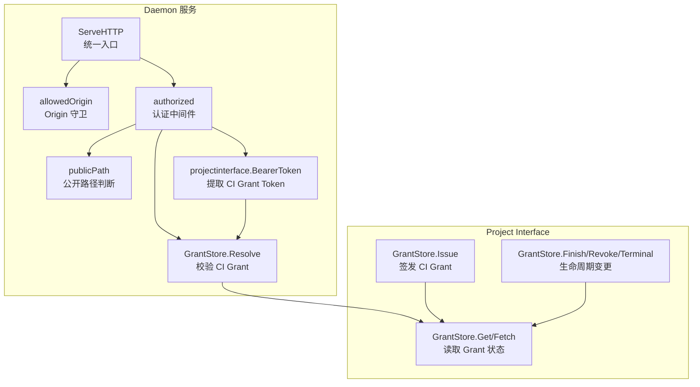
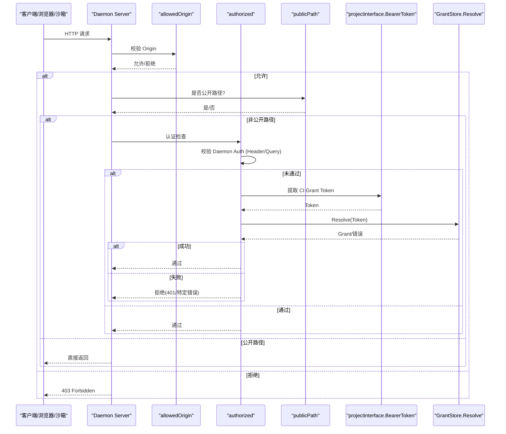
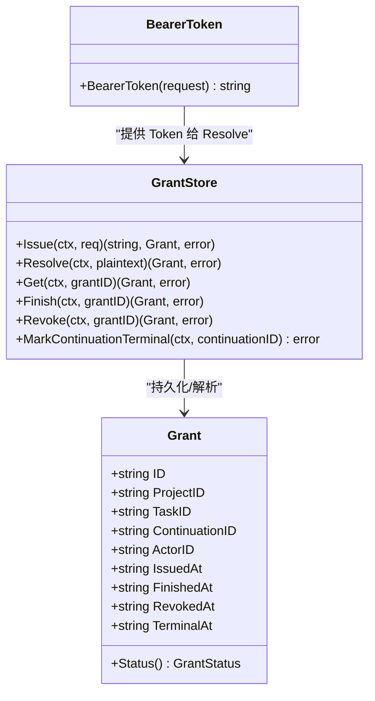
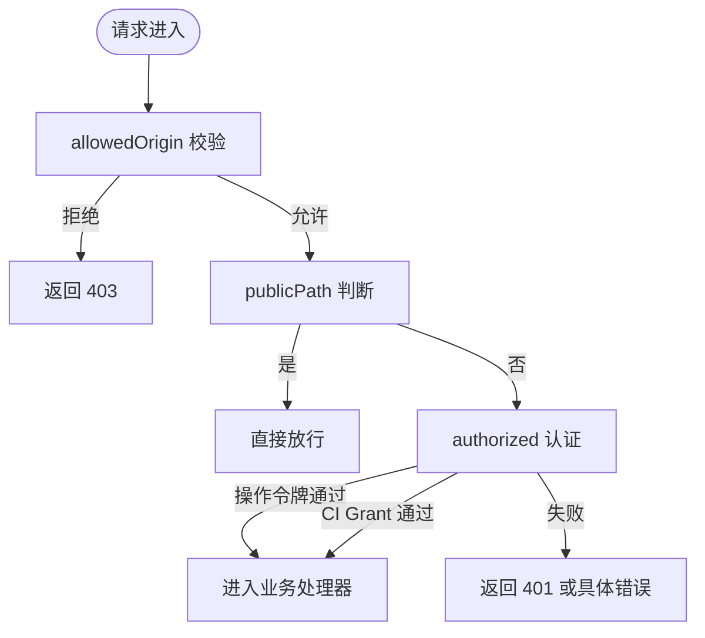

# 认证与授权接口

<cite>
**本文引用的文件**   
- [internal/daemon/server.go](file://internal/daemon/server.go)
- [internal/projectinterface/bearer.go](file://internal/projectinterface/bearer.go)
- [internal/projectinterface/grant.go](file://internal/projectinterface/grant.go)
- [internal/daemon/auth_test.go](file://internal/daemon/auth_test.go)
</cite>

## 目录
1. [简介](#简介)
2. [项目结构](#项目结构)
3. [核心组件](#核心组件)
4. [架构总览](#架构总览)
5. [详细组件分析](#详细组件分析)
6. [依赖关系分析](#依赖关系分析)
7. [性能与安全特性](#性能与安全特性)
8. [故障排查指南](#故障排查指南)
9. [结论](#结论)
10. [附录：示例与最佳实践](#附录示例与最佳实践)

## 简介
本文件面向使用 CyberPenda Daemon 的客户端与操作员，系统化说明认证与授权机制，覆盖两类凭证：
- Continuation Interface Grant（CI Grant）：面向运行时客户端（沙箱内的任务执行上下文），用于访问 Blackboard v2 HTTP 与 MCP 通道。
- Daemon Auth（操作令牌）：面向操作员/UI/CLI，用于访问控制面 API。

同时说明 Bearer Token 格式、权限范围、中间件实现原理、Token 验证流程、权限检查机制、跨域请求处理、安全头配置以及错误响应格式等。

## 项目结构
认证与授权相关的关键代码位于以下模块：
- Daemon HTTP 服务层：统一入口 ServeHTTP、路由注册、CORS/Origin 守卫、认证中间件逻辑。
- Project Interface 包：Continuation Interface Grant 的签发、解析、生命周期管理；Bearer Token 提取工具。

图示来源
- [internal/daemon/server.go:383-461](file://internal/daemon/server.go#L383-L461)
- [internal/projectinterface/bearer.go:14-21](file://internal/projectinterface/bearer.go#L14-L21)
- [internal/projectinterface/grant.go:196-302](file://internal/projectinterface/grant.go#L196-L302)

章节来源
- [internal/daemon/server.go:383-461](file://internal/daemon/server.go#L383-L461)
- [internal/projectinterface/bearer.go:14-21](file://internal/projectinterface/bearer.go#L14-L21)
- [internal/projectinterface/grant.go:196-302](file://internal/projectinterface/grant.go#L196-L302)

## 核心组件
- 认证中间件 authorized：支持两种认证方式
  - Daemon Auth：Authorization: Bearer <操作令牌> 或查询参数 ?token=...
  - Continuation Interface Grant：仅对 Blackboard v2 HTTP 与 /mcp 有效，通过 GrantStore.Resolve 校验
- Origin 守卫 allowedOrigin：拒绝非回环且非允许的跨站请求，防止 DNS Rebinding 与 CSRF 风险
- 公开路径 publicPath：健康检查、CORS 预检、SPA 静态资源无需认证
- BearerToken 提取器：从 Authorization 头或查询参数中取 CI Grant Token
- GrantStore：CI Grant 的签发、解析、状态机（open/finished/revoked/terminal）、原子性事务写入

章节来源
- [internal/daemon/server.go:431-461](file://internal/daemon/server.go#L431-L461)
- [internal/daemon/server.go:518-534](file://internal/daemon/server.go#L518-L534)
- [internal/daemon/server.go:467-501](file://internal/daemon/server.go#L467-L501)
- [internal/projectinterface/bearer.go:14-21](file://internal/projectinterface/bearer.go#L14-L21)
- [internal/projectinterface/grant.go:196-302](file://internal/projectinterface/grant.go#L196-L302)

## 架构总览
下图展示一次受保护 API 请求的完整认证与授权流程，包括两种凭证类型与关键分支。

图示来源
- [internal/daemon/server.go:383-461](file://internal/daemon/server.go#L383-L461)
- [internal/daemon/server.go:518-534](file://internal/daemon/server.go#L518-L534)
- [internal/daemon/server.go:467-501](file://internal/daemon/server.go#L467-L501)
- [internal/projectinterface/bearer.go:14-21](file://internal/projectinterface/bearer.go#L14-L21)
- [internal/projectinterface/grant.go:287-302](file://internal/projectinterface/grant.go#L287-L302)

## 详细组件分析

### 认证中间件与入口
- ServeHTTP 统一入口
  - 先进行 Origin 守卫，拒绝可疑跨站请求
  - 再判断是否为公开路径（健康检查、CORS 预检、SPA 静态资源）
  - 若非公开路径且配置了操作令牌，则调用 authorized 进行认证
- authorized 认证逻辑
  - 若未配置操作令牌，默认放行（开发模式）
  - 优先匹配 Authorization: Bearer <操作令牌> 或查询参数 ?token=...
  - 若为 Blackboard v2 HTTP 或 /mcp，且携带 CI Grant Token，则调用 GrantStore.Resolve 校验
- publicPath 公开路径
  - GET /health
  - OPTIONS 预检
  - SPA 入口与静态资源（/assets/*、根路径及常见静态扩展名）

章节来源
- [internal/daemon/server.go:383-411](file://internal/daemon/server.go#L383-L411)
- [internal/daemon/server.go:431-461](file://internal/daemon/server.go#L431-L461)
- [internal/daemon/server.go:467-501](file://internal/daemon/server.go#L467-L501)

### Continuation Interface Grant（CI Grant）
- 用途与范围
  - 面向运行时客户端（沙箱内任务执行上下文）
  - 仅对 Blackboard v2 HTTP 与 /mcp 通道生效
- Token 格式与生成
  - 由随机源生成，采用 base64url 编码，长度固定，适合在 Authorization 头或查询参数中传输
  - 明文仅在签发时返回一次，存储仅保留 SHA-256 哈希
- 生命周期与权限范围
  - open：可写可读
  - finished：只读与幂等回放
  - revoked：完全不可用
  - terminal：绑定 Continuation 终止后进入该状态，后续语义变更由系统协调器负责
- 解析与校验
  - Resolve 将传入明文 token 计算哈希并比对，使用常量时间比较避免时序侧信道
  - 返回 Grant 对象包含 actor_id、project/task/continuation 绑定信息，供上层做细粒度权限判定

图示来源
- [internal/projectinterface/grant.go:196-302](file://internal/projectinterface/grant.go#L196-L302)
- [internal/projectinterface/grant.go:116-149](file://internal/projectinterface/grant.go#L116-L149)
- [internal/projectinterface/bearer.go:14-21](file://internal/projectinterface/bearer.go#L14-L21)

章节来源
- [internal/projectinterface/grant.go:196-302](file://internal/projectinterface/grant.go#L196-L302)
- [internal/projectinterface/grant.go:116-149](file://internal/projectinterface/grant.go#L116-L149)
- [internal/projectinterface/bearer.go:14-21](file://internal/projectinterface/bearer.go#L14-L21)

### 操作令牌（Daemon Auth）
- 适用场景
  - 操作员 UI、CLI、外部控制面客户端
- 传递方式
  - Authorization: Bearer <操作令牌>
  - 查询参数 ?token=...（兼容无法设置头的传输）
- 强制策略
  - 非回环监听地址必须配置操作令牌，否则启动失败
  - 回环监听地址默认不强制（便于本地开发）

章节来源
- [internal/daemon/server.go:178-185](file://internal/daemon/server.go#L178-L185)
- [internal/daemon/server.go:431-461](file://internal/daemon/server.go#L431-L461)
- [internal/daemon/auth_test.go:27-58](file://internal/daemon/auth_test.go#L27-L58)

### 跨域与 Origin 守卫
- allowedOrigin 规则
  - 无 Origin 的请求允许（本地 CLI、沙箱、同页加载）
  - 允许回环主机（127.0.0.1、localhost、[::1]）
  - 允许 host.docker.internal（容器内部访问宿主）
  - 允许与监听地址同主机的请求
  - 其他带 Origin 的请求一律拒绝，防止 DNS Rebinding 与跨站攻击
- CORS 预检
  - OPTIONS 请求视为公开路径，不受操作令牌限制

章节来源
- [internal/daemon/server.go:518-534](file://internal/daemon/server.go#L518-L534)
- [internal/daemon/server.go:467-470](file://internal/daemon/server.go#L467-L470)

### 错误响应格式
- 通用错误体
  - JSON 字段 error 描述错误原因
- 典型状态码
  - 401 Unauthorized：缺少或无效的操作令牌
  - 403 Forbidden：Origin 被拒绝
  - 400 Bad Request：请求体或参数非法
  - 404 Not Found：资源不存在
  - 409 Conflict：并发/状态冲突（如续期未完成、选择冲突）
  - 500 Internal Server Error：服务端异常
- 特殊错误
  - projectinterface.Error：当涉及 CI Grant 或 Blackboard v2 语义错误时，可能返回结构化错误对象

章节来源
- [internal/daemon/server.go:1266-1272](file://internal/daemon/server.go#L1266-L1272)
- [internal/daemon/server.go:396-406](file://internal/daemon/server.go#L396-L406)
- [internal/daemon/task_handlers.go:3412-3431](file://internal/daemon/task_handlers.go#L3412-L3431)

## 依赖关系分析
- 中间件依赖
  - server.authorized 依赖 projectinterface.BearerToken 与 projectinterface.GrantStore
  - server.allowedOrigin 依赖网络地址解析与主机名比较
- 数据流
  - 请求 -> Origin 守卫 -> 公开路径判断 -> 认证中间件 -> 业务处理器
  - CI Grant 解析 -> GrantStore.Resolve -> 返回 Grant 状态 -> 上层按状态决定读写能力

图示来源
- [internal/daemon/server.go:383-461](file://internal/daemon/server.go#L383-L461)
- [internal/daemon/server.go:518-534](file://internal/daemon/server.go#L518-L534)
- [internal/daemon/server.go:467-501](file://internal/daemon/server.go#L467-L501)

章节来源
- [internal/daemon/server.go:383-461](file://internal/daemon/server.go#L383-L461)
- [internal/daemon/server.go:518-534](file://internal/daemon/server.go#L518-L534)
- [internal/daemon/server.go:467-501](file://internal/daemon/server.go#L467-L501)

## 性能与安全特性
- 常量时间比较
  - 操作令牌与 CI Grant 哈希比较均使用常量时间比较，避免时序泄露
- 最小权限原则
  - CI Grant 仅对 Blackboard v2 HTTP 与 /mcp 生效，且绑定到具体的 Project/Task/Continuation
- 防重放与幂等
  - CI Grant 的生命周期状态控制读写能力；finished/terminal 仍允许幂等回放
- 启动安全
  - 非回环监听必须配置操作令牌，防止暴露未认证的控制面
- Origin 守卫
  - 严格限制跨站来源，抵御 DNS Rebinding 与同源绕过

章节来源
- [internal/daemon/server.go:431-461](file://internal/daemon/server.go#L431-L461)
- [internal/daemon/server.go:178-185](file://internal/daemon/server.go#L178-L185)
- [internal/daemon/server.go:518-534](file://internal/daemon/server.go#L518-L534)
- [internal/projectinterface/grant.go:287-302](file://internal/projectinterface/grant.go#L287-L302)

## 故障排查指南
- 401 Unauthorized
  - 检查是否携带正确的 Authorization: Bearer 或 ?token=...
  - 确认监听地址与操作令牌配置是否匹配（非回环需配置）
- 403 Forbidden
  - 检查 Origin 是否来自回环或 host.docker.internal，或是否与监听地址一致
- 400 Bad Request
  - 检查请求体 JSON 结构与必填字段
- 409 Conflict
  - 检查是否存在续期未完成或选择冲突，参考错误消息中的提示
- CI Grant 相关问题
  - 确认 Token 未被撤销或已终止
  - 确认请求目标为 Blackboard v2 HTTP 或 /mcp

章节来源
- [internal/daemon/server.go:396-406](file://internal/daemon/server.go#L396-L406)
- [internal/daemon/server.go:518-534](file://internal/daemon/server.go#L518-L534)
- [internal/daemon/task_handlers.go:3412-3431](file://internal/daemon/task_handlers.go#L3412-L3431)
- [internal/projectinterface/grant.go:287-302](file://internal/projectinterface/grant.go#L287-L302)

## 结论
CyberPenda Daemon 的认证与授权体系以“操作令牌”和“Continuation Interface Grant”双轨制为核心，前者保障控制面安全，后者限定运行时最小权限。结合 Origin 守卫、常量时间比较、公开路径白名单与严格的监听地址策略，整体方案在易用性与安全性之间取得良好平衡。

## 附录：示例与最佳实践

### 认证方式与示例
- 操作令牌（Daemon Auth）
  - 请求头：Authorization: Bearer <操作令牌>
  - 查询参数：?token=<操作令牌>
  - 适用端点：所有受保护的 API（除公开路径）
- CI Grant（Continuation Interface Grant）
  - 请求头：Authorization: Bearer <CI Grant Token>
  - 查询参数：?token=<CI Grant Token>
  - 适用端点：Blackboard v2 HTTP 与 /mcp

章节来源
- [internal/daemon/server.go:431-461](file://internal/daemon/server.go#L431-L461)
- [internal/projectinterface/bearer.go:14-21](file://internal/projectinterface/bearer.go#L14-L21)

### 安全最佳实践
- 生产环境务必在非回环监听地址上配置操作令牌
- 将 CI Grant Token 作为环境变量注入沙箱，避免日志与错误堆栈泄露
- 定期轮换操作令牌；必要时撤销 CI Grant
- 保持 Origin 守卫开启，不要放宽至任意域名
- 对敏感端点启用最小权限的 CI Grant，并监控其生命周期状态

章节来源
- [internal/daemon/server.go:178-185](file://internal/daemon/server.go#L178-L185)
- [internal/projectinterface/grant.go:196-302](file://internal/projectinterface/grant.go#L196-L302)