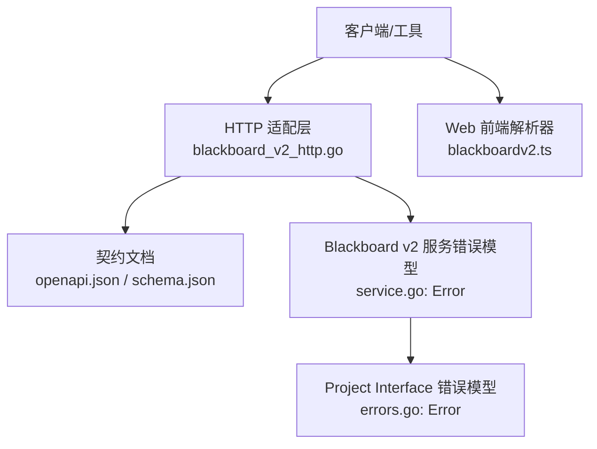
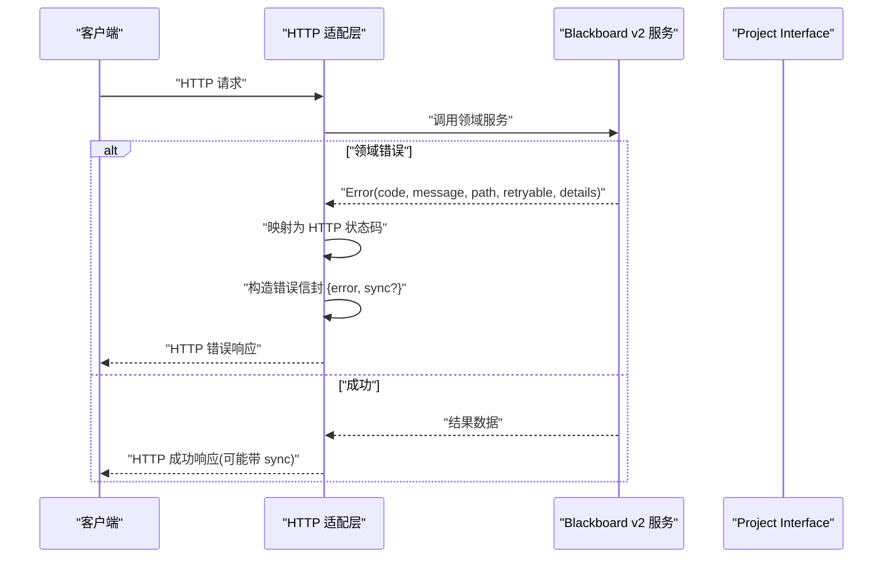
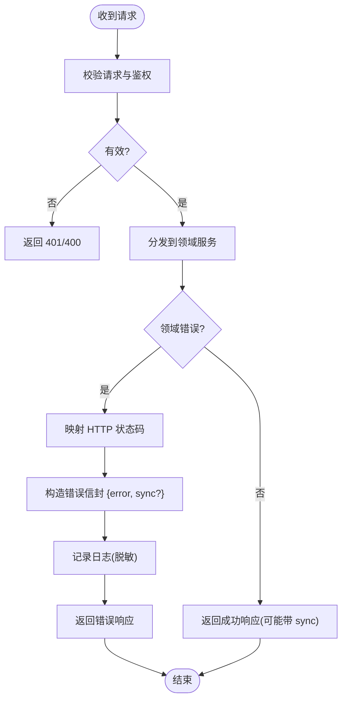
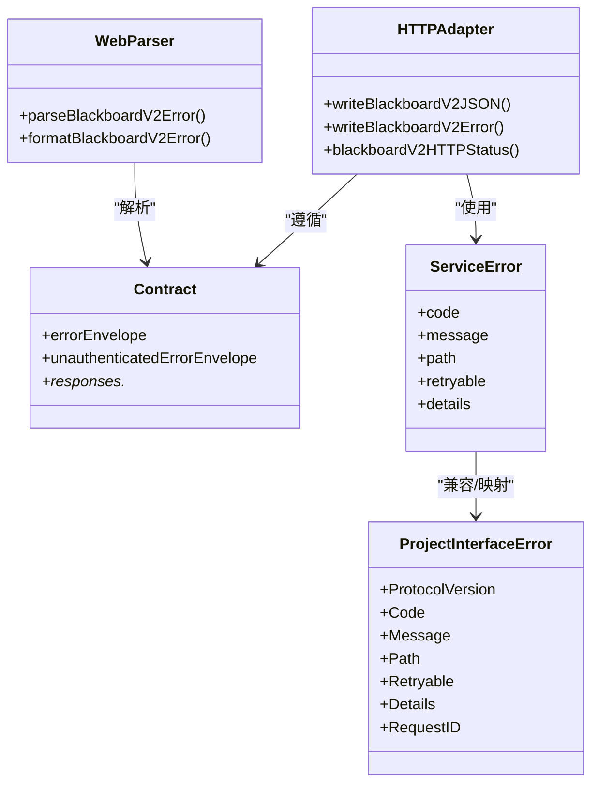

# 错误处理与状态码

<cite>
**本文引用的文件**   
- [internal/daemon/blackboard_v2_http.go](file://internal/daemon/blackboard_v2_http.go)
- [internal/blackboardv2contract/contractdata/openapi.json](file://internal/blackboardv2contract/contractdata/openapi.json)
- [internal/blackboardv2contract/contractdata/schemas/blackboard-v2.schema.json](file://internal/blackboardv2contract/contractdata/schemas/blackboard-v2.schema.json)
- [docs/specs/blackboard-v2-spec.md](file://docs/specs/blackboard-v2-spec.md)
- [internal/projectinterface/errors.go](file://internal/projectinterface/errors.go)
- [web/src/lib/blackboardv2.ts](file://web/src/lib/blackboardv2.ts)
</cite>

## 目录
1. [简介](#简介)
2. [项目结构](#项目结构)
3. [核心组件](#核心组件)
4. [架构总览](#架构总览)
5. [详细组件分析](#详细组件分析)
6. [依赖关系分析](#依赖关系分析)
7. [性能考虑](#性能考虑)
8. [故障排查指南](#故障排查指南)
9. [结论](#结论)
10. [附录](#附录)

## 简介
本规范统一了 HTTP 错误响应格式、HTTP 状态码语义、错误码定义与调试信息结构，覆盖 Blackboard v2 API 的完整错误面。目标是为服务端实现、客户端调用方（含 Web 前端）提供一致的错误处理约定，包括常见错误的排查方法、重试策略与日志记录规范。

## 项目结构
本项目采用分层设计：
- 契约层：OpenAPI 与 JSON Schema 定义了统一的错误信封与响应类型。
- 服务层：Daemon HTTP 适配器将领域错误映射为 HTTP 状态码并输出统一信封。
- 协议层：Project Interface 错误模型用于跨进程/运行时通信的稳定失败形状。
- 客户端层：Web 前端解析错误信封并格式化展示。

图表来源
- [internal/daemon/blackboard_v2_http.go:514-561](file://internal/daemon/blackboard_v2_http.go#L514-L561)
- [internal/blackboardv2contract/contractdata/openapi.json:830-927](file://internal/blackboardv2contract/contractdata/openapi.json#L830-L927)
- [internal/blackboardv2contract/contractdata/schemas/blackboard-v2.schema.json:2757-2784](file://internal/blackboardv2contract/contractdata/schemas/blackboard-v2.schema.json#L2757-L2784)
- [internal/projectinterface/errors.go:65-97](file://internal/projectinterface/errors.go#L65-L97)
- [web/src/lib/blackboardv2.ts:963-989](file://web/src/lib/blackboardv2.ts#L963-L989)

章节来源
- [internal/daemon/blackboard_v2_http.go:514-561](file://internal/daemon/blackboard_v2_http.go#L514-L561)
- [internal/blackboardv2contract/contractdata/openapi.json:830-927](file://internal/blackboardv2contract/contractdata/openapi.json#L830-L927)
- [internal/blackboardv2contract/contractdata/schemas/blackboard-v2.schema.json:2757-2784](file://internal/blackboardv2contract/contractdata/schemas/blackboard-v2.schema.json#L2757-L2784)
- [internal/projectinterface/errors.go:65-97](file://internal/projectinterface/errors.go#L65-L97)
- [web/src/lib/blackboardv2.ts:963-989](file://web/src/lib/blackboardv2.ts#L963-L989)

## 核心组件
- 统一错误信封：所有 HTTP 错误均使用单一信封，包含 error 对象；在特定场景下可附带 sync 同步附件。
- 错误码与状态码映射：由服务层集中完成，确保一致的语义与可重试性标识。
- 调试信息结构：error.path、error.details、error.retryable 等字段用于定位问题与指导重试。
- 认证与权限错误分离：未认证返回 401，已认证但无权限返回 403。

章节来源
- [docs/specs/blackboard-v2-spec.md:293-307](file://docs/specs/blackboard-v2-spec.md#L293-L307)
- [internal/daemon/blackboard_v2_http.go:539-561](file://internal/daemon/blackboard_v2_http.go#L539-L561)
- [internal/blackboardv2contract/contractdata/schemas/blackboard-v2.schema.json:2757-2784](file://internal/blackboardv2contract/contractdata/schemas/blackboard-v2.schema.json#L2757-L2784)

## 架构总览
下图展示了从请求到错误响应的关键路径，以及错误信封与同步附件的生成过程。

图表来源
- [internal/daemon/blackboard_v2_http.go:514-561](file://internal/daemon/blackboard_v2_http.go#L514-L561)
- [internal/daemon/blackboard_v2_http.go:612-642](file://internal/daemon/blackboard_v2_http.go#L612-L642)
- [internal/blackboardv2contract/contractdata/schemas/blackboard-v2.schema.json:2757-2784](file://internal/blackboardv2contract/contractdata/schemas/blackboard-v2.schema.json#L2757-L2784)

## 详细组件分析

### HTTP 状态码与使用场景
- 400 Bad Request：请求体或 Schema 不合法（如 invalid_schema）。
- 401 Unauthenticated：缺少或无效认证令牌。
- 403 Forbidden：已认证但无权限访问资源。
- 404 NotFound：项目或 Blackboard Key 不存在。
- 409 Conflict：版本冲突、键冲突、关系冲突、幂等键冲突、Finish 冲突等。
- 410 ClosedContinuation：Continuation 已关闭，不允许写入。
- 422 Unprocessable：语义校验失败、生命周期守卫、端点类型不匹配、循环或大小限制等。
- 500 InternalError：内部意外错误。
- 503 Unavailable：存储争用导致的可重试错误，附带 Retry-After 头。

章节来源
- [internal/daemon/blackboard_v2_http.go:612-642](file://internal/daemon/blackboard_v2_http.go#L612-L642)
- [internal/blackboardv2contract/contractdata/openapi.json:830-927](file://internal/blackboardv2contract/contractdata/openapi.json#L830-L927)
- [docs/specs/blackboard-v2-spec.md:293-307](file://docs/specs/blackboard-v2-spec.md#L293-L307)

### 标准错误响应格式
- 顶层信封：{ error, sync? }
- error 对象字段：
  - code：字符串错误码
  - message：人类可读说明
  - path：可选，定位到具体字段或操作位置
  - retryable：布尔值，指示是否可重试
  - details：可选，结构化调试信息
- sync 同步附件：在部分已认证的语义错误中携带，包含快照与原因，便于客户端快速收敛。

章节来源
- [internal/blackboardv2contract/contractdata/schemas/blackboard-v2.schema.json:2757-2784](file://internal/blackboardv2contract/contractdata/schemas/blackboard-v2.schema.json#L2757-L2784)
- [internal/daemon/blackboard_v2_http.go:539-561](file://internal/daemon/blackboard_v2_http.go#L539-L561)
- [docs/specs/blackboard-v2-spec.md:293-307](file://docs/specs/blackboard-v2-spec.md#L293-L307)

### 错误码定义与映射
- 通用错误码（示例）：
  - invalid_schema → 400
  - authority_denied → 401 或 403（根据 Path 是否包含 authorization）
  - not_found → 404
  - version_conflict/key_conflict/relationship_conflict/idempotency_conflict/finish_conflict → 409
  - closed_continuation → 410
  - semantic_validation/continuation_open_attempts/continuation_pending_writes/project_kind_mismatch → 422
  - storage_busy/retryable → 503（并设置 Retry-After）
  - internal → 500

- 注意：
  - 401 与 403 的区分基于 Path 字段是否指向授权相关上下文。
  - 可重试错误一律返回 503，并在响应头中包含 Retry-After。

章节来源
- [internal/daemon/blackboard_v2_http.go:612-642](file://internal/daemon/blackboard_v2_http.go#L612-L642)
- [internal/blackboardv2contract/contractdata/openapi.json:830-927](file://internal/blackboardv2contract/contractdata/openapi.json#L830-L927)

### 调试信息结构与最佳实践
- path：建议精确到变更批次索引或字段路径，便于客户端高亮提示。
- details：结构化附加信息（例如缺失字段列表、冲突键名），避免泄露敏感数据。
- retryable：仅对存储争用或临时不可用标记为 true，其他业务错误应为 false。
- 安全：禁止在错误消息或 details 中泄露密钥、Token、项目 ID 等敏感信息。

章节来源
- [internal/daemon/blackboard_v2_http.go:539-561](file://internal/daemon/blackboard_v2_http.go#L539-L561)
- [docs/specs/blackboard-v2-spec.md:293-307](file://docs/specs/blackboard-v2-spec.md#L293-L307)

### 重试策略
- 503 Unavailable：遵循 Retry-After 头进行退避重试；若未提供，默认短间隔重试。
- 409 Conflict：客户端应读取最新 revision 后重新提交变更批次。
- 410 ClosedContinuation：不应重试，需重建 Continuation 上下文。
- 401/403：刷新凭证或修正权限后再试。
- 422：修复输入后重试。

章节来源
- [internal/daemon/blackboard_v2_http.go:539-561](file://internal/daemon/blackboard_v2_http.go#L539-L561)
- [internal/blackboardv2contract/contractdata/openapi.json:910-924](file://internal/blackboardv2contract/contractdata/openapi.json#L910-L924)

### 日志记录规范
- 服务端：
  - 记录错误码、message、path、details（脱敏）、请求 ID（如有）。
  - 对 503 与 409 增加“可重试”与“冲突详情”的日志标注。
- 客户端：
  - 记录错误信封原始内容（不含敏感字段），便于复现与诊断。
  - 对可重试错误记录重试次数与退避策略。

章节来源
- [internal/daemon/blackboard_v2_http.go:539-561](file://internal/daemon/blackboard_v2_http.go#L539-L561)
- [web/src/lib/blackboardv2.ts:963-989](file://web/src/lib/blackboardv2.ts#L963-L989)

### 完整错误处理示例（以路径引用代替代码片段）
- 服务端错误封装与状态码映射：
  - [writeBlackboardV2JSON:514-537](file://internal/daemon/blackboard_v2_http.go#L514-L537)
  - [writeBlackboardV2Error:539-561](file://internal/daemon/blackboard_v2_http.go#L539-L561)
  - [blackboardV2HTTPStatus:612-642](file://internal/daemon/blackboard_v2_http.go#L612-L642)
- 契约定义（错误信封与响应类型）：
  - [errorEnvelope/unauthenticatedErrorEnvelope:2757-2784](file://internal/blackboardv2contract/contractdata/schemas/blackboard-v2.schema.json#L2757-L2784)
  - [responses 定义:830-927](file://internal/blackboardv2contract/contractdata/openapi.json#L830-L927)
- 客户端解析与格式化：
  - [parseBlackboardV2Error/formatBlackboardV2Error:963-989](file://web/src/lib/blackboardv2.ts#L963-L989)

章节来源
- [internal/daemon/blackboard_v2_http.go:514-561](file://internal/daemon/blackboard_v2_http.go#L514-L561)
- [internal/blackboardv2contract/contractdata/schemas/blackboard-v2.schema.json:2757-2784](file://internal/blackboardv2contract/contractdata/schemas/blackboard-v2.schema.json#L2757-L2784)
- [internal/blackboardv2contract/contractdata/openapi.json:830-927](file://internal/blackboardv2contract/contractdata/openapi.json#L830-L927)
- [web/src/lib/blackboardv2.ts:963-989](file://web/src/lib/blackboardv2.ts#L963-L989)

### 概念性总览
以下流程图概括了错误处理的端到端流程，适用于各类客户端与服务端实现参考。

[此图为概念性流程，无需源码对应]

## 依赖关系分析
- HTTP 适配层依赖契约文档（OpenAPI/Schema）以确保错误信封一致性。
- 服务层错误模型（service.Error）与 Project Interface 错误模型（projectinterface.Error）共同支撑跨层错误传递。
- 客户端解析器依赖错误信封结构进行展示与重试控制。

图表来源
- [internal/daemon/blackboard_v2_http.go:514-561](file://internal/daemon/blackboard_v2_http.go#L514-L561)
- [internal/blackboardv2contract/contractdata/schemas/blackboard-v2.schema.json:2757-2784](file://internal/blackboardv2contract/contractdata/schemas/blackboard-v2.schema.json#L2757-L2784)
- [internal/projectinterface/errors.go:65-97](file://internal/projectinterface/errors.go#L65-L97)
- [web/src/lib/blackboardv2.ts:963-989](file://web/src/lib/blackboardv2.ts#L963-L989)

章节来源
- [internal/daemon/blackboard_v2_http.go:514-561](file://internal/daemon/blackboard_v2_http.go#L514-L561)
- [internal/blackboardv2contract/contractdata/schemas/blackboard-v2.schema.json:2757-2784](file://internal/blackboardv2contract/contractdata/schemas/blackboard-v2.schema.json#L2757-L2784)
- [internal/projectinterface/errors.go:65-97](file://internal/projectinterface/errors.go#L65-L97)
- [web/src/lib/blackboardv2.ts:963-989](file://web/src/lib/blackboardv2.ts#L963-L989)

## 性能考虑
- 避免在错误信封中携带大体积 details，防止网络开销。
- 对 503 错误实施指数退避与抖动，降低雪崩风险。
- 合理使用 ETag/If-None-Match 减少重复传输（成功路径），错误路径不缓存。

[本节为通用指导，无需源码对应]

## 故障排查指南
- 400 Bad Request：检查请求体是否符合 Schema；关注 invalid_schema 错误码与 path 定位。
- 401 Unauthenticated：确认 Authorization 头是否正确；检查 Token 是否过期或无效。
- 403 Forbidden：核对当前身份对目标资源的权限；查看 authority_denied 与 path。
- 404 NotFound：确认项目 ID 与 Blackboard Key 是否存在。
- 409 Conflict：读取最新 revision 后重试；关注 version_conflict 或 idempotency_conflict。
- 410 ClosedContinuation：重建 Continuation；不要直接重试。
- 422 Unprocessable：修复语义校验失败项；关注 details 中的约束违反信息。
- 500 InternalError：上报服务端日志与请求 ID；避免在客户端重试。
- 503 Unavailable：遵循 Retry-After 头进行退避重试；监控存储争用指标。

章节来源
- [internal/daemon/blackboard_v2_http.go:612-642](file://internal/daemon/blackboard_v2_http.go#L612-L642)
- [internal/blackboardv2contract/contractdata/openapi.json:830-927](file://internal/blackboardv2contract/contractdata/openapi.json#L830-L927)
- [docs/specs/blackboard-v2-spec.md:293-307](file://docs/specs/blackboard-v2-spec.md#L293-L307)

## 结论
通过统一的错误信封、明确的 HTTP 状态码语义与稳定的错误码映射，系统实现了跨层一致的错误处理能力。配合规范的调试信息与重试策略，可有效提升系统的可观测性与健壮性。

[本节为总结，无需源码对应]

## 附录
- 错误信封 JSON Schema 定义：
  - [errorEnvelope/unauthenticatedErrorEnvelope:2757-2784](file://internal/blackboardv2contract/contractdata/schemas/blackboard-v2.schema.json#L2757-L2784)
- OpenAPI 响应定义（各状态码对应的错误信封）：
  - [responses 定义:830-927](file://internal/blackboardv2contract/contractdata/openapi.json#L830-L927)
- 服务端实现要点：
  - [writeBlackboardV2JSON/writeBlackboardV2Error:514-561](file://internal/daemon/blackboard_v2_http.go#L514-L561)
  - [blackboardV2HTTPStatus:612-642](file://internal/daemon/blackboard_v2_http.go#L612-L642)
- 客户端解析与展示：
  - [parseBlackboardV2Error/formatBlackboardV2Error:963-989](file://web/src/lib/blackboardv2.ts#L963-L989)

章节来源
- [internal/blackboardv2contract/contractdata/schemas/blackboard-v2.schema.json:2757-2784](file://internal/blackboardv2contract/contractdata/schemas/blackboard-v2.schema.json#L2757-L2784)
- [internal/blackboardv2contract/contractdata/openapi.json:830-927](file://internal/blackboardv2contract/contractdata/openapi.json#L830-L927)
- [internal/daemon/blackboard_v2_http.go:514-561](file://internal/daemon/blackboard_v2_http.go#L514-L561)
- [web/src/lib/blackboardv2.ts:963-989](file://web/src/lib/blackboardv2.ts#L963-L989)