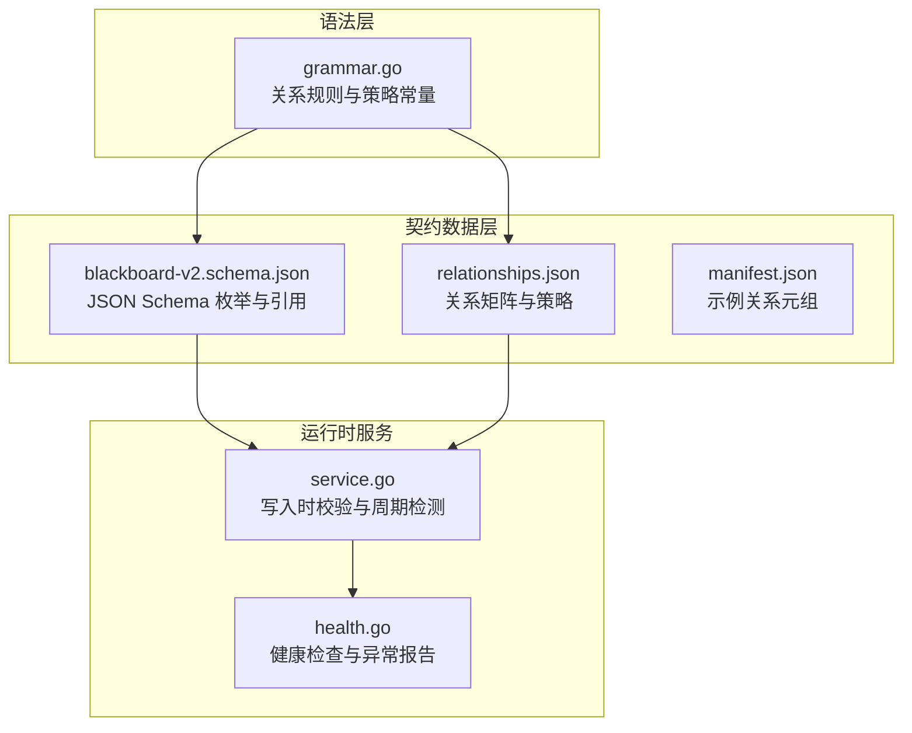
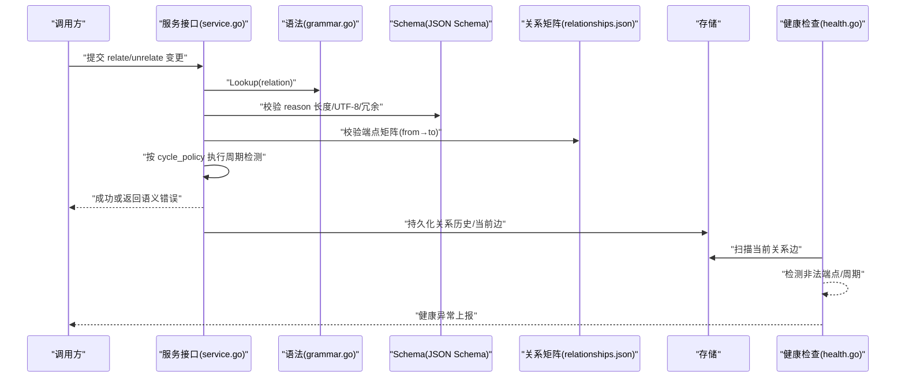
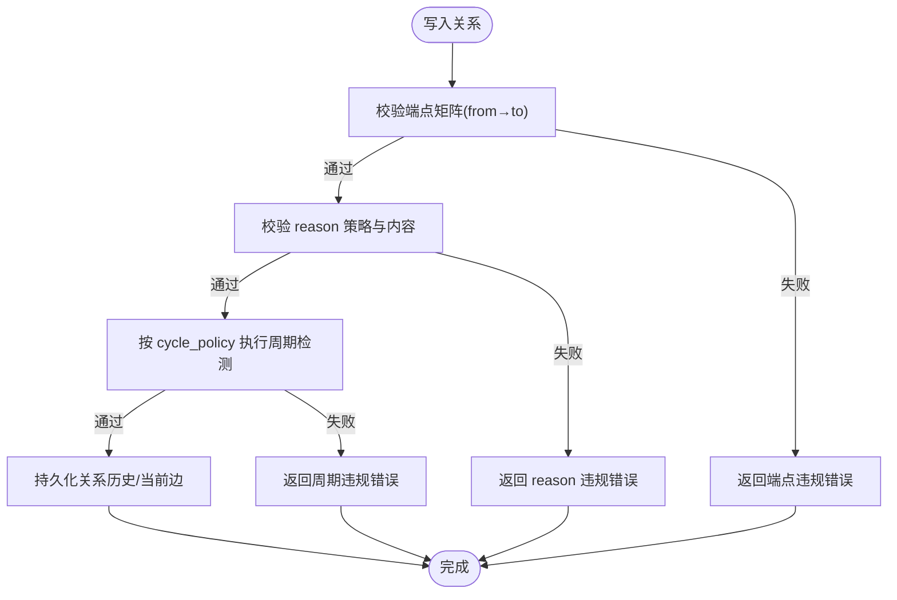
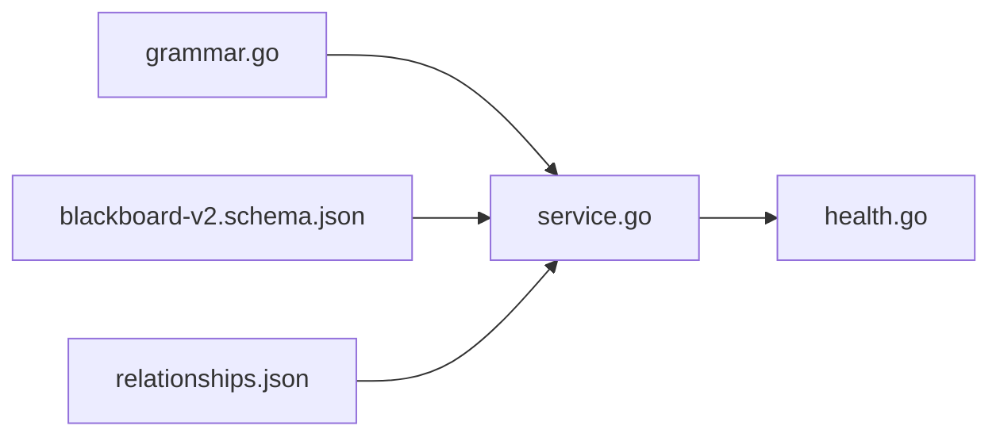

# 关系类型定义

<cite>
**本文引用的文件**   
- [blackboard-v2.schema.json](file://internal/blackboardv2contract/contractdata/schemas/blackboard-v2.schema.json)
- [relationships.json](file://internal/blackboardv2contract/contractdata/relationships.json)
- [grammar.go](file://internal/blackboardv2grammar/grammar.go)
- [0012-use-eleven-blackboard-relationship-types.md](file://docs/adr/0012-use-eleven-blackboard-relationship-types.md)
- [manifest.json](file://internal/blackboardv2contract/contractdata/manifest.json)
- [service.go](file://internal/blackboardv2/service.go)
- [health.go](file://internal/blackboardv2/health.go)
</cite>

## 目录
1. [简介](#简介)
2. [项目结构](#项目结构)
3. [核心组件](#核心组件)
4. [架构总览](#架构总览)
5. [详细组件分析](#详细组件分析)
6. [依赖分析](#依赖分析)
7. [性能考虑](#性能考虑)
8. [故障排查指南](#故障排查指南)
9. [结论](#结论)
10. [附录](#附录)

## 简介
本文件系统化梳理 Blackboard v2 的关系类型定义，覆盖两类关系：
- ordinaryRelationType（普通关系）：about、part_of、tests、produced、evidences、derived_from、satisfies
- reasonRelationType（可带理由的关系）：supports、contradicts、depends_on

文档将说明每种关系的语义含义、使用场景与约束规则，并提供关系图谱的构建方法、查询模式与性能优化建议。同时给出完整的关系类型枚举值与实际应用示例路径，便于读者对照源码与契约数据理解。

## 项目结构
Blackboard v2 的关系类型由“语法层”和“契约数据层”共同定义并校验：
- 语法层：集中声明关系词表、端点矩阵、策略常量与校验逻辑
- 契约数据层：以 JSON Schema 与关系矩阵 JSON 固化枚举、端点矩阵与策略；并以 manifest 提供示例元组

图示来源
- [grammar.go:1-180](file://internal/blackboardv2grammar/grammar.go#L1-L180)
- [blackboard-v2.schema.json:54-100](file://internal/blackboardv2contract/contractdata/schemas/blackboard-v2.schema.json#L54-L100)
- [relationships.json:1-172](file://internal/blackboardv2contract/contractdata/relationships.json#L1-L172)
- [service.go:2054-2078](file://internal/blackboardv2/service.go#L2054-L2078)
- [health.go:363-402](file://internal/blackboardv2/health.go#L363-L402)

章节来源
- [grammar.go:1-180](file://internal/blackboardv2grammar/grammar.go#L1-L180)
- [blackboard-v2.schema.json:54-100](file://internal/blackboardv2contract/contractdata/schemas/blackboard-v2.schema.json#L54-L100)
- [relationships.json:1-172](file://internal/blackboardv2contract/contractdata/relationships.json#L1-L172)

## 核心组件
- 关系类型全集与分类
  - relationType：全部关系类型集合
  - ordinaryRelationType：普通关系类型集合
  - reasonRelationType：可携带 conciseText 理由的关系类型集合
  - mutableRelationType：允许变更的关系类型集合（不含 supersedes）
- 关系矩阵与策略
  - reason_policy：是否允许 reason 字段（forbidden/optional）
  - self_link_policy：自环策略（reject）
  - cycle_policy：周期策略（unrestricted/acyclic/特定子图 acyclic/reciprocal_allowed 等）
- 端点矩阵：限定 from_type → to_type 的合法组合

章节来源
- [blackboard-v2.schema.json:54-100](file://internal/blackboardv2contract/contractdata/schemas/blackboard-v2.schema.json#L54-L100)
- [relationships.json:1-172](file://internal/blackboardv2contract/contractdata/relationships.json#L1-L172)
- [grammar.go:1-180](file://internal/blackboardv2grammar/grammar.go#L1-L180)

## 架构总览
关系类型的生命周期贯穿“定义—校验—持久化—健康检查—投影/报表”。

图示来源
- [service.go:2054-2078](file://internal/blackboardv2/service.go#L2054-L2078)
- [grammar.go:1-180](file://internal/blackboardv2grammar/grammar.go#L1-L180)
- [blackboard-v2.schema.json:54-100](file://internal/blackboardv2contract/contractdata/schemas/blackboard-v2.schema.json#L54-L100)
- [relationships.json:1-172](file://internal/blackboardv2contract/contractdata/relationships.json#L1-L172)
- [health.go:363-402](file://internal/blackboardv2/health.go#L363-L402)

## 详细组件分析

### 关系类型枚举与分类
- relationType（全部）
  - about, part_of, tests, produced, evidences, supports, contradicts, derived_from, depends_on, satisfies, supersedes
- ordinaryRelationType（普通关系）
  - about, part_of, tests, produced, evidences, derived_from, satisfies
- reasonRelationType（可带理由）
  - supports, contradicts, depends_on
- mutableRelationType（可变更）
  - 除 supersedes 外的所有关系

章节来源
- [blackboard-v2.schema.json:54-100](file://internal/blackboardv2contract/contractdata/schemas/blackboard-v2.schema.json#L54-L100)

### 普通关系类型详解（ordinaryRelationType）

#### about
- 语义：将探索目标、尝试、事实、发现、解决方案或证据制品关联到实体
- 典型方向：Objective/Attempt/Fact/Finding/Solution/Evidence → Entity
- 约束：
  - 不允许 reason
  - 禁止自环
  - 无全局周期限制（unrestricted）
- 使用场景：为各类知识项标注其“关于”的目标实体（如主机、服务、域名等）

章节来源
- [relationships.json:5-19](file://internal/blackboardv2contract/contractdata/relationships.json#L5-L19)
- [grammar.go:58-61](file://internal/blackboardv2grammar/grammar.go#L58-L61)
- [0012-use-eleven-blackboard-relationship-types.md:9-11](file://docs/adr/0012-use-eleven-blackboard-relationship-types.md#L9-L11)

#### part_of
- 语义：层级归属关系（实体之间或目标之间）
- 典型方向：Entity → Entity 或 Objective → Objective
- 约束：
  - 不允许 reason
  - 禁止自环
  - 同端点族内必须无环（acyclic_per_endpoint_family）
- 使用场景：构建实体层次结构（如域→子域→主机），或目标分解树

章节来源
- [relationships.json:20-34](file://internal/blackboardv2contract/contractdata/relationships.json#L20-L34)
- [grammar.go:61-62](file://internal/blackboardv2grammar/grammar.go#L61-L62)
- [0012-use-eleven-blackboard-relationship-types.md:12](file://docs/adr/0012-use-eleven-blackboard-relationship-types.md#L12)

#### tests
- 语义：尝试对某目标的测试关系
- 典型方向：Attempt → (Entity | Objective | Fact | Finding | Solution)
- 约束：
  - 不允许 reason
  - 禁止自环
  - 无周期限制
- 使用场景：记录一次渗透尝试所针对的具体目标或产物

章节来源
- [relationships.json:35-49](file://internal/blackboardv2contract/contractdata/relationships.json#L35-L49)
- [grammar.go:63-64](file://internal/blackboardv2grammar/grammar.go#L63-L64)
- [0012-use-eleven-blackboard-relationship-types.md:13](file://docs/adr/0012-use-eleven-blackboard-relationship-types.md#L13)

#### produced
- 语义：尝试产出的可复用结果（实体、目标、事实、发现、解决方案、证据制品）
- 典型方向：Attempt → (Entity | Objective | Fact | Finding | Solution | Evidence)
- 约束：
  - 不允许 reason
  - 禁止自环
  - 无周期限制
- 使用场景：将扫描结果、利用产出、中间工件与尝试关联

章节来源
- [relationships.json:50-64](file://internal/blackboardv2contract/contractdata/relationships.json#L50-L64)
- [grammar.go:65-66](file://internal/blackboardv2grammar/grammar.go#L65-L66)
- [0012-use-eleven-blackboard-relationship-types.md:14](file://docs/adr/0012-use-eleven-blackboard-relationship-types.md#L14)

#### evidences
- 语义：证据制品对被支持的项目知识（事实、发现、解决方案）进行支撑
- 典型方向：Evidence → (Fact | Finding | Solution)
- 约束：
  - 不允许 reason
  - 禁止自环
  - 无周期限制
- 使用场景：将截图、日志片段、抓包等作为发现的直接证据

章节来源
- [relationships.json:65-79](file://internal/blackboardv2contract/contractdata/relationships.json#L65-L79)
- [grammar.go:67-68](file://internal/blackboardv2grammar/grammar.go#L67-L68)
- [0012-use-eleven-blackboard-relationship-types.md:15](file://docs/adr/0012-use-eleven-blackboard-relationship-types.md#L15)

#### derived_from
- 语义：语义溯源关系，用于表达“从…推导而来”
- 典型方向：
  - Objective → (Fact | Finding | Solution)
  - Fact → (Fact | Evidence)
  - Evidence → Evidence
- 约束：
  - 不允许 reason
  - 禁止自环
  - 全局无环（acyclic）
- 使用场景：当无法用 supports/produced/supersedes 准确表达时，保留严格的溯源链

章节来源
- [relationships.json:110-124](file://internal/blackboardv2contract/contractdata/relationships.json#L110-L124)
- [grammar.go:73-75](file://internal/blackboardv2grammar/grammar.go#L73-L75)
- [0012-use-eleven-blackboard-relationship-types.md:18](file://docs/adr/0012-use-eleven-blackboard-relationship-types.md#L18)

#### satisfies
- 语义：当前知识满足某个探索目标（用于目标达成判定）
- 典型方向：(Fact | Finding | Solution) → Objective
- 约束：
  - 不允许 reason
  - 禁止自环
  - 无周期限制
- 使用场景：将已确认的事实、发现或解决方案与目标建立满足关系，驱动目标完成度统计

章节来源
- [relationships.json:140-154](file://internal/blackboardv2contract/contractdata/relationships.json#L140-L154)
- [grammar.go:78-79](file://internal/blackboardv2grammar/grammar.go#L78-L79)
- [0012-use-eleven-blackboard-relationship-types.md:20](file://docs/adr/0012-use-eleven-blackboard-relationship-types.md#L20)

### 可带理由的关系类型详解（reasonRelationType）

#### supports
- 语义：项目事实对另一项目事实、发现或解决方案提供支持性论证
- 典型方向：Fact → (Fact | Finding | Solution)
- 约束：
  - 允许 reason（conciseText，非空、非冗余、UTF-8 有效、长度上限）
  - 禁止自环
  - 项目事实到项目事实的子图必须无环（project_fact_to_project_fact_acyclic）
- 使用场景：构建“论据链”，解释为何某发现成立

章节来源
- [relationships.json:80-94](file://internal/blackboardv2contract/contractdata/relationships.json#L80-L94)
- [grammar.go:69-70](file://internal/blackboardv2grammar/grammar.go#L69-L70)
- [0012-use-eleven-blackboard-relationship-types.md:16](file://docs/adr/0012-use-eleven-blackboard-relationship-types.md#L16)

#### contradicts
- 语义：项目事实之间的相互矛盾关系
- 典型方向：Fact → (Fact | Finding | Solution)
- 约束：
  - 允许 reason
  - 禁止自环
  - 允许双向矛盾（reciprocal_allowed），不强制全局 DAG
- 使用场景：记录不同观察或假设间的冲突，辅助推理收敛

章节来源
- [relationships.json:95-109](file://internal/blackboardv2contract/contractdata/relationships.json#L95-L109)
- [grammar.go:71-72](file://internal/blackboardv2grammar/grammar.go#L71-L72)
- [0012-use-eleven-blackboard-relationship-types.md:17](file://docs/adr/0012-use-eleven-blackboard-relationship-types.md#L17)

#### depends_on
- 语义：探索目标的前置依赖关系
- 典型方向：Objective → Objective
- 约束：
  - 允许 reason
  - 禁止自环
  - 全局无环（acyclic）
- 使用场景：编排任务顺序、规划攻击链前置条件

章节来源
- [relationships.json:125-139](file://internal/blackboardv2contract/contractdata/relationships.json#L125-L139)
- [grammar.go:76-77](file://internal/blackboardv2grammar/grammar.go#L76-L77)
- [0012-use-eleven-blackboard-relationship-types.md:19](file://docs/adr/0012-use-eleven-blackboard-relationship-types.md#L19)

### 关系策略与校验流程
- 策略维度
  - reason_policy：forbidden/optional
  - self_link_policy：reject
  - cycle_policy：unrestricted / acyclic / acyclic_per_endpoint_family / project_fact_to_project_fact_acyclic / reciprocal_allowed / acyclic_single_current_replacement
- 校验要点
  - 端点矩阵匹配（from_type → to_type）
  - reason 合法性（仅 reasonRelationType 允许；UTF-8、长度、非空、非冗余）
  - 周期检测（按策略在写入时与运行期健康检查中分别执行）

图示来源
- [grammar.go:131-154](file://internal/blackboardv2grammar/grammar.go#L131-L154)
- [service.go:2054-2078](file://internal/blackboardv2/service.go#L2054-L2078)

章节来源
- [grammar.go:10-22](file://internal/blackboardv2grammar/grammar.go#L10-L22)
- [grammar.go:131-154](file://internal/blackboardv2grammar/grammar.go#L131-L154)
- [service.go:2054-2078](file://internal/blackboardv2/service.go#L2054-L2078)

### 实际应用示例（示例元组路径）
以下为各关系类型的示例元组位置（三元组形式：from_key, relation, to_key[, reason]）：
- about：[manifest.json:289-305](file://internal/blackboardv2contract/contractdata/manifest.json#L289-L305)
- part_of：[manifest.json:298-305](file://internal/blackboardv2contract/contractdata/manifest.json#L298-L305)
- tests：[manifest.json:307-315](file://internal/blackboardv2contract/contractdata/manifest.json#L307-L315)
- produced：[manifest.json:316-324](file://internal/blackboardv2contract/contractdata/manifest.json#L316-L324)
- evidences：[manifest.json:325-333](file://internal/blackboardv2contract/contractdata/manifest.json#L325-L333)
- supports：[manifest.json:334-343](file://internal/blackboardv2contract/contractdata/manifest.json#L334-L343)
- contradicts：[manifest.json:344-353](file://internal/blackboardv2contract/contractdata/manifest.json#L344-L353)
- derived_from：[manifest.json:354-362](file://internal/blackboardv2contract/contractdata/manifest.json#L354-L362)
- depends_on：[manifest.json:363-372](file://internal/blackboardv2contract/contractdata/manifest.json#L363-L372)
- satisfies：[manifest.json:373-381](file://internal/blackboardv2contract/contractdata/manifest.json#L373-L381)
- supersedes：[manifest.json:382-390](file://internal/blackboardv2contract/contractdata/manifest.json#L382-L390)

章节来源
- [manifest.json:289-390](file://internal/blackboardv2contract/contractdata/manifest.json#L289-L390)

## 依赖分析
- 语法层（grammar.go）是权威来源，导出 Rules()、Lookup()、Cases() 等能力，供服务层与测试使用
- 契约数据层（schema + relationships.json）与语法层保持一致性由测试保障
- 服务层在写入时依据 grammar 与 schema/matrix 进行端点与原因校验，并按 cycle_policy 执行周期检测
- 健康检查模块会扫描当前关系边，识别非法端点与周期问题并上报

图示来源
- [grammar.go:117-129](file://internal/blackboardv2grammar/grammar.go#L117-L129)
- [service.go:2054-2078](file://internal/blackboardv2/service.go#L2054-L2078)
- [health.go:363-402](file://internal/blackboardv2/health.go#L363-L402)

章节来源
- [grammar.go:117-129](file://internal/blackboardv2grammar/grammar.go#L117-L129)
- [service.go:2054-2078](file://internal/blackboardv2/service.go#L2054-L2078)
- [health.go:363-402](file://internal/blackboardv2/health.go#L363-L402)

## 性能考虑
- 写入路径
  - 端点矩阵查找为 O(1) 哈希判断（基于规则预计算）
  - reason 校验为线性字符串处理（UTF-8 有效性、长度、空白与冗余检查）
  - 周期检测按策略选择：
    - unrestricted/reciprocal_allowed：跳过周期检测
    - acyclic/acyclic_per_endpoint_family/project_fact_to_project_fact_acyclic：需遍历相关边做可达性/环检测
- 健康检查
  - 全量扫描当前关系边，先过滤非法端点，再对候选边进行周期检测
- 优化建议
  - 批量操作：尽量合并 relate/unrelate 变更，减少多次周期检测开销
  - 局部更新：优先修改小范围子图，降低周期检测范围
  - 索引与分页：读取侧建议使用投影接口，避免一次性加载全图
  - 缓存热点：对高频查询的子图（如 supports 子图）可在上层做短期缓存

[本节为通用指导，无需具体文件来源]

## 故障排查指南
- 常见错误码与含义
  - semantic_validation：端点矩阵不匹配或违反 cycle_policy
  - reason_forbidden/reason_invalid/reason_invalid_utf8/reason_too_long/reason_redundant：reason 策略或内容违规
  - relationship_cycle：检测到被策略禁止的环
- 定位步骤
  - 查看写入时的错误信息，确认 isOneOf(rule.CyclePolicy, ...) 分支触发的具体关系类型
  - 使用健康检查接口获取 invalid_relationship 与 relationship_cycle 异常详情
  - 结合 manifest 中的示例元组核对 from/to 类型是否符合该关系的端点矩阵

章节来源
- [service.go:2054-2078](file://internal/blackboardv2/service.go#L2054-L2078)
- [health.go:363-402](file://internal/blackboardv2/health.go#L363-L402)

## 结论
Blackboard v2 的关系体系通过“语法层 + 契约数据层 + 服务层校验 + 健康检查”形成闭环，确保关系语义稳定、可验证、可观测。普通关系聚焦于结构化连接与溯源，可带理由的关系则承载论证与依赖编排。遵循端点矩阵与周期策略，配合合理的批量化与局部更新策略，可获得良好的性能与可维护性。

[本节为总结，无需具体文件来源]

## 附录

### 关系类型速查表
- 普通关系（ordinaryRelationType）
  - about：Objective/Attempt/Fact/Finding/Solution/Evidence → Entity
  - part_of：Entity → Entity 或 Objective → Objective（同族无环）
  - tests：Attempt → (Entity | Objective | Fact | Finding | Solution)
  - produced：Attempt → (Entity | Objective | Fact | Finding | Solution | Evidence)
  - evidences：Evidence → (Fact | Finding | Solution)
  - derived_from：Objective → (Fact | Finding | Solution)；Fact → (Fact | Evidence)；Evidence → Evidence（全局无环）
  - satisfies：(Fact | Finding | Solution) → Objective
- 可带理由关系（reasonRelationType）
  - supports：Fact → (Fact | Finding | Solution)（事实间子图无环）
  - contradicts：Fact → (Fact | Finding | Solution)（允许双向矛盾）
  - depends_on：Objective → Objective（全局无环）

章节来源
- [blackboard-v2.schema.json:54-100](file://internal/blackboardv2contract/contractdata/schemas/blackboard-v2.schema.json#L54-L100)
- [relationships.json:1-172](file://internal/blackboardv2contract/contractdata/relationships.json#L1-L172)
- [grammar.go:58-83](file://internal/blackboardv2grammar/grammar.go#L58-L83)
- [0012-use-eleven-blackboard-relationship-types.md:9-24](file://docs/adr/0012-use-eleven-blackboard-relationship-types.md#L9-L24)