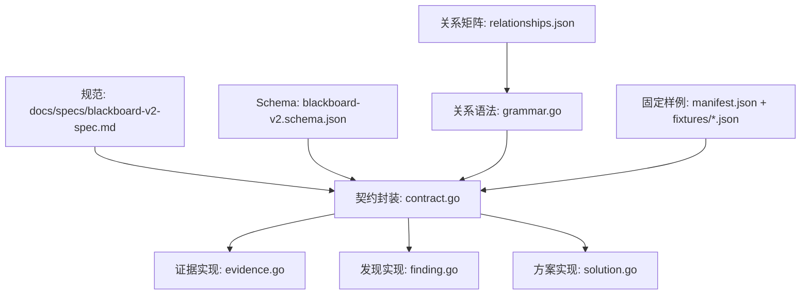
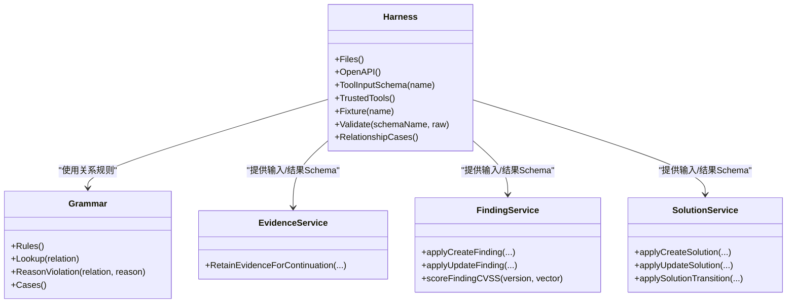
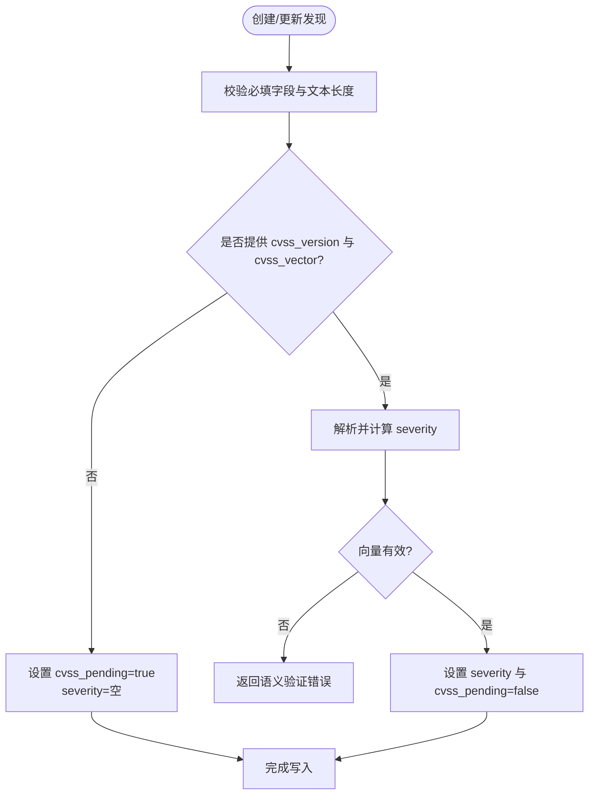
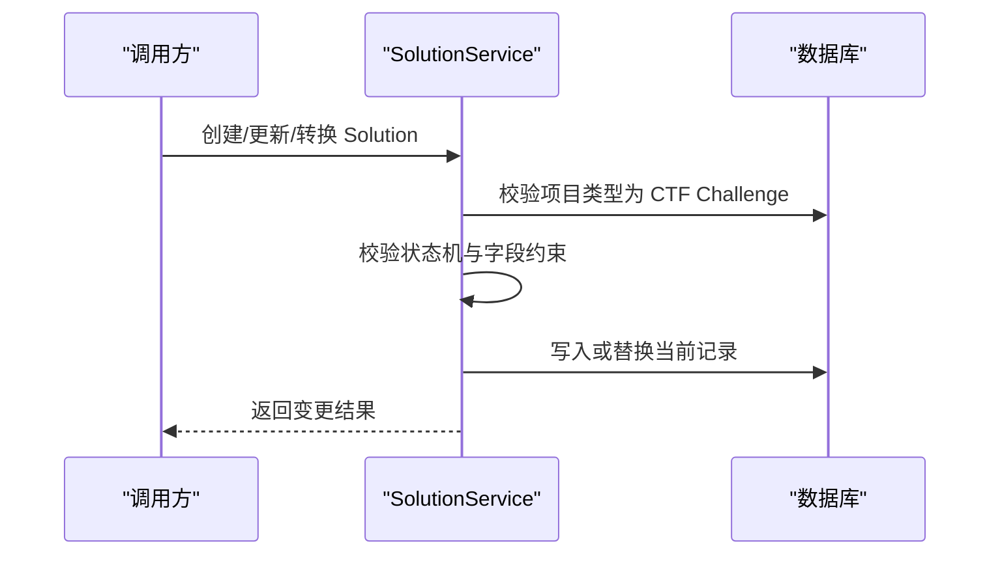
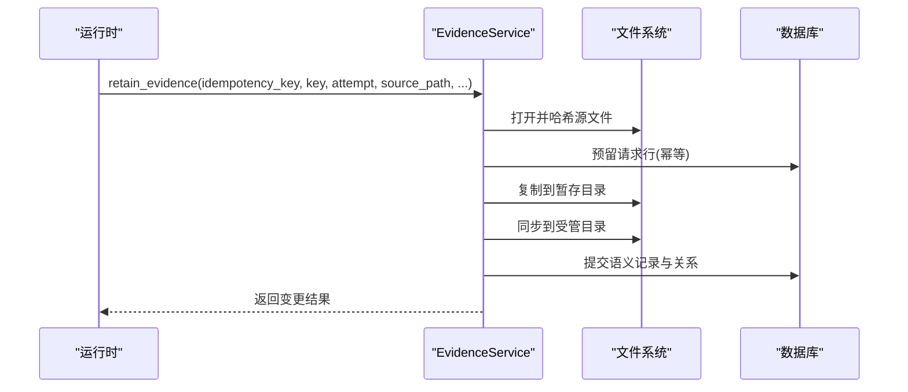
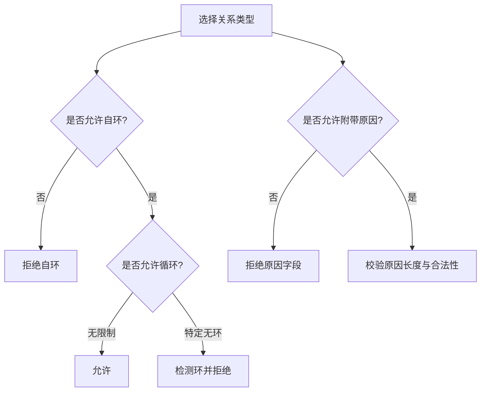
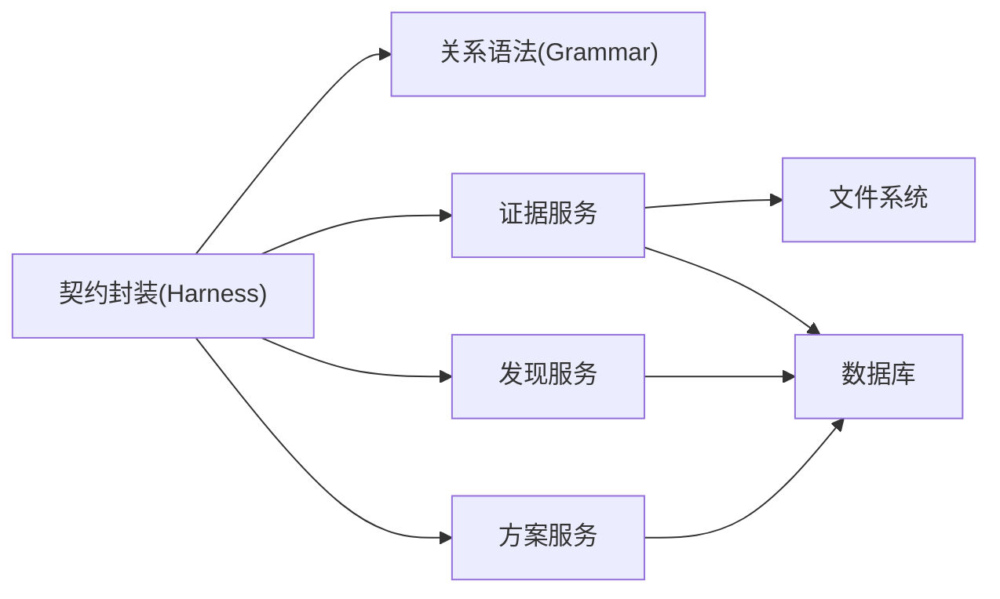

# 数据模型定义

<cite>
**本文引用的文件**   
- [blackboard-v2-spec.md](file://docs/specs/blackboard-v2-spec.md)
- [blackboard-v2.schema.json](file://internal/blackboardv2contract/contractdata/schemas/blackboard-v2.schema.json)
- [relationships.json](file://internal/blackboardv2contract/contractdata/relationships.json)
- [grammar.go](file://internal/blackboardv2grammar/grammar.go)
- [contract.go](file://internal/blackboardv2contract/contract.go)
- [manifest.json](file://internal/blackboardv2contract/contractdata/manifest.json)
- [runtime-snapshot-empty.json](file://internal/blackboardv2contract/contractdata/fixtures/runtime-snapshot-empty.json)
- [runtime-snapshot-ctf-complete.json](file://internal/blackboardv2contract/contractdata/fixtures/runtime-snapshot-ctf-complete.json)
- [evidence.go](file://internal/blackboardv2/evidence.go)
- [finding.go](file://internal/blackboardv2/finding.go)
- [solution.go](file://internal/blackboardv2/solution.go)
</cite>

## 目录
1. [引言](#引言)
2. [项目结构](#项目结构)
3. [核心组件](#核心组件)
4. [架构总览](#架构总览)
5. [详细组件分析](#详细组件分析)
6. [依赖关系分析](#依赖关系分析)
7. [性能与注意力预算](#性能与注意力预算)
8. [故障排查指南](#故障排查指南)
9. [结论](#结论)
10. [附录：JSON Schema 参考与示例](#附录json-schema-参考与示例)

## 引言
本文件系统化定义 Blackboard v2 的数据模型，覆盖实体(Entities)、目标(Objectives)、尝试(Attempts)、事实(Facts)、发现(Findings)、解决方案(Solutions)、证据(Evidence)等语义记录类型；明确字段、数据类型、约束条件与业务规则；提供数据验证规则、版本兼容性信息与迁移指南；并给出完整的 JSON Schema 参考与实际数据示例。Blackboard v2 作为项目的“记忆平面”，为每个运行时续体提供完整且紧凑的当前推理图，同时把原始证明、历史、控制绑定与审计细节隔离在模型之外。

## 项目结构
Blackboard v2 的数据契约由一组可嵌入的机器可读工件组成：规范文档、JSON Schema、关系矩阵、受信任工具清单、以及用于一致性校验的固定样例。实现层通过 Go 包加载并校验这些工件，确保生产端与消费端遵循同一份冻结契约。

图表来源
- [blackboard-v2-spec.md:1-378](file://docs/specs/blackboard-v2-spec.md#L1-L378)
- [blackboard-v2.schema.json:1-800](file://internal/blackboardv2contract/contractdata/schemas/blackboard-v2.schema.json#L1-L800)
- [relationships.json:1-172](file://internal/blackboardv2contract/contractdata/relationships.json#L1-L172)
- [grammar.go:1-180](file://internal/blackboardv2grammar/grammar.go#L1-L180)
- [contract.go:1-493](file://internal/blackboardv2contract/contract.go#L1-L493)
- [manifest.json:1-800](file://internal/blackboardv2contract/contractdata/manifest.json#L1-800)
- [evidence.go:1-800](file://internal/blackboardv2/evidence.go#L1-L800)
- [finding.go:1-381](file://internal/blackboardv2/finding.go#L1-L381)
- [solution.go:1-378](file://internal/blackboardv2/solution.go#L1-L378)

章节来源
- [blackboard-v2-spec.md:1-378](file://docs/specs/blackboard-v2-spec.md#L1-L378)
- [contract.go:1-493](file://internal/blackboardv2contract/contract.go#L1-L493)

## 核心组件
- 语义记录类型
  - 实体(Entity)：描述被测试或研究的对象，包含 kind、name、locator、description、scope_status、credential_ref 等字段。
  - 探索目标(Objective)：表达待探索的问题或任务，状态仅 open，包含 objective 文本。
  - 尝试(Attempt)：对目标的一次具体执行或测试，状态 open 或终态（succeeded/failed/blocked/inconclusive/interrupted），包含 summary。
  - 事实(Fact)：项目知识，包含 category、summary、body、confidence(tentative/confirmed/deprecated)、scope_status。
  - 发现(Finding)：漏洞或问题报告，包含 title、target、description、proof、impact、recommendation、cvss_version、cvss_vector、severity、cvss_pending。
  - 解决方案(Solution)：CTF 场景下的答案/标志/流程，包含 status(candidate/verified/rejected/superseded)、kind(answer/flag/procedure)、summary、value、verification_summary。
  - 证据(Evidence)：可复用的产物引用，包含 artifact_type、summary、media_type、source_path、managed_path、sha256、size、captured_at。
- 关系(Relationships)
  - 允许的关系类型包括 about、part_of、tests、produced、evidences、supports、contradicts、derived_from、depends_on、satisfies、supersedes。
  - 每种关系有方向性、自环策略、循环策略与原因(reason)策略约束。
- 键与版本
  - Blackboard Key 全局唯一、人类可读、ASCII、长度限制；每条记录与关系都有版本号；合并与替换操作维护重定向与历史。
- 运行时快照
  - 以 runtime-blackboard/v2 形式提供工作区(work)与知识区(knowledge)及关系列表；字段白名单严格限定。

章节来源
- [blackboard-v2-spec.md:28-140](file://docs/specs/blackboard-v2-spec.md#L28-L140)
- [blackboard-v2.schema.json:101-508](file://internal/blackboardv2contract/contractdata/schemas/blackboard-v2.schema.json#L101-L508)
- [relationships.json:1-172](file://internal/blackboardv2contract/contractdata/relationships.json#L1-L172)
- [grammar.go:58-83](file://internal/blackboardv2grammar/grammar.go#L58-L83)

## 架构总览
Blackboard v2 的契约通过 JSON Schema 与关系矩阵固化，并由契约封装器(Harness)加载、解析与校验。实现层在服务中应用这些约束，并在证据保留、发现评分、方案生命周期等关键路径上执行严格的语义验证。

图表来源
- [contract.go:1-493](file://internal/blackboardv2contract/contract.go#L1-L493)
- [grammar.go:1-180](file://internal/blackboardv2grammar/grammar.go#L1-L180)
- [evidence.go:1-800](file://internal/blackboardv2/evidence.go#L1-L800)
- [finding.go:1-381](file://internal/blackboardv2/finding.go#L1-L381)
- [solution.go:1-378](file://internal/blackboardv2/solution.go#L1-L378)

## 详细组件分析

### 实体(Entity)
- 关键字段
  - status: 固定 active
  - kind/name: 简洁文本
  - locator/description: 可选简洁文本
  - scope_status: in_scope/unknown/out_of_scope
  - credential_ref: 非敏感引用
- 约束与规则
  - 不允许额外属性；文本长度受限；scope_status 必须为枚举值之一。
- 典型用途
  - 作为 about/part_of/tests/produced/evidences/derived_from 的目标节点。

章节来源
- [blackboard-v2.schema.json:101-133](file://internal/blackboardv2contract/contractdata/schemas/blackboard-v2.schema.json#L101-L133)
- [blackboard-v2-spec.md:32-42](file://docs/specs/blackboard-v2-spec.md#L32-L42)

### 探索目标(Objective)
- 关键字段
  - status: 固定 open
  - objective: 语义文本
- 约束与规则
  - 仅 open 状态；更新需携带当前 version；终止需要满足 satisfies 关系。
- 典型用途
  - 被 Attempt tests；被 Fact/Finding/Solution satisfies；Objective 之间可 part_of/depends_on。

章节来源
- [blackboard-v2.schema.json:134-167](file://internal/blackboardv2contract/contractdata/schemas/blackboard-v2.schema.json#L134-L167)
- [blackboard-v2-spec.md:44-52](file://docs/specs/blackboard-v2-spec.md#L44-L52)

### 尝试(Attempt)
- 关键字段
  - status: open 或终态
  - summary: 语义文本
- 约束与规则
  - 终态需具备摘要与至少一个 tests 关系；中断由服务端协调。
- 典型用途
  - 产生证据与产出物；测试目标、实体、事实、发现、方案。

章节来源
- [blackboard-v2.schema.json:151-167](file://internal/blackboardv2contract/contractdata/schemas/blackboard-v2.schema.json#L151-L167)
- [blackboard-v2-spec.md:44-52](file://docs/specs/blackboard-v2-spec.md#L44-L52)

### 事实(Fact)
- 关键字段
  - category/summary/body/confidence(scope_status)
- 约束与规则
  - confidence 可为 tentative/confirmed/deprecated；confirmed 需要语义支持（证据、已确认的支持事实、成功的 producing Attempt 或可信确认）。
- 典型用途
  - supports/contradicts/derived_from 的核心节点；satisfies 目标。

章节来源
- [blackboard-v2.schema.json:168-197](file://internal/blackboardv2contract/contractdata/schemas/blackboard-v2.schema.json#L168-L197)
- [blackboard-v2-spec.md:44-52](file://docs/specs/blackboard-v2-spec.md#L44-L52)

### 发现(Finding)
- 关键字段
  - status/title/target/description/proof/impact/recommendation/cvss_version/cvss_vector/severity/cvss_pending
- 约束与规则
  - confirmed 状态要求 target/proof/impact/recommendation 完整且 cvss_vector 有效；severity 与 cvss_pending 由服务端派生。
- CVSS 评分
  - 支持 3.1 与 4.0；向量无效或缺失将导致 cvss_pending=true 或错误。
- 支持性检查
  - confirmed 发现需要当前证据或已确认的支持事实。

图表来源
- [finding.go:89-108](file://internal/blackboardv2/finding.go#L89-L108)
- [finding.go:214-248](file://internal/blackboardv2/finding.go#L214-L248)
- [finding.go:250-304](file://internal/blackboardv2/finding.go#L250-L304)

章节来源
- [blackboard-v2.schema.json:198-356](file://internal/blackboardv2contract/contractdata/schemas/blackboard-v2.schema.json#L198-L356)
- [finding.go:1-381](file://internal/blackboardv2/finding.go#L1-L381)

### 解决方案(Solution)
- 关键字段
  - status(kind/summary/value/verification_summary)
- 约束与规则
  - verified 状态要求 value(当 kind 为 answer/flag)与 verification_summary 非空；rejected 需要存在当前矛盾事实以保持无效化意义。
- CTF 求解状态
  - 基于当前 verified flag 方案推导 solved 状态与已验证标志列表。

图表来源
- [solution.go:53-87](file://internal/blackboardv2/solution.go#L53-L87)
- [solution.go:158-196](file://internal/blackboardv2/solution.go#L158-L196)
- [solution.go:235-247](file://internal/blackboardv2/solution.go#L235-L247)

章节来源
- [blackboard-v2.schema.json:357-425](file://internal/blackboardv2contract/contractdata/schemas/blackboard-v2.schema.json#L357-L425)
- [solution.go:1-378](file://internal/blackboardv2/solution.go#L1-L378)

### 证据(Evidence)
- 关键字段
  - status/artifact_type/summary/media_type/source_path/managed_path/sha256/size/captured_at
- 约束与规则
  - managed_path、sha256、size 由服务端管理；source_path 必须在允许的 Task 根内；links 仅允许 evidences/about 两种关系。
- 保留流程
  - 幂等键保证重试安全；文件完整性校验；原子发布语义记录与关系。

图表来源
- [evidence.go:194-360](file://internal/blackboardv2/evidence.go#L194-L360)
- [evidence.go:476-517](file://internal/blackboardv2/evidence.go#L476-L517)
- [evidence.go:540-672](file://internal/blackboardv2/evidence.go#L540-L672)

章节来源
- [blackboard-v2.schema.json:426-508](file://internal/blackboardv2contract/contractdata/schemas/blackboard-v2.schema.json#L426-L508)
- [evidence.go:1-800](file://internal/blackboardv2/evidence.go#L1-L800)

### 关系(Relationships)
- 关系类型与方向
  - about: Objective/Attempt/Fact/Finding/Solution/Evidence → Entity
  - part_of: Entity→Entity 或 Objective→Objective（每端点族无环）
  - tests: Attempt → Objective/Entity/Fact/Finding/Solution
  - produced: Attempt → Entity/Objective/Fact/Finding/Solution/Evidence
  - evidences: Evidence → Fact/Finding/Solution
  - supports: Fact → Fact/Finding/Solution（Fact→Fact 子集无环）
  - contradicts: Fact → Fact/Finding/Solution（允许互反）
  - derived_from: Objective→Fact/Finding/Solution；Fact→Fact/Evidence；Evidence→Evidence（无环）
  - depends_on: Objective→Objective（无环）
  - satisfies: Fact/Finding/Solution → Objective
  - supersedes: 同类型 replacement → replaced（单当前替换，无环）
- 原因(reason)策略
  - 仅 supports/contradicts/depends_on 允许附带 concise 原因；禁止冗余、非法 UTF-8 或超长。

图表来源
- [relationships.json:1-172](file://internal/blackboardv2contract/contractdata/relationships.json#L1-L172)
- [grammar.go:58-83](file://internal/blackboardv2grammar/grammar.go#L58-L83)
- [grammar.go:131-154](file://internal/blackboardv2grammar/grammar.go#L131-L154)

章节来源
- [relationships.json:1-172](file://internal/blackboardv2contract/contractdata/relationships.json#L1-L172)
- [grammar.go:1-180](file://internal/blackboardv2grammar/grammar.go#L1-L180)

## 依赖关系分析
- 契约与实现
  - 契约封装器(Harness)加载 Schema、关系矩阵与固定样例，暴露工具输入/结果 Schema 与用例展开。
  - 关系语法(grammar)提供闭合集与规则查询，供服务层校验关系端点与原因。
- 服务层依赖
  - 证据服务依赖文件系统与数据库，进行幂等保留、完整性校验与原子提交。
  - 发现服务依赖 CVSS 库进行评分与有效性校验。
  - 方案服务依赖项目类型(CTF)与关系约束进行状态机校验。

图表来源
- [contract.go:1-493](file://internal/blackboardv2contract/contract.go#L1-L493)
- [grammar.go:1-180](file://internal/blackboardv2grammar/grammar.go#L1-L180)
- [evidence.go:1-800](file://internal/blackboardv2/evidence.go#L1-L800)
- [finding.go:1-381](file://internal/blackboardv2/finding.go#L1-L381)
- [solution.go:1-378](file://internal/blackboardv2/solution.go#L1-L378)

章节来源
- [contract.go:1-493](file://internal/blackboardv2contract/contract.go#L1-L493)
- [grammar.go:1-180](file://internal/blackboardv2grammar/grammar.go#L1-L180)

## 性能与注意力预算
- 注意力预算以运行时快照字节数衡量，目标 16K tokens，警告 32K，强制合并 64K。
- 快照不包含历史、审计元数据与非语义字段；保持确定性序列化以便哈希与对比。

章节来源
- [blackboard-v2-spec.md:327-336](file://docs/specs/blackboard-v2-spec.md#L327-L336)
- [blackboard-v2-spec.md:136-141](file://docs/specs/blackboard-v2-spec.md#L136-L141)

## 故障排查指南
- 常见错误码
  - version_conflict：并发更新冲突，提示期望/当前版本与下一步动作。
  - semantic_validation：字段不合法、生命周期违规、关系端点或循环违规。
  - authority_denied：权限不足或受信任续体不匹配。
  - idempotency_conflict：幂等键语义不一致。
  - evidence_source_forbidden：证据源越界或不可读。
- 建议步骤
  - 读取当前记录详情与关系，确认版本与状态。
  - 检查关系矩阵与原因策略，确保端点与循环合规。
  - 对于证据保留，核对 source_path 是否在允许的 Task 根内，并验证 sha256/size。

章节来源
- [blackboard-v2-spec.md:293-308](file://docs/specs/blackboard-v2-spec.md#L293-L308)
- [evidence.go:476-517](file://internal/blackboardv2/evidence.go#L476-L517)

## 结论
Blackboard v2 通过冻结契约与强约束的语义模型，为渗透测试代理提供了稳定、可验证、可迁移的记忆平面。其关系矩阵、文本长度限制、CVSS 评分与证据保留流程共同保证了数据的完整性与可追溯性。配合注意力预算与快照机制，系统能在复杂多任务环境中维持高效与一致。

## 附录：JSON Schema 参考与示例
- 基础类型
  - blackboardKey：非空 ASCII，长度≤96。
  - semanticText：长度≤1024 UTF-8 字节。
  - conciseText：长度≤512 UTF-8 字节。
  - nonEmptyText：非空字符串。
  - scopeStatus：in_scope/unknown/out_of_scope。
  - recordType：entity/objective/attempt/fact/finding/solution/evidence。
  - relationType/mutableRelationType/reasonRelationType/ordinaryRelationType：关系类型集合。
- 记录类型
  - entityRecord：status=active，required=[status,kind,name,scope_status]。
  - objectiveRecord：status=open，required=[status,objective]。
  - attemptRecord：status=open，required=[status,summary]。
  - factRecord：required=[category,summary,confidence,scope_status]。
  - findingRecord/findingInputRecord：required=[status,title,...]，confirmed 时要求更多字段。
  - solutionRecord：required=[status,kind,summary]，verified 时要求 verification_summary 与 value(视 kind)。
  - evidenceRecord/evidenceInputRecord：required=[status,artifact_type,summary,managed_path,sha256,size]。
- 运行时快照
  - schema="runtime-blackboard/v2"，包含 work/knowledge/relations；work 含 objectives/attempts；knowledge 含 entities/facts/findings/solutions/evidence。
- 固定样例
  - 空快照：runtime-snapshot-empty.json。
  - CTF 完整快照：runtime-snapshot-ctf-complete.json。
  - 其他样例见 manifest.json 中的 fixtures 列表。

章节来源
- [blackboard-v2.schema.json:1-800](file://internal/blackboardv2contract/contractdata/schemas/blackboard-v2.schema.json#L1-L800)
- [manifest.json:1-800](file://internal/blackboardv2contract/contractdata/manifest.json#L1-800)
- [runtime-snapshot-empty.json:1-2](file://internal/blackboardv2contract/contractdata/fixtures/runtime-snapshot-empty.json#L1-L2)
- [runtime-snapshot-ctf-complete.json:1-2](file://internal/blackboardv2contract/contractdata/fixtures/runtime-snapshot-ctf-complete.json#L1-L2)