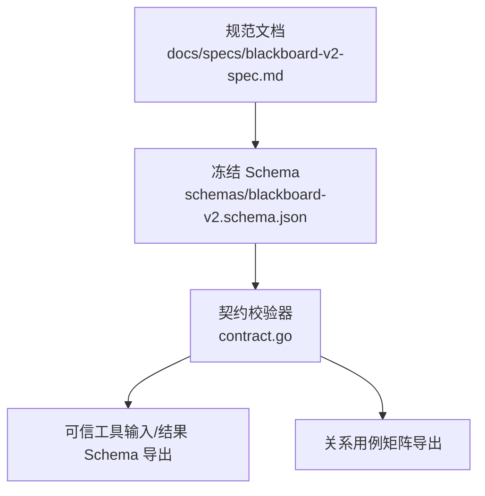
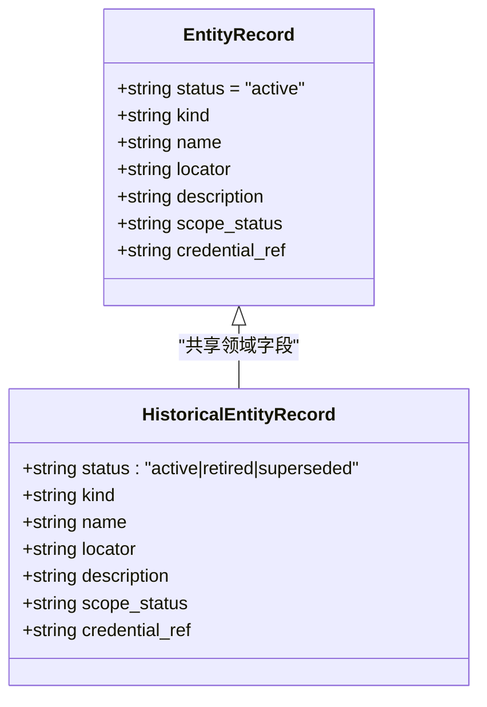
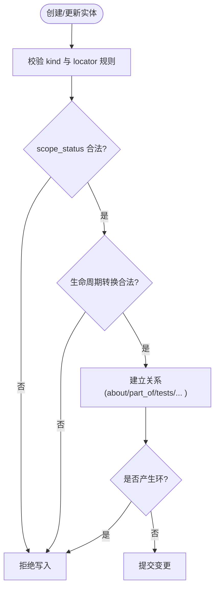
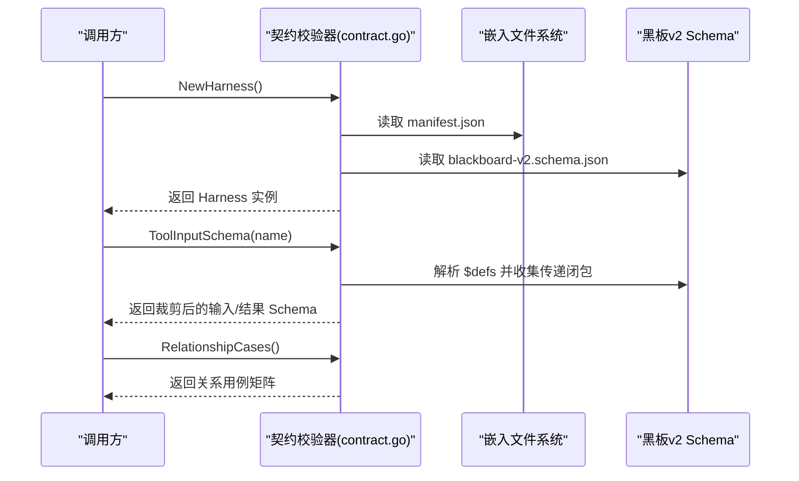

# 核心实体模型

<cite>
**本文引用的文件**   
- [blackboard-v2.schema.json](file://internal/blackboardv2contract/contractdata/schemas/blackboard-v2.schema.json)
- [blackboard-v2-spec.md](file://docs/specs/blackboard-v2-spec.md)
- [contract.go](file://internal/blackboardv2contract/contract.go)
</cite>

## 目录
1. [简介](#简介)
2. [项目结构](#项目结构)
3. [核心组件](#核心组件)
4. [架构总览](#架构总览)
5. [详细组件分析](#详细组件分析)
6. [依赖关系分析](#依赖关系分析)
7. [性能与约束](#性能与约束)
8. [故障排查指南](#故障排查指南)
9. [结论](#结论)
10. [附录：JSON Schema 参考与示例](#附录json-schema-参考与示例)

## 简介
本文件聚焦 Blackboard v2 的核心实体模型，系统性说明基础实体类型（如 entityRecord、historicalEntityRecord）的字段定义、数据类型与约束条件；解释实体的生命周期状态（active、retired、superseded）、作用域状态（in_scope、unknown、out_of_scope），以及关键字段 kind、name、locator、description 的用途。同时提供完整的 JSON Schema 参考路径与实际数据示例位置，并阐述实体之间的关系建模方式。

## 项目结构
Blackboard v2 的实体与关系契约由“规范文档 + 冻结的 JSON Schema + 契约校验器”共同组成：
- 规范文档：定义语义、边界、快照格式、读写协议等
- JSON Schema：以 $defs 形式固化所有记录类型、历史类型、变更操作、运行时快照等
- 契约校验器：加载并验证上述契约，暴露工具输入/结果 Schema、关系用例矩阵等

图表来源
- [blackboard-v2-spec.md:1-120](file://docs/specs/blackboard-v2-spec.md#L1-L120)
- [blackboard-v2.schema.json:1-120](file://internal/blackboardv2contract/contractdata/schemas/blackboard-v2.schema.json#L1-L120)
- [contract.go:74-110](file://internal/blackboardv2contract/contract.go#L74-L110)

章节来源
- [blackboard-v2-spec.md:1-120](file://docs/specs/blackboard-v2-spec.md#L1-L120)
- [blackboard-v2.schema.json:1-120](file://internal/blackboardv2contract/contractdata/schemas/blackboard-v2.schema.json#L1-L120)
- [contract.go:74-110](file://internal/blackboardv2contract/contract.go#L74-L110)

## 核心组件
- 基础实体类型
  - entityRecord：当前工作态实体（仅 active）
  - historicalEntityRecord：历史实体（支持 active、retired、superseded）
- 关键字段
  - kind：受控实体种类（如 host、domain、service、endpoint、application、identity、credential、data_store、file、binary、function 等）
  - name：人类可读名称
  - locator：非机密的定位符（地址、URL、符号或标识）
  - description：简洁的描述性上下文
  - scope_status：作用域状态 in_scope / unknown / out_of_scope
  - credential_ref：仅对 credential 实体，指向非机密凭证引用
- 生命周期与作用域
  - 生命周期：active → retired|superseded；retired → active|superseded；superseded 为终态且需有 incoming supersedes
  - 作用域：in_scope、unknown、out_of_scope（可见性不等同于授权）

章节来源
- [blackboard-v2.schema.json:101-133](file://internal/blackboardv2contract/contractdata/schemas/blackboard-v2.schema.json#L101-L133)
- [blackboard-v2.schema.json:509-545](file://internal/blackboardv2contract/contractdata/schemas/blackboard-v2.schema.json#L509-L545)
- [blackboard-v2.schema.json:36-42](file://internal/blackboardv2contract/contractdata/schemas/blackboard-v2.schema.json#L36-L42)
- [blackboard-v2-spec.md:32-54](file://docs/specs/blackboard-v2-spec.md#L32-L54)

## 架构总览
Blackboard v2 将“当前知识/工作”与“历史版本”解耦：
- 当前实体通过 entityRecord 表达，status 固定为 active
- 历史实体通过 historicalEntityRecord 表达，status 可为 active、retired、superseded
- 两者共享相同的领域字段（kind、name、locator、description、scope_status、credential_ref），但约束不同（例如描述长度限制在实体快照中更严格）

图表来源
- [blackboard-v2.schema.json:101-133](file://internal/blackboardv2contract/contractdata/schemas/blackboard-v2.schema.json#L101-L133)
- [blackboard-v2.schema.json:509-545](file://internal/blackboardv2contract/contractdata/schemas/blackboard-v2.schema.json#L509-L545)

## 详细组件分析

### 实体类型与字段约束
- entityRecord
  - 必需字段：status、kind、name、scope_status
  - 可选字段：locator、description、credential_ref
  - 约束要点：
    - status 固定为 active
    - kind/name/description/locator/credential_ref 使用 conciseText（最大 512 UTF-8 字节）
    - scope_status 来自枚举 in_scope、unknown、out_of_scope
- historicalEntityRecord
  - 必需字段：status、kind、name、scope_status
  - 可选字段：locator、description、credential_ref
  - 约束要点：
    - status 允许 active、retired、superseded
    - 其他字段与 entityRecord 一致，但可用于历史记录归档与替换

章节来源
- [blackboard-v2.schema.json:101-133](file://internal/blackboardv2contract/contractdata/schemas/blackboard-v2.schema.json#L101-L133)
- [blackboard-v2.schema.json:509-545](file://internal/blackboardv2contract/contractdata/schemas/blackboard-v2.schema.json#L509-L545)
- [blackboard-v2.schema.json:18-27](file://internal/blackboardv2contract/contractdata/schemas/blackboard-v2.schema.json#L18-L27)
- [blackboard-v2.schema.json:36-42](file://internal/blackboardv2contract/contractdata/schemas/blackboard-v2.schema.json#L36-L42)

### 生命周期与作用域状态
- 生命周期状态
  - active：当前有效
  - retired：退役（可重新激活或被替代）
  - superseded：被替代（终态，需要存在一条 incoming supersedes 关系）
- 作用域状态
  - in_scope：在范围内
  - unknown：未知
  - out_of_scope：不在范围内
  - 注意：作用域仅表示可见性，不授予测试授权

章节来源
- [blackboard-v2.schema.json:509-545](file://internal/blackboardv2contract/contractdata/schemas/blackboard-v2.schema.json#L509-L545)
- [blackboard-v2.schema.json:36-42](file://internal/blackboardv2contract/contractdata/schemas/blackboard-v2.schema.json#L36-L42)
- [blackboard-v2-spec.md:32-54](file://docs/specs/blackboard-v2-spec.md#L32-L54)

### 关键字段用途
- kind：受控实体种类，用于区分网络、主机、服务、端点、应用、身份、凭证、数据存储、文件、二进制、函数等
- name：人类可读的名称，便于展示与检索
- locator：非机密的定位信息（如 URL、IP、路径、符号等），具体规则取决于 kind
- description：简洁的描述性上下文，帮助理解实体的背景与用途
- scope_status：标记该实体是否在测试范围内
- credential_ref：仅当 kind=credential 时使用，指向非机密凭证引用

章节来源
- [blackboard-v2.schema.json:101-133](file://internal/blackboardv2contract/contractdata/schemas/blackboard-v2.schema.json#L101-L133)
- [blackboard-v2.schema.json:509-545](file://internal/blackboardv2contract/contractdata/schemas/blackboard-v2.schema.json#L509-L545)
- [blackboard-v2-spec.md:32-54](file://docs/specs/blackboard-v2-spec.md#L32-L54)

### 关系建模
- 关系类型（部分）：about、part_of、tests、produced、evidences、supports、contradicts、derived_from、depends_on、satisfies、supersedes
- 方向性与约束：
  - about：目标记录 → 实体
  - part_of：实体 → 实体（或探索目标 → 探索目标）
  - tests：尝试 → 探索目标/实体/事实/发现/方案
  - produced：尝试 → 实体/探索目标/事实/发现/方案/证据
  - evidences：证据 → 事实/发现/方案
  - supports/contradicts/depends_on：可携带原因（reason）
  - satisfies：事实/发现/方案 → 探索目标
  - supersedes：同类型的替换与被替换
- 循环与自链接：
  - 禁止自链接
  - part_of、derived_from、depends_on、supersedes 独立无环
- 关系元组序列化：[from_key, type, to_key] 或带 reason 的四元组

图表来源
- [blackboard-v2.schema.json:54-100](file://internal/blackboardv2contract/contractdata/schemas/blackboard-v2.schema.json#L54-L100)
- [blackboard-v2.schema.json:1337-1386](file://internal/blackboardv2contract/contractdata/schemas/blackboard-v2.schema.json#L1337-L1386)
- [blackboard-v2-spec.md:71-92](file://docs/specs/blackboard-v2-spec.md#L71-L92)

章节来源
- [blackboard-v2.schema.json:54-100](file://internal/blackboardv2contract/contractdata/schemas/blackboard-v2.schema.json#L54-L100)
- [blackboard-v2.schema.json:1337-1386](file://internal/blackboardv2contract/contractdata/schemas/blackboard-v2.schema.json#L1337-L1386)
- [blackboard-v2-spec.md:71-92](file://docs/specs/blackboard-v2-spec.md#L71-L92)

## 依赖关系分析
- 契约校验器从嵌入的文件系统中加载 manifest 与 schema，解析并缓存已解析的 Schema，供工具输入/结果 Schema 导出与关系用例矩阵生成
- 工具输入/结果 Schema 基于主 Schema 的 $defs 裁剪出相关子图，避免泄露无关定义
- 关系用例矩阵由 grammar 扩展得到，覆盖 11×7×7 的端点矩阵

图表来源
- [contract.go:74-110](file://internal/blackboardv2contract/contract.go#L74-L110)
- [contract.go:133-165](file://internal/blackboardv2contract/contract.go#L133-L165)
- [contract.go:475-493](file://internal/blackboardv2contract/contract.go#L475-L493)

章节来源
- [contract.go:74-110](file://internal/blackboardv2contract/contract.go#L74-L110)
- [contract.go:133-165](file://internal/blackboardv2contract/contract.go#L133-L165)
- [contract.go:475-493](file://internal/blackboardv2contract/contract.go#L475-L493)

## 性能与约束
- 文本长度限制
  - Blackboard Key：最多 96 ASCII 字符
  - 主要语义文本（objective、summary、description 等）：最多 1024 UTF-8 字节
  - 可选识别/理由/解释/关系原因：最多 512 UTF-8 字节
  - 实体快照中的 description 限制为 512 UTF-8 字节
- 运行时快照
  - 完整拓扑快照包含 work、knowledge、relations，键按字典序排序，确保确定性序列化
- 注意力预算
  - 16K tokens 健康目标；32K 警告；64K 要求合并

章节来源
- [blackboard-v2.schema.json:5-11](file://internal/blackboardv2contract/contractdata/schemas/blackboard-v2.schema.json#L5-L11)
- [blackboard-v2.schema.json:12-27](file://internal/blackboardv2contract/contractdata/schemas/blackboard-v2.schema.json#L12-L27)
- [blackboard-v2.schema.json:974-1010](file://internal/blackboardv2contract/contractdata/schemas/blackboard-v2.schema.json#L974-L1010)
- [blackboard-v2-spec.md:128-141](file://docs/specs/blackboard-v2-spec.md#L128-L141)
- [blackboard-v2-spec.md:327-336](file://docs/specs/blackboard-v2-spec.md#L327-L336)

## 故障排查指南
- 常见错误码
  - version_conflict：版本冲突，需重试前重读
  - edge_endpoint_type：关系端点类型不匹配
  - graph_cycle：关系会产生环
  - idempotency_conflict：幂等键冲突
  - missing_property/invalid_property：缺失或无效属性
- 处理建议
  - 遇到版本冲突时，先拉取最新快照再重试
  - 检查关系方向与端点类型是否符合矩阵
  - 确认幂等键在同一作用域内未重复使用于不同语义

章节来源
- [blackboard-v2.schema.json:2728-2784](file://internal/blackboardv2contract/contractdata/schemas/blackboard-v2.schema.json#L2728-L2784)
- [blackboard-v2-spec.md:293-310](file://docs/specs/blackboard-v2-spec.md#L293-L310)

## 结论
Blackboard v2 的核心实体模型以严格的 JSON Schema 和规范化文档定义，确保实体字段的完整性、关系的正确性与系统的一致性。entityRecord 与 historicalEntityRecord 分别承载当前与历史语义，配合生命周期与作用域状态，形成清晰的知识演进视图。通过冻结的契约与校验器，系统可在多端（HTTP/MCP/CLI）保持一致的语义与行为。

## 附录：JSON Schema 参考与示例
- 关键 Schema 定义位置
  - entityRecord：[blackboard-v2.schema.json:101-133](file://internal/blackboardv2contract/contractdata/schemas/blackboard-v2.schema.json#L101-L133)
  - historicalEntityRecord：[blackboard-v2.schema.json:509-545](file://internal/blackboardv2contract/contractdata/schemas/blackboard-v2.schema.json#L509-L545)
  - scopeStatus 枚举：[blackboard-v2.schema.json:36-42](file://internal/blackboardv2contract/contractdata/schemas/blackboard-v2.schema.json#L36-L42)
  - relationType 枚举：[blackboard-v2.schema.json:54-68](file://internal/blackboardv2contract/contractdata/schemas/blackboard-v2.schema.json#L54-L68)
  - runtimeSnapshot 结构：[blackboard-v2.schema.json:1387-1421](file://internal/blackboardv2contract/contractdata/schemas/blackboard-v2.schema.json#L1387-L1421)
- 实际数据示例位置
  - 运行时快照示例（空/完成）：
    - [runtime-snapshot-empty.json](file://internal/blackboardv2contract/contractdata/fixtures/runtime-snapshot-empty.json)
    - [runtime-snapshot-ctf-complete.json](file://internal/blackboardv2contract/contractdata/fixtures/runtime-snapshot-ctf-complete.json)
- 关系建模参考
  - 关系元组序列化与原因字段：[blackboard-v2.schema.json:1337-1386](file://internal/blackboardv2contract/contractdata/schemas/blackboard-v2.schema.json#L1337-L1386)
  - 关系方向与约束说明：[blackboard-v2-spec.md:71-92](file://docs/specs/blackboard-v2-spec.md#L71-L92)

章节来源
- [blackboard-v2.schema.json:101-133](file://internal/blackboardv2contract/contractdata/schemas/blackboard-v2.schema.json#L101-L133)
- [blackboard-v2.schema.json:509-545](file://internal/blackboardv2contract/contractdata/schemas/blackboard-v2.schema.json#L509-L545)
- [blackboard-v2.schema.json:36-42](file://internal/blackboardv2contract/contractdata/schemas/blackboard-v2.schema.json#L36-L42)
- [blackboard-v2.schema.json:54-68](file://internal/blackboardv2contract/contractdata/schemas/blackboard-v2.schema.json#L54-L68)
- [blackboard-v2.schema.json:1337-1386](file://internal/blackboardv2contract/contractdata/schemas/blackboard-v2.schema.json#L1337-L1386)
- [blackboard-v2.schema.json:1387-1421](file://internal/blackboardv2contract/contractdata/schemas/blackboard-v2.schema.json#L1387-L1421)
- [blackboard-v2-spec.md:71-92](file://docs/specs/blackboard-v2-spec.md#L71-L92)