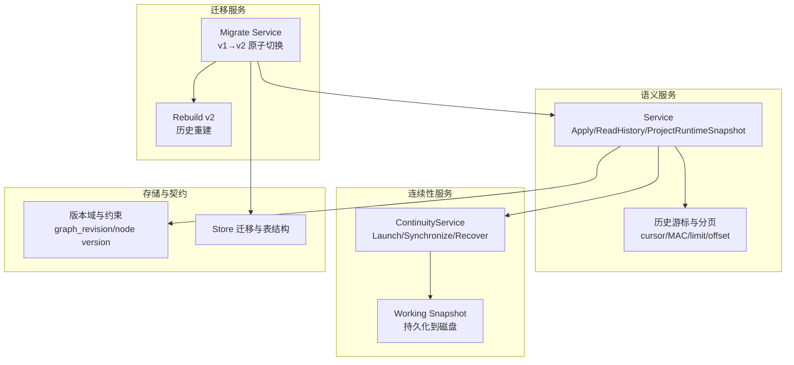
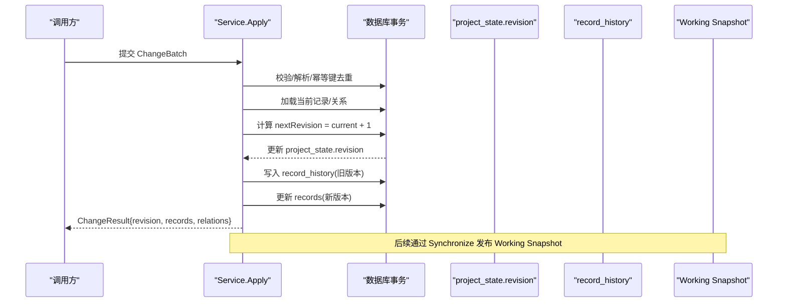
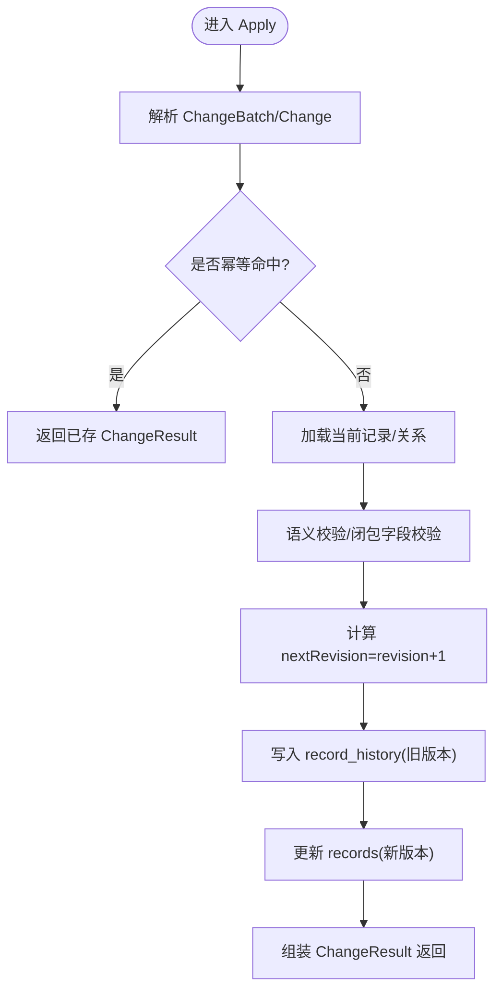
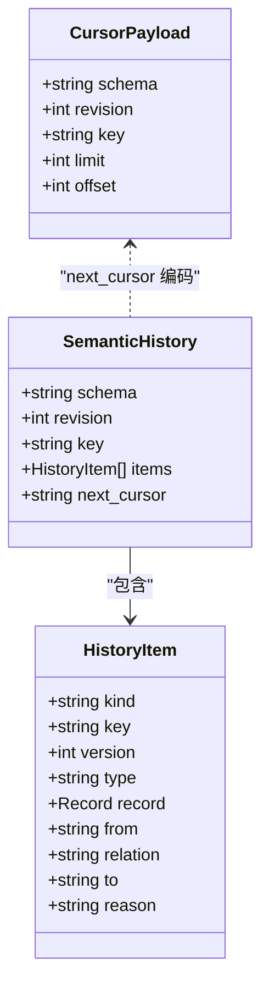
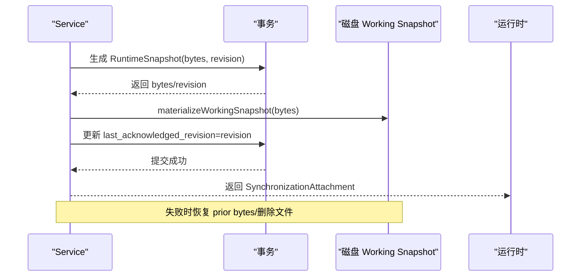
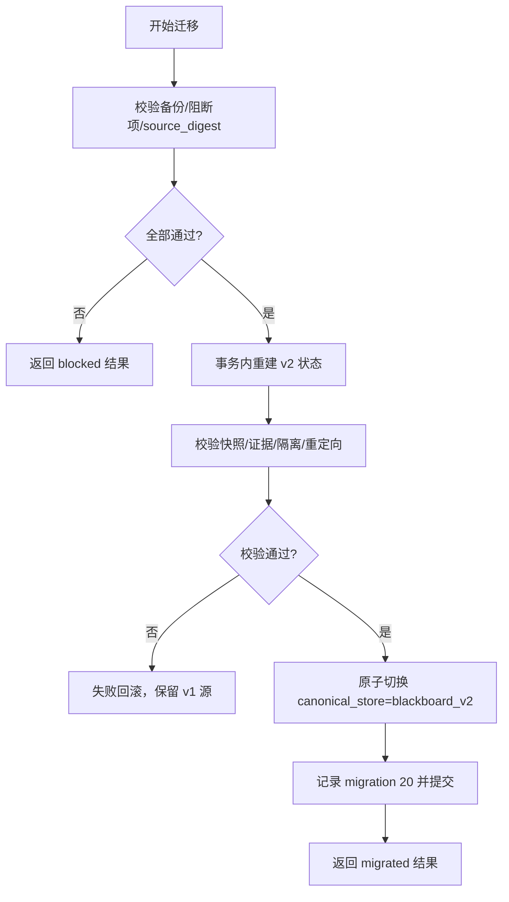
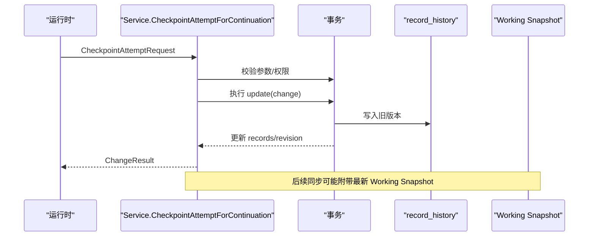
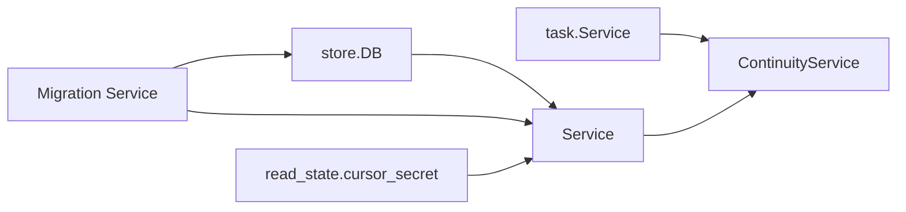

# 版本控制与历史

<cite>
**本文引用的文件**   
- [service.go](file://internal/blackboardv2/service.go)
- [continuity.go](file://internal/blackboardv2/continuity.go)
- [checkpoint.go](file://internal/blackboardv2/checkpoint.go)
- [migrate_v2.go](file://internal/blackboardmigration/migrate_v2.go)
- [rebuild_v2.go](file://internal/blackboardmigration/rebuild_v2.go)
- [blackboard-graph-storage.md](file://docs/specs/blackboard-graph-storage.md)
- [blackboard-v2-spec.md](file://docs/specs/blackboard-v2-spec.md)
- [blackboard-legacy-migration.md](file://docs/specs/blackboard-legacy-migration.md)
- [0013-replace-the-blackboard-v1-implementation.md](file://docs/adr/0013-replace-the-blackboard-v1-implementation.md)
- [store.go](file://internal/store/store.go)
</cite>

## 目录
1. [简介](#简介)
2. [项目结构](#项目结构)
3. [核心组件](#核心组件)
4. [架构总览](#架构总览)
5. [详细组件分析](#详细组件分析)
6. [依赖关系分析](#依赖关系分析)
7. [性能考量](#性能考量)
8. [故障排查指南](#故障排查指南)
9. [结论](#结论)
10. [附录](#附录)

## 简介
本文件聚焦 Blackboard v2 的版本控制与历史管理，系统性说明 version、revision 字段的含义与递增规则；解释历史记录数据结构（semantic-history/v2）及其状态转换；详述快照生成、恢复机制与版本兼容性策略；并提供版本迁移指南、回滚操作与历史数据查询的最佳实践。文档面向具备基础技术背景的读者，力求以渐进方式呈现从概念到代码级实现的全景视图。

## 项目结构
Blackboard v2 的版本与历史能力由以下模块协同实现：
- 语义服务层：负责变更批处理、版本递增、历史写入、当前详情读取、投影与快照等。
- 连续性服务层：负责 Continuation 的启动、同步、工作快照发布与恢复。
- 迁移服务层：负责 v1→v2 离线原子切换、重建、校验与 epoch 翻转。
- 存储规范与契约：定义多类版本号域、Schema 契约与运行时快照格式。

图表来源
- [service.go:41-120](file://internal/blackboardv2/service.go#L41-L120)
- [continuity.go:119-134](file://internal/blackboardv2/continuity.go#L119-L134)
- [migrate_v2.go:26-201](file://internal/blackboardmigration/migrate_v2.go#L26-L201)
- [rebuild_v2.go:408-434](file://internal/blackboardmigration/rebuild_v2.go#L408-L434)
- [blackboard-graph-storage.md:89-103](file://docs/specs/blackboard-graph-storage.md#L89-L103)
- [store.go:1418-1432](file://internal/store/store.go#L1418-L1432)

章节来源
- [service.go:41-120](file://internal/blackboardv2/service.go#L41-L120)
- [continuity.go:119-134](file://internal/blackboardv2/continuity.go#L119-L134)
- [migrate_v2.go:26-201](file://internal/blackboardmigration/migrate_v2.go#L26-L201)
- [rebuild_v2.go:408-434](file://internal/blackboardmigration/rebuild_v2.go#L408-L434)
- [blackboard-graph-storage.md:89-103](file://docs/specs/blackboard-graph-storage.md#L89-L103)
- [store.go:1418-1432](file://internal/store/store.go#L1418-L1432)

## 核心组件
- ChangeBatch/Change：语义变更信封与操作集合，包含 create/update/relate/unrelate/transition/supersede/merge 等闭包式字段校验。
- CurrentDetail/RecordVersionTuple：单条记录的当前详情与版本元组。
- SemanticHistory/HistoryItem：历史分页结果与条目，支持基于 MAC 签名游标的稳定分页。
- RuntimeSnapshot/WorkingSnapshot：运行时快照与工作快照，用于 Continuation 间共享知识传播。
- ContinuityService：负责 Launch、Synchronize、Claim/Finalize 同步回执、恢复已发布的 Working Snapshot。
- Migration Service：离线 v1→v2 原子切换，含备份校验、阻断检查、重建、验证与 epoch 翻转。

章节来源
- [service.go:72-147](file://internal/blackboardv2/service.go#L72-L147)
- [service.go:483-524](file://internal/blackboardv2/service.go#L483-L524)
- [service.go:525-614](file://internal/blackboardv2/service.go#L525-L614)
- [continuity.go:119-134](file://internal/blackboardv2/continuity.go#L119-L134)
- [migrate_v2.go:26-201](file://internal/blackboardmigration/migrate_v2.go#L26-L201)

## 架构总览
Blackboard v2 将“语义版本”与“物理版本”解耦：
- 物理版本：SQLite 迁移版本（schema_migrations）。
- 语义版本：
  - mutation_seq：每个 Project 接受的首次批次序列号（含全空批次）。
  - graph_revision：每 Project 的语义状态修订号，仅在批次改变当前图状态时递增。
  - Node/edge/key version：每条记录自身的语义版本，仅在其当前状态变化时递增。
  - Snapshot revision：一次 Continuation 捕获的不可变 graph_revision。
  - Health checked revision：健康检查评估的图修订号。

这些计数器彼此独立且互不重用，确保幂等回放无需消费任何计数器。

图表来源
- [service.go:2916-2922](file://internal/blackboardv2/service.go#L2916-L2922)
- [service.go:1978-2011](file://internal/blackboardv2/service.go#L1978-L2011)
- [blackboard-graph-storage.md:89-103](file://docs/specs/blackboard-graph-storage.md#L89-L103)

章节来源
- [blackboard-graph-storage.md:89-103](file://docs/specs/blackboard-graph-storage.md#L89-L103)
- [service.go:2916-2922](file://internal/blackboardv2/service.go#L2916-L2922)
- [service.go:1978-2011](file://internal/blackboardv2/service.go#L1978-L2011)

## 详细组件分析

### 版本字段与递增规则
- version（记录级）：对单个 key 的语义版本，仅在记录当前状态发生变化时递增。例如 update/transition 导致新状态写入时，version+1。
- revision（项目级）：graph_revision，表示整个项目的语义状态修订号，在每次成功应用并改变当前图状态的批次后递增。
- 其他版本域：mutation_seq、Snapshot revision、Health checked revision 等，分别服务于幂等、快照与诊断用途。

图表来源
- [service.go:72-147](file://internal/blackboardv2/service.go#L72-L147)
- [service.go:2916-2922](file://internal/blackboardv2/service.go#L2916-L2922)
- [service.go:1978-2011](file://internal/blackboardv2/service.go#L1978-L2011)

章节来源
- [service.go:72-147](file://internal/blackboardv2/service.go#L72-L147)
- [service.go:2916-2922](file://internal/blackboardv2/service.go#L2916-L2922)
- [service.go:1978-2011](file://internal/blackboardv2/service.go#L1978-L2011)
- [blackboard-graph-storage.md:89-103](file://docs/specs/blackboard-graph-storage.md#L89-L103)

### 历史记录数据结构与状态转换
- 历史 Schema：semantic-history/v2，包含 revision、key、items[]、next_cursor。
- HistoryItem：kind/type/version/record/from/relation/to/reason 等，描述一次变更或关系变动。
- 游标：opaque 前缀，内部为 base64 负载 + HMAC 签名，携带 schema、revision、key、limit、offset，防止篡改与越权。
- 陈旧游标：当请求 cursor 中的 revision 小于当前 revision 时，返回 semantic_validation 错误，提示 restart_history_read。

图表来源
- [service.go:503-524](file://internal/blackboardv2/service.go#L503-L524)
- [service.go:4768-4856](file://internal/blackboardv2/service.go#L4768-L4856)

章节来源
- [service.go:503-524](file://internal/blackboardv2/service.go#L503-L524)
- [service.go:4768-4856](file://internal/blackboardv2/service.go#L4768-L4856)

### 快照生成、发布与恢复
- 快照类型：
  - RuntimeSnapshot（runtime-blackboard/v2）：只读投影，包含 work/knowledge/relations 等允许字段。
  - WorkingSnapshot：持久化的工作快照，路径位于任务工作目录下 .pentest/blackboard.json。
- 生成与发布：
  - ProjectRuntimeSnapshot/ProjectRuntimeSnapshotTx：按当前图状态生成快照字节。
  - SynchronizeContinuation/CaptureTrustedSynchronization：将最新快照发布到磁盘，并原子更新 last_acknowledged_revision。
- 恢复：
  - RecoverActiveWorkingSnapshots：重启后根据已确认的 Working Snapshot 字节恢复磁盘文件，保证 Crash/网络丢失可重试。
- 幂等与一致性：
  - 先写盘再提交事务；失败时回滚到先前字节或移除文件，避免不一致。
  - 已确认的重复请求会重新发布相同字节，保障响应丢失可精确回放。

图表来源
- [continuity.go:635-751](file://internal/blackboardv2/continuity.go#L635-L751)
- [continuity.go:764-880](file://internal/blackboardv2/continuity.go#L764-L880)
- [continuity_test.go:434-459](file://internal/blackboardv2/continuity_test.go#L434-L459)
- [synchronization_test.go:380-634](file://internal/blackboardv2/synchronization_test.go#L380-L634)

章节来源
- [continuity.go:635-751](file://internal/blackboardv2/continuity.go#L635-L751)
- [continuity.go:764-880](file://internal/blackboardv2/continuity.go#L764-L880)
- [continuity_test.go:434-459](file://internal/blackboardv2/continuity_test.go#L434-L459)
- [synchronization_test.go:380-634](file://internal/blackboardv2/synchronization_test.go#L380-L634)

### 版本兼容性与迁移策略
- 迁移目标：从 v1（legacy/graph）切换到 blackboard_v2，采用离线原子 cutover。
- 前置条件：
  - 存在可独立验证的备份（quick_check ok、SHA256 一致）。
  - 无活跃 Continuation（pending/running/paused）。
  - source_digest 与当前源一致。
- 流程要点：
  - 重建 v2 状态（包括历史重建），在事务内完成。
  - 校验：快照契约、确定性、证据完整性、跨项目隔离、重定向有效性。
  - 原子切换 canonical_store 至 blackboard_v2，并记录 migration 20。
  - 失败注入点：AfterParity、AfterStateFlip，确保可回滚。
- 回滚与幂等：
  - 若 AfterStateFlip 失败，事务回滚，保持 v1 源表完整，epoch 不变。
  - 已提交的迁移结果可通过 source_digest/cutover_id 幂等查询。

图表来源
- [migrate_v2.go:26-201](file://internal/blackboardmigration/migrate_v2.go#L26-L201)
- [migrate_v2.go:203-283](file://internal/blackboardmigration/migrate_v2.go#L203-L283)
- [migrate_v2.go:480-514](file://internal/blackboardmigration/migrate_v2.go#L480-L514)
- [migrate_v2.go:674-703](file://internal/blackboardmigration/migrate_v2.go#L674-L703)
- [rebuild_v2.go:408-434](file://internal/blackboardmigration/rebuild_v2.go#L408-L434)
- [blackboard-legacy-migration.md:541-570](file://docs/specs/blackboard-legacy-migration.md#L541-L570)

章节来源
- [migrate_v2.go:26-201](file://internal/blackboardmigration/migrate_v2.go#L26-L201)
- [migrate_v2.go:203-283](file://internal/blackboardmigration/migrate_v2.go#L203-L283)
- [migrate_v2.go:480-514](file://internal/blackboardmigration/migrate_v2.go#L480-L514)
- [migrate_v2.go:674-703](file://internal/blackboardmigration/migrate_v2.go#L674-L703)
- [rebuild_v2.go:408-434](file://internal/blackboardmigration/rebuild_v2.go#L408-L434)
- [blackboard-legacy-migration.md:541-570](file://docs/specs/blackboard-legacy-migration.md#L541-L570)

### 检查点与 Attempt 版本化
- CheckpointAttemptForContinuation：针对受信任 Continuation 的 open Attempt 摘要进行版本化更新，走标准事务、历史与 Working Snapshot 流水线。
- 语义校验：idempotency_key、key、version>0、summary 文本校验。
- 结果：返回 ChangeResult，包含 revision 与受影响记录版本。

图表来源
- [checkpoint.go:10-99](file://internal/blackboardv2/checkpoint.go#L10-L99)
- [service.go:414-421](file://internal/blackboardv2/service.go#L414-L421)

章节来源
- [checkpoint.go:10-99](file://internal/blackboardv2/checkpoint.go#L10-L99)
- [service.go:414-421](file://internal/blackboardv2/service.go#L414-L421)

## 依赖关系分析
- Service 依赖 store.DB 进行读写；ContinuityService 组合 Service 与 task.Service、grant 存储；Migration Service 组合 Service 与 store 迁移逻辑。
- 历史游标依赖 read_state 中的 cursor_secret 进行 HMAC 签名，防止篡改。
- 迁移过程依赖 schema_migrations 与 blackboard_store_state 的 epoch 与 cutover 状态。

图表来源
- [continuity.go:119-134](file://internal/blackboardv2/continuity.go#L119-L134)
- [service.go:4786-4795](file://internal/blackboardv2/service.go#L4786-L4795)
- [migrate_v2.go:26-201](file://internal/blackboardmigration/migrate_v2.go#L26-L201)

章节来源
- [continuity.go:119-134](file://internal/blackboardv2/continuity.go#L119-L134)
- [service.go:4786-4795](file://internal/blackboardv2/service.go#L4786-L4795)
- [migrate_v2.go:26-201](file://internal/blackboardmigration/migrate_v2.go#L26-L201)

## 性能考量
- 幂等键去重：避免重复批次造成不必要的版本递增与历史膨胀。
- 批量写入：单次事务内合并多条变更，减少锁竞争与 IO。
- 快照投影：按需生成最小允许字段集，降低序列化与传输开销。
- 历史分页：使用带签名的 opaque 游标，避免深翻页扫描，提升稳定性与安全性。
- 发布顺序：先写盘再提交，失败回滚，避免不一致导致的额外修复成本。

[本节为通用指导，不直接分析具体文件]

## 故障排查指南
- 历史游标陈旧：
  - 现象：返回 semantic_validation，message 为 “history cursor is stale”，details 包含 cursor_revision/current_revision。
  - 处理：客户端应重启历史读取，忽略旧游标。
- 同步附件丢失：
  - 现象：Working Snapshot 文件缺失但已确认。
  - 处理：再次调用 SynchronizeContinuation 或 CaptureTrustedSynchronization，系统会重放已确认字节并恢复文件。
- 迁移失败回滚：
  - 现象：AfterStateFlip 注入失败，epoch 仍为 v1，源表完整。
  - 处理：修复问题后重试迁移，利用幂等性避免重复导入。

章节来源
- [service.go:4849-4856](file://internal/blackboardv2/service.go#L4849-L4856)
- [synchronization_test.go:614-634](file://internal/blackboardv2/synchronization_test.go#L614-L634)
- [migrate_v2_test.go:109-152](file://internal/blackboardmigration/migrate_v2_test.go#L109-L152)

## 结论
Blackboard v2 通过清晰的版本域划分、严格的闭包式变更契约、幂等回放与原子切换，构建了稳健的语义版本与历史管理能力。结合安全的历史游标、可靠的快照发布与恢复机制，以及完备的 v1→v2 迁移策略，系统在可用性、一致性与可运维性方面达到工程级要求。

[本节为总结，不直接分析具体文件]

## 附录

### 版本域对照表
- SQLite 迁移版本：物理数据库模式修订。
- mutation schema_version：语义请求契约版本。
- mutation_seq：每 Project 首次接受的批次序列号（含全空批次）。
- graph_revision：每 Project 语义状态修订号，仅在改变当前图状态时递增。
- Node/edge/key version：每条记录语义版本，仅在当前状态变化时递增。
- Snapshot revision：一次 Continuation 捕获的不可变 graph_revision。
- Health checked revision：健康检查评估的图修订号。

章节来源
- [blackboard-graph-storage.md:89-103](file://docs/specs/blackboard-graph-storage.md#L89-L103)

### 历史查询最佳实践
- 使用 next_cursor 分页，避免自行维护 offset。
- 遇到 “stale cursor” 错误时，立即重启读取。
- 限制 Limit 大小，避免一次性拉取过多历史。
- 关注 revision 字段，必要时在 UI 中展示当前 revision 以便对比。

章节来源
- [service.go:503-524](file://internal/blackboardv2/service.go#L503-L524)
- [service.go:4768-4856](file://internal/blackboardv2/service.go#L4768-L4856)

### 迁移与回滚建议
- 迁移前：
  - 准备可独立验证的备份，确保 quick_check ok 与 SHA256 一致。
  - 清理活跃 Continuation，避免阻断。
  - 收集并核对 source_digest。
- 迁移中：
  - 观察阻断项与校验报告，逐项修复。
  - 使用失败注入点定位风险阶段。
- 迁移后：
  - 运行 verify 步骤，确认快照契约与证据完整性。
  - 逐步下线兼容性写入接口，遵循发布节奏。

章节来源
- [migrate_v2.go:26-201](file://internal/blackboardmigration/migrate_v2.go#L26-L201)
- [migrate_v2.go:203-283](file://internal/blackboardmigration/migrate_v2.go#L203-L283)
- [blackboard-legacy-migration.md:541-570](file://docs/specs/blackboard-legacy-migration.md#L541-L570)

### 相关设计决策与规范
- 替换 v1 实现：v2 作为全新替代，拒绝 v1 的复杂审计与冗余类型，垂直切片 TDD 推进。
- 快照契约：runtime-blackboard/v2 明确允许字段，确保最小暴露面。
- MCP 工具契约：blackboard_change/read/history/evidence retain/attempt checkpoint/continuation finish。

章节来源
- [0013-replace-the-blackboard-v1-implementation.md:1-6](file://docs/adr/0013-replace-the-blackboard-v1-implementation.md#L1-L6)
- [blackboard-v2-spec.md:250-267](file://docs/specs/blackboard-v2-spec.md#L250-L267)