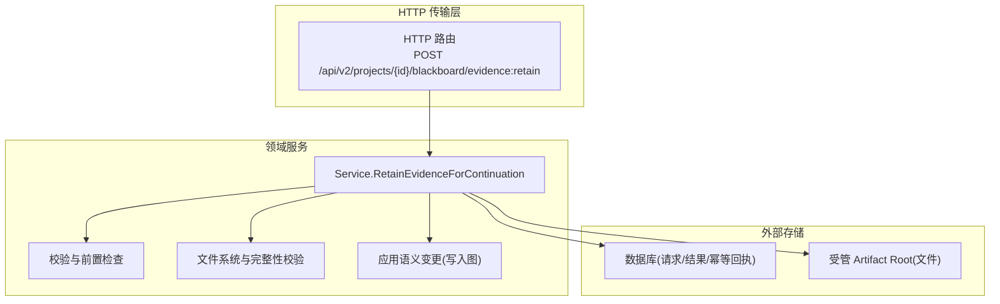
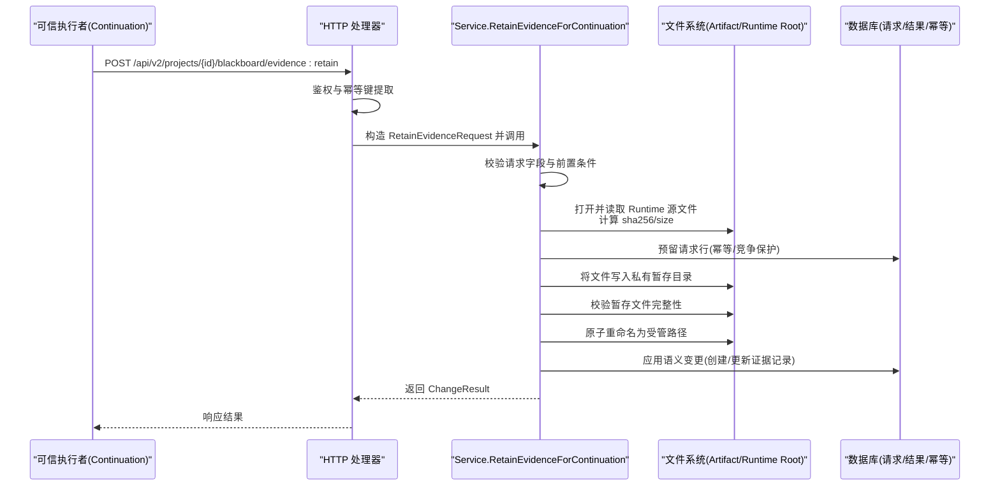
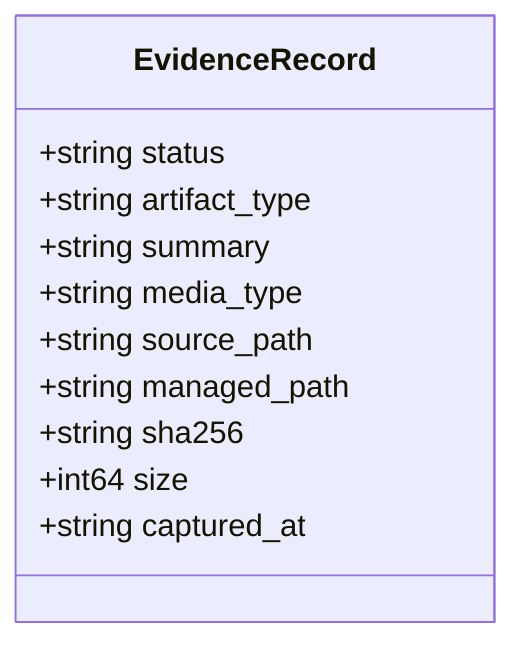
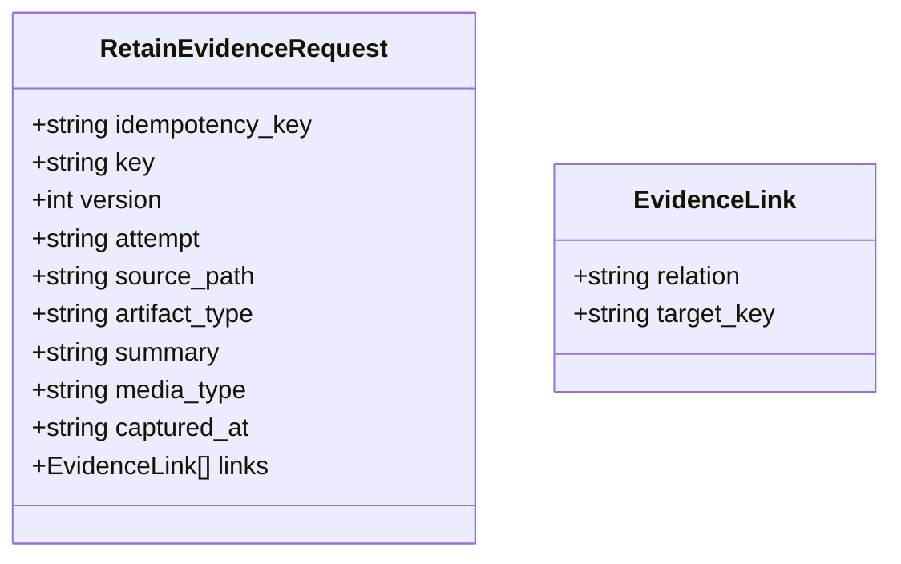
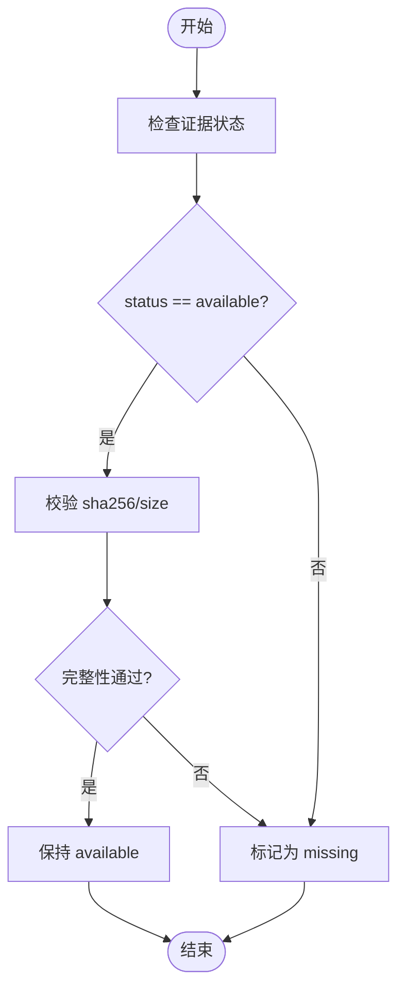
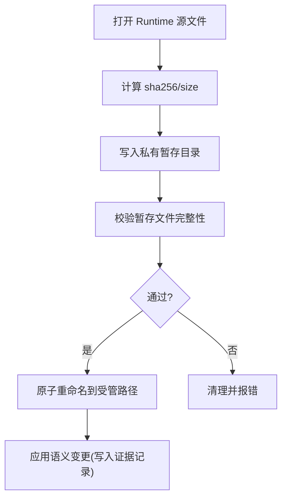
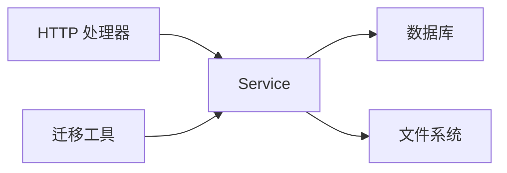

# 证据数据模型

<cite>
**本文引用的文件**   
- [service.go](file://internal/blackboardv2/service.go)
- [evidence.go](file://internal/blackboardv2/evidence.go)
- [blackboard_v2_http.go](file://internal/daemon/blackboard_v2_http.go)
- [rebuild_v2.go](file://internal/blackboardmigration/rebuild_v2.go)
- [migrate_v2.go](file://internal/blackboardmigration/migrate_v2.go)
</cite>

## 目录
1. [简介](#简介)
2. [项目结构](#项目结构)
3. [核心组件](#核心组件)
4. [架构总览](#架构总览)
5. [详细组件分析](#详细组件分析)
6. [依赖关系分析](#依赖关系分析)
7. [性能考虑](#性能考虑)
8. [故障排查指南](#故障排查指南)
9. [结论](#结论)
10. [附录](#附录)

## 简介
本文件聚焦于“证据”数据模型与生命周期，围绕 EvidenceRecord 与 RetainEvidenceRequest（即证据输入记录）的结构设计、关键字段约束、状态流转、时间戳处理与完整性校验展开。同时给出证据上传、存储与检索的端到端流程说明，并附带 API 调用示例与数据格式规范，帮助读者快速理解并正确使用证据子系统。

## 项目结构
证据相关能力主要分布在以下模块：
- Blackboard v2 领域服务：定义证据记录 DTO、请求体、校验与持久化逻辑
- Daemon HTTP 层：暴露证据保留接口，负责鉴权与参数绑定
- 迁移工具：在历史重建与迁移过程中对证据字段进行规范化与校验

图表来源
- [blackboard_v2_http.go:30-46](file://internal/daemon/blackboard_v2_http.go#L30-L46)
- [evidence.go:195-360](file://internal/blackboardv2/evidence.go#L195-L360)

章节来源
- [blackboard_v2_http.go:30-46](file://internal/daemon/blackboard_v2_http.go#L30-L46)
- [evidence.go:195-360](file://internal/blackboardv2/evidence.go#L195-L360)

## 核心组件
- EvidenceRecord：证据的完整语义详情 DTO，包含状态、类型、摘要、媒体类型、源路径、受管路径、SHA256、大小与捕获时间等字段。
- RetainEvidenceRequest：运行时提交的证据保留请求，用于从沙箱工作区读取文件并持久化为受管证据。
- Service.RetainEvidenceForContinuation：证据保留主流程，串联鉴权、校验、文件拷贝、完整性验证、语义提交与幂等回放。

关键字段说明与约束
- artifact_type：证据制品类型标识，必填且为简洁文本；用于前端展示与分类。
- managed_path：受管存储中的最终路径，由服务端根据项目ID与内容哈希计算生成，客户端不可指定。
- sha256：文件内容的 SHA-256 摘要，必需且用于完整性校验；available 状态的证据必须提供。
- size：文件大小，用于与摘要共同完成完整性校验。
- captured_at：证据捕获时间戳，可选，若提供则必须符合 RFC3339 格式。
- status：证据状态，常见值包括 available 与 missing；available 表示文件存在且通过完整性校验，missing 表示文件缺失或不可用。
- summary：证据摘要，必填且为语义文本。
- media_type：MIME 类型，可选，需为简洁文本。
- source_path：运行时侧源文件相对路径，仅用于上传阶段定位源文件。

章节来源
- [service.go:342-352](file://internal/blackboardv2/service.go#L342-L352)
- [evidence.go:76-90](file://internal/blackboardv2/evidence.go#L76-L90)
- [evidence.go:475-517](file://internal/blackboardv2/evidence.go#L475-L517)
- [evidence.go:892-914](file://internal/blackboardv2/evidence.go#L892-L914)
- [rebuild_v2.go:1598-1623](file://internal/blackboardmigration/rebuild_v2.go#L1598-L1623)

## 架构总览
证据保留的整体时序如下：

图表来源
- [blackboard_v2_http.go:199-236](file://internal/daemon/blackboard_v2_http.go#L199-L236)
- [evidence.go:195-360](file://internal/blackboardv2/evidence.go#L195-L360)
- [evidence.go:788-848](file://internal/blackboardv2/evidence.go#L788-L848)
- [evidence.go:864-891](file://internal/blackboardv2/evidence.go#L864-L891)

## 详细组件分析

### 证据记录结构 EvidenceRecord
- 用途：作为证据的只读详情 DTO，供查询、快照与报告消费。
- 关键字段：
  - status：available 或 missing；available 时要求 sha256 与 size 非空且可被校验。
  - artifact_type：制品类型，必填。
  - managed_path：服务端生成的受管路径，指向最终存储位置。
  - sha256/size：完整性校验所需元数据。
  - captured_at：可选的时间戳，RFC3339。
- 序列化行为：当满足证据特征时，Record 会被序列化为 EvidenceRecord。

图表来源
- [service.go:342-352](file://internal/blackboardv2/service.go#L342-L352)

章节来源
- [service.go:342-352](file://internal/blackboardv2/service.go#L342-L352)
- [service.go:400-412](file://internal/blackboardv2/service.go#L400-L412)

### 证据输入记录 RetainEvidenceRequest
- 用途：运行时向服务端提交证据保留请求，携带源文件路径、制品类型、摘要与关联关系等。
- 必填字段：idempotency_key、key、attempt、source_path、artifact_type、summary。
- 可选字段：version、media_type、captured_at、links。
- 校验规则：
  - links 仅允许 evidences 或 about 两种关系类型。
  - captured_at 若提供，必须符合 RFC3339。
  - version 若提供，必须为正整数。
  - 未知字段将被拒绝。

图表来源
- [evidence.go:76-90](file://internal/blackboardv2/evidence.go#L76-L90)
- [evidence.go:61-75](file://internal/blackboardv2/evidence.go#L61-L75)

章节来源
- [evidence.go:76-90](file://internal/blackboardv2/evidence.go#L76-L90)
- [evidence.go:93-161](file://internal/blackboardv2/evidence.go#L93-L161)
- [evidence.go:475-517](file://internal/blackboardv2/evidence.go#L475-L517)

### 证据生命周期与状态
- available：文件存在于受管存储并通过完整性校验。
- missing：文件缺失或不可用；迁移与重建时对 missing 的证据允许不提供摘要。
- 状态转换：
  - 初始保留成功后为 available。
  - 后续可通过语义变更将证据标记为 missing（例如文件被清理）。
  - 系统会基于证据完整性与事实支撑关系，确保已确认的事实具备可靠基础。

图表来源
- [evidence.go:892-914](file://internal/blackboardv2/evidence.go#L892-L914)
- [rebuild_v2.go:1598-1623](file://internal/blackboardmigration/rebuild_v2.go#L1598-L1623)

章节来源
- [evidence.go:892-914](file://internal/blackboardv2/evidence.go#L892-L914)
- [rebuild_v2.go:1598-1623](file://internal/blackboardmigration/rebuild_v2.go#L1598-L1623)

### 时间戳处理 captured_at
- 可选字段，若提供则必须在请求解析阶段符合 RFC3339 格式。
- 进入证据记录后，作为只读元数据随记录一起呈现。

章节来源
- [evidence.go:475-517](file://internal/blackboardv2/evidence.go#L475-L517)
- [service.go:342-352](file://internal/blackboardv2/service.go#L342-L352)

### 文件完整性验证机制
- 上传阶段：
  - 从 Runtime 根目录安全地打开源文件，限制路径范围，禁止符号链接与非普通文件。
  - 流式计算 sha256 与 size，并在写入暂存目录后进行二次校验。
- 发布阶段：
  - 校验受管路径下的文件是否匹配预期摘要与大小。
  - 不通过则返回完整性失败错误。
- 查询阶段：
  - 对于 available 的证据，按需重新校验以保障一致性。

图表来源
- [evidence.go:540-575](file://internal/blackboardv2/evidence.go#L540-L575)
- [evidence.go:864-891](file://internal/blackboardv2/evidence.go#L864-L891)
- [evidence.go:1102-1123](file://internal/blackboardv2/evidence.go#L1102-L1123)

章节来源
- [evidence.go:540-575](file://internal/blackboardv2/evidence.go#L540-L575)
- [evidence.go:864-891](file://internal/blackboardv2/evidence.go#L864-L891)
- [evidence.go:1102-1123](file://internal/blackboardv2/evidence.go#L1102-L1123)

### 证据上传、存储与检索流程

#### 上传与保留
- 入口：POST /api/v2/projects/{id}/blackboard/evidence:retain
- 鉴权：必须由可信 Continuation 发起，支持幂等键。
- 流程要点：
  - 解析并校验请求体。
  - 打开并读取 Runtime 源文件，计算摘要与大小。
  - 预留请求行，避免并发冲突。
  - 写入私有暂存目录，校验完整性。
  - 原子重命名为受管路径。
  - 应用语义变更，创建或更新证据记录。
  - 幂等回放：相同 idempotency_key 的请求直接返回之前结果。

章节来源
- [blackboard_v2_http.go:199-236](file://internal/daemon/blackboard_v2_http.go#L199-L236)
- [evidence.go:195-360](file://internal/blackboardv2/evidence.go#L195-L360)
- [evidence.go:788-848](file://internal/blackboardv2/evidence.go#L788-L848)

#### 存储路径与命名
- 受管内部路径：按项目 ID 与内容摘要规划，确保唯一与安全。
- 公开语义路径：artifacts/retained/{sha256}/{文件名}，便于检索与下载。
- 私有暂存路径：.evidence-staging 下按 continuation/key/requestHash 隔离。

章节来源
- [evidence.go:705-773](file://internal/blackboardv2/evidence.go#L705-L773)

#### 检索与详情
- 读取当前详情：GET /api/v2/projects/{id}/blackboard/records/{key}
- 读取历史：GET /api/v2/projects/{id}/blackboard/records/{key}/history
- 运行态快照：GET /api/v2/projects/{id}/blackboard/snapshot
- 证据详情中包含 managed_path、sha256、size、captured_at 等字段，可用于进一步访问或展示。

章节来源
- [blackboard_v2_http.go:161-197](file://internal/daemon/blackboard_v2_http.go#L161-L197)
- [service.go:342-352](file://internal/blackboardv2/service.go#L342-L352)

### API 调用示例与数据格式规范

- 保留证据
  - 方法：POST
  - 路径：/api/v2/projects/{id}/blackboard/evidence:retain
  - 头部：
    - Idempotency-Key：幂等键（必填）
    - Authorization：Bearer token（可信 Continuation）
  - 请求体字段：
    - key：证据键（必填）
    - version：替换版本（可选，正整数）
    - attempt：产生该证据的尝试键（必填）
    - source_path：运行时源文件路径（必填）
    - artifact_type：制品类型（必填）
    - summary：证据摘要（必填）
    - media_type：MIME 类型（可选）
    - captured_at：捕获时间戳，RFC3339（可选）
    - links：关系数组，元素为 [relation, target_key]，relation 仅允许 evidences 或 about（可选）
  - 响应体：semantic-change-result/v2 结构，包含 schema、revision、records、relations、working_snapshot 等。

- 读取证据详情
  - 方法：GET
  - 路径：/api/v2/projects/{id}/blackboard/records/{key}
  - 响应体：current-detail 结构，其中 record 可能序列化为 EvidenceRecord。

- 读取证据历史
  - 方法：GET
  - 路径：/api/v2/projects/{id}/blackboard/records/{key}/history?cursor=&limit=
  - 响应体：semantic-history/v2 结构。

- 获取运行态快照
  - 方法：GET
  - 路径：/api/v2/projects/{id}/blackboard/snapshot
  - 响应体：runtime-blackboard/v2 结构，knowledge.evidence 中列出各证据的简要信息。

章节来源
- [blackboard_v2_http.go:199-236](file://internal/daemon/blackboard_v2_http.go#L199-L236)
- [blackboard_v2_http.go:161-197](file://internal/daemon/blackboard_v2_http.go#L161-L197)
- [service.go:414-421](file://internal/blackboardv2/service.go#L414-L421)
- [service.go:483-492](file://internal/blackboardv2/service.go#L483-L492)
- [service.go:503-523](file://internal/blackboardv2/service.go#L503-L523)
- [service.go:525-533](file://internal/blackboardv2/service.go#L525-L533)

## 依赖关系分析
- HTTP 层依赖领域服务：
  - handleBlackboardV2EvidenceRetain 调用 Service.RetainEvidenceForContinuation。
- 领域服务依赖：
  - 数据库：保存请求、结果与幂等回执，保证幂等与回放。
  - 文件系统：Runtime Root 读取源文件，Artifact Root 管理受管文件。
- 迁移工具依赖：
  - 在重建与迁移中对证据字段进行规范化与校验，确保 legacy 数据兼容。

图表来源
- [blackboard_v2_http.go:199-236](file://internal/daemon/blackboard_v2_http.go#L199-L236)
- [evidence.go:195-360](file://internal/blackboardv2/evidence.go#L195-L360)
- [rebuild_v2.go:1598-1623](file://internal/blackboardmigration/rebuild_v2.go#L1598-L1623)

章节来源
- [blackboard_v2_http.go:199-236](file://internal/daemon/blackboard_v2_http.go#L199-L236)
- [evidence.go:195-360](file://internal/blackboardv2/evidence.go#L195-L360)
- [rebuild_v2.go:1598-1623](file://internal/blackboardmigration/rebuild_v2.go#L1598-L1623)

## 性能考虑
- 流式哈希：在读取源文件时采用流式计算 sha256，避免一次性加载大文件到内存。
- 幂等与回放：通过请求哈希与结果缓存减少重复处理的开销。
- 原子操作：使用私有暂存目录与原子重命名降低并发风险与中间状态影响。
- 按需校验：查询阶段仅在需要时重新校验证据完整性，避免不必要的 I/O。

[本节为通用指导，无需具体文件引用]

## 故障排查指南
- 完整性失败：
  - 现象：返回 evidence_integrity_failed。
  - 排查：检查受管路径文件是否存在、是否为普通文件、sha256/size 是否与记录一致。
- 源文件变更：
  - 现象：返回 evidence_source_changed。
  - 排查：确认重试时源文件未发生变化，确保幂等键与源文件保持一致。
- 权限不足：
  - 现象：authority_denied。
  - 排查：确认请求来自可信 Continuation，token 有效且与项目匹配。
- 键冲突或版本冲突：
  - 现象：key_conflict 或 version_conflict。
  - 排查：检查 key 是否已被占用，version 是否与当前记录一致。
- 迁移与重建问题：
  - 现象：缺少 managed_path 或 available 证据缺少 sha256。
  - 排查：依据迁移工具的校验提示修复数据。

章节来源
- [evidence.go:864-891](file://internal/blackboardv2/evidence.go#L864-L891)
- [evidence.go:775-786](file://internal/blackboardv2/evidence.go#L775-L786)
- [migrate_v2.go:584-589](file://internal/blackboardmigration/migrate_v2.go#L584-L589)
- [rebuild_v2.go:1610-1623](file://internal/blackboardmigration/rebuild_v2.go#L1610-L1623)

## 结论
证据数据模型以 EvidenceRecord 为核心，结合 RetainEvidenceRequest 实现从运行时到受管存储的可靠留存。通过严格的字段校验、路径安全控制与完整性验证，系统在可用性、一致性与安全性之间取得平衡。配合幂等与回放机制，证据子系统能够稳健地支撑渗透测试过程中的证据采集、存储与检索需求。

[本节为总结性内容，无需具体文件引用]

## 附录
- 术语
  - 受管路径：服务端规划的最终存储路径，客户端不可指定。
  - 幂等键：用于去重与回放的请求标识。
  - 可信 Continuation：具有写权限的执行主体。

[本节为补充说明，无需具体文件引用]