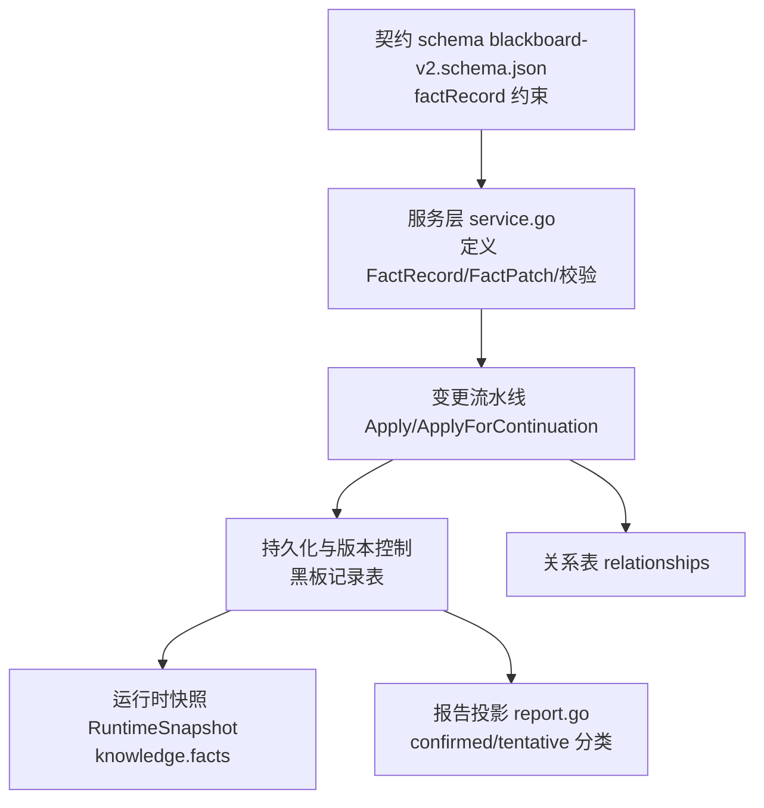
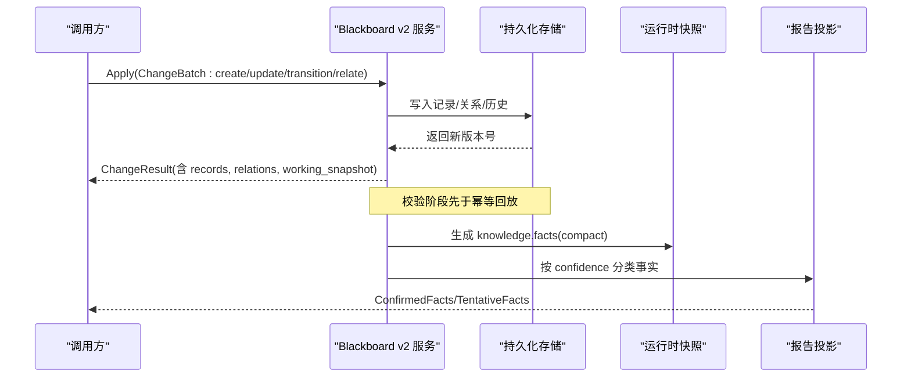
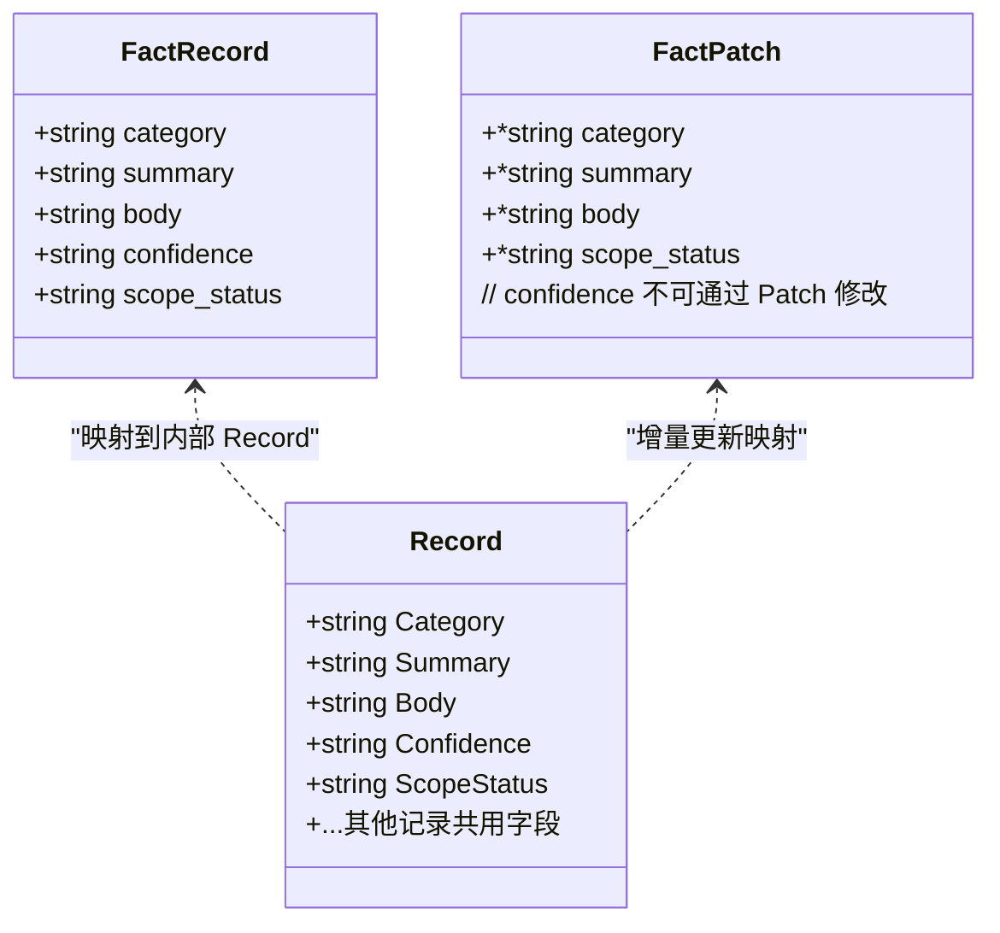
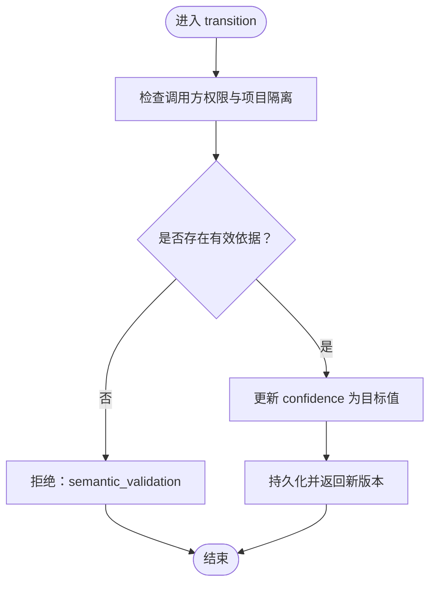
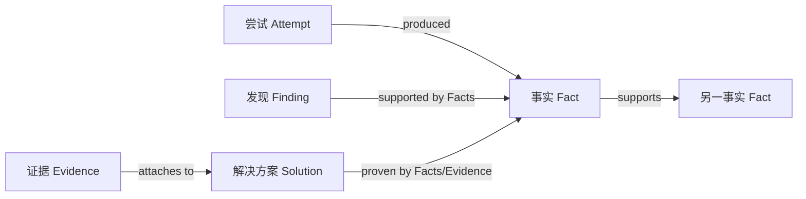
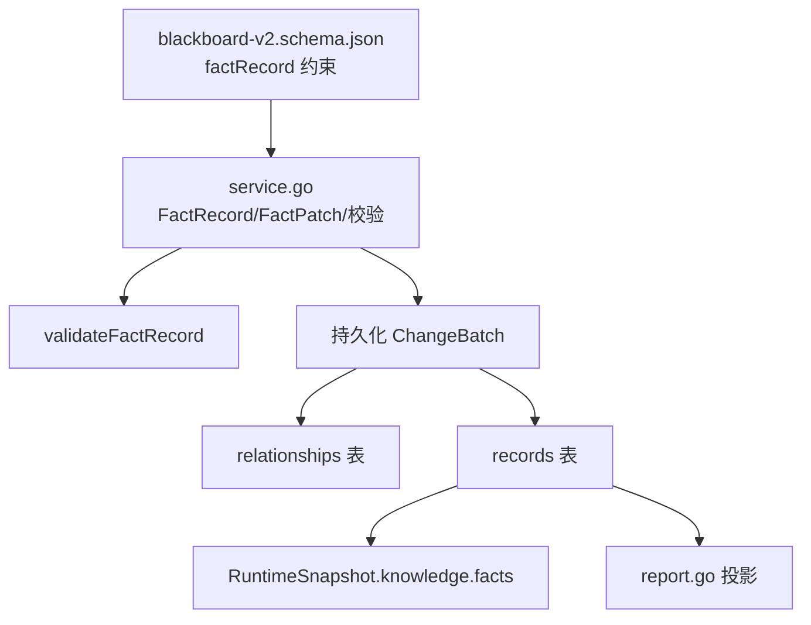

# 事实记录

<cite>
**本文引用的文件**   
- [service.go](file://internal/blackboardv2/service.go)
- [fact_service_test.go](file://internal/blackboardv2/fact_service_test.go)
- [evidence.go](file://internal/blackboardv2/evidence.go)
- [report.go](file://internal/blackboardv2/report.go)
- [blackboard-v2.schema.json](file://internal/blackboardv2contract/contractdata/schemas/blackboard-v2.schema.json)
- [CONTEXT.md](file://CONTEXT.md)
</cite>

## 目录
1. [简介](#简介)
2. [项目结构](#项目结构)
3. [核心组件](#核心组件)
4. [架构总览](#架构总览)
5. [详细组件分析](#详细组件分析)
6. [依赖关系分析](#依赖关系分析)
7. [性能与一致性考虑](#性能与一致性考虑)
8. [故障排查指南](#故障排查指南)
9. [结论](#结论)
10. [附录：使用示例与最佳实践](#附录使用示例与最佳实践)

## 简介
本文件聚焦于 Blackboard v2 语义系统中的“事实记录（Fact）”，系统性说明 FactRecord 的完整结构、字段约束、置信度级别及其在知识管理中的作用，并阐述其与发现（Finding）、解决方案（Solution）、证据（Evidence）等语义记录的关联方式。文档同时提供丰富的使用示例与最佳实践，帮助读者正确创建、更新和确认事实，以及通过关系构建可信的证据链。

## 项目结构
Blackboard v2 将“事实”作为可复用的断言型知识单元，贯穿任务执行、运行时快照、报告生成与审计历史。关键实现集中在服务层与契约定义中：
- 数据结构与校验：服务层定义 FactRecord/FactPatch 及 validateFactRecord
- 变更流水线：ChangeBatch 的 create/update/transition/relate 操作
- 运行时快照：RuntimeSnapshot 中的 knowledge.facts 投影
- 报告投影：按 confidence 拆分 confirmed/tentative 事实
- 契约模式：JSON Schema 对 factRecord 的必填/可选字段进行约束

图表来源
- [service.go:278-294](file://internal/blackboardv2/service.go#L278-L294)
- [service.go:4551-4570](file://internal/blackboardv2/service.go#L4551-L4570)
- [report.go:386-453](file://internal/blackboardv2/report.go#L386-L453)
- [blackboard-v2.schema.json:168-184](file://internal/blackboardv2contract/contractdata/schemas/blackboard-v2.schema.json#L168-L184)

章节来源
- [service.go:278-294](file://internal/blackboardv2/service.go#L278-L294)
- [service.go:4551-4570](file://internal/blackboardv2/service.go#L4551-L4570)
- [report.go:386-453](file://internal/blackboardv2/report.go#L386-L453)
- [blackboard-v2.schema.json:168-184](file://internal/blackboardv2contract/contractdata/schemas/blackboard-v2.schema.json#L168-L184)

## 核心组件
- FactRecord：项目事实的完整 DTO，包含必需字段 category、summary、confidence、scope_status 与可选字段 body。
- FactPatch：面向更新的闭合部分更新形状，允许选择性更新 category、summary、body、scope_status；confidence 不允许通过 Patch 直接修改，需通过 transition 操作。
- 校验规则：validateFactRecord 强制 category/summary 非空且长度限制、body 必须为合法 UTF-8、confidence 仅允许 tentative/confirmed、scope_status 仅允许 in_scope/unknown/out_of_scope。
- 运行时快照：RuntimeSnapshot 的 knowledge.facts 仅暴露 compact 的事实上下文（不含 body），用于运行时高效消费。
- 报告投影：report.go 根据 confidence 将事实分为 ConfirmedFacts 与 TentativeFacts，便于报告区分已确认与试探性结论。

章节来源
- [service.go:278-294](file://internal/blackboardv2/service.go#L278-L294)
- [service.go:4551-4570](file://internal/blackboardv2/service.go#L4551-L4570)
- [report.go:425-437](file://internal/blackboardv2/report.go#L425-L437)

## 架构总览
事实记录的生命周期围绕“创建—更新—过渡—关联—快照/报告”展开：
- 创建：以 FactRecord 写入，系统校验并落盘，返回版本号
- 更新：以 FactPatch 增量更新，支持 Clear 清空指定字段
- 过渡：通过 transition 改变 confidence（tentative ↔ confirmed），受权威性与依据约束
- 关联：通过 relate 建立 supports/produced/about/part_of 等关系，形成证据链
- 快照/报告：RuntimeSnapshot 提供 compact 事实视图；报告按 confidence 分类输出

图表来源
- [service.go:278-294](file://internal/blackboardv2/service.go#L278-L294)
- [service.go:4551-4570](file://internal/blackboardv2/service.go#L4551-L4570)
- [report.go:386-453](file://internal/blackboardv2/report.go#L386-L453)

## 详细组件分析

### FactRecord 结构与字段约束
- 必需字段
  - category：简洁文本，用于分类事实类型（如技术发现、配置信息、漏洞信息等）。要求非空、UTF-8、长度上限。
  - summary：语义文本，描述事实要点。要求非空、UTF-8、长度上限。
  - confidence：置信度，仅允许 tentative（试探性）或 confirmed（已确认）。
  - scope_status：作用域状态，仅允许 in_scope、unknown、out_of_scope。
- 可选字段
  - body：扩展正文，可为空；若存在则必须为合法 UTF-8。

图表来源
- [service.go:278-294](file://internal/blackboardv2/service.go#L278-L294)
- [service.go:364-396](file://internal/blackboardv2/service.go#L364-L396)
- [service.go:4682-4690](file://internal/blackboardv2/service.go#L4682-L4690)

章节来源
- [service.go:278-294](file://internal/blackboardv2/service.go#L278-L294)
- [service.go:364-396](file://internal/blackboardv2/service.go#L364-L396)
- [service.go:4682-4690](file://internal/blackboardv2/service.go#L4682-L4690)

### 置信度级别：tentative 与 confirmed
- tentative（试探性）：表示观察到的、尚未被充分验证的可复用结论。适合在探索阶段快速沉淀知识，供后续工作参考。
- confirmed（已确认）：表示具备强支撑的结论，需要满足以下至少一种基础：
  - 由可信操作者直接确认
  - 由独立支持的已确认事实（supports 关系）
  - 由成功执行的尝试（attempt produced → succeeded）
  - 在同一最终批次中产生并满足上述条件
- 重要性：
  - 当前真相（Current Truth）默认包含 tentative 与 confirmed 的事实，但报告会将两者区分展示，确保结论透明度
  - 运行时快照仅暴露 compact 事实上下文，避免泄露完整 proof/body，提高运行效率
  - 通过严格的 transition 校验，防止无依据的“自我确认”，保障知识质量

图表来源
- [fact_service_test.go:410-471](file://internal/blackboardv2/fact_service_test.go#L410-L471)
- [fact_service_test.go:522-710](file://internal/blackboardv2/fact_service_test.go#L522-L710)
- [evidence.go:1057-1100](file://internal/blackboardv2/evidence.go#L1057-L1100)

章节来源
- [fact_service_test.go:410-471](file://internal/blackboardv2/fact_service_test.go#L410-L471)
- [fact_service_test.go:522-710](file://internal/blackboardv2/fact_service_test.go#L522-L710)
- [evidence.go:1057-1100](file://internal/blackboardv2/evidence.go#L1057-L1100)

### 作用域状态：scope_status
- in_scope：目标在授权范围内，可作为行动依据
- unknown：尚不明确是否属于范围，需谨慎处理
- out_of_scope：明确不在授权范围内，保留上下文但不赋予行动力
- 影响：
  - 当前真相视图会显式标记 out_of_scope 的事实，避免误用
  - 报告与快照均携带该字段，便于下游呈现与决策

章节来源
- [service.go:4551-4570](file://internal/blackboardv2/service.go#L4551-L4570)
- [CONTEXT.md:1079-1278](file://CONTEXT.md#L1079-L1278)

### 与其他语义记录的关联关系
- 与发现（Finding）
  - 发现通过“支持事实”（supports 关系）获得证据基础；已确认的发现通常依赖已确认事实
  - 报告投影将 ConfirmedFacts 与 TentativeFacts 分别列出，辅助判断发现的可靠性
- 与解决方案（Solution）
  - 解决方案（答案、旗帜、程序）可与事实建立关系，用于证明解决路径的有效性
- 与证据（Evidence）
  - 证据通过 managed_path/sha256/size 等完整性字段绑定实体文件，事实可通过 supports 关系引用已确认事实，间接增强证据链
- 与尝试（Attempt）
  - 尝试通过 produced 关系产出事实；当尝试状态为 succeeded 时，可作为确认事实的依据之一

图表来源
- [fact_service_test.go:610-710](file://internal/blackboardv2/fact_service_test.go#L610-L710)
- [report.go:386-453](file://internal/blackboardv2/report.go#L386-L453)

章节来源
- [fact_service_test.go:610-710](file://internal/blackboardv2/fact_service_test.go#L610-L710)
- [report.go:386-453](file://internal/blackboardv2/report.go#L386-L453)

## 依赖关系分析
- 服务层依赖
  - 校验器：validateFactRecord 负责字段合法性与取值域约束
  - 持久化：ChangeBatch 的 create/update/transition/relate 统一写入记录与关系表
  - 快照与报告：RuntimeSnapshot 与 report.go 基于持久化数据生成视图
- 契约依赖
  - JSON Schema 对 factRecord 的 required 与 properties 进行严格约束，保证跨语言/跨模块的一致性

图表来源
- [service.go:278-294](file://internal/blackboardv2/service.go#L278-L294)
- [service.go:4551-4570](file://internal/blackboardv2/service.go#L4551-L4570)
- [report.go:386-453](file://internal/blackboardv2/report.go#L386-L453)
- [blackboard-v2.schema.json:168-184](file://internal/blackboardv2contract/contractdata/schemas/blackboard-v2.schema.json#L168-L184)

章节来源
- [service.go:278-294](file://internal/blackboardv2/service.go#L278-L294)
- [service.go:4551-4570](file://internal/blackboardv2/service.go#L4551-L4570)
- [report.go:386-453](file://internal/blackboardv2/report.go#L386-L453)
- [blackboard-v2.schema.json:168-184](file://internal/blackboardv2contract/contractdata/schemas/blackboard-v2.schema.json#L168-L184)

## 性能与一致性考虑
- 运行时快照采用 compact 事实上下文（不包含 body），降低传输与解析开销
- 变更流水线在应用前进行闭合形状校验，再进入幂等回放，减少无效写放大
- 关系与历史记录分离，确保读取投影时的稳定性与可追溯性

[本节为通用指导，不直接分析具体文件]

## 故障排查指南
- 常见校验错误
  - category/summary 为空或超长：检查 conciseText/semanticText 限制
  - body 非法 UTF-8：确保编码正确
  - confidence 取值非法：仅允许 tentative/confirmed
  - scope_status 取值非法：仅允许 in_scope/unknown/out_of_scope
- 幂等冲突与版本冲突
  - 相同 idempotency_key 的重放需完全一致，否则返回 idempotency_conflict
  - 更新时需传入正确的 version，否则返回 version_conflict
- 确认失败
  - 缺少有效依据（supports/produced+succeeded/可信操作者）将返回 semantic_validation
  - 跨项目或外部 Continuation 的确认会被拒绝（authority_denied 或 semantic_validation）

章节来源
- [service.go:4551-4570](file://internal/blackboardv2/service.go#L4551-L4570)
- [fact_service_test.go:240-321](file://internal/blackboardv2/fact_service_test.go#L240-L321)
- [fact_service_test.go:410-471](file://internal/blackboardv2/fact_service_test.go#L410-L471)
- [fact_service_test.go:522-710](file://internal/blackboardv2/fact_service_test.go#L522-L710)

## 结论
事实记录是 Blackboard v2 的核心知识单元，通过严格的字段约束与置信度机制，既保证了知识的可复用性与可追溯性，又避免了未经证实的结论污染当前真相。配合关系模型与证据体系，事实能够稳健地支撑发现与解决方案的构建，并在报告与快照中清晰呈现其可信度与作用域。

[本节为总结性内容，不直接分析具体文件]

## 附录：使用示例与最佳实践

### 示例一：创建试探性事实（tentative）
- 场景：在登录测试中发现接口可能接受 JSON 请求
- 关键字段
  - category：authentication
  - summary：登录端点可能接受 JSON 请求
  - confidence：tentative
  - scope_status：in_scope
  - body：可选，记录观察到的 Content-Type 等信息
- 参考用例路径
  - [fact_service_test.go:51-66](file://internal/blackboardv2/fact_service_test.go#L51-L66)

章节来源
- [fact_service_test.go:51-66](file://internal/blackboardv2/fact_service_test.go#L51-L66)

### 示例二：更新事实摘要并清空 body
- 场景：修正摘要并显式清空 body
- 关键点
  - 使用 FactPatch 更新 summary
  - 使用 Clear 列表指定要清空的字段（如 body）
- 参考用例路径
  - [fact_service_test.go:93-137](file://internal/blackboardv2/fact_service_test.go#L93-L137)

章节来源
- [fact_service_test.go:93-137](file://internal/blackboardv2/fact_service_test.go#L93-L137)

### 示例三：从 tentative 提升到 confirmed
- 场景：通过独立支持的已确认事实或成功尝试提升置信度
- 关键点
  - 使用 transition 操作，而非 Patch 修改 confidence
  - 需提供有效依据（supports/produced+succeeded/可信操作者）
- 参考用例路径
  - [fact_service_test.go:410-471](file://internal/blackboardv2/fact_service_test.go#L410-L471)
  - [fact_service_test.go:522-710](file://internal/blackboardv2/fact_service_test.go#L522-L710)

章节来源
- [fact_service_test.go:410-471](file://internal/blackboardv2/fact_service_test.go#L410-L471)
- [fact_service_test.go:522-710](file://internal/blackboardv2/fact_service_test.go#L522-L710)

### 示例四：通过关系构建证据链
- 场景：已确认事实 supports 待确认事实；尝试 produced 事实并成功后确认
- 关键点
  - relate from=已确认事实 relation=supports to=待确认事实
  - relate from=尝试 relation=produced to=事实；随后 transition 尝试为 succeeded
- 参考用例路径
  - [fact_service_test.go:610-710](file://internal/blackboardv2/fact_service_test.go#L610-L710)

章节来源
- [fact_service_test.go:610-710](file://internal/blackboardv2/fact_service_test.go#L610-L710)

### 最佳实践
- 分类清晰：category 应准确反映事实类型（如 authentication、configuration、vulnerability 等）
- 摘要精炼：summary 控制在语义文本限制内，突出关键信息
- 谨慎确认：仅在具备充分依据时使用 transition 提升为 confirmed
- 作用域明确：scope_status 如实标注 in_scope/unknown/out_of_scope，避免误用
- 正文补充：body 用于存放必要细节与证据线索，注意 UTF-8 编码与长度限制
- 关系建模：善用 supports/produced/about/part_of 等关系，构建可追溯的证据链

[本节为通用指导，不直接分析具体文件]