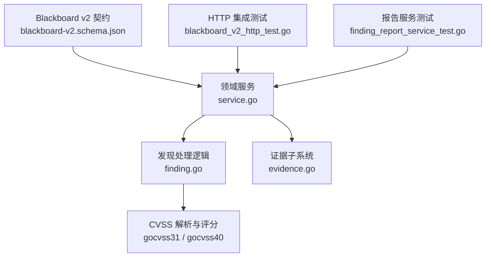
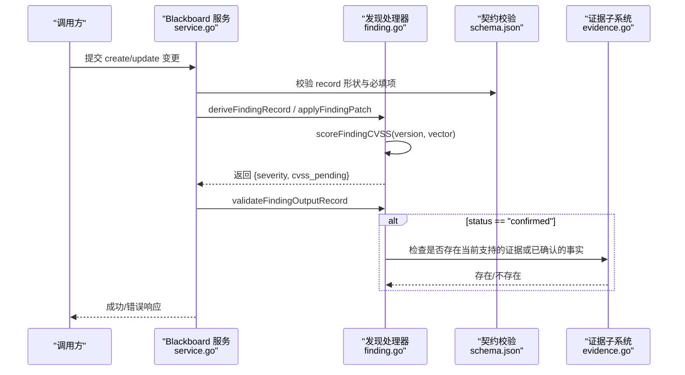
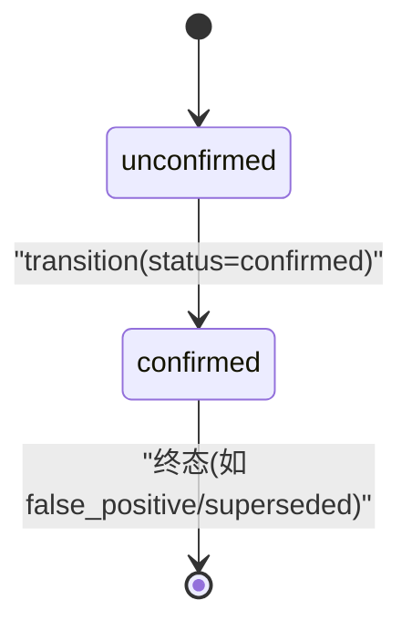
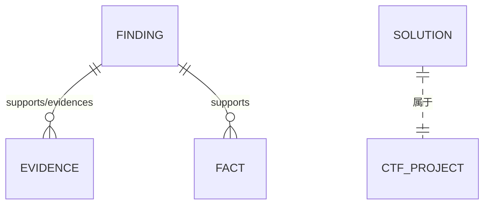
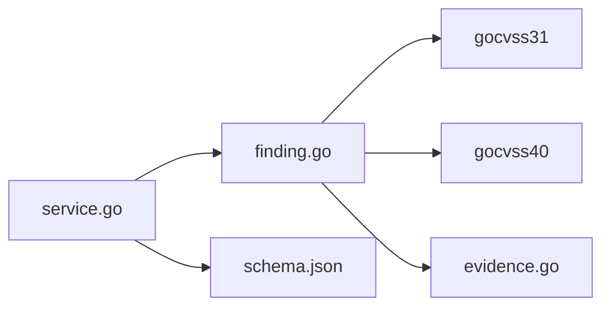

# 发现记录

<cite>
**本文引用的文件**   
- [internal/blackboardv2/finding.go](file://internal/blackboardv2/finding.go)
- [internal/blackboardv2/service.go](file://internal/blackboardv2/service.go)
- [internal/blackboardv2contract/contractdata/schemas/blackboard-v2.schema.json](file://internal/blackboardv2contract/contractdata/schemas/blackboard-v2.schema.json)
- [internal/blackboardv2/evidence.go](file://internal/blackboardv2/evidence.go)
- [internal/blackboardv2/finding_report_service_test.go](file://internal/blackboardv2/finding_report_service_test.go)
- [internal/daemon/blackboard_v2_http_test.go](file://internal/daemon/blackboard_v2_http_test.go)
</cite>

## 目录
1. [简介](#简介)
2. [项目结构](#项目结构)
3. [核心组件](#核心组件)
4. [架构总览](#架构总览)
5. [详细组件分析](#详细组件分析)
6. [依赖关系分析](#依赖关系分析)
7. [性能考虑](#性能考虑)
8. [故障排查指南](#故障排查指南)
9. [结论](#结论)
10. [附录](#附录)

## 简介
本文件聚焦于“发现记录（Finding）”的数据模型、状态与评分规则，重点说明：
- findingRecord 与 findingInputRecord 的结构差异
- CVSS 评分系统实现（支持版本 3.1 与 4.0），以及 cvss_vector 格式要求
- status 字段的状态语义与转换约束（unconfirmed 与 confirmed）
- severity 五个等级及其计算逻辑
- cvss_pending 字段的含义与作用
- 不同类型安全发现的完整 JSON 示例（SQL 注入、XSS、认证绕过等）
- 发现记录与证据（Evidence）、事实（Fact）、解决方案（Solution）之间的关联关系

## 项目结构
与“发现记录”直接相关的代码与契约定义位于以下位置：
- 领域服务与实现：internal/blackboardv2/finding.go、internal/blackboardv2/service.go
- 数据契约与校验：internal/blackboardv2contract/contractdata/schemas/blackboard-v2.schema.json
- 证据子系统（用于支撑确认态的发现）：internal/blackboardv2/evidence.go
- 行为与集成测试（含示例 payload）：internal/blackboardv2/finding_report_service_test.go、internal/daemon/blackboard_v2_http_test.go

图表来源
- [internal/blackboardv2/finding.go:1-120](file://internal/blackboardv2/finding.go#L1-L120)
- [internal/blackboardv2/service.go:296-321](file://internal/blackboardv2/service.go#L296-L321)
- [internal/blackboardv2contract/contractdata/schemas/blackboard-v2.schema.json:271-356](file://internal/blackboardv2contract/contractdata/schemas/blackboard-v2.schema.json#L271-L356)
- [internal/blackboardv2/evidence.go:1-120](file://internal/blackboardv2/evidence.go#L1-L120)
- [internal/daemon/blackboard_v2_http_test.go:1344-1353](file://internal/daemon/blackboard_v2_http_test.go#L1344-L1353)
- [internal/blackboardv2/finding_report_service_test.go:43-44](file://internal/blackboardv2/finding_report_service_test.go#L43-L44)

章节来源
- [internal/blackboardv2/finding.go:1-120](file://internal/blackboardv2/finding.go#L1-L120)
- [internal/blackboardv2/service.go:296-321](file://internal/blackboardv2/service.go#L296-L321)
- [internal/blackboardv2contract/contractdata/schemas/blackboard-v2.schema.json:271-356](file://internal/blackboardv2contract/contractdata/schemas/blackboard-v2.schema.json#L271-L356)

## 核心组件
- 输入 DTO（调用方可写）：FindingRecord
  - 包含：status、title、target、description、proof、impact、recommendation、cvss_version、cvss_vector
  - 不包含：severity、cvss_pending（由服务端推导）
- 输出记录（服务端持久化/展示）：findingOutputRecord
  - 在 FindingRecord 基础上增加：severity、cvss_pending、resolution_summary
- 更新补丁：FindingPatch（仅允许部分字段更新；生命周期变更通过 transition 操作）

关键要点
- severity 与 cvss_pending 为服务端派生字段，客户端不可写入。
- 当 cvss_version 与 cvss_vector 同时为空时，cvss_pending 为 true；否则按向量解析并计算 severity，cvss_pending 为 false。
- confirmed 状态的发现必须提供 target、proof、impact、recommendation 且 cvss_version 与 cvss_vector 必须完整有效。

章节来源
- [internal/blackboardv2/service.go:296-321](file://internal/blackboardv2/service.go#L296-L321)
- [internal/blackboardv2/finding.go:15-30](file://internal/blackboardv2/finding.go#L15-L30)
- [internal/blackboardv2/finding.go:89-108](file://internal/blackboardv2/finding.go#L89-L108)
- [internal/blackboardv2/finding.go:170-212](file://internal/blackboardv2/finding.go#L170-L212)

## 架构总览
下图展示了从创建/更新到最终输出的端到端流程，包括 CVSS 评分与状态校验。

图表来源
- [internal/blackboardv2/service.go:296-321](file://internal/blackboardv2/service.go#L296-L321)
- [internal/blackboardv2/finding.go:89-108](file://internal/blackboardv2/finding.go#L89-L108)
- [internal/blackboardv2/finding.go:170-212](file://internal/blackboardv2/finding.go#L170-L212)
- [internal/blackboardv2/evidence.go:306-346](file://internal/blackboardv2/evidence.go#L306-L346)
- [internal/blackboardv2contract/contractdata/schemas/blackboard-v2.schema.json:271-356](file://internal/blackboardv2contract/contractdata/schemas/blackboard-v2.schema.json#L271-L356)

## 详细组件分析

### 数据结构与差异：findingRecord vs findingInputRecord
- 输入侧（调用方可写）
  - 使用 FindingRecord（不含 severity、cvss_pending）
  - 在 schema 中对应 findingInputRecord（用于 create 场景的 record 类型）
- 输出侧（服务端持久化/读取）
  - 使用 findingOutputRecord（包含 severity、cvss_pending、resolution_summary）
  - 在 schema 中对应 findingRecord（用于 update 与历史记录的 record 类型）

差异总结
- 输入 DTO 不允许客户端设置 severity 与 cvss_pending，这两个字段在服务端根据 cvss_version 与 cvss_vector 自动推导。
- 输出记录暴露 severity 与 cvss_pending，供前端与下游消费。

章节来源
- [internal/blackboardv2/service.go:296-321](file://internal/blackboardv2/service.go#L296-L321)
- [internal/blackboardv2/finding.go:15-30](file://internal/blackboardv2/finding.go#L15-L30)
- [internal/blackboardv2contract/contractdata/schemas/blackboard-v2.schema.json:271-356](file://internal/blackboardv2contract/contractdata/schemas/blackboard-v2.schema.json#L271-L356)
- [internal/blackboardv2contract/contractdata/schemas/blackboard-v2.schema.json:1960-2006](file://internal/blackboardv2contract/contractdata/schemas/blackboard-v2.schema.json#L1960-L2006)

### CVSS 评分系统与 cvss_vector 格式
- 支持版本
  - 3.1：使用 gocvss31 解析向量，基于 EnvironmentalScore 计算严重性
  - 4.0：使用 gocvss40 解析向量，基于 Score 计算严重性
- 版本与向量必须成对出现或同时清空；任一缺失将触发语义校验错误
- cvss_vector 不能包含首尾空白字符
- 严重性等级（小写字符串）：none、low、medium、high、critical
- cvss_pending 布尔值
  - 当 version 与 vector 均为空时为 true（表示待处理）
  - 否则为 false（表示已可计算）

```mermaid
flowchart TD
Start(["进入评分"]) --> CheckEmpty["是否同时为空?"]
CheckEmpty --> |是| SetPending["cvss_pending=true<br/>severity=空"] --> End(["结束"])
CheckEmpty --> |否| CheckPair["是否成对提供?"]
CheckPair --> |否| ErrPair["错误: 必须同时提供或清空"] --> End
CheckPair --> |是| Trim["去除首尾空白"]
Trim --> Parse{"版本?"}
Parse --> |4.0| P4["解析 CVSS v4.0 向量"]
Parse --> |3.1| P3["解析 CVSS v3.1 向量"]
Parse --> |其他| ErrVer["错误: 仅支持 3.1 或 4.0"] --> End
P4 --> R4["计算分数 -> 映射严重性"] --> Done["cvss_pending=false<br/>severity=等级"] --> End
P3 --> R3["计算环境分数 -> 映射严重性"] --> Done
ErrVer --> End
```

图表来源
- [internal/blackboardv2/finding.go:214-248](file://internal/blackboardv2/finding.go#L214-L248)

章节来源
- [internal/blackboardv2/finding.go:214-248](file://internal/blackboardv2/finding.go#L214-L248)
- [internal/blackboardv2contract/contractdata/schemas/blackboard-v2.schema.json:237-247](file://internal/blackboardv2contract/contractdata/schemas/blackboard-v2.schema.json#L237-L247)
- [internal/blackboardv2contract/contractdata/schemas/blackboard-v2.schema.json:667-688](file://internal/blackboardv2contract/contractdata/schemas/blackboard-v2.schema.json#L667-L688)

### 状态字段 status 与业务规则
- 允许值
  - 创建/更新输入：unconfirmed、confirmed
  - 内部验证允许更多终态（如 false_positive、superseded），但对外写入仅限上述两种
- 业务规则
  - confirmed 状态必须满足：
    - 提供 target、proof、impact、recommendation
    - cvss_version 与 cvss_vector 必须完整有效（即 cvss_pending 为 false）
  - 未提供 CVSS 信息时，cvss_pending 为 true，此时无法进入 confirmed 状态
- 状态转换
  - 通过 transition 操作进行状态切换（例如从 unconfirmed 转为 confirmed）
  - 转换时需再次执行所有校验（包括 CVSS 完整性与内容完整性）

图表来源
- [internal/blackboardv2/finding.go:89-108](file://internal/blackboardv2/finding.go#L89-L108)
- [internal/blackboardv2/finding.go:170-212](file://internal/blackboardv2/finding.go#L170-L212)

章节来源
- [internal/blackboardv2/finding.go:89-108](file://internal/blackboardv2/finding.go#L89-L108)
- [internal/blackboardv2/finding.go:170-212](file://internal/blackboardv2/finding.go#L170-L212)

### severity 等级与计算逻辑
- 等级集合：none、low、medium、high、critical（小写）
- 计算来源
  - CVSS v4.0：Score -> Rating
  - CVSS v3.1：EnvironmentalScore -> Rating
- 若未提供 CVSS 信息，则 severity 为空，cvss_pending 为 true

章节来源
- [internal/blackboardv2/finding.go:214-248](file://internal/blackboardv2/finding.go#L214-L248)
- [internal/blackboardv2contract/contractdata/schemas/blackboard-v2.schema.json:677-684](file://internal/blackboardv2contract/contractdata/schemas/blackboard-v2.schema.json#L677-L684)

### cvss_pending 字段的作用
- 语义：标记当前发现是否“等待 CVSS 评分完成”
- 触发条件：cvss_version 与 cvss_vector 同时为空
- 影响：
  - 处于 cvss_pending=true 时，无法进入 confirmed 状态
  - 一旦提供完整有效的向量，cvss_pending 变为 false，severity 被填充

章节来源
- [internal/blackboardv2/finding.go:214-248](file://internal/blackboardv2/finding.go#L214-L248)
- [internal/blackboardv2/finding.go:170-212](file://internal/blackboardv2/finding.go#L170-L212)

### 发现记录与证据、解决方案的关联
- 证据（Evidence）
  - 通过 supports/evidences 关系指向发现，作为确认态的证据基础
  - 证据需为 available 状态才被视为有效支撑
- 事实（Fact）
  - 通过 supports 关系指向发现，且事实的 confidence 为 confirmed 时可作为支撑
- 解决方案（Solution）
  - 与发现无直接强制关联，但在 CTF 场景中用于记录答案/标志/程序
  - 健康诊断会关注“缺少证据导致确认态发现缺乏支撑”的情况

图表来源
- [internal/blackboardv2/finding.go:306-346](file://internal/blackboardv2/finding.go#L306-L346)
- [internal/blackboardv2/evidence.go:61-75](file://internal/blackboardv2/evidence.go#L61-L75)

章节来源
- [internal/blackboardv2/finding.go:306-346](file://internal/blackboardv2/finding.go#L306-L346)
- [internal/blackboardv2/evidence.go:61-75](file://internal/blackboardv2/evidence.go#L61-L75)

### 完整 JSON 示例（不同发现类型）
以下为符合契约与校验规则的示例片段（路径引用，不直接粘贴内容）：
- SQL 注入（CVSS v4.0，高严重性）
  - 参考：[internal/blackboardv2/finding_report_service_test.go:43-44](file://internal/blackboardv2/finding_report_service_test.go#L43-L44)
- 认证绕过（CVSS v4.0，高严重性）
  - 参考：[internal/blackboardv2/projection_service_test.go:548](file://internal/blackboardv2/projection_service_test.go#L548)
- 信息泄露（无需 CVSS，cvss_pending=true）
  - 参考：[internal/blackboardv2/finding_report_service_test.go:44](file://internal/blackboardv2/finding_report_service_test.go#L44)
- HTTP 集成测试中的批量创建（含 SQL 注入与冗长错误信息）
  - 参考：[internal/daemon/blackboard_v2_http_test.go:1344-1353](file://internal/daemon/blackboard_v2_http_test.go#L1344-L1353)

注意
- 对于 confirmed 状态的发现，必须提供 target、proof、impact、recommendation 与完整的 cvss_version/cvss_vector。
- 对于未提供 CVSS 信息的发现，cvss_pending 将为 true，且不能处于 confirmed 状态。

章节来源
- [internal/blackboardv2/finding_report_service_test.go:43-44](file://internal/blackboardv2/finding_report_service_test.go#L43-L44)
- [internal/daemon/blackboard_v2_http_test.go:1344-1353](file://internal/daemon/blackboard_v2_http_test.go#L1344-L1353)
- [internal/blackboardv2/projection_service_test.go:548](file://internal/blackboardv2/projection_service_test.go#L548)

## 依赖关系分析
- 外部库
  - gocvss31：解析 CVSS v3.1 向量与环境分数
  - gocvss40：解析 CVSS v4.0 向量与分数
- 内部模块
  - service.go：对外 DTO 与通用 Record 转换
  - finding.go：发现创建/更新/校验/CVSS 评分/支撑关系检查
  - evidence.go：证据保留与可用性判定
  - schema.json：字段枚举、必填项与条件约束

图表来源
- [internal/blackboardv2/service.go:296-321](file://internal/blackboardv2/service.go#L296-L321)
- [internal/blackboardv2/finding.go:1-120](file://internal/blackboardv2/finding.go#L1-L120)
- [internal/blackboardv2/evidence.go:1-120](file://internal/blackboardv2/evidence.go#L1-L120)
- [internal/blackboardv2contract/contractdata/schemas/blackboard-v2.schema.json:271-356](file://internal/blackboardv2contract/contractdata/schemas/blackboard-v2.schema.json#L271-L356)

章节来源
- [internal/blackboardv2/service.go:296-321](file://internal/blackboardv2/service.go#L296-L321)
- [internal/blackboardv2/finding.go:1-120](file://internal/blackboardv2/finding.go#L1-L120)
- [internal/blackboardv2/evidence.go:1-120](file://internal/blackboardv2/evidence.go#L1-L120)
- [internal/blackboardv2contract/contractdata/schemas/blackboard-v2.schema.json:271-356](file://internal/blackboardv2contract/contractdata/schemas/blackboard-v2.schema.json#L271-L356)

## 性能考虑
- CVSS 解析与评分为轻量计算，开销主要来自 JSON 编解码与数据库读写
- 建议在批量创建/更新中发现记录时合并变更批次，减少多次往返
- 避免频繁切换 CVSS 版本或向量，以减少重复解析

## 故障排查指南
常见错误与定位
- 语义校验错误（semantic_validation）
  - 可能原因：status 非法、CVSS 字段不完整、confirmed 状态缺少必要字段、cvss_vector 包含空白
  - 定位：查看错误消息中的 path 字段（如 .record.cvss_vector）
- 键冲突（key_conflict）
  - 可能原因：Key 已存在或在历史中使用过
- 证据缺失
  - 现象：confirmed 发现无当前可用证据或已确认事实支撑
  - 定位：检查 relationships 中是否存在 supports/evidences 指向该发现，且证据状态为 available

章节来源
- [internal/blackboardv2/finding.go:170-212](file://internal/blackboardv2/finding.go#L170-L212)
- [internal/blackboardv2/finding.go:306-346](file://internal/blackboardv2/finding.go#L306-L346)

## 结论
- 发现记录采用“输入 DTO + 输出记录”的双层设计，确保服务端对 severity 与 cvss_pending 的权威推导
- CVSS 支持 3.1 与 4.0，向量必须完整有效；cvss_pending 明确表达“待评分”状态
- confirmed 状态需要充分的内容与证据支撑，保障发现的可审计性与可追溯性
- 通过关系图将发现与证据、事实紧密耦合，形成闭环的安全知识图谱

## 附录
- 相关 API 与测试用例可作为最佳实践参考，帮助快速构造正确的请求体与理解边界条件