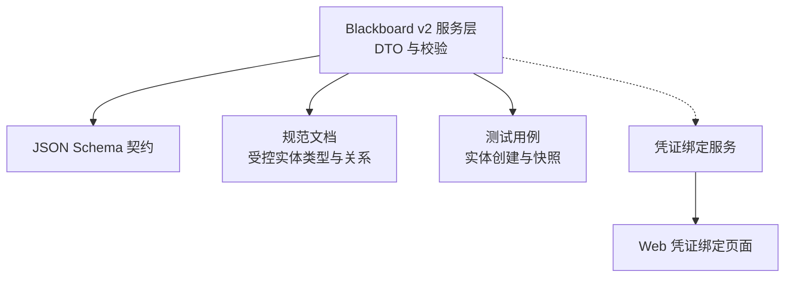
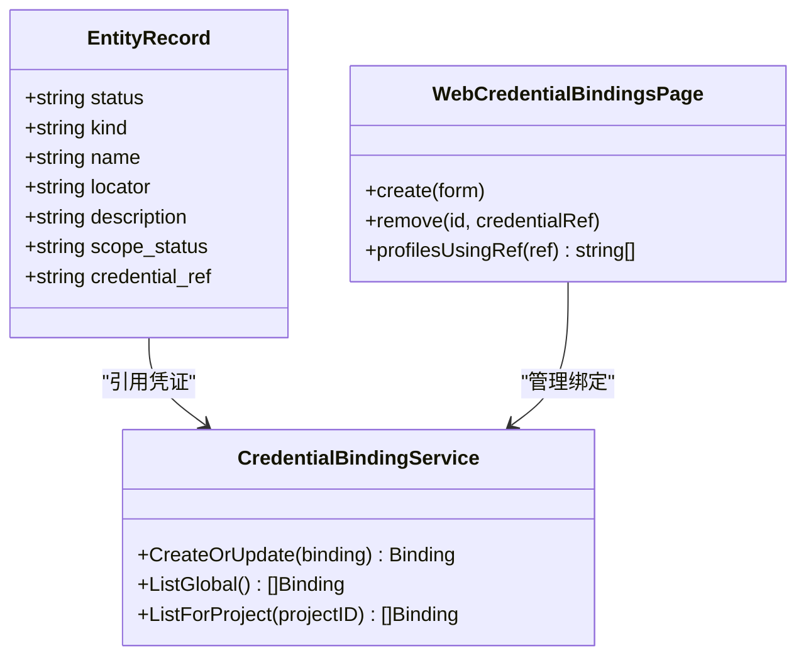
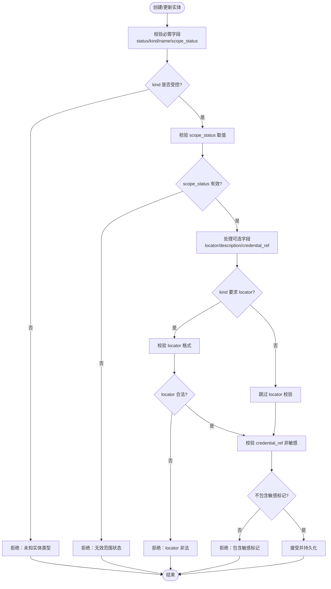
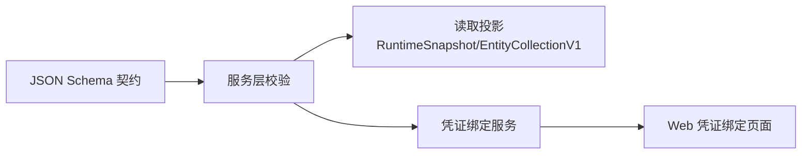

# 实体记录 (Entity Record)

<cite>
**本文引用的文件**
- [service.go](file://internal/blackboardv2/service.go)
- [blackboard-v2.schema.json](file://internal/blackboardv2contract/contractdata/schemas/blackboard-v2.schema.json)
- [blackboard-graph-contract.md](file://docs/specs/blackboard-graph-contract.md)
- [entity_service_test.go](file://internal/blackboardv2/entity_service_test.go)
- [credential.go](file://internal/credential/credential.go)
- [CredentialBindingsPage.tsx](file://web/src/pages/CredentialBindingsPage.tsx)
</cite>

## 目录
1. [简介](#简介)
2. [项目结构](#项目结构)
3. [核心组件](#核心组件)
4. [架构总览](#架构总览)
5. [详细组件分析](#详细组件分析)
6. [依赖分析](#依赖分析)
7. [性能考虑](#性能考虑)
8. [故障排查指南](#故障排查指南)
9. [结论](#结论)
10. [附录](#附录)

## 简介
本文件面向 CyberPenda Blackboard v2 的“实体记录（Entity Record）”，系统性说明其完整数据结构、字段含义与约束，解释实体的业务语义（表示被测试的目标系统、组件或服务），并重点阐述范围控制字段 scope_status 的三种状态及其使用场景。同时给出不同实体类型的 JSON 示例路径，以及实体与范围控制的关联方式，和 credential_ref 在凭证绑定中的作用。

## 项目结构
围绕实体记录的关键实现与契约分布在以下位置：
- Go 服务层 DTO 定义与校验逻辑
- Blackboard v2 JSON Schema 契约
- 规范文档对受控实体类型与边关系的约定
- 测试用例中的实体创建与快照输出
- 凭证绑定存储与服务接口
- Web 前端凭证绑定页面

图表来源
- [service.go:234-253](file://internal/blackboardv2/service.go#L234-L253)
- [blackboard-v2.schema.json:101-133](file://internal/blackboardv2contract/contractdata/schemas/blackboard-v2.schema.json#L101-L133)
- [blackboard-graph-contract.md:192-207](file://docs/specs/blackboard-graph-contract.md#L192-L207)
- [entity_service_test.go:17-100](file://internal/blackboardv2/entity_service_test.go#L17-L100)
- [credential.go:166-193](file://internal/credential/credential.go#L166-L193)
- [CredentialBindingsPage.tsx:76-127](file://web/src/pages/CredentialBindingsPage.tsx#L76-L127)

章节来源
- [service.go:234-253](file://internal/blackboardv2/service.go#L234-L253)
- [blackboard-v2.schema.json:101-133](file://internal/blackboardv2contract/contractdata/schemas/blackboard-v2.schema.json#L101-L133)
- [blackboard-graph-contract.md:192-207](file://docs/specs/blackboard-graph-contract.md#L192-L207)
- [entity_service_test.go:17-100](file://internal/blackboardv2/entity_service_test.go#L17-L100)
- [credential.go:166-193](file://internal/credential/credential.go#L166-L193)
- [CredentialBindingsPage.tsx:76-127](file://web/src/pages/CredentialBindingsPage.tsx#L76-L127)

## 核心组件
- EntityRecord 是 Blackboard v2 中描述“实体”的完整数据对象，包含必需字段 status、kind、name、scope_status，以及可选字段 locator、description、credential_ref。
- 该结构在服务层以 Go struct 形式定义，并通过 JSON Schema 进行契约约束；同时在规范文档中对受控实体类型（如 host、endpoint、application、data_store 等）进行了明确定义。
- 范围控制通过 scope_status 表达，用于指示实体是否处于渗透测试范围内，且该字段仅影响可见性与过滤，不授予任何权限。
- credential_ref 用于指向受管凭证的非敏感引用，禁止直接写入明文凭证值。

章节来源
- [service.go:234-253](file://internal/blackboardv2/service.go#L234-L253)
- [blackboard-v2.schema.json:101-133](file://internal/blackboardv2contract/contractdata/schemas/blackboard-v2.schema.json#L101-L133)
- [blackboard-graph-contract.md:192-207](file://docs/specs/blackboard-graph-contract.md#L192-L207)

## 架构总览
实体记录在整个系统中的角色如下：
- 作为知识平面（Blackboard v2）的核心节点类型之一，实体用于标识“关于什么”的工作或知识。
- 通过 about/part_of/tests/produced/evidences/supports/contradicts/derived_from/depends_on/satisfies/supersedes 等关系与其他记录建立语义连接。
- 范围控制（scope_status）贯穿实体与事实等记录，用于在读取投影与 UI 展示中进行筛选与标注。
- 凭证引用（credential_ref）与凭证绑定服务协作，提供非敏感引用，避免将机密值写入图数据库。

图表来源
- [service.go:234-253](file://internal/blackboardv2/service.go#L234-L253)
- [credential.go:166-193](file://internal/credential/credential.go#L166-L193)
- [CredentialBindingsPage.tsx:76-127](file://web/src/pages/CredentialBindingsPage.tsx#L76-L127)

## 详细组件分析

### 实体记录结构与字段约束
- 必需字段
  - status：当前生命周期状态，默认 active，允许 active、retired、superseded。
  - kind：受控实体类型，来自规范文档的受控词汇表（例如 network、host、ip_address、domain、service、endpoint、application、identity、credential、data_store、file、binary、function、challenge_component）。
  - name：人类可读的名称。
  - scope_status：范围状态，取值为 in_scope、unknown、out_of_scope。
- 可选字段
  - locator：按 kind 约定的非秘密定位符（如 URL、主机名、端口协议、路径等）。
  - description：简洁的描述性上下文。
  - credential_ref：仅适用于凭证相关实体，必须为非敏感引用，禁止包含明文凭证值。

图表来源
- [service.go:234-253](file://internal/blackboardv2/service.go#L234-L253)
- [blackboard-v2.schema.json:101-133](file://internal/blackboardv2contract/contractdata/schemas/blackboard-v2.schema.json#L101-L133)
- [blackboard-graph-contract.md:192-207](file://docs/specs/blackboard-graph-contract.md#L192-L207)
- [service.go:4514-4532](file://internal/blackboardv2/service.go#L4514-L4532)

章节来源
- [service.go:234-253](file://internal/blackboardv2/service.go#L234-L253)
- [blackboard-v2.schema.json:101-133](file://internal/blackboardv2contract/contractdata/schemas/blackboard-v2.schema.json#L101-L133)
- [blackboard-graph-contract.md:192-207](file://docs/specs/blackboard-graph-contract.md#L192-L207)
- [service.go:4514-4532](file://internal/blackboardv2/service.go#L4514-L4532)

### 实体的业务含义与受控类型
- 业务含义：实体表示被测试的目标系统、组件或服务，是 Blackboard 中“关于什么”的核心锚点。
- 受控类型与典型用途：
  - network：网络或子网
  - host：机器或设备
  - ip_address：独立于主机的地址身份
  - domain：域名或子域
  - service：监听或远程服务
  - endpoint：可调用应用入口点（URL、路由、RPC 方法等）
  - application：Web 应用、API、守护进程或已部署应用
  - identity：用户、角色、服务账户或主体
  - credential：指向受管认证材料的指针（需 credential_ref）
  - data_store：数据库、桶、队列或数据存储
  - file/binary/function/challenge_component：代码、二进制、函数符号或 CTF 特定对象

章节来源
- [blackboard-graph-contract.md:376-413](file://docs/specs/blackboard-graph-contract.md#L376-L413)

### 范围控制（scope_status）的含义与使用场景
- 取值与含义：
  - in_scope：处于渗透测试范围内，通常会被扫描、探测与验证。
  - unknown：范围尚未确定，需要进一步确认。
  - out_of_scope：不在测试范围内，应避免访问或操作。
- 使用场景：
  - 在实体列表与详情视图中根据 scope_status 进行过滤与高亮显示。
  - 在运行时快照与读取投影中保留 scope_status，以便上层工具与 UI 正确呈现。
  - 注意：scope_status 仅影响可见性与过滤，不会授予任何授权或访问权限。

章节来源
- [blackboard-graph-contract.md:192-207](file://docs/specs/blackboard-graph-contract.md#L192-L207)
- [service.go:4468](file://internal/blackboardv2/service.go#L4468)

### 凭证引用（credential_ref）的作用与约束
- 作用：为凭证类实体提供非敏感引用，指向受管凭证存储中的条目，避免在图数据库中写入明文凭证。
- 约束：
  - 禁止包含敏感标记（如 password=、token=、secret=、api_key=、apikey=、sk- 等）。
  - 仅在 kind 为 credential 时强制要求存在，其他 kind 可为空。
- 与凭证绑定的关系：
  - 凭证绑定服务负责维护全局或项目范围的凭证映射（credential_ref -> source）。
  - Web 前端提供凭证绑定页面的创建、删除与查看功能，便于操作员管理。

章节来源
- [service.go:4514-4532](file://internal/blackboardv2/service.go#L4514-L4532)
- [credential.go:166-193](file://internal/credential/credential.go#L166-L193)
- [CredentialBindingsPage.tsx:76-127](file://web/src/pages/CredentialBindingsPage.tsx#L76-L127)

### 实体与范围控制的关系
- 实体 scope_status 与项目范围（Project Scope）相互独立：
  - 项目范围由 domains/excluded 等配置决定，用于指导任务启动与资源发现。
  - 实体 scope_status 是对具体实体的显式范围标注，用于读取投影与 UI 展示。
- 测试用例表明：修改实体 scope_status 不会影响项目的权威 Scope 配置。

章节来源
- [entity_service_test.go:17-100](file://internal/blackboardv2/entity_service_test.go#L17-L100)

### 完整的 JSON 示例（不同类型实体）
以下为不同类型实体的 JSON 示例路径（请参见对应测试与快照断言）：
- Web 应用（application）
  - 参考路径：[entity_service_test.go:17-100](file://internal/blackboardv2/entity_service_test.go#L17-L100)
- API 服务（endpoint）
  - 参考路径：[entity_service_test.go:17-100](file://internal/blackboardv2/entity_service_test.go#L17-L100)
- 数据库/数据存储（data_store）
  - 参考路径：[blackboard-graph-contract.md:376-413](file://docs/specs/blackboard-graph-contract.md#L376-L413)
- 主机（host）
  - 参考路径：[entity_service_test.go:17-100](file://internal/blackboardv2/entity_service_test.go#L17-L100)
- 凭证（credential）
  - 参考路径：[blackboard-graph-contract.md:376-413](file://docs/specs/blackboard-graph-contract.md#L376-L413)

说明：
- 上述示例均遵循 entityRecord 的 JSON Schema 契约，包含必需字段与可选字段的组合。
- 对于凭证实体，应确保 credential_ref 为非敏感引用，且不包含敏感标记。

章节来源
- [entity_service_test.go:17-100](file://internal/blackboardv2/entity_service_test.go#L17-L100)
- [blackboard-v2.schema.json:101-133](file://internal/blackboardv2contract/contractdata/schemas/blackboard-v2.schema.json#L101-L133)
- [blackboard-graph-contract.md:376-413](file://docs/specs/blackboard-graph-contract.md#L376-L413)

## 依赖分析
- 实体记录依赖 JSON Schema 契约进行输入校验与序列化一致性保障。
- 实体记录与凭证绑定服务存在间接依赖：实体通过 credential_ref 引用凭证，而凭证的实际值由外部绑定服务管理。
- 实体记录与读取投影（RuntimeSnapshot、EntityCollectionV1）紧密耦合，scope_status 直接影响展示与过滤。

图表来源
- [blackboard-v2.schema.json:101-133](file://internal/blackboardv2contract/contractdata/schemas/blackboard-v2.schema.json#L101-L133)
- [service.go:234-253](file://internal/blackboardv2/service.go#L234-L253)
- [credential.go:166-193](file://internal/credential/credential.go#L166-L193)
- [CredentialBindingsPage.tsx:76-127](file://web/src/pages/CredentialBindingsPage.tsx#L76-L127)

章节来源
- [blackboard-v2.schema.json:101-133](file://internal/blackboardv2contract/contractdata/schemas/blackboard-v2.schema.json#L101-L133)
- [service.go:234-253](file://internal/blackboardv2/service.go#L234-L253)
- [credential.go:166-193](file://internal/credential/credential.go#L166-L193)
- [CredentialBindingsPage.tsx:76-127](file://web/src/pages/CredentialBindingsPage.tsx#L76-L127)

## 性能考虑
- 实体记录的校验与持久化属于轻量级操作，主要开销在于 JSON 解析与数据库写入。
- 读取投影（如 RuntimeSnapshot）会聚合实体与关系信息，建议在批量查询与分页场景下合理使用 limit/cursor 参数，避免一次性加载过多数据。
- 凭证绑定服务仅返回引用而非明文值，减少敏感数据传输与内存占用。

## 故障排查指南
- 常见错误与原因：
  - 缺少必需字段：status、kind、name、scope_status 未提供或为空。
  - 未知实体类型：kind 不在受控词汇表中。
  - 无效范围状态：scope_status 不是 in_scope、unknown、out_of_scope 之一。
  - locator 非法：当 kind 要求 locator 时，格式不符合约定。
  - credential_ref 包含敏感标记：包含 password=、token=、secret=、api_key=、apikey=、sk- 等。
- 建议排查步骤：
  - 对照 JSON Schema 契约检查必填字段与枚举值。
  - 检查 kind 是否为受控类型，并根据 kind 规则填写 locator。
  - 审查 credential_ref 是否仅为非敏感引用。
  - 查看读取投影输出，确认 scope_status 是否正确反映在 UI 与快照中。

章节来源
- [service.go:4468](file://internal/blackboardv2/service.go#L4468)
- [service.go:4514-4532](file://internal/blackboardv2/service.go#L4514-L4532)
- [blackboard-v2.schema.json:101-133](file://internal/blackboardv2contract/contractdata/schemas/blackboard-v2.schema.json#L101-L133)

## 结论
实体记录是 CyberPenda Blackboard v2 的核心知识节点，用于标识被测试的目标系统、组件或服务。其结构清晰、约束严格，配合受控实体类型与范围控制，能够有效支撑渗透测试过程中的目标建模与可视化。凭证引用机制在保证安全的前提下，实现了与凭证绑定服务的解耦。通过遵循契约与最佳实践，可以确保实体数据的准确性、一致性与安全性。

## 附录
- 实体生命周期转换：active -> retired|superseded；retired -> active|superseded；superseded 为终态，且需要有活跃的 supersedes 边指向。
- 实体关系矩阵：about、part_of、tests、produced、evidences、supports、contradicts、derived_from、depends_on、satisfies、supersedes 等关系定义了实体与其他记录之间的语义连接。

章节来源
- [blackboard-graph-contract.md:192-207](file://docs/specs/blackboard-graph-contract.md#L192-L207)
- [blackboard-graph-contract.md:414-442](file://docs/specs/blackboard-graph-contract.md#L414-L442)