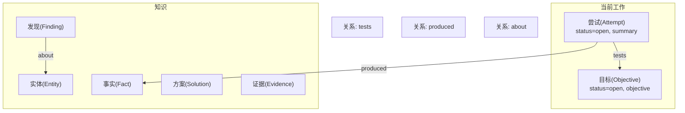
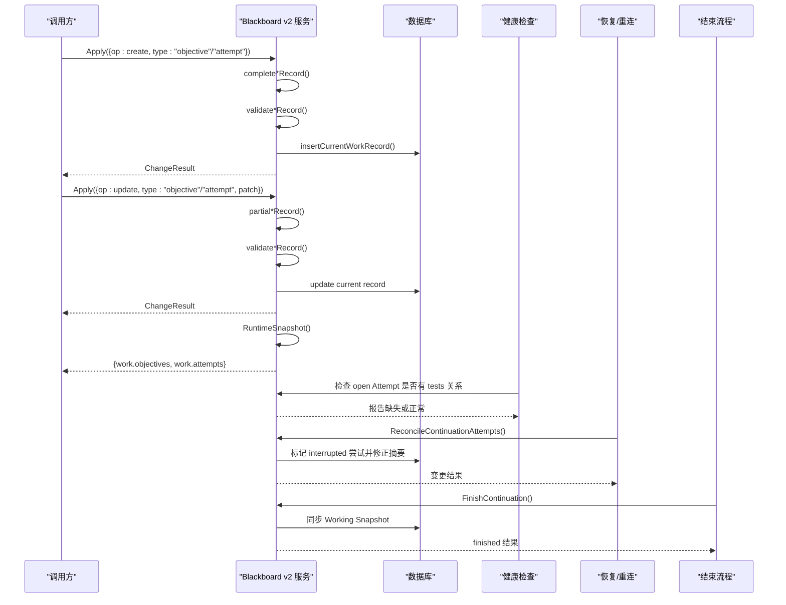
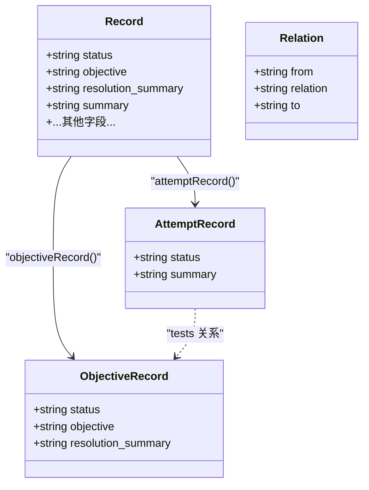
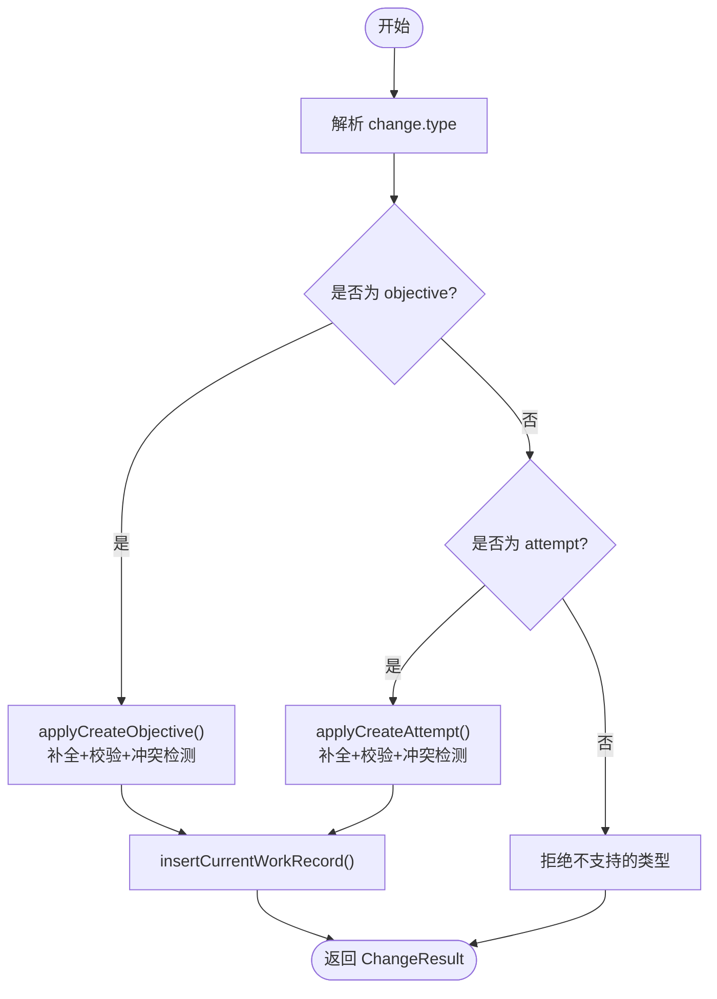
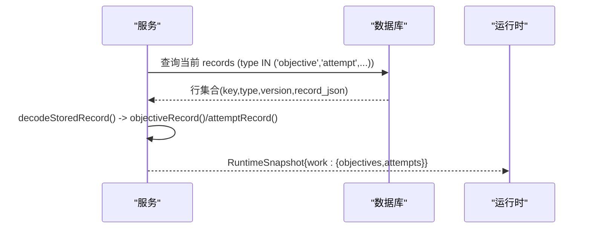
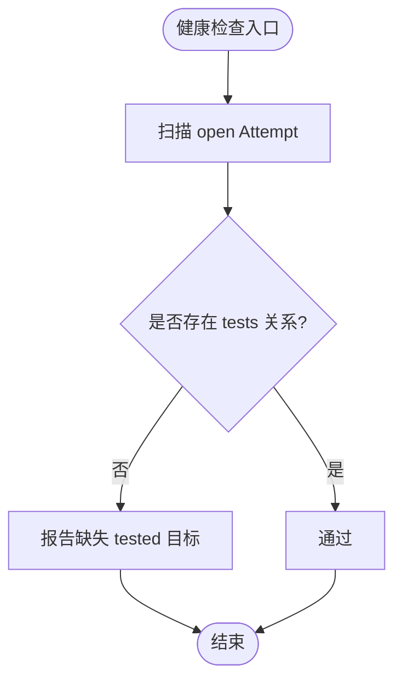
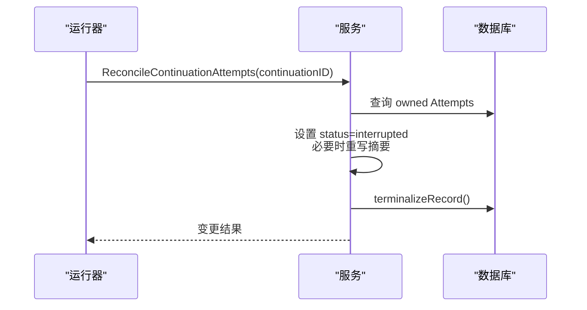
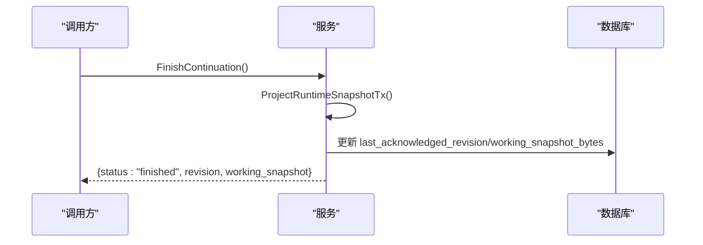
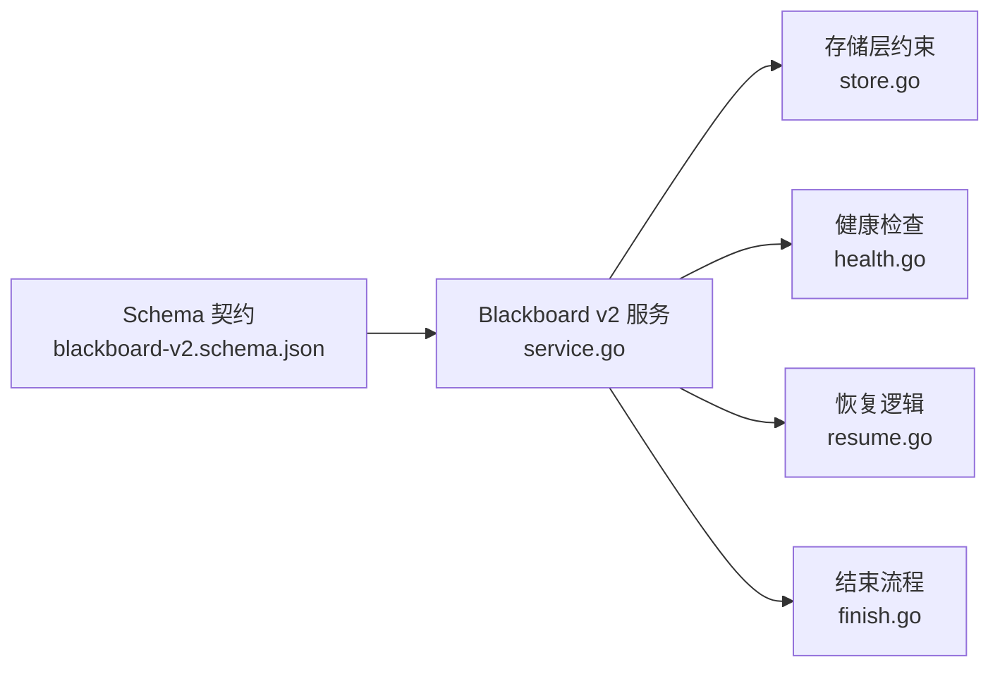

# 目标与尝试记录

<cite>
**本文引用的文件**   
- [service.go](file://internal/blackboardv2/service.go)
- [objective_attempt_service_test.go](file://internal/blackboardv2/objective_attempt_service_test.go)
- [health.go](file://internal/blackboardv2/health.go)
- [resume.go](file://internal/blackboardv2/resume.go)
- [finish.go](file://internal/blackboardv2/finish.go)
- [blackboard-v2.schema.json](file://internal/blackboardv2contract/contractdata/schemas/blackboard-v2.schema.json)
- [store.go](file://internal/store/store.go)
</cite>

## 目录
1. [简介](#简介)
2. [项目结构](#项目结构)
3. [核心组件](#核心组件)
4. [架构总览](#架构总览)
5. [详细组件分析](#详细组件分析)
6. [依赖分析](#依赖分析)
7. [性能考虑](#性能考虑)
8. [故障排查指南](#故障排查指南)
9. [结论](#结论)
10. [附录](#附录)

## 简介
本文件聚焦于 Blackboard v2 语义系统中的“目标（Objective）”和“尝试（Attempt）”两类工作记录，系统性地说明其数据结构、约束规则、业务用途、相互关系以及在任务编排与运行时集成中的作用。目标是渗透测试的整体意图描述；尝试是对目标的单次具体执行或探索步骤。一个目标可包含多个尝试，通过“tests”关系建立关联。两者在创建时状态固定为 open，并在生命周期内通过补丁更新摘要或目标文本，最终由运行环境或协调流程完成收尾。

## 项目结构
Blackboard v2 将“当前工作（work）”与“知识（knowledge）”分离：
- 当前工作：open 状态的 objective 与 attempt 构成“活跃工作集”，用于驱动运行时与 UI 展示。
- 知识：entity/fact/finding/solution/evidence 等记录，承载事实、发现与证据。
- 关系：如 tests、produced、about 等，连接不同实体与记录，形成可审计的语义图。

[此图为概念性结构示意，不直接映射到具体源码文件]

## 核心组件
本节定义 ObjectiveRecord 与 AttemptRecord 的结构差异与约束，并解释其在语义层的作用。

- ObjectiveRecord（目标记录）
  - 字段
    - status: 固定为 open（创建时校验）
    - objective: 必填，语义文本，长度限制
    - resolution_summary: 可选，仅允许在终止态使用；open 状态下禁止填写
  - 用途
    - 表达一次渗透测试的整体目标或子目标
    - 作为“tests”关系的右侧目标端点
- AttemptRecord（尝试记录）
  - 字段
    - status: 固定为 open（创建时校验）
    - summary: 必填，语义文本，长度限制
  - 用途
    - 记录对某个目标的一次具体尝试或操作步骤
    - 作为“tests”关系的左侧来源端点，并可“produced”产出事实

关键约束与校验要点：
- 创建时强制 status=open
- open 的目标不允许携带 resolution_summary
- 语义文本需满足 UTF-8 与字节长度上限
- Key 必须可读 ASCII 且不超过长度上限

**章节来源**
- [service.go:256-271](file://internal/blackboardv2/service.go#L256-L271)
- [service.go:4534-4549](file://internal/blackboardv2/service.go#L4534-L4549)
- [service.go:4611-4616](file://internal/blackboardv2/service.go#L4611-L4616)
- [service.go:4618-4628](file://internal/blackboardv2/service.go#L4618-L4628)

## 架构总览
目标与尝试在 Blackboard v2 中的处理路径如下：
- 变更批 Apply：解析 change.type 为 objective/attempt，走 create/update/transition 分支
- 记录补全与校验：complete*Record + validate*Record
- 写入当前工作表：insertCurrentWorkRecord
- 快照投影：RuntimeSnapshot 聚合 objectives/attempts 到 work 域
- 健康检查：检测 open 尝试是否缺少 tests 关系
- 恢复与终态：中断恢复、清理未闭合尝试、Finish 同步 Working Snapshot

**图表来源**
- [service.go:1400-1522](file://internal/blackboardv2/service.go#L1400-L1522)
- [service.go:1603-1661](file://internal/blackboardv2/service.go#L1603-L1661)
- [service.go:753-802](file://internal/blackboardv2/service.go#L753-L802)
- [finish.go:171-198](file://internal/blackboardv2/finish.go#L171-L198)
- [health.go:229-232](file://internal/blackboardv2/health.go#L229-L232)

**章节来源**
- [service.go:1400-1522](file://internal/blackboardv2/service.go#L1400-L1522)
- [service.go:1603-1661](file://internal/blackboardv2/service.go#L1603-L1661)
- [service.go:753-802](file://internal/blackboardv2/service.go#L753-L802)
- [finish.go:171-198](file://internal/blackboardv2/finish.go#L171-L198)
- [health.go:229-232](file://internal/blackboardv2/health.go#L229-L232)

## 详细组件分析

### 数据模型与关系
- ObjectiveRecord 与 AttemptRecord 是“当前工作”的核心 DTO，分别承载整体目标与具体尝试。
- 二者通过关系“tests”建立一对多关系：一个目标可被多个尝试测试。
- 关系类型在存储层受 CHECK 约束，确保语义一致性。

**图表来源**
- [service.go:256-271](file://internal/blackboardv2/service.go#L256-L271)
- [service.go:4727-4733](file://internal/blackboardv2/service.go#L4727-L4733)
- [store.go:1326-1337](file://internal/store/store.go#L1326-L1337)

**章节来源**
- [service.go:256-271](file://internal/blackboardv2/service.go#L256-L271)
- [service.go:4727-4733](file://internal/blackboardv2/service.go#L4727-L4733)
- [store.go:1326-1337](file://internal/store/store.go#L1326-L1337)

### 创建与更新流程
- 创建：type=objective/attempt 进入 applyCreateObjective/applyCreateAttempt，进行 key 校验、记录补全、语义校验、冲突检测后写入。
- 更新：支持部分补丁（Patch），只允许更新允许字段，禁止传入完整记录对象。
- 版本控制：每次变更递增 revision，返回变更后的 version 元组。

**图表来源**
- [service.go:1603-1661](file://internal/blackboardv2/service.go#L1603-L1661)
- [service.go:1663-1680](file://internal/blackboardv2/service.go#L1663-L1680)

**章节来源**
- [service.go:1603-1661](file://internal/blackboardv2/service.go#L1603-L1661)
- [service.go:1663-1680](file://internal/blackboardv2/service.go#L1663-L1680)

### 运行时快照与工作域
- RuntimeSnapshot 将当前所有 objective/attempt 投影到 work.objectives/work.attempts，供运行时消费。
- 快照中仅包含必要字段：version/status/objective/summary，保持最小化与确定性。

**图表来源**
- [service.go:1400-1522](file://internal/blackboardv2/service.go#L1400-L1522)

**章节来源**
- [service.go:1400-1522](file://internal/blackboardv2/service.go#L1400-L1522)

### 健康检查与完整性
- 健康检查会扫描 open 状态的尝试，若缺少 tests 关系则报告问题，提示修复。
- 该机制保障“每个尝试都明确测试某个目标”的契约。

**图表来源**
- [health.go:229-232](file://internal/blackboardv2/health.go#L229-L232)

**章节来源**
- [health.go:229-232](file://internal/blackboardv2/health.go#L229-L232)

### 恢复与中断处理
- 当 Continuation 意外中断，ReconcileContinuationAttempts 会将所属 open Attempt 标记为 interrupted，并回填默认摘要，保证幂等与可恢复。
- 恢复过程中读取 Attempt 的摘要以生成中断检查点。

**图表来源**
- [service.go:753-802](file://internal/blackboardv2/service.go#L753-L802)
- [resume.go:67](file://internal/blackboardv2/resume.go#L67)

**章节来源**
- [service.go:753-802](file://internal/blackboardv2/service.go#L753-L802)
- [resume.go:67](file://internal/blackboardv2/resume.go#L67)

### 结束与同步
- Finish 流程会同步当前 Working Snapshot，确保运行时持久化的工作视图与数据库一致。
- 对于 open Attempt 的存在，Finish 不会强行终结，而是通过健康检查暴露协议缺口。

**图表来源**
- [finish.go:171-198](file://internal/blackboardv2/finish.go#L171-L198)

**章节来源**
- [finish.go:171-198](file://internal/blackboardv2/finish.go#L171-L198)

### 实际使用示例（从自然语言到结构化记录）
以下示例展示了如何将自然语言目标转换为结构化记录，并通过关系建立“尝试→目标”的链接。示例来源于测试用例与 HTTP 接口测试，便于复现。

- 示例一：创建目标与尝试并建立 tests 关系
  - 参考路径：[objective_attempt_service_test.go:33-42](file://internal/blackboardv2/objective_attempt_service_test.go#L33-L42)
  - 要点：
    - 创建 objective:alpha/zeta，status=open，objective 文本来自需求
    - 创建 attempt:alpha/zeta，status=open，summary 描述具体动作
    - 后续可通过 relate 操作建立 tests 关系

- 示例二：通过补丁更新目标与尝试
  - 参考路径：[objective_attempt_service_test.go:53-64](file://internal/blackboardv2/objective_attempt_service_test.go#L53-L64)
  - 要点：
    - 使用 ObjectivePatch/AttemptPatch 进行增量更新
    - 禁止传入完整记录对象进行更新

- 示例三：HTTP 批量创建工作项
  - 参考路径：[blackboard_v2_http_test.go:88](file://internal/daemon/blackboard_v2_http_test.go#L88)
  - 要点：
    - 在一个 ChangeBatch 中同时创建 objective/attempt 并建立 tests 关系
    - 适合一次性初始化某次渗透任务的初始工作集

- 示例四：运行时快照验证
  - 参考路径：[objective_attempt_service_test.go:93-102](file://internal/blackboardv2/objective_attempt_service_test.go#L93-L102)
  - 要点：
    - RuntimeSnapshot.work.objectives/attempts 反映当前活跃工作
    - 可用于向运行时注入上下文或驱动下一步策略

**章节来源**
- [objective_attempt_service_test.go:33-42](file://internal/blackboardv2/objective_attempt_service_test.go#L33-L42)
- [objective_attempt_service_test.go:53-64](file://internal/blackboardv2/objective_attempt_service_test.go#L53-L64)
- [blackboard_v2_http_test.go:88](file://internal/daemon/blackboard_v2_http_test.go#L88)
- [objective_attempt_service_test.go:93-102](file://internal/blackboardv2/objective_attempt_service_test.go#L93-L102)

## 依赖分析
- 模式契约：OpenAPI/JSON Schema 定义了 objective/attempt 的历史记录结构，确保跨模块一致性。
- 存储约束：关系列使用 CHECK 约束限定合法关系类型，避免非法边。
- 服务耦合：服务层集中实现补全、校验、写入与快照投影；健康/恢复/结束流程依赖同一服务接口。

**图表来源**
- [blackboard-v2.schema.json:1626-1689](file://internal/blackboardv2contract/contractdata/schemas/blackboard-v2.schema.json#L1626-L1689)
- [store.go:1326-1337](file://internal/store/store.go#L1326-L1337)
- [service.go:1400-1522](file://internal/blackboardv2/service.go#L1400-L1522)

**章节来源**
- [blackboard-v2.schema.json:1626-1689](file://internal/blackboardv2contract/contractdata/schemas/blackboard-v2.schema.json#L1626-L1689)
- [store.go:1326-1337](file://internal/store/store.go#L1326-L1337)
- [service.go:1400-1522](file://internal/blackboardv2/service.go#L1400-L1522)

## 性能考虑
- 快照投影采用单查询聚合当前记录，按 key 排序，避免多次往返。
- 变更批 Apply 内部使用事务与增量 revision，减少并发冲突。
- 健康检查与恢复逻辑仅在需要时触发，避免频繁扫描。

[本节提供通用指导，无需特定文件引用]

## 故障排查指南
- 常见错误码
  - semantic_validation：字段校验失败（如 status 不为 open、文本超限、Key 非法）
  - key_conflict：键已存在或历史中存在
  - authority_denied：非拥有者尝试修改
- 定位方法
  - 查看 ChangeResult 返回的 records/version 元组，确认变更落库情况
  - 使用 ReadHistory 读取指定 key 的历史，核对版本演进
  - 通过 RuntimeSnapshot 观察 work.objectives/attempts 是否与预期一致
  - 健康检查输出会明确指出缺失 tests 关系的尝试 key

**章节来源**
- [service.go:4534-4549](file://internal/blackboardv2/service.go#L4534-L4549)
- [service.go:4618-4628](file://internal/blackboardv2/service.go#L4618-L4628)
- [service.go:1603-1661](file://internal/blackboardv2/service.go#L1603-L1661)
- [health.go:229-232](file://internal/blackboardv2/health.go#L229-L232)

## 结论
ObjectiveRecord 与 AttemptRecord 构成了 Blackboard v2 的“当前工作”核心：前者定义要做什么，后者记录做了什么。通过严格的创建与更新约束、tests 关系建模、健康检查与恢复机制，系统在任务编排与运行时之间建立了稳定、可审计的语义平面。遵循本文的结构与示例，可将自然语言目标高效转化为结构化记录，并与运行时无缝集成。

## 附录
- 关键字段与约束速查
  - ObjectiveRecord.status = "open"（创建时）
  - ObjectiveRecord.resolution_summary 在 open 态禁止
  - AttemptRecord.status = "open"（创建时）
  - 语义文本 UTF-8 且长度受限
  - Key 为可读 ASCII，长度受限
- 关系约定
  - attempt.tests → objective
  - attempt.produced → fact
  - finding.about → entity

[本节为补充信息，无需特定文件引用]