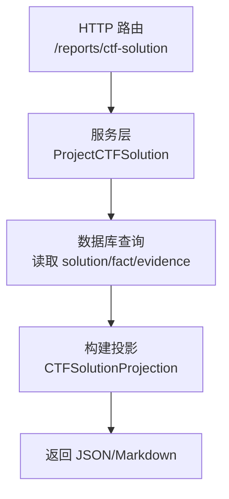
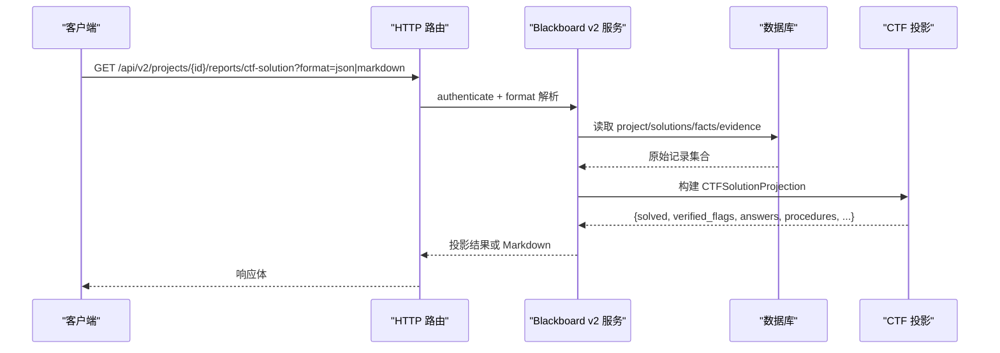
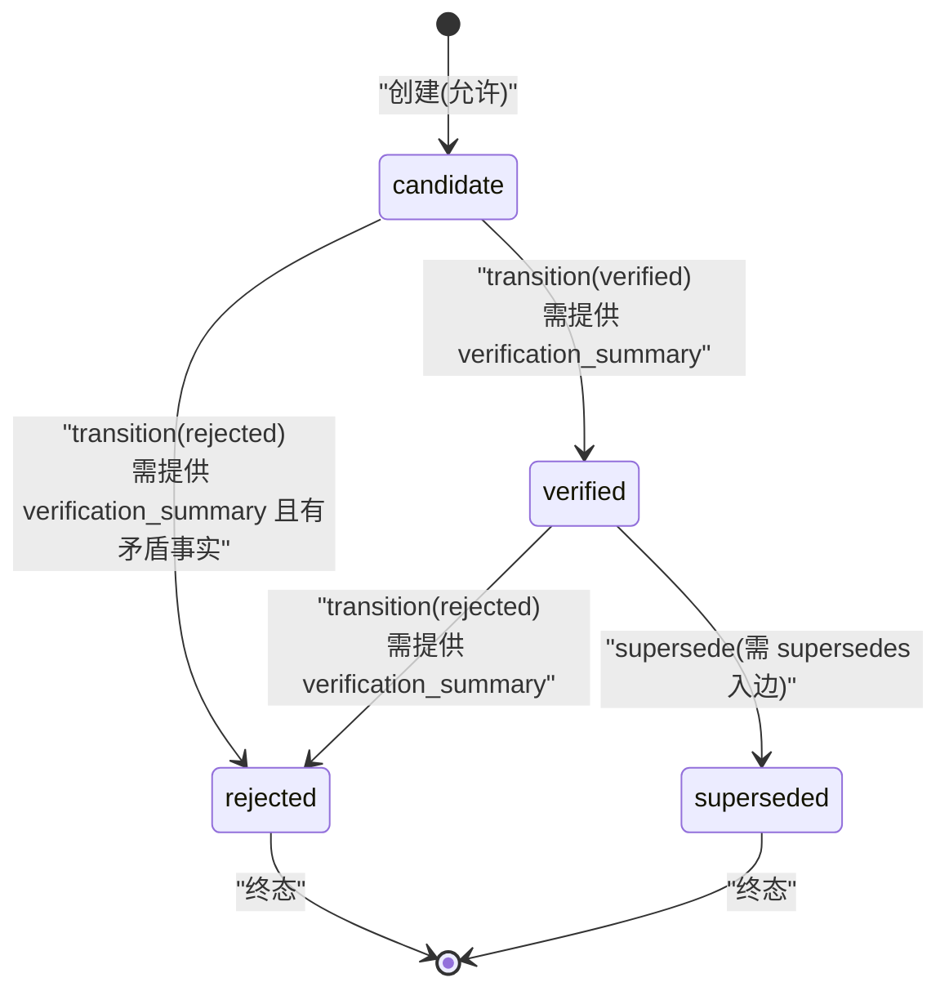
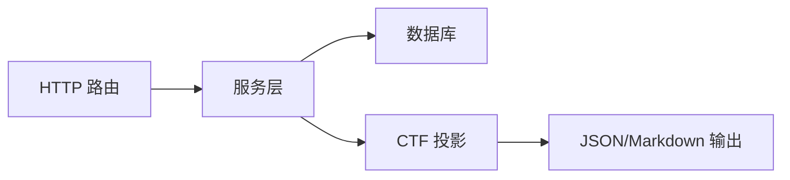

# 解决方案记录

<cite>
**本文引用的文件**   
- [service.go](file://internal/blackboardv2/service.go)
- [solution.go](file://internal/blackboardv2/solution.go)
- [blackboard-graph-contract.md](file://docs/specs/blackboard-graph-contract.md)
- [report.go](file://internal/blackboardv2/report.go)
- [blackboard_v2_http.go](file://internal/daemon/blackboard_v2_http.go)
- [openapi.json](file://internal/blackboardv2contract/contractdata/openapi.json)
- [runtime-snapshot-ctf-complete.json](file://internal/blackboardv2contract/contractdata/fixtures/runtime-snapshot-ctf-complete.json)
- [finding_report_service_test.go](file://internal/blackboardv2/finding_report_service_test.go)
- [solution_service_test.go](file://internal/blackboardv2/solution_service_test.go)
</cite>

## 目录
1. [简介](#简介)
2. [项目结构](#项目结构)
3. [核心组件](#核心组件)
4. [架构总览](#架构总览)
5. [详细组件分析](#详细组件分析)
6. [依赖关系分析](#依赖关系分析)
7. [性能与一致性](#性能与一致性)
8. [故障排查指南](#故障排查指南)
9. [结论](#结论)
10. [附录：JSON 示例与字段规范](#附录json-示例与字段规范)

## 简介
本文件面向“解决方案记录（Solution）”的完整结构与使用规范，聚焦于 CTF 挑战场景下的 solutionRecord。文档覆盖以下要点：
- 必需字段与可选字段的定义与约束
- kind 的三种类型及其适用场景
- status 的状态机与转换条件
- value 在不同 kind 下的含义与校验要求
- verification_summary 在 verified 状态下的必填规则
- 通过 API 与运行时快照展示 CTF 解答、漏洞修复方案等典型用例

## 项目结构
Solution 相关能力主要分布在 Blackboard v2 语义服务层与 HTTP 报告接口中：
- 数据结构与校验：Service 层定义 SolutionRecord/SolutionPatch 及校验逻辑
- 状态机与变更：创建、更新、过渡（transition）流程与约束
- 导出与投影：CTF 解决方案报告（JSON/Markdown）与运行时快照
- 契约与测试：规格说明、OpenAPI、端到端测试用例

图表来源
- [blackboard_v2_http.go:295-317](file://internal/daemon/blackboard_v2_http.go#L295-L317)
- [report.go:348-453](file://internal/blackboardv2/report.go#L348-L453)

章节来源
- [service.go:323-338](file://internal/blackboardv2/service.go#L323-L338)
- [solution.go:53-196](file://internal/blackboardv2/solution.go#L53-L196)
- [report.go:348-453](file://internal/blackboardv2/report.go#L348-L453)
- [blackboard_v2_http.go:295-317](file://internal/daemon/blackboard_v2_http.go#L295-L317)

## 核心组件
- SolutionRecord：完整的 CTF 解决方案 DTO，包含 status、kind、summary、value、verification_summary
- SolutionPatch：对现有 Solution 的部分更新形状，支持 kind、summary、value、verification_summary 的可空字段
- 校验器 validateSolutionRecord：统一约束各字段取值范围与组合条件
- 状态机 applySolutionTransition：控制 candidate/verified/rejected 之间的转换与前置条件
- CTF 投影 ProjectCTFSolution：聚合当前 knowledge 中的 solutions/facts/evidence，输出 solved 标志与分类列表

章节来源
- [service.go:323-338](file://internal/blackboardv2/service.go#L323-L338)
- [solution.go:342-369](file://internal/blackboardv2/solution.go#L342-L369)
- [solution.go:158-196](file://internal/blackboardv2/solution.go#L158-L196)
- [report.go:348-453](file://internal/blackboardv2/report.go#L348-L453)

## 架构总览
下图展示了从 HTTP 请求到最终 CTF 解决方案输出的关键路径，以及 Solution 记录在其中的角色。

图表来源
- [blackboard_v2_http.go:295-317](file://internal/daemon/blackboard_v2_http.go#L295-L317)
- [report.go:348-453](file://internal/blackboardv2/report.go#L348-L453)

## 详细组件分析

### 数据模型与字段规范
- 必需字段
  - status：候选或已验证等生命周期状态
  - kind：答案/标志/程序三类之一
  - summary：简洁解释
- 可选字段
  - value：具体值（answer/flag 类型在 verified 时必填）
  - verification_summary：验证摘要（verified 时必填）

字段约束要点
- kind 仅允许 answer、flag、procedure
- status 仅允许 candidate、verified、rejected、superseded（当前工作区只保留 candidate/verified）
- value 必须为有效 UTF-8 且不含首尾空白；当 kind 为 answer/flag 且 status=verified 时必须非空
- verification_summary 在 status=verified 时必须提供，长度受限于“简明文本”

章节来源
- [service.go:323-338](file://internal/blackboardv2/service.go#L323-L338)
- [solution.go:342-369](file://internal/blackboardv2/solution.go#L342-L369)
- [blackboard-graph-contract.md:326-340](file://docs/specs/blackboard-graph-contract.md#L326-L340)

### kind 类型与适用场景
- flag（标志）
  - 用于 CTF 挑战的最终口令/令牌值
  - verified 状态下必须有非空 value，并通常关联 satisfies 边指向目标 Goal
- answer（答案）
  - 用于非 flag 类型的问答式挑战答案
  - verified 状态下必须有非空 value
- procedure（程序）
  - 用于描述操作步骤或解题流程
  - 不强制要求 value，但 verified 仍需 verification_summary

章节来源
- [blackboard-graph-contract.md:326-340](file://docs/specs/blackboard-graph-contract.md#L326-L340)
- [solution.go:342-369](file://internal/blackboardv2/solution.go#L342-L369)

### status 状态机与转换条件
- 初始创建
  - 允许 candidate 或 verified
  - 若直接创建 verified，需满足所有 verified 约束（含 verification_summary 与必要 value）
- 状态转换
  - candidate -> verified：需提供 verification_summary，并通过 record 校验
  - candidate/verified -> rejected：需提供 verification_summary，且存在可复用的矛盾事实（contradicts）以保留“无效化意义”
  - superseded：需要来自同类型的 supersedes 入边（由图关系保证）
- 不可变性与清理
  - 一旦 verified，kind/value/verification_summary 不可再修改
  - 支持 clear 操作清空 value 或 verification_summary，但不能与 patch 同时设置同一字段

图表来源
- [solution.go:53-87](file://internal/blackboardv2/solution.go#L53-L87)
- [solution.go:89-147](file://internal/blackboardv2/solution.go#L89-L147)
- [solution.go:158-196](file://internal/blackboardv2/solution.go#L158-L196)
- [blackboard-graph-contract.md:326-340](file://docs/specs/blackboard-graph-contract.md#L326-L340)

章节来源
- [solution.go:53-196](file://internal/blackboardv2/solution.go#L53-L196)
- [blackboard-graph-contract.md:326-340](file://docs/specs/blackboard-graph-contract.md#L326-L340)

### value 字段在不同 kind 下的含义
- flag/answer：存储具体的口令/答案值，verified 时必填
- procedure：通常不存储具体值，而是以 summary 和 verification_summary 描述步骤与验证依据

章节来源
- [solution.go:342-369](file://internal/blackboardv2/solution.go#L342-L369)
- [blackboard-graph-contract.md:326-340](file://docs/specs/blackboard-graph-contract.md#L326-L340)

### verification_summary 的必填要求
- 当 status=verified 时，verification_summary 必填
- 当 transition 为 verified 或 rejected 时，也必须提供 verification_summary
- 长度与内容遵循“简明文本”约束

章节来源
- [solution.go:342-369](file://internal/blackboardv2/solution.go#L342-L369)
- [service.go:3925-3946](file://internal/blackboardv2/service.go#L3925-L3946)

### CTF 求解状态推导
- 只要存在至少一个主图、未合并的 verified flag Solution，则 CTF 项目被推导为 solved=true
- 当所有 verified flags 变为 rejected 或 superseded，solved 将回退为 false
- 该推导是视图计算，不持久化为节点

章节来源
- [solution.go:13-51](file://internal/blackboardv2/solution.go#L13-L51)
- [blackboard-graph-contract.md:326-340](file://docs/specs/blackboard-graph-contract.md#L326-L340)

### 与运行时快照的关系
- 运行时快照中包含 knowledge.solutions，反映当前知识平面上的 Solution 详情
- 快照可用于前端渲染与审计，确保与当前 graph 一致

章节来源
- [runtime-snapshot-ctf-complete.json:1-2](file://internal/blackboardv2contract/contractdata/fixtures/runtime-snapshot-ctf-complete.json#L1-L2)

## 依赖关系分析
- HTTP 路由依赖认证与格式解析，调用服务层生成 CTF 解决方案投影
- 服务层依赖数据库事务读取 solution/fact/evidence，并进行最终校验
- 投影按 kind 分类输出 verified/candidate 的 flags、answers、procedures，并汇总 facts/evidence

图表来源
- [blackboard_v2_http.go:295-317](file://internal/daemon/blackboard_v2_http.go#L295-L317)
- [report.go:348-453](file://internal/blackboardv2/report.go#L348-L453)

章节来源
- [openapi.json:696-738](file://internal/blackboardv2contract/contractdata/openapi.json#L696-L738)
- [blackboard_v2_http.go:295-317](file://internal/daemon/blackboard_v2_http.go#L295-L317)
- [report.go:348-453](file://internal/blackboardv2/report.go#L348-L453)

## 性能与一致性
- 所有变更以原子批次应用，失败时整批回滚，避免部分可见状态
- CTF 解决方案为只读投影，不附加同步或完整运行时快照，降低开销
- 最终一致性通过 revision 与 ETag 实现缓存友好

章节来源
- [blackboard_graph_contract.md:479-508](file://docs/specs/blackboard-graph-contract.md#L479-L508)
- [blackboard_v2_http.go:295-317](file://internal/daemon/blackboard_v2_http.go#L295-L317)
- [openapi.json:696-738](file://internal/blackboardv2contract/contractdata/openapi.json#L696-L738)

## 故障排查指南
常见错误与定位建议
- 项目类型不匹配：在非 CTF Challenge 项目中创建 Solution 会报错
- 字段缺失或非法：缺少 summary、kind 不在枚举、value 为空或含空白、verification_summary 缺失
- 状态转换非法：仅允许 verified/rejected 作为 transition 目标；verified 后不可改 kind/value/verification_summary
- 拒绝无意义：rejected 需要存在可复用的矛盾事实（contradicts），否则拒绝

定位参考
- 项目类型检查与错误码
- 字段校验与错误信息
- 状态转换守卫与 required 字段校验

章节来源
- [solution.go:235-247](file://internal/blackboardv2/solution.go#L235-L247)
- [solution.go:342-369](file://internal/blackboardv2/solution.go#L342-L369)
- [solution.go:158-196](file://internal/blackboardv2/solution.go#L158-L196)
- [solution_service_test.go:107-197](file://internal/blackboardv2/solution_service_test.go#L107-L197)

## 结论
SolutionRecord 为 CTF 挑战的权威结论载体，通过严格的 kind/status 约束与验证摘要，确保可追溯、可验证与可撤销。配合 CTF 解决方案投影与运行时快照，系统可在 UI 与外部工具中稳定呈现“是否已解出”与“如何解出”的关键信息。

## 附录：JSON 示例与字段规范

### 字段速查表
- 必需字段
  - status：candidate | verified | rejected | superseded（当前工作区仅 candidate/verified）
  - kind：answer | flag | procedure
  - summary：简洁解释
- 可选字段
  - value：answer/flag 在 verified 时必填；procedure 通常不需要
  - verification_summary：status=verified 或 transition 为 verified/rejected 时必填

章节来源
- [service.go:323-338](file://internal/blackboardv2/service.go#L323-L338)
- [solution.go:342-369](file://internal/blackboardv2/solution.go#L342-L369)
- [blackboard-graph-contract.md:326-340](file://docs/specs/blackboard-graph-contract.md#L326-L340)

### 示例一：CTF 挑战解答（flag，已验证）
- 场景：成功恢复挑战口令，已通过本地验证器接受
- 关键字段：kind=flag，status=verified，value 非空，verification_summary 非空
- 参考快照片段（knowledge.solutions）

章节来源
- [runtime-snapshot-ctf-complete.json:1-2](file://internal/blackboardv2contract/contractdata/fixtures/runtime-snapshot-ctf-complete.json#L1-L2)
- [solution_service_test.go:32-74](file://internal/blackboardv2/solution_service_test.go#L32-L74)

### 示例二：CTF 挑战解答（answer，已验证）
- 场景：回答型挑战的答案已被接受
- 关键字段：kind=answer，status=verified，value 非空，verification_summary 非空

章节来源
- [finding_report_service_test.go:468-470](file://internal/blackboardv2/finding_report_service_test.go#L468-L470)

### 示例三：解题程序（procedure，已验证）
- 场景：通过特定步骤序列完成挑战，无需具体口令值
- 关键字段：kind=procedure，status=verified，verification_summary 非空，value 可为空

章节来源
- [finding_report_service_test.go:468-470](file://internal/blackboardv2/finding_report_service_test.go#L468-L470)

### 示例四：CTF 解决方案报告（JSON 投影）
- 接口：GET /api/v2/projects/{project_id}/reports/ctf-solution?format=json
- 输出：包含 solved、verified_flags、answers、procedures、confirmed_facts、tentative_facts 等
- 用途：前端页面渲染与审计

章节来源
- [openapi.json:696-738](file://internal/blackboardv2contract/contractdata/openapi.json#L696-L738)
- [blackboard_v2_http.go:295-317](file://internal/daemon/blackboard_v2_http.go#L295-L317)
- [finding_report_service_test.go:479-507](file://internal/blackboardv2/finding_report_service_test.go#L479-L507)