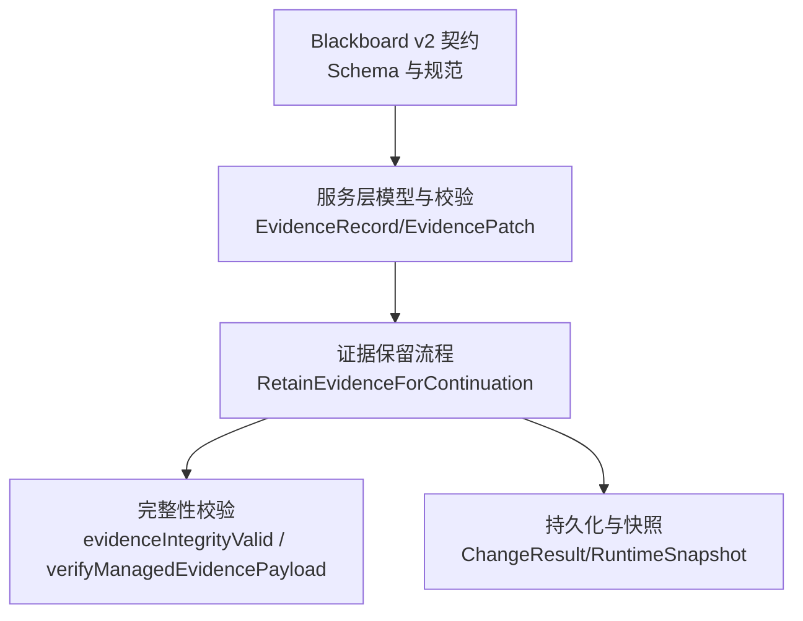
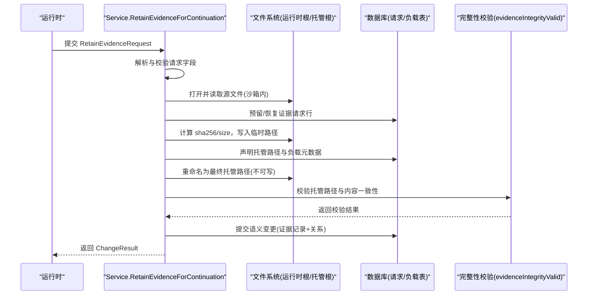
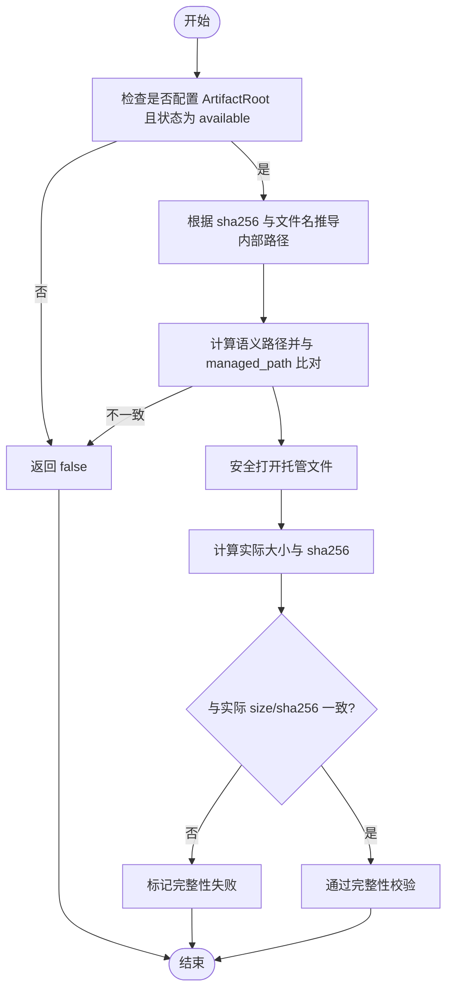
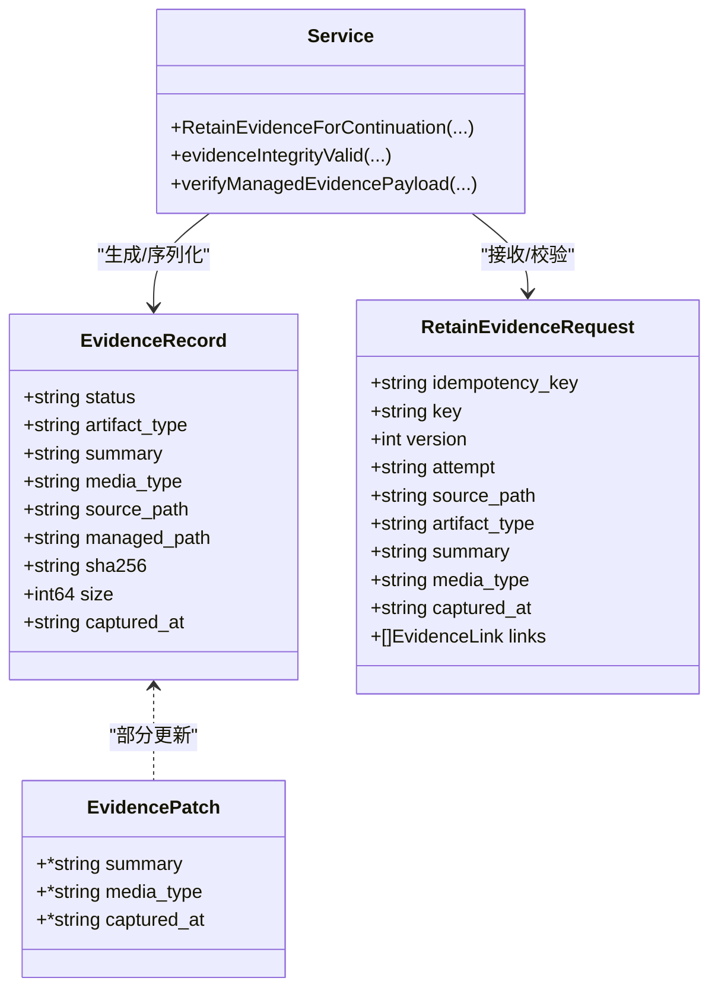

# 证据记录

<cite>
**本文引用的文件**   
- [internal/blackboardv2/service.go](file://internal/blackboardv2/service.go)
- [internal/blackboardv2/evidence.go](file://internal/blackboardv2/evidence.go)
- [internal/blackboardv2contract/contractdata/schemas/blackboard-v2.schema.json](file://internal/blackboardv2contract/contractdata/schemas/blackboard-v2.schema.json)
- [docs/specs/blackboard-graph-contract.md](file://docs/specs/blackboard-graph-contract.md)
- [internal/blackboardv2/evidence_service_test.go](file://internal/blackboardv2/evidence_service_test.go)
</cite>

## 目录
1. [简介](#简介)
2. [项目结构](#项目结构)
3. [核心组件](#核心组件)
4. [架构总览](#架构总览)
5. [详细组件分析](#详细组件分析)
6. [依赖关系分析](#依赖关系分析)
7. [性能考虑](#性能考虑)
8. [故障排查指南](#故障排查指南)
9. [结论](#结论)
10. [附录](#附录)

## 简介
本文件聚焦于 Blackboard v2 中的“证据”（Evidence）语义记录，系统性地说明：
- evidenceRecord 与 evidenceInputRecord 的结构差异
- 文件完整性验证机制（sha256、size、managed_path）
- status 字段的状态管理与业务约束（available/missing）
- artifact_type 与 media_type 的区别与用途
- source_path 与 managed_path 的关系及文件生命周期管理
- captured_at 时间戳的作用
- 提供完整的 JSON 示例（截图、日志、配置文件等）
- 证据记录与发现（Finding）、事实（Fact）、方案（Solution）等记录的关联方式

## 项目结构
证据相关的数据契约与实现分布在以下位置：
- 数据契约与校验：JSON Schema 定义与文档规范
- 服务端模型与校验：Go 结构体与服务端校验逻辑
- 证据保留流程：从运行时源文件到托管路径的原子发布与完整性校验
- 测试用例：覆盖空文件、缺失证据、篡改检测、并发冲突等场景

图表来源
- [internal/blackboardv2contract/contractdata/schemas/blackboard-v2.schema.json:425-508](file://internal/blackboardv2contract/contractdata/schemas/blackboard-v2.schema.json#L425-L508)
- [internal/blackboardv2/service.go:340-412](file://internal/blackboardv2/service.go#L340-L412)
- [internal/blackboardv2/evidence.go:194-276](file://internal/blackboardv2/evidence.go#L194-L276)
- [internal/blackboardv2/evidence.go:864-914](file://internal/blackboardv2/evidence.go#L864-L914)

章节来源
- [internal/blackboardv2contract/contractdata/schemas/blackboard-v2.schema.json:425-508](file://internal/blackboardv2contract/contractdata/schemas/blackboard-v2.schema.json#L425-L508)
- [internal/blackboardv2/service.go:340-412](file://internal/blackboardv2/service.go#L340-L412)
- [internal/blackboardv2/evidence.go:194-276](file://internal/blackboardv2/evidence.go#L194-L276)
- [internal/blackboardv2/evidence.go:864-914](file://internal/blackboardv2/evidence.go#L864-L914)

## 核心组件
- EvidenceRecord：当前证据详情 DTO，包含状态、类型、摘要、媒体类型、源路径、托管路径、完整性信息（sha256、size）以及捕获时间。
- EvidencePatch：仅允许更新语义字段（summary、media_type、captured_at），不改变完整性或路径。
- RetainEvidenceRequest：来自运行时的“保留证据”请求，包含幂等键、目标 key、版本、尝试标识、源路径、工件类型、摘要、可选媒体类型与捕获时间，以及可选的链接数组。
- 完整性校验：在 available 状态下对托管文件进行 sha256 与 size 校验，并校验 managed_path 与内部路径的一致性。

章节来源
- [internal/blackboardv2/service.go:340-359](file://internal/blackboardv2/service.go#L340-L359)
- [internal/blackboardv2/evidence.go:77-161](file://internal/blackboardv2/evidence.go#L77-L161)
- [internal/blackboardv2/evidence.go:864-914](file://internal/blackboardv2/evidence.go#L864-L914)

## 架构总览
证据保留与校验的关键调用序列如下：

图表来源
- [internal/blackboardv2/evidence.go:194-276](file://internal/blackboardv2/evidence.go#L194-L276)
- [internal/blackboardv2/evidence.go:811-838](file://internal/blackboardv2/evidence.go#L811-L838)
- [internal/blackboardv2/evidence.go:864-914](file://internal/blackboardv2/evidence.go#L864-L914)

## 详细组件分析

### 数据结构对比：evidenceRecord vs evidenceInputRecord
- evidenceRecord（持久化后的完整证据详情）
  - 必填字段：status、artifact_type、summary、managed_path、sha256、size
  - 可选字段：media_type、source_path、captured_at
  - 约束：
    - status 仅允许 available 或 missing
    - sha256 为小写 64 位十六进制字符串
    - size 为非负整数
    - managed_path 非空
- evidenceInputRecord（输入侧契约片段）
  - 必填字段：status、artifact_type、summary、source_path
  - 可选字段：media_type、captured_at
  - 注意：不包含 managed_path、sha256、size（这些由服务端生成）

差异要点：
- input 侧重“来源描述”，record 侧重“可验证的托管引用”。
- record 强制完整性三件套（managed_path、sha256、size），input 仅需 source_path。

章节来源
- [internal/blackboardv2contract/contractdata/schemas/blackboard-v2.schema.json:425-508](file://internal/blackboardv2contract/contractdata/schemas/blackboard-v2.schema.json#L425-L508)
- [internal/blackboardv2/service.go:340-359](file://internal/blackboardv2/service.go#L340-L359)

### 文件完整性验证机制
- 触发条件：当证据状态为 available 且配置了 ArtifactRoot 时执行。
- 校验步骤：
  1) 根据 projectID、sha256 与文件名推导内部托管路径；
  2) 将内部路径转换为语义路径并与 record.managed_path 比对；
  3) 以只读安全方式打开文件，计算实际大小与 sha256，与 record.size/sha256 比较。
- 失败处理：若不一致或文件异常，视为完整性失败，阻止后续确认操作。

图表来源
- [internal/blackboardv2/evidence.go:893-914](file://internal/blackboardv2/evidence.go#L893-L914)
- [internal/blackboardv2/evidence.go:864-891](file://internal/blackboardv2/evidence.go#L864-L891)

章节来源
- [internal/blackboardv2/evidence.go:864-914](file://internal/blackboardv2/evidence.go#L864-L914)

### 状态管理：available 与 missing
- 允许状态：available、missing
- 转换规则：
  - available ↔ missing 双向切换
  - 任何状态均可进入 superseded（终态，需有 incoming supersedes 关系）
- 业务影响：
  - 只有 available 的证据可用于确认事实（Fact）或支撑发现（Finding）/方案（Solution）。
  - 缺失证据无法用于确认，且会拒绝基于该证据的确认操作。

章节来源
- [docs/specs/blackboard-graph-contract.md:342-360](file://docs/specs/blackboard-graph-contract.md#L342-L360)
- [internal/blackboardv2/service.go:4572-4602](file://internal/blackboardv2/service.go#L4572-L4602)
- [internal/blackboardv2/evidence_service_test.go:642-689](file://internal/blackboardv2/evidence_service_test.go#L642-L689)

### 字段详解：artifact_type 与 media_type
- artifact_type（必需）
  - 表示证据的工件类别，如 http_exchange、screenshot、terminal_capture、log、pcap、file、binary、source_code、structured_data、report、other 等。
  - 用于分类与展示，决定 UI 渲染策略与下游工具链的处理方式。
- media_type（可选）
  - 已知时的 MIME 类型，便于浏览器或工具正确解析与预览。
  - 若未知可不填，不影响完整性校验。

章节来源
- [docs/specs/blackboard-graph-contract.md:342-360](file://docs/specs/blackboard-graph-contract.md#L342-L360)
- [internal/blackboardv2/service.go:340-359](file://internal/blackboardv2/service.go#L340-L359)

### 路径关系：source_path 与 managed_path
- source_path（输入侧）
  - 运行时工作目录内的原始文件路径，作为证据的来源。
- managed_path（输出侧）
  - 由服务端在 Artifact Root 下生成的项目相对路径，指向不可写的托管副本。
- 关系与生命周期：
  - 保留流程中，服务端从 source_path 读取并计算完整性，随后写入受控目录，生成 managed_path。
  - 托管文件权限设置为不可写，防止篡改。
  - 完整性校验会将 managed_path 与内部路径/哈希进行一致性验证。

章节来源
- [internal/blackboardv2/evidence.go:194-276](file://internal/blackboardv2/evidence.go#L194-L276)
- [internal/blackboardv2/evidence.go:811-838](file://internal/blackboardv2/evidence.go#L811-L838)
- [internal/blackboardv2/evidence.go:864-914](file://internal/blackboardv2/evidence.go#L864-L914)

### 时间戳：captured_at
- 作用：记录证据内容的采集时间，便于审计与溯源。
- 格式：RFC3339 时间字符串。
- 校验：若提供则必须为合法 RFC3339 时间。

章节来源
- [internal/blackboardv2/service.go:4572-4602](file://internal/blackboardv2/service.go#L4572-L4602)
- [internal/blackboardv2/evidence.go:476-516](file://internal/blackboardv2/evidence.go#L476-L516)

### 证据与发现、事实、方案的关联
- 证据可通过 links 建立关系：
  - evidences：指向被证明的目标（如 fact、finding、solution）。
  - about：关于某实体的补充材料。
- 业务约束：
  - 使用证据确认事实前，证据必须处于 available 且通过完整性校验。
  - 缺失证据不能用于确认；已 superseded 的证据不再作为有效依据。

章节来源
- [internal/blackboardv2/evidence.go:476-516](file://internal/blackboardv2/evidence.go#L476-L516)
- [docs/specs/blackboard-graph-contract.md:342-360](file://docs/specs/blackboard-graph-contract.md#L342-L360)
- [internal/blackboardv2/evidence_service_test.go:510-577](file://internal/blackboardv2/evidence_service_test.go#L510-L577)

### 完整 JSON 示例
以下为不同类型证据的示例（字段遵循 schema 与校验规则）：

- 截图证据
{
  "status": "available",
  "artifact_type": "screenshot",
  "summary": "登录成功页面截图，显示管理员会话",
  "media_type": "image/png",
  "source_path": "captures/login.png",
  "managed_path": "artifacts/retained/<project>/<task>/login.png",
  "sha256": "<64位小写十六进制>",
  "size": 123456,
  "captured_at": "2026-07-17T09:30:00Z"
}

- HTTP 交互证据
{
  "status": "available",
  "artifact_type": "http_exchange",
  "summary": "认证响应体，暴露管理员账户",
  "media_type": "application/http",
  "source_path": "captures/response.txt",
  "managed_path": "artifacts/retained/<project>/<task>/response.txt",
  "sha256": "<64位小写十六进制>",
  "size": 6,
  "captured_at": "2026-07-17T09:30:00Z"
}

- 终端捕获证据
{
  "status": "available",
  "artifact_type": "terminal_capture",
  "summary": "挑战提交的终端输出，包含 flag",
  "media_type": "text/plain",
  "source_path": "captures/flag_output.log",
  "managed_path": "artifacts/retained/<project>/<task>/flag_output.log",
  "sha256": "<64位小写十六进制>",
  "size": 2048,
  "captured_at": "2026-07-17T10:00:00Z"
}

- 日志文件证据
{
  "status": "available",
  "artifact_type": "log",
  "summary": "应用错误日志，包含敏感信息泄露",
  "media_type": "text/plain",
  "source_path": "logs/app-error.log",
  "managed_path": "artifacts/retained/<project>/<task>/app-error.log",
  "sha256": "<64位小写十六进制>",
  "size": 51200,
  "captured_at": "2026-07-17T11:15:00Z"
}

- 配置文件证据
{
  "status": "available",
  "artifact_type": "file",
  "summary": "数据库连接配置，包含明文密码",
  "media_type": "text/yaml",
  "source_path": "config/db.yaml",
  "managed_path": "artifacts/retained/<project>/<task>/db.yaml",
  "sha256": "<64位小写十六进制>",
  "size": 1024,
  "captured_at": "2026-07-17T12:00:00Z"
}

- 二进制证据
{
  "status": "available",
  "artifact_type": "binary",
  "summary": "漏洞利用载荷样本",
  "media_type": "application/octet-stream",
  "source_path": "payloads/exploit.bin",
  "managed_path": "artifacts/retained/<project>/<task>/exploit.bin",
  "sha256": "<64位小写十六进制>",
  "size": 4096,
  "captured_at": "2026-07-17T13:00:00Z"
}

- 结构化数据证据
{
  "status": "available",
  "artifact_type": "structured_data",
  "summary": "用户枚举导出 CSV",
  "media_type": "text/csv",
  "source_path": "exports/users.csv",
  "managed_path": "artifacts/retained/<project>/<task>/users.csv",
  "sha256": "<64位小写十六进制>",
  "size": 8192,
  "captured_at": "2026-07-17T14:00:00Z"
}

- 报告证据
{
  "status": "available",
  "artifact_type": "report",
  "summary": "扫描器输出的 HTML 报告",
  "media_type": "text/html",
  "source_path": "reports/vuln-report.html",
  "managed_path": "artifacts/retained/<project>/<task>/vuln-report.html",
  "sha256": "<64位小写十六进制>",
  "size": 102400,
  "captured_at": "2026-07-17T15:00:00Z"
}

- 其他证据
{
  "status": "available",
  "artifact_type": "other",
  "summary": "自定义取证产物",
  "media_type": "application/json",
  "source_path": "forensics/custom.json",
  "managed_path": "artifacts/retained/<project>/<task>/custom.json",
  "sha256": "<64位小写十六进制>",
  "size": 2048,
  "captured_at": "2026-07-17T16:00:00Z"
}

- 缺失证据（status=missing）
{
  "status": "missing",
  "artifact_type": "http_exchange",
  "summary": "原始响应已不可用，但记录仍保留以供审计",
  "managed_path": "artifacts/retained/<project>/<task>/old-response.txt",
  "sha256": "<64位小写十六进制>",
  "size": 6
}

注意：
- sha256 必须为小写 64 位十六进制字符串。
- size 为非负整数。
- captured_at 为可选的 RFC3339 时间字符串。
- managed_path 在服务端生成，客户端不应自行指定。

章节来源
- [internal/blackboardv2contract/contractdata/schemas/blackboard-v2.schema.json:425-508](file://internal/blackboardv2contract/contractdata/schemas/blackboard-v2.schema.json#L425-L508)
- [internal/blackboardv2/service.go:4572-4602](file://internal/blackboardv2/service.go#L4572-L4602)
- [internal/blackboardv2/evidence_service_test.go:472-508](file://internal/blackboardv2/evidence_service_test.go#L472-L508)

## 依赖关系分析
- 契约层（Schema/规范）定义了证据字段的允许值与约束。
- 服务层（service.go/evidence.go）负责：
  - 解析与校验输入（RetainEvidenceRequest）
  - 生成与管理托管路径与完整性信息（EvidenceRecord）
  - 维护证据状态与关系（links）
- 测试层覆盖了关键路径：空文件、缺失证据、篡改检测、并发冲突等。

图表来源
- [internal/blackboardv2/service.go:340-412](file://internal/blackboardv2/service.go#L340-L412)
- [internal/blackboardv2/evidence.go:77-161](file://internal/blackboardv2/evidence.go#L77-L161)
- [internal/blackboardv2/evidence.go:864-914](file://internal/blackboardv2/evidence.go#L864-L914)

章节来源
- [internal/blackboardv2/service.go:340-412](file://internal/blackboardv2/service.go#L340-L412)
- [internal/blackboardv2/evidence.go:77-161](file://internal/blackboardv2/evidence.go#L77-L161)
- [internal/blackboardv2/evidence.go:864-914](file://internal/blackboardv2/evidence.go#L864-L914)

## 性能考虑
- 完整性校验涉及文件 I/O 与哈希计算，建议在批量处理时避免重复校验。
- 托管文件采用不可写权限，减少额外同步开销。
- 对于大文件，建议合理设置超时与重试策略，确保幂等性。

[本节为通用指导，无需具体文件分析]

## 故障排查指南
常见问题与定位方法：
- 完整性失败（semantic_validation）
  - 现象：确认事实时被拒绝，提示证据完整性失败。
  - 排查：检查托管文件是否存在、权限是否为只读、sha256/size 是否与记录一致。
- 状态非法（semantic_validation）
  - 现象：提交 status 不为 available/missing 时报错。
  - 排查：确保仅使用允许的状态值。
- 时间戳格式错误（semantic_validation）
  - 现象：captured_at 非 RFC3339 时报错。
  - 排查：修正时间格式。
- 幂等冲突（idempotency_conflict）
  - 现象：相同 idempotency_key 但不同语义的请求被拒绝。
  - 排查：确保幂等键唯一且语义稳定。
- 并发冲突（version_conflict）
  - 现象：基于旧版本的更新被拒绝。
  - 排查：使用最新版本号进行更新。

章节来源
- [internal/blackboardv2/service.go:4572-4602](file://internal/blackboardv2/service.go#L4572-L4602)
- [internal/blackboardv2/evidence.go:476-516](file://internal/blackboardv2/evidence.go#L476-L516)
- [internal/blackboardv2/evidence_service_test.go:579-632](file://internal/blackboardv2/evidence_service_test.go#L579-L632)

## 结论
证据记录通过严格的契约与校验机制，确保了证据的可追溯性与不可篡改性。evidenceRecord 与 evidenceInputRecord 的职责分离使输入简洁而输出完备；available/missing 的状态管理配合完整性校验，保障了证据在事实确认中的可信度。通过清晰的 source_path 与 managed_path 关系，系统在运行时与托管环境之间建立了安全的边界。

[本节为总结，无需具体文件分析]

## 附录
- 参考规范：黑板图契约中对证据工件的定义与状态转换。
- 测试用例：覆盖空文件、缺失证据、篡改检测、并发冲突等关键路径。

章节来源
- [docs/specs/blackboard-graph-contract.md:342-360](file://docs/specs/blackboard-graph-contract.md#L342-L360)
- [internal/blackboardv2/evidence_service_test.go:472-508](file://internal/blackboardv2/evidence_service_test.go#L472-L508)
- [internal/blackboardv2/evidence_service_test.go:579-632](file://internal/blackboardv2/evidence_service_test.go#L579-L632)
- [internal/blackboardv2/evidence_service_test.go:642-689](file://internal/blackboardv2/evidence_service_test.go#L642-L689)