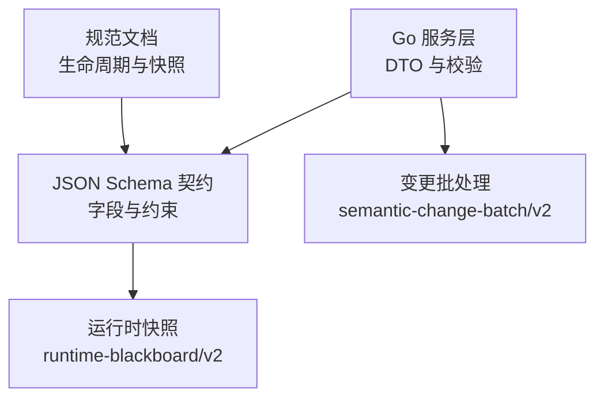
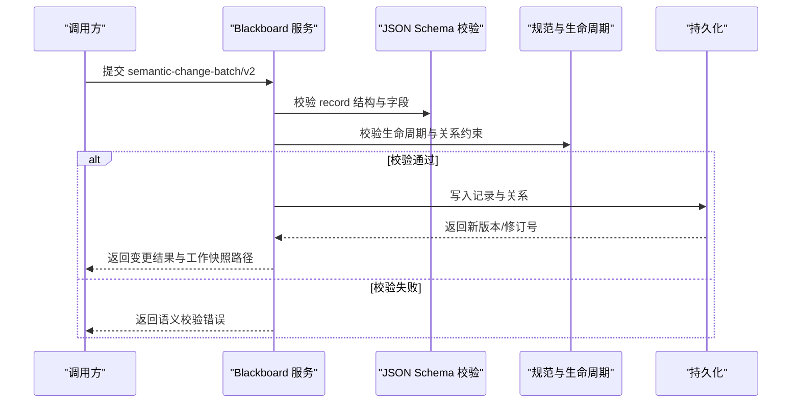
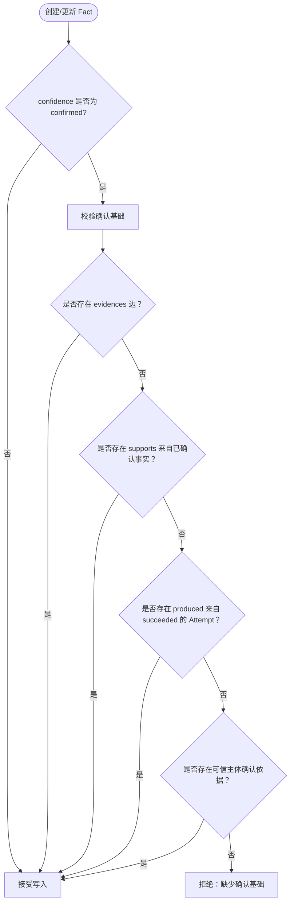
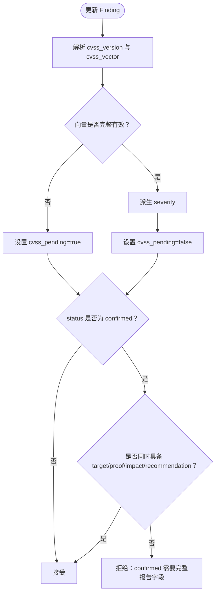
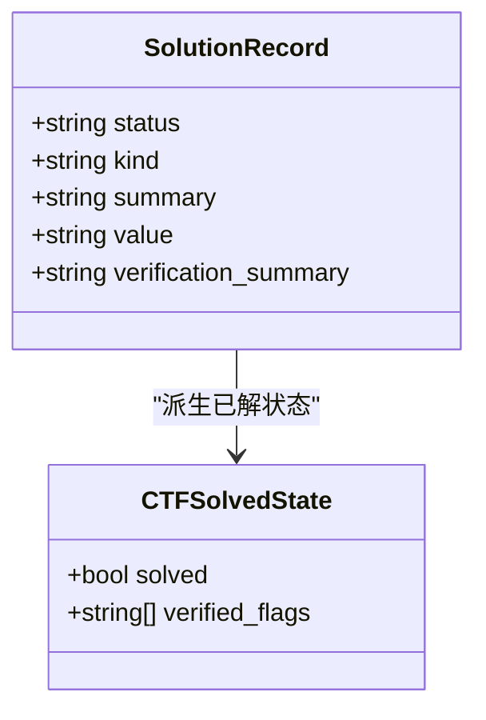
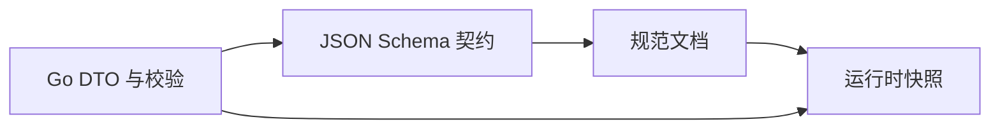

# 语义记录类型

<cite>
**本文引用的文件**   
- [service.go](file://internal/blackboardv2/service.go)
- [finding.go](file://internal/blackboardv2/finding.go)
- [solution.go](file://internal/blackboardv2/solution.go)
- [blackboard-v2.schema.json](file://internal/blackboardv2contract/contractdata/schemas/blackboard-v2.schema.json)
- [blackboard-v2-spec.md](file://docs/specs/blackboard-v2-spec.md)
- [blackboard-graph-contract.md](file://docs/specs/blackboard-graph-contract.md)
- [runtime-snapshot-ctf-complete.json](file://internal/blackboardv2contract/contractdata/fixtures/runtime-snapshot-ctf-complete.json)
</cite>

## 目录
1. [简介](#简介)
2. [项目结构](#项目结构)
3. [核心组件](#核心组件)
4. [架构总览](#架构总览)
5. [详细组件分析](#详细组件分析)
6. [依赖分析](#依赖分析)
7. [性能考虑](#性能考虑)
8. [故障排查指南](#故障排查指南)
9. [结论](#结论)
10. [附录](#附录)

## 简介
本文件系统化梳理 Blackboard v2 的语义记录类型，重点覆盖 objectiveRecord、attemptRecord、factRecord、findingRecord、solutionRecord 的结构、业务含义、必需与可选字段、验证规则与使用场景。特别强调：
- factRecord 的置信度级别（tentative、confirmed）及其确认基础要求
- findingRecord 的 CVSS 评分系统（版本 3.1/4.0）、严重等级派生与校验
- solutionRecord 的类型（answer、flag、procedure）及 CTF 已解状态推导

## 项目结构
Blackboard v2 的语义记录定义由三层共同约束：
- Go 服务层 DTO 与校验逻辑（Go struct + 校验函数）
- JSON Schema 契约（字段枚举、必填项、条件必填）
- 规范文档（生命周期守卫、关系与快照约定）

图表来源
- [service.go:234-396](file://internal/blackboardv2/service.go#L234-L396)
- [blackboard-v2.schema.json:101-425](file://internal/blackboardv2contract/contractdata/schemas/blackboard-v2.schema.json#L101-L425)
- [blackboard-v2-spec.md:93-140](file://docs/specs/blackboard-v2-spec.md#L93-L140)

章节来源
- [service.go:234-396](file://internal/blackboardv2/service.go#L234-L396)
- [blackboard-v2.schema.json:101-425](file://internal/blackboardv2contract/contractdata/schemas/blackboard-v2.schema.json#L101-L425)
- [blackboard-v2-spec.md:93-140](file://docs/specs/blackboard-v2-spec.md#L93-L140)

## 核心组件
本节给出各语义记录的完整字段清单、业务含义、必填/可选与关键校验要点。

- objectiveRecord（探索目标）
  - 字段
    - status: 仅 open
    - objective: 目标描述（必填）
    - resolution_summary: 解决摘要（可选，进入终态时填写）
  - 业务含义
    - 表达一次探索任务的目标；需通过 satisfies 关系被事实、发现或方案满足后，方可进入终态。
  - 参考路径
    - [service.go:255-265](file://internal/blackboardv2/service.go#L255-L265)
    - [blackboard-v2.schema.json:134-150](file://internal/blackboardv2contract/contractdata/schemas/blackboard-v2.schema.json#L134-L150)
    - [blackboard-v2-spec.md:32-40](file://docs/specs/blackboard-v2-spec.md#L32-L40)

- attemptRecord（尝试）
  - 字段
    - status: 仅 open（当前工作）
    - summary: 尝试摘要（必填）
  - 业务含义
    - 记录一次可复用的尝试过程；终态需要总结且至少存在 tests 关系指向目标/实体/知识。
  - 参考路径
    - [service.go:267-276](file://internal/blackboardv2/service.go#L267-L276)
    - [blackboard-v2.schema.json:151-167](file://internal/blackboardv2contract/contractdata/schemas/blackboard-v2.schema.json#L151-L167)
    - [blackboard-v2-spec.md:32-40](file://docs/specs/blackboard-v2-spec.md#L32-L40)

- factRecord（项目事实）
  - 字段
    - category: 分类（必填）
    - summary: 摘要（必填）
    - body: 正文（可选）
    - confidence: 置信度（必填），取值 tentative 或 confirmed
    - scope_status: 范围状态（必填），in_scope / unknown / out_of_scope
  - 业务含义
    - 承载项目知识；confirmed 需要可信支撑（证据、已确认事实、成功产出的尝试或可信主体确认）。
  - 参考路径
    - [service.go:278-294](file://internal/blackboardv2/service.go#L278-L294)
    - [blackboard-v2.schema.json:168-197](file://internal/blackboardv2contract/contractdata/schemas/blackboard-v2.schema.json#L168-L197)
    - [blackboard-v2-spec.md:32-40](file://docs/specs/blackboard-v2-spec.md#L32-L40)
    - [blackboard-graph-contract.md:294-300](file://docs/specs/blackboard-graph-contract.md#L294-L300)

- findingRecord（安全发现）
  - 字段
    - status: unconfirmed 或 confirmed
    - title: 标题（必填）
    - target/description/proof/impact/recommendation: 报告字段（可选，但 confirmed 时必填）
    - cvss_version: 3.1 或 4.0（可选）
    - cvss_vector: CVSS 向量（可选，与版本成对出现）
    - severity: 严重等级（服务端派生，不可写）
    - cvss_pending: 是否待计算（服务端派生，不可写）
  - 业务含义
    - 记录漏洞或风险；confirmed 需要完整报告字段与有效 CVSS 向量，并具备证据或已确认事实支撑。
  - 参考路径
    - [service.go:296-321](file://internal/blackboardv2/service.go#L296-L321)
    - [blackboard-v2.schema.json:198-356](file://internal/blackboardv2contract/contractdata/schemas/blackboard-v2.schema.json#L198-L356)
    - [blackboard-v2-spec.md:32-40](file://docs/specs/blackboard-v2-spec.md#L32-L40)

- solutionRecord（CTF 方案）
  - 字段
    - status: candidate 或 verified
    - kind: answer、flag 或 procedure
    - summary: 摘要（必填）
    - value: 答案/旗帜值（kind=answer/flag 且 verified 时必填）
    - verification_summary: 验证摘要（verified 时必填）
  - 业务含义
    - 仅用于 CTF Challenge 项目；verified flag 决定“已解”状态，无需复制 Goal 节点。
  - 参考路径
    - [service.go:323-338](file://internal/blackboardv2/service.go#L323-L338)
    - [blackboard-v2.schema.json:357-425](file://internal/blackboardv2contract/contractdata/schemas/blackboard-v2.schema.json#L357-L425)
    - [blackboard-graph-contract.md:326-340](file://docs/specs/blackboard-graph-contract.md#L326-L340)

章节来源
- [service.go:255-338](file://internal/blackboardv2/service.go#L255-L338)
- [blackboard-v2.schema.json:134-425](file://internal/blackboardv2contract/contractdata/schemas/blackboard-v2.schema.json#L134-L425)
- [blackboard-v2-spec.md:32-54](file://docs/specs/blackboard-v2-spec.md#L32-L54)
- [blackboard-graph-contract.md:294-340](file://docs/specs/blackboard-graph-contract.md#L294-L340)

## 架构总览
语义记录在系统中的流转与约束如下：

图表来源
- [service.go:100-232](file://internal/blackboardv2/service.go#L100-L232)
- [blackboard-v2.schema.json:101-425](file://internal/blackboardv2contract/contractdata/schemas/blackboard-v2.schema.json#L101-L425)
- [blackboard-v2-spec.md:185-200](file://docs/specs/blackboard-v2-spec.md#L185-L200)

## 详细组件分析

### objectiveRecord 分析
- 字段与约束
  - status 固定为 open（创建阶段）
  - objective 必填，长度与编码限制遵循规范
  - resolution_summary 可选，进入终态时提供
- 生命周期
  - 仅在收到来自当前 Project Fact、Finding 或 Solution 的 satisfies 关系后，才可解析
- 典型用法
  - 作为探索目标的锚点，被 Attempt 的 tests 关系引用

章节来源
- [service.go:255-265](file://internal/blackboardv2/service.go#L255-L265)
- [blackboard-v2.schema.json:134-150](file://internal/blackboardv2contract/contractdata/schemas/blackboard-v2.schema.json#L134-L150)
- [blackboard-v2-spec.md:44-54](file://docs/specs/blackboard-v2-spec.md#L44-L54)

### attemptRecord 分析
- 字段与约束
  - status 固定为 open（当前工作）
  - summary 必填
- 生命周期
  - 终态需要总结且至少一个 tests 关系；中断由服务器协调，Runtime 不可自标记 interrupted
- 典型用法
  - 包裹一次可复用的尝试，产出事实/发现/方案/证据等

章节来源
- [service.go:267-276](file://internal/blackboardv2/service.go#L267-L276)
- [blackboard-v2.schema.json:151-167](file://internal/blackboardv2contract/contractdata/schemas/blackboard-v2.schema.json#L151-L167)
- [blackboard-v2-spec.md:44-54](file://docs/specs/blackboard-v2-spec.md#L44-L54)

### factRecord 分析（置信度与确认基础）
- 字段与约束
  - category/summary/confidence/scope_status 必填
  - body 可选
  - confidence 取值 tentative 或 confirmed
- 确认基础
  - confirmed 需要以下之一：evidences 边、来自 Observation 或已确认事实的 supports 边、由 succeeded 的 Attempt 产生的 produced 边，或可信主体确认依据
- 典型用法
  - 作为知识沉淀，支撑 Finding 的 confirmed 与 Solution 的 verified

图表来源
- [blackboard-v2.schema.json:168-197](file://internal/blackboardv2contract/contractdata/schemas/blackboard-v2.schema.json#L168-L197)
- [blackboard-graph-contract.md:294-300](file://docs/specs/blackboard-graph-contract.md#L294-L300)
- [service.go:4551-4570](file://internal/blackboardv2/service.go#L4551-L4570)

章节来源
- [service.go:278-294](file://internal/blackboardv2/service.go#L278-L294)
- [blackboard-v2.schema.json:168-197](file://internal/blackboardv2contract/contractdata/schemas/blackboard-v2.schema.json#L168-L197)
- [blackboard-graph-contract.md:294-300](file://docs/specs/blackboard-graph-contract.md#L294-L300)

### findingRecord 分析（CVSS 评分系统）
- 字段与约束
  - status/title 必填
  - target/description/proof/impact/recommendation 可选，但 status=confirmed 时必填
  - cvss_version 允许 3.1 或 4.0；cvss_vector 与版本成对出现
  - severity 与 cvss_pending 由服务端派生，禁止调用方写入
- 评分流程
  - 当提供 cvss_version 与 cvss_vector 时，服务端解析向量并派生 severity；若不完整则设置 cvss_pending=true
  - confirmed 状态必须拥有完整有效的 CVSS 向量
- 典型用法
  - 结合证据或已确认事实，将未确认发现提升为已确认

图表来源
- [finding.go:152-248](file://internal/blackboardv2/finding.go#L152-L248)
- [blackboard-v2.schema.json:198-356](file://internal/blackboardv2contract/contractdata/schemas/blackboard-v2.schema.json#L198-L356)
- [blackboard-v2-spec.md:44-54](file://docs/specs/blackboard-v2-spec.md#L44-L54)

章节来源
- [service.go:296-321](file://internal/blackboardv2/service.go#L296-L321)
- [finding.go:152-248](file://internal/blackboardv2/finding.go#L152-L248)
- [blackboard-v2.schema.json:198-356](file://internal/blackboardv2contract/contractdata/schemas/blackboard-v2.schema.json#L198-L356)

### solutionRecord 分析（类型与 CTF 已解状态）
- 字段与约束
  - status/kind/summary 必填
  - kind 取值 answer、flag、procedure
  - value 在 kind=answer/flag 且 status=verified 时必填
  - verification_summary 在 status=verified 时必填
- 业务规则
  - 仅适用于 CTF Challenge 项目
  - verified flag 决定“已解”状态；若所有 verified flag 被拒绝或被替代，则“已解”变为 false
- 典型用法
  - 以 satisfies 关系关联 Objective，体现挑战完成

图表来源
- [service.go:323-338](file://internal/blackboardv2/service.go#L323-L338)
- [solution.go:1-51](file://internal/blackboardv2/solution.go#L1-L51)
- [blackboard-v2.schema.json:357-425](file://internal/blackboardv2contract/contractdata/schemas/blackboard-v2.schema.json#L357-L425)
- [blackboard-graph-contract.md:326-340](file://docs/specs/blackboard-graph-contract.md#L326-L340)

章节来源
- [service.go:323-338](file://internal/blackboardv2/service.go#L323-L338)
- [solution.go:1-51](file://internal/blackboardv2/solution.go#L1-L51)
- [blackboard-v2.schema.json:357-425](file://internal/blackboardv2contract/contractdata/schemas/blackboard-v2.schema.json#L357-L425)
- [blackboard-graph-contract.md:326-340](file://docs/specs/blackboard-graph-contract.md#L326-L340)

## 依赖分析
- 记录类型与校验
  - Go 服务层 DTO 与 JSON Schema 双向约束：Go struct 负责运行时校验与派生，Schema 负责契约边界
- 生命周期与关系
  - 规范文档定义了各类型的生命周期守卫与关系方向，确保语义一致性
- 快照与投影
  - 运行时快照按类型分组序列化，键排序，保证确定性输出

图表来源
- [service.go:234-396](file://internal/blackboardv2/service.go#L234-L396)
- [blackboard-v2.schema.json:101-425](file://internal/blackboardv2contract/contractdata/schemas/blackboard-v2.schema.json#L101-L425)
- [blackboard-v2-spec.md:93-140](file://docs/specs/blackboard-v2-spec.md#L93-L140)

章节来源
- [service.go:234-396](file://internal/blackboardv2/service.go#L234-L396)
- [blackboard-v2.schema.json:101-425](file://internal/blackboardv2contract/contractdata/schemas/blackboard-v2.schema.json#L101-L425)
- [blackboard-v2-spec.md:93-140](file://docs/specs/blackboard-v2-spec.md#L93-L140)

## 性能考虑
- 文本长度限制
  - 主语义文本上限 1024 UTF-8 字节，辅助说明 512 字节；超限直接拒绝，避免隐式截断
- 派生字段
  - CVSS 严重等级在服务端派生，减少客户端计算成本并确保一致性
- 快照序列化
  - 键排序与稳定顺序有助于缓存与对比

[本节为通用指导，不直接分析具体文件]

## 故障排查指南
- 常见语义校验错误
  - 未知记录类型或未知字段：将被拒绝
  - 缺失必填字段或条件必填不满足：如 confirmed Finding 缺少报告字段或 CVSS 向量不完整
  - 派生字段被调用方写入：如 severity/cvss_pending 只读
  - Fact 置信度为 confirmed 但无确认基础：需补充证据、支持事实、成功尝试或可信主体依据
- 定位建议
  - 检查 change 中 record 的字段是否符合 Schema 与规范
  - 核对关系图是否满足生命周期守卫（如 satisfies/evidences/supports）
  - 关注 cvss_pending 标志位，必要时补全 CVSS 向量

章节来源
- [blackboard-v2-spec.md:42-54](file://docs/specs/blackboard-v2-spec.md#L42-L54)
- [finding.go:199-212](file://internal/blackboardv2/finding.go#L199-L212)
- [blackboard-graph-contract.md:294-300](file://docs/specs/blackboard-graph-contract.md#L294-L300)

## 结论
Blackboard v2 通过强契约（Schema + 规范）与服务端派生（CVSS 严重等级、CTF 已解状态）保障语义一致性与可审计性。factRecord 的置信度体系、findingRecord 的 CVSS 评分机制以及 solutionRecord 的类型化设计，构成了从探索到结论的完整语义闭环。

[本节为总结，不直接分析具体文件]

## 附录

### 字段定义速查表
- objectiveRecord
  - 必填：status(open)、objective
  - 可选：resolution_summary
- attemptRecord
  - 必填：status(open)、summary
- factRecord
  - 必填：category、summary、confidence(tentative/confirmed)、scope_status(in_scope/unknown/out_of_scope)
  - 可选：body
- findingRecord
  - 必填：status(unconfirmed/confirmed)、title
  - 条件必填：confirmed 时需 target、proof、impact、recommendation、cvss_version、cvss_vector
  - 可选：target、description、proof、impact、recommendation、cvss_version、cvss_vector
  - 派生：severity、cvss_pending（只读）
- solutionRecord
  - 必填：status(candidate/verified)、kind(answer/flag/procedure)、summary
  - 条件必填：verified 时需 verification_summary；kind=answer/flag 且 verified 时需 value

章节来源
- [service.go:255-338](file://internal/blackboardv2/service.go#L255-L338)
- [blackboard-v2.schema.json:134-425](file://internal/blackboardv2contract/contractdata/schemas/blackboard-v2.schema.json#L134-L425)

### JSON 示例（路径）
- CTF 完整快照示例（含 objective、attempt、fact、solution）
  - [runtime-snapshot-ctf-complete.json](file://internal/blackboardv2contract/contractdata/fixtures/runtime-snapshot-ctf-complete.json)

章节来源
- [runtime-snapshot-ctf-complete.json:1-2](file://internal/blackboardv2contract/contractdata/fixtures/runtime-snapshot-ctf-complete.json#L1-L2)