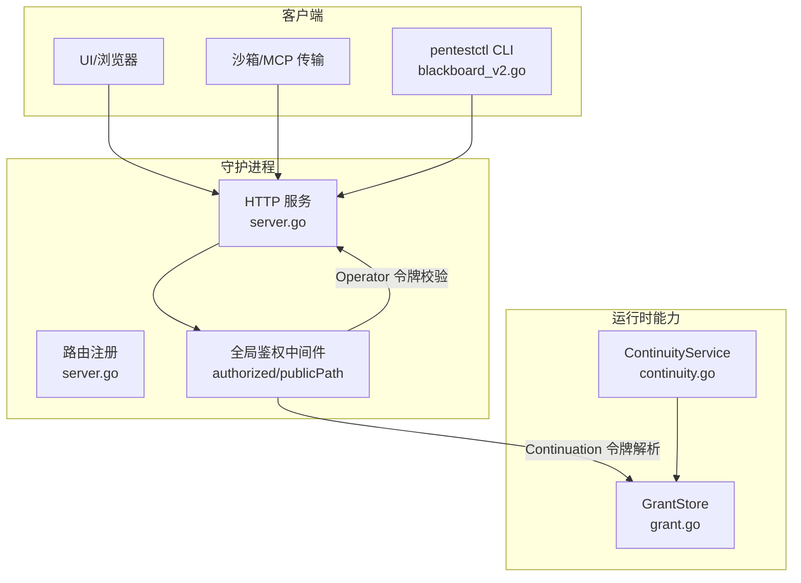
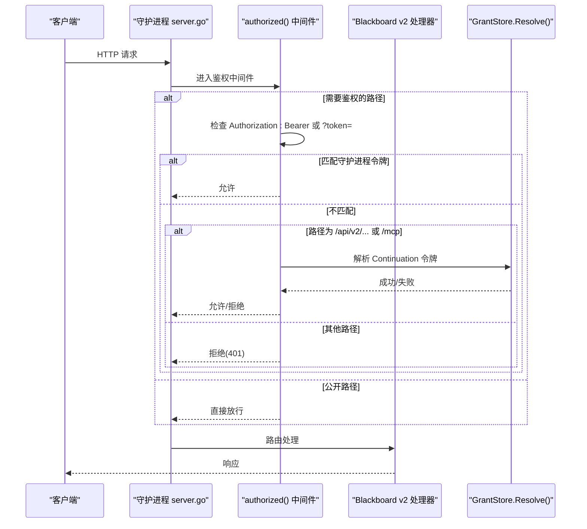
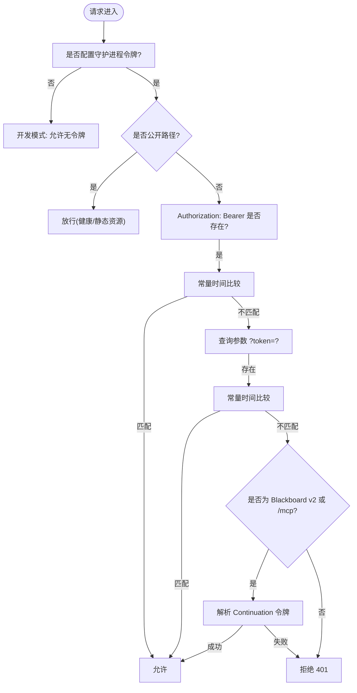
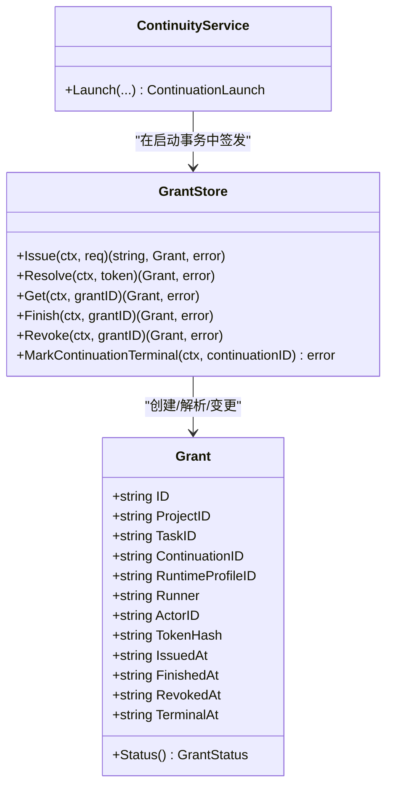
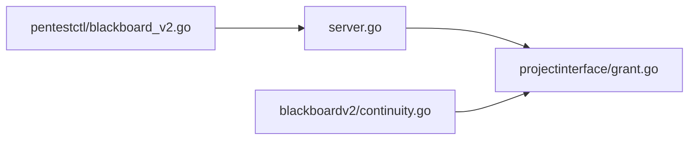

# 认证与授权

<cite>
**本文引用的文件列表**
- [cmd/pentestd/main.go](file://cmd/pentestd/main.go)
- [internal/daemon/server.go](file://internal/daemon/server.go)
- [internal/projectinterface/bearer.go](file://internal/projectinterface/bearer.go)
- [internal/projectinterface/grant.go](file://internal/projectinterface/grant.go)
- [internal/blackboardv2/continuity.go](file://internal/blackboardv2/continuity.go)
- [internal/daemon/auth_test.go](file://internal/daemon/auth_test.go)
- [internal/pentestctl/blackboard_v2.go](file://internal/pentestctl/blackboard_v2.go)
- [scripts/with-pentestd-live.sh](file://scripts/with-pentestd-live.sh)
</cite>

## 目录
1. [简介](#简介)
2. [项目结构](#项目结构)
3. [核心组件](#核心组件)
4. [架构总览](#架构总览)
5. [详细组件分析](#详细组件分析)
6. [依赖关系分析](#依赖关系分析)
7. [性能与安全特性](#性能与安全特性)
8. [故障排查指南](#故障排查指南)
9. [结论](#结论)
10. [附录：配置示例与最佳实践](#附录配置示例与最佳实践)

## 简介
本文件系统性说明 CyberPenda 的认证与授权机制，覆盖两类主体与两种认证方式：
- 运行时（Runtime）使用 Continuation Interface Grant（简称“Continuation 令牌”），用于任务执行期间对 Blackboard v2 的受控访问。
- 操作员/UI 使用 Daemon Authentication（守护进程令牌），用于通过 HTTP API 和 MCP 进行管理与控制。

文档涵盖令牌生成、验证流程、权限边界、作用域与生命周期管理，并提供配置示例、安全最佳实践与常见问题解决方案。

## 项目结构
认证与授权相关的关键代码分布在以下模块：
- 守护进程入口与全局鉴权中间件：cmd/pentestd/main.go、internal/daemon/server.go
- 运行时能力凭证（Continuation Interface Grant）：internal/projectinterface/grant.go、internal/blackboardv2/continuity.go
- Bearer 提取工具与 Operator 身份头：internal/projectinterface/bearer.go
- CLI 侧调用与离线模式：internal/pentestctl/blackboard_v2.go
- 脚本与环境变量注入：scripts/with-pentestd-live.sh
- 行为测试用例：internal/daemon/auth_test.go

图表来源
- [internal/daemon/server.go:383-461](file://internal/daemon/server.go#L383-L461)
- [internal/projectinterface/grant.go:165-316](file://internal/projectinterface/grant.go#L165-L316)
- [internal/blackboardv2/continuity.go:820-880](file://internal/blackboardv2/continuity.go#L820-L880)

章节来源
- [cmd/pentestd/main.go:22-103](file://cmd/pentestd/main.go#L22-L103)
- [internal/daemon/server.go:383-461](file://internal/daemon/server.go#L383-L461)

## 核心组件
- 守护进程鉴权中间件
  - 负责拒绝非回环绑定且未配置令牌的启动；
  - 在请求进入路由前，按路径白名单放行健康检查与静态资源；
  - 支持 Authorization: Bearer 与 ?token= 查询参数两种形式；
  - 针对 Blackboard v2 HTTP 与 /mcp 路径，额外接受 Continuation 令牌并解析为可信上下文。
- Continuation Interface Grant（运行时令牌）
  - 由守护进程在 Continuation 启动时原子签发，仅存储明文令牌的哈希；
  - 将 Project/Task/Continuation/RuntimeProfile/Runner 等上下文绑定到令牌；
  - 提供 Resolve 接口以常量时间比较哈希，返回 Grant 状态（open/finished/revoked/terminal）。
- Operator 身份头
  - 通过稳定头部 CyberPenda-Actor-ID 传递本地操作员标识，用于审计与可追溯性。

章节来源
- [internal/daemon/server.go:383-461](file://internal/daemon/server.go#L383-L461)
- [internal/projectinterface/grant.go:88-149](file://internal/projectinterface/grant.go#L88-L149)
- [internal/projectinterface/bearer.go:8-21](file://internal/projectinterface/bearer.go#L8-L21)

## 架构总览
下图展示两类认证在请求处理中的位置与作用范围：

图表来源
- [internal/daemon/server.go:383-461](file://internal/daemon/server.go#L383-L461)
- [internal/projectinterface/grant.go:284-316](file://internal/projectinterface/grant.go#L284-L316)

## 详细组件分析

### 守护进程认证（Daemon Authentication）
- 适用场景
  - 操作员通过 UI 或 pentestctl 调用 /api/* 与 /mcp。
- 令牌来源
  - 环境变量 PENTEST_AUTH_TOKEN 或命令行 -auth-token。
- 校验规则
  - 非回环监听地址必须配置令牌，否则拒绝启动；
  - 请求携带 Authorization: Bearer <token> 或 ?token=<token>；
  - 使用常量时间比较避免时序攻击；
  - 健康检查与静态资源 GET 路径无需令牌。
- 访问边界
  - 所有 /api/* 与 /mcp 默认受保护；
  - 仅当路径属于 Blackboard v2 HTTP 或 /mcp 时，才接受 Continuation 令牌作为替代凭据。

图表来源
- [internal/daemon/server.go:383-461](file://internal/daemon/server.go#L383-L461)
- [internal/daemon/server.go:467-501](file://internal/daemon/server.go#L467-L501)

章节来源
- [cmd/pentestd/main.go:41-93](file://cmd/pentestd/main.go#L41-L93)
- [internal/daemon/server.go:174-185](file://internal/daemon/server.go#L174-L185)
- [internal/daemon/server.go:383-461](file://internal/daemon/server.go#L383-L461)
- [internal/daemon/server.go:467-501](file://internal/daemon/server.go#L467-L501)
- [internal/daemon/auth_test.go:27-166](file://internal/daemon/auth_test.go#L27-L166)

### 运行时认证（Continuation Interface Grant）
- 适用场景
  - 任务运行期（沙箱或主机 Runner）访问 Blackboard v2 语义系统。
- 令牌签发
  - 在 Continuation 启动事务中，守护进程签发一次性明文令牌，仅持久化其 SHA-256 哈希；
  - 令牌与 Project/Task/Continuation/RuntimeProfile/Runner 等上下文强绑定；
  - 明文令牌仅投影到任务本地环境（如工作目录与 MCP 配置），不落盘于图记录、事件或日志。
- 令牌解析与权限
  - 请求携带 Authorization: Bearer 或 ?token=；
  - 仅在 Blackboard v2 HTTP 或 /mcp 路径上接受该令牌；
  - 通过 GrantStore.Resolve 进行常量时间哈希比对，返回 Grant 对象；
  - 根据 Grant 状态决定读写权限：open 可写，finished/terminal 只读，revoked 完全拒绝。
- 生命周期
  - open → finished（显式 Finish 或完成）→ terminal（Continuation 终态但未 Finish）→ revoked（撤销）；
  - 撤销后任何后续使用均被拒绝；Finish/Terminal 仅关闭写入，保留读取与幂等重放。

图表来源
- [internal/projectinterface/grant.go:165-316](file://internal/projectinterface/grant.go#L165-L316)
- [internal/blackboardv2/continuity.go:820-880](file://internal/blackboardv2/continuity.go#L820-L880)

章节来源
- [internal/projectinterface/grant.go:88-149](file://internal/projectinterface/grant.go#L88-L149)
- [internal/projectinterface/grant.go:196-252](file://internal/projectinterface/grant.go#L196-L252)
- [internal/projectinterface/grant.go:284-316](file://internal/projectinterface/grant.go#L284-L316)
- [internal/blackboardv2/continuity.go:820-880](file://internal/blackboardv2/continuity.go#L820-L880)

### 令牌结构与作用域
- 令牌类型
  - 守护进程令牌：对称共享密钥，用于 Operator/UI 访问 /api/* 与 /mcp。
  - Continuation 令牌：一次性随机值，仅用于任务运行期访问 Blackboard v2。
- 作用域定义
  - 守护进程令牌：作用于所有受保护的 API 与 MCP 端点。
  - Continuation 令牌：限定于 Blackboard v2 HTTP 与 /mcp，且与具体 Project/Task/Continuation/RuntimeProfile/Runner 绑定。
- 生命周期管理
  - 守护进程令牌：由部署方配置，生命周期由外部策略管理。
  - Continuation 令牌：随 Continuation 生命周期变化，支持 Finish/Revoke/Terminal 状态转换。

章节来源
- [internal/daemon/server.go:383-461](file://internal/daemon/server.go#L383-L461)
- [internal/projectinterface/grant.go:88-149](file://internal/projectinterface/grant.go#L88-L149)

### 关于 JWT 的说明
- 本项目未实现基于 JWT 的认证与授权机制。
- 认证采用对称共享密钥（守护进程令牌）与一次性随机能力令牌（Continuation 令牌）。
- 若需引入 JWT，应遵循最小权限原则、严格的签名算法绑定、受众与发行者校验，并在服务端进行常量时间比较与短生命周期管理。

[本节为概念性说明，不涉及具体源码]

## 依赖关系分析
- 守护进程 server.go 依赖 projectinterface.GrantStore 解析 Continuation 令牌；
- ContinuityService 在启动事务中调用 GrantStore.IssueInTx 签发令牌；
- CLI pentestctl 在 daemon 模式下通过 Authorization: Bearer 携带守护进程令牌，或在离线模式下使用 Continuation 令牌作为唯一权威绑定。

图表来源
- [internal/daemon/server.go:383-461](file://internal/daemon/server.go#L383-L461)
- [internal/projectinterface/grant.go:165-316](file://internal/projectinterface/grant.go#L165-L316)
- [internal/blackboardv2/continuity.go:820-880](file://internal/blackboardv2/continuity.go#L820-L880)
- [internal/pentestctl/blackboard_v2.go:116-144](file://internal/pentestctl/blackboard_v2.go#L116-L144)

章节来源
- [internal/daemon/server.go:383-461](file://internal/daemon/server.go#L383-L461)
- [internal/projectinterface/grant.go:165-316](file://internal/projectinterface/grant.go#L165-L316)
- [internal/blackboardv2/continuity.go:820-880](file://internal/blackboardv2/continuity.go#L820-L880)
- [internal/pentestctl/blackboard_v2.go:116-144](file://internal/pentestctl/blackboard_v2.go#L116-L144)

## 性能与安全特性
- 常量时间比较
  - 守护进程令牌与 Continuation 令牌解析均采用常量时间比较，防止时序泄露。
- Origin 防护
  - 拒绝非回环 Origin，防御 DNS 重绑定与跨站请求。
- 公开路径最小化
  - 仅 /health 与静态资源 GET 路径免令牌，其余 API/MCP 均需鉴权。
- 令牌最小暴露面
  - Continuation 明文令牌仅投影至任务本地环境与 MCP 配置，不落盘于图记录、事件或日志。
- 状态机约束
  - Grant 状态机限制写入时机，确保 Finish/Terminal/Revoked 后的正确行为。

章节来源
- [internal/daemon/server.go:383-461](file://internal/daemon/server.go#L383-L461)
- [internal/daemon/server.go:518-534](file://internal/daemon/server.go#L518-L534)
- [internal/projectinterface/grant.go:88-149](file://internal/projectinterface/grant.go#L88-L149)

## 故障排查指南
- 非回环绑定启动失败
  - 现象：守护进程在非回环地址启动时报错。
  - 原因：未设置 PENTEST_AUTH_TOKEN。
  - 解决：设置环境变量或命令行参数 -auth-token。
- API 返回 401 Unauthorized
  - 现象：调用 /api/* 或 /mcp 返回未授权。
  - 原因：缺少 Authorization: Bearer 或 ?token=，或令牌不正确。
  - 解决：确认令牌一致，且请求路径未被误判为公开路径。
- 静态资源加载失败
  - 现象：浏览器无法加载 SPA 静态资源。
  - 原因：非 GET 方法访问 /assets/* 仍会触发鉴权。
  - 解决：确保浏览器发起的是 GET 请求。
- Continuation 令牌无效
  - 现象：Blackboard v2 请求被拒绝。
  - 原因：令牌已 Finish/Revoked/Terminal 或不在 Blackboard v2 路径。
  - 解决：检查 Grant 状态与请求路径。

章节来源
- [internal/daemon/server.go:174-185](file://internal/daemon/server.go#L174-L185)
- [internal/daemon/server.go:383-461](file://internal/daemon/server.go#L383-L461)
- [internal/daemon/server.go:467-501](file://internal/daemon/server.go#L467-L501)
- [internal/daemon/auth_test.go:27-166](file://internal/daemon/auth_test.go#L27-L166)
- [internal/projectinterface/grant.go:88-149](file://internal/projectinterface/grant.go#L88-L149)

## 结论
CyberPenda 的认证与授权围绕两类主体展开：
- 守护进程令牌用于操作员/UI 的安全访问；
- Continuation 令牌用于任务运行期的受限访问，并通过状态机严格管控生命周期。
系统设计强调最小暴露面、常量时间比较、Origin 防护与上下文绑定，确保在本地优先的渗透测试代理环境中具备高安全性与可控性。

[本节为总结性内容，不涉及具体源码]

## 附录：配置示例与最佳实践

- 守护进程令牌配置
  - 环境变量：PENTEST_AUTH_TOKEN
  - 命令行：-auth-token
  - 非回环绑定必须设置令牌；CI 脚本会在未提供时自动生成临时令牌。

- 运行时令牌获取
  - 由 ContinuityService 在启动事务中签发，明文令牌仅投影到任务本地环境与 MCP 配置。

- 安全最佳实践
  - 生产环境强制使用 HTTPS 与反向代理，避免明文令牌在网络中暴露；
  - 定期轮换守护进程令牌，缩短 Continuation 令牌生命周期；
  - 最小化公开路径，仅开放必要的健康检查与静态资源；
  - 禁止在日志、事件或图记录中输出明文令牌；
  - 使用稳定的 Operator 标识头进行审计追踪。

- 常见安全问题与解决方案
  - DNS 重绑定：通过 Origin 白名单与回环检测防御；
  - 时序攻击：使用常量时间比较；
  - 越权访问：通过 Grant 状态机与上下文绑定限制读写；
  - 令牌泄露：最小化令牌传播面，避免落盘与日志输出。

章节来源
- [cmd/pentestd/main.go:41-93](file://cmd/pentestd/main.go#L41-L93)
- [scripts/with-pentestd-live.sh:28-68](file://scripts/with-pentestd-live.sh#L28-L68)
- [internal/daemon/server.go:518-534](file://internal/daemon/server.go#L518-L534)
- [internal/projectinterface/grant.go:88-149](file://internal/projectinterface/grant.go#L88-L149)