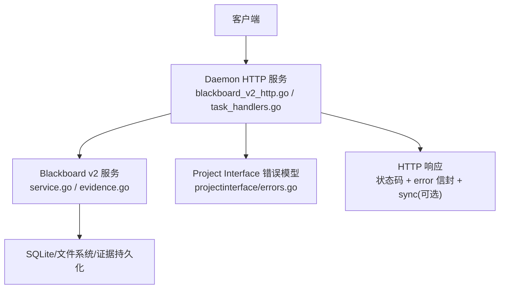
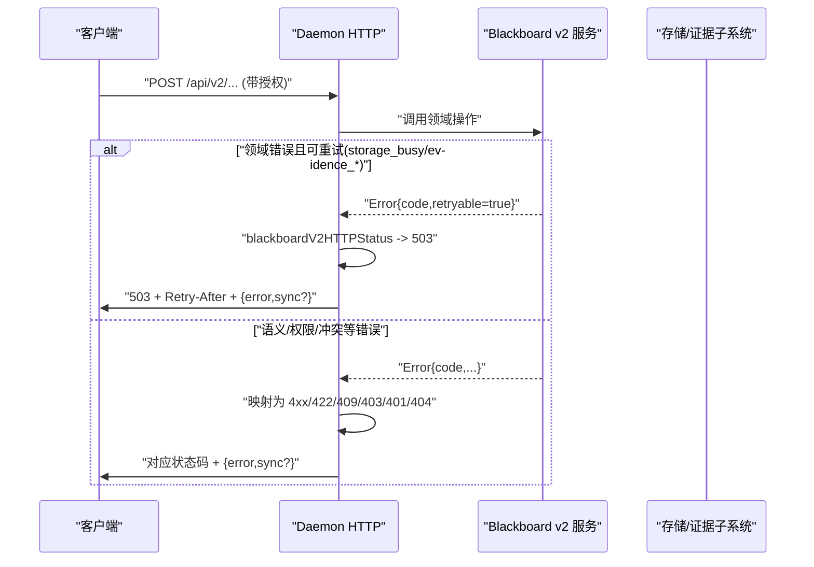
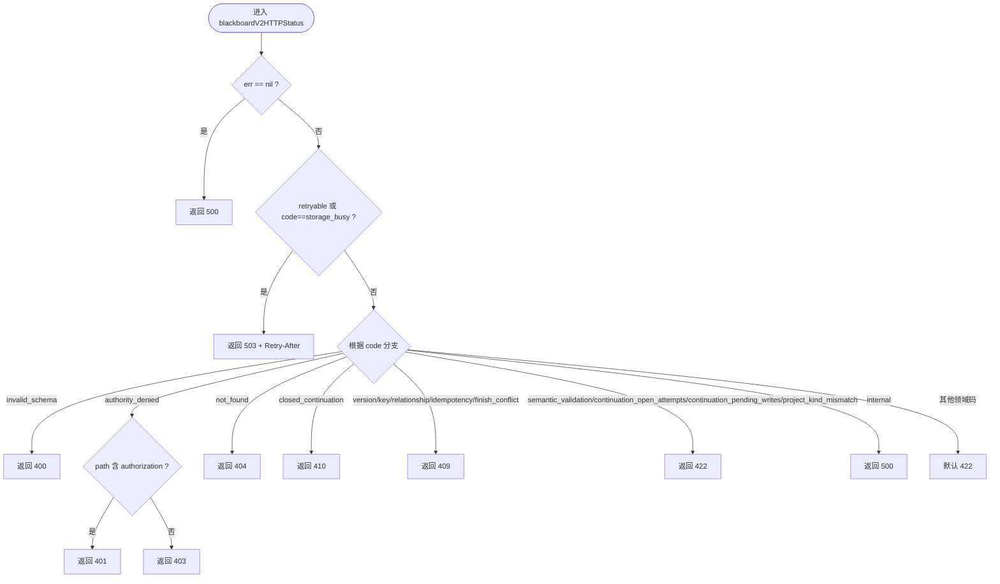
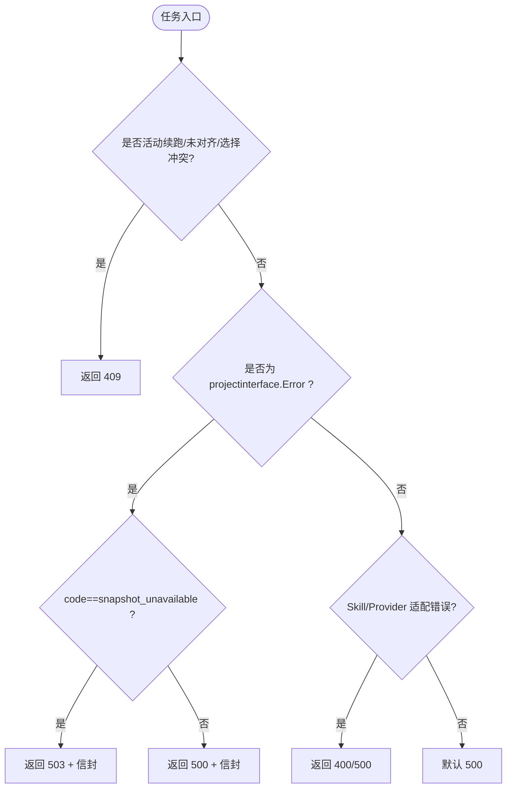
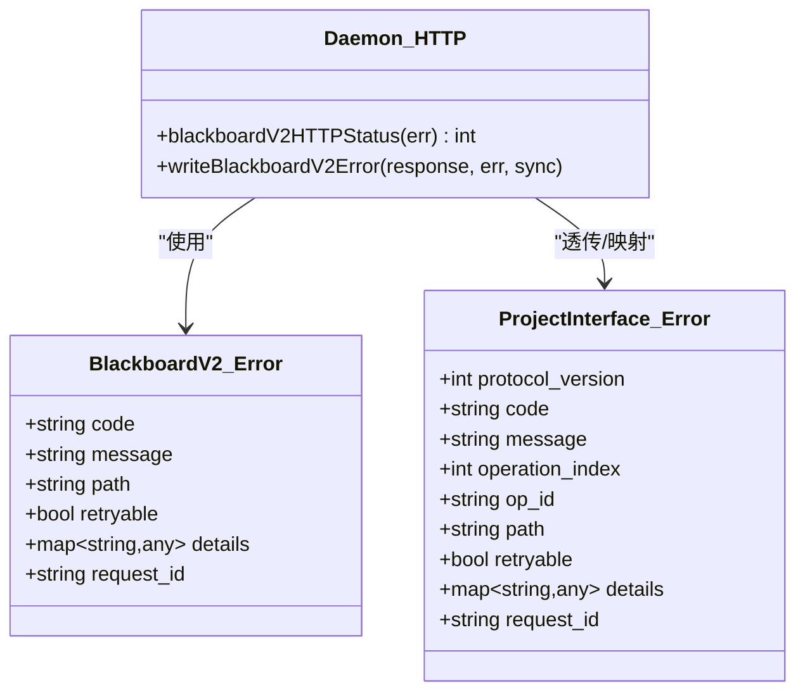

# 错误码与异常处理

<cite>
**本文引用的文件**   
- [internal/daemon/blackboard_v2_http.go](file://internal/daemon/blackboard_v2_http.go)
- [internal/daemon/task_handlers.go](file://internal/daemon/task_handlers.go)
- [internal/daemon/modelprovider_handlers.go](file://internal/daemon/modelprovider_handlers.go)
- [internal/daemon/modelprovider_migration_handlers.go](file://internal/daemon/modelprovider_migration_handlers.go)
- [internal/projectinterface/errors.go](file://internal/projectinterface/errors.go)
- [internal/blackboardv2/service.go](file://internal/blackboardv2/service.go)
- [internal/blackboardv2/evidence.go](file://internal/blackboardv2/evidence.go)
- [internal/blackboardv2/evidence_lock_unix.go](file://internal/blackboardv2/evidence_lock_unix.go)
- [internal/blackboardv2/evidence_lock_windows.go](file://internal/blackboardv2/evidence_lock_windows.go)
- [docs/specs/blackboard-runtime-protocol.md](file://docs/specs/blackboard-runtime-protocol.md)
- [internal/blackboardv2contract/contractdata/openapi.json](file://internal/blackboardv2contract/contractdata/openapi.json)
</cite>

## 目录
1. [简介](#简介)
2. [项目结构](#项目结构)
3. [核心组件](#核心组件)
4. [架构总览](#架构总览)
5. [详细组件分析](#详细组件分析)
6. [依赖关系分析](#依赖关系分析)
7. [性能考虑](#性能考虑)
8. [故障排查指南](#故障排查指南)
9. [结论](#结论)
10. [附录](#附录)

## 简介
本文件系统化梳理 CyberPenda 的错误码、HTTP 状态码映射、API 错误响应格式以及业务异常类型，覆盖 Blackboard v2 语义系统、Daemon HTTP 服务层与运行时/沙箱执行面的错误分类、消息结构与调试信息。文档同时提供错误处理最佳实践、重试策略与故障恢复指南，并给出常见错误场景的排查方法与解决方案。

## 项目结构
错误处理贯穿三层：
- 控制平面（Daemon HTTP）：统一将领域错误映射为 HTTP 状态码与结构化错误体；对可重试错误设置 Retry-After 头。
- 语义平面（Blackboard v2）：定义稳定的领域错误码与“可重试”标记，支撑幂等与并发安全。
- 接口契约（Project Interface）：对外暴露稳定错误信封，供传输适配器按协议映射到各自状态/退出码。

图表来源
- [internal/daemon/blackboard_v2_http.go:539-562](file://internal/daemon/blackboard_v2_http.go#L539-L562)
- [internal/daemon/blackboard_v2_http.go:612-643](file://internal/daemon/blackboard_v2_http.go#L612-L643)
- [internal/daemon/task_handlers.go:2077-2094](file://internal/daemon/task_handlers.go#L2077-L2094)
- [internal/projectinterface/errors.go:65-78](file://internal/projectinterface/errors.go#L65-L78)
- [internal/blackboardv2/service.go:620](file://internal/blackboardv2/service.go#L620)

章节来源
- [internal/daemon/blackboard_v2_http.go:539-562](file://internal/daemon/blackboard_v2_http.go#L539-L562)
- [internal/daemon/blackboard_v2_http.go:612-643](file://internal/daemon/blackboard_v2_http.go#L612-L643)
- [internal/daemon/task_handlers.go:2077-2094](file://internal/daemon/task_handlers.go#L2077-L2094)
- [internal/projectinterface/errors.go:65-78](file://internal/projectinterface/errors.go#L65-L78)
- [internal/blackboardv2/service.go:620](file://internal/blackboardv2/service.go#L620)

## 核心组件
- 错误信封与可重试标记
  - Project Interface 错误信封包含 code、message、path、retryable、details、request_id 等字段，作为跨模块的稳定失败形状。
  - Blackboard v2 错误同样具备 retryable 标记，用于驱动 HTTP 层的 503 与 Retry-After。
- HTTP 状态码映射
  - 针对 Blackboard v2 错误，Daemon 提供集中映射函数，将领域错误码转换为标准 HTTP 状态码。
  - 任务启动/续跑路径中，特定业务错误被映射为 409 Conflict 或 503 Service Unavailable。
- 结构化错误响应
  - Blackboard v2 错误响应统一返回 { error, sync? }，并在可重试时附带 Retry-After 头。
  - 非 v2 路径通常返回 { error: string } 或具体业务对象。

章节来源
- [internal/projectinterface/errors.go:65-78](file://internal/projectinterface/errors.go#L65-L78)
- [internal/blackboardv2/service.go:620](file://internal/blackboardv2/service.go#L620)
- [internal/daemon/blackboard_v2_http.go:539-562](file://internal/daemon/blackboard_v2_http.go#L539-L562)
- [internal/daemon/blackboard_v2_http.go:612-643](file://internal/daemon/blackboard_v2_http.go#L612-L643)
- [internal/daemon/task_handlers.go:3399-3431](file://internal/daemon/task_handlers.go#L3399-L3431)

## 架构总览
下图展示一次 Blackboard v2 写操作的错误处理流程，包括状态码映射、同步附件与重试提示。

图表来源
- [internal/daemon/blackboard_v2_http.go:539-562](file://internal/daemon/blackboard_v2_http.go#L539-L562)
- [internal/daemon/blackboard_v2_http.go:612-643](file://internal/daemon/blackboard_v2_http.go#L612-L643)
- [internal/blackboardv2/evidence.go:841](file://internal/blackboardv2/evidence.go#L841)
- [internal/blackboardv2/evidence.go:1420](file://internal/blackboardv2/evidence.go#L1420)
- [internal/blackboardv2/evidence.go:1461](file://internal/blackboardv2/evidence.go#L1461)
- [internal/blackboardv2/evidence.go:1518](file://internal/blackboardv2/evidence.go#L1518)
- [internal/blackboardv2/evidence.go:1528](file://internal/blackboardv2/evidence.go#L1528)
- [internal/blackboardv2/evidence.go:1574](file://internal/blackboardv2/evidence.go#L1574)
- [internal/blackboardv2/evidence.go:2355](file://internal/blackboardv2/evidence.go#L2355)
- [internal/blackboardv2/evidence.go:2368](file://internal/blackboardv2/evidence.go#L2368)

## 详细组件分析

### Blackboard v2 错误码与 HTTP 状态码映射
- 可重试错误
  - storage_busy 与所有 retryable=true 的错误均返回 503，并附带 Retry-After=1。
- 语义/校验错误
  - invalid_schema、semantic_validation、continuation_open_attempts、continuation_pending_writes、project_kind_mismatch 等映射为 422。
- 权限与认证
  - authority_denied：当 path 包含 authorization 时为 401，否则 403。
- 资源不存在
  - not_found -> 404。
- 关闭的 Continuation
  - closed_continuation -> 410 Gone。
- 冲突
  - version_conflict、key_conflict、relationship_conflict、idempotency_conflict、finish_conflict -> 409。
- 内部错误
  - internal -> 500。

图表来源
- [internal/daemon/blackboard_v2_http.go:612-643](file://internal/daemon/blackboard_v2_http.go#L612-L643)

章节来源
- [internal/daemon/blackboard_v2_http.go:612-643](file://internal/daemon/blackboard_v2_http.go#L612-L643)

### 任务相关错误映射（Task Launch/Resume/Steer）
- 任务启动/续跑阶段
  - 活动续跑/续跑未完全对齐/转向选择冲突 -> 409。
  - Project Interface 错误信封：snapshot_unavailable -> 503；其余按信封 code 映射。
  - Skill/Model Provider 适配错误：无效 skill、缺失 API Key/Provider/Model、协议不兼容 -> 400；其它 -> 500。
- 转向（steer）与权限交互
  - 会话关闭、控制冲突、服务端关闭等会记录生命周期事件并返回 202 Accepted（异步处理）。

图表来源
- [internal/daemon/task_handlers.go:3399-3431](file://internal/daemon/task_handlers.go#L3399-L3431)
- [internal/daemon/task_handlers.go:2077-2094](file://internal/daemon/task_handlers.go#L2077-L2094)
- [internal/daemon/task_handlers.go:2652-2675](file://internal/daemon/task_handlers.go#L2652-L2675)

章节来源
- [internal/daemon/task_handlers.go:3399-3431](file://internal/daemon/task_handlers.go#L3399-L3431)
- [internal/daemon/task_handlers.go:2077-2094](file://internal/daemon/task_handlers.go#L2077-L2094)
- [internal/daemon/task_handlers.go:2652-2675](file://internal/daemon/task_handlers.go#L2652-L2675)

### Model Provider 与迁移错误
- Model Provider
  - 未找到 -> 404；名称/基础 URL/协议/重复端点/非法端点 -> 400；使用中 -> 409；其它 -> 500。
- Model Provider 迁移
  - 未找到/不合规/缺少 provider id/配置不兼容 -> 400/404；其它 -> 500。

章节来源
- [internal/daemon/modelprovider_handlers.go:139-154](file://internal/daemon/modelprovider_handlers.go#L139-L154)
- [internal/daemon/modelprovider_migration_handlers.go:56-70](file://internal/daemon/modelprovider_migration_handlers.go#L56-L70)

### Evidence 发布与并发控制错误
- 并发/占位冲突
  - evidence_publication_in_progress：同一幂等键下已有发布者，返回可重试错误。
  - evidence_payload_gc_in_progress：清理进行中，返回可重试错误。
  - evidence_reservation_changed：保留变更，返回可重试错误。
- 平台差异
  - Unix/Windows 锁实现均返回相同领域错误码，确保跨平台一致行为。

章节来源
- [internal/blackboardv2/evidence.go:841](file://internal/blackboardv2/evidence.go#L841)
- [internal/blackboardv2/evidence.go:1420](file://internal/blackboardv2/evidence.go#L1420)
- [internal/blackboardv2/evidence.go:1461](file://internal/blackboardv2/evidence.go#L1461)
- [internal/blackboardv2/evidence.go:1518](file://internal/blackboardv2/evidence.go#L1518)
- [internal/blackboardv2/evidence.go:1528](file://internal/blackboardv2/evidence.go#L1528)
- [internal/blackboardv2/evidence.go:1574](file://internal/blackboardv2/evidence.go#L1574)
- [internal/blackboardv2/evidence.go:2355](file://internal/blackboardv2/evidence.go#L2355)
- [internal/blackboardv2/evidence.go:2368](file://internal/blackboardv2/evidence.go#L2368)
- [internal/blackboardv2/evidence_lock_unix.go:14](file://internal/blackboardv2/evidence_lock_unix.go#L14)
- [internal/blackboardv2/evidence_lock_windows.go:25](file://internal/blackboardv2/evidence_lock_windows.go#L25)

### 错误信封与数据结构
- Project Interface 错误信封
  - 字段：protocol_version、code、message、operation_index、op_id、path、retryable、details、request_id。
  - 构造器：ValidationError、InternalError；persistenceError 自动识别 SQLite 忙锁并标记 retryable。
- Blackboard v2 错误
  - 同样包含 retryable 字段，用于上层 HTTP 层判定 503 与 Retry-After。

章节来源
- [internal/projectinterface/errors.go:65-78](file://internal/projectinterface/errors.go#L65-L78)
- [internal/projectinterface/errors.go:87-113](file://internal/projectinterface/errors.go#L87-L113)
- [internal/blackboardv2/service.go:620](file://internal/blackboardv2/service.go#L620)

## 依赖关系分析
- Daemon HTTP 层依赖 Blackboard v2 错误模型与 Project Interface 错误信封，负责最终的状态码映射与响应封装。
- Blackboard v2 内部通过证据子系统与存储层交互，产生可重试错误以保护幂等与一致性。
- OpenAPI 契约定义了错误信封的结构与通用响应类别，便于客户端稳定解析。

图表来源
- [internal/daemon/blackboard_v2_http.go:539-562](file://internal/daemon/blackboard_v2_http.go#L539-L562)
- [internal/daemon/blackboard_v2_http.go:612-643](file://internal/daemon/blackboard_v2_http.go#L612-L643)
- [internal/projectinterface/errors.go:65-78](file://internal/projectinterface/errors.go#L65-L78)
- [internal/blackboardv2/service.go:620](file://internal/blackboardv2/service.go#L620)

章节来源
- [internal/daemon/blackboard_v2_http.go:539-562](file://internal/daemon/blackboard_v2_http.go#L539-L562)
- [internal/daemon/blackboard_v2_http.go:612-643](file://internal/daemon/blackboard_v2_http.go#L612-L643)
- [internal/projectinterface/errors.go:65-78](file://internal/projectinterface/errors.go#L65-L78)
- [internal/blackboardv2/service.go:620](file://internal/blackboardv2/service.go#L620)

## 性能考虑
- 可重试错误（如 storage_busy、evidence_*_in_progress）应配合指数退避与抖动，避免雪崩。
- 证据发布与 GC 并发路径存在短暂竞争窗口，客户端需容忍短时 503 并重试。
- 对于 422/409 等不可重试错误，应避免立即重试，优先修正请求参数或等待外部条件变化。

[本节为通用指导，无需源码引用]

## 故障排查指南
- 遇到 503 + Retry-After
  - 检查是否出现 storage_busy 或 evidence_publication_in_progress/evidence_payload_gc_in_progress。
  - 采用指数退避重试，必要时降低并发度。
- 遇到 409 Conflict
  - 检查是否存在版本冲突、键冲突、关系冲突、幂等键冲突或 Finish 冲突。
  - 确认请求幂等键唯一性与业务状态机约束。
- 遇到 422 Unprocessable Entity
  - 检查 schema 版本、语义校验规则、Continuation 生命周期约束。
- 遇到 401/403
  - 检查授权路径与 actor_forbidden 等权限错误。
- 遇到 404/410
  - 检查资源是否存在或 Continuation 是否已关闭。
- 任务启动/续跑失败
  - 若返回 snapshot_unavailable，稍后重试或检查快照渲染链路。
  - 若返回 409，检查活动续跑、续跑对齐或转向选择冲突。
  - 若返回 400，检查 Skill/Model Provider 配置（API Key、Provider、Model、协议兼容性）。

章节来源
- [internal/daemon/blackboard_v2_http.go:539-562](file://internal/daemon/blackboard_v2_http.go#L539-L562)
- [internal/daemon/blackboard_v2_http.go:612-643](file://internal/daemon/blackboard_v2_http.go#L612-L643)
- [internal/daemon/task_handlers.go:3399-3431](file://internal/daemon/task_handlers.go#L3399-L3431)
- [internal/daemon/task_handlers.go:2077-2094](file://internal/daemon/task_handlers.go#L2077-L2094)
- [internal/blackboardv2/evidence.go:841](file://internal/blackboardv2/evidence.go#L841)
- [internal/blackboardv2/evidence.go:1420](file://internal/blackboardv2/evidence.go#L1420)
- [internal/blackboardv2/evidence.go:1518](file://internal/blackboardv2/evidence.go#L1518)

## 结论
本项目通过统一的错误信封与明确的 HTTP 状态码映射，实现了跨模块一致的错误语义与可观测性。Blackboard v2 的可重试标记与 Daemon 层的 Retry-After 机制共同保障了高可用与幂等性。遵循本文的重试策略与排查建议，可有效提升系统的稳定性与排障效率。

[本节为总结，无需源码引用]

## 附录

### HTTP 状态码与错误分类速查
- 200 OK：成功
- 202 Accepted：异步接受（如 steer/权限决策）
- 304 Not Modified：ETag 未变（读操作）
- 400 Bad Request：请求体/协议版本/结构问题
- 401 Unauthorized：认证失败
- 403 Forbidden：授权不足
- 404 Not Found：资源不存在
- 409 Conflict：版本/键/关系/幂等/Finish 冲突
- 422 Unprocessable Entity：语义/生命周期/端点矩阵/不变量校验失败
- 429 Too Many Requests：显式本地限流（含 Retry-After）
- 500 Internal Server Error：意外内部错误
- 503 Service Unavailable：可重试（storage_busy/evidence_*_in_progress），含 Retry-After

章节来源
- [docs/specs/blackboard-runtime-protocol.md:580-598](file://docs/specs/blackboard-runtime-protocol.md#L580-L598)
- [internal/daemon/blackboard_v2_http.go:612-643](file://internal/daemon/blackboard_v2_http.go#L612-L643)

### API 错误响应格式
- Blackboard v2 错误响应
  - 结构：{ error: BlackboardV2_Error, sync?: SynchronizationAttachment }
  - 头部：Cache-Control=no-store；可重试时附加 Retry-After
- Project Interface 错误信封
  - 结构：{ protocol_version, code, message, operation_index, op_id, path, retryable, details, request_id }
- 非 v2 路径
  - 常见：{ error: string } 或具体业务对象

章节来源
- [internal/daemon/blackboard_v2_http.go:539-562](file://internal/daemon/blackboard_v2_http.go#L539-L562)
- [internal/projectinterface/errors.go:65-78](file://internal/projectinterface/errors.go#L65-L78)
- [internal/blackboardv2contract/contractdata/openapi.json:871-927](file://internal/blackboardv2contract/contractdata/openapi.json#L871-L927)

### 重试策略与故障恢复
- 何时重试
  - 503（storage_busy、evidence_*_in_progress、payload_gc_in_progress）
  - 429（显式限流）
- 如何重试
  - 指数退避 + 随机抖动；限制最大重试次数
  - 对幂等操作使用稳定 request_id/idempotency_key
- 何时不重试
  - 400/401/403/404/409/422/500（除非明确指示）
- 恢复要点
  - 证据发布：等待 GC 完成或换用新幂等键
  - 续跑/对齐：先解决冲突再重试
  - 快照不可用：延迟重试或检查渲染链路

章节来源
- [internal/daemon/blackboard_v2_http.go:539-562](file://internal/daemon/blackboard_v2_http.go#L539-L562)
- [internal/blackboardv2/evidence.go:841](file://internal/blackboardv2/evidence.go#L841)
- [internal/blackboardv2/evidence.go:1420](file://internal/blackboardv2/evidence.go#L1420)
- [internal/blackboardv2/evidence.go:1518](file://internal/blackboardv2/evidence.go#L1518)
- [docs/specs/blackboard-runtime-protocol.md:580-598](file://docs/specs/blackboard-runtime-protocol.md#L580-L598)