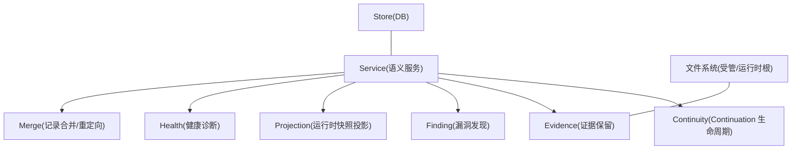
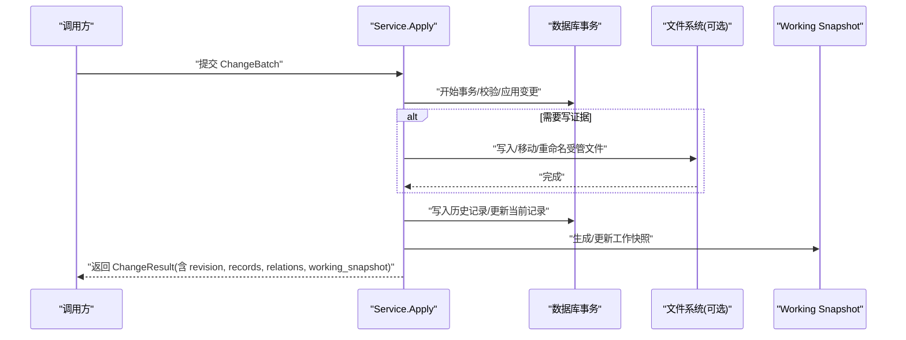
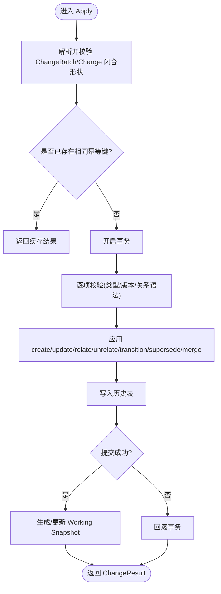
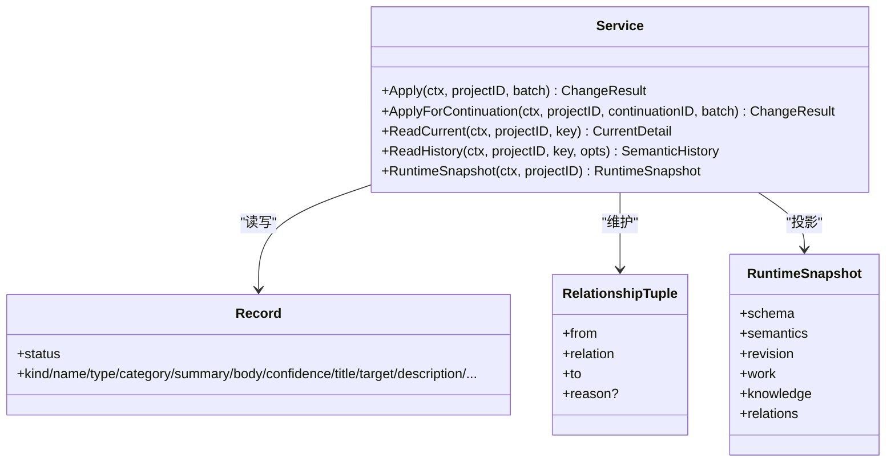
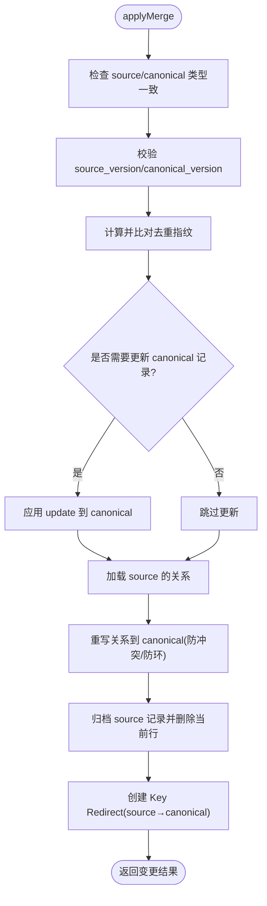
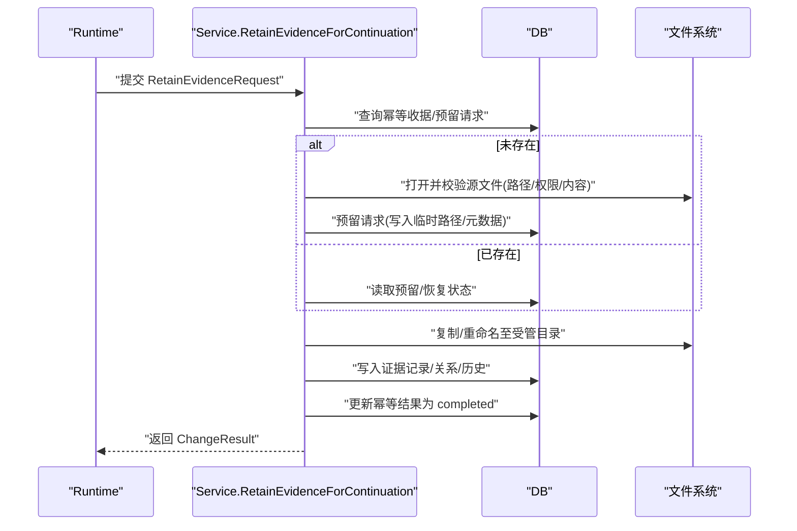
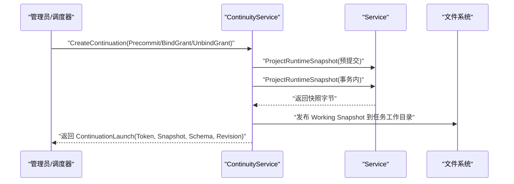
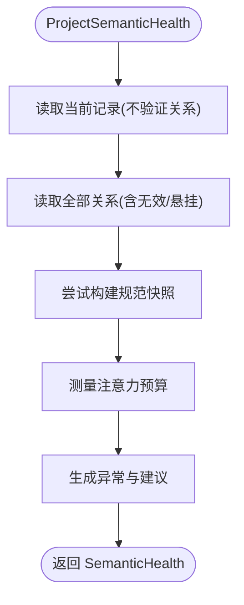
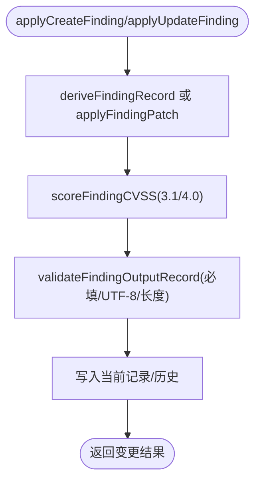
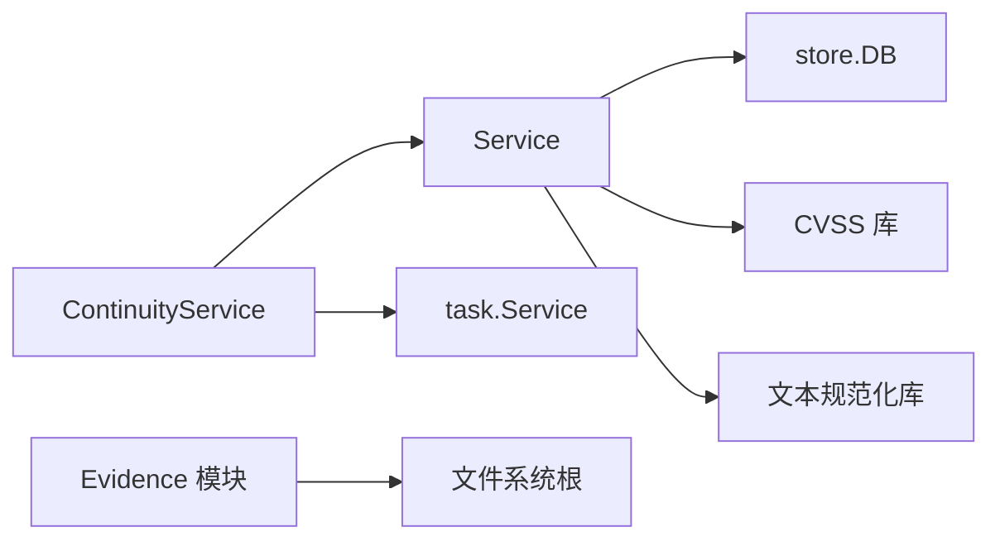

# Blackboard v2 语义系统

<cite>
**本文引用的文件**   
- [service.go](file://internal/blackboardv2/service.go)
- [continuity.go](file://internal/blackboardv2/continuity.go)
- [evidence.go](file://internal/blackboardv2/evidence.go)
- [finding.go](file://internal/blackboardv2/finding.go)
- [projection.go](file://internal/blackboardv2/projection.go)
- [health.go](file://internal/blackboardv2/health.go)
- [merge.go](file://internal/blackboardv2/merge.go)
- [entity_service_test.go](file://internal/blackboardv2/entity_service_test.go)
- [relationship_service_test.go](file://internal/blackboardv2/relationship_service_test.go)
- [fact_service_test.go](file://internal/blackboardv2/fact_service_test.go)
</cite>

## 目录
1. [简介](#简介)
2. [项目结构](#项目结构)
3. [核心组件](#核心组件)
4. [架构总览](#架构总览)
5. [详细组件分析](#详细组件分析)
6. [依赖关系分析](#依赖关系分析)
7. [性能与可扩展性](#性能与可扩展性)
8. [故障排查指南](#故障排查指南)
9. [结论](#结论)
10. [附录：API 使用示例与最佳实践](#附录api-使用示例与最佳实践)

## 简介
Blackboard v2 是 CyberPenda 的“记忆平面”，以原子化的语义变更批处理为核心，提供实体、关系、事实、发现、证据等数据模型与版本化历史、快照生成与恢复、Continuation 生命周期管理、健康诊断、投影合并以及 trusted tool 边界控制。它通过强一致的事务与幂等机制，确保多任务并发下的知识一致性，并为运行时（Runtime）提供最小且稳定的工作快照。

## 项目结构
Blackboard v2 位于 internal/blackboardv2 包中，围绕 Service 暴露统一的语义服务接口；continuity 负责 Continuation 生命周期与同步；evidence 负责受管证据保留与完整性校验；finding 封装漏洞发现的创建/更新与 CVSS 评分推导；projection 负责将当前状态投影为可发布的 runtime-blackboard/v2 文档；health 提供只读健康诊断；merge 提供记录合并与关系重定向能力。测试覆盖关键路径与边界条件。

图表来源
- [service.go:40-70](file://internal/blackboardv2/service.go#L40-L70)
- [continuity.go:119-134](file://internal/blackboardv2/continuity.go#L119-L134)
- [evidence.go:24-31](file://internal/blackboardv2/evidence.go#L24-L31)
- [projection.go:50-68](file://internal/blackboardv2/projection.go#L50-L68)
- [health.go:84-183](file://internal/blackboardv2/health.go#L84-L183)
- [merge.go:91-138](file://internal/blackboardv2/merge.go#L91-L138)

章节来源
- [service.go:40-70](file://internal/blackboardv2/service.go#L40-L70)
- [continuity.go:119-134](file://internal/blackboardv2/continuity.go#L119-L134)
- [evidence.go:24-31](file://internal/blackboardv2/evidence.go#L24-L31)
- [projection.go:50-68](file://internal/blackboardv2/projection.go#L50-L68)
- [health.go:84-183](file://internal/blackboardv2/health.go#L84-L183)
- [merge.go:91-138](file://internal/blackboardv2/merge.go#L91-L138)

## 核心组件
- 语义变更批处理与幂等
  - ChangeBatch/Change 定义统一操作集合（create/update/relate/unrelate/transition/supersede/merge），在 DTO 层强制关闭字段集，拒绝未知字段。
  - Apply/ApplyForContinuation 在事务内执行，返回 ChangeResult（包含 revision、变更记录、关系变更与工作快照指针）。
- 数据模型
  - Entity/Fact/Finding/Solution/Evidence 等记录类型及其 Patch 形状；Record 作为聚合输出形态，按类型选择序列化分支。
- 版本控制与历史
  - 每个记录维护 version，关系维护独立 version；所有变更写入 history 表，支持分页游标读取。
- 快照与投影
  - RuntimeSnapshot(runtime-blackboard/v2) 仅包含运行时可见的最小字段；ProjectRuntimeSnapshot 提供字节级精确投影用于持久化与同步。
- 信任边界
  - ApplyForContinuation 要求可信 Continuation ID；RetainEvidenceForContinuation 限制来源路径到 Task 根目录并校验完整性。
- 健康诊断
  - ProjectSemanticHealth 只读扫描，报告关系完整性、证据完整性、注意力预算与健康建议。

章节来源
- [service.go:72-147](file://internal/blackboardv2/service.go#L72-L147)
- [service.go:234-396](file://internal/blackboardv2/service.go#L234-L396)
- [service.go:414-533](file://internal/blackboardv2/service.go#L414-L533)
- [service.go:525-614](file://internal/blackboardv2/service.go#L525-L614)
- [service.go:644-656](file://internal/blackboardv2/service.go#L644-L656)
- [evidence.go:194-360](file://internal/blackboardv2/evidence.go#L194-L360)
- [projection.go:50-85](file://internal/blackboardv2/projection.go#L50-L85)
- [health.go:84-183](file://internal/blackboardv2/health.go#L84-L183)

## 架构总览
Blackboard v2 采用“服务 + 存储 + 文件系统”的分层设计：
- 服务层：Service 提供语义 API；ContinuityService 协调 Launch/BindGrant/UnbindGrant 与 Working Snapshot 发布。
- 存储层：基于 Store 的事务读写，保证幂等、版本冲突检测与历史归档。
- 文件系统：受管证据根与运行时根隔离，严格路径白名单与完整性校验。

图表来源
- [service.go:644-656](file://internal/blackboardv2/service.go#L644-L656)
- [evidence.go:194-360](file://internal/blackboardv2/evidence.go#L194-L360)
- [projection.go:50-85](file://internal/blackboardv2/projection.go#L50-L85)

## 详细组件分析

### 原子性变更批处理与版本控制
- 幂等键与冲突检测
  - ChangeBatch.IdempotencyKey 全局唯一；重复提交返回相同结果；若语义不同则返回 idempotency_conflict。
- 版本冲突
  - update/relate/unrelate 等需指定 version；不匹配时返回 version_conflict，附带 expected/current_version 与 next_action。
- 历史与回滚
  - 所有变更均写入 record_history/relationship_history；失败时事务回滚，保证最终一致性。

图表来源
- [service.go:72-147](file://internal/blackboardv2/service.go#L72-L147)
- [service.go:644-656](file://internal/blackboardv2/service.go#L644-L656)
- [merge.go:24-89](file://internal/blackboardv2/merge.go#L24-89)

章节来源
- [service.go:72-147](file://internal/blackboardv2/service.go#L72-L147)
- [service.go:644-656](file://internal/blackboardv2/service.go#L644-L656)
- [merge.go:24-89](file://internal/blackboardv2/merge.go#L24-89)

### 数据模型设计（Entity/Fact/Finding/Solution/Evidence）
- Entity
  - 支持 active/retired/superseded 等状态；part_of/about 等关系约束；locator/credential_ref 安全校验。
- Fact
  - confidence 通过 transition 驱动；supersede 保持被替代事实的历史关系；confirmed 需要支撑基础。
- Finding
  - 由服务端推导 severity/cvss_pending；confirmed 必须满足 target/proof/impact/recommendation 完整且有效 CVSS。
- Solution/Evidence
  - Evidence 通过 RetainEvidenceForContinuation 受管保留，关联 attempt 与目标记录。

图表来源
- [service.go:234-396](file://internal/blackboardv2/service.go#L234-L396)
- [service.go:483-533](file://internal/blackboardv2/service.go#L483-L533)
- [service.go:525-614](file://internal/blackboardv2/service.go#L525-L614)

章节来源
- [service.go:234-396](file://internal/blackboardv2/service.go#L234-L396)
- [service.go:483-533](file://internal/blackboardv2/service.go#L483-L533)
- [service.go:525-614](file://internal/blackboardv2/service.go#L525-L614)

### 关系与合并（Merge/Supersede/Unrelate）
- 关系
  - relate/unrelate 支持 reason 信息；unrelate 记录历史并删除当前边；version 冲突保护。
- Merge
  - 将 source 合并到 canonical，重写关系、建立 Key Redirect，避免自环与循环依赖。
- Supersede
  - 标记 replaced 为 superseded，插入 supersedes 关系，替换后从当前上下文移除。

图表来源
- [merge.go:91-238](file://internal/blackboardv2/merge.go#L91-L238)

章节来源
- [merge.go:91-238](file://internal/blackboardv2/merge.go#L91-L238)
- [relationship_service_test.go:252-310](file://internal/blackboardv2/relationship_service_test.go#L252-L310)
- [relationship_service_test.go:312-368](file://internal/blackboardv2/relationship_service_test.go#L312-L368)

### 证据保留与完整性（RetainEvidenceForContinuation）
- 可信来源
  - 仅允许来自 Task 的 /task/workdir 或 /task/artifacts 路径；禁止符号链接与越界访问。
- 幂等与恢复
  - 基于请求哈希与 idempotency_key 的幂等；支持断点续传与离线恢复；失败注入点保障可重试。
- 完整性
  - 计算 SHA256 与 size，持久化元数据；语义提交前再次校验，失败则清理。

图表来源
- [evidence.go:194-360](file://internal/blackboardv2/evidence.go#L194-L360)
- [evidence.go:540-608](file://internal/blackboardv2/evidence.go#L540-L608)
- [evidence.go:705-773](file://internal/blackboardv2/evidence.go#L705-L773)

章节来源
- [evidence.go:194-360](file://internal/blackboardv2/evidence.go#L194-L360)
- [evidence.go:540-608](file://internal/blackboardv2/evidence.go#L540-L608)
- [evidence.go:705-773](file://internal/blackboardv2/evidence.go#L705-L773)

### Continuation 生命周期与同步
- 授权与绑定
  - AuthorizeContinuationBinding 校验 Project/Task/Continuation 绑定与 Live 状态；InspectContinuationSynchronization 提供同步上下文。
- 同步交付
  - ClaimTrustedSynchronization/CaptureTrustedSynchronization 实现“先发布再提交”的 crash-safe 同步；支持丢失响应重放。
- 启动与凭证
  - CreateContinuation 在事务中生成一次性 Token、投影快照并可选择 BindGrant/UnbindGrant。

图表来源
- [continuity.go:154-205](file://internal/blackboardv2/continuity.go#L154-L205)
- [continuity.go:221-325](file://internal/blackboardv2/continuity.go#L221-L325)
- [continuity.go:345-389](file://internal/blackboardv2/continuity.go#L345-L389)
- [continuity.go:764-800](file://internal/blackboardv2/continuity.go#L764-L800)

章节来源
- [continuity.go:154-205](file://internal/blackboardv2/continuity.go#L154-L205)
- [continuity.go:221-325](file://internal/blackboardv2/continuity.go#L221-L325)
- [continuity.go:345-389](file://internal/blackboardv2/continuity.go#L345-L389)
- [continuity.go:764-800](file://internal/blackboardv2/continuity.go#L764-L800)

### 健康诊断与注意力预算
- 诊断范围
  - 关系完整性（悬挂边、非法端点、循环）、证据完整性（缺失/校验失败）、注意力预算（字节/估计 token 阈值）。
- 产出
  - SemanticHealth 包含 status/anomalies/proposals；Complete/Launchable 指示快照可用性。

图表来源
- [health.go:84-183](file://internal/blackboardv2/health.go#L84-L183)
- [health.go:335-391](file://internal/blackboardv2/health.go#L335-L391)
- [health.go:404-431](file://internal/blackboardv2/health.go#L404-L431)

章节来源
- [health.go:84-183](file://internal/blackboardv2/health.go#L84-L183)
- [health.go:335-391](file://internal/blackboardv2/health.go#L335-L391)
- [health.go:404-431](file://internal/blackboardv2/health.go#L404-L431)

### 漏洞发现（Finding）与 CVSS 评分
- 创建/更新
  - deriveFindingRecord 根据 cvss_version/cvss_vector 推导 severity/cvss_pending；update 支持 clear 字段。
- 确认约束
  - confirmed 必须包含 target/proof/impact/recommendation 且 CVSS 向量完整有效。

图表来源
- [finding.go:32-108](file://internal/blackboardv2/finding.go#L32-L108)
- [finding.go:110-168](file://internal/blackboardv2/finding.go#L110-L168)
- [finding.go:214-248](file://internal/blackboardv2/finding.go#L214-L248)
- [finding.go:250-304](file://internal/blackboardv2/finding.go#L250-L304)

章节来源
- [finding.go:32-108](file://internal/blackboardv2/finding.go#L32-L108)
- [finding.go:110-168](file://internal/blackboardv2/finding.go#L110-L168)
- [finding.go:214-248](file://internal/blackboardv2/finding.go#L214-L248)
- [finding.go:250-304](file://internal/blackboardv2/finding.go#L250-L304)

## 依赖关系分析
- 内部依赖
  - Service 依赖 store.DB 进行事务读写；ContinuityService 组合 Service 与 task.Service、grant 存储；Evidence 依赖文件系统根配置。
- 外部依赖
  - CVSS 库用于评分；文本规范化库用于 merge 指纹计算。
- 耦合与内聚
  - Service 高内聚于语义规则；Continuity 与 Evidence 分别聚焦生命周期与持久化，职责清晰。

图表来源
- [service.go:40-70](file://internal/blackboardv2/service.go#L40-L70)
- [continuity.go:119-134](file://internal/blackboardv2/continuity.go#L119-L134)
- [evidence.go:24-31](file://internal/blackboardv2/evidence.go#L24-L31)
- [finding.go:11-13](file://internal/blackboardv2/finding.go#L11-L13)
- [merge.go:16](file://internal/blackboardv2/merge.go#L16)

章节来源
- [service.go:40-70](file://internal/blackboardv2/service.go#L40-L70)
- [continuity.go:119-134](file://internal/blackboardv2/continuity.go#L119-L134)
- [evidence.go:24-31](file://internal/blackboardv2/evidence.go#L24-L31)
- [finding.go:11-13](file://internal/blackboardv2/finding.go#L11-L13)
- [merge.go:16](file://internal/blackboardv2/merge.go#L16)

## 性能与可扩展性
- 快照投影
  - 使用固定字节编码与注意力预算估算，便于监控与决策；Large Snapshot 触发健康建议而非阻断。
- 并发与锁
  - 写锁与快照锁分离，减少竞争；事务粒度最小化。
- 扩展点
  - 证据失败注入点、连续性失败注入点便于测试与弹性恢复。

[本节为通用指导，无需源码引用]

## 故障排查指南
- 常见错误码
  - authority_denied：Continuation 身份不合法或未绑定。
  - semantic_validation：字段/关系/置信度/证据完整性等语义校验失败。
  - version_conflict：期望版本与实际不一致。
  - idempotency_conflict：同一幂等键语义不一致。
  - not_found：记录/关系不存在。
- 定位步骤
  - 查看 ChangeResult/History 中的 revision/version 与 items。
  - 对证据问题，检查 managed_path/sha256/size 与文件系统完整性。
  - 对关系问题，检查 grammar 与 reason 长度/必要性。
  - 对健康告警，关注 attention 状态与 anomalies 列表。

章节来源
- [service.go:616-630](file://internal/blackboardv2/service.go#L616-L630)
- [evidence.go:476-517](file://internal/blackboardv2/evidence.go#L476-L517)
- [health.go:335-391](file://internal/blackboardv2/health.go#L335-L391)

## 结论
Blackboard v2 以强一致的原子批处理为基础，结合严格的 DTO 闭合校验、版本化历史、最小化运行时快照与可信边界控制，构建了稳定可靠的语义知识平台。其健康诊断与合并能力进一步提升了系统的可观测性与可维护性。

[本节为总结，无需源码引用]

## 附录：API 使用示例与最佳实践

- 创建实体与事实并建立关系
  - 参考用例：实体拓扑创建、关系 about/part_of、跨项目隔离校验。
  - 参考路径
    - [entity_service_test.go:17-159](file://internal/blackboardv2/entity_service_test.go#L17-L159)

- 事实更新、清空字段与幂等回放
  - 参考用例：update 部分字段、clear 清空 body、exact no-op 与 stale version 冲突。
  - 参考路径
    - [fact_service_test.go:21-238](file://internal/blackboardv2/fact_service_test.go#L21-L238)

- 关系版本连续性与合并碰撞安全
  - 参考用例：unrelate/recreate 版本递增、merge 重写关系版本冲突。
  - 参考路径
    - [relationship_service_test.go:252-310](file://internal/blackboardv2/relationship_service_test.go#L252-L310)
    - [relationship_service_test.go:312-368](file://internal/blackboardv2/relationship_service_test.go#L312-L368)

- 可信 Continuation 的受限确认
  - 参考用例：owner/peer produced fact 的确认边界、跨项目隔离。
  - 参考路径
    - [fact_service_test.go:522-710](file://internal/blackboardv2/fact_service_test.go#L522-L710)

- 最佳实践
  - 始终使用幂等键；在批量操作中尽量合并相关变更。
  - 使用 transition 修改置信度/状态，避免直接写派生字段。
  - 证据保留使用 RetainEvidenceForContinuation，并确保 links 指向当前记录。
  - 大快照场景下关注健康诊断，必要时启动 Reason Task 进行整合。

章节来源
- [entity_service_test.go:17-159](file://internal/blackboardv2/entity_service_test.go#L17-L159)
- [fact_service_test.go:21-238](file://internal/blackboardv2/fact_service_test.go#L21-L238)
- [relationship_service_test.go:252-310](file://internal/blackboardv2/relationship_service_test.go#L252-L310)
- [relationship_service_test.go:312-368](file://internal/blackboardv2/relationship_service_test.go#L312-L368)
- [fact_service_test.go:522-710](file://internal/blackboardv2/fact_service_test.go#L522-L710)