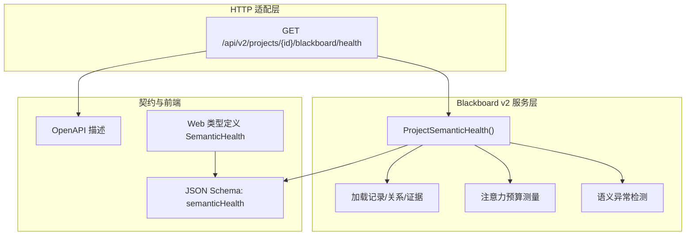
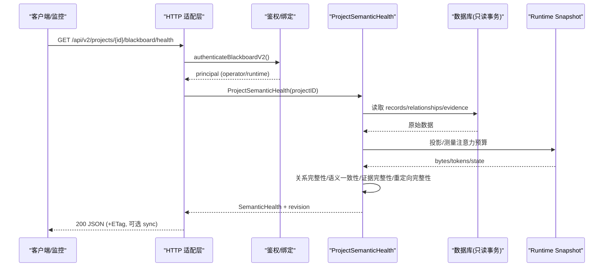
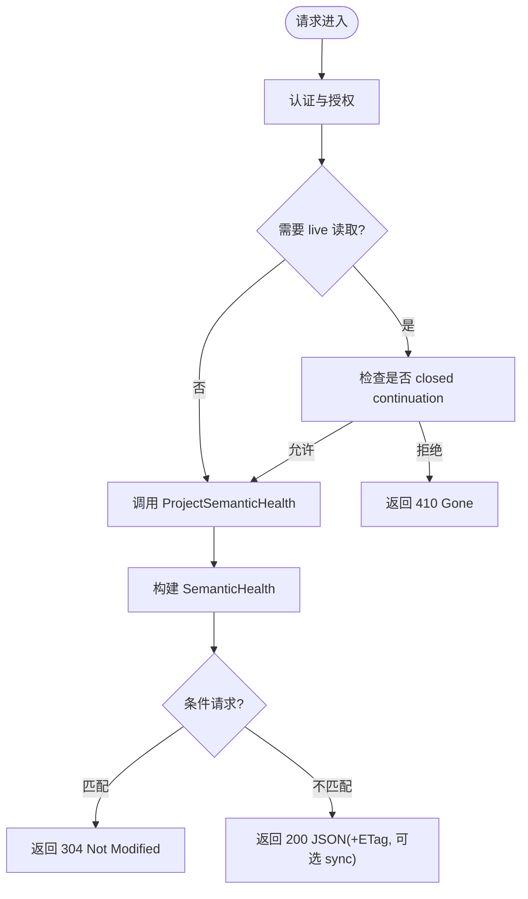
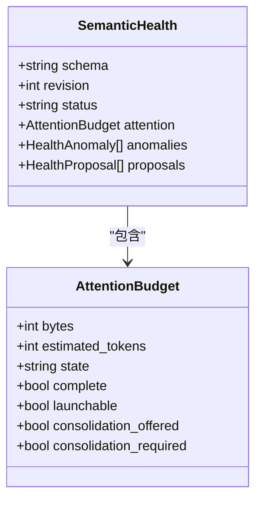
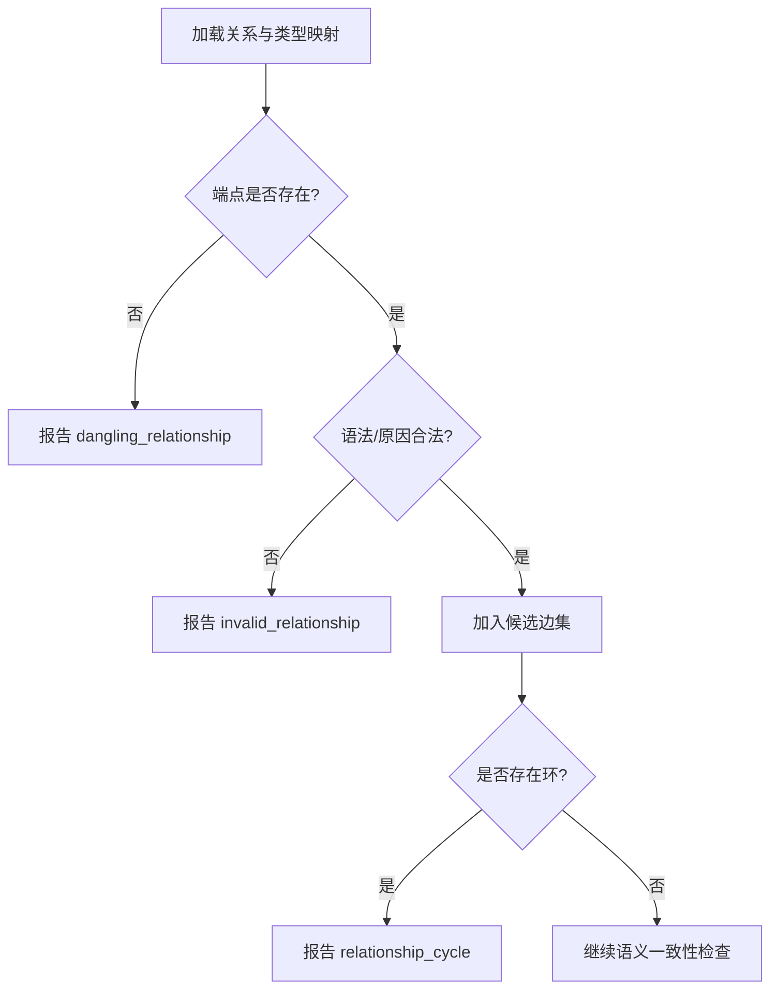
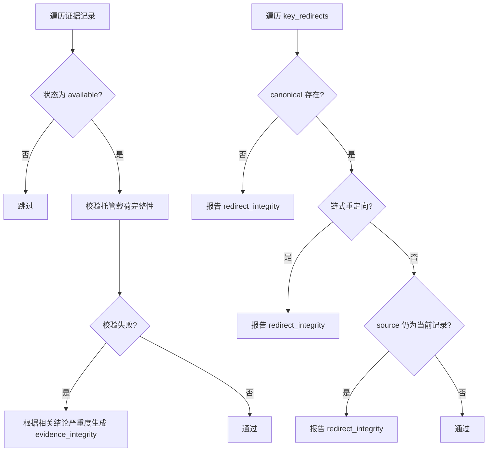
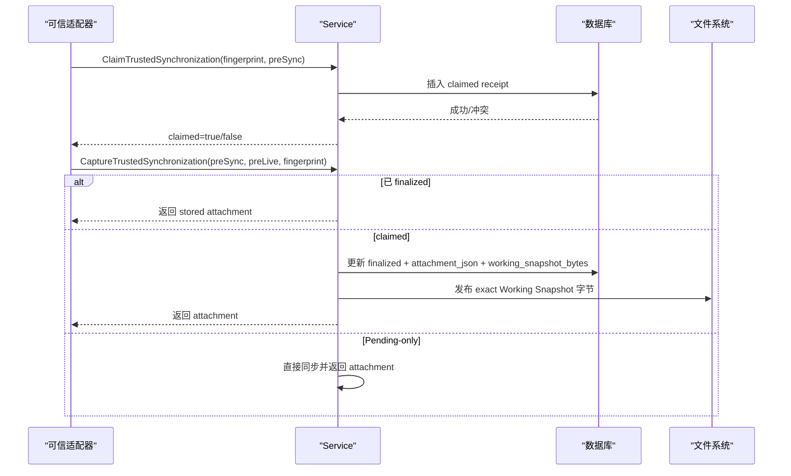
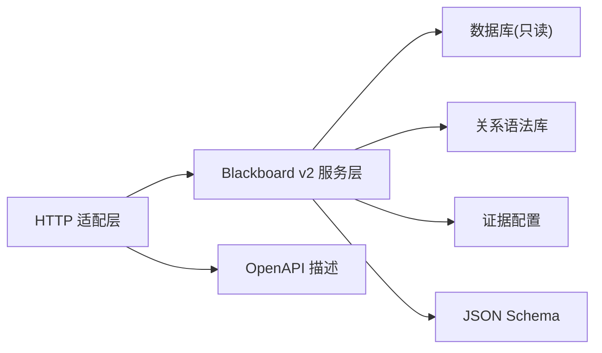

# 健康诊断与监控

<cite>
**本文引用的文件**   
- [health.go](file://internal/blackboardv2/health.go)
- [continuity.go](file://internal/blackboardv2/continuity.go)
- [blackboard_v2_http.go](file://internal/daemon/blackboard_v2_http.go)
- [blackboard-v2.schema.json](file://internal/blackboardv2contract/contractdata/schemas/blackboard-v2.schema.json)
- [openapi.json](file://internal/blackboardv2contract/contractdata/openapi.json)
- [health_service_test.go](file://internal/blackboardv2/health_service_test.go)
- [continuity_restore_test.go](file://internal/blackboardv2/continuity_restore_test.go)
- [mcp_test.go](file://internal/daemon/mcp_test.go)
- [server_test.go](file://internal/daemon/server_test.go)
</cite>

## 目录
1. [简介](#简介)
2. [项目结构](#项目结构)
3. [核心组件](#核心组件)
4. [架构总览](#架构总览)
5. [详细组件分析](#详细组件分析)
6. [依赖关系分析](#依赖关系分析)
7. [性能考量](#性能考量)
8. [故障排查指南](#故障排查指南)
9. [结论](#结论)
10. [附录](#附录)

## 简介
本文件面向 Blackboard v2 健康诊断系统，系统性阐述健康检查端点、指标收集与异常检测机制，重点覆盖 Continuity 连续性保障、数据一致性验证与完整性测试。文档同时给出结构化输出规范、告警触发条件与恢复建议，并提供健康监控集成示例与自定义诊断规则的扩展方法，帮助通过健康检查提升系统的可靠性与可观测性。

## 项目结构
Blackboard v2 健康能力由服务层（语义健康计算）、HTTP 适配层（对外暴露 /health）以及契约定义（JSON Schema/OpenAPI）组成；Continuity 子系统提供工作快照同步与幂等重放能力，确保健康诊断在崩溃/重试场景下的确定性。

图表来源
- [blackboard_v2_http.go:34-36](file://internal/daemon/blackboard_v2_http.go#L34-L36)
- [blackboard_v2_http.go:144-159](file://internal/daemon/blackboard_v2_http.go#L144-L159)
- [health.go:83-183](file://internal/blackboardv2/health.go#L83-L183)
- [blackboard-v2.schema.json:3394-3431](file://internal/blackboardv2contract/contractdata/schemas/blackboard-v2.schema.json#L3394-L3431)
- [openapi.json:178-218](file://internal/blackboardv2contract/contractdata/openapi.json#L178-L218)

章节来源
- [blackboard_v2_http.go:34-36](file://internal/daemon/blackboard_v2_http.go#L34-L36)
- [blackboard_v2_http.go:144-159](file://internal/daemon/blackboard_v2_http.go#L144-L159)
- [health.go:83-183](file://internal/blackboardv2/health.go#L83-L183)
- [blackboard-v2.schema.json:3394-3431](file://internal/blackboardv2contract/contractdata/schemas/blackboard-v2.schema.json#L3394-L3431)
- [openapi.json:178-218](file://internal/blackboardv2contract/contractdata/openapi.json#L178-L218)

## 核心组件
- 健康状态与严重级别：定义健康状态（healthy/attention/warning/critical）与异常严重级别（info/warning/critical），用于聚合项目级健康结果。
- 语义健康 DTO：包含 schema、revision、status、attention、anomalies、proposals，作为只读诊断输出，不修改知识且不阻塞启动。
- 注意力预算：基于 Runtime Snapshot 的字节数与估计 token 数，划分 within_target/above_target/warning/required 四档，并在 warning/required 时提供“合并”建议提案。
- 异常检测器：
  - 关系完整性：悬挂边、非法端点语法、原因长度/必填违规、循环关系。
  - 语义一致性：悬空目标/尝试、已满足但未关闭的目标、缺失证据、未解决矛盾。
  - 证据完整性：证据可用但托管载荷缺失或校验失败。
  - Key 重定向完整性：指向不存在的主键、链式重定向、源仍为当前记录。
- HTTP 健康端点：GET /api/v2/projects/{id}/blackboard/health，支持 ETag 条件请求与可选同步附件。

章节来源
- [health.go:15-77](file://internal/blackboardv2/health.go#L15-L77)
- [health.go:83-183](file://internal/blackboardv2/health.go#L83-L183)
- [health.go:335-391](file://internal/blackboardv2/health.go#L335-L391)
- [health.go:404-431](file://internal/blackboardv2/health.go#L404-L431)
- [health.go:433-621](file://internal/blackboardv2/health.go#L433-L621)
- [health.go:623-685](file://internal/blackboardv2/health.go#L623-L685)
- [health.go:713-791](file://internal/blackboardv2/health.go#L713-L791)
- [blackboard_v2_http.go:144-159](file://internal/daemon/blackboard_v2_http.go#L144-L159)

## 架构总览
健康诊断流程从 HTTP 入口进入，经认证与权限校验后调用服务层的 ProjectSemanticHealth，后者以只读事务读取记录、关系与证据，结合运行时快照进行注意力预算测量与多类异常检测，最终返回结构化健康 DTO。

图表来源
- [blackboard_v2_http.go:144-159](file://internal/daemon/blackboard_v2_http.go#L144-L159)
- [health.go:83-183](file://internal/blackboardv2/health.go#L83-L183)
- [health.go:190-289](file://internal/blackboardv2/health.go#L190-L289)
- [health.go:291-333](file://internal/blackboardv2/health.go#L291-L333)

## 详细组件分析

### 健康检查端点与协议
- 路由注册：GET /api/v2/projects/{id}/blackboard/health
- 认证模型：支持 operator 与 trusted Continuation 两种身份；closed continuation 不支持 live 读取
- 响应特性：
  - 返回 SemanticHealth，schema=blackboard-health/v2，revision 用于 ETag
  - 支持 If-None-Match 304 缓存控制
  - 可选附加同步附件（sync），用于幂等重放与 Pending 通知

图表来源
- [blackboard_v2_http.go:34-36](file://internal/daemon/blackboard_v2_http.go#L34-L36)
- [blackboard_v2_http.go:144-159](file://internal/daemon/blackboard_v2_http.go#L144-L159)
- [blackboard_v2_http.go:375-438](file://internal/daemon/blackboard_v2_http.go#L375-L438)
- [openapi.json:178-218](file://internal/blackboardv2contract/contractdata/openapi.json#L178-L218)

章节来源
- [blackboard_v2_http.go:34-36](file://internal/daemon/blackboard_v2_http.go#L34-L36)
- [blackboard_v2_http.go:144-159](file://internal/daemon/blackboard_v2_http.go#L144-L159)
- [blackboard_v2_http.go:375-438](file://internal/daemon/blackboard_v2_http.go#L375-L438)
- [openapi.json:178-218](file://internal/blackboardv2contract/contractdata/openapi.json#L178-L218)

### 注意力预算与指标收集
- 指标来源：优先使用有效的 canonical Runtime Snapshot 测量；若不可用则回退到健康安全的诊断编码（包含所有持久化记录与关系行）
- 阈值策略：
  - within_target：正常
  - above_target：超过 16K 健康目标，仅提示
  - warning：达到 32K 警告阈值，建议发起审批的 Reason Task 进行合并
  - required：达到 64K 必须合并阈值，需启动 Reason Task
- 输出字段：bytes、estimated_tokens、state、complete、launchable、consolidation_offered、consolidation_required

图表来源
- [health.go:47-59](file://internal/blackboardv2/health.go#L47-L59)
- [health.go:155-183](file://internal/blackboardv2/health.go#L155-L183)
- [blackboard-v2.schema.json:3394-3431](file://internal/blackboardv2contract/contractdata/schemas/blackboard-v2.schema.json#L3394-L3431)

章节来源
- [health.go:123-146](file://internal/blackboardv2/health.go#L123-L146)
- [health.go:404-431](file://internal/blackboardv2/health.go#L404-L431)
- [health.go:155-183](file://internal/blackboardv2/health.go#L155-L183)
- [blackboard-v2.schema.json:3394-3431](file://internal/blackboardv2contract/contractdata/schemas/blackboard-v2.schema.json#L3394-L3431)

### 关系完整性与语义一致性检测
- 关系完整性：
  - 悬挂关系：引用非当前端点
  - 非法关系：违反闭包语法或 reason 约束
  - 循环关系：在当前有效端点间形成禁止环
- 语义一致性：
  - 悬空目标/尝试：无关联 tests 关系
  - 已满足但未关闭：satisfies 存在但目标仍 open
  - 缺失证据：evidences 指向 confirmed/verified 结论
  - 未解决矛盾：contradicts 存在于活跃结论之间

图表来源
- [health.go:291-333](file://internal/blackboardv2/health.go#L291-L333)
- [health.go:335-391](file://internal/blackboardv2/health.go#L335-L391)
- [health.go:433-621](file://internal/blackboardv2/health.go#L433-L621)

章节来源
- [health.go:335-391](file://internal/blackboardv2/health.go#L335-L391)
- [health.go:433-621](file://internal/blackboardv2/health.go#L433-L621)

### 证据完整性与重定向完整性
- 证据完整性：当证据状态为 available 但托管载荷缺失或校验失败，且支撑 confirmed/verified 结论时，升级为 critical
- 重定向完整性：
  - 指向不存在的主键
  - 链式重定向（source→canonical 再被重定向）
  - 源仍存在当前记录（应已被移除）

图表来源
- [health.go:623-685](file://internal/blackboardv2/health.go#L623-L685)
- [health.go:713-791](file://internal/blackboardv2/health.go#L713-L791)

章节来源
- [health.go:623-685](file://internal/blackboardv2/health.go#L623-L685)
- [health.go:713-791](file://internal/blackboardv2/health.go#L713-L791)

### Continuity 连续性检查与工作快照同步
- 目标：保证可信适配器在崩溃/重试下能精确重放同步附件，避免丢失 Pending 通知
- 关键流程：
  - ClaimTrustedSynchronization：预留 pending notice，防止并发不同指纹抢占
  - CaptureTrustedSynchronization：返回或重放同步附件，必要时发布 exact Working Snapshot 字节
  - SynchronizeContinuation：推进 acknowledged 并持久化 working_snapshot_bytes，先写磁盘再提交事务，失败时恢复前态
- 恢复保障：publish-before-commit 失败路径会精确恢复 prior Working Snapshot 文件或删除文件

图表来源
- [continuity.go:227-325](file://internal/blackboardv2/continuity.go#L227-L325)
- [continuity.go:345-389](file://internal/blackboardv2/continuity.go#L345-L389)
- [continuity.go:647-751](file://internal/blackboardv2/continuity.go#L647-L751)
- [continuity_restore_test.go:15-59](file://internal/blackboardv2/continuity_restore_test.go#L15-L59)

章节来源
- [continuity.go:227-325](file://internal/blackboardv2/continuity.go#L227-L325)
- [continuity.go:345-389](file://internal/blackboardv2/continuity.go#L345-L389)
- [continuity.go:647-751](file://internal/blackboardv2/continuity.go#L647-L751)
- [continuity_restore_test.go:15-59](file://internal/blackboardv2/continuity_restore_test.go#L15-L59)

### 数据结构与复杂度分析
- 健康 DTO：只读、确定性的结构化输出，便于 UI 与监控系统消费
- 关系扫描：O(E) 遍历关系边，配合类型映射与图算法检测环
- 证据校验：按证据条目逐一校验，时间复杂度 O(N_e)，N_e 为证据数量
- 注意力预算：基于 Snapshot 字节与估算 token，常数时间比较阈值

章节来源
- [health.go:38-77](file://internal/blackboardv2/health.go#L38-L77)
- [health.go:291-333](file://internal/blackboardv2/health.go#L291-L333)
- [health.go:623-685](file://internal/blackboardv2/health.go#L623-L685)
- [health.go:404-431](file://internal/blackboardv2/health.go#L404-L431)

## 依赖关系分析
- HTTP 适配层依赖黑板服务层接口，负责认证、错误封装、条件响应与同步附件注入
- 服务层依赖数据库只读事务、关系语法库与证据配置
- 契约层提供 JSON Schema 与 OpenAPI 描述，确保前后端一致

图表来源
- [blackboard_v2_http.go:144-159](file://internal/daemon/blackboard_v2_http.go#L144-L159)
- [health.go:83-183](file://internal/blackboardv2/health.go#L83-L183)
- [openapi.json:178-218](file://internal/blackboardv2contract/contractdata/openapi.json#L178-L218)
- [blackboard-v2.schema.json:3394-3431](file://internal/blackboardv2contract/contractdata/schemas/blackboard-v2.schema.json#L3394-L3431)

章节来源
- [blackboard_v2_http.go:144-159](file://internal/daemon/blackboard_v2_http.go#L144-L159)
- [health.go:83-183](file://internal/blackboardv2/health.go#L83-L183)
- [openapi.json:178-218](file://internal/blackboardv2contract/contractdata/openapi.json#L178-L218)
- [blackboard-v2.schema.json:3394-3431](file://internal/blackboardv2contract/contractdata/schemas/blackboard-v2.schema.json#L3394-L3431)

## 性能考量
- 只读事务：健康查询使用只读事务，避免写入锁竞争
- 条件请求：ETag 与 If-None-Match 减少带宽与 CPU 消耗
- 注意力预算：优先使用完整 Snapshot 测量，失败时回退到诊断编码，保持可观测性但不阻塞启动
- 批量扫描：关系与证据检测采用线性扫描，适合中等规模项目；超大项目建议定期合并以降低注意力预算

[本节为通用指导，无需源码引用]

## 故障排查指南
- 常见异常码与处理：
  - authority_denied：检查 Continuation Interface 能力与 project/task/continuation 绑定
  - storage_busy：SQLite 写入繁忙，遵循 Retry-After 重试
  - invalid_schema：请求体或参数不符合 v2 契约
  - closed_continuation：closed/superseded 的 Continuation 无法进行 live 读取
- 健康异常定位：
  - dangling_relationship：检查关系两端是否均存在当前记录
  - invalid_relationship：核对关系语法与 reason 约束
  - relationship_cycle：消除闭合环
  - missing_evidence：补充证据或调整结论状态
  - redirect_integrity：修复重定向链或清理残留源记录
- 恢复建议：
  - 注意力预算超阈：启动 Reason Task 进行合并，避免截断或自动合并
  - 证据完整性失败：重新保留证据或修正托管载荷
  - 重定向损坏：修正主键映射并确保单跳重定向

章节来源
- [blackboard_v2_http.go:539-584](file://internal/daemon/blackboard_v2_http.go#L539-L584)
- [health.go:335-391](file://internal/blackboardv2/health.go#L335-L391)
- [health.go:433-621](file://internal/blackboardv2/health.go#L433-L621)
- [health.go:623-685](file://internal/blackboardv2/health.go#L623-L685)
- [health.go:713-791](file://internal/blackboardv2/health.go#L713-L791)

## 结论
Blackboard v2 健康诊断系统通过只读语义健康计算、严格的注意力预算策略与全面的完整性检测，提供了高可靠的可观测性与操作指引。配合 Continuity 的幂等重放与精确同步附件，系统在崩溃/重试场景下仍能保持一致的诊断输出与可恢复性。建议在生产环境中持续采集健康指标，结合告警策略与自动化合并任务，确保长期运行的稳定性。

[本节为总结性内容，无需源码引用]

## 附录

### 健康监控集成示例
- 拉取健康：GET /api/v2/projects/{id}/blackboard/health
- 条件请求：携带 If-None-Match 实现 304 缓存
- 解析字段：schema、revision、status、attention、anomalies、proposals
- 监控指标：attention.bytes、attention.estimated_tokens、attention.state、anomalies 计数与严重级别分布

章节来源
- [openapi.json:178-218](file://internal/blackboardv2contract/contractdata/openapi.json#L178-L218)
- [blackboard-v2.schema.json:3394-3431](file://internal/blackboardv2contract/contractdata/schemas/blackboard-v2.schema.json#L3394-L3431)
- [web/src/lib/blackboardv2.ts:283-290](file://web/src/lib/blackboardv2.ts#L283-L290)

### 自定义诊断规则扩展方法
- 新增异常检测：在服务层增加新的检测函数，归类到 health.go 的异常聚合流程中
- 扩展注意力预算：调整阈值或新增档位，注意与 proposal 逻辑联动
- 契约演进：在 JSON Schema 与 OpenAPI 中新增字段，保持向后兼容
- 测试覆盖：为新增规则编写正负用例，确保确定性、隔离性与幂等性

章节来源
- [health.go:83-183](file://internal/blackboardv2/health.go#L83-L183)
- [health.go:404-431](file://internal/blackboardv2/health.go#L404-L431)
- [blackboard-v2.schema.json:3394-3431](file://internal/blackboardv2contract/contractdata/schemas/blackboard-v2.schema.json#L3394-L3431)
- [openapi.json:178-218](file://internal/blackboardv2contract/contractdata/openapi.json#L178-L218)

### 进程级健康检查参考
- 进程健康：/health 返回版本与数据库状态
- MCP 健康：/health 返回 MCP 状态与路径

章节来源
- [server_test.go:20-54](file://internal/daemon/server_test.go#L20-L54)
- [mcp_test.go:11-31](file://internal/daemon/mcp_test.go#L11-L31)