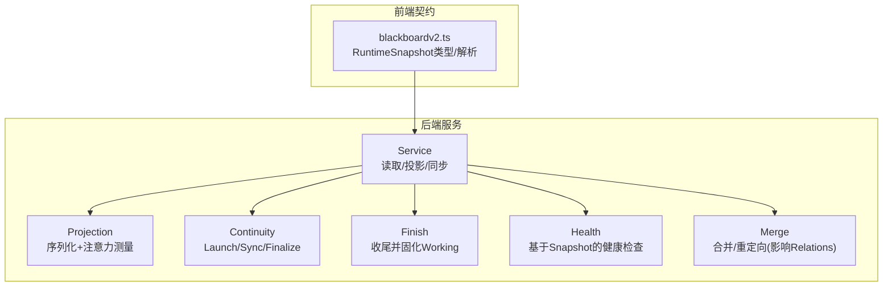
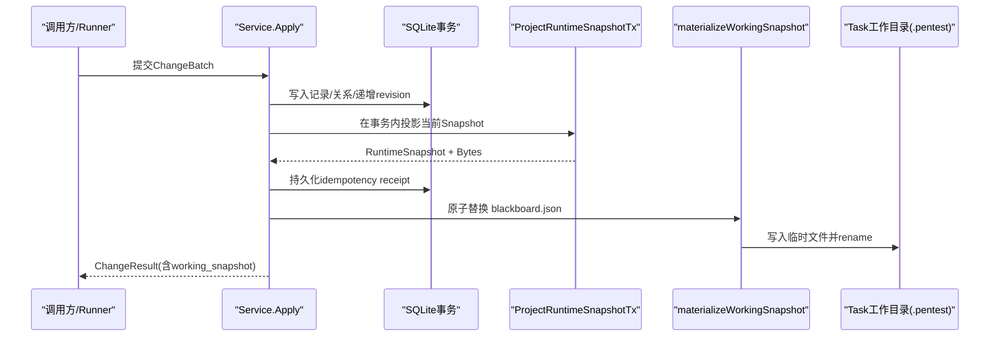
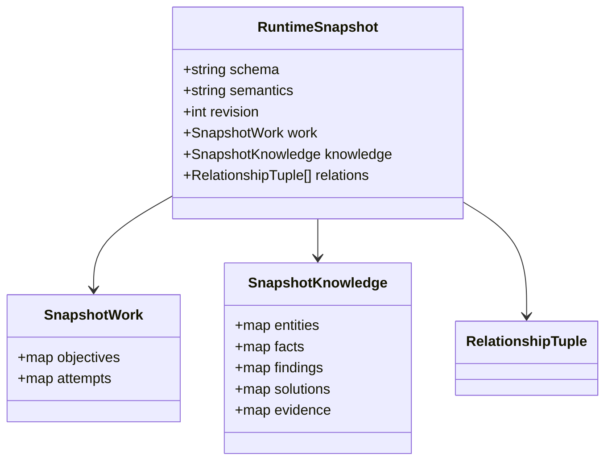
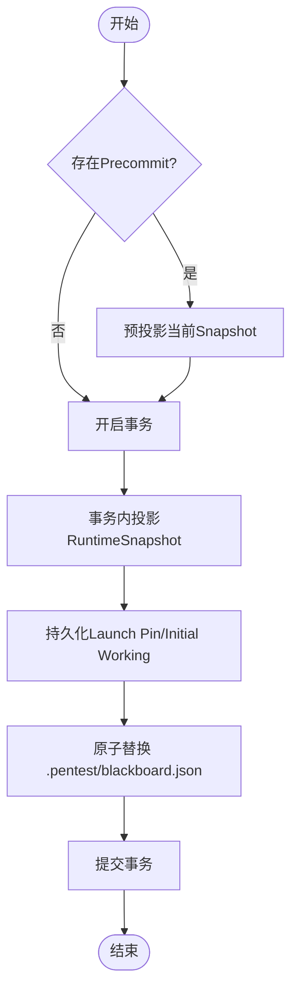
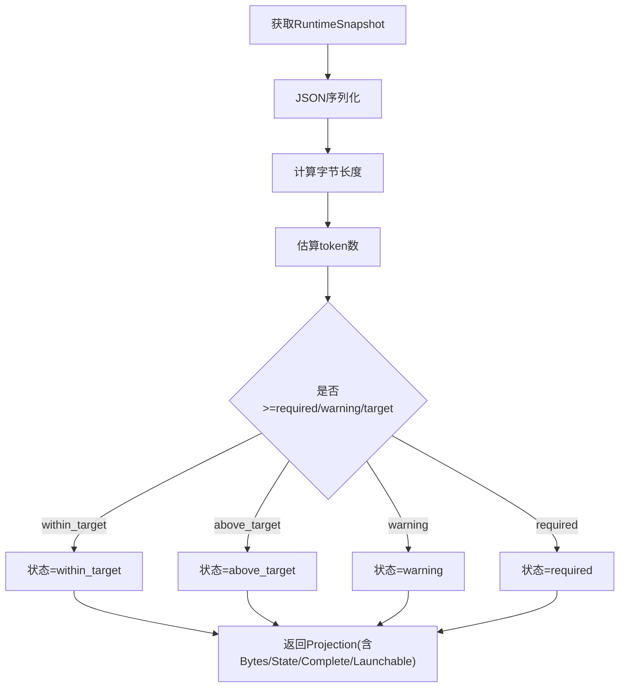
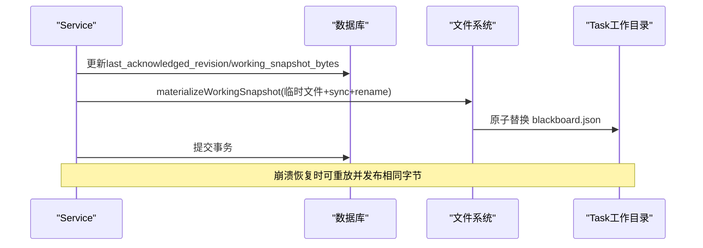
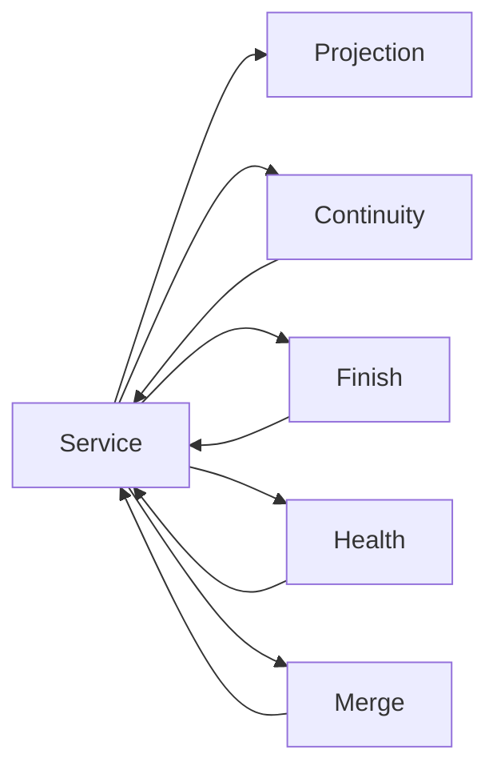

# 快照机制

<cite>
**本文引用的文件**   
- [service.go](file://internal/blackboardv2/service.go)
- [projection.go](file://internal/blackboardv2/projection.go)
- [continuity.go](file://internal/blackboardv2/continuity.go)
- [finish.go](file://internal/blackboardv2/finish.go)
- [health.go](file://internal/blackboardv2/health.go)
- [merge.go](file://internal/blackboardv2/merge.go)
- [blackboardv2.ts](file://web/src/lib/blackboardv2.ts)
</cite>

## 目录
1. [简介](#简介)
2. [项目结构](#项目结构)
3. [核心组件](#核心组件)
4. [架构总览](#架构总览)
5. [详细组件分析](#详细组件分析)
6. [依赖关系分析](#依赖关系分析)
7. [性能考量](#性能考量)
8. [故障排查指南](#故障排查指南)
9. [结论](#结论)
10. [附录](#附录)

## 简介
本文件系统性阐述 Blackboard v2 的“快照机制”，围绕以下目标展开：
- RuntimeSnapshot 的结构设计与语义边界
- WorkingSnapshot 的作用、发布点与跨进程共享
- 快照投影（Projection）的过滤规则、注意力预算与增量更新
- 持久化存储与原子替换策略
- 快照创建、加载与比较的实现路径，以及运行时高效同步与数据交换实践

Blackboard v2 将“当前语义图”以紧凑、确定性的 runtime-blackboard/v2 文档形式对外暴露。该文档作为 Continuation 的输入契约，既用于启动时的 Launch Pin，也作为运行期 Working Snapshot 的基准，并在变更时通过同步机制推进。

## 项目结构
与快照机制直接相关的代码集中在 internal/blackboardv2 包中，并由前端 TypeScript 类型定义进行契约对齐。

图表来源
- [service.go:526-533](file://internal/blackboardv2/service.go#L526-L533)
- [projection.go:38-85](file://internal/blackboardv2/projection.go#L38-L85)
- [continuity.go:764-880](file://internal/blackboardv2/continuity.go#L764-L880)
- [finish.go:65-228](file://internal/blackboardv2/finish.go#L65-L228)
- [health.go:433-621](file://internal/blackboardv2/health.go#L433-L621)
- [merge.go:91-238](file://internal/blackboardv2/merge.go#L91-L238)
- [blackboardv2.ts:167-174](file://web/src/lib/blackboardv2.ts#L167-L174)

章节来源
- [service.go:526-533](file://internal/blackboardv2/service.go#L526-L533)
- [projection.go:38-85](file://internal/blackboardv2/projection.go#L38-L85)
- [continuity.go:764-880](file://internal/blackboardv2/continuity.go#L764-L880)
- [finish.go:65-228](file://internal/blackboardv2/finish.go#L65-L228)
- [health.go:433-621](file://internal/blackboardv2/health.go#L433-L621)
- [merge.go:91-238](file://internal/blackboardv2/merge.go#L91-L238)
- [blackboardv2.ts:167-174](file://web/src/lib/blackboardv2.ts#L167-L174)

## 核心组件
- RuntimeSnapshot：runtime-blackboard/v2 的顶层结构，包含 schema、semantics、revision、work、knowledge、relations。它是“拓扑完整”的只读视图，不包含历史、审计或内部元数据。
- WorkingSnapshot：指向任务本地 .pentest/blackboard.json 的路径与 revision，表示 Continuation 可消费的“工作快照”。
- RuntimeSnapshotProjection：对 RuntimeSnapshot 的序列化字节、注意力预算与完整性标记的封装，供发布与校验使用。
- 注意力预算：按字节估算 token 数，划分 within_target / above_target / warning / required 四档，仅诊断用途，不改变行为。

章节来源
- [service.go:478-481](file://internal/blackboardv2/service.go#L478-L481)
- [service.go:526-533](file://internal/blackboardv2/service.go#L526-L533)
- [projection.go:17-48](file://internal/blackboardv2/projection.go#L17-L48)
- [projection.go:87-109](file://internal/blackboardv2/projection.go#L87-L109)

## 架构总览
下图展示从“写入变更”到“Working Snapshot 发布”的关键流程，以及跨进程共享路径。

图表来源
- [service.go:1119-1154](file://internal/blackboardv2/service.go#L1119-L1154)
- [continuity.go:1095-1147](file://internal/blackboardv2/continuity.go#L1095-L1147)

章节来源
- [service.go:1119-1154](file://internal/blackboardv2/service.go#L1119-L1154)
- [continuity.go:1095-1147](file://internal/blackboardv2/continuity.go#L1095-L1147)

## 详细组件分析

### RuntimeSnapshot 结构设计
- 字段说明
  - schema/semantics：版本与语义标识
  - revision：当前图修订号
  - work：开放工作项（objectives/attempts）
  - knowledge：实体、事实、发现、方案、证据等知识集合
  - relations：当前关系的扁平列表
- 生成路径
  - Service.RuntimeSnapshot 开启只读事务，扫描 records 表并按类型映射为允许字段集合
  - 同时加载所有 current relationships，组装成 RuntimeSnapshot
- 前端契约
  - web 层提供严格解析器，校验 schema、分组键与数组结构，确保前后端一致

图表来源
- [service.go:526-533](file://internal/blackboardv2/service.go#L526-L533)
- [service.go:535-614](file://internal/blackboardv2/service.go#L535-L614)
- [blackboardv2.ts:167-174](file://web/src/lib/blackboardv2.ts#L167-L174)

章节来源
- [service.go:1389-1522](file://internal/blackboardv2/service.go#L1389-L1522)
- [blackboardv2.ts:635-695](file://web/src/lib/blackboardv2.ts#L635-L695)

### WorkingSnapshot 的作用与发布点
- 作用
  - 每个 Continuation 拥有不可变的 Launch Pin（固定 bytes），以及随写推进的 Working Snapshot（task-local .pentest/blackboard.json）
  - 其他 Task 修改同一 Project 的知识后，会通过同步通知让活跃 Continuation 推进其 Working Snapshot
- 发布点
  - 启动阶段：CreateContinuation 先投影当前 Snapshot，持久化 Launch Pin 与初始 Working Snapshot，再原子替换磁盘文件
  - 变更阶段：Apply 成功后，在事务外重新投影并替换 Working Snapshot
  - 同步阶段：SynchronizeContinuation 在事务内推进 last_acknowledged_revision 与 working_snapshot_bytes，并原子替换磁盘文件
  - 收尾阶段：FinishContinuation 固化最终 Working Snapshot 并关闭后续写入

图表来源
- [continuity.go:764-880](file://internal/blackboardv2/continuity.go#L764-L880)
- [continuity.go:1095-1147](file://internal/blackboardv2/continuity.go#L1095-L1147)

章节来源
- [continuity.go:764-880](file://internal/blackboardv2/continuity.go#L764-L880)
- [finish.go:65-228](file://internal/blackboardv2/finish.go#L65-L228)

### 快照投影（Projection）：过滤规则、注意力预算与增量更新
- 过滤规则
  - 仅包含允许字段（如 entity/fact/finding/solution/evidence 的白名单字段）
  - relations 为当前关系的全量扁平列表，不含历史
- 注意力预算
  - 基于 JSON 字节长度估算 token 数，划分四个阈值档位
  - 仅诊断用途，不会截断或过滤内容；超过阈值的快照仍完整且可启动
- 增量更新
  - 每次语义变更后，都会重新投影并测量注意力预算
  - 同步机制保证 Continuation 的 Working Snapshot 与最新 revision 对齐

图表来源
- [projection.go:70-85](file://internal/blackboardv2/projection.go#L70-L85)
- [projection.go:87-109](file://internal/blackboardv2/projection.go#L87-L109)

章节来源
- [projection.go:52-85](file://internal/blackboardv2/projection.go#L52-L85)
- [projection.go:87-109](file://internal/blackboardv2/projection.go#L87-L109)

### 跨进程共享与持久化存储
- 持久化位置
  - task-local 路径：{runtimeRoot}/{taskID}/workdir/.pentest/blackboard.json
- 原子替换
  - 先写随机名临时文件，fsync 后 rename 为目标文件名，保证可见性与一致性
- 恢复与回滚
  - 若提交前失败，会尝试恢复之前的文件或删除新文件，保持幂等与可重试
- 同步与回放
  - SynchronizeContinuation 支持已确认 revision 的重放，确保丢失响应后可安全重试
  - Finish 后不再重建 Working Snapshot，仅返回结果中的 working_snapshot

图表来源
- [continuity.go:647-751](file://internal/blackboardv2/continuity.go#L647-L751)
- [continuity.go:1095-1147](file://internal/blackboardv2/continuity.go#L1095-L1147)

章节来源
- [continuity.go:647-751](file://internal/blackboardv2/continuity.go#L647-L751)
- [continuity.go:1095-1147](file://internal/blackboardv2/continuity.go#L1095-L1147)

### 快照创建、加载与比较的实现示例
- 创建（启动）
  - CreateContinuation：预投影当前 Snapshot → 持久化 Launch Pin 与初始 Working → 原子替换磁盘文件 → 提交事务
- 加载（运行时）
  - 任务侧读取 .pentest/blackboard.json 作为输入；服务端可通过 ReadWorkingSnapshot/ReadLaunchPin 校验
- 比较（差异感知）
  - 通过对比 attachment.Snapshot.Revision 与 fromRevision 判断是否需要推进
  - 字节级相等性用于幂等回放与精确重放

章节来源
- [continuity.go:764-880](file://internal/blackboardv2/continuity.go#L764-L880)
- [continuity.go:647-751](file://internal/blackboardv2/continuity.go#L647-L751)
- [finish.go:65-228](file://internal/blackboardv2/finish.go#L65-L228)

### 健康检查与快照语义异常
- 基于 RuntimeSnapshot 的语义健康检查
  - 检测悬空关系、无效 reason、缺失证据、未解决矛盾等
  - 严重级别根据关联结论状态动态提升
- 证据完整性
  - 针对 available 状态的证据进行有效性校验，结合关系网络评估风险等级

章节来源
- [health.go:433-621](file://internal/blackboardv2/health.go#L433-L621)
- [health.go:623-685](file://internal/blackboardv2/health.go#L623-L685)

### 合并与关系重写对快照的影响
- Record Merge
  - 将 source 合并至 canonical，更新 canonical 记录、迁移关系、插入 key redirect
  - 关系版本冲突与环检测保障图一致性
- 对快照的影响
  - 合并后 relations 列表发生变化，下一次投影将反映新的关系拓扑

章节来源
- [merge.go:91-238](file://internal/blackboardv2/merge.go#L91-L238)

## 依赖关系分析
- 模块耦合
  - Service 聚合 Projection、Continuity、Finish、Health、Merge 能力，统一对外暴露
  - Continuity 负责 Launch/Sync/Finalize 的生命周期，强依赖 Service 的投影与持久化
- 外部依赖
  - SQLite 事务保证原子性与一致性
  - 文件系统操作遵循安全目录与权限约束，避免越权访问

图表来源
- [service.go:41-49](file://internal/blackboardv2/service.go#L41-L49)
- [continuity.go:764-880](file://internal/blackboardv2/continuity.go#L764-L880)
- [finish.go:65-228](file://internal/blackboardv2/finish.go#L65-L228)
- [health.go:433-621](file://internal/blackboardv2/health.go#L433-L621)
- [merge.go:91-238](file://internal/blackboardv2/merge.go#L91-L238)

章节来源
- [service.go:41-49](file://internal/blackboardv2/service.go#L41-L49)
- [continuity.go:764-880](file://internal/blackboardv2/continuity.go#L764-L880)
- [finish.go:65-228](file://internal/blackboardv2/finish.go#L65-L228)
- [health.go:433-621](file://internal/blackboardv2/health.go#L433-L621)
- [merge.go:91-238](file://internal/blackboardv2/merge.go#L91-L238)

## 性能考量
- 投影成本
  - 每次变更都会重新投影并测量注意力预算，需关注大图的序列化开销
- 注意力预算阈值
  - 默认 16K 为健康目标，32K 警告，64K 需考虑语义整合；这些阈值不影响行为，仅用于提示
- 原子替换
  - 临时文件+rename 的策略降低并发读写带来的不一致风险
- 增量同步
  - 基于 revision 的增量推进减少不必要的数据传输与处理

[本节为通用指导，无需特定文件引用]

## 故障排查指南
- 常见错误
  - 版本冲突：关系或记录的 version 不匹配，需先读取当前记录
  - 权限不足：Continuation 未拥有对应 Project/Task 接口
  - 关闭的 Continuation：无法继续写入或同步
- 恢复策略
  - 利用 ReadLaunchPin/ReadWorkingSnapshot 校验与恢复
  - 重试 SynchronizeContinuation 可安全重放已确认的字节
- 健康告警
  - 关注 missing_evidence、unresolved_contradiction、invalid_relationship 等异常

章节来源
- [continuity.go:647-751](file://internal/blackboardv2/continuity.go#L647-L751)
- [health.go:433-621](file://internal/blackboardv2/health.go#L433-L621)

## 结论
Blackboard v2 的快照机制以“紧凑、确定、可验证”为核心原则：
- RuntimeSnapshot 提供拓扑完整的只读视图
- WorkingSnapshot 作为 Continuation 的工作基准，具备原子发布与幂等重放能力
- Projection 的过滤与注意力预算兼顾可读性与可扩展性
- 通过同步与 Finish 机制，实现跨进程共享与生命周期管理

[本节为总结，无需特定文件引用]

## 附录
- 关键术语
  - Launch Pin：不可变的启动快照字节
  - Working Snapshot：随写推进的任务本地快照
  - Synchronization Attachment：同步附件，携带 from_revision 与当前 snapshot
- 参考实现路径
  - 创建：CreateContinuation
  - 同步：SynchronizeContinuation
  - 收尾：FinishContinuation
  - 投影：ProjectRuntimeSnapshot/ProjectRuntimeSnapshotTx
  - 持久化：materializeWorkingSnapshot

章节来源
- [continuity.go:764-880](file://internal/blackboardv2/continuity.go#L764-L880)
- [continuity.go:647-751](file://internal/blackboardv2/continuity.go#L647-L751)
- [finish.go:65-228](file://internal/blackboardv2/finish.go#L65-L228)
- [projection.go:52-85](file://internal/blackboardv2/projection.go#L52-L85)
- [continuity.go:1095-1147](file://internal/blackboardv2/continuity.go#L1095-L1147)