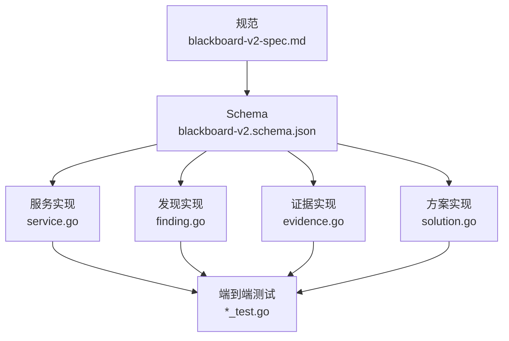
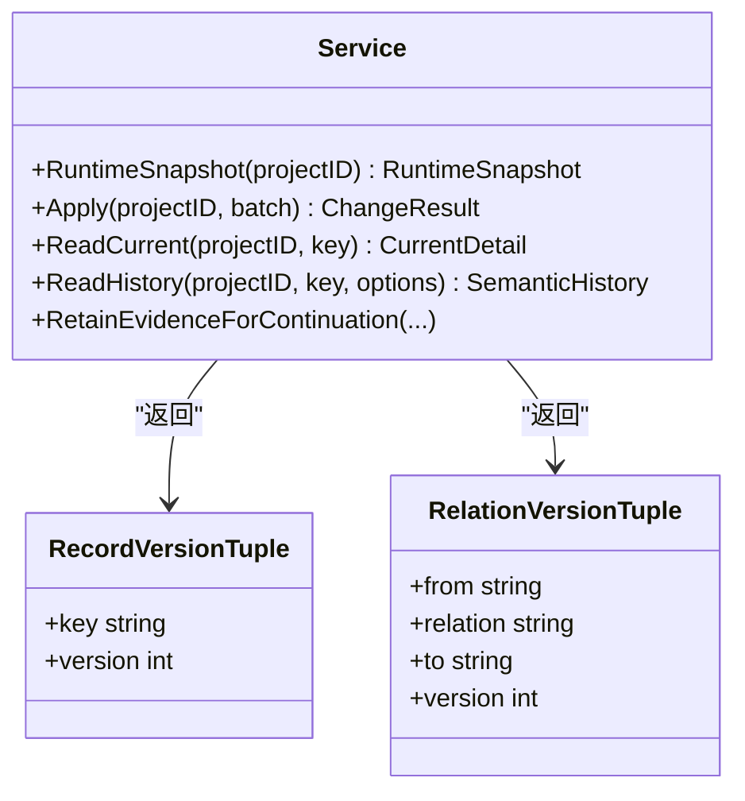
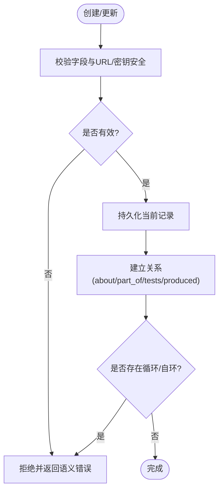
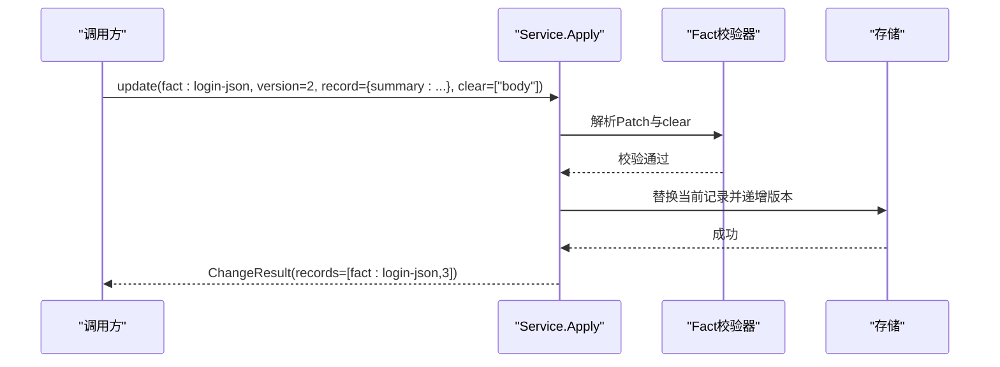
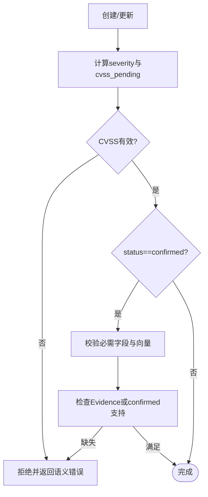
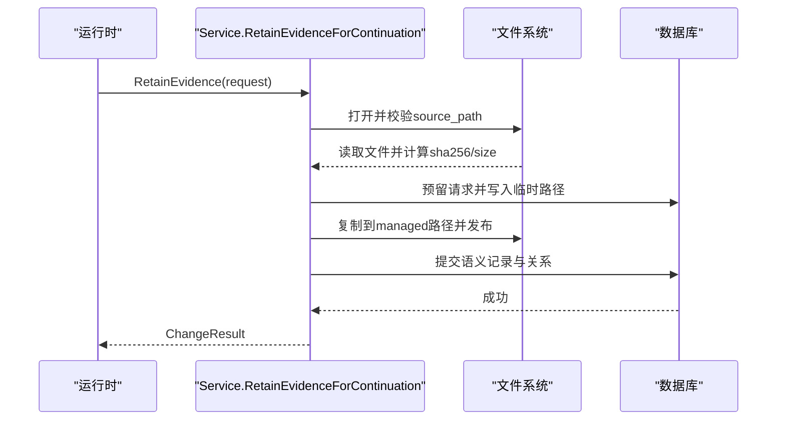
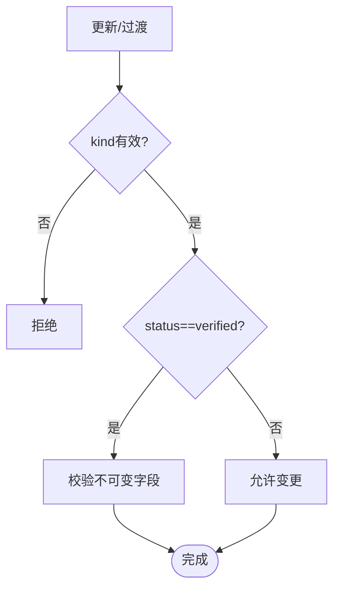
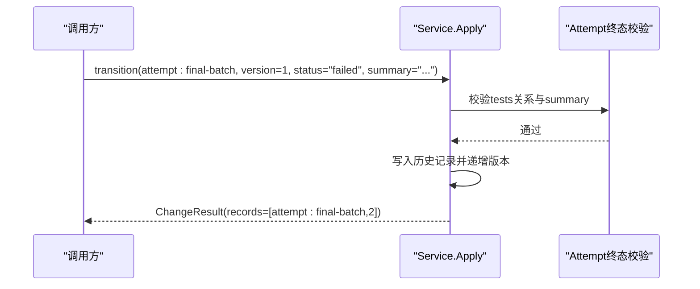
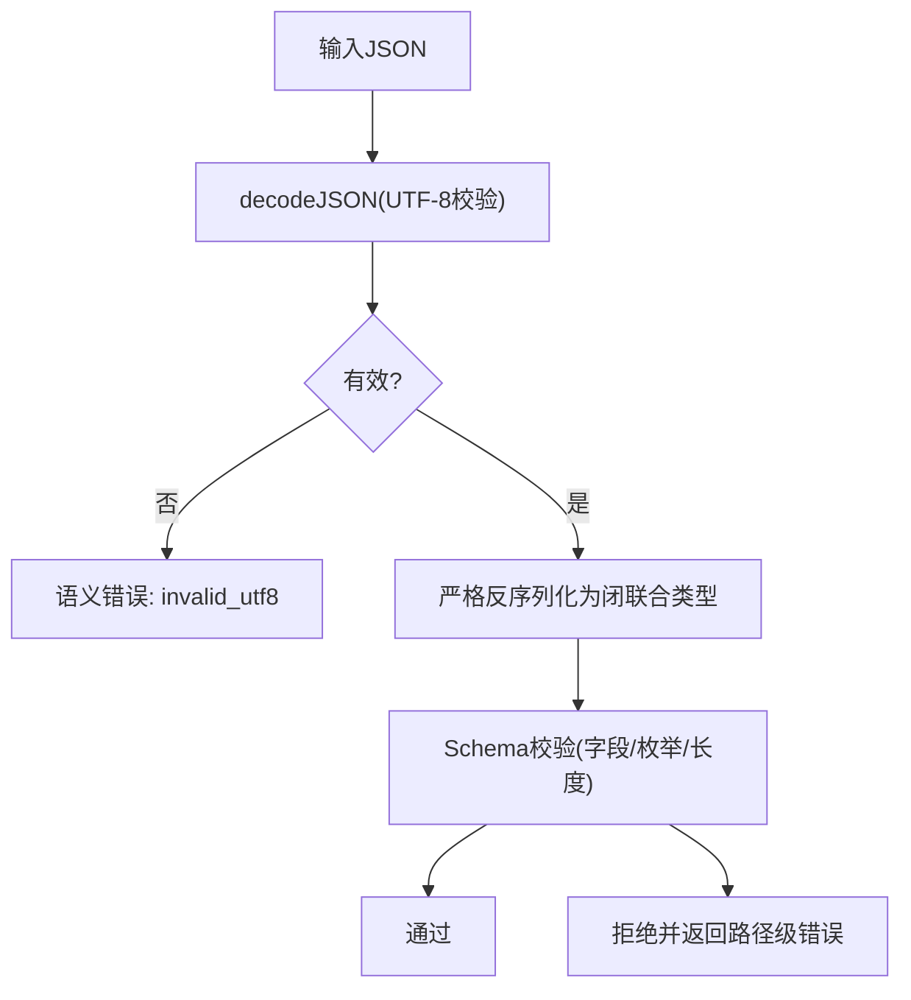
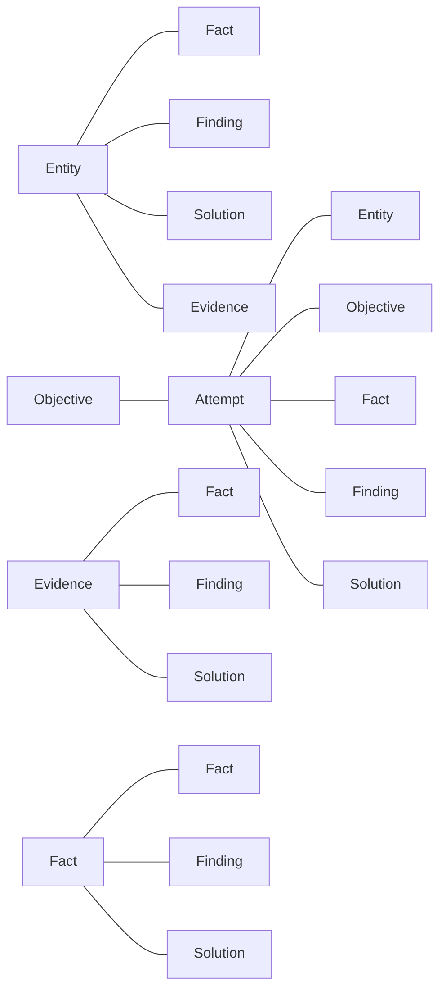

# 数据模型设计

<cite>
**本文引用的文件**   
- [blackboard-v2-spec.md](file://docs/specs/blackboard-v2-spec.md)
- [blackboard-v2.schema.json](file://internal/blackboardv2contract/contractdata/schemas/blackboard-v2.schema.json)
- [service.go](file://internal/blackboardv2/service.go)
- [finding.go](file://internal/blackboardv2/finding.go)
- [evidence.go](file://internal/blackboardv2/evidence.go)
- [solution.go](file://internal/blackboardv2/solution.go)
- [entity_service_test.go](file://internal/blackboardv2/entity_service_test.go)
- [fact_service_test.go](file://internal/blackboardv2/fact_service_test.go)
- [attempt_final_batch_service_test.go](file://internal/blackboardv2/attempt_final_batch_service_test.go)
- [json_decode.go](file://internal/blackboardv2/json_decode.go)
</cite>

## 目录
1. [引言](#引言)
2. [项目结构](#项目结构)
3. [核心组件](#核心组件)
4. [架构总览](#架构总览)
5. [详细组件分析](#详细组件分析)
6. [依赖关系分析](#依赖关系分析)
7. [性能考量](#性能考量)
8. [故障排查指南](#故障排查指南)
9. [结论](#结论)
10. [附录](#附录)

## 引言
本文件为 Blackboard v2 数据模型的权威技术文档，聚焦六大语义实体：Entity（实体）、Fact（事实）、Finding（发现）、Evidence（证据）、Solution（解决方案）与 Attempt（尝试）。内容涵盖字段定义、状态机转换、验证规则与约束、Record 联合类型设计、JSON 序列化策略、向后兼容性与一致性保证，并通过具体示例与图示说明实体间关系映射与引用完整性。

## 项目结构
Blackboard v2 的数据模型由规范、Schema 与实现共同定义：
- 规范层：blackboard-v2-spec.md 定义了语义记录、键、版本、关系、快照与写入协议等契约。
- Schema 层：blackboard-v2.schema.json 以 JSON Schema 形式固化字段、枚举、长度限制与条件必填。
- 实现层：service.go 提供快照构建、解码与聚合；各领域文件（finding.go、evidence.go、solution.go）实现各自实体的创建、更新、校验与派生逻辑；测试覆盖关键路径与边界。

**图表来源** 
- [blackboard-v2-spec.md:1-120](file://docs/specs/blackboard-v2-spec.md#L1-L120)
- [blackboard-v2.schema.json:100-133](file://internal/blackboardv2contract/contractdata/schemas/blackboard-v2.schema.json#L100-L133)
- [service.go:1417-1452](file://internal/blackboardv2/service.go#L1417-L1452)

**章节来源**
- [blackboard-v2-spec.md:1-120](file://docs/specs/blackboard-v2-spec.md#L1-L120)
- [blackboard-v2.schema.json:100-133](file://internal/blackboardv2contract/contractdata/schemas/blackboard-v2.schema.json#L100-L133)
- [service.go:1417-1452](file://internal/blackboardv2/service.go#L1417-L1452)

## 核心组件
- Entity（实体）：描述系统内可被测试或关联的客体，如主机、端点、服务等。关键字段包括 kind、name、locator、description、scope_status、credential_ref、status。
- Fact（事实）：项目知识，包含 category、summary、body、confidence、scope_status。支持从 tentative 到 confirmed 的置信度转换。
- Finding（发现）：漏洞或问题记录，包含 status、title、target、description、proof、impact、recommendation、cvss_version、cvss_vector、severity、cvss_pending。confirmed 需要完整报告字段与有效 CVSS 向量。
- Evidence（证据）：受管工件引用，包含 status、artifact_type、summary、media_type、source_path、managed_path、sha256、size、captured_at。通过 RetainEvidenceForContinuation 原子化保留并建立关系。
- Solution（解决方案）：CTF 挑战专用，包含 status、kind、summary、value、verification_summary。verified 要求 value（answer/flag）与 verification_summary。
- Attempt（尝试）：探索性工作的执行单元，包含 status、summary。terminal 状态需有 summary 且至少一个 tests 关系。

这些实体的公共契约由 blackboard-v2.schema.json 严格限定，确保跨语言与运行时的一致性。

**章节来源**
- [blackboard-v2.schema.json:100-133](file://internal/blackboardv2contract/contractdata/schemas/blackboard-v2.schema.json#L100-L133)
- [blackboard-v2.schema.json:168-197](file://internal/blackboardv2contract/contractdata/schemas/blackboard-v2.schema.json#L168-L197)
- [blackboard-v2.schema.json:198-270](file://internal/blackboardv2contract/contractdata/schemas/blackboard-v2.schema.json#L198-L270)
- [blackboard-v2.schema.json:271-356](file://internal/blackboardv2contract/contractdata/schemas/blackboard-v2.schema.json#L271-L356)
- [blackboard-v2.schema.json:426-473](file://internal/blackboardv2contract/contractdata/schemas/blackboard-v2.schema.json#L426-L473)
- [blackboard-v2.schema.json:357-425](file://internal/blackboardv2contract/contractdata/schemas/blackboard-v2.schema.json#L357-L425)

## 架构总览
Blackboard v2 采用“当前工作 + 项目知识 + 关系”的三元结构，配合严格的键、版本与合并机制，确保语义一致性与可重放性。

**图表来源** 
- [service.go:423-475](file://internal/blackboardv2/service.go#L423-L475)
- [service.go:1417-1452](file://internal/blackboardv2/service.go#L1417-L1452)

**章节来源**
- [service.go:423-475](file://internal/blackboardv2/service.go#L423-L475)
- [service.go:1417-1452](file://internal/blackboardv2/service.go#L1417-L1452)

## 详细组件分析

### Entity（实体）
- 字段与约束：kind、name、locator、description、scope_status、credential_ref、status=active。locator 必须为合法 URL 且不包含敏感信息；credential_ref 不得为密钥。
- 生命周期：active → retired/superseded。retired 后不再出现在当前上下文；superseded 需存在 replacement，并通过 supersedes 关系迁移引用。
- 关系：about、part_of、tests、produced、derived_from、depends_on、satisfies、supersedes。part_of 禁止自环与循环。
- 快照与详情：快照仅暴露 allowlist 字段；详情可通过 ReadCurrent 获取完整记录与当前关系。

**图表来源** 
- [entity_service_test.go:161-254](file://internal/blackboardv2/entity_service_test.go#L161-L254)
- [entity_service_test.go:256-351](file://internal/blackboardv2/entity_service_test.go#L256-L351)
- [entity_service_test.go:353-446](file://internal/blackboardv2/entity_service_test.go#L353-L446)

**章节来源**
- [entity_service_test.go:161-254](file://internal/blackboardv2/entity_service_test.go#L161-L254)
- [entity_service_test.go:256-351](file://internal/blackboardv2/entity_service_test.go#L256-L351)
- [entity_service_test.go:353-446](file://internal/blackboardv2/entity_service_test.go#L353-L446)

### Fact（事实）
- 字段与约束：category、summary、body、confidence∈{tentative, confirmed}、scope_status。
- 生命周期：tentative ↔ confirmed；deprecated/superseded 用于历史归档。
- 确认基础：confirmed 需要可信依据（支持的 confirmed Fact、成功的 producing Attempt、或可信操作者确认）。
- 更新模式：update 使用 Patch DTO，clear 列表显式清空可选字段；空 Patch 不被允许。

**图表来源** 
- [fact_service_test.go:93-137](file://internal/blackboardv2/fact_service_test.go#L93-L137)
- [fact_service_test.go:410-471](file://internal/blackboardv2/fact_service_test.go#L410-L471)

**章节来源**
- [fact_service_test.go:93-137](file://internal/blackboardv2/fact_service_test.go#L93-L137)
- [fact_service_test.go:410-471](file://internal/blackboardv2/fact_service_test.go#L410-L471)

### Finding（发现）
- 字段与约束：status∈{unconfirmed, confirmed, false_positive, superseded}；confirmed 需要 target、proof、impact、recommendation 与有效的 cvss_version/cvss_vector。
- 派生字段：severity 与 cvss_pending 由服务器根据 CVSS 向量推导，禁止客户端写入。
- 支持性检查：confirmed 必须有当前 Evidence 或 confirmed 的 supporting Fact。

**图表来源** 
- [finding.go:89-108](file://internal/blackboardv2/finding.go#L89-L108)
- [finding.go:170-212](file://internal/blackboardv2/finding.go#L170-L212)
- [finding.go:250-304](file://internal/blackboardv2/finding.go#L250-L304)

**章节来源**
- [finding.go:89-108](file://internal/blackboardv2/finding.go#L89-L108)
- [finding.go:170-212](file://internal/blackboardv2/finding.go#L170-L212)
- [finding.go:250-304](file://internal/blackboardv2/finding.go#L250-L304)

### Evidence（证据）
- 字段与约束：status∈{available, missing}；artifact_type、summary、media_type、source_path、managed_path、sha256、size、captured_at。
- 保留流程：RetainEvidenceForContinuation 原子化复制、校验、发布与提交，支持失败点注入与幂等重试。
- 链接限制：links 仅允许 evidences 与 about 两种关系类型。

**图表来源** 
- [evidence.go:194-360](file://internal/blackboardv2/evidence.go#L194-L360)
- [evidence.go:412-474](file://internal/blackboardv2/evidence.go#L412-L474)
- [evidence.go:540-608](file://internal/blackboardv2/evidence.go#L540-L608)

**章节来源**
- [evidence.go:194-360](file://internal/blackboardv2/evidence.go#L194-L360)
- [evidence.go:412-474](file://internal/blackboardv2/evidence.go#L412-L474)
- [evidence.go:540-608](file://internal/blackboardv2/evidence.go#L540-L608)

### Solution（解决方案）
- 字段与约束：status∈{candidate, verified, rejected, superseded}；kind∈{answer, flag, procedure}；verified 时 required value（answer/flag）与 verification_summary。
- 不可变性：verified 状态的 kind、value、verification_summary 不可更改。
- CTF 求解状态：CTFSolvedState 基于当前 verified flag Solutions 推导，无需持久化标志。

**图表来源** 
- [solution.go:158-196](file://internal/blackboardv2/solution.go#L158-L196)
- [solution.go:342-369](file://internal/blackboardv2/solution.go#L342-L369)
- [solution.go:19-51](file://internal/blackboardv2/solution.go#L19-L51)

**章节来源**
- [solution.go:158-196](file://internal/blackboardv2/solution.go#L158-L196)
- [solution.go:342-369](file://internal/blackboardv2/solution.go#L342-L369)
- [solution.go:19-51](file://internal/blackboardv2/solution.go#L19-L51)

### Attempt（尝试）
- 字段与约束：status∈{open, succeeded, failed, blocked, inconclusive, interrupted}；summary 必填。
- 终态约束：terminal 状态需有 summary 且至少一个 tests 关系；succeeded 需至少一个 reusable produced outcome。
- 批处理顺序：final-batch 中目标终态化与 Attempt 终态化的顺序不影响结果，但需保持语义一致性。

**图表来源** 
- [attempt_final_batch_service_test.go:15-74](file://internal/blackboardv2/attempt_final_batch_service_test.go#L15-L74)
- [attempt_final_batch_service_test.go:76-132](file://internal/blackboardv2/attempt_final_batch_service_test.go#L76-L132)

**章节来源**
- [attempt_final_batch_service_test.go:15-74](file://internal/blackboardv2/attempt_final_batch_service_test.go#L15-L74)
- [attempt_final_batch_service_test.go:76-132](file://internal/blackboardv2/attempt_final_batch_service_test.go#L76-L132)

### Record 联合类型与 JSON 序列化
- Record 联合类型：create/update/transition/relate/unrelate/merge/supersede 等操作的 record 字段为闭联合类型，未知字段将被拒绝。
- JSON 解码：decodeJSON 强制 UTF-8 有效性，避免默认解码器的字节替换导致语义歧义。
- 快照序列化：runtime-blackboard/v2 快照按 schema、semantics、revision、work、knowledge、relations 顺序输出，键排序稳定，确保确定性字节。

**图表来源** 
- [json_decode.go:8-23](file://internal/blackboardv2/json_decode.go#L8-L23)
- [blackboard-v2.schema.json:1-120](file://internal/blackboardv2contract/contractdata/schemas/blackboard-v2.schema.json#L1-L120)
- [blackboard-v2-spec.md:136-141](file://docs/specs/blackboard-v2-spec.md#L136-L141)

**章节来源**
- [json_decode.go:8-23](file://internal/blackboardv2/json_decode.go#L8-L23)
- [blackboard-v2.schema.json:1-120](file://internal/blackboardv2contract/contractdata/schemas/blackboard-v2.schema.json#L1-L120)
- [blackboard-v2-spec.md:136-141](file://docs/specs/blackboard-v2-spec.md#L136-L141)

## 依赖关系分析
- 实体间关系：about、part_of、tests、produced、evidences、supports、contradicts、derived_from、depends_on、satisfies、supersedes。
- 约束：self-link 无效；part_of、derived_from、depends_on、supersedes 独立无环；contradicts 不改变生命周期；blocks 用反向 depends_on 表示。
- 引用完整性：关系两端必须为当前同项目记录；Key 全局唯一；supersede 原子迁移引用。

**图表来源** 
- [blackboard-v2-spec.md:72-90](file://docs/specs/blackboard-v2-spec.md#L72-L90)

**章节来源**
- [blackboard-v2-spec.md:72-90](file://docs/specs/blackboard-v2-spec.md#L72-L90)

## 性能考量
- 快照大小预算：16K tokens 健康目标，32K 警告，64K 需合并。快照不包含历史、审计元数据与内部 ID。
- 序列化稳定性：确定性 JSON 字节便于哈希与缓存，减少传输开销。
- 批量写入：semantic-change-batch 原子应用，减少往返与锁竞争。

[本节为通用指导，不直接分析具体文件]

## 故障排查指南
- 常见错误码：version_conflict、idempotency_conflict、semantic_validation、authority_denied、not_found、key_conflict。
- 调试建议：
  - 检查 Key 是否重复或历史冲突。
  - 验证 CVSS 向量与必需字段。
  - 确认 Evidence source_path 权限与完整性。
  - 查看 History 与 Snapshot 差异定位状态不一致。

**章节来源**
- [blackboard-v2-spec.md:293-308](file://docs/specs/blackboard-v2-spec.md#L293-L308)
- [fact_service_test.go:160-177](file://internal/blackboardv2/fact_service_test.go#L160-L177)
- [evidence.go:476-517](file://internal/blackboardv2/evidence.go#L476-L517)

## 结论
Blackboard v2 通过严格的 Schema、关系约束与原子化写入协议，构建了高内聚、低耦合的语义记忆平面。其设计兼顾了运行时效率、可重放性与向后兼容性，为渗透测试代理提供了可靠的知识管理与协作基础。

[本节为总结，不直接分析具体文件]

## 附录
- 术语表：Blackboard Key、Revision、Version、Semantic History、Working Snapshot、Launch Pin。
- 参考规范：blackboard-v2-spec.md 与 blackboard-v2.schema.json 为权威契约。
- 示例场景：见各测试用例中的端到端流程与断言。

[本节为补充信息，不直接分析具体文件]