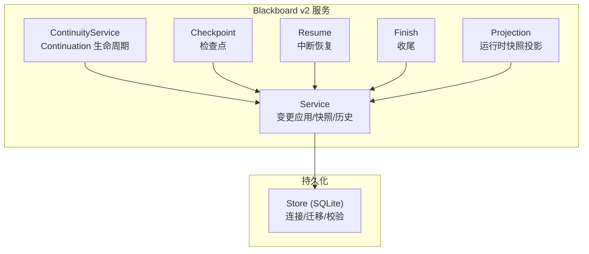
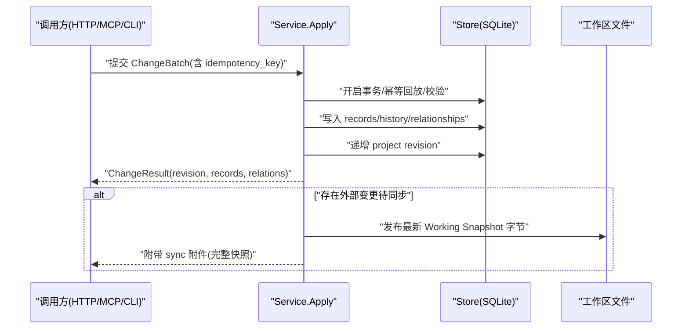
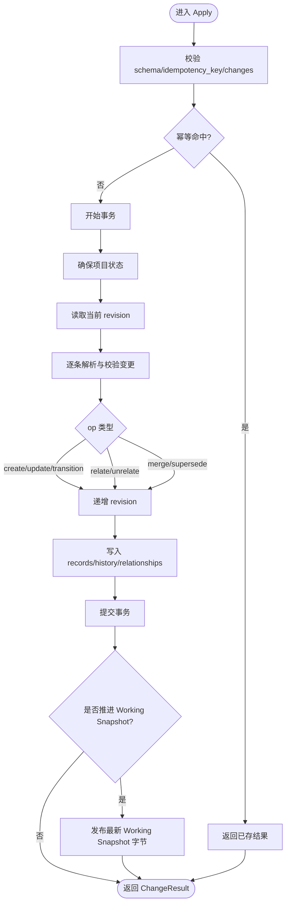
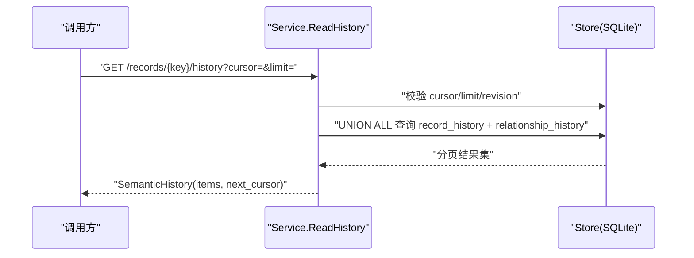
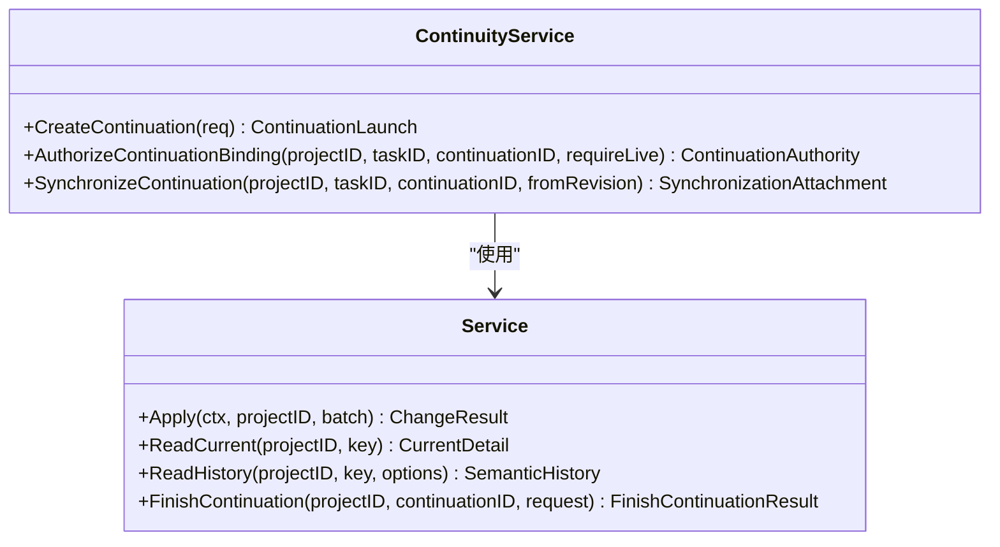
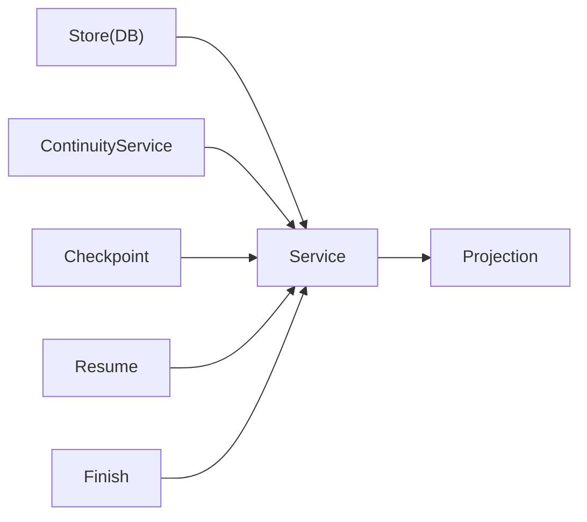

# 版本控制与历史追踪

<cite>
**本文引用的文件**   
- [service.go](file://internal/blackboardv2/service.go)
- [continuity.go](file://internal/blackboardv2/continuity.go)
- [checkpoint.go](file://internal/blackboardv2/checkpoint.go)
- [resume.go](file://internal/blackboardv2/resume.go)
- [finish.go](file://internal/blackboardv2/finish.go)
- [projection.go](file://internal/blackboardv2/projection.go)
- [store.go](file://internal/store/store.go)
- [blackboard-v2-spec.md](file://docs/specs/blackboard-v2-spec.md)
</cite>

## 目录
1. [引言](#引言)
2. [项目结构](#项目结构)
3. [核心组件](#核心组件)
4. [架构总览](#架构总览)
5. [详细组件分析](#详细组件分析)
6. [依赖关系分析](#依赖关系分析)
7. [性能考量](#性能考量)
8. [故障排查指南](#故障排查指南)
9. [结论](#结论)
10. [附录](#附录)

## 引言
本文件面向 Blackboard v2 版本控制系统，聚焦版本号管理、历史记录存储、时间戳追踪与审计日志机制；深入解释 Revision 递增策略、版本比较算法和历史查询接口；并说明 Checkpoint 检查点机制、Resume 恢复功能与 Continuation 生命周期管理。文档同时提供版本回滚、历史对比和时间旅行查询的实现思路与高效遍历方法，帮助读者在本地优先的渗透测试代理中正确理解和使用 Blackboard v2 的语义状态与持久化能力。

## 项目结构
Blackboard v2 的核心实现位于 internal/blackboardv2 包，包含服务层（变更应用、快照投影、历史读取）、连续性服务（Continuation 启动/同步/收尾）、检查点与恢复等模块。持久化由 internal/store 提供 SQLite 连接与迁移校验。规范定义见 docs/specs/blackboard-v2-spec.md。

图表来源
- [service.go:1-120](file://internal/blackboardv2/service.go#L1-L120)
- [continuity.go:119-134](file://internal/blackboardv2/continuity.go#L119-L134)
- [checkpoint.go:1-99](file://internal/blackboardv2/checkpoint.go#L1-L99)
- [resume.go:1-82](file://internal/blackboardv2/resume.go#L1-L82)
- [finish.go:1-120](file://internal/blackboardv2/finish.go#L1-L120)
- [projection.go:1-110](file://internal/blackboardv2/projection.go#L1-L110)
- [store.go:1-140](file://internal/store/store.go#L1-L140)

章节来源
- [service.go:1-120](file://internal/blackboardv2/service.go#L1-L120)
- [store.go:1-140](file://internal/store/store.go#L1-L140)
- [blackboard-v2-spec.md:1-120](file://docs/specs/blackboard-v2-spec.md#L1-L120)

## 核心组件
- Service：负责语义变更批处理（create/update/transition/relate/unrelate/supersede/merge），维护 Project 级单调 Revision，记录历史与关系变更，生成运行时快照，并提供当前详情与分页历史查询。
- ContinuityService：管理 Continuation 的创建、授权、同步与收尾，确保 Working Snapshot 的原子发布与可重放。
- Checkpoint：为受控 Attempt 摘要做轻量版本化，参与同步与幂等。
- Resume：从已完成的 Continuation 中读取中断的 Attempt 检查点，供后续恢复使用。
- Finish：原子关闭 Continuation，拒绝未终结的 Attempt，持久化不可变结果与最终 Working Snapshot。
- Projection：将当前语义状态投影为紧凑的 runtime-blackboard/v2 文档，并进行注意力预算度量。

章节来源
- [service.go:644-1154](file://internal/blackboardv2/service.go#L644-L1154)
- [continuity.go:119-134](file://internal/blackboardv2/continuity.go#L119-L134)
- [checkpoint.go:68-99](file://internal/blackboardv2/checkpoint.go#L68-L99)
- [resume.go:19-82](file://internal/blackboardv2/resume.go#L19-L82)
- [finish.go:63-228](file://internal/blackboardv2/finish.go#L63-L228)
- [projection.go:50-110](file://internal/blackboardv2/projection.go#L50-L110)

## 架构总览
Blackboard v2 采用“当前状态 + 历史”的持久化模型：所有写操作通过事务写入当前表与历史表，并递增 Project 级 Revision；读操作返回当前详情或按游标分页的历史项。Continuation 拥有 Launch Pin 与 Working Snapshot 文件路径，支持跨任务共享项目的知识增量同步。

图表来源
- [service.go:824-1154](file://internal/blackboardv2/service.go#L824-L1154)
- [continuity.go:647-751](file://internal/blackboardv2/continuity.go#L647-L751)
- [store.go:753-795](file://internal/store/store.go#L753-L795)

## 详细组件分析

### 版本号管理与 Revision 递增策略
- 全局单调 Revision：每个 Project 维护一个单调递增的 revision，每次有效变更都会递增。
- 幂等与无操作去重：相同 idempotency_key 且请求哈希一致时直接回放原结果；若语义不同则冲突。
- 版本比较算法：
  - 记录更新：基于 current version 进行乐观锁比较，不一致返回 version_conflict，提示 expected/current 版本与下一步动作。
  - 关系更新：对 reason 变更要求显式 version；新建关系不接受 version；删除后重建需匹配 maxVersion。
  - 合并/替代：merge 需要 source/canonical 双方版本；supersede 需要 replacement/replaced 双方版本。
- 时间戳追踪：所有变更记录均带 recorded_at/updated_at 等时间戳，用于排序与审计。

图表来源
- [service.go:824-1154](file://internal/blackboardv2/service.go#L824-L1154)
- [service.go:1663-1680](file://internal/blackboardv2/service.go#L1663-L1680)
- [service.go:1922-1952](file://internal/blackboardv2/service.go#L1922-L1952)
- [service.go:2029-2150](file://internal/blackboardv2/service.go#L2029-L2150)

章节来源
- [service.go:824-1154](file://internal/blackboardv2/service.go#L824-L1154)
- [service.go:1663-1680](file://internal/blackboardv2/service.go#L1663-L1680)
- [service.go:1922-1952](file://internal/blackboardv2/service.go#L1922-L1952)
- [service.go:2029-2150](file://internal/blackboardv2/service.go#L2029-L2150)
- [blackboard-v2-spec.md:56-70](file://docs/specs/blackboard-v2-spec.md#L56-L70)

### 历史记录存储与历史查询接口
- 存储结构：
  - blackboard_v2_records：当前记录
  - blackboard_v2_record_history：记录历史（含 type/version/record_json/recorded_at）
  - blackboard_v2_relationships：当前关系
  - blackboard_v2_relationship_history：关系历史（含 from_key/relation/to_key/version/reason/recorded_at）
- 历史查询：
  - ReadHistory 支持 cursor 分页，默认 limit=20，最大 100；cursor 包含 revision/key/limit/offset，过期会报错并要求重启读取。
  - 历史项包括 record 与 relationship 两类，统一排序输出。
- 时间旅行：
  - 通过 key 拉取历史项，结合 revision 定位时间点；对于被 redirect 的 key，历史也会覆盖 source_key。

图表来源
- [service.go:1214-1365](file://internal/blackboardv2/service.go#L1214-L1365)
- [service.go:1367-1386](file://internal/blackboardv2/service.go#L1367-L1386)

章节来源
- [service.go:1214-1365](file://internal/blackboardv2/service.go#L1214-L1365)
- [service.go:1367-1386](file://internal/blackboardv2/service.go#L1367-L1386)
- [blackboard-v2-spec.md:171-184](file://docs/specs/blackboard-v2-spec.md#L171-L184)

### 运行时快照与注意力预算
- RuntimeSnapshot：拓扑完整的当前语义视图，包含 work/knowledge/relations，键有序、字段受限。
- 投影与测量：projectRuntimeSnapshot 将快照编码为确定性的 JSON 字节，并按 UTF-8 字节估算 token 数，给出 within_target/warning/required 三类注意力预算状态。
- 用途：Launch/Resume/同步附件均使用该精确字节作为 Working Snapshot。

章节来源
- [service.go:1388-1522](file://internal/blackboardv2/service.go#L1388-L1522)
- [projection.go:50-110](file://internal/blackboardv2/projection.go#L50-L110)
- [blackboard-v2-spec.md:93-140](file://docs/specs/blackboard-v2-spec.md#L93-L140)

### Continuation 生命周期管理
- 启动：CreateContinuation 在当前快照上生成 Launch Pin，绑定 Task 与 Runner，预提交阶段允许外部投影。
- 授权与同步：AuthorizeContinuationBinding/InspectContinuationSynchronization 验证 Project/Task/Continuation 绑定与 Pending 状态；SynchronizeContinuation 原子推进 last_acknowledged_revision 并发布 Working Snapshot 字节。
- 收尾：FinishContinuation 校验所有 owned Attempts 已终结，持久化 finish 收据，关闭 Continuation，并发布最终 Working Snapshot。

图表来源
- [continuity.go:764-800](file://internal/blackboardv2/continuity.go#L764-L800)
- [continuity.go:157-192](file://internal/blackboardv2/continuity.go#L157-L192)
- [continuity.go:647-751](file://internal/blackboardv2/continuity.go#L647-L751)
- [finish.go:63-228](file://internal/blackboardv2/finish.go#L63-L228)
- [service.go:1178-1212](file://internal/blackboardv2/service.go#L1178-L1212)
- [service.go:1214-1365](file://internal/blackboardv2/service.go#L1214-L1365)

章节来源
- [continuity.go:157-192](file://internal/blackboardv2/continuity.go#L157-L192)
- [continuity.go:647-751](file://internal/blackboardv2/continuity.go#L647-L751)
- [finish.go:63-228](file://internal/blackboardv2/finish.go#L63-L228)

### Checkpoint 检查点机制
- 目的：为受控 Attempt 的摘要做轻量版本化，便于长时间运行中的进度保存与同步。
- 约束：仅接受 idempotency_key/key/version/summary；version 必须为正整数；summary 需满足语义文本限制。
- 行为：内部构造 update 变更并通过 apply 原子写入，参与幂等与 Working Snapshot 同步。

章节来源
- [checkpoint.go:10-99](file://internal/blackboardv2/checkpoint.go#L10-L99)
- [service.go:824-1154](file://internal/blackboardv2/service.go#L824-L1154)

### Resume 恢复功能
- 目标：从已完成的 Continuation 中读取其中断的 Attempt 的最终摘要，供新 Continuation 恢复上下文。
- 条件：Continuation 必须处于终端状态且 reconciliation 完成；仅返回最多固定数量的检查点。
- 输出：最小化的 allowlist（key/summary），不包含存储标识与原始输出。

章节来源
- [resume.go:19-82](file://internal/blackboardv2/resume.go#L19-L82)

### 版本回滚、历史对比与时间旅行查询
- 版本回滚：
  - 语义层面不直接提供“一键回滚”，但可通过 supersede 原子替换旧记录，并将被替换记录移入历史，从而在语义上实现“以新版本替代旧版本”。
  - 注意：Supersede 需要 replacement/replaced 双方版本，且会创建 supersedes 关系。
- 历史对比：
  - 使用 ReadHistory 获取指定 key 的记录与关系历史项，结合 version 与 recorded_at 进行前后对比。
- 时间旅行查询：
  - 通过 HistoryOptions.cursor 的 revision 与 offset 组合，逐步回溯到任意历史片段；当 cursor 过期时需重新发起读取。

章节来源
- [service.go:1214-1365](file://internal/blackboardv2/service.go#L1214-L1365)
- [service.go:2029-2150](file://internal/blackboardv2/service.go#L2029-L2150)
- [blackboard-v2-spec.md:171-184](file://docs/specs/blackboard-v2-spec.md#L171-L184)

## 依赖关系分析
- Service 依赖 store.DB 执行 SQL 事务与迁移校验；ContinuityService 组合 Service 与 Task/Grant 能力；Projection 仅依赖 Service 的快照读取。
- Store 提供单连接、WAL 模式、严格权限与迁移校验，确保数据库一致性。

图表来源
- [store.go:103-140](file://internal/store/store.go#L103-L140)
- [service.go:1-120](file://internal/blackboardv2/service.go#L1-L120)
- [continuity.go:119-134](file://internal/blackboardv2/continuity.go#L119-L134)
- [projection.go:50-110](file://internal/blackboardv2/projection.go#L50-L110)

章节来源
- [store.go:103-140](file://internal/store/store.go#L103-L140)
- [service.go:1-120](file://internal/blackboardv2/service.go#L1-L120)
- [continuity.go:119-134](file://internal/blackboardv2/continuity.go#L119-L134)
- [projection.go:50-110](file://internal/blackboardv2/projection.go#L50-L110)

## 性能考量
- 幂等与无操作去重：避免重复写入与不必要的 revision 递增。
- 历史分页：默认 limit=20，最大 100，cursor 携带 revision 防止过期扫描。
- 快照投影：确定性 JSON 编码与字节计数，便于注意力预算评估与缓存。
- 并发控制：writeMu/snapshotMu 保证写与快照发布的串行化，减少竞争。

[本节为通用指导，无需具体文件分析]

## 故障排查指南
- 常见错误码与含义：
  - authority_denied：Continuation 未绑定或未拥有该 Project/Task。
  - closed_continuation：Continuation 已关闭或被取代。
  - version_conflict：期望版本与当前版本不一致，需先读取当前记录。
  - semantic_validation：字段缺失/超限/关系不允许/循环检测失败等。
  - not_found：key 不存在。
- 排查步骤：
  - 确认 Continuation 绑定与 Live 状态。
  - 读取当前记录与历史，核对 version 与关系。
  - 检查 sync 附件是否存在，必要时触发同步。
  - 查看 Finish 收据与 Working Snapshot 字节是否一致。

章节来源
- [service.go:824-1154](file://internal/blackboardv2/service.go#L824-L1154)
- [continuity.go:157-192](file://internal/blackboardv2/continuity.go#L157-L192)
- [finish.go:63-228](file://internal/blackboardv2/finish.go#L63-L228)

## 结论
Blackboard v2 通过“当前状态 + 历史”的持久化模型与严格的幂等、版本与关系校验，提供了稳定可靠的语义记忆平面。Revision 单调递增、Working Snapshot 原子发布、Continuation 生命周期闭环以及 Checkpoint/Resume 的配套机制，共同支撑了长时运行的可靠性与可观测性。借助历史分页与时间旅行查询，用户可高效访问与遍历历史记录，并在需要时通过 supersede 实现语义层面的回滚。

[本节为总结，无需具体文件分析]

## 附录
- 关键术语
  - Revision：Project 级单调版本号，每次有效变更递增。
  - Working Snapshot：运行时可读的 compact 快照文件，路径固定，字节确定。
  - Continuation：一次可信执行的上下文，拥有 Launch Pin 与 Working Snapshot 所有权。
  - Checkpoint：Attempt 摘要的版本化，用于进度保存与同步。
  - Resume：从已完成 Continuation 的中断检查点恢复上下文。
- 参考规范
  - 语义变更、运行时快照、同步附件与 HTTP/MCP 契约详见规范文档。

章节来源
- [blackboard-v2-spec.md:171-308](file://docs/specs/blackboard-v2-spec.md#L171-L308)