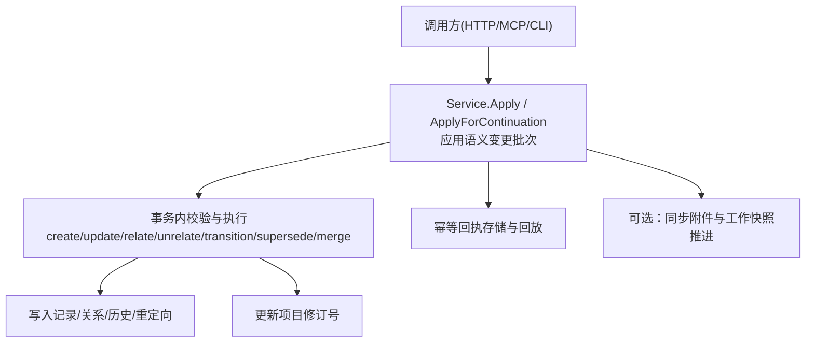
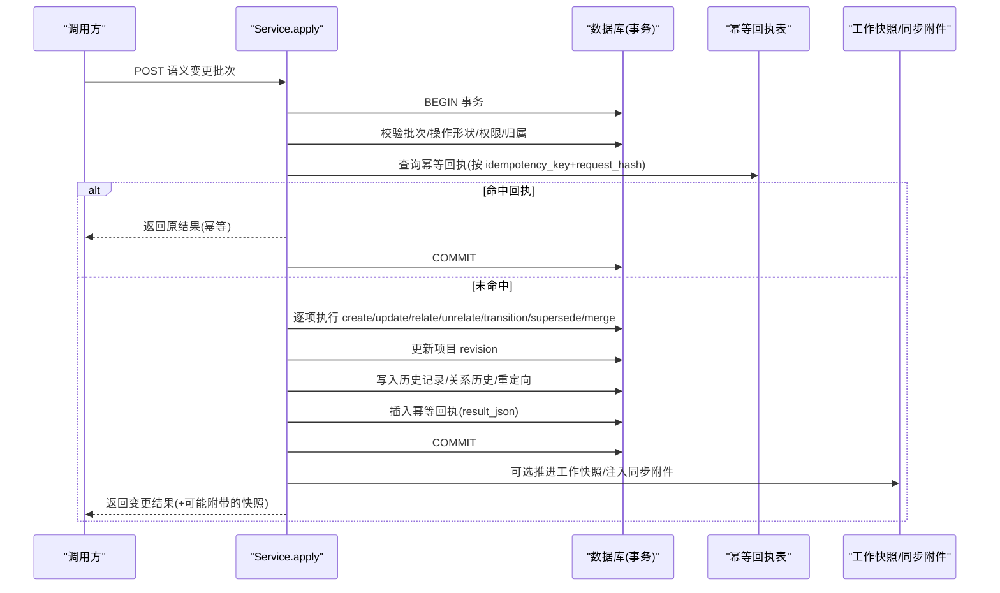
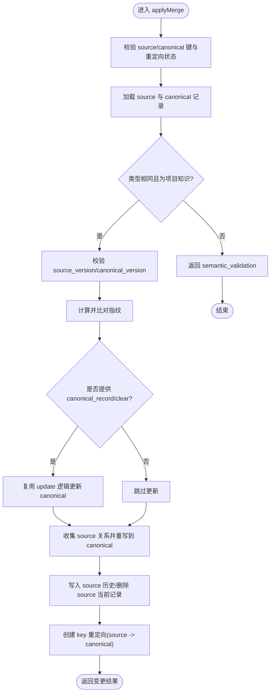
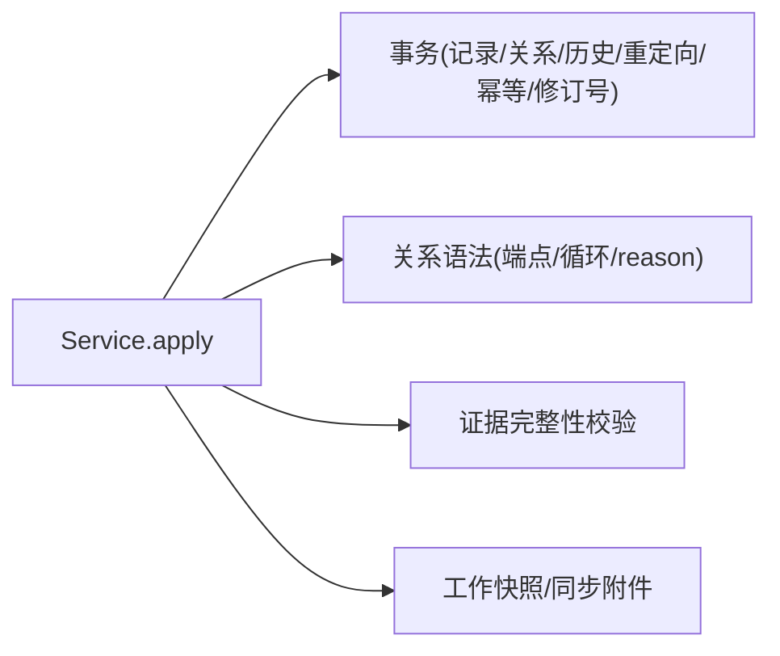

# 语义变更流水线

<cite>
**本文引用的文件**   
- [blackboard-v2-spec.md](file://docs/specs/blackboard-v2-spec.md)
- [0007-rebuild-blackboard-v2-atomically.md](file://docs/adr/0007-rebuild-blackboard-v2-atomically.md)
- [service.go](file://internal/blackboardv2/service.go)
- [merge.go](file://internal/blackboardv2/merge.go)
- [blackboard-v2-tdd-plan.md](file://docs/specs/blackboard-v2-tdd-plan.md)
</cite>

## 目录
1. [引言](#引言)
2. [项目结构](#项目结构)
3. [核心组件](#核心组件)
4. [架构总览](#架构总览)
5. [详细组件分析](#详细组件分析)
6. [依赖分析](#依赖分析)
7. [性能考量](#性能考量)
8. [故障排查指南](#故障排查指南)
9. [结论](#结论)
10. [附录](#附录)

## 引言
本文件面向 Blackboard v2 的“语义变更流水线”，聚焦 ChangeBatch 与七种原子操作（create、update、relate、unrelate、transition、supersede、merge）的语义含义、处理流程、事务边界、幂等性保证、冲突检测与合并算法，并给出构建有效语义变更请求的实践要点与错误处理模式。Blackboard v2 是项目的持久化语义记忆平面，提供当前工作项、项目知识与关系图，并通过紧凑的运行时快照对外暴露。

## 项目结构
围绕语义变更流水线的关键实现位于 blackboardv2 服务层与规范文档：
- 规范与决策：blackboard-v2-spec.md、ADR 0007、TDD 计划
- 服务实现：service.go（批处理入口、校验、事务、幂等、结果）、merge.go（unrelate、merge 等关系与合并逻辑）

图示来源
- [service.go:644-1154](file://internal/blackboardv2/service.go#L644-L1154)
- [service.go:1156-1176](file://internal/blackboardv2/service.go#L1156-L1176)
- [service.go:2900-2922](file://internal/blackboardv2/service.go#L2900-L2922)
- [service.go:2924-3000](file://internal/blackboardv2/service.go#L2924-L3000)
- [merge.go:24-89](file://internal/blackboardv2/merge.go#L24-L89)
- [merge.go:91-238](file://internal/blackboardv2/merge.go#L91-L238)

章节来源
- [blackboard-v2-spec.md:186-234](file://docs/specs/blackboard-v2-spec.md#L186-L234)
- [service.go:644-1154](file://internal/blackboardv2/service.go#L644-L1154)

## 核心组件
- ChangeBatch：语义变更批次信封，包含 schema、idempotency_key、changes 列表；严格关闭字段集校验。
- Change：单个操作对象，按 op 区分 create/update/relate/unrelate/transition/supersede/merge，各操作有严格的必填/可选字段约束。
- Service：封装事务、幂等、版本冲突、生命周期守卫、关系语法校验、循环检测、Key 重定向解析、结果组装与同步附件注入。

章节来源
- [service.go:72-147](file://internal/blackboardv2/service.go#L72-L147)
- [service.go:149-232](file://internal/blackboardv2/service.go#L149-L232)
- [service.go:644-1154](file://internal/blackboardv2/service.go#L644-L1154)

## 架构总览
语义变更流水线在单次事务中完成“全量最终状态校验 + 原子提交”。关键特性：
- 原子性：一次 Apply 对应一个数据库事务，全部成功或全部回滚。
- 幂等性：基于 idempotency_key + 请求哈希的回执表，重复提交返回相同语义结果。
- 乐观锁：所有写操作携带 expected version，冲突时返回明确错误。
- 同步附件：当存在外部并行任务变更时，可在响应中附带完整运行时快照供客户端替换本地工作快照。

图示来源
- [service.go:824-1154](file://internal/blackboardv2/service.go#L824-L1154)
- [service.go:2900-2922](file://internal/blackboardv2/service.go#L2900-L2922)
- [service.go:2924-3000](file://internal/blackboardv2/service.go#L2924-L3000)

## 详细组件分析

### 操作语义与处理逻辑

#### create
- 语义：在指定 Blackboard Key 上创建一条新记录，类型由 type 决定，record 为完整闭合 DTO。
- 处理要点：
  - 键唯一性检查（含历史键冲突）。
  - 类型完整性与字段校验。
  - 若已存在且内容完全一致则视为幂等无变更。
  - 写入当前记录表，版本号从 1 开始，项目 revision 递增。
- 典型错误：key_conflict、semantic_validation。

章节来源
- [service.go:1682-1724](file://internal/blackboardv2/service.go#L1682-L1724)
- [service.go:1663-1680](file://internal/blackboardv2/service.go#L1663-L1680)
- [service.go:1603-1631](file://internal/blackboardv2/service.go#L1603-L1631)
- [service.go:1633-1661](file://internal/blackboardv2/service.go#L1633-L1661)
- [service.go:1726-1771](file://internal/blackboardv2/service.go#L1726-L1771)

#### update
- 语义：对现有记录的局部更新，使用 current version 进行乐观锁保护；支持 clear 列表显式清空可选字段。
- 处理要点：
  - 读取当前记录并校验类型与版本。
  - 应用 patch 与 clear，生成 nextRecord。
  - 若内容与当前一致则幂等无变更；否则写入历史并更新当前记录，version+1，revision+1。
- 典型错误：not_found、version_conflict、semantic_validation。

章节来源
- [service.go:1773-1843](file://internal/blackboardv2/service.go#L1773-L1843)
- [service.go:1845-1869](file://internal/blackboardv2/service.go#L1845-L1869)
- [service.go:1871-1895](file://internal/blackboardv2/service.go#L1871-L1895)
- [service.go:1954-2027](file://internal/blackboardv2/service.go#L1954-L2027)
- [service.go:1897-1920](file://internal/blackboardv2/service.go#L1897-L1920)
- [service.go:1922-1952](file://internal/blackboardv2/service.go#L1922-L1952)

#### relate
- 语义：建立 or 更新关系三元组 (from, relation, to)。仅允许的关系类型与端点方向由关系语法定义；部分关系可携带 reason。
- 处理要点：
  - 两端点必须存在且类型匹配。
  - 自链接禁止；根据规则进行循环检测。
  - 若关系已存在且 reason 不变则为幂等；若 reason 变化需传入当前 version 以乐观锁更新。
  - 新建关系时 version 不接收，系统分配 max_version+1。
- 典型错误：not_found、semantic_validation（端点/循环/原因）、version_conflict。

章节来源
- [service.go:2029-2150](file://internal/blackboardv2/service.go#L2029-L2150)
- [service.go:2152-2164](file://internal/blackboardv2/service.go#L2152-L2164)
- [service.go:2166-2180](file://internal/blackboardv2/service.go#L2166-L2180)
- [service.go:2712-2724](file://internal/blackboardv2/service.go#L2712-L2724)
- [service.go:2735-2776](file://internal/blackboardv2/service.go#L2735-L2776)
- [service.go:2778-2825](file://internal/blackboardv2/service.go#L2778-L2825)

#### unrelate
- 语义：移除当前关系，要求传入当前 version。
- 处理要点：
  - 两端点存在且非自链接。
  - 关系必须存在且 version 匹配。
  - 删除前写入关系历史，再删除当前关系。
- 典型错误：not_found、semantic_validation、version_conflict。

章节来源
- [merge.go:24-89](file://internal/blackboardv2/merge.go#L24-L89)

#### transition
- 语义：对记录执行合法的生命周期转换，如实体退休、目标解决/放弃、尝试终态、事实置信度切换、发现确认/误报、证据缺失等。
- 处理要点：
  - 版本校验与类型匹配。
  - 针对每种类型的状态机与前置条件（例如 resolved Objective 需要 incoming satisfies；confirmed Finding 需要完整报告字段与证据/支持事实；succeeded Attempt 需要有产出的可复用结果或同类型替换）。
  - 终态记录会迁移到历史并从当前表移除。
- 典型错误：semantic_validation（非法状态/前置条件不足）、version_conflict。

章节来源
- [service.go:2182-2325](file://internal/blackboardv2/service.go#L2182-L2325)
- [service.go:2577-2616](file://internal/blackboardv2/service.go#L2577-L2616)
- [service.go:2467-2498](file://internal/blackboardv2/service.go#L2467-L2498)
- [service.go:2500-2557](file://internal/blackboardv2/service.go#L2500-L2557)
- [service.go:2559-2575](file://internal/blackboardv2/service.go#L2559-L2575)

#### supersede
- 语义：原子地将“被替换”记录置为终态，并建立 supersedes 关系指向“替换者”。
- 处理要点：
  - 两端点必须存在且类型允许（同类型可替换集合）。
  - replacement_version 仅在替换者在同一批次中刚创建时可省略（此时为 1），否则必须显式传入。
  - 将 replaced 记录终态化并移入历史，同时写入 supersedes 关系历史。
- 典型错误：not_found、semantic_validation（类型/版本/同记录）、version_conflict。

章节来源
- [service.go:2618-2710](file://internal/blackboardv2/service.go#L2618-L2710)
- [service.go:2577-2616](file://internal/blackboardv2/service.go#L2577-L2616)

#### merge
- 语义：对同类型的“项目知识”记录进行去重合并，将 source 合并进 canonical，并重写其关系，source 变为重定向源。
- 处理要点：
  - 两端点必须存在且类型相同，且均为“项目知识”类型（不允许合并“当前工作”）。
  - 指纹一致性校验（按类型归一化关键字段后计算指纹）。
  - 可选对 canonical 做局部更新与 clear。
  - 重写 source 的所有关系至 canonical，避免自环与循环，必要时提升版本。
  - 删除 source 当前记录，写入历史，并创建 key 重定向。
- 典型错误：semantic_validation（类型/指纹/循环）、key_conflict（重定向冲突）、version_conflict。

图示来源
- [merge.go:91-238](file://internal/blackboardv2/merge.go#L91-L238)
- [merge.go:240-260](file://internal/blackboardv2/merge.go#L240-L260)
- [merge.go:262-284](file://internal/blackboardv2/merge.go#L262-L284)
- [merge.go:286-308](file://internal/blackboardv2/merge.go#L286-L308)
- [merge.go:310-335](file://internal/blackboardv2/merge.go#L310-L335)
- [merge.go:345-421](file://internal/blackboardv2/merge.go#L345-L421)

章节来源
- [merge.go:91-238](file://internal/blackboardv2/merge.go#L91-L238)

### 事务边界与回滚策略
- 每个 Apply 调用开启一个事务，任何步骤失败均触发回滚。
- 幂等回执在事务内写入，确保“结果持久化”与“幂等可见性”一致。
- 工作快照推进与同步附件注入发生在事务提交之后，避免长事务持有锁。

章节来源
- [service.go:824-1154](file://internal/blackboardv2/service.go#L824-L1154)
- [service.go:1131-1154](file://internal/blackboardv2/service.go#L1131-L1154)

### 幂等性与冲突检测
- 幂等：通过 idempotency_key + request_hash 定位回执，命中即直接返回原结果。
- 冲突：
  - 记录/关系版本不一致返回 version_conflict，附带期望/当前版本与下一步建议。
  - 键冲突返回 key_conflict（包括历史键占用）。
  - 语义校验失败返回 semantic_validation（生命周期、关系语法、文本长度等）。

章节来源
- [service.go:846-881](file://internal/blackboardv2/service.go#L846-L881)
- [service.go:1773-1843](file://internal/blackboardv2/service.go#L1773-L1843)
- [service.go:2029-2150](file://internal/blackboardv2/service.go#L2029-L2150)
- [service.go:2618-2710](file://internal/blackboardv2/service.go#L2618-L2710)
- [service.go:2924-3000](file://internal/blackboardv2/service.go#L2924-L3000)

### 变更验证规则与关系语法
- 关系端点合法性、方向限制、reason 允许范围与冗余性检查。
- 循环检测：
  - part_of、derived_from、depends_on、supports（事实间）等关系族保持无环。
  - 合并过程中重写关系时需再次校验循环。
- 生命周期守卫：
  - Objective resolved 需要 incoming satisfies。
  - Attempt 终态需要 tests 关系与产出结果（或替换）。
  - Fact confirmed 需要可信依据（证据/支持事实/成功 Attempt）。
  - Finding confirmed/false_positive 需要完整字段与证据/矛盾事实。
  - Evidence missing 需要摘要。

章节来源
- [service.go:2029-2150](file://internal/blackboardv2/service.go#L2029-L2150)
- [service.go:2166-2180](file://internal/blackboardv2/service.go#L2166-L2180)
- [service.go:2735-2776](file://internal/blackboardv2/service.go#L2735-L2776)
- [service.go:2778-2825](file://internal/blackboardv2/service.go#L2778-L2825)
- [service.go:2467-2498](file://internal/blackboardv2/service.go#L2467-L2498)
- [service.go:2500-2557](file://internal/blackboardv2/service.go#L2500-L2557)
- [service.go:2559-2575](file://internal/blackboardv2/service.go#L2559-L2575)
- [service.go:2182-2325](file://internal/blackboardv2/service.go#L2182-L2325)

### 同步与并行任务协作
- 当存在外部任务变更时，服务可在认证通过后附加共享同步信息，包含 from_revision、revision 与完整运行时快照，客户端应原子替换本地工作快照并 ack 新版本。
- 工作快照路径固定，仅在受信任 Continuation 拥有权下推进。

章节来源
- [service.go:1156-1176](file://internal/blackboardv2/service.go#L1156-L1176)
- [blackboard-v2-spec.md:235-251](file://docs/specs/blackboard-v2-spec.md#L235-L251)

## 依赖分析
- 服务层依赖：
  - 数据库事务与读写（记录、关系、历史、重定向、幂等回执、项目修订号）。
  - 关系语法库（关系端点、循环策略、reason 校验）。
  - 证据完整性校验（用于 Fact confirmation 的证据链）。
- 外部契约：
  - HTTP/MCP/CLI 适配器通过统一语义服务接口调用，不直接访问存储细节。
  - 运行时快照与工具清单遵循 v2 规范。

图示来源
- [service.go:824-1154](file://internal/blackboardv2/service.go#L824-L1154)
- [service.go:2166-2180](file://internal/blackboardv2/service.go#L2166-L2180)
- [service.go:2327-2439](file://internal/blackboardv2/service.go#L2327-L2439)

章节来源
- [service.go:824-1154](file://internal/blackboardv2/service.go#L824-L1154)

## 性能考量
- 原子批处理减少往返与锁竞争，但需注意批量大小与复杂关系重写的开销。
- 关系循环检测与多族关系扫描在大规模图中可能成为热点，建议在合并与大量关系变更时谨慎分批。
- 幂等回执与历史写入会增加 I/O，但保障正确性与可观测性。

[本节为通用指导，无需具体文件引用]

## 故障排查指南
- 常见错误码与定位：
  - invalid_schema：批次 schema 不匹配。
  - semantic_validation：字段/生命周期/关系语法/文本长度等校验失败。
  - not_found：记录/关系不存在。
  - key_conflict：键冲突或重定向冲突。
  - version_conflict：乐观锁冲突，提示期望/当前版本与下一步动作。
  - authority_denied：权限不足（如 Runtime 不可执行 merge）。
  - closed_continuation：Continuation 已关闭或不拥有工作快照。
- 排查建议：
  - 先读取当前记录与关系，确认版本与端点合法性。
  - 对于 merge，核对指纹与关系重写后的循环风险。
  - 对于 transition，检查前置条件（如 satisfies/tests/evidence）。
  - 关注同步附件中的 revision 差异，及时替换本地快照。

章节来源
- [service.go:824-1154](file://internal/blackboardv2/service.go#L824-L1154)
- [service.go:1773-1843](file://internal/blackboardv2/service.go#L1773-L1843)
- [service.go:2029-2150](file://internal/blackboardv2/service.go#L2029-L2150)
- [service.go:2182-2325](file://internal/blackboardv2/service.go#L2182-L2325)
- [service.go:2618-2710](file://internal/blackboardv2/service.go#L2618-L2710)
- [service.go:2924-3000](file://internal/blackboardv2/service.go#L2924-L3000)

## 结论
Blackboard v2 的语义变更流水线以“原子批次 + 幂等回执 + 乐观版本 + 强校验”为核心，确保跨任务并发下的数据一致性与可恢复性。七类操作覆盖记录生命周期与关系拓扑的完整语义空间，配合 Key 重定向与合并机制，支撑长期演进与知识收敛。实践中应严格遵循版本与前置条件，合理拆分批处理，并在收到同步附件时及时替换工作快照。

[本节为总结，无需具体文件引用]

## 附录

### 构建有效语义变更请求的最佳实践
- 始终提供稳定的 idempotency_key，重试时使用相同值。
- 在同一批次内利用“先创建后引用”的顺序，避免额外读取。
- 对关系 reason 的使用要简洁且有语义增量，避免冗余。
- 合并前先评估指纹与关系影响，必要时先更新 canonical 再合并。
- 遇到 version_conflict 时，先读当前记录再重试。

章节来源
- [blackboard-v2-spec.md:186-234](file://docs/specs/blackboard-v2-spec.md#L186-L234)
- [service.go:824-1154](file://internal/blackboardv2/service.go#L824-L1154)

### 迁移与原子切换背景
- v1 到 v2 的迁移采用离线备份优先、原子切换的策略，确保无长寿命双读/双写路径。

章节来源
- [0007-rebuild-blackboard-v2-atomically.md:1-4](file://docs/adr/0007-rebuild-blackboard-v2-atomically.md#L1-L4)
- [blackboard-v2-tdd-plan.md:1-170](file://docs/specs/blackboard-v2-tdd-plan.md#L1-L170)