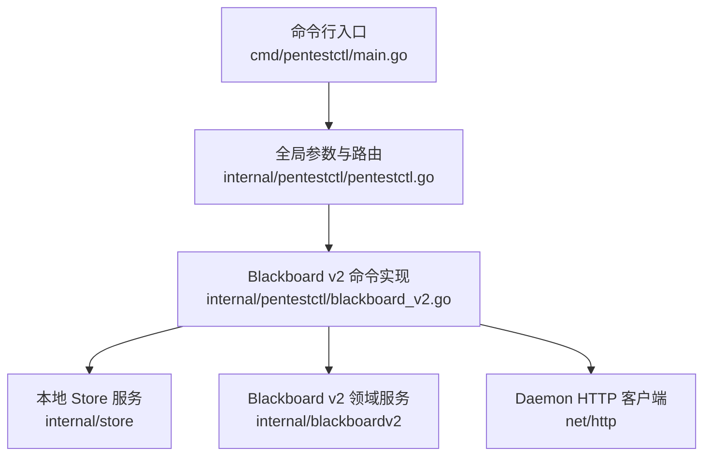
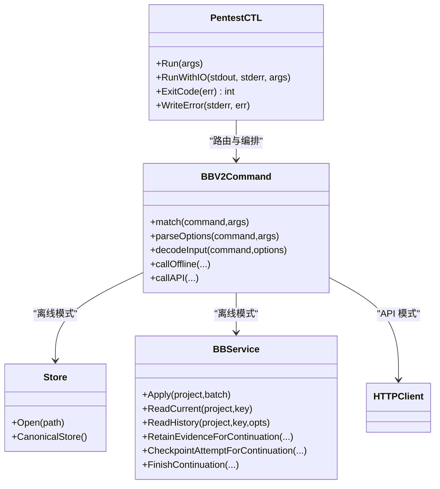

# CLI 工具

<cite>
**本文引用的文件**
- [cmd/pentestctl/main.go](file://cmd/pentestctl/main.go)
- [internal/pentestctl/pentestctl.go](file://internal/pentestctl/pentestctl.go)
- [internal/pentestctl/blackboard_v2.go](file://internal/pentestctl/blackboard_v2.go)
- [README.md](file://README.md)
- [docs/specs/blackboard-v2-spec.md](file://docs/specs/blackboard-v2-spec.md)
- [internal/blackboardv2contract/contractdata/openapi.json](file://internal/blackboardv2contract/contractdata/openapi.json)
</cite>

## 目录
1. [简介](#简介)
2. [项目结构](#项目结构)
3. [核心组件](#核心组件)
4. [架构总览](#架构总览)
5. [详细命令参考](#详细命令参考)
6. [离线 Store 模式与 API 模式差异](#离线-store-模式与-api-模式差异)
7. [环境变量与认证](#环境变量与认证)
8. [错误处理与退出码](#错误处理与退出码)
9. [批量操作与自动化脚本编写](#批量操作与自动化脚本编写)
10. [依赖关系分析](#依赖关系分析)
11. [性能与限制](#性能与限制)
12. [故障排查指南](#故障排查指南)
13. [结论](#结论)

## 简介
本文件为 CyberPenda 的 CLI 工具 pentestctl 的完整参考文档。pentestctl 提供 Blackboard v2 语义操作的统一入口，支持两种运行模式：
- 离线 Store 模式：直接读写本地 SQLite 存储（blackboard_v2），用于运维、迁移和调试。
- API 模式：通过 Daemon 提供的 /api/v2 接口访问，适用于 Runtime 任务或 Operator 管理场景。

CLI 同时提供 Blackboard v2 的离线迁移子命令族（inspect/backup/migrate/verify），用于从 v1 平滑升级到 v2。

## 项目结构
pentestctl 由一个可执行入口与内部实现包组成：
- 入口：cmd/pentestctl/main.go
- 核心逻辑：internal/pentestctl/pentestctl.go（全局参数解析、帮助输出、迁移子命令路由）
- Blackboard v2 命令实现：internal/pentestctl/blackboard_v2.go（命令匹配、选项解析、离线/在线调用、结果/错误编码）



图表来源
- [cmd/pentestctl/main.go:1-15](file://cmd/pentestctl/main.go#L1-L15)
- [internal/pentestctl/pentestctl.go:19-47](file://internal/pentestctl/pentestctl.go#L19-L47)
- [internal/pentestctl/blackboard_v2.go:90-144](file://internal/pentestctl/blackboard_v2.go#L90-L144)

章节来源
- [cmd/pentestctl/main.go:1-15](file://cmd/pentestctl/main.go#L1-L15)
- [internal/pentestctl/pentestctl.go:19-47](file://internal/pentestctl/pentestctl.go#L19-L47)

## 核心组件
- 全局参数
  - --db：SQLite 数据库路径（默认 pentest.db）
  - --api：Daemon API 基础地址（如 http://127.0.0.1:8787）
  - --token：Bearer Token（Operator 模式必需；Runtime 模式可通过环境变量注入）
- 命令路由
  - blackboard <command> [...]：Blackboard v2 语义命令
  - blackboard help：打印命令摘要
  - blackboard v2 <operation> [...]：离线迁移子命令（inspect/backup/migrate/verify）

章节来源
- [internal/pentestctl/pentestctl.go:23-47](file://internal/pentestctl/pentestctl.go#L23-L47)
- [internal/pentestctl/pentestctl.go:49-60](file://internal/pentestctl/pentestctl.go#L49-L60)

## 架构总览
CLI 在运行时根据上下文选择离线或在线路径：
- 若设置了 --project 且/或 --actor-id，进入 Operator 模式：
  - 若配置了 --api 与 --token，则走 Daemon API 路径
  - 否则走离线 Store 路径
- 未设置 operator 标志时，进入 Runtime 模式：
  - 若配置了 --api 或通过环境变量 PENTEST_API_URL 指定，则走 Daemon API 路径，并需携带 PENTEST_INTERFACE_TOKEN
  - 否则走离线 Store 路径，使用能力令牌（capability token）进行授权校验

```mermaid
sequenceDiagram
participant U as "用户"
participant CLI as "pentestctl"
participant OFF as "离线 Store"
participant API as "Daemon /api/v2"
U->>CLI : 执行 pentestctl ... blackboard <cmd>
CLI->>CLI : 解析全局参数与子命令
alt Operator 模式(--project/--actor-id)
CLI->>CLI : 校验必要参数
alt 已配置 --api 与 --token
CLI->>API : POST/GET /api/v2/projects/{id}/...
API-->>CLI : JSON 响应(含可选 sync)
else 未配置 --api
CLI->>OFF : 打开本地 store 并执行
OFF-->>CLI : 结构化结果
end
else Runtime 模式
CLI->>CLI : 读取环境变量(PENTEST_API_URL/PENTEST_INTERFACE_TOKEN等)
alt 已配置 API
CLI->>API : 带 Authorization 请求
API-->>CLI : JSON 响应(含可选 sync)
else 离线
CLI->>OFF : 基于能力令牌解析授权并执行
OFF-->>CLI : 结构化结果
end
end
CLI-->>U : 标准输出 JSON 或标准错误 JSON 错误
```

图表来源
- [internal/pentestctl/blackboard_v2.go:90-144](file://internal/pentestctl/blackboard_v2.go#L90-L144)
- [internal/pentestctl/blackboard_v2.go:400-455](file://internal/pentestctl/blackboard_v2.go#L400-L455)
- [internal/pentestctl/blackboard_v2.go:253-342](file://internal/pentestctl/blackboard_v2.go#L253-L342)

## 详细命令参考

### 全局参数
- --db <path>：SQLite 数据库路径（默认 pentest.db）
- --api <url>：Daemon API 基础地址（例如 http://127.0.0.1:8787）
- --token <token>：Bearer Token（Operator 模式必需；Runtime 模式可通过环境变量注入）

章节来源
- [internal/pentestctl/pentestctl.go:23-31](file://internal/pentestctl/pentestctl.go#L23-L31)

### Blackboard v2 命令族
通用子命令前缀：blackboard <command> [options]

- change
  - 用途：提交原子语义变更批次
  - 必填参数：--input FILE|-
  - 可选参数：--project PROJECT, --actor-id ACTOR
  - 说明：Operator 模式需要 --project 与 --actor-id；Runtime 模式通过环境变量绑定 Project/Task/Continuation 并通过能力令牌鉴权
  - 输入格式：semantic-change-batch/v2（包含 schema 与 changes）
  - 输出格式：semantic-change-result/v2（含 working_snapshot）

- read
  - 用途：读取当前记录详情
  - 必填参数：--key KEY
  - 可选参数：--project PROJECT, --actor-id ACTOR
  - 输出格式：blackboard-record/v2（含 record 与 relationships）

- history
  - 用途：分页读取语义历史
  - 必填参数：--key KEY
  - 可选参数：--cursor CURSOR, --limit LIMIT, --project PROJECT, --actor-id ACTOR
  - 输出格式：semantic-history/v2（含 items 与 next_cursor）

- evidence retain
  - 用途：保留证据（受限于 Continuation 边界）
  - 必填参数：--input FILE|-
  - 说明：仅允许可信 Continuation 执行
  - 输入格式：RetainEvidenceRequest（含 key/version/attempt/source_path/artifact_type/summary 等）

- attempt checkpoint
  - 用途：对 Attempt 打点（断点/检查点）
  - 必填参数：--input FILE|-
  - 说明：仅允许可信 Continuation 执行
  - 输入格式：CheckpointAttemptRequest（含 key/version/summary/idempotency_key）

- continuation finish
  - 用途：结束 Continuation（幂等）
  - 必填参数：--input FILE|-
  - 说明：仅允许可信 Continuation 执行
  - 输入格式：FinishContinuationRequest（含 idempotency_key）

- blackboard help
  - 用途：打印上述命令摘要

章节来源
- [internal/pentestctl/pentestctl.go:49-60](file://internal/pentestctl/pentestctl.go#L49-L60)
- [internal/pentestctl/blackboard_v2.go:63-88](file://internal/pentestctl/blackboard_v2.go#L63-L88)
- [internal/pentestctl/blackboard_v2.go:155-193](file://internal/pentestctl/blackboard_v2.go#L155-L193)
- [internal/pentestctl/blackboard_v2.go:195-221](file://internal/pentestctl/blackboard_v2.go#L195-L221)
- [internal/pentestctl/blackboard_v2.go:457-535](file://internal/pentestctl/blackboard_v2.go#L457-L535)
- [internal/pentestctl/blackboard_v2.go:537-620](file://internal/pentestctl/blackboard_v2.go#L537-L620)

### Blackboard v2 离线迁移子命令
- blackboard v2 inspect
  - 用途：只读扫描现有数据，生成迁移计划
  - 参数：--artifact-root ROOT（默认与 --db 同目录）
  - 输出：JSON（包含 source_digest、projects、validation_blockers、required_decisions）

- blackboard v2 backup
  - 用途：在切换前创建备份
  - 参数：--backup BACKUP.db, --artifact-root ROOT
  - 输出：JSON（包含备份路径、校验信息）

- blackboard v2 migrate
  - 用途：执行迁移
  - 参数：--plan PLAN.json, --backup BACKUP.db, --artifact-root ROOT
  - 行为：按 required_decisions 执行决策，写入新结构

- blackboard v2 verify
  - 用途：验证迁移后一致性
  - 参数：--artifact-root ROOT
  - 输出：JSON（包含迁移状态）

注意：迁移子命令为离线-only，禁止使用 --api。

章节来源
- [internal/pentestctl/pentestctl.go:62-108](file://internal/pentestctl/pentestctl.go#L62-L108)
- [internal/pentestctl/pentestctl.go:110-186](file://internal/pentestctl/pentestctl.go#L110-L186)
- [docs/specs/blackboard-v2-spec.md:343-353](file://docs/specs/blackboard-v2-spec.md#L343-L353)

## 离线 Store 模式与 API 模式差异
- 授权与身份
  - Operator 模式：必须显式提供 --project 与 --actor-id；API 模式还需 --token
  - Runtime 模式：通过环境变量 PENTEST_PROJECT_ID/PENTEST_TASK_ID/PENTEST_CONTINUATION_ID 声明上下文，并使用 PENTEST_INTERFACE_TOKEN 作为能力令牌；API 模式下 Project 由 Grant 绑定，路径中的 Project 仅做声明性匹配
- 数据源
  - 离线模式：直接打开本地 SQLite（要求 blackboard_v2 epoch）
  - API 模式：通过 HTTP 调用 /api/v2 端点，遵循幂等键与 revision ETag 等契约
- 同步附件
  - 两者均可能返回可选的 synchronization attachment，以便下游重试或拉取最新快照
- 安全边界
  - 离线模式严格校验 Store epoch 与能力令牌；API 模式由服务端校验 Grant 与路径 Project 的一致性

章节来源
- [internal/pentestctl/blackboard_v2.go:90-144](file://internal/pentestctl/blackboard_v2.go#L90-L144)
- [internal/pentestctl/blackboard_v2.go:253-277](file://internal/pentestctl/blackboard_v2.go#L253-L277)
- [docs/specs/blackboard-v2-spec.md:275-291](file://docs/specs/blackboard-v2-spec.md#L275-L291)

## 环境变量与认证
- PENTEST_API_URL：Daemon API 基础地址（优先级低于 --api）
- PENTEST_INTERFACE_TOKEN：Runtime 模式的能力令牌（优先级低于 --token）
- PENTEST_PROJECT_ID、PENTEST_TASK_ID、PENTEST_CONTINUATION_ID：Runtime 模式的上下文声明（仅在离线模式用于能力令牌绑定校验；API 模式下由 Grant 决定实际绑定）
- 其他 Daemon 相关环境变量（供 daemon 自身使用，非 CLI 直接控制）：PENTEST_LISTEN_ADDR、PENTEST_DB、PENTEST_RUNTIME_ROOT、PENTEST_SANDBOX_IMAGE、PENTEST_CONTAINER_CLI、PENTEST_AUTH_TOKEN、PENTEST_RUNTIME_PLUGIN_DIRS、PENTEST_RUNTIME_EXTENSION_DIRS

章节来源
- [internal/pentestctl/pentestctl.go:206-213](file://internal/pentestctl/pentestctl.go#L206-L213)
- [internal/pentestctl/blackboard_v2.go:116-144](file://internal/pentestctl/blackboard_v2.go#L116-L144)
- [README.md:110-126](file://README.md#L110-L126)

## 错误处理与退出码
- 错误输出
  - 当存在结构化 Blackboard v2 错误时，CLI 将 JSON 错误文档写入 stderr，包含 error.code/message/path/retryable/details 以及可选的 sync 附件
- 退出码映射
  - 2：invalid_schema（请求/参数不合法）
  - 3：authority_denied（权限不足）
  - 4：not_found（资源不存在）
  - 5：closed_continuation/version_conflict/key_conflict/relationship_conflict/idempotency_conflict/finish_conflict（业务冲突）
  - 6：其他未知语义错误
  - 7：retryable 或 storage_busy（建议重试）
  - 1：internal（内部错误）
  - 0：成功

章节来源
- [internal/pentestctl/blackboard_v2.go:910-948](file://internal/pentestctl/blackboard_v2.go#L910-L948)
- [internal/pentestctl/blackboard_v2.go:950-962](file://internal/pentestctl/blackboard_v2.go#L950-L962)

## 批量操作与自动化脚本编写
- 幂等性与重试
  - 所有写操作（change/evidence retain/checkpoint/finish）均支持 Idempotency-Key；建议在脚本中为每次写入生成稳定唯一键，并在遇到 retryable/storage_busy 时自动重试
- 分页与游标
  - history 支持 cursor 与 limit；脚本应循环读取 next_cursor 直至为空
- 流式输入
  - --input - 可从 stdin 读取 UTF-8 JSON；适合管道化生成与过滤
- 典型流程
  - 准备变更批次 JSON -> 调用 change -> 捕获 working_snapshot.revision -> 后续操作携带该 revision 以保持一致性
  - 使用 checkpoint 定期保存进度，配合 finish 完成生命周期
  - 使用 evidence retain 归档证据，确保 artifact 路径与媒体类型正确

章节来源
- [internal/pentestctl/blackboard_v2.go:457-535](file://internal/pentestctl/blackboard_v2.go#L457-L535)
- [internal/pentestctl/blackboard_v2.go:195-221](file://internal/pentestctl/blackboard_v2.go#L195-L221)
- [docs/specs/blackboard-v2-spec.md:275-291](file://docs/specs/blackboard-v2-spec.md#L275-L291)

## 依赖关系分析
CLI 与后端服务的交互主要依赖以下模块：
- 本地 Store：internal/store（打开 blackboard_v2 数据库、迁移源）
- Blackboard v2 领域服务：internal/blackboardv2（变更应用、读取、历史、证据、检查点、结束）
- Daemon HTTP 客户端：net/http（构造请求、设置 Header、限流与校验响应）
- 项目接口与授权：internal/projectinterface（能力令牌解析与绑定校验）



图表来源
- [internal/pentestctl/pentestctl.go:19-47](file://internal/pentestctl/pentestctl.go#L19-L47)
- [internal/pentestctl/blackboard_v2.go:90-144](file://internal/pentestctl/blackboard_v2.go#L90-L144)
- [internal/pentestctl/blackboard_v2.go:253-342](file://internal/pentestctl/blackboard_v2.go#L253-L342)
- [internal/pentestctl/blackboard_v2.go:400-455](file://internal/pentestctl/blackboard_v2.go#L400-L455)

## 性能与限制
- 输入大小限制：单条请求 JSON 最大 4 MiB
- 输出大小限制：单次响应最大 16 MiB
- History 分页：默认 limit 20，最大 100，使用 opaque cursor 翻页
- 幂等键：所有写操作必须提供 Idempotency-Key，避免重复写入

章节来源
- [internal/pentestctl/blackboard_v2.go:24-28](file://internal/pentestctl/blackboard_v2.go#L24-L28)
- [internal/pentestctl/blackboard_v2.go:425-434](file://internal/pentestctl/blackboard_v2.go#L425-L434)
- [docs/specs/blackboard-v2-spec.md:275-291](file://docs/specs/blackboard-v2-spec.md#L275-L291)

## 故障排查指南
- 常见错误码定位
  - invalid_schema：检查 --input 或 --key 是否符合规范，确认 JSON 字段白名单与嵌套对象限制
  - authority_denied：Operator 模式缺少 --project/--actor-id 或未提供 --token；Runtime 模式缺少 PENTEST_INTERFACE_TOKEN 或上下文不匹配
  - not_found：Key 不存在或 Continuation 已结束
  - version_conflict/key_conflict/relationship_conflict/idempotency_conflict/finish_conflict：并发写入或重复提交导致，建议使用幂等键并重试
  - storage_busy/retryable：短暂拥塞，建议指数退避重试
  - internal：底层错误或网络异常，查看 stderr 的 JSON 错误文档
- 诊断步骤
  - 启用 verbose：将 stderr 重定向到文件，捕获结构化错误文档
  - 校验输入：先单独验证 JSON 结构与字段白名单
  - 幂等键：确保唯一且稳定，避免误判冲突
  - 历史回溯：使用 history 分页检查最近变更与 next_cursor
  - 离线验证：使用 blackboard v2 verify 确认迁移一致性

章节来源
- [internal/pentestctl/blackboard_v2.go:910-948](file://internal/pentestctl/blackboard_v2.go#L910-L948)
- [internal/pentestctl/blackboard_v2.go:950-962](file://internal/pentestctl/blackboard_v2.go#L950-L962)
- [internal/pentestctl/pentestctl.go:110-186](file://internal/pentestctl/pentestctl.go#L110-L186)

## 结论
pentestctl 提供了统一的 Blackboard v2 语义操作入口，覆盖 Operator 与 Runtime 两类使用场景，并提供离线迁移工具链。通过严格的输入/输出契约、幂等键与结构化错误模型，CLI 便于集成到自动化流水线与批处理脚本中。建议在生产环境中结合幂等键、分页与重试策略，确保可靠与可观测。