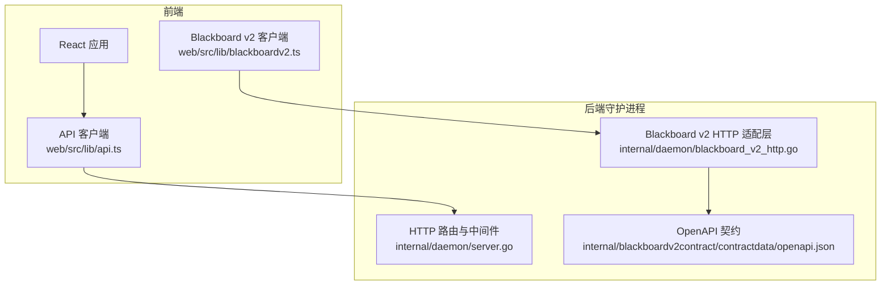
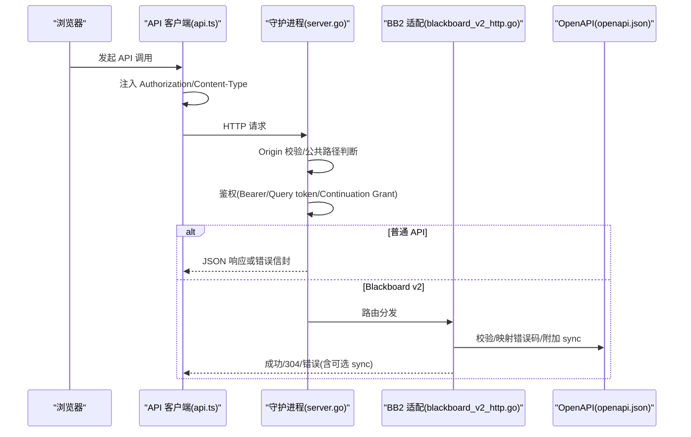
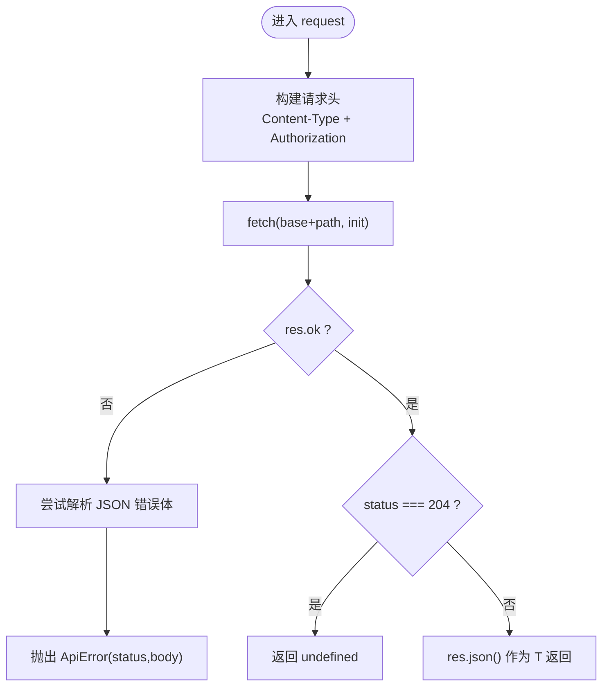
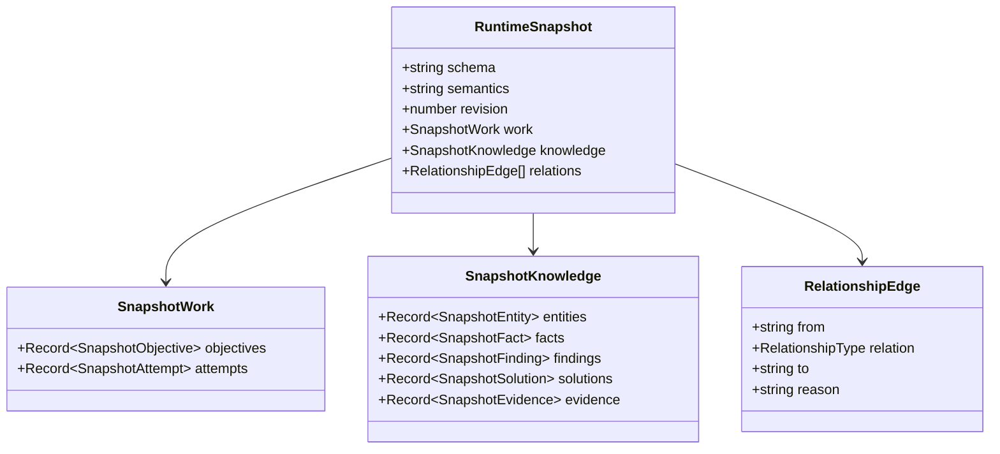
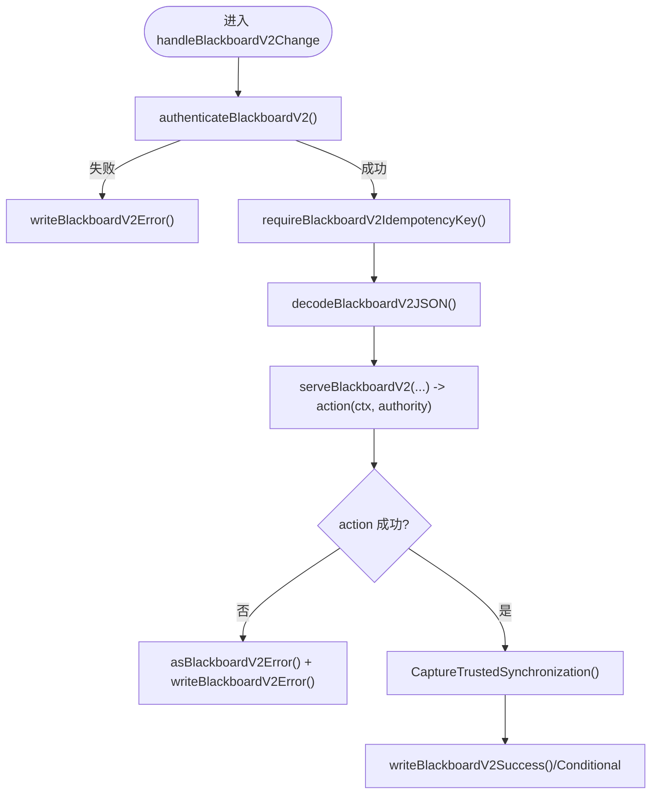
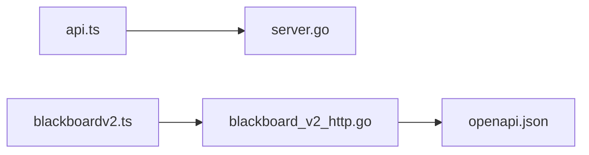

# API 客户端封装

<cite>
**本文引用的文件列表**
- [web/src/lib/api.ts](file://web/src/lib/api.ts)
- [web/src/lib/blackboardv2.ts](file://web/src/lib/blackboardv2.ts)
- [internal/daemon/server.go](file://internal/daemon/server.go)
- [internal/daemon/blackboard_v2_http.go](file://internal/daemon/blackboard_v2_http.go)
- [internal/projectinterface/bearer.go](file://internal/projectinterface/bearer.go)
- [internal/blackboardv2contract/contractdata/openapi.json](file://internal/blackboardv2contract/contractdata/openapi.json)
- [docs/specs/blackboard-runtime-protocol.md](file://docs/specs/blackboard-runtime-protocol.md)
</cite>

## 目录
1. [简介](#简介)
2. [项目结构](#项目结构)
3. [核心组件](#核心组件)
4. [架构总览](#架构总览)
5. [详细组件分析](#详细组件分析)
6. [依赖关系分析](#依赖关系分析)
7. [性能与可靠性](#性能与可靠性)
8. [故障排查指南](#故障排查指南)
9. [结论](#结论)
10. [附录](#附录)

## 简介
本文件面向“API 客户端封装”的完整实现，聚焦于前端 HTTP 请求封装、错误处理机制、类型安全设计，以及与后端守护进程（Daemon）和 Blackboard v2 系统的通信协议、认证机制和数据格式转换。文档还涵盖请求拦截器、响应处理、重试逻辑的实现建议，并提供 API 调用示例、错误码映射与调试技巧，解释与 Blackboard v2 的集成方式和实时数据更新机制。

## 项目结构
本项目采用 Go 守护进程 + React 仪表盘的本地优先架构：
- 前端通过统一的 typed API 客户端发起 HTTP 请求，自动注入认证头并解析结构化错误。
- 后端守护进程提供 RESTful API 与 Blackboard v2 语义接口，统一鉴权、限流与同步附件。
- Blackboard v2 是系统的记忆平面，提供变更批处理、快照、健康诊断、证据保留、断点检查与完成等能力。

图表来源
- [web/src/lib/api.ts:1-120](file://web/src/lib/api.ts#L1-L120)
- [web/src/lib/blackboardv2.ts:1-120](file://web/src/lib/blackboardv2.ts#L1-L120)
- [internal/daemon/server.go:587-643](file://internal/daemon/server.go#L587-L643)
- [internal/daemon/blackboard_v2_http.go:29-46](file://internal/daemon/blackboard_v2_http.go#L29-L46)
- [internal/blackboardv2contract/contractdata/openapi.json:1-100](file://internal/blackboardv2contract/contractdata/openapi.json#L1-L100)

章节来源
- [web/src/lib/api.ts:1-120](file://web/src/lib/api.ts#L1-L120)
- [internal/daemon/server.go:587-643](file://internal/daemon/server.go#L587-L643)

## 核心组件
- 通用 API 客户端（web/src/lib/api.ts）
  - 基于 fetch 的轻量封装，统一设置 Content-Type、Bearer Token、错误提取与抛出 ApiError。
  - 支持 GET/POST/PUT/PATCH/DELETE 方法，返回强类型 Promise<T>。
- Blackboard v2 客户端（web/src/lib/blackboardv2.ts）
  - 定义运行时快照、记录详情、历史、健康、报告等数据结构与解析器。
  - 提供 URL 构建工具、字段白名单校验、关系边解析、键值约束校验等。
- 守护进程 HTTP 服务（internal/daemon/server.go）
  - 注册所有 /api/* 路由，统一 Origin 校验、公共路径放行、Bearer/查询参数鉴权。
  - 提供健康检查、项目、运行配置、技能、凭据绑定、任务生命周期等接口。
- Blackboard v2 HTTP 适配层（internal/daemon/blackboard_v2_http.go）
  - 实现 v2 语义接口的 HTTP 适配：变更、快照、健康、记录读取/历史、证据保留、断点检查、完成、报告导出。
  - 统一错误信封、同步附件、ETag/If-None-Match、Idempotency-Key 幂等性、状态码映射。

章节来源
- [web/src/lib/api.ts:1-120](file://web/src/lib/api.ts#L1-L120)
- [web/src/lib/blackboardv2.ts:1-120](file://web/src/lib/blackboardv2.ts#L1-L120)
- [internal/daemon/server.go:587-643](file://internal/daemon/server.go#L587-L643)
- [internal/daemon/blackboard_v2_http.go:29-46](file://internal/daemon/blackboard_v2_http.go#L29-L46)

## 架构总览
下图展示了从浏览器到守护进程的端到端流程，包括认证、路由、语义处理与同步附件。

图表来源
- [web/src/lib/api.ts:20-52](file://web/src/lib/api.ts#L20-L52)
- [internal/daemon/server.go:383-411](file://internal/daemon/server.go#L383-L411)
- [internal/daemon/server.go:431-461](file://internal/daemon/server.go#L431-L461)
- [internal/daemon/blackboard_v2_http.go:368-438](file://internal/daemon/blackboard_v2_http.go#L368-L438)
- [internal/blackboardv2contract/contractdata/openapi.json:17-100](file://internal/blackboardv2contract/contractdata/openapi.json#L17-L100)

## 详细组件分析

### 通用 API 客户端（web/src/lib/api.ts）
- 请求拦截器
  - 自动设置 Content-Type: application/json。
  - 从 URL 查询参数或 sessionStorage 中获取 token，并以 Authorization: Bearer <token> 注入。
  - 合并用户自定义 headers，避免重复覆盖。
- 响应处理
  - 非 2xx 时尝试解析 JSON 错误体，提取结构化错误消息；否则使用 statusText。
  - 204 No Content 返回 undefined。
  - 正常响应按 JSON 反序列化为 T。
- 错误模型
  - 抛出 ApiError，包含 status 与 body，便于上层统一处理。
- 类型安全
  - 所有方法以泛型 T 返回 Promise<T>，配合 TypeScript 类型声明确保前后端结构一致。

图表来源
- [web/src/lib/api.ts:20-39](file://web/src/lib/api.ts#L20-L39)
- [web/src/lib/api.ts:41-52](file://web/src/lib/api.ts#L41-L52)
- [web/src/lib/api.ts:515-534](file://web/src/lib/api.ts#L515-L534)

章节来源
- [web/src/lib/api.ts:1-120](file://web/src/lib/api.ts#L1-L120)
- [web/src/lib/api.ts:515-534](file://web/src/lib/api.ts#L515-L534)

### Blackboard v2 客户端（web/src/lib/blackboardv2.ts）
- 类型与常量
  - 定义 schema 标识、关系类型集合、记录类型集合、快照字段白名单等。
- 数据解析器
  - parseRuntimeSnapshot：严格校验 schema、work/knowledge 分组、relations 数组。
  - parseCurrentDetail：校验 record 字段集与 relationships。
  - parseRelationship：闭合集校验关系类型，支持可选 reason。
  - 其他解析器针对 objective/attempt/entity/fact/finding/solution/evidence 进行白名单校验与必填字段验证。
- URL 构建
  - projectBlackboardV2Base、recordHref、blackboardHref、qs 等辅助函数用于构造稳定路径与查询串。
- 安全与健壮性
  - requireBlackboardKey 限制 key 为可打印 ASCII 且长度不超过 96。
  - 对数字、布尔、字符串等字段进行严格类型与范围校验。

图表来源
- [web/src/lib/blackboardv2.ts:167-174](file://web/src/lib/blackboardv2.ts#L167-L174)
- [web/src/lib/blackboardv2.ts:146-157](file://web/src/lib/blackboardv2.ts#L146-L157)
- [web/src/lib/blackboardv2.ts:159-165](file://web/src/lib/blackboardv2.ts#L159-L165)

章节来源
- [web/src/lib/blackboardv2.ts:1-120](file://web/src/lib/blackboardv2.ts#L1-L120)
- [web/src/lib/blackboardv2.ts:403-431](file://web/src/lib/blackboardv2.ts#L403-L431)
- [web/src/lib/blackboardv2.ts:466-476](file://web/src/lib/blackboardv2.ts#L466-L476)
- [web/src/lib/blackboardv2.ts:634-695](file://web/src/lib/blackboardv2.ts#L634-L695)

### 守护进程 HTTP 服务（internal/daemon/server.go）
- 路由注册
  - 在 routes() 中集中注册 /api/* 路由，包括项目、运行配置、技能、凭据绑定、任务生命周期等。
- 中间件与安全
  - ServeHTTP 先做 Origin 校验，拒绝 DNS 重绑定与跨站请求。
  - 公共路径（/health、静态资源、CORS preflight）无需鉴权。
  - authorized() 支持 Authorization: Bearer 与 ?token= 两种形式；同时支持 Continuation Interface Grant（仅 BB2/MCP）。
- 健康检查
  - /health 返回版本、数据库状态、MCP 路径、Runner 信息。

```mermaid
sequenceDiagram
participant Browser as "浏览器"
participant Server as "Server.ServeHTTP"
participant Auth as "authorized()"
participant Mux as "ServeMux"
Browser->>Server : 任意请求
Server->>Server : allowedOrigin()
alt 非允许 Origin
Server-->>Browser : 403 forbidden origin
else 允许
Server->>Auth : 鉴权(非公共路径)
alt 未授权
Server-->>Browser : 401 unauthorized
else 已授权
Server->>Mux : 路由分发
Mux-->>Browser : 业务响应
end
end
```

图表来源
- [internal/daemon/server.go:383-411](file://internal/daemon/server.go#L383-L411)
- [internal/daemon/server.go:431-461](file://internal/daemon/server.go#L431-L461)
- [internal/daemon/server.go:587-643](file://internal/daemon/server.go#L587-L643)

章节来源
- [internal/daemon/server.go:383-411](file://internal/daemon/server.go#L383-L411)
- [internal/daemon/server.go:431-461](file://internal/daemon/server.go#L431-L461)
- [internal/daemon/server.go:587-643](file://internal/daemon/server.go#L587-L643)

### Blackboard v2 HTTP 适配层（internal/daemon/blackboard_v2_http.go）
- 认证与权限
  - authenticateBlackboardV2() 拒绝在查询串中传递 bearer 凭证；支持 operator 与 Continuation Interface Grant 两种身份。
  - 校验 path.project_id 与 grant.project_id 一致性。
- 幂等性与同步
  - 所有 POST 必须携带 Idempotency-Key；GET 不要求。
  - serveBlackboardV2Result() 根据是否 requireLive/attachSync 控制是否允许离线回放与是否附加同步附件。
  - blackboardV2SyncFingerprint() 将 Idempotency-Key 与路径绑定，保证精确重试时的确定性。
- 条件响应与缓存
  - 快照与健康等 GET 接口支持 ETag 与 If-None-Match，返回 304 表示未变更。
- 错误信封与状态码映射
  - writeBlackboardV2Error() 输出标准 error 信封，必要时附带 sync。
  - blackboardV2HTTPStatus() 将领域错误码映射为 HTTP 状态码（如 400/401/403/404/409/410/422/500/503），并对可重试错误设置 Retry-After。

图表来源
- [internal/daemon/blackboard_v2_http.go:52-95](file://internal/daemon/blackboard_v2_http.go#L52-L95)
- [internal/daemon/blackboard_v2_http.go:97-125](file://internal/daemon/blackboard_v2_http.go#L97-L125)
- [internal/daemon/blackboard_v2_http.go:368-438](file://internal/daemon/blackboard_v2_http.go#L368-L438)
- [internal/daemon/blackboard_v2_http.go:440-463](file://internal/daemon/blackboard_v2_http.go#L440-L463)
- [internal/daemon/blackboard_v2_http.go:539-584](file://internal/daemon/blackboard_v2_http.go#L539-L584)
- [internal/daemon/blackboard_v2_http.go:612-642](file://internal/daemon/blackboard_v2_http.go#L612-L642)

章节来源
- [internal/daemon/blackboard_v2_http.go:29-46](file://internal/daemon/blackboard_v2_http.go#L29-L46)
- [internal/daemon/blackboard_v2_http.go:52-95](file://internal/daemon/blackboard_v2_http.go#L52-L95)
- [internal/daemon/blackboard_v2_http.go:368-438](file://internal/daemon/blackboard_v2_http.go#L368-L438)
- [internal/daemon/blackboard_v2_http.go:539-584](file://internal/daemon/blackboard_v2_http.go#L539-L584)
- [internal/daemon/blackboard_v2_http.go:612-642](file://internal/daemon/blackboard_v2_http.go#L612-L642)

### 认证机制与令牌传播
- 前端
  - 从 URL 查询参数或 sessionStorage 读取 token，并在每个请求中注入 Authorization: Bearer。
- 后端
  - authorized() 接受 Authorization: Bearer 或 ?token=；对于 BB2/MCP 还支持 Continuation Interface Grant。
  - OperatorActorHeader 用于标注本地操作者身份。

章节来源
- [web/src/lib/api.ts:41-81](file://web/src/lib/api.ts#L41-L81)
- [internal/daemon/server.go:431-461](file://internal/daemon/server.go#L431-L461)
- [internal/projectinterface/bearer.go:1-21](file://internal/projectinterface/bearer.go#L1-L21)

## 依赖关系分析
- 前端模块
  - api.ts 被 blackboardv2.ts 复用，后者专注于 BB2 的数据结构与解析。
- 后端模块
  - server.go 负责全局路由与鉴权；blackboard_v2_http.go 专注 BB2 语义适配。
  - openapi.json 作为契约驱动，确保前后端与测试的一致性。

图表来源
- [web/src/lib/api.ts:1-120](file://web/src/lib/api.ts#L1-L120)
- [web/src/lib/blackboardv2.ts:1-120](file://web/src/lib/blackboardv2.ts#L1-L120)
- [internal/daemon/server.go:587-643](file://internal/daemon/server.go#L587-L643)
- [internal/daemon/blackboard_v2_http.go:29-46](file://internal/daemon/blackboard_v2_http.go#L29-L46)
- [internal/blackboardv2contract/contractdata/openapi.json:1-100](file://internal/blackboardv2contract/contractdata/openapi.json#L1-L100)

章节来源
- [web/src/lib/api.ts:1-120](file://web/src/lib/api.ts#L1-L120)
- [web/src/lib/blackboardv2.ts:1-120](file://web/src/lib/blackboardv2.ts#L1-L120)
- [internal/daemon/server.go:587-643](file://internal/daemon/server.go#L587-L643)
- [internal/daemon/blackboard_v2_http.go:29-46](file://internal/daemon/blackboard_v2_http.go#L29-L46)
- [internal/blackboardv2contract/contractdata/openapi.json:1-100](file://internal/blackboardv2contract/contractdata/openapi.json#L1-L100)

## 性能与可靠性
- 幂等性
  - 所有 BB2 POST 必须携带 Idempotency-Key，服务端将其映射为语义请求指纹，支持精确重试与结果回放。
- 条件响应
  - 快照与健康接口使用 revision-based ETag，客户端可通过 If-None-Match 减少带宽与 CPU。
- 错误可重试
  - 存储繁忙或不可用错误（storage_busy/unavailable）会返回 503 并附带 Retry-After，客户端应实施退避重试。
- 输入限制
  - BB2 请求体限制 4 MiB，防止大体积负载导致资源耗尽。

章节来源
- [internal/daemon/blackboard_v2_http.go:440-463](file://internal/daemon/blackboard_v2_http.go#L440-L463)
- [internal/daemon/blackboard_v2_http.go:500-513](file://internal/daemon/blackboard_v2_http.go#L500-L513)
- [internal/daemon/blackboard_v2_http.go:554-562](file://internal/daemon/blackboard_v2_http.go#L554-L562)
- [internal/daemon/blackboard_v2_http.go:473-493](file://internal/daemon/blackboard_v2_http.go#L473-L493)
- [docs/specs/blackboard-runtime-protocol.md:580-598](file://docs/specs/blackboard-runtime-protocol.md#L580-L598)

## 故障排查指南
- 常见错误与定位
  - 401 Unauthorized：缺少或无效 Bearer/Token；检查 URL 中的 token 或 Authorization 头是否正确注入。
  - 403 Forbidden：Authority denied 或 forbidden origin；确认 Origin 是否为 loopback 或与监听地址一致。
  - 400 Bad Request：JSON 结构错误或未知字段；核对 OpenAPI 契约与请求体。
  - 409 Conflict：版本冲突、键冲突、幂等冲突；检查 version/idempotency_key 与并发写入。
  - 410 Gone：Closed continuation；需要创建新的 Continuation。
  - 422 Unprocessable Entity：语义校验失败；检查字段白名单与关系类型。
  - 503 Service Unavailable：存储繁忙；遵循 Retry-After 进行指数退避重试。
- 调试技巧
  - 启用浏览器网络面板查看请求头与响应体，确认 Authorization 与 Idempotency-Key。
  - 对 BB2 接口使用 If-None-Match 与 ETag 对比，观察 304 命中情况。
  - 使用 /health 快速验证守护进程可用性。

章节来源
- [internal/daemon/server.go:383-411](file://internal/daemon/server.go#L383-L411)
- [internal/daemon/server.go:431-461](file://internal/daemon/server.go#L431-L461)
- [internal/daemon/blackboard_v2_http.go:539-584](file://internal/daemon/blackboard_v2_http.go#L539-L584)
- [internal/daemon/blackboard_v2_http.go:612-642](file://internal/daemon/blackboard_v2_http.go#L612-L642)
- [docs/specs/blackboard-runtime-protocol.md:580-598](file://docs/specs/blackboard-runtime-protocol.md#L580-L598)

## 结论
本 API 客户端封装在前端实现了类型安全、统一鉴权与错误处理的请求层，在后端提供了严格的语义契约与健壮的错误模型。通过幂等键、ETag 与同步附件，系统在保证可靠性的同时提升了可扩展性与可观测性。结合 OpenAPI 契约与规范文档，前后端协作更加稳健，适合在生产环境中长期演进。

## 附录

### API 调用示例（概念性）
- 获取项目列表
  - 方法：GET /api/projects
  - 头部：Authorization: Bearer <token>
  - 响应：{ projects: Project[] }
- 提交 Blackboard v2 变更
  - 方法：POST /api/v2/projects/{project_id}/blackboard/changes
  - 头部：Authorization: Bearer <token>、Idempotency-Key: <唯一键>
  - 请求体：{ schema: "semantic-change-batch/v2", changes: [...] }
  - 响应：{ ...changeResult..., sync?: SynchronizationAttachment }
- 拉取运行时快照
  - 方法：GET /api/v2/projects/{project_id}/blackboard/snapshot
  - 头部：Authorization: Bearer <token>、If-None-Match: "<revision>"
  - 响应：{ ...snapshot..., sync?: SynchronizationAttachment } 或 304

章节来源
- [internal/daemon/server.go:587-643](file://internal/daemon/server.go#L587-L643)
- [internal/daemon/blackboard_v2_http.go:29-46](file://internal/daemon/blackboard_v2_http.go#L29-L46)
- [internal/blackboardv2contract/contractdata/openapi.json:17-100](file://internal/blackboardv2contract/contractdata/openapi.json#L17-L100)

### 错误码映射（BB2）
- 400：invalid_schema（JSON 或结构错误）
- 401：authority_denied（authorization 路径）
- 403：authority_denied（非 authorization 路径）
- 404：not_found
- 409：version_conflict/key_conflict/relationship_conflict/idempotency_conflict/finish_conflict
- 410：closed_continuation
- 422：semantic_validation/continuation_open_attempts/continuation_pending_writes/project_kind_mismatch
- 500：internal
- 503：storage_busy（带 Retry-After）

章节来源
- [internal/daemon/blackboard_v2_http.go:612-642](file://internal/daemon/blackboard_v2_http.go#L612-L642)
- [docs/specs/blackboard-runtime-protocol.md:580-598](file://docs/specs/blackboard-runtime-protocol.md#L580-L598)

### 与 Blackboard v2 的集成与实时数据更新
- 集成方式
  - 使用黑板 v2 客户端提供的 URL 构建与解析器，确保请求路径与数据结构符合契约。
  - 通过 ETag 与 If-None-Match 实现增量更新，减少不必要的数据传输。
- 实时数据更新机制
  - 客户端轮询 snapshot/health，比较 ETag 决定是否刷新。
  - 当服务端返回 sync 附件时，客户端可在下一次请求中携带该附件以实现可信同步。
  - 对于幂等写操作，客户端需生成稳定的 Idempotency-Key，并在网络异常时重试。

章节来源
- [web/src/lib/blackboardv2.ts:403-431](file://web/src/lib/blackboardv2.ts#L403-L431)
- [internal/daemon/blackboard_v2_http.go:500-513](file://internal/daemon/blackboard_v2_http.go#L500-L513)
- [internal/daemon/blackboard_v2_http.go:368-438](file://internal/daemon/blackboard_v2_http.go#L368-L438)