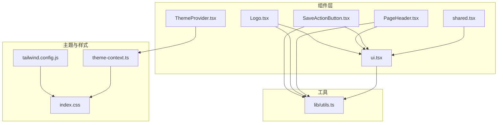
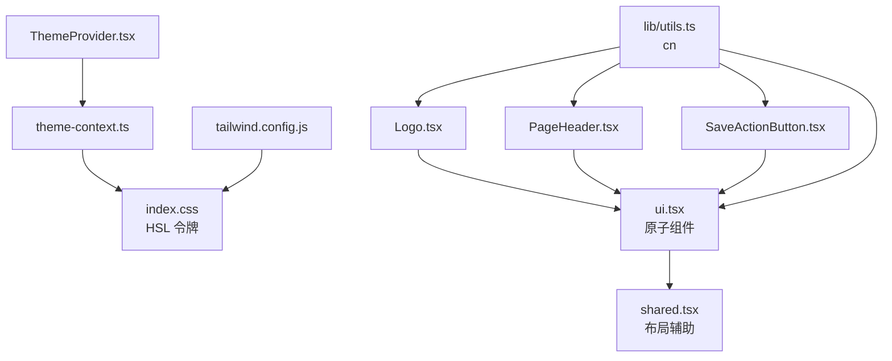
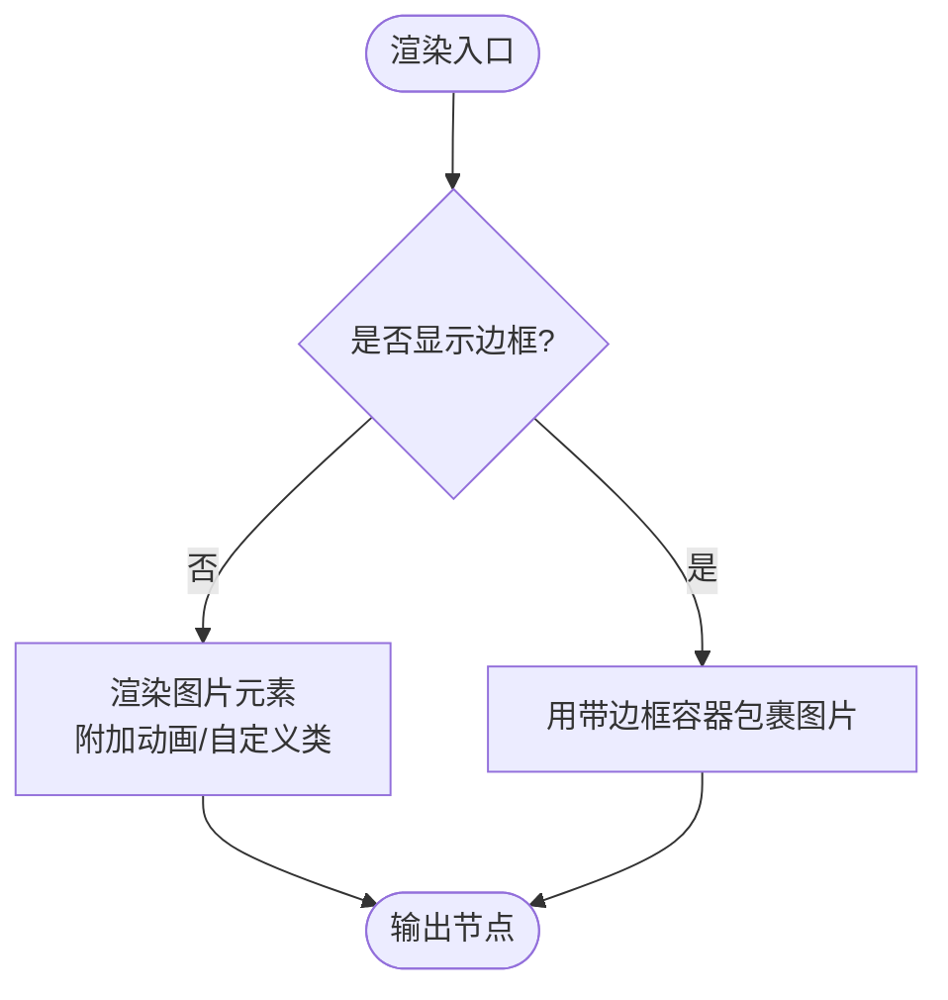
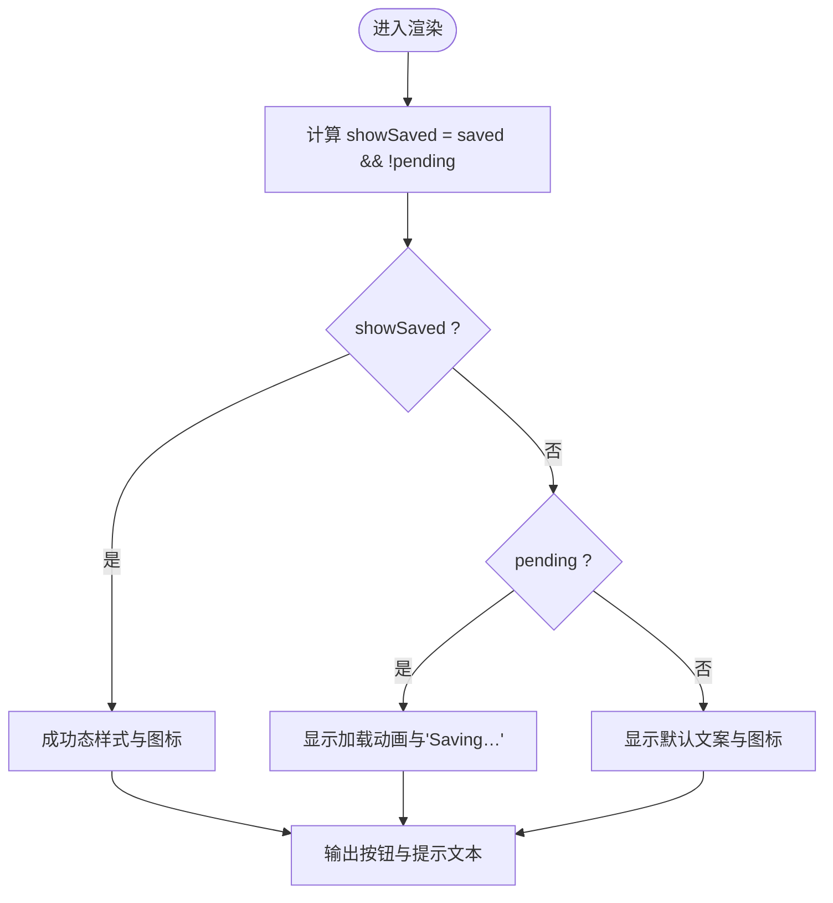
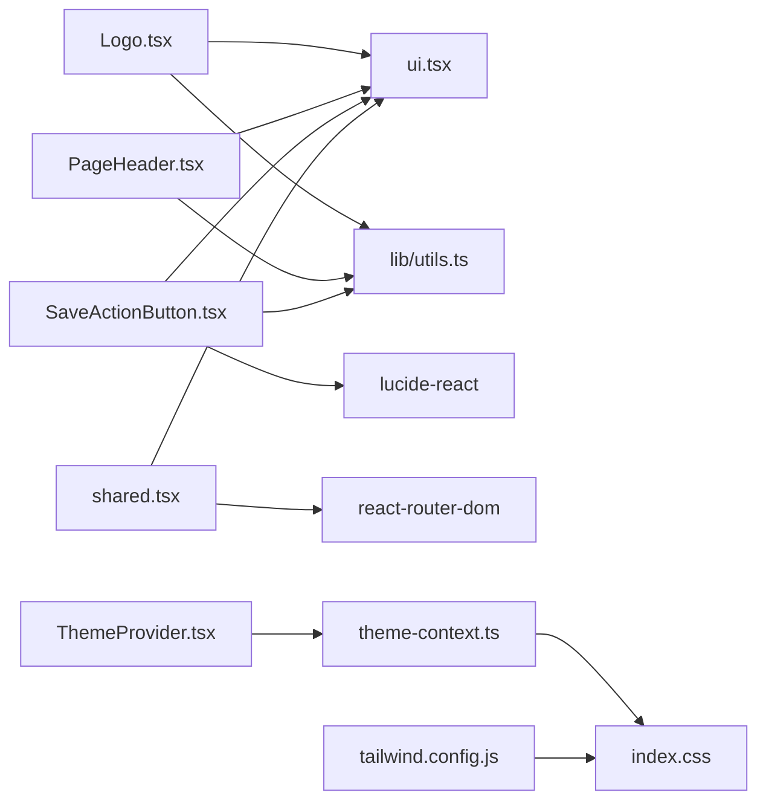
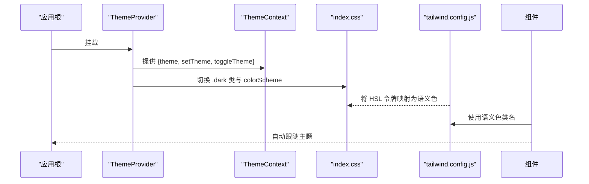

# UI 组件库

<cite>
**本文引用的文件**
- [web/src/components/Logo.tsx](file://web/src/components/Logo.tsx)
- [web/src/components/PageHeader.tsx](file://web/src/components/PageHeader.tsx)
- [web/src/components/SaveActionButton.tsx](file://web/src/components/SaveActionButton.tsx)
- [web/src/components/ThemeProvider.tsx](file://web/src/components/ThemeProvider.tsx)
- [web/src/components/theme-context.ts](file://web/src/components/theme-context.ts)
- [web/src/components/ui.tsx](file://web/src/components/ui.tsx)
- [web/src/components/shared.tsx](file://web/src/components/shared.tsx)
- [web/tailwind.config.js](file://web/tailwind.config.js)
- [web/src/index.css](file://web/src/index.css)
- [web/src/lib/utils.ts](file://web/src/lib/utils.ts)
</cite>

## 目录
1. [简介](#简介)
2. [项目结构](#项目结构)
3. [核心组件](#核心组件)
4. [架构总览](#架构总览)
5. [详细组件分析](#详细组件分析)
6. [依赖关系分析](#依赖关系分析)
7. [性能与可访问性](#性能与可访问性)
8. [主题系统与样式定制](#主题系统与样式定制)
9. [响应式适配指南](#响应式适配指南)
10. [组合模式与状态管理最佳实践](#组合模式与状态管理最佳实践)
11. [故障排查](#故障排查)
12. [结论](#结论)

## 简介
本文件面向 CyberPenda Web 前端的 UI 组件库，聚焦于自定义组件的设计原则、属性接口与使用方法；深入解释主题系统、样式定制与响应式适配；并覆盖 Logo、PageHeader、SaveActionButton 等核心组件的实现细节。同时提供组件组合模式、状态管理与事件处理的最佳实践，以及 Tailwind CSS 集成与设计令牌的使用方式。

## 项目结构
UI 组件库位于 web/src/components 目录，采用“按功能拆分 + 基础原子组件集中”的组织方式：
- 基础原子组件：Button、Card、Badge、Input、Textarea、Select、Label 等集中在 ui.tsx
- 页面级布局与通用辅助：shared.tsx（如 PageContainer、BackLink、EmptyState、Settings* 系列）
- 业务型组件：Logo.tsx、PageHeader.tsx、SaveActionButton.tsx
- 主题系统：ThemeProvider.tsx 与 theme-context.ts 分离，便于 HMR 稳定边界
- 工具函数：lib/utils.ts 中的 cn 用于合并 Tailwind 类名
- 设计令牌与全局样式：tailwind.config.js 与 index.css



图表来源
- [web/src/components/Logo.tsx:1-37](file://web/src/components/Logo.tsx#L1-L37)
- [web/src/components/PageHeader.tsx:1-71](file://web/src/components/PageHeader.tsx#L1-L71)
- [web/src/components/SaveActionButton.tsx:1-61](file://web/src/components/SaveActionButton.tsx#L1-L61)
- [web/src/components/ui.tsx:1-233](file://web/src/components/ui.tsx#L1-L233)
- [web/src/components/shared.tsx:1-145](file://web/src/components/shared.tsx#L1-L145)
- [web/src/components/ThemeProvider.tsx:1-87](file://web/src/components/ThemeProvider.tsx#L1-L87)
- [web/src/components/theme-context.ts:1-44](file://web/src/components/theme-context.ts#L1-L44)
- [web/tailwind.config.js:1-92](file://web/tailwind.config.js#L1-L92)
- [web/src/index.css:1-248](file://web/src/index.css#L1-L248)
- [web/src/lib/utils.ts:1-8](file://web/src/lib/utils.ts#L1-L8)

章节来源
- [web/src/components/Logo.tsx:1-37](file://web/src/components/Logo.tsx#L1-L37)
- [web/src/components/PageHeader.tsx:1-71](file://web/src/components/PageHeader.tsx#L1-L71)
- [web/src/components/SaveActionButton.tsx:1-61](file://web/src/components/SaveActionButton.tsx#L1-L61)
- [web/src/components/ui.tsx:1-233](file://web/src/components/ui.tsx#L1-L233)
- [web/src/components/shared.tsx:1-145](file://web/src/components/shared.tsx#L1-L145)
- [web/src/components/ThemeProvider.tsx:1-87](file://web/src/components/ThemeProvider.tsx#L1-L87)
- [web/src/components/theme-context.ts:1-44](file://web/src/components/theme-context.ts#L1-L44)
- [web/tailwind.config.js:1-92](file://web/tailwind.config.js#L1-L92)
- [web/src/index.css:1-248](file://web/src/index.css#L1-L248)
- [web/src/lib/utils.ts:1-8](file://web/src/lib/utils.ts#L1-L8)

## 核心组件
本节概述各组件的职责、属性接口与使用要点。

- Logo
  - 职责：展示品牌标识，支持边框包裹与旋转入场动画
  - 关键属性：className、bordered、spin
  - 行为：根据 spin 控制动画类；bordered 时以带边框容器包裹
  - 依赖：cn 工具、公共静态资源路径

- PageHeader
  - 职责：统一的粘性顶部栏，包含标题与右侧操作区
  - 关键属性：variant（default/solid/flat）、size（compact/default/spacious）、children
  - 子组件：PageHeaderTitle（尺寸变体）、PageHeaderActions（右对齐操作槽）
  - 依赖：class-variance-authority、cn

- SaveActionButton
  - 职责：封装保存按钮的三种状态（空闲/保存中/已保存），提供无障碍提示与过渡动画
  - 关键属性：label、pending、saved、disabled、onClick、size、className
  - 行为：根据 pending/saved 切换图标与文案；禁用态由父状态驱动
  - 依赖：Button、lucide-react 图标、cn

- 基础原子组件（ui.tsx）
  - Button/Card/Badge/Input/Textarea/Select/Label 等，均通过 class-variance-authority 定义变体，统一风格与交互反馈
  - 全部支持 className 透传与 forwardRef

- 通用布局与辅助（shared.tsx）
  - PageContainer、BackLink、EmptyState、SettingsPageHeader、SettingsPageShell、SettingsSplitLayout、SettingsListPanel、SettingsPanel、SettingsAlert
  - 基于 Card 与 Tailwind 网格/弹性布局，提供设置页常用骨架

章节来源
- [web/src/components/Logo.tsx:1-37](file://web/src/components/Logo.tsx#L1-L37)
- [web/src/components/PageHeader.tsx:1-71](file://web/src/components/PageHeader.tsx#L1-L71)
- [web/src/components/SaveActionButton.tsx:1-61](file://web/src/components/SaveActionButton.tsx#L1-L61)
- [web/src/components/ui.tsx:1-233](file://web/src/components/ui.tsx#L1-L233)
- [web/src/components/shared.tsx:1-145](file://web/src/components/shared.tsx#L1-L145)

## 架构总览
组件库遵循以下分层与协作关系：
- 主题层：ThemeContext 暴露当前主题与切换方法；ThemeProvider 负责持久化与 OS 偏好监听；index.css 定义 HSL 设计令牌；tailwind.config.js 将令牌映射到 Tailwind 语义色
- 基础层：ui.tsx 提供原子组件，统一变体与焦点样式
- 布局层：shared.tsx 提供页面级布局与常见区域组件
- 业务层：Logo、PageHeader、SaveActionButton 组合基础与布局能力，形成可直接使用的业务组件



图表来源
- [web/src/components/ThemeProvider.tsx:1-87](file://web/src/components/ThemeProvider.tsx#L1-L87)
- [web/src/components/theme-context.ts:1-44](file://web/src/components/theme-context.ts#L1-L44)
- [web/src/index.css:1-248](file://web/src/index.css#L1-L248)
- [web/tailwind.config.js:1-92](file://web/tailwind.config.js#L1-L92)
- [web/src/components/ui.tsx:1-233](file://web/src/components/ui.tsx#L1-L233)
- [web/src/components/shared.tsx:1-145](file://web/src/components/shared.tsx#L1-L145)
- [web/src/components/Logo.tsx:1-37](file://web/src/components/Logo.tsx#L1-L37)
- [web/src/components/PageHeader.tsx:1-71](file://web/src/components/PageHeader.tsx#L1-L71)
- [web/src/components/SaveActionButton.tsx:1-61](file://web/src/components/SaveActionButton.tsx#L1-L61)
- [web/src/lib/utils.ts:1-8](file://web/src/lib/utils.ts#L1-L8)

## 详细组件分析

### Logo 组件
- 设计要点
  - 通过 className 透传实现灵活定制
  - bordered 时以圆角边框容器包裹，保持视觉一致性
  - spin 时附加入场动画类，尊重 prefers-reduced-motion
- 属性接口
  - className?: string
  - bordered?: boolean
  - spin?: boolean
- 使用建议
  - 在应用壳或导航处作为品牌标识
  - 需要强调加载完成时可启用 spin，完成后移除



图表来源
- [web/src/components/Logo.tsx:1-37](file://web/src/components/Logo.tsx#L1-L37)
- [web/src/index.css:187-206](file://web/src/index.css#L187-L206)

章节来源
- [web/src/components/Logo.tsx:1-37](file://web/src/components/Logo.tsx#L1-L37)
- [web/src/index.css:187-206](file://web/src/index.css#L187-L206)

### PageHeader 组件
- 设计要点
  - 使用 class-variance-authority 定义 variant 与 size 变体
  - sticky top 固定定位，配合 backdrop-blur 营造层级感
  - 提供 PageHeaderTitle 与 PageHeaderActions 插槽，便于左右内容组织
- 属性接口
  - PageHeaderProps：继承 HTMLAttributes<HTMLDivElement>，含 variant、size
  - PageHeaderTitleProps：含 size 变体
  - PageHeaderActions：仅 children 与 className
- 使用建议
  - 在页面顶部统一放置标题与操作区
  - 根据页面密度选择 compact/default/spacious 尺寸

```mermaid
sequenceDiagram
participant App as "页面"
participant Header as "PageHeader"
participant Title as "PageHeaderTitle"
participant Actions as "PageHeaderActions"
App->>Header : 传入 variant/size/children
Header->>Title : 渲染标题(可选)
Header->>Actions : 渲染操作区(可选)
Header-->>App : 返回粘性头部 DOM
```

图表来源
- [web/src/components/PageHeader.tsx:1-71](file://web/src/components/PageHeader.tsx#L1-L71)

章节来源
- [web/src/components/PageHeader.tsx:1-71](file://web/src/components/PageHeader.tsx#L1-L71)

### SaveActionButton 组件
- 设计要点
  - 三态：idle/pending/saved，通过 props 驱动
  - 使用 aria-live 提升可访问性，配合轻量动画增强反馈
  - 复用 Button 的变体与尺寸体系
- 属性接口
  - label?: string
  - pending?: boolean
  - saved?: boolean
  - disabled?: boolean
  - onClick?: () => void
  - size?: ButtonProps["size"]
  - className?: string
- 使用建议
  - 父组件维护表单提交状态，将 pending/saved 与后端请求生命周期绑定
  - 避免在 saved 状态下再次触发点击，防止重复提交



图表来源
- [web/src/components/SaveActionButton.tsx:1-61](file://web/src/components/SaveActionButton.tsx#L1-L61)
- [web/src/components/ui.tsx:66-102](file://web/src/components/ui.tsx#L66-L102)
- [web/src/index.css:208-246](file://web/src/index.css#L208-L246)

章节来源
- [web/src/components/SaveActionButton.tsx:1-61](file://web/src/components/SaveActionButton.tsx#L1-L61)
- [web/src/components/ui.tsx:66-102](file://web/src/components/ui.tsx#L66-L102)
- [web/src/index.css:208-246](file://web/src/index.css#L208-L246)

### 基础原子组件（ui.tsx）
- 设计要点
  - 所有组件通过 cva 定义变体，保证风格一致性与可扩展性
  - 统一 focus-visible 环样式与禁用态
  - 支持 as 多态（Card）与 forwardRef
- 主要组件
  - Button：variant（default/secondary/destructive/warning/outline/ghost/link）、size（xs/sm/default/lg/icon/icon-sm/icon-lg）
  - Card：variant（default/flat/elevated）、size（compact/default/spacious），并提供 CardHeader/CardTitle/CardDescription/CardContent/CardFooter
  - Badge：语义化标签，多种语义变体
  - Input/Textarea/Select：统一输入控件基类与无效态
  - Label：大小与颜色变体

章节来源
- [web/src/components/ui.tsx:1-233](file://web/src/components/ui.tsx#L1-L233)

### 通用布局与辅助（shared.tsx）
- 设计要点
  - 基于 Card 与 Tailwind 网格/弹性布局，快速搭建设置页等复杂界面
  - SettingsSplitLayout 支持 list-detail 与 management 两种列宽策略
- 主要组件
  - PageContainer、BackLink、EmptyState
  - SettingsPageHeader、SettingsPageShell、SettingsSplitLayout、SettingsListPanel、SettingsPanel、SettingsAlert

章节来源
- [web/src/components/shared.tsx:1-145](file://web/src/components/shared.tsx#L1-L145)

## 依赖关系分析
- 组件耦合
  - Logo、PageHeader、SaveActionButton 均依赖 ui.tsx 的基础组件与 lib/utils.ts 的 cn
  - SaveActionButton 还依赖 lucide-react 图标
  - ThemeProvider 与 theme-context.ts 解耦，前者只导出组件，后者提供上下文与钩子
- 外部依赖
  - class-variance-authority：变体系统
  - clsx + tailwind-merge：类名合并
  - lucide-react：图标
  - react-router-dom：路由链接（shared.tsx）



图表来源
- [web/src/components/Logo.tsx:1-37](file://web/src/components/Logo.tsx#L1-L37)
- [web/src/components/PageHeader.tsx:1-71](file://web/src/components/PageHeader.tsx#L1-L71)
- [web/src/components/SaveActionButton.tsx:1-61](file://web/src/components/SaveActionButton.tsx#L1-L61)
- [web/src/components/ui.tsx:1-233](file://web/src/components/ui.tsx#L1-L233)
- [web/src/components/shared.tsx:1-145](file://web/src/components/shared.tsx#L1-L145)
- [web/src/components/ThemeProvider.tsx:1-87](file://web/src/components/ThemeProvider.tsx#L1-L87)
- [web/src/components/theme-context.ts:1-44](file://web/src/components/theme-context.ts#L1-L44)
- [web/tailwind.config.js:1-92](file://web/tailwind.config.js#L1-L92)
- [web/src/index.css:1-248](file://web/src/index.css#L1-L248)

章节来源
- [web/src/components/Logo.tsx:1-37](file://web/src/components/Logo.tsx#L1-L37)
- [web/src/components/PageHeader.tsx:1-71](file://web/src/components/PageHeader.tsx#L1-L71)
- [web/src/components/SaveActionButton.tsx:1-61](file://web/src/components/SaveActionButton.tsx#L1-L61)
- [web/src/components/ui.tsx:1-233](file://web/src/components/ui.tsx#L1-L233)
- [web/src/components/shared.tsx:1-145](file://web/src/components/shared.tsx#L1-L145)
- [web/src/components/ThemeProvider.tsx:1-87](file://web/src/components/ThemeProvider.tsx#L1-L87)
- [web/src/components/theme-context.ts:1-44](file://web/src/components/theme-context.ts#L1-L44)
- [web/tailwind.config.js:1-92](file://web/tailwind.config.js#L1-L92)
- [web/src/index.css:1-248](file://web/src/index.css#L1-L248)

## 性能与可访问性
- 性能
  - 使用 class-variance-authority 减少条件分支带来的样式抖动
  - 按需引入图标，避免打包体积膨胀
  - 合理使用 memo/useMemo/useCallback（例如 ThemeProvider 中对 value 的缓存）
- 可访问性
  - SaveActionButton 使用 aria-live 播报保存状态变化
  - 统一 focus-visible 环样式，确保键盘可达
  - 尊重 prefers-reduced-motion，关闭不必要的动画

章节来源
- [web/src/components/SaveActionButton.tsx:1-61](file://web/src/components/SaveActionButton.tsx#L1-L61)
- [web/src/index.css:149-156](file://web/src/index.css#L149-L156)
- [web/src/index.css:202-206](file://web/src/index.css#L202-L206)
- [web/src/index.css:241-246](file://web/src/index.css#L241-L246)

## 主题系统与样式定制
- 设计令牌
  - 在 index.css 中以 HSL 变量形式定义 light/dark 两套令牌，涵盖背景、前景、卡片、主色、辅色、成功/信息/警告、边框、阴影、字体等
  - tailwind.config.js 将这些令牌映射为语义化颜色（primary、secondary、destructive、success、info、warning、sidebar 等），并扩展 borderRadius、fontFamily、boxShadow、transitionTimingFunction
- 运行时切换
  - ThemeProvider 读取 localStorage 与系统偏好，初始化主题；监听系统偏好变化（仅在未显式选择时生效）
  - applyTheme 在 html 根节点切换 .dark 类并设置 colorScheme，确保原生控件与滚动条主题正确
- 使用方式
  - 在应用顶层包裹 ThemeProvider
  - 使用 useTheme 获取当前主题与切换方法
  - 在组件中使用 Tailwind 语义色（如 bg-primary、text-muted-foreground）自动跟随主题



图表来源
- [web/src/components/ThemeProvider.tsx:1-87](file://web/src/components/ThemeProvider.tsx#L1-L87)
- [web/src/components/theme-context.ts:1-44](file://web/src/components/theme-context.ts#L1-L44)
- [web/src/index.css:1-122](file://web/src/index.css#L1-L122)
- [web/tailwind.config.js:1-92](file://web/tailwind.config.js#L1-L92)

章节来源
- [web/src/components/ThemeProvider.tsx:1-87](file://web/src/components/ThemeProvider.tsx#L1-L87)
- [web/src/components/theme-context.ts:1-44](file://web/src/components/theme-context.ts#L1-L44)
- [web/src/index.css:1-122](file://web/src/index.css#L1-L122)
- [web/tailwind.config.js:1-92](file://web/tailwind.config.js#L1-L92)

## 响应式适配指南
- 断点与容器
  - tailwind.config.js 配置 container 居中与 padding，并在 2xl 断点下限制最大宽度
  - shared.tsx 使用 lg 断点实现双栏/三栏布局与独立滚动
- 字体与阴影
  - 通过 Tailwind 扩展 fontFamily 与 boxShadow，结合 CSS 变量实现主题感知
- 建议
  - 优先使用 Tailwind 内置断点（sm/md/lg/xl/2xl）进行布局调整
  - 对复杂布局使用 grid 与 minmax 控制列宽，避免溢出

章节来源
- [web/tailwind.config.js:6-10](file://web/tailwind.config.js#L6-L10)
- [web/tailwind.config.js:67-87](file://web/tailwind.config.js#L67-L87)
- [web/src/components/shared.tsx:90-113](file://web/src/components/shared.tsx#L90-L113)

## 组合模式与状态管理最佳实践
- 组合模式
  - PageHeader 通过 children 与 PageHeaderActions 插槽组合标题与操作区
  - shared.tsx 的 Settings* 组件通过 Card 组合出列表/详情面板
- 状态管理
  - 将表单或操作的本地状态（pending/saved/disabled）提升到调用方，组件仅做呈现与回调转发
  - 使用 useCallback/useMemo 优化频繁变化的值（如 ThemeProvider 的 value）
- 事件处理
  - 对外暴露 onClick 等回调，内部不直接发起副作用，避免组件承担过多职责
  - 对于异步操作，建议在父组件中管理 loading 与 success 状态，再传递给 SaveActionButton

章节来源
- [web/src/components/PageHeader.tsx:1-71](file://web/src/components/PageHeader.tsx#L1-L71)
- [web/src/components/SaveActionButton.tsx:1-61](file://web/src/components/SaveActionButton.tsx#L1-L61)
- [web/src/components/shared.tsx:1-145](file://web/src/components/shared.tsx#L1-L145)
- [web/src/components/ThemeProvider.tsx:48-66](file://web/src/components/ThemeProvider.tsx#L48-L66)

## 故障排查
- 主题未生效
  - 检查是否在应用根节点包裹了 ThemeProvider
  - 确认 index.css 被正确引入，且 html 根节点存在 .dark 类切换逻辑
- 样式冲突
  - 使用 cn 合并类名，避免 Tailwind 类覆盖顺序问题
  - 检查 tailwind.config.js 的 content 路径是否包含组件所在目录
- 动画异常
  - 若用户启用了减少动态效果，相关动画会被禁用；如需调试，可在浏览器开发者工具中查看 prefers-reduced-motion 媒体查询
- 可访问性问题
  - 确保按钮具备合适的 aria-label 或 title，必要时使用 aria-live 播报状态变化

章节来源
- [web/src/components/ThemeProvider.tsx:26-46](file://web/src/components/ThemeProvider.tsx#L26-L46)
- [web/src/components/theme-context.ts:33-37](file://web/src/components/theme-context.ts#L33-L37)
- [web/src/lib/utils.ts:4-7](file://web/src/lib/utils.ts#L4-L7)
- [web/src/index.css:202-206](file://web/src/index.css#L202-L206)
- [web/src/index.css:241-246](file://web/src/index.css#L241-L246)

## 结论
本 UI 组件库以原子组件为基础，通过 class-variance-authority 与 Tailwind 设计令牌构建一致的视觉语言；以 ThemeProvider 与 CSS 变量实现主题切换；通过组合模式与清晰的状态边界，使业务组件易于复用与维护。建议在新页面或功能中优先复用现有组件与布局辅助，以保持整体体验的一致性。