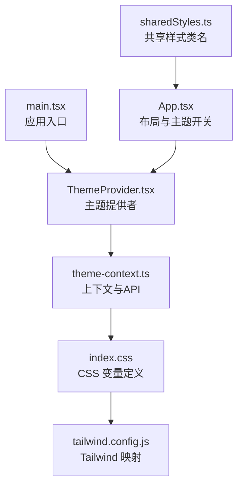
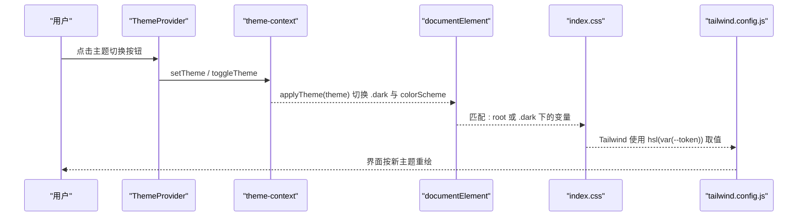
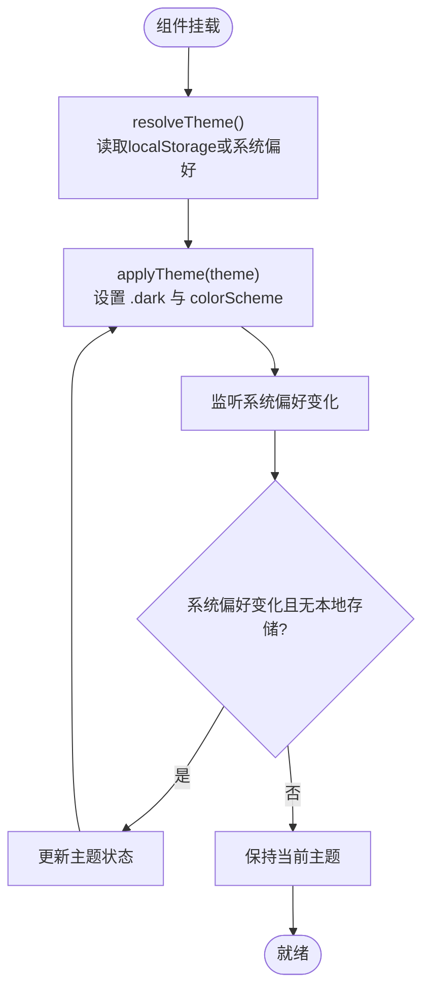
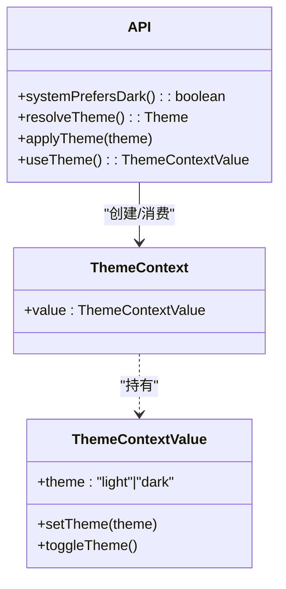
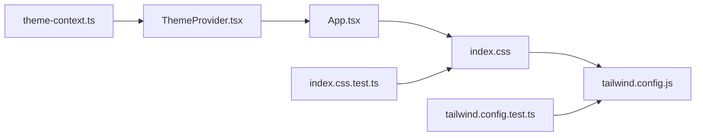

# 主题系统

<cite>
**本文引用的文件**   
- [web/src/components/ThemeProvider.tsx](file://web/src/components/ThemeProvider.tsx)
- [web/src/components/theme-context.ts](file://web/src/components/theme-context.ts)
- [web/src/components/sharedStyles.ts](file://web/src/components/sharedStyles.ts)
- [web/src/index.css](file://web/src/index.css)
- [web/tailwind.config.js](file://web/tailwind.config.js)
- [web/src/main.tsx](file://web/src/main.tsx)
- [web/src/App.tsx](file://web/src/App.tsx)
- [web/src/index.css.test.ts](file://web/src/index.css.test.ts)
- [web/tailwind.config.test.ts](file://web/tailwind.config.test.ts)
</cite>

## 目录
1. [简介](#简介)
2. [项目结构](#项目结构)
3. [核心组件](#核心组件)
4. [架构总览](#架构总览)
5. [详细组件分析](#详细组件分析)
6. [依赖关系分析](#依赖关系分析)
7. [性能与可访问性](#性能与可访问性)
8. [故障排查指南](#故障排查指南)
9. [结论](#结论)
10. [附录：配置与扩展指南](#附录配置与扩展指南)

## 简介
本文件系统化梳理前端主题系统的实现，覆盖 ThemeProvider 主题提供者、theme-context 主题上下文与 sharedStyles 共享样式的协作机制；深入解释主题切换逻辑、CSS 变量管理、暗色模式支持；并提供主题配置选项、自定义主题开发指南、样式覆盖方法、持久化存储与用户偏好设置说明，以及调试工具与性能优化建议。

## 项目结构
主题系统由 React 组件层（提供状态与交互）、上下文层（暴露 API）、CSS 变量层（设计令牌）与 Tailwind 集成层构成。入口在应用启动时包裹全局 Provider，页面通过 useTheme 消费主题并配合 CSS 变量完成渲染。

图表来源
- [web/src/main.tsx:11-17](file://web/src/main.tsx#L11-L17)
- [web/src/components/ThemeProvider.tsx:26-67](file://web/src/components/ThemeProvider.tsx#L26-L67)
- [web/src/components/theme-context.ts:19-43](file://web/src/components/theme-context.ts#L19-L43)
- [web/src/index.css:12-122](file://web/src/index.css#L12-L122)
- [web/tailwind.config.js:1-46](file://web/tailwind.config.js#L1-46)
- [web/src/App.tsx:32-33](file://web/src/App.tsx#L32-L33)
- [web/src/components/sharedStyles.ts:1-12](file://web/src/components/sharedStyles.ts#L1-L12)

章节来源
- [web/src/main.tsx:11-17](file://web/src/main.tsx#L11-L17)
- [web/src/App.tsx:32-33](file://web/src/App.tsx#L32-L33)

## 核心组件
- ThemeProvider：负责初始主题解析、监听系统偏好变化、持久化到 localStorage、将 .dark 类与 colorScheme 应用到根节点，并通过 Context 暴露 theme/setTheme/toggleTheme。
- theme-context：导出类型、常量、Context、useTheme Hook，以及 resolveTheme/systemPrefersDark/applyTheme 等纯函数。
- sharedStyles：提供基于 cn 的样式组合工具，用于统一 UI 列表项等通用样式，间接受主题变量影响。

章节来源
- [web/src/components/ThemeProvider.tsx:26-67](file://web/src/components/ThemeProvider.tsx#L26-L67)
- [web/src/components/theme-context.ts:9-43](file://web/src/components/theme-context.ts#L9-L43)
- [web/src/components/sharedStyles.ts:1-12](file://web/src/components/sharedStyles.ts#L1-L12)

## 架构总览
主题系统采用“上下文 + CSS 变量 + Tailwind”的经典方案：
- 运行时：React Context 维护当前主题值与变更能力。
- 渲染期：根据主题值在 <html> 上切换 .dark 类，并设置 color-scheme，驱动 CSS 变量生效。
- 构建期：Tailwind 将语义化颜色名映射到 HSL 变量，从而自动适配明/暗两套调色板。

图表来源
- [web/src/components/ThemeProvider.tsx:48-67](file://web/src/components/ThemeProvider.tsx#L48-L67)
- [web/src/components/theme-context.ts:33-37](file://web/src/components/theme-context.ts#L33-L37)
- [web/src/index.css:12-122](file://web/src/index.css#L12-L122)
- [web/tailwind.config.js:1-46](file://web/tailwind.config.js#L1-46)

## 详细组件分析

### ThemeProvider 主题提供者
职责
- 初始化主题：优先读取本地存储，否则跟随系统偏好。
- 响应系统偏好变化：仅在未显式选择主题时跟随系统。
- 持久化：写入 localStorage。
- 应用主题：调用 applyTheme 切换 .dark 与 colorScheme。
- 暴露 API：通过 Context 提供 theme/setTheme/toggleTheme。

关键流程
- 首次挂载：resolveTheme() 决定初始值。
- 主题变更：useEffect 调用 applyTheme(theme)。
- 系统偏好监听：matchMedia("prefers-color-scheme: dark") 变化时，若无本地存储则更新主题。
- 切换操作：setTheme/toggleTheme 同时更新状态与持久化。

图表来源
- [web/src/components/ThemeProvider.tsx:26-46](file://web/src/components/ThemeProvider.tsx#L26-L46)
- [web/src/components/theme-context.ts:26-37](file://web/src/components/theme-context.ts#L26-L37)

章节来源
- [web/src/components/ThemeProvider.tsx:26-67](file://web/src/components/ThemeProvider.tsx#L26-L67)
- [web/src/components/theme-context.ts:26-37](file://web/src/components/theme-context.ts#L26-L37)

### theme-context 主题上下文
职责
- 定义类型与常量：Theme、THEME_STORAGE_KEY、ThemeContextValue。
- 提供 Context 与 useTheme Hook。
- 提供纯函数：systemPrefersDark、resolveTheme、applyTheme。

要点
- systemPrefersDark：安全检测 window.matchMedia 后返回系统偏好。
- resolveTheme：SSR 友好（window 不存在时回退 light），优先读 localStorage，其次系统偏好。
- applyTheme：仅操作 document.documentElement 的 classList 与 style.colorScheme。

图表来源
- [web/src/components/theme-context.ts:9-43](file://web/src/components/theme-context.ts#L9-L43)

章节来源
- [web/src/components/theme-context.ts:9-43](file://web/src/components/theme-context.ts#L9-L43)

### sharedStyles 共享样式
职责
- 提供 settingsListItemClasses(selected, className?) 等复用样式生成器。
- 借助 cn 合并基础类与选中态类，间接使用主题变量（如 bg-accent/text-foreground）。

使用方式
- 在组件中导入并使用该函数，传入 selected 布尔值与可选附加类名，获得最终 className。

章节来源
- [web/src/components/sharedStyles.ts:1-12](file://web/src/components/sharedStyles.ts#L1-L12)

### 主题切换入口与布局集成
- App 的 ShellLayout 底部区域包含 ThemeToggle 按钮，点击触发 toggleTheme。
- main.tsx 在应用根节点包裹 ThemeProvider，确保全应用可用。

章节来源
- [web/src/App.tsx:240-244](file://web/src/App.tsx#L240-L244)
- [web/src/main.tsx:11-17](file://web/src/main.tsx#L11-L17)

## 依赖关系分析
- 组件依赖：ThemeProvider 依赖 theme-context 提供的纯函数与 Context；App 依赖 ThemeProvider 与 ThemeToggle。
- 样式依赖：index.css 定义 CSS 变量；tailwind.config.js 将语义化颜色映射到这些变量；组件通过 Tailwind 类名消费。
- 测试依赖：index.css.test.ts 断言关键 token 存在；tailwind.config.test.ts 断言 darkMode 策略与颜色映射。

图表来源
- [web/src/components/theme-context.ts:1-43](file://web/src/components/theme-context.ts#L1-L43)
- [web/src/components/ThemeProvider.tsx:1-67](file://web/src/components/ThemeProvider.tsx#L1-L67)
- [web/src/App.tsx:32-33](file://web/src/App.tsx#L32-L33)
- [web/src/index.css:12-122](file://web/src/index.css#L12-L122)
- [web/tailwind.config.js:1-46](file://web/tailwind.config.js#L1-46)
- [web/src/index.css.test.ts:1-55](file://web/src/index.css.test.ts#L1-L55)
- [web/tailwind.config.test.ts:1-32](file://web/tailwind.config.test.ts#L1-L32)

章节来源
- [web/src/index.css.test.ts:1-55](file://web/src/index.css.test.ts#L1-L55)
- [web/tailwind.config.test.ts:1-32](file://web/tailwind.config.test.ts#L1-L32)

## 性能与可访问性
- 避免闪烁：index.css 在 html 层直接设置背景色与 color-scheme，减少首屏主题闪烁。
- 最小化重排：applyTheme 仅修改根节点的 classList 与一个 style 属性，代价极低。
- 事件监听：系统偏好监听仅在必要时注册，并在卸载时移除，避免内存泄漏。
- 可访问性：ThemeToggle 提供 aria-label/title，符合无障碍要求。

章节来源
- [web/src/index.css:129-136](file://web/src/index.css#L129-L136)
- [web/src/components/ThemeProvider.tsx:36-46](file://web/src/components/ThemeProvider.tsx#L36-L46)
- [web/src/components/ThemeProvider.tsx:69-86](file://web/src/components/ThemeProvider.tsx#L69-L86)

## 故障排查指南
常见问题与定位
- 主题不生效
  - 检查是否在应用根节点包裹了 ThemeProvider。
  - 确认 index.css 已引入，且 tailwind.config.js 的 darkMode 为 class。
- 切换无效
  - 检查浏览器是否禁用 localStorage。
  - 查看控制台是否有 “useTheme must be used within a ThemeProvider” 错误。
- 暗色模式异常
  - 确认 .dark 类是否正确添加到 <html>。
  - 验证 CSS 变量在 .dark 下是否完整定义。
- 颜色不一致
  - 核对 Tailwind 颜色键是否指向 var(--xxx)，并确保对应 CSS 变量存在。

快速自检清单
- 运行样式与配置测试：
  - 断言 CSS 变量集合完整性。
  - 断言 Tailwind 使用 class-based dark mode 且颜色映射正确。
- 手动验证：
  - 打开开发者工具，观察 <html> 的 class 与 style.colorScheme。
  - 在 Console 中读取 localStorage 中的主题键值。

章节来源
- [web/src/index.css.test.ts:1-55](file://web/src/index.css.test.ts#L1-L55)
- [web/tailwind.config.test.ts:1-32](file://web/tailwind.config.test.ts#L1-L32)
- [web/src/components/theme-context.ts:39-43](file://web/src/components/theme-context.ts#L39-L43)

## 结论
本主题系统以轻量、可扩展为核心目标：通过 React Context 管理运行时主题，结合 CSS 变量与 Tailwind 的 class-based dark mode，实现零侵入的主题切换与暗色模式支持。配合本地持久化与系统偏好监听，兼顾用户体验与工程可维护性。

## 附录：配置与扩展指南

### 主题配置选项
- 默认行为
  - 若存在本地存储的主题值，优先使用。
  - 否则跟随系统 prefers-color-scheme。
- 持久化键名
  - 使用 THEME_STORAGE_KEY 作为 localStorage 键名。
- 切换 API
  - setTheme(theme)：设置指定主题。
  - toggleTheme()：在 light/dark 间切换。
  - useTheme()：在组件内获取当前主题与操作方法。

章节来源
- [web/src/components/theme-context.ts:11-17](file://web/src/components/theme-context.ts#L11-L17)
- [web/src/components/theme-context.ts:26-31](file://web/src/components/theme-context.ts#L26-L31)
- [web/src/components/ThemeProvider.tsx:48-67](file://web/src/components/ThemeProvider.tsx#L48-L67)

### 自定义主题开发指南
- 新增主题色
  - 在 index.css 的 :root 与 .dark 块中分别定义新的 CSS 变量（HSL 三元组）。
  - 在 tailwind.config.js 的 extend.colors 中增加映射，使 Tailwind 可使用新语义色。
- 调整现有主题
  - 修改 index.css 中对应变量的 HSL 值即可全局生效。
- 字体与圆角
  - 通过 --font-geist-sans/--font-geist-mono 与 --radius 控制。

章节来源
- [web/src/index.css:12-122](file://web/src/index.css#L12-L122)
- [web/tailwind.config.js:1-46](file://web/tailwind.config.js#L1-46)

### 样式覆盖方法
- 使用 Tailwind 语义色类名（如 bg-background/text-foreground）替代硬编码颜色。
- 在组件中通过 sharedStyles 提供的工具函数组合样式，保证一致性与可维护性。
- 需要局部覆盖时，在 cn 中追加自定义类名，注意层级与优先级。

章节来源
- [web/src/components/sharedStyles.ts:1-12](file://web/src/components/sharedStyles.ts#L1-L12)

### 主题持久化与用户偏好
- 本地存储
  - 主题值保存在 localStorage 的 THEME_STORAGE_KEY 键中。
- 系统偏好
  - 当没有本地存储时，遵循系统 prefers-color-scheme。
  - 一旦用户显式选择，后续不再被系统偏好覆盖。

章节来源
- [web/src/components/theme-context.ts:26-31](file://web/src/components/theme-context.ts#L26-L31)
- [web/src/components/ThemeProvider.tsx:36-46](file://web/src/components/ThemeProvider.tsx#L36-L46)

### 调试工具与技巧
- 浏览器 DevTools
  - 元素面板：查看 <html> 的 class 与 style.colorScheme。
  - 应用面板：查看 localStorage 中的主题键值。
- 单元测试
  - 运行 index.css.test.ts 与 tailwind.config.test.ts，确保变量与映射完整。
- 组件测试
  - 参考 ThemeProvider 测试用例，模拟 matchMedia 与 localStorage 行为，验证切换与类名应用。

章节来源
- [web/src/index.css.test.ts:1-55](file://web/src/index.css.test.ts#L1-L55)
- [web/tailwind.config.test.ts:1-32](file://web/tailwind.config.test.ts#L1-L32)