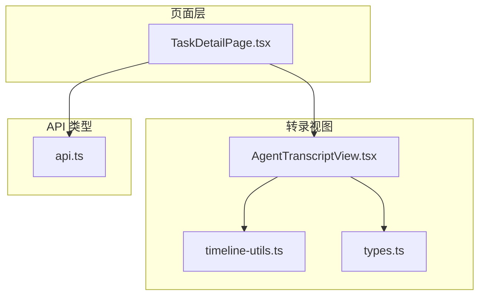
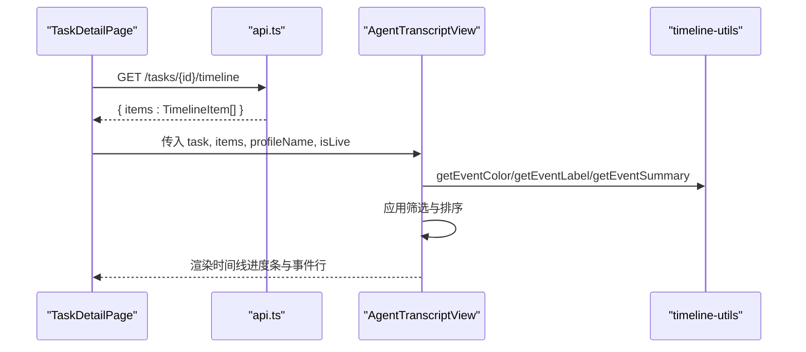
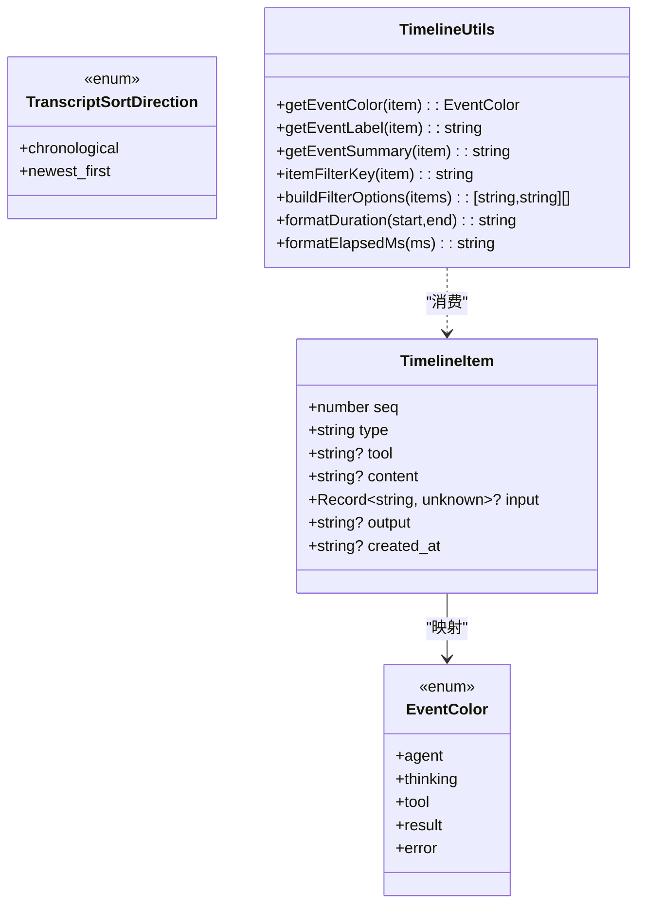
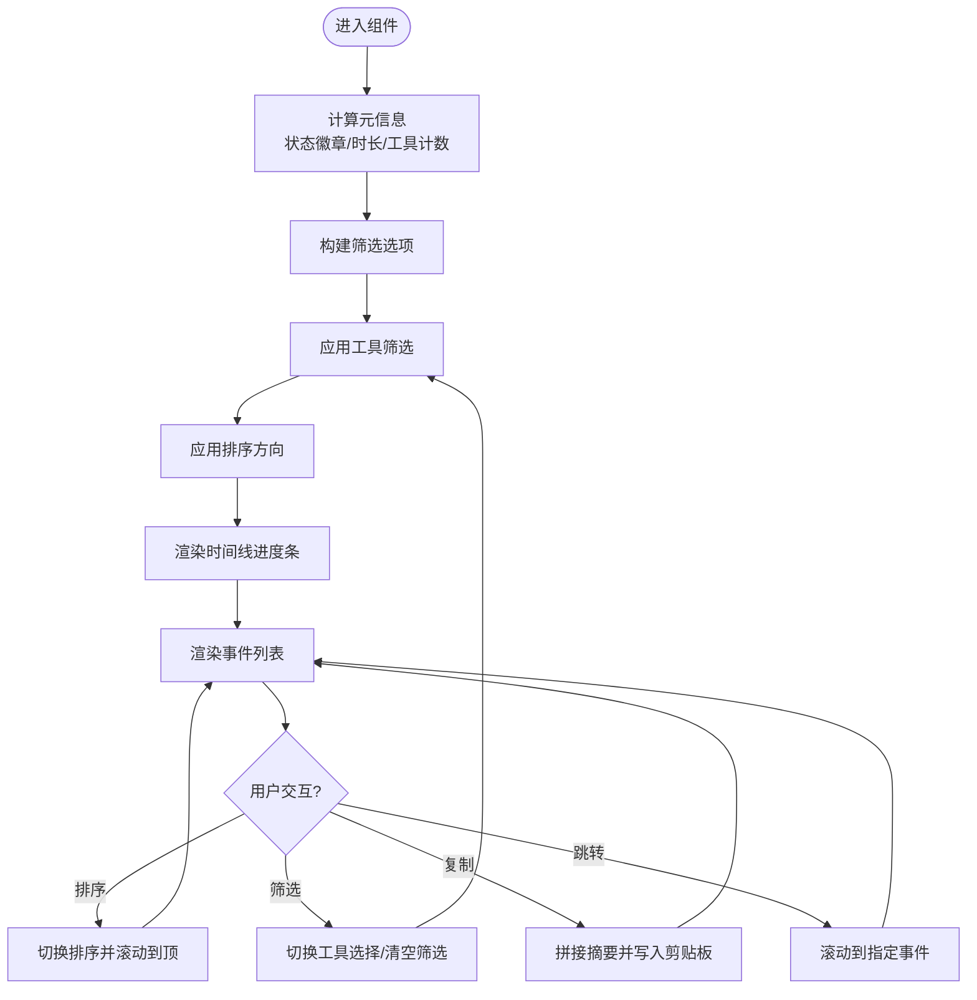
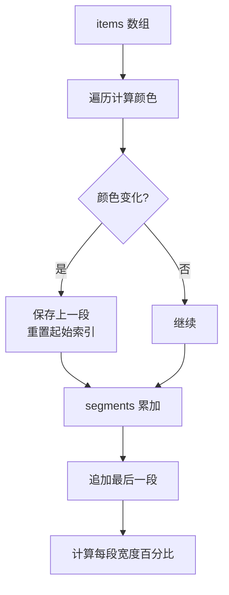
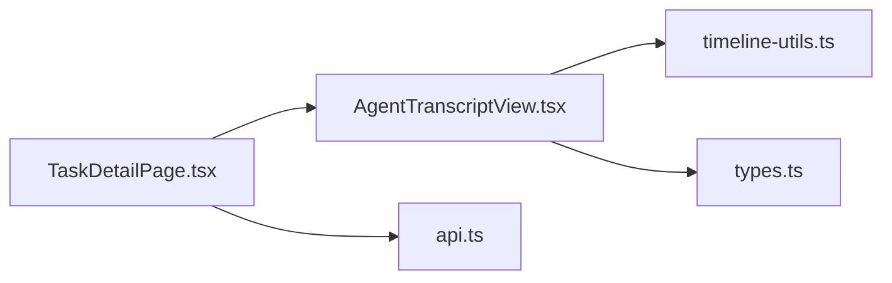

# 任务转录组件

<cite>
**本文引用的文件**
- [AgentTranscriptView.tsx](file://web/src/components/task-transcript/AgentTranscriptView.tsx)
- [timeline-utils.ts](file://web/src/components/task-transcript/timeline-utils.ts)
- [types.ts](file://web/src/components/task-transcript/types.ts)
- [AgentTranscriptView.test.tsx](file://web/src/components/task-transcript/AgentTranscriptView.test.tsx)
- [timeline-utils.test.ts](file://web/src/components/task-transcript/timeline-utils.test.ts)
- [TaskDetailPage.tsx](file://web/src/pages/TaskDetailPage.tsx)
- [api.ts](file://web/src/lib/api.ts)
</cite>

## 目录
1. [简介](#简介)
2. [项目结构](#项目结构)
3. [核心组件](#核心组件)
4. [架构总览](#架构总览)
5. [详细组件分析](#详细组件分析)
6. [依赖关系分析](#依赖关系分析)
7. [性能考虑](#性能考虑)
8. [故障排查指南](#故障排查指南)
9. [结论](#结论)
10. [附录](#附录)

## 简介
本文件围绕“任务转录组件”展开，聚焦以下目标：
- AgentTranscriptView 代理转录视图的实现与交互
- timeline-utils 时间线工具与相关数据类型的定义
- 转录数据的渲染逻辑、时间线可视化与交互操作
- 组件属性配置、数据格式要求与事件回调处理
- 时间线算法、消息排序与状态同步机制
- 转录数据的导入导出与自定义渲染扩展方法

该组件用于在任务详情页中以时间线形式展示 Agent 的运行轨迹（包括思考、文本、工具调用与结果、错误、生命周期与引导等），并提供筛选、排序、复制、跳转等交互能力。

## 项目结构
与任务转录相关的代码位于前端 React 应用中，主要包含三个文件：
- types.ts：定义时间线项类型、颜色角色与排序方向
- timeline-utils.ts：提供颜色映射、标签生成、摘要提取、过滤键构建、时长格式化等工具函数
- AgentTranscriptView.tsx：主视图组件，负责渲染时间线、工具栏、筛选器、排序切换、滚动定位与复制等

此外，TaskDetailPage.tsx 作为页面容器，负责从后端拉取 Task、Timeline 与 Transcript 数据，并将 Timeline 数据传入 AgentTranscriptView 进行渲染。api.ts 定义了 Task、TaskTimeline、TaskTranscript 等类型以及请求封装。

图表来源
- [TaskDetailPage.tsx:540-560](file://web/src/pages/TaskDetailPage.tsx#L540-L560)
- [AgentTranscriptView.tsx:1-40](file://web/src/components/task-transcript/AgentTranscriptView.tsx#L1-L40)
- [timeline-utils.ts:1-30](file://web/src/components/task-transcript/timeline-utils.ts#L1-L30)
- [types.ts:1-16](file://web/src/components/task-transcript/types.ts#L1-L16)
- [api.ts:347-363](file://web/src/lib/api.ts#L347-L363)

章节来源
- [AgentTranscriptView.tsx:1-533](file://web/src/components/task-transcript/AgentTranscriptView.tsx#L1-L533)
- [timeline-utils.ts:1-136](file://web/src/components/task-transcript/timeline-utils.ts#L1-L136)
- [types.ts:1-16](file://web/src/components/task-transcript/types.ts#L1-L16)
- [TaskDetailPage.tsx:540-560](file://web/src/pages/TaskDetailPage.tsx#L540-L560)
- [api.ts:347-363](file://web/src/lib/api.ts#L347-L363)

## 核心组件
- AgentTranscriptView
  - 职责：接收任务对象与时间线条目数组，渲染顶部元信息、时间线进度条、事件列表；支持按工具筛选、按时间顺序或倒序显示、点击片段跳转到对应事件、一键复制摘要、实时运行时的计时显示。
  - 关键状态：选中序列号、已选工具集合、排序方向、筛选面板开关、滚动容器引用、事件 DOM 引用映射。
  - 关键副作用：运行时计时更新、点击外部关闭筛选面板、自动滚动到选中事件。
- timeline-utils
  - 职责：将时间线项映射为颜色角色、生成可读标签与摘要、构建稳定的过滤键、计算持续时间与已用毫秒字符串。
- types
  - 职责：定义 TimelineItem 的字段与可选字段、事件类型枚举、排序方向与颜色角色。

章节来源
- [AgentTranscriptView.tsx:33-127](file://web/src/components/task-transcript/AgentTranscriptView.tsx#L33-L127)
- [timeline-utils.ts:3-136](file://web/src/components/task-transcript/timeline-utils.ts#L3-L136)
- [types.ts:1-16](file://web/src/components/task-transcript/types.ts#L1-L16)

## 架构总览
AgentTranscriptView 由上层页面 TaskDetailPage 驱动，后者通过 API 获取 Task、Timeline 与 Transcript 数据，并在“时间线”视图中将 Timeline 数据传递给 AgentTranscriptView。组件内部使用 timeline-utils 对数据进行着色、标签化与摘要化，并通过本地状态管理筛选与排序。

图表来源
- [TaskDetailPage.tsx:540-560](file://web/src/pages/TaskDetailPage.tsx#L540-L560)
- [AgentTranscriptView.tsx:53-61](file://web/src/components/task-transcript/AgentTranscriptView.tsx#L53-L61)
- [timeline-utils.ts:3-90](file://web/src/components/task-transcript/timeline-utils.ts#L3-L90)

## 详细组件分析

### 数据类型与工具函数
- TimelineItem
  - seq：序号，唯一标识事件
  - type：事件类型，包括 tool_use、tool_result、thinking、text、error、lifecycle、steering
  - tool：工具名称（当类型为 tool_use/tool_result 时常用）
  - content：文本内容（thinking/text/error/lifecycle/steering）
  - input：工具输入参数（tool_use）
  - output：工具输出（tool_result）
  - created_at：创建时间（可选）
- EventColor
  - agent/thinking/tool/result/error 五种颜色角色
- 工具函数
  - getEventColor：根据 item.type 映射到颜色角色
  - getEventLabel：生成人类可读标签（如工具名、Thinking、Error 等）
  - getEventSummary：生成一行摘要，优先从输入关键字段（query/file_path/command/prompt 等）或输出前若干字符中提取
  - itemFilterKey：生成稳定过滤键（tool_use/tool_result 以 tool 命名空间区分，其他以 type 区分）
  - buildFilterOptions：基于 items 去重构建筛选选项列表
  - formatDuration/formatElapsedMs：格式化持续时间与已用毫秒

图表来源
- [types.ts:1-16](file://web/src/components/task-transcript/types.ts#L1-L16)
- [timeline-utils.ts:3-136](file://web/src/components/task-transcript/timeline-utils.ts#L3-L136)

章节来源
- [types.ts:1-16](file://web/src/components/task-transcript/types.ts#L1-L16)
- [timeline-utils.ts:3-136](file://web/src/components/task-transcript/timeline-utils.ts#L3-L136)

### AgentTranscriptView 组件
- 属性
  - task：任务对象，包含 runner、status、created_at、updated_at 等
  - items：时间线条目数组（TimelineItem[]）
  - profileName：可选，运行时配置文件名称
  - isLive：是否处于实时模式（影响计时与空态提示）
- 内部状态
  - selectedSeq：当前选中的事件序号
  - elapsed：实时模式下累计用时
  - copied：复制反馈状态
  - selectedTools：已选工具集合
  - sortDirection：排序方向（chronological/newest_first）
  - filterOpen：筛选面板开关
- 渲染流程
  - 顶部元信息：Agent 名称、状态徽章、排序切换、筛选按钮、复制按钮、元数据芯片（runner、profile、duration、tool 调用数、事件计数、创建时间）
  - 时间线进度条：按连续同色段聚合，宽度按比例分配，支持点击跳转到首个事件
  - 事件列表：每个事件行包含标签、摘要、序号、时间戳；可展开详情（工具输入/输出、文本、错误等）
- 交互
  - 排序切换：点击后滚动至顶部
  - 筛选：多选工具或事件类型，支持清空筛选
  - 复制：将可见事件摘要拼接复制到剪贴板
  - 跳转：点击进度条片段或事件行，平滑滚动到对应元素
  - 实时计时：isLive 为真时每秒刷新 elapsed

图表来源
- [AgentTranscriptView.tsx:53-127](file://web/src/components/task-transcript/AgentTranscriptView.tsx#L53-L127)
- [AgentTranscriptView.tsx:151-283](file://web/src/components/task-transcript/AgentTranscriptView.tsx#L151-L283)
- [AgentTranscriptView.tsx:341-401](file://web/src/components/task-transcript/AgentTranscriptView.tsx#L341-L401)
- [AgentTranscriptView.tsx:403-528](file://web/src/components/task-transcript/AgentTranscriptView.tsx#L403-L528)

章节来源
- [AgentTranscriptView.tsx:33-127](file://web/src/components/task-transcript/AgentTranscriptView.tsx#L33-L127)
- [AgentTranscriptView.tsx:151-283](file://web/src/components/task-transcript/AgentTranscriptView.tsx#L151-L283)
- [AgentTranscriptView.tsx:341-401](file://web/src/components/task-transcript/AgentTranscriptView.tsx#L341-L401)
- [AgentTranscriptView.tsx:403-528](file://web/src/components/task-transcript/AgentTranscriptView.tsx#L403-L528)

### 时间线算法与消息排序
- 颜色分段算法
  - 遍历 items，记录当前颜色与起始索引；当颜色变化时，将上一段加入 segments，并重置起始索引
  - 最后一段在循环结束后追加
  - 每段的宽度百分比 = count / items.length * 100%，最小宽度保证可见性
- 摘要提取策略
  - text：取首行非空内容
  - thinking：截取前若干字符
  - tool_use：优先匹配 query/file_path/path/pattern/description/command/prompt/skill 等关键字段，否则回退到第一个短字符串值
  - tool_result：截取输出前若干字符
  - error/lifecycle/steering：直接返回 content
- 过滤键与选项构建
  - tool_use/tool_result 使用 tool 字段形成 tool:<name> 的键
  - 其他类型使用 type 作为键
  - 去重并按标签本地化排序

图表来源
- [AgentTranscriptView.tsx:341-401](file://web/src/components/task-transcript/AgentTranscriptView.tsx#L341-L401)
- [timeline-utils.ts:3-90](file://web/src/components/task-transcript/timeline-utils.ts#L3-L90)

章节来源
- [AgentTranscriptView.tsx:341-401](file://web/src/components/task-transcript/AgentTranscriptView.tsx#L341-L401)
- [timeline-utils.ts:3-90](file://web/src/components/task-transcript/timeline-utils.ts#L3-L90)

### 事件回调与交互
- 排序切换
  - 触发 handleSortDirectionChange，更新 sortDirection 并滚动到顶部
- 筛选
  - toggleTool 切换工具集合，clearFilters 清空
  - 筛选面板打开时监听 document mousedown 以点击外部关闭
- 复制
  - handleCopyAll 将 displayItems 的标签+摘要拼接后写入剪贴板，并短暂显示“已复制”
- 跳转
  - handleSegmentClick 设置 selectedSeq 并 scrollIntoView，尊重 prefers-reduced-motion

章节来源
- [AgentTranscriptView.tsx:83-118](file://web/src/components/task-transcript/AgentTranscriptView.tsx#L83-L118)
- [AgentTranscriptView.tsx:72-81](file://web/src/components/task-transcript/AgentTranscriptView.tsx#L72-L81)
- [AgentTranscriptView.tsx:100-108](file://web/src/components/task-transcript/AgentTranscriptView.tsx#L100-L108)
- [AgentTranscriptView.tsx:92-98](file://web/src/components/task-transcript/AgentTranscriptView.tsx#L92-L98)

### 数据格式要求与来源
- 上游数据
  - Task：包含 id、project_id、goal、status、runner、runtime_profile_id、created_at、updated_at 等
  - TaskTimeline：包含 items 数组（TimelineItem[]）
  - TaskTranscript：包含 entries 数组（对话式转录，供“对话”视图使用）
- 字段约束
  - TimelineItem.seq 必须唯一且递增
  - TimelineItem.type 需为受支持的枚举之一
  - tool_use 建议提供 input 关键字段以便生成有意义的摘要
  - tool_result 建议提供 output 字符串
  - created_at 为 ISO 时间字符串（可选）

章节来源
- [api.ts:347-363](file://web/src/lib/api.ts#L347-L363)
- [types.ts:1-16](file://web/src/components/task-transcript/types.ts#L1-L16)

### 导入导出与自定义渲染扩展
- 导入
  - 页面侧通过 apiGet 获取 /tasks/{id}/timeline 与 /tasks/{id}/transcript，并将 timeline.items 传入 AgentTranscriptView
- 导出
  - 组件内置“复制全部/复制筛选”功能，将事件标签与摘要拼接后写入剪贴板
- 自定义渲染扩展
  - 当前实现针对已知类型进行渲染与摘要提取；如需扩展新的事件类型或工具输入字段，可在 timeline-utils 中新增分支逻辑（颜色、标签、摘要、过滤键）
  - 若需自定义事件行布局或详情展示，可在 AgentTranscriptView 内扩展 TranscriptEventRow 与 EventDetailContent 的渲染分支

章节来源
- [TaskDetailPage.tsx:540-560](file://web/src/pages/TaskDetailPage.tsx#L540-L560)
- [AgentTranscriptView.tsx:100-108](file://web/src/components/task-transcript/AgentTranscriptView.tsx#L100-L108)
- [timeline-utils.ts:3-118](file://web/src/components/task-transcript/timeline-utils.ts#L3-L118)

## 依赖关系分析
- 组件耦合
  - AgentTranscriptView 依赖 timeline-utils 提供的纯函数进行数据处理与样式映射
  - 页面 TaskDetailPage 负责数据获取与状态管理，仅向组件传递必要 props
- 外部依赖
  - React hooks：useCallback/useEffect/useMemo/useRef/useState
  - lucide-react 图标库
  - 共享 UI 组件与工具（cn、Badge、format 等）
- 潜在循环依赖
  - 无直接循环依赖；utils 为纯函数模块，组件不反向依赖 utils 之外的模块

图表来源
- [TaskDetailPage.tsx:540-560](file://web/src/pages/TaskDetailPage.tsx#L540-L560)
- [AgentTranscriptView.tsx:1-40](file://web/src/components/task-transcript/AgentTranscriptView.tsx#L1-L40)
- [timeline-utils.ts:1-30](file://web/src/components/task-transcript/timeline-utils.ts#L1-L30)
- [types.ts:1-16](file://web/src/components/task-transcript/types.ts#L1-L16)
- [api.ts:347-363](file://web/src/lib/api.ts#L347-L363)

章节来源
- [AgentTranscriptView.tsx:1-40](file://web/src/components/task-transcript/AgentTranscriptView.tsx#L1-L40)
- [timeline-utils.ts:1-30](file://web/src/components/task-transcript/timeline-utils.ts#L1-L30)
- [types.ts:1-16](file://web/src/components/task-transcript/types.ts#L1-L16)
- [TaskDetailPage.tsx:540-560](file://web/src/pages/TaskDetailPage.tsx#L540-L560)
- [api.ts:347-363](file://web/src/lib/api.ts#L347-L363)

## 性能考虑
- 列表渲染优化
  - 使用 useMemo 缓存筛选与排序结果，避免重复计算
  - 事件行使用 contain-intrinsic-size 与 content-visibility:auto 提升长列表滚动性能
- 动画与无障碍
  - 遵循 prefers-reduced-motion，禁用不必要的动画
- 内存与引用
  - 使用 useRef 维护事件 DOM 映射，避免频繁查找
  - 使用 Set 管理已选工具集合，O(1) 判断存在性

[本节为通用指导，无需源码引用]

## 故障排查指南
- 常见问题
  - 时间线为空：确认上游 /tasks/{id}/timeline 返回 items 是否为空；检查 Task.status 与 isLive 标志
  - 筛选无效：检查 item.tool 是否存在且类型匹配 tool_use/tool_result；确认 itemFilterKey 生成的键是否正确
  - 复制失败：浏览器剪贴板权限受限或不在安全上下文；检查 navigator.clipboard 可用性
  - 滚动异常：确保事件行具有 ref 映射；检查 prefers-reduced-motion 设置
- 调试建议
  - 打印 displayItems 与 selectedTools 验证筛选与排序
  - 在 getEventSummary 中添加日志，确认摘要提取路径
  - 使用测试用例覆盖边界场景（空输入、超长输出、未知类型）

章节来源
- [AgentTranscriptView.tsx:53-61](file://web/src/components/task-transcript/AgentTranscriptView.tsx#L53-L61)
- [AgentTranscriptView.tsx:100-108](file://web/src/components/task-transcript/AgentTranscriptView.tsx#L100-L108)
- [AgentTranscriptView.tsx:92-98](file://web/src/components/task-transcript/AgentTranscriptView.tsx#L92-L98)
- [timeline-utils.ts:52-90](file://web/src/components/task-transcript/timeline-utils.ts#L52-L90)

## 结论
AgentTranscriptView 结合 timeline-utils 提供了清晰、可扩展的任务时间线可视化方案。其设计强调：
- 数据与渲染分离：工具函数负责纯数据处理，组件专注交互与呈现
- 良好的用户体验：筛选、排序、复制、跳转与实时计时
- 可扩展性：新增事件类型或工具字段只需在工具函数中扩展分支
- 性能友好：缓存、懒渲染与无障碍支持

[本节为总结，无需源码引用]

## 附录
- 单元测试要点
  - 默认最新在前、标签与可访问性、焦点样式、语义化类名、动态状态下的截断与动画降级
  - 工具函数颜色映射、摘要提取、过滤键稳定性

章节来源
- [AgentTranscriptView.test.tsx:20-122](file://web/src/components/task-transcript/AgentTranscriptView.test.tsx#L20-L122)
- [timeline-utils.test.ts:5-27](file://web/src/components/task-transcript/timeline-utils.test.ts#L5-L27)