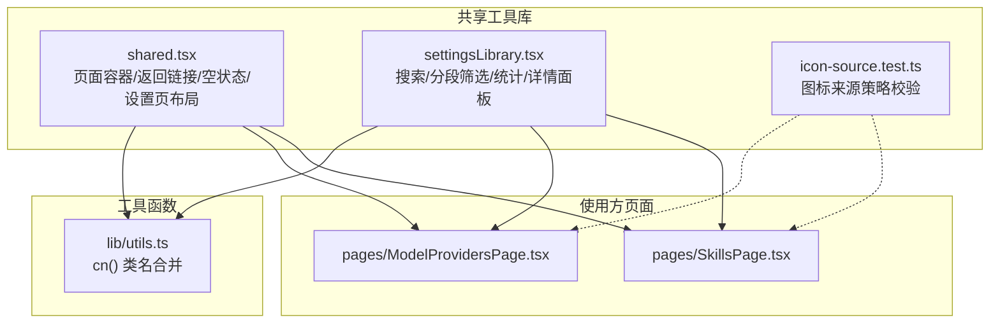
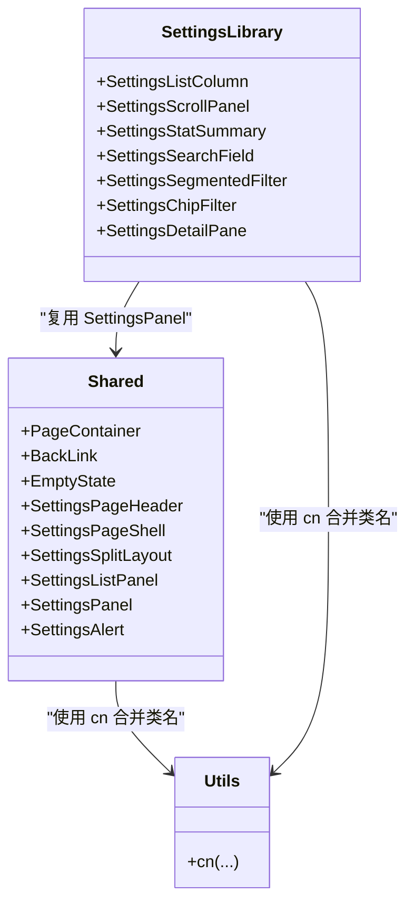
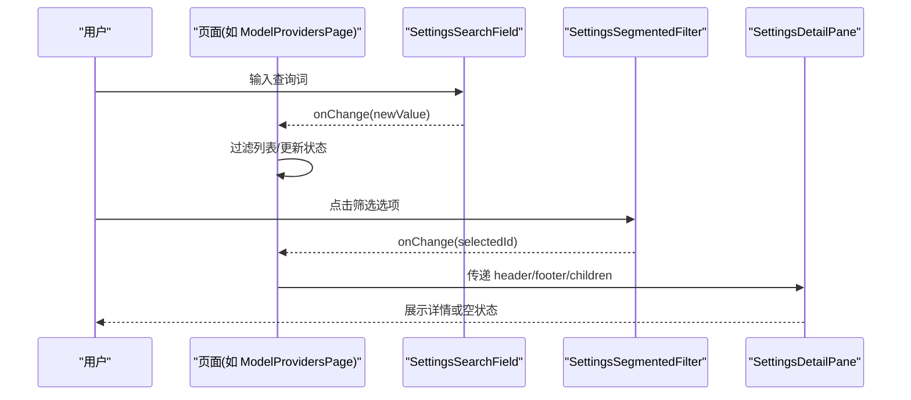
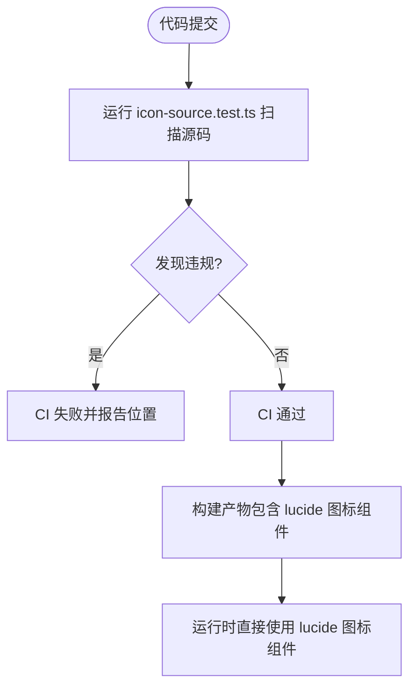
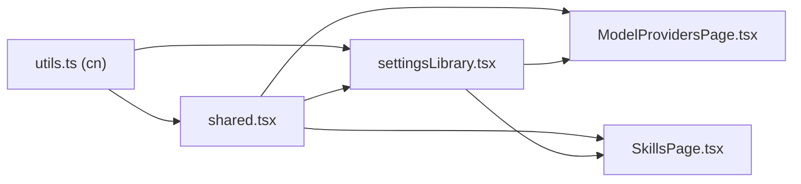

# 共享工具库

<cite>
**本文引用的文件**   
- [web/src/components/shared.tsx](file://web/src/components/shared.tsx)
- [web/src/components/settingsLibrary.tsx](file://web/src/components/settingsLibrary.tsx)
- [web/src/components/icon-source.test.ts](file://web/src/components/icon-source.test.ts)
- [web/src/components/shared.test.tsx](file://web/src/components/shared.test.tsx)
- [web/src/components/settingsLibrary.test.tsx](file://web/src/components/settingsLibrary.test.tsx)
- [web/src/lib/utils.ts](file://web/src/lib/utils.ts)
- [web/src/pages/ModelProvidersPage.tsx](file://web/src/pages/ModelProvidersPage.tsx)
- [web/src/pages/SkillsPage.tsx](file://web/src/pages/SkillsPage.tsx)
</cite>

## 目录
1. [简介](#简介)
2. [项目结构](#项目结构)
3. [核心组件](#核心组件)
4. [架构总览](#架构总览)
5. [详细组件分析](#详细组件分析)
6. [依赖关系分析](#依赖关系分析)
7. [性能与缓存](#性能与缓存)
8. [故障排查指南](#故障排查指南)
9. [结论](#结论)
10. [附录：使用示例与集成指南](#附录使用示例与集成指南)

## 简介
本文件面向前端共享工具库，聚焦以下目标：
- 深入说明 shared.tsx 中的通用页面布局与设置页辅助组件
- 详细说明 settingsLibrary.tsx 的设置库 UI 原语（搜索、分段筛选、统计摘要、详情面板等）
- 解释图标源管理策略与约束（统一使用 lucide-react，禁止内联 SVG/图片/Emoji）
- 提供参数类型、返回值格式、默认值与验证规则的说明
- 给出使用示例与集成指南，帮助快速在页面中复用这些能力

## 项目结构
共享工具库位于 web/src/components 下，主要包含两个模块：
- shared.tsx：页面级通用容器、返回链接、空状态、设置页头部与分栏布局等
- settingsLibrary.tsx：设置库场景下的列表/筛选/统计/详情等可复用 UI 原语

此外，icon-source.test.ts 作为“图标来源策略”的静态检查测试，确保全项目遵循统一的图标规范。

图表来源
- [web/src/components/shared.tsx:1-145](file://web/src/components/shared.tsx#L1-L145)
- [web/src/components/settingsLibrary.tsx:1-281](file://web/src/components/settingsLibrary.tsx#L1-L281)
- [web/src/components/icon-source.test.ts:1-53](file://web/src/components/icon-source.test.ts#L1-L53)
- [web/src/lib/utils.ts:1-8](file://web/src/lib/utils.ts#L1-L8)
- [web/src/pages/ModelProvidersPage.tsx:1-200](file://web/src/pages/ModelProvidersPage.tsx#L1-L200)
- [web/src/pages/SkillsPage.tsx:1-200](file://web/src/pages/SkillsPage.tsx#L1-L200)

章节来源
- [web/src/components/shared.tsx:1-145](file://web/src/components/shared.tsx#L1-L145)
- [web/src/components/settingsLibrary.tsx:1-281](file://web/src/components/settingsLibrary.tsx#L1-L281)
- [web/src/components/icon-source.test.ts:1-53](file://web/src/components/icon-source.test.ts#L1-L53)
- [web/src/lib/utils.ts:1-8](file://web/src/lib/utils.ts#L1-L8)

## 核心组件
本节对共享工具库的关键组件进行概览式说明，后续章节将展开详细分析。

- shared.tsx
  - PageContainer：统一的页面内容容器，提供一致的内外边距
  - BackLink：带左箭头的返回链接，用于子页面导航
  - EmptyState：统一的空状态提示文本样式
  - SettingsPageHeader：设置页标题+描述+操作区组合
  - SettingsPageShell：设置页主区域外壳，适配大屏独立滚动
  - SettingsSplitLayout：设置页左右分栏网格布局（支持 list-detail / management 两种变体）
  - SettingsListPanel / SettingsPanel：设置列表与详情卡片容器
  - SettingsAlert：错误/告警信息展示

- settingsLibrary.tsx
  - SettingsListColumn：左侧列容器，适合填充高度布局
  - SettingsScrollPanel：可滚动的列表主体面板
  - SettingsStatSummary：统计摘要（如“已启用 12 / 总计 39”）
  - SettingsSearchField：带搜索图标的受控输入框
  - SettingsSegmentedFilter：分段筛选控件（All/Active/Disabled 风格）
  - SettingsChipFilter：芯片式筛选（标签/来源等二级筛选）
  - SettingsDetailPane：右侧详情面板，支持粘性头部/尾部与独立滚动正文

- 图标源管理
  - 通过 icon-source.test.ts 强制约束：禁止内联 SVG、图片图标与 Emoji 图标；统一使用 lucide-react 提供的图标组件

章节来源
- [web/src/components/shared.tsx:1-145](file://web/src/components/shared.tsx#L1-L145)
- [web/src/components/settingsLibrary.tsx:1-281](file://web/src/components/settingsLibrary.tsx#L1-L281)
- [web/src/components/icon-source.test.ts:1-53](file://web/src/components/icon-source.test.ts#L1-L53)

## 架构总览
共享工具库采用“基础容器 + 设置库原语 + 统一图标策略”的分层组织方式：
- 基础容器负责页面骨架与布局一致性
- 设置库原语负责复杂设置页面的交互与呈现
- 图标策略通过测试保障全局一致性与可维护性

图表来源
- [web/src/components/shared.tsx:1-145](file://web/src/components/shared.tsx#L1-L145)
- [web/src/components/settingsLibrary.tsx:1-281](file://web/src/components/settingsLibrary.tsx#L1-L281)
- [web/src/lib/utils.ts:1-8](file://web/src/lib/utils.ts#L1-L8)

## 详细组件分析

### shared.tsx 组件详解
- PageContainer
  - 作用：为页面主体提供统一 padding 与最大宽度
  - 参数：标准 HTMLAttributes<HTMLDivElement>，支持 className、children 等
  - 行为：透传 props，内部使用 cn 合并 Tailwind 类名
  - 适用场景：所有页面内容包裹

- BackLink
  - 作用：返回链接，带左箭头图标
  - 参数：to（字符串路径）、children（文本或节点）、className
  - 行为：渲染 react-router-dom 的 Link，并附带 ArrowLeft 图标
  - 适用场景：子页面顶部导航

- EmptyState
  - 作用：统一的空状态提示段落
  - 参数：HTMLAttributes<HTMLParagraphElement>
  - 行为：应用 muted 文本色样式
  - 适用场景：无数据时的占位提示

- SettingsPageHeader
  - 作用：设置页标题行（标题+描述+可选操作区）
  - 参数：title（字符串）、description（ReactNode）、actions（可选 ReactNode）、className
  - 行为：响应式布局，移动端堆叠，桌面端横向排列

- SettingsPageShell
  - 作用：设置页主区域外壳，在大屏下使主区域可独立滚动
  - 参数：HTMLAttributes<HTMLDivElement>
  - 行为：基于 PageContainer 扩展，增加 flex/grid 相关样式

- SettingsSplitLayout
  - 作用：设置页左右分栏网格布局
  - 参数：variant（list-detail | management）、fill（是否填充父高）、HTMLAttributes<HTMLDivElement>
  - 行为：根据 variant 切换列宽比例；fill 时启用 min-h-0 与 overflow-hidden 以支持独立滚动

- SettingsListPanel / SettingsPanel
  - 作用：设置列表与详情卡片容器
  - 参数：CardProps（来自 ui 组件），内部使用 Card 包装
  - 行为：统一圆角、边框、背景与内边距

- SettingsAlert
  - 作用：错误/告警信息展示
  - 参数：HTMLAttributes<HTMLDivElement>
  - 行为：使用破坏性主题色（destructive）的边框与背景

章节来源
- [web/src/components/shared.tsx:1-145](file://web/src/components/shared.tsx#L1-L145)
- [web/src/components/shared.test.tsx:1-100](file://web/src/components/shared.test.tsx#L1-L100)

### settingsLibrary.tsx 组件详解
- SettingsListColumn
  - 作用：左侧列容器，适合填充高度布局
  - 参数：HTMLAttributes<HTMLDivElement>
  - 行为：flex-col，在大屏下允许独立滚动

- SettingsScrollPanel
  - 作用：可滚动的列表主体面板
  - 参数：HTMLAttributes<HTMLDivElement>
  - 行为：基于 SettingsPanel，添加垂直滚动与 overscroll-contain

- SettingsStatSummary
  - 作用：统计摘要（数值+单位/总数）
  - 参数：value（number）、unit（string）、total（number）、totalLabel（可选 string，默认 "total"）、size（lg|md，默认 lg）、className
  - 行为：大数字强调显示，单位与总数以次要样式呈现

- SettingsSearchField
  - 作用：带搜索图标的受控输入框
  - 参数：value（string）、onChange(value:string)=>void、size（InputProps["size"]，默认 default）、inputClassName、其他 InputHTMLAttributes<HTMLInputElement>
  - 行为：禁用自动完成与拼写检查，左侧固定 Search 图标

- SettingsSegmentedFilter<T extends string>
  - 作用：分段筛选控件（All/Active/Disabled 风格）
  - 参数：value（T）、onChange(value:T)=>void、options（readonly SettingsFilterOption<T>[]）、aria-label、className
  - 行为：选中项高亮，未选中项悬停高亮；每个选项可显示 count

- SettingsChipFilter<T extends string>
  - 作用：芯片式筛选（标签/来源等二级筛选）
  - 参数：同 SegmentedFilter
  - 行为：选中项边框与背景变化，未选中项半透明

- SettingsDetailPane
  - 作用：右侧详情面板，支持粘性头部/尾部与独立滚动正文
  - 参数：header/footer（可选 ReactNode）、children（可选 ReactNode）、empty（boolean）、emptyContent（可选 ReactNode）、bodyClassName、data-testid、className
  - 行为：当 empty 为真时显示居中占位；否则渲染 header/body/footer，body 可独立滚动

图表来源
- [web/src/pages/ModelProvidersPage.tsx:1-200](file://web/src/pages/ModelProvidersPage.tsx#L1-L200)
- [web/src/components/settingsLibrary.tsx:1-281](file://web/src/components/settingsLibrary.tsx#L1-L281)

章节来源
- [web/src/components/settingsLibrary.tsx:1-281](file://web/src/components/settingsLibrary.tsx#L1-L281)
- [web/src/components/settingsLibrary.test.tsx:1-87](file://web/src/components/settingsLibrary.test.tsx#L1-87)

### 图标源管理与加载机制
- 策略约束
  - 禁止内联 <svg>、 与 Emoji 作为图标
  - 统一从 lucide-react 导入图标组件
  - 通过静态扫描测试（icon-source.test.ts）在 CI 阶段拦截违规用法

- 加载机制与缓存
  - 图标由 lucide-react 提供，构建期按需打包，运行时直接引用组件实例
  - 本项目未实现自定义图标缓存或动态更新逻辑；图标资源随包分发，无需额外缓存策略

- 动态更新
  - 由于图标为静态组件，不存在运行时动态替换或热更场景
  - 若需更换图标，仅需替换 import 的图标名称即可

图表来源
- [web/src/components/icon-source.test.ts:1-53](file://web/src/components/icon-source.test.ts#L1-L53)

章节来源
- [web/src/components/icon-source.test.ts:1-53](file://web/src/components/icon-source.test.ts#L1-L53)

## 依赖关系分析
- 组件间依赖
  - settingsLibrary.tsx 依赖 shared.tsx 的 SettingsPanel
  - 两者均依赖 lib/utils.ts 的 cn 工具函数
- 外部依赖
  - lucide-react：图标来源
  - react-router-dom：BackLink 使用 Link
  - clsx/tailwind-merge：cn 工具函数底层实现

图表来源
- [web/src/lib/utils.ts:1-8](file://web/src/lib/utils.ts#L1-L8)
- [web/src/components/shared.tsx:1-145](file://web/src/components/shared.tsx#L1-L145)
- [web/src/components/settingsLibrary.tsx:1-281](file://web/src/components/settingsLibrary.tsx#L1-L281)
- [web/src/pages/ModelProvidersPage.tsx:1-200](file://web/src/pages/ModelProvidersPage.tsx#L1-L200)
- [web/src/pages/SkillsPage.tsx:1-200](file://web/src/pages/SkillsPage.tsx#L1-L200)

章节来源
- [web/src/lib/utils.ts:1-8](file://web/src/lib/utils.ts#L1-L8)
- [web/src/components/shared.tsx:1-145](file://web/src/components/shared.tsx#L1-L145)
- [web/src/components/settingsLibrary.tsx:1-281](file://web/src/components/settingsLibrary.tsx#L1-L281)
- [web/src/pages/ModelProvidersPage.tsx:1-200](file://web/src/pages/ModelProvidersPage.tsx#L1-L200)
- [web/src/pages/SkillsPage.tsx:1-200](file://web/src/pages/SkillsPage.tsx#L1-L200)

## 性能与缓存
- 类名合并
  - cn 使用 clsx 与 tailwind-merge，避免重复与冲突的 Tailwind 类，减少样式覆盖开销
- 布局与滚动
  - SettingsSplitLayout 与 SettingsDetailPane 在大屏下启用 min-h-0 与 overflow-hidden，配合独立滚动区域，提升长列表体验
- 图标渲染
  - 使用 lucide-react 组件，避免内联 SVG 带来的 DOM 体积与解析成本
- 缓存策略
  - 当前未实现自定义图标缓存；图标随包分发，无需额外缓存
  - 如需进一步优化，可在上层考虑按路由懒加载图标集或使用图标字体/雪碧图方案（非当前实现）

[本节为通用性能建议，不直接分析具体文件]

## 故障排查指南
- 图标违规报错
  - 现象：CI 报出 “inline svg/image/emoji icon” 违规
  - 处理：将内联 SVG/图片/Emoji 替换为 lucide-react 图标组件
  - 参考：[web/src/components/icon-source.test.ts:1-53](file://web/src/components/icon-source.test.ts#L1-L53)

- 设置页布局错位
  - 现象：大屏下左右列无法独立滚动
  - 处理：确认外层使用了 SettingsSplitLayout 且 fill 属性正确；详情页使用 SettingsDetailPane 包裹
  - 参考：[web/src/components/shared.tsx:90-113](file://web/src/components/shared.tsx#L90-L113)、[web/src/components/settingsLibrary.tsx:234-281](file://web/src/components/settingsLibrary.tsx#L234-L281)

- 搜索/筛选无效
  - 现象：输入或点击筛选后列表未更新
  - 处理：确认受控 value 与 onChange 绑定正确；页面侧是否正确根据新值计算过滤结果
  - 参考：[web/src/components/settingsLibrary.tsx:95-118](file://web/src/components/settingsLibrary.tsx#L95-L118)、[web/src/components/settingsLibrary.tsx:135-172](file://web/src/components/settingsLibrary.tsx#L135-L172)

- 表单提交错误提示
  - 现象：保存失败无提示
  - 处理：在页面中使用 SettingsAlert 展示错误信息
  - 参考：[web/src/components/shared.tsx:133-144](file://web/src/components/shared.tsx#L133-L144)

章节来源
- [web/src/components/icon-source.test.ts:1-53](file://web/src/components/icon-source.test.ts#L1-L53)
- [web/src/components/shared.tsx:90-113](file://web/src/components/shared.tsx#L90-L113)
- [web/src/components/settingsLibrary.tsx:95-118](file://web/src/components/settingsLibrary.tsx#L95-L118)
- [web/src/components/settingsLibrary.tsx:135-172](file://web/src/components/settingsLibrary.tsx#L135-L172)
- [web/src/components/shared.tsx:133-144](file://web/src/components/shared.tsx#L133-L144)

## 结论
共享工具库通过清晰的职责划分与严格的图标策略，提供了稳定一致的页面布局与设置库交互能力。其组件设计注重可复用性与可测试性，结合 cn 工具函数与 lucide-react 图标体系，有效降低了页面开发复杂度与维护成本。建议在新增设置页面时优先复用现有原语，保持视觉与交互的一致性。

[本节为总结性内容，不直接分析具体文件]

## 附录：使用示例与集成指南

- 在设置页中使用布局与头部
  - 使用 SettingsPageShell 包裹页面主体
  - 使用 SettingsPageHeader 展示标题、描述与操作按钮
  - 使用 SettingsSplitLayout 创建左右分栏，左侧用 SettingsListColumn，右侧用 SettingsDetailPane
  - 参考：[web/src/pages/ModelProvidersPage.tsx:1-200](file://web/src/pages/ModelProvidersPage.tsx#L1-L200)、[web/src/pages/SkillsPage.tsx:1-200](file://web/src/pages/SkillsPage.tsx#L1-L200)

- 搜索与筛选集成
  - 使用 SettingsSearchField 接收 value 与 onChange，在页面侧维护查询状态并过滤列表
  - 使用 SettingsSegmentedFilter 或 SettingsChipFilter 管理筛选维度，将选中值回传给页面状态
  - 参考：[web/src/components/settingsLibrary.tsx:95-118](file://web/src/components/settingsLibrary.tsx#L95-L118)、[web/src/components/settingsLibrary.tsx:135-172](file://web/src/components/settingsLibrary.tsx#L135-L172)

- 统计摘要展示
  - 使用 SettingsStatSummary 展示“已启用/总计”等关键指标
  - 参考：[web/src/components/settingsLibrary.tsx:49-83](file://web/src/components/settingsLibrary.tsx#L49-L83)

- 详情面板与空状态
  - 使用 SettingsDetailPane 的 header/footer 与 children 组织详情内容
  - 当无数据时，设置 empty 与 emptyContent 显示占位
  - 参考：[web/src/components/settingsLibrary.tsx:234-281](file://web/src/components/settingsLibrary.tsx#L234-L281)

- 图标使用规范
  - 统一从 lucide-react 导入所需图标组件，避免内联 SVG/图片/Emoji
  - 参考：[web/src/components/icon-source.test.ts:1-53](file://web/src/components/icon-source.test.ts#L1-L53)

- 类名合并
  - 使用 cn(...inputs) 合并条件类名，避免冲突与冗余
  - 参考：[web/src/lib/utils.ts:1-8](file://web/src/lib/utils.ts#L1-L8)

章节来源
- [web/src/pages/ModelProvidersPage.tsx:1-200](file://web/src/pages/ModelProvidersPage.tsx#L1-L200)
- [web/src/pages/SkillsPage.tsx:1-200](file://web/src/pages/SkillsPage.tsx#L1-L200)
- [web/src/components/settingsLibrary.tsx:49-83](file://web/src/components/settingsLibrary.tsx#L49-L83)
- [web/src/components/settingsLibrary.tsx:95-118](file://web/src/components/settingsLibrary.tsx#L95-L118)
- [web/src/components/settingsLibrary.tsx:135-172](file://web/src/components/settingsLibrary.tsx#L135-L172)
- [web/src/components/settingsLibrary.tsx:234-281](file://web/src/components/settingsLibrary.tsx#L234-L281)
- [web/src/components/icon-source.test.ts:1-53](file://web/src/components/icon-source.test.ts#L1-L53)
- [web/src/lib/utils.ts:1-8](file://web/src/lib/utils.ts#L1-L8)