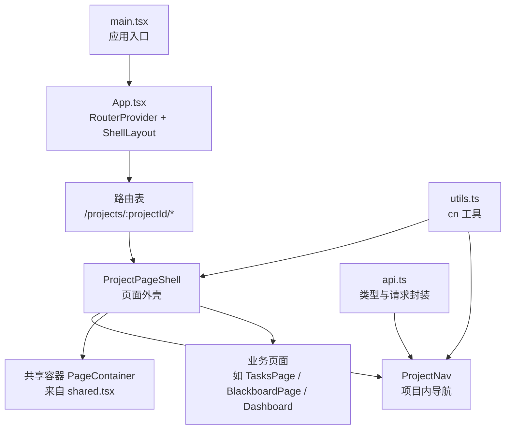
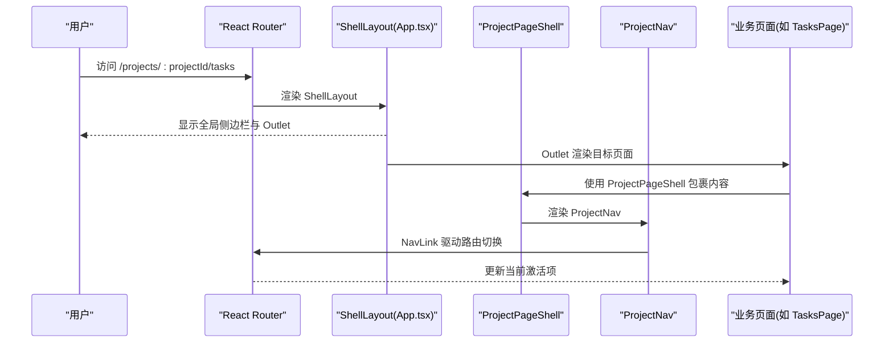
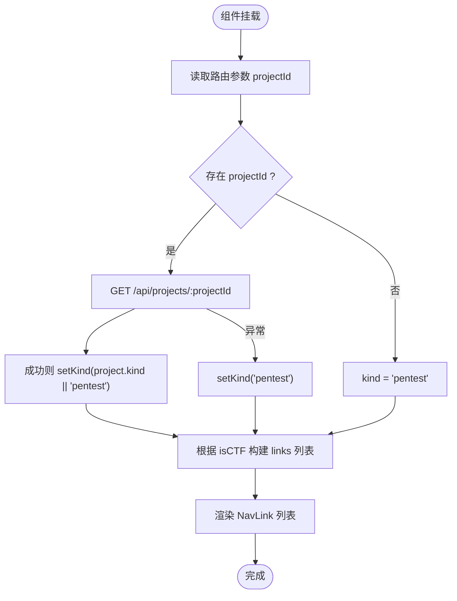
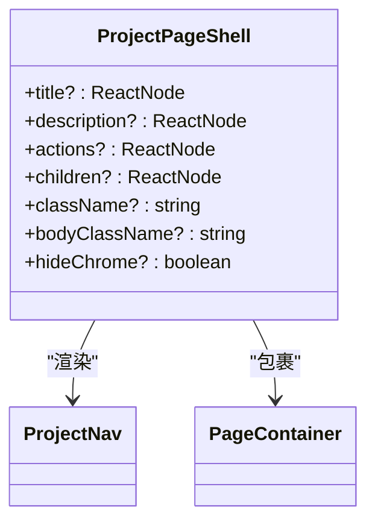
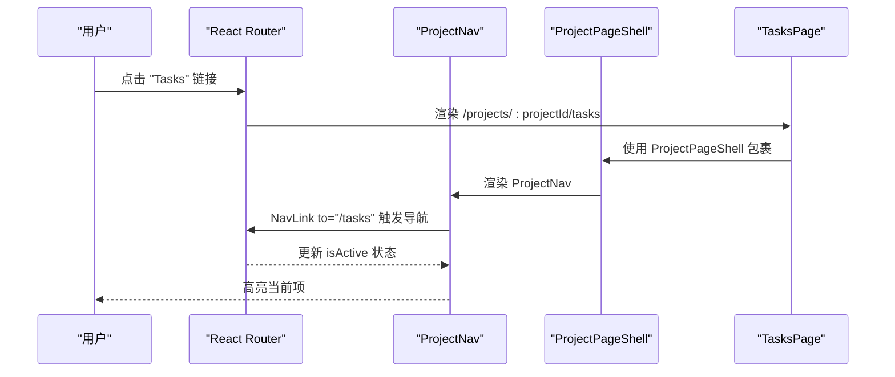
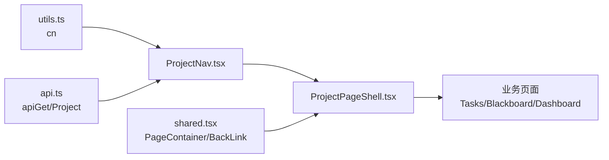

# 布局组件

<cite>
**本文引用的文件**   
- [web/src/components/ProjectNav.tsx](file://web/src/components/ProjectNav.tsx)
- [web/src/components/ProjectPageShell.tsx](file://web/src/components/ProjectPageShell.tsx)
- [web/src/App.tsx](file://web/src/App.tsx)
- [web/src/main.tsx](file://web/src/main.tsx)
- [web/src/components/shared.tsx](file://web/src/components/shared.tsx)
- [web/src/lib/utils.ts](file://web/src/lib/utils.ts)
- [web/src/pages/ProjectDashboardPage.tsx](file://web/src/pages/ProjectDashboardPage.tsx)
- [web/src/pages/TasksPage.tsx](file://web/src/pages/TasksPage.tsx)
- [web/src/pages/BlackboardPage.tsx](file://web/src/pages/BlackboardPage.tsx)
- [web/src/components/ProjectPageShell.test.tsx](file://web/src/components/ProjectPageShell.test.tsx)
- [web/src/lib/api.ts](file://web/src/lib/api.ts)
</cite>

## 目录
1. [简介](#简介)
2. [项目结构](#项目结构)
3. [核心组件](#核心组件)
4. [架构总览](#架构总览)
5. [详细组件分析](#详细组件分析)
6. [依赖关系分析](#依赖关系分析)
7. [性能与响应式优化](#性能与响应式优化)
8. [故障排查指南](#故障排查指南)
9. [结论](#结论)
10. [附录：使用示例与最佳实践](#附录使用示例与最佳实践)

## 简介
本文件聚焦于前端布局体系中的两个关键组件：ProjectNav（项目导航）与 ProjectPageShell（页面外壳）。文档将深入说明其实现细节、路由集成方式、导航状态管理、页面布局结构，并给出属性配置、嵌套使用方式与自定义扩展点。同时覆盖响应式适配与移动端优化策略，以及布局组合的最佳实践和性能优化建议。

## 项目结构
布局相关代码主要位于 web/src 下：
- 组件层：ProjectNav、ProjectPageShell、shared 工具组件
- 应用壳层：App.tsx 定义全局 ShellLayout 与路由表
- 页面层：各业务页面通过 ProjectPageShell 包裹内容，形成统一的项目内页面骨架
- 工具层：cn 类名合并工具、API 客户端类型与请求封装

图表来源
- [web/src/main.tsx:13-19](file://web/src/main.tsx#L13-L19)
- [web/src/App.tsx:317-344](file://web/src/App.tsx#L317-L344)
- [web/src/components/ProjectPageShell.tsx:20-84](file://web/src/components/ProjectPageShell.tsx#L20-L84)
- [web/src/components/ProjectNav.tsx:12-71](file://web/src/components/ProjectNav.tsx#L12-L71)
- [web/src/components/shared.tsx:13-19](file://web/src/components/shared.tsx#L13-L19)
- [web/src/lib/utils.ts:4-7](file://web/src/lib/utils.ts#L4-L7)
- [web/src/lib/api.ts:83-97](file://web/src/lib/api.ts#L83-L97)

章节来源
- [web/src/main.tsx:13-19](file://web/src/main.tsx#L13-L19)
- [web/src/App.tsx:317-344](file://web/src/App.tsx#L317-L344)

## 核心组件
- ProjectNav：基于 React Router 的 NavLink 渲染项目内导航项，根据项目 kind 动态切换“Findings/Solution”等标签，支持 end 精确匹配与高亮样式。
- ProjectPageShell：统一的页面外壳，提供粘性顶部区域（返回链接 + ProjectNav）、可选标题/描述/操作区、可定制 body 容器，内部复用 PageContainer 进行边距与最大宽度控制。

章节来源
- [web/src/components/ProjectNav.tsx:12-71](file://web/src/components/ProjectNav.tsx#L12-L71)
- [web/src/components/ProjectPageShell.tsx:20-84](file://web/src/components/ProjectPageShell.tsx#L20-L84)
- [web/src/components/shared.tsx:13-19](file://web/src/components/shared.tsx#L13-L19)

## 架构总览
整体布局由 App.tsx 的全局 ShellLayout 负责侧边栏与主内容区，而具体项目子页面的顶部导航与头部则由 ProjectPageShell 提供。ProjectNav 作为子导航，嵌入在 ProjectPageShell 的粘性顶部区域中。

图表来源
- [web/src/App.tsx:317-344](file://web/src/App.tsx#L317-L344)
- [web/src/components/ProjectPageShell.tsx:20-84](file://web/src/components/ProjectPageShell.tsx#L20-L84)
- [web/src/components/ProjectNav.tsx:12-71](file://web/src/components/ProjectNav.tsx#L12-L71)
- [web/src/pages/TasksPage.tsx:65-118](file://web/src/pages/TasksPage.tsx#L65-L118)

## 详细组件分析

### ProjectNav 组件
- 功能要点
  - 从路由参数获取 projectId，调用 API 获取项目 kind，用于决定导航项（CTF 场景显示 Solution，常规渗透测试显示 Findings/Report）。
  - 构建导航项数组，按信息架构顺序排列：Overview → Tasks → Blackboard → Findings/Solution → Evidence → Report → Scope。
  - 使用 NavLink 渲染，end 属性确保精确匹配首页段；isActive 时应用高亮样式。
  - 通过 cn 工具合并 Tailwind 类名，保证焦点可见性与悬停反馈。
- 数据流
  - 初始化时读取 projectId，异步请求 /api/projects/:projectId，失败回退为默认 pentest。
  - 根据 kind 计算 isCTF，动态调整 links 列表。
- 交互与可访问性
  - nav 元素设置 aria-label="Project sections"。
  - 每个链接具备清晰的文本与焦点环样式。
- 响应式
  - 在小屏上采用 flex-1 均分按钮，文本截断，保持紧凑布局。

图表来源
- [web/src/components/ProjectNav.tsx:12-71](file://web/src/components/ProjectNav.tsx#L12-L71)
- [web/src/lib/api.ts:83-97](file://web/src/lib/api.ts#L83-L97)

章节来源
- [web/src/components/ProjectNav.tsx:12-71](file://web/src/components/ProjectNav.tsx#L12-L71)
- [web/src/lib/api.ts:118-129](file://web/src/lib/api.ts#L118-129)

### ProjectPageShell 组件
- 功能要点
  - 提供统一的页面外壳：粘性顶部区域包含“返回所有项目”链接与 ProjectNav；可选标题、描述、操作区；body 区域承载 children。
  - 通过 hideChrome 控制是否显示顶部 chrome（返回链接与导航），便于全屏或特殊页面使用。
  - 使用 PageContainer 统一内边距与最大宽度，提升一致性。
- 属性配置
  - title/description/actions：支持字符串或任意 ReactNode，actions 右侧对齐，小屏自动换行。
  - className/bodyClassName：分别作用于外层容器与 body 区域，便于细粒度样式覆盖。
  - 透传 HTMLAttributes<HTMLDivElement>，保留原生 div 能力。
- 布局结构
  - 顶部 sticky 区域带 backdrop-blur 背景模糊效果，在大屏增加左右外边距以撑满视口。
  - 标题/描述/操作区在小屏纵向堆叠，大屏横向分布。
- 可访问性
  - 顶部区域 data-testid 便于测试定位；标题使用语义化 h2。

图表来源
- [web/src/components/ProjectPageShell.tsx:20-84](file://web/src/components/ProjectPageShell.tsx#L20-L84)
- [web/src/components/ProjectNav.tsx:12-71](file://web/src/components/ProjectNav.tsx#L12-L71)
- [web/src/components/shared.tsx:13-19](file://web/src/components/shared.tsx#L13-L19)

章节来源
- [web/src/components/ProjectPageShell.tsx:20-84](file://web/src/components/ProjectPageShell.tsx#L20-L84)
- [web/src/components/shared.tsx:13-19](file://web/src/components/shared.tsx#L13-L19)

### 路由集成与导航状态管理
- 路由注册
  - App.tsx 使用 createBrowserRouter 注册 /projects/:projectId 及其子路由，包括 tasks、blackboard/*、findings、evidence、report、solution 等。
- 导航状态
  - ProjectNav 使用 NavLink 的 isActive 与 end 属性，结合 cn 工具动态切换样式，确保当前段落的视觉高亮。
  - 对于黑盒视图（BlackboardPage），内部还维护了 subnav 的 tab 状态，并通过 splat 路由解析记录页路径。
- 页面组合
  - 业务页面（如 TasksPage、BlackboardPage、ProjectDashboardPage）通过 ProjectPageShell 包裹自身内容，获得一致的顶部导航与头部区域。

图表来源
- [web/src/App.tsx:317-344](file://web/src/App.tsx#L317-L344)
- [web/src/components/ProjectNav.tsx:52-67](file://web/src/components/ProjectNav.tsx#L52-L67)
- [web/src/pages/TasksPage.tsx:65-118](file://web/src/pages/TasksPage.tsx#L65-L118)

章节来源
- [web/src/App.tsx:317-344](file://web/src/App.tsx#L317-L344)
- [web/src/pages/BlackboardPage.tsx:34-66](file://web/src/pages/BlackboardPage.tsx#L34-66)

## 依赖关系分析
- ProjectNav
  - 依赖 react-router-dom 的 useParams、NavLink。
  - 依赖 apiGet 与 Project 类型，用于获取项目 kind。
  - 依赖 cn 工具合并类名。
- ProjectPageShell
  - 依赖 ProjectNav、BackLink、PageContainer（来自 shared.tsx）。
  - 依赖 cn 工具。
- 页面层
  - 各页面通过 ProjectPageShell 组合布局，并在 actions/title 处注入业务操作与标题。

图表来源
- [web/src/lib/utils.ts:4-7](file://web/src/lib/utils.ts#L4-L7)
- [web/src/lib/api.ts:83-97](file://web/src/lib/api.ts#L83-L97)
- [web/src/components/ProjectNav.tsx:1-5](file://web/src/components/ProjectNav.tsx#L1-L5)
- [web/src/components/ProjectPageShell.tsx:1-5](file://web/src/components/ProjectPageShell.tsx#L1-L5)
- [web/src/components/shared.tsx:1-6](file://web/src/components/shared.tsx#L1-L6)

章节来源
- [web/src/components/ProjectNav.tsx:1-5](file://web/src/components/ProjectNav.tsx#L1-L5)
- [web/src/components/ProjectPageShell.tsx:1-5](file://web/src/components/ProjectPageShell.tsx#L1-L5)
- [web/src/components/shared.tsx:1-6](file://web/src/components/shared.tsx#L1-L6)
- [web/src/lib/utils.ts:4-7](file://web/src/lib/utils.ts#L4-L7)
- [web/src/lib/api.ts:83-97](file://web/src/lib/api.ts#L83-L97)

## 性能与响应式优化
- 性能
  - ProjectNav 仅在 projectId 变化时发起一次 API 请求，避免重复拉取；错误处理回退到默认 kind，减少 UI 抖动。
  - ProjectPageShell 使用 forwardRef 透引用，避免不必要的重渲染；sticky 区域仅影响滚动体验，不引入额外计算。
  - 使用 cn 工具合并类名，减少运行时条件拼接开销。
- 响应式与移动端
  - ProjectNav 在小屏采用 flex-1 均分与 truncate 文本，保证可读性与触控面积。
  - ProjectPageShell 的顶部区域在大屏增加负外边距与更大 padding，使内容更贴近视口边缘；backdrop-blur 增强层级感。
  - 标题/描述/操作区在小屏纵向堆叠，大屏横向分布，提升空间利用率。
- 可访问性
  - 导航区域与链接具备合适的 aria-label 与 focus-visible 样式，键盘可达性与焦点可见性良好。

[本节为通用指导，无需特定文件来源]

## 故障排查指南
- 导航项未高亮
  - 检查 NavLink 的 to 路径是否与路由表一致，必要时使用 end 属性确保精确匹配。
  - 确认路由参数 projectId 是否正确传入。
- 导航项缺失或顺序异常
  - 核对 ProjectNav 的 links 构建逻辑，特别是 isCTF 分支对 Findings/Solution 与 Report 的切换。
  - 验证 API 返回的 project.kind 是否符合预期；若请求失败，会回退为 pentest。
- 顶部区域遮挡或样式异常
  - 检查 ProjectPageShell 的 sticky 区域 z-index 与 backdrop-filter 兼容性；必要时在旧浏览器降级。
  - 确认 hideChrome 的使用场景，避免误隐藏顶部导航。
- 测试断言失败
  - 参考 ProjectPageShell.test.tsx 中对 chrome 区域与导航顺序的断言，确保新增导航项遵循 IA 顺序。

章节来源
- [web/src/components/ProjectNav.tsx:16-30](file://web/src/components/ProjectNav.tsx#L16-L30)
- [web/src/components/ProjectPageShell.test.tsx:16-55](file://web/src/components/ProjectPageShell.test.tsx#L16-L55)

## 结论
ProjectNav 与 ProjectPageShell 构成了项目内页面的统一导航与外壳体系。通过 React Router 的 NavLink 与 end 属性，实现了稳定的导航状态管理；通过 ProjectPageShell 的粘性顶部与可配置头部，保证了跨页面的一致性体验。配合 cn 工具与 Tailwind 类名，提供了良好的响应式与可访问性支持。建议在新增页面时优先使用 ProjectPageShell 包裹，遵循既定的导航顺序与信息架构，以获得一致的用户体验。

[本节为总结，无需特定文件来源]

## 附录：使用示例与最佳实践
- 基本用法
  - 在业务页面中使用 ProjectPageShell 包裹内容，并提供 title、actions 与 bodyClassName。
  - 示例路径：
    - [TasksPage 使用 ProjectPageShell:65-118](file://web/src/pages/TasksPage.tsx#L65-L118)
    - [BlackboardPage 使用 ProjectPageShell:50-66](file://web/src/pages/BlackboardPage.tsx#L50-L66)
    - [ProjectDashboardPage 使用 ProjectPageShell:84-160](file://web/src/pages/ProjectDashboardPage.tsx#L84-L160)
- 属性配置建议
  - title 可为字符串或 ReactNode，复杂标题建议使用语义化元素（如 h2）。
  - actions 放置高频操作按钮，注意在小屏下的换行与间距。
  - bodyClassName 用于控制内容区域的间距与布局，避免直接修改外层 className。
- 嵌套使用方式
  - 多个页面共用同一外壳，确保顶部导航与返回链接位置一致。
  - 如需隐藏顶部 chrome（例如全屏预览），设置 hideChrome=true。
- 自定义扩展点
  - 通过 className/bodyClassName 进行样式覆盖。
  - 在 ProjectPageShell 外部添加额外的全局行为（如埋点、统计），避免侵入外壳组件。
- 路由集成最佳实践
  - 路由表集中管理，确保 NavLink 的 to 与路由定义一致。
  - 对于子路由（如 blackboard/*），使用 splat 解析并映射到内部 tab 状态。
- 性能优化建议
  - 避免在 ProjectNav 中频繁发起 API 请求，缓存项目 kind 或使用 React Query 等方案。
  - 合理使用 memo/useMemo 包裹昂贵的计算逻辑，减少重渲染。
  - 图片与图标按需加载，避免首屏阻塞。

章节来源
- [web/src/pages/TasksPage.tsx:65-118](file://web/src/pages/TasksPage.tsx#L65-L118)
- [web/src/pages/BlackboardPage.tsx:50-66](file://web/src/pages/BlackboardPage.tsx#L50-66)
- [web/src/pages/ProjectDashboardPage.tsx:84-160](file://web/src/pages/ProjectDashboardPage.tsx#L84-L160)
- [web/src/App.tsx:317-344](file://web/src/App.tsx#L317-L344)