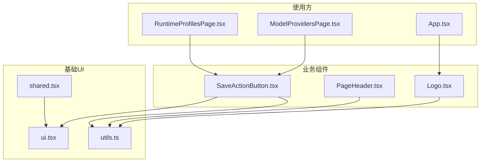
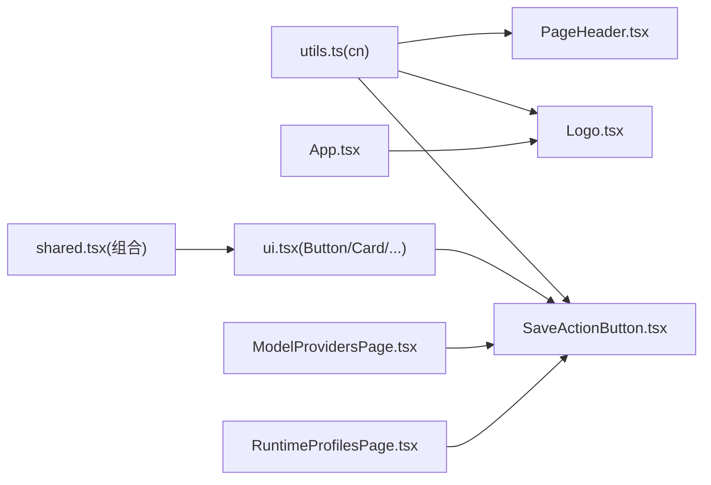

# 核心组件

<cite>
**本文引用的文件**
- [Logo.tsx](file://web/src/components/Logo.tsx)
- [PageHeader.tsx](file://web/src/components/PageHeader.tsx)
- [SaveActionButton.tsx](file://web/src/components/SaveActionButton.tsx)
- [ui.tsx](file://web/src/components/ui.tsx)
- [shared.tsx](file://web/src/components/shared.tsx)
- [utils.ts](file://web/src/lib/utils.ts)
- [App.tsx](file://web/src/App.tsx)
- [ModelProvidersPage.tsx](file://web/src/pages/ModelProvidersPage.tsx)
- [RuntimeProfilesPage.tsx](file://web/src/pages/RuntimeProfilesPage.tsx)
- [Logo.test.tsx](file://web/src/components/Logo.test.tsx)
- [PageHeader.test.tsx](file://web/src/components/PageHeader.test.tsx)
- [SaveActionButton.test.tsx](file://web/src/components/SaveActionButton.test.tsx)
</cite>

## 目录
1. [简介](#简介)
2. [项目结构](#项目结构)
3. [核心组件](#核心组件)
4. [架构总览](#架构总览)
5. [详细组件分析](#详细组件分析)
6. [依赖分析](#依赖分析)
7. [性能考虑](#性能考虑)
8. [故障排查指南](#故障排查指南)
9. [结论](#结论)
10. [附录](#附录)

## 简介
本文件聚焦于前端 UI 基础组件：Logo、PageHeader、SaveActionButton。文档从设计原理、属性接口、事件处理、样式定制、可访问性与响应式特性入手，结合真实页面中的组合模式与状态管理实践，提供最佳实践指导与常见问题排查建议。

## 项目结构
这些组件位于 web/src/components 目录下，遵循“原子化 + 组合”的构建方式：
- Logo：品牌标识展示，支持边框与旋转动画变体。
- PageHeader：统一的粘性顶部栏，包含标题与右侧操作区。
- SaveActionButton：保存按钮的状态反馈（空闲/加载中/已保存）。
- ui.tsx：基础 UI 控件（Button、Card、Input、Textarea、Select、Label、Badge）与变体系统。
- shared.tsx：页面级布局与设置页常用组合组件。
- utils.ts：类名合并工具 cn，统一 Tailwind 类名的条件合并策略。



图表来源
- [Logo.tsx:1-37](file://web/src/components/Logo.tsx#L1-L37)
- [PageHeader.tsx:1-71](file://web/src/components/PageHeader.tsx#L1-L71)
- [SaveActionButton.tsx:1-61](file://web/src/components/SaveActionButton.tsx#L1-L61)
- [ui.tsx:1-233](file://web/src/components/ui.tsx#L1-L233)
- [shared.tsx:1-145](file://web/src/components/shared.tsx#L1-L145)
- [utils.ts:1-8](file://web/src/lib/utils.ts#L1-L8)
- [App.tsx:25-224](file://web/src/App.tsx#L25-L224)
- [ModelProvidersPage.tsx:1-200](file://web/src/pages/ModelProvidersPage.tsx#L1-L200)
- [RuntimeProfilesPage.tsx:1-200](file://web/src/pages/RuntimeProfilesPage.tsx#L1-L200)

章节来源
- [Logo.tsx:1-37](file://web/src/components/Logo.tsx#L1-L37)
- [PageHeader.tsx:1-71](file://web/src/components/PageHeader.tsx#L1-L71)
- [SaveActionButton.tsx:1-61](file://web/src/components/SaveActionButton.tsx#L1-L61)
- [ui.tsx:1-233](file://web/src/components/ui.tsx#L1-L233)
- [shared.tsx:1-145](file://web/src/components/shared.tsx#L1-L145)
- [utils.ts:1-8](file://web/src/lib/utils.ts#L1-L8)
- [App.tsx:25-224](file://web/src/App.tsx#L25-L224)
- [ModelProvidersPage.tsx:1-200](file://web/src/pages/ModelProvidersPage.tsx#L1-L200)
- [RuntimeProfilesPage.tsx:1-200](file://web/src/pages/RuntimeProfilesPage.tsx#L1-L200)

## 核心组件
本节概述三个基础组件的职责边界与协作关系：
- Logo：负责品牌图标的渲染与可选边框/旋转效果，通过 className 暴露尺寸与位置定制能力。
- PageHeader：提供粘性顶栏容器与标题、操作区插槽，支持多尺寸与背景变体，便于页面头部一致性。
- SaveActionButton：封装保存操作的三种状态（空闲、加载中、已保存），提供无障碍提示与动效反馈。

章节来源
- [Logo.tsx:1-37](file://web/src/components/Logo.tsx#L1-L37)
- [PageHeader.tsx:1-71](file://web/src/components/PageHeader.tsx#L1-L71)
- [SaveActionButton.tsx:1-61](file://web/src/components/SaveActionButton.tsx#L1-L61)

## 架构总览
组件间依赖关系清晰：Logo 与 PageHeader 依赖 cn 进行类名合并；SaveActionButton 基于 Button 等基础控件实现状态化交互；页面层将三者组合形成一致的导航与操作体验。

```mermaid
classDiagram
class Logo {
+className? : string
+bordered? : boolean
+spin? : boolean
}
class PageHeader {
+variant? : "default"|"solid"|"flat"
+size? : "compact"|"default"|"spacious"
+children
}
class PageHeaderTitle {
+size? : "sm"|"default"|"lg"
+children
}
class PageHeaderActions {
+children
}
class SaveActionButton {
+label? : string
+pending? : boolean
+saved? : boolean
+disabled? : boolean
+onClick?()
+size? : ButtonProps.size
+className? : string
}
class Button {
+variant
+size
+...HTMLAttributes
}
Logo --> "cn" : "类名合并"
PageHeader --> "cn" : "类名合并"
SaveActionButton --> Button : "复用"
SaveActionButton --> "cn" : "类名合并"
```

图表来源
- [Logo.tsx:1-37](file://web/src/components/Logo.tsx#L1-L37)
- [PageHeader.tsx:1-71](file://web/src/components/PageHeader.tsx#L1-L71)
- [SaveActionButton.tsx:1-61](file://web/src/components/SaveActionButton.tsx#L1-L61)
- [ui.tsx:66-102](file://web/src/components/ui.tsx#L66-L102)
- [utils.ts:1-8](file://web/src/lib/utils.ts#L1-L8)

## 详细组件分析

### Logo 组件
- 设计要点
  - 以图片形式呈现品牌标识，默认宽高固定，可通过 className 覆盖。
  - 支持 bordered 包裹边框容器，spin 启用旋转动画。
  - 使用高优先级加载与异步解码提升首屏体验。
- Props 定义
  - className?: string
  - bordered?: boolean
  - spin?: boolean
- 事件处理
  - 无内部事件，点击行为由父级控制。
- 样式定制
  - 通过 className 传入任意 Tailwind 类名（如 h-8 w-8）覆盖尺寸。
  - bordered 时外层 span 提供圆角与边框。
  - spin 时应用 logo-entrance-spin 动画类。
- 可访问性
  - alt="CyberPenda" 确保屏幕阅读器可读。
- 响应式设计
  - 通过外部 className 适配不同断点下的尺寸。
- 使用示例
  - 在应用壳中作为移动端顶部栏与侧边栏的品牌图标，配合 spin 增强动效。
- 最佳实践
  - 仅在需要边框时使用 bordered，避免多余 DOM。
  - 使用 className 控制尺寸，而非修改组件内部固定宽高。

章节来源
- [Logo.tsx:1-37](file://web/src/components/Logo.tsx#L1-L37)
- [Logo.test.tsx:1-27](file://web/src/components/Logo.test.tsx#L1-L27)
- [App.tsx:148-176](file://web/src/App.tsx#L148-L176)

### PageHeader 组件
- 设计要点
  - 粘性顶部栏，支持多种背景变体与尺寸，保证页面头部一致性。
  - 提供 PageHeaderTitle 与 PageHeaderActions 两个子槽位，分别承载标题与右侧操作区。
- Props 定义
  - PageHeader
    - variant?: "default" | "solid" | "flat"
    - size?: "compact" | "default" | "spacious"
    - children
  - PageHeaderTitle
    - size?: "sm" | "default" | "lg"
    - children
  - PageHeaderActions
    - children
- 事件处理
  - 无内部事件，操作区由用户自行注入按钮或表单控件。
- 样式定制
  - 通过 cva 定义的变体与尺寸快速切换外观。
  - 支持通过 className 追加额外样式。
- 可访问性
  - 标题使用语义化 h2 标签，利于辅助技术识别。
- 响应式设计
  - 尺寸变体在不同视口下保持合适的行高与内边距。
- 使用示例
  - 在设置页中使用 SettingsPageHeader 组合，左侧标题与描述，右侧放置操作按钮。
- 最佳实践
  - 将复杂操作放入 PageHeaderActions，保持头部信息层次清晰。
  - 根据页面密度选择 compact/default/spacious 尺寸。

章节来源
- [PageHeader.tsx:1-71](file://web/src/components/PageHeader.tsx#L1-L71)
- [PageHeader.test.tsx:1-49](file://web/src/components/PageHeader.test.tsx#L1-L49)
- [shared.tsx:47-72](file://web/src/components/shared.tsx#L47-L72)

### SaveActionButton 组件
- 设计要点
  - 封装保存流程的三态反馈：空闲、加载中、已保存。
  - 使用 aria-live 区域播报保存结果，提升可访问性。
  - 内置轻量动效（旋转、打勾、文本切换）提升交互感知。
- Props 定义
  - label?: string
  - pending?: boolean
  - saved?: boolean
  - disabled?: boolean
  - onClick?: () => void
  - size?: ButtonProps["size"]
  - className?: string
- 事件处理
  - onClick 透传给底层 Button，用于触发保存逻辑。
- 样式定制
  - 通过 size 控制按钮大小。
  - 通过 className 追加自定义样式。
  - 已保存状态使用成功色主题与过渡动画。
- 可访问性
  - aria-live="polite" 播报 Saved 文本。
  - 图标使用 aria-hidden 避免重复朗读。
- 响应式设计
  - 基于 Button 的尺寸变体，适配不同屏幕密度。
- 使用示例
  - 在 ModelProvidersPage 与 RuntimeProfilesPage 中，将 saving/savedNotice 状态映射到 pending/saved，并调用 showSavedNotice 显示短暂反馈。
- 最佳实践
  - 在请求期间设置 pending=true，完成后置 saved=true 并在超时后重置为 false。
  - 当存在校验失败或禁用场景，设置 disabled=true。

章节来源
- [SaveActionButton.tsx:1-61](file://web/src/components/SaveActionButton.tsx#L1-L61)
- [SaveActionButton.test.tsx:1-26](file://web/src/components/SaveActionButton.test.tsx#L1-L26)
- [ModelProvidersPage.tsx:118-200](file://web/src/pages/ModelProvidersPage.tsx#L118-L200)
- [RuntimeProfilesPage.tsx:155-200](file://web/src/pages/RuntimeProfilesPage.tsx#L155-L200)

### 基础 UI 控件（Button、Card、Input、Textarea、Select、Label、Badge）
- 设计要点
  - 基于 class-variance-authority 的变体系统，统一风格与尺寸。
  - 所有控件均支持 className 扩展与 forwardRef 引用。
- 关键 Props
  - Button: variant, size, ...HTMLAttributes<HTMLButtonElement>
  - Card: variant, size, as?, ...HTMLAttributes
  - Input/Textarea/Select: variant(default|invalid), size(sm|default|lg), ...原生属性
  - Label: variant(default|muted), size(sm|default), ...HTMLAttributes
  - Badge: variant(default|primary|info|success|warning|destructive|outline), size(sm|default)
- 使用建议
  - 优先使用预设变体，必要时用 className 微调。
  - 表单控件使用 invalid 变体表达错误状态。

章节来源
- [ui.tsx:1-233](file://web/src/components/ui.tsx#L1-L233)

### 页面级组合组件（SettingsPageHeader、SettingsPanel、SettingsSplitLayout 等）
- 设计要点
  - 将常见设置页布局抽象为可复用组合，减少页面样板代码。
  - 提供列表/详情双栏布局与填充模式，适配大屏独立滚动。
- 典型用法
  - SettingsPageHeader：标题+描述+右侧 actions。
  - SettingsSplitLayout：list-detail 或 management 两种网格布局。
  - SettingsListPanel/SettingsPanel：卡片容器，统一内边距与溢出处理。

章节来源
- [shared.tsx:1-145](file://web/src/components/shared.tsx#L1-L145)

## 依赖分析
- 组件耦合
  - Logo、PageHeader 仅依赖 cn，低耦合、高内聚。
  - SaveActionButton 依赖 Button 与 cn，职责单一且易于测试。
- 外部依赖
  - lucide-react 图标库（SaveActionButton）。
  - react-router-dom Link（shared.tsx 中的 BackLink）。
- 潜在循环依赖
  - 当前组件之间无相互导入，不存在循环依赖风险。



图表来源
- [utils.ts:1-8](file://web/src/lib/utils.ts#L1-L8)
- [Logo.tsx:1-37](file://web/src/components/Logo.tsx#L1-L37)
- [PageHeader.tsx:1-71](file://web/src/components/PageHeader.tsx#L1-L71)
- [SaveActionButton.tsx:1-61](file://web/src/components/SaveActionButton.tsx#L1-L61)
- [ui.tsx:1-233](file://web/src/components/ui.tsx#L1-L233)
- [shared.tsx:1-145](file://web/src/components/shared.tsx#L1-L145)
- [App.tsx:25-224](file://web/src/App.tsx#L25-L224)
- [ModelProvidersPage.tsx:1-200](file://web/src/pages/ModelProvidersPage.tsx#L1-L200)
- [RuntimeProfilesPage.tsx:1-200](file://web/src/pages/RuntimeProfilesPage.tsx#L1-L200)

## 性能考虑
- 图片加载优化
  - Logo 使用 fetchPriority="high" 与 decoding="async"，降低主线程阻塞。
- 样式计算
  - 大量使用 cva 与 cn，避免运行时分支过多导致的重排。
- 状态更新
  - SaveActionButton 的 saved 提示采用短时定时器关闭，避免长时间状态持有导致不必要的重渲染。
- 可访问性动画
  - 对运动敏感用户，动画类包含 motion-reduce 降级策略，减少不适感。

[本节为通用性能建议，不直接分析具体文件]

## 故障排查指南
- Logo 未显示或尺寸异常
  - 检查 public 目录下是否存在对应资源路径。
  - 确认是否通过 className 覆盖了宽高导致不可见。
- PageHeader 标题截断
  - 长标题默认 truncate，如需换行可在外层容器调整布局或缩短文案。
- SaveActionButton 无法点击
  - 检查 pending 或 disabled 是否为 true。
  - 确认 onClick 是否正确绑定且未抛出异常。
- 保存反馈不出现
  - 确认 saved 状态是否在请求成功后设置为 true，并在适当时机重置为 false。
  - 检查 aria-live 区域是否被其他元素遮挡或隐藏。

章节来源
- [Logo.test.tsx:1-27](file://web/src/components/Logo.test.tsx#L1-L27)
- [PageHeader.test.tsx:1-49](file://web/src/components/PageHeader.test.tsx#L1-L49)
- [SaveActionButton.test.tsx:1-26](file://web/src/components/SaveActionButton.test.tsx#L1-L26)

## 结论
Logo、PageHeader、SaveActionButton 构成 CyberPenda 前端 UI 的基础构件。它们通过清晰的 props 接口、一致的可访问性与响应式策略，以及良好的组合模式，支撑起设置页与应用壳的一致体验。建议在页面中优先使用这些组件，并结合 ui.tsx 与 shared.tsx 的组合能力，快速搭建稳定、可维护的界面。

[本节为总结性内容，不直接分析具体文件]

## 附录

### 组件组合模式与状态管理指导
- 组合模式
  - 使用 PageHeader + PageHeaderTitle + PageHeaderActions 构建页面头部。
  - 使用 SettingsPageHeader + SettingsSplitLayout + SettingsPanel 构建设置页主体。
  - 在表单底部或头部使用 SaveActionButton 承载保存动作。
- 状态管理
  - 将保存流程拆分为 saving/savedNotice 两个状态，分别映射到 SaveActionButton 的 pending/saved。
  - 使用定时器在保存成功后短暂显示 saved 反馈，避免持久状态污染。
- 可访问性清单
  - 为图片提供 alt 文本。
  - 使用语义化标签（h2/h3）组织标题层级。
  - 为动态反馈区域添加 aria-live。
  - 为图标添加 aria-hidden。

章节来源
- [shared.tsx:47-145](file://web/src/components/shared.tsx#L47-L145)
- [ModelProvidersPage.tsx:118-200](file://web/src/pages/ModelProvidersPage.tsx#L118-L200)
- [RuntimeProfilesPage.tsx:155-200](file://web/src/pages/RuntimeProfilesPage.tsx#L155-L200)
- [SaveActionButton.tsx:1-61](file://web/src/components/SaveActionButton.tsx#L1-L61)