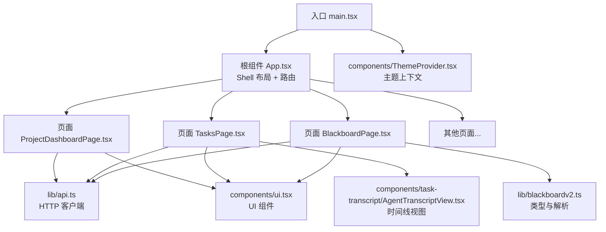
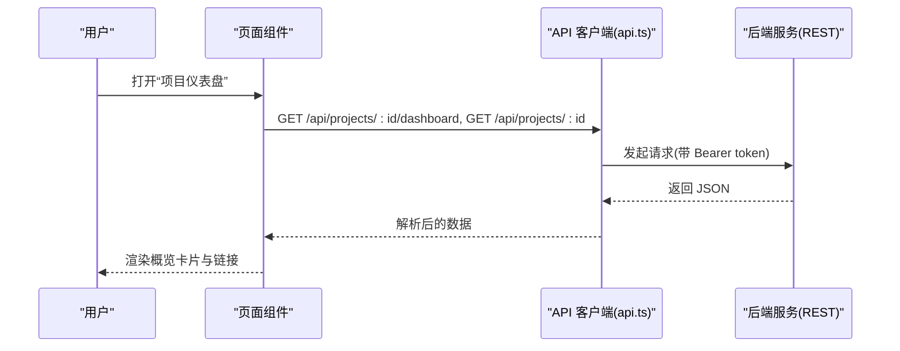
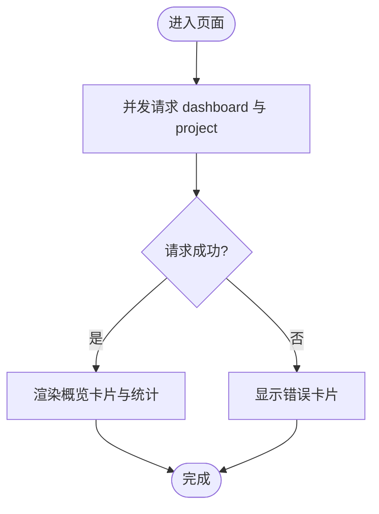
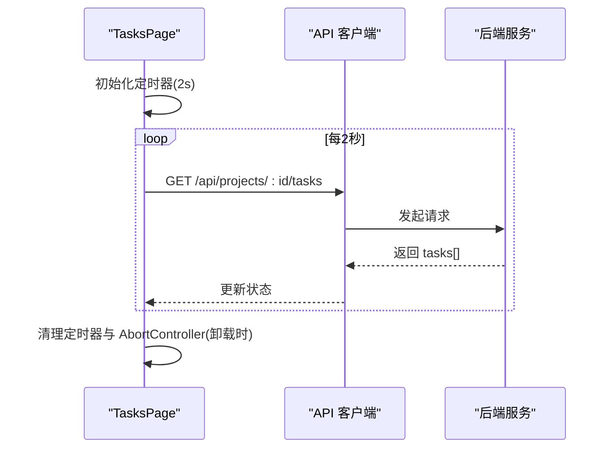
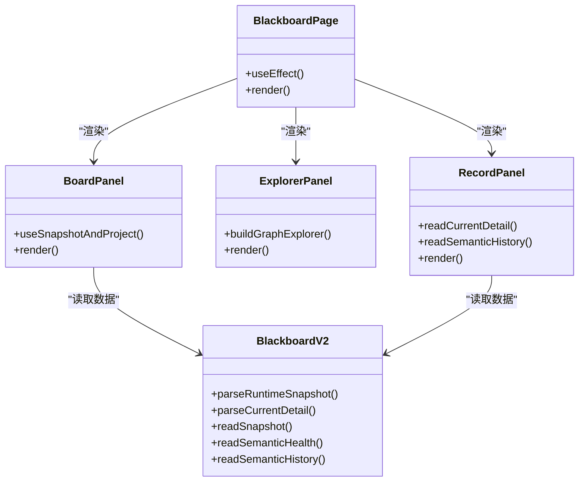
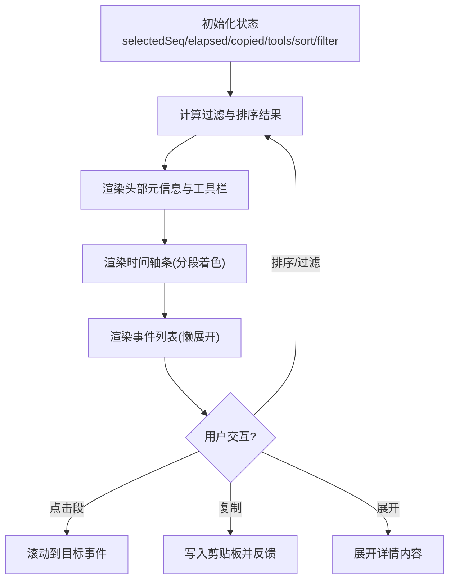
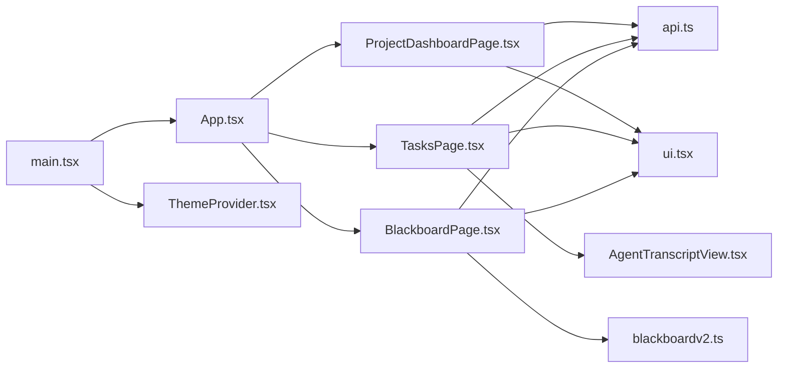

# Web 仪表板

<cite>
**本文引用的文件**   
- [README.md](file://README.md)
- [package.json](file://web/package.json)
- [main.tsx](file://web/src/main.tsx)
- [App.tsx](file://web/src/App.tsx)
- [api.ts](file://web/src/lib/api.ts)
- [blackboardv2.ts](file://web/src/lib/blackboardv2.ts)
- [ProjectDashboardPage.tsx](file://web/src/pages/ProjectDashboardPage.tsx)
- [TasksPage.tsx](file://web/src/pages/TasksPage.tsx)
- [BlackboardPage.tsx](file://web/src/pages/BlackboardPage.tsx)
- [ui.tsx](file://web/src/components/ui.tsx)
- [ThemeProvider.tsx](file://web/src/components/ThemeProvider.tsx)
- [AgentTranscriptView.tsx](file://web/src/components/task-transcript/AgentTranscriptView.tsx)
</cite>

## 目录
1. [简介](#简介)
2. [项目结构](#项目结构)
3. [核心组件](#核心组件)
4. [架构总览](#架构总览)
5. [详细组件分析](#详细组件分析)
6. [依赖关系分析](#依赖关系分析)
7. [性能考虑](#性能考虑)
8. [故障排查指南](#故障排查指南)
9. [结论](#结论)
10. [附录](#附录)

## 简介
本文件面向 CyberPenda 的 React + TypeScript Web 仪表板，聚焦以下目标：
- 应用架构与路由组织
- 页面组件职责划分与状态管理策略
- API 客户端封装、类型契约与错误处理
- Blackboard v2 语义数据读取与展示
- UI 组件库使用、主题定制与响应式布局
- 前端开发环境搭建、调试技巧与性能优化建议

本项目为本地优先的渗透测试代理，后端由 Go daemon 提供 HTTP API，Web 仪表板通过 REST 接口访问项目、任务、Blackboard 等能力。

章节来源
- [README.md:1-173](file://README.md#L1-L173)

## 项目结构
Web 前端采用 Vite + React + TypeScript 构建，基于 Tailwind CSS 和自定义轻量 UI 组件库。整体结构如下：
- 入口与根组件：main.tsx 初始化 React 根节点并注入 ThemeProvider；App.tsx 定义 Shell 布局与全局路由表
- 页面层 pages：按功能域拆分（项目、任务、Blackboard、报告等）
- 工具与数据层 lib：api.ts 统一 HTTP 请求封装；blackboardv2.ts 提供 Blackboard v2 类型与解析器
- 通用组件 components：ui.tsx 提供 Button/Card/Badge/Input 等基础控件；ThemeProvider.tsx 提供主题上下文；task-transcript 提供会话时间线视图

图表来源
- [main.tsx:1-20](file://web/src/main.tsx#L1-L20)
- [App.tsx:317-349](file://web/src/App.tsx#L317-L349)
- [ProjectDashboardPage.tsx:1-200](file://web/src/pages/ProjectDashboardPage.tsx#L1-L200)
- [TasksPage.tsx:1-158](file://web/src/pages/TasksPage.tsx#L1-L158)
- [BlackboardPage.tsx:1-800](file://web/src/pages/BlackboardPage.tsx#L1-L800)
- [api.ts:1-535](file://web/src/lib/api.ts#L1-L535)
- [blackboardv2.ts:1-800](file://web/src/lib/blackboardv2.ts#L1-L800)
- [ui.tsx:1-233](file://web/src/components/ui.tsx#L1-L233)
- [ThemeProvider.tsx:1-87](file://web/src/components/ThemeProvider.tsx#L1-L87)
- [AgentTranscriptView.tsx:1-533](file://web/src/components/task-transcript/AgentTranscriptView.tsx#L1-L533)

章节来源
- [package.json:1-48](file://web/package.json#L1-L48)
- [main.tsx:1-20](file://web/src/main.tsx#L1-L20)
- [App.tsx:317-349](file://web/src/App.tsx#L317-L349)

## 核心组件
- 主题提供者 ThemeProvider
  - 负责系统主题跟随、localStorage 持久化、切换逻辑与 Context 暴露
  - 导出 ThemeToggle 按钮用于切换明暗主题
- UI 组件库 ui.tsx
  - 基于 class-variance-authority 的变体系统，提供 Card、Button、Badge、Input、Textarea、Select、Label 等
  - 所有组件均支持 className 合并与可访问性焦点样式
- 应用外壳 ShellLayout 与路由
  - 在 App.tsx 中集中声明路由表，包含项目、设置、任务、Blackboard、报告等页面
  - 提供移动端侧边抽屉导航、键盘可达性与无障碍标签
- API 客户端 api.ts
  - 统一的 fetch 封装，自动附加 Authorization 头（Bearer token），从 URL 查询参数或 sessionStorage 获取 token
  - 抛出 ApiError，携带 status 与 body，便于上层统一错误提示
- Blackboard v2 客户端 blackboardv2.ts
  - 定义快照、健康、历史、记录详情等类型，并提供严格解析函数（allowlist、闭集合校验）
  - 提供辅助方法：URL 构建、关系解析、图谱构建等

章节来源
- [ThemeProvider.tsx:1-87](file://web/src/components/ThemeProvider.tsx#L1-L87)
- [ui.tsx:1-233](file://web/src/components/ui.tsx#L1-L233)
- [App.tsx:317-349](file://web/src/App.tsx#L317-L349)
- [api.ts:1-535](file://web/src/lib/api.ts#L1-L535)
- [blackboardv2.ts:1-800](file://web/src/lib/blackboardv2.ts#L1-L800)

## 架构总览
Web 仪表板作为 SPA，通过 REST API 与后端交互。关键流程包括：
- 项目概览：加载 Dashboard 与 Project 信息，展示范围就绪度与统计卡片
- 任务列表：轮询任务列表，显示运行态与运行时活动
- Blackboard：拉取 Snapshot 与 Health，渲染工作区、知识区与健康面板，支持记录详情与历史分页

图表来源
- [ProjectDashboardPage.tsx:27-45](file://web/src/pages/ProjectDashboardPage.tsx#L27-L45)
- [api.ts:20-97](file://web/src/lib/api.ts#L20-L97)

章节来源
- [ProjectDashboardPage.tsx:1-200](file://web/src/pages/ProjectDashboardPage.tsx#L1-L200)
- [api.ts:1-535](file://web/src/lib/api.ts#L1-L535)

## 详细组件分析

### 项目仪表盘 ProjectDashboardPage
- 功能
  - 并行请求 Dashboard 与 Project 详情
  - 展示范围就绪度、资产计数、快捷入口（编辑范围、启动任务、查看报告）
- 状态管理
  - 使用 useState 管理 dash/project/error/loading
  - 错误时以卡片形式呈现
- 交互
  - 点击计数卡片跳转至对应子页面
  - 根据 scope.ready 动态改变徽章与边框样式

图表来源
- [ProjectDashboardPage.tsx:27-77](file://web/src/pages/ProjectDashboardPage.tsx#L27-L77)

章节来源
- [ProjectDashboardPage.tsx:1-200](file://web/src/pages/ProjectDashboardPage.tsx#L1-L200)

### 任务列表 TasksPage
- 功能
  - 定时轮询任务列表（2s），显示任务目标、创建时间、runner、状态与运行时活动
- 状态管理
  - 使用 AbortController 取消上一次请求，避免竞态
  - 维护 generation 标记防止卸载后更新
- 实时性
  - 通过 runtime_activity.liveness 与 turn_activity 展示进程健康与当前动作

图表来源
- [TasksPage.tsx:30-61](file://web/src/pages/TasksPage.tsx#L30-L61)
- [api.ts:83-97](file://web/src/lib/api.ts#L83-L97)

章节来源
- [TasksPage.tsx:1-158](file://web/src/pages/TasksPage.tsx#L1-L158)

### Blackboard 页面 BlackboardPage
- 功能
  - 子导航：Work/Knowledge/Explorer/Record
  - 拉取 Snapshot、Health、Project，渲染状态条、健康面板、工作区与知识区
  - Record 模式：拉取 CurrentDetail 与 History（分页），对比 revision 一致性
- 数据校验
  - 使用 blackboardv2.ts 的解析器对快照与健康进行强校验（字段白名单、闭集合关系类型）
- 交互
  - 点击条目跳转到记录详情；健康异常提供关联 key 的快速定位

图表来源
- [BlackboardPage.tsx:46-155](file://web/src/pages/BlackboardPage.tsx#L46-L155)
- [blackboardv2.ts:634-695](file://web/src/lib/blackboardv2.ts#L634-L695)
- [blackboardv2.ts:744-765](file://web/src/lib/blackboardv2.ts#L744-L765)

章节来源
- [BlackboardPage.tsx:1-800](file://web/src/pages/BlackboardPage.tsx#L1-L800)
- [blackboardv2.ts:1-800](file://web/src/lib/blackboardv2.ts#L1-L800)

### 会话时间线 AgentTranscriptView
- 功能
  - 展示任务事件流，支持排序、过滤（按工具）、复制摘要、滚动定位
  - 顶部时间轴条快速跳转，行内展开详情（输入/输出/思考/文本/错误）
- 性能
  - 使用 content-visibility 与 contain-intrinsic-size 提升长列表渲染性能
  - 仅在 isLive 模式下计算运行时长
- 交互
  - 筛选下拉、排序切换、复制按钮反馈

图表来源
- [AgentTranscriptView.tsx:40-120](file://web/src/components/task-transcript/AgentTranscriptView.tsx#L40-L120)
- [AgentTranscriptView.tsx:341-401](file://web/src/components/task-transcript/AgentTranscriptView.tsx#L341-L401)
- [AgentTranscriptView.tsx:403-533](file://web/src/components/task-transcript/AgentTranscriptView.tsx#L403-L533)

章节来源
- [AgentTranscriptView.tsx:1-533](file://web/src/components/task-transcript/AgentTranscriptView.tsx#L1-L533)

### 主题与响应式
- 主题
  - ThemeProvider 监听系统偏好变化，未显式选择时跟随 OS；显式选择后持久化到 localStorage
  - 通过 html 类名 .dark 控制 Tailwind 深色模式
- 响应式
  - ShellLayout 在 <768px 下隐藏侧边栏并以抽屉方式呈现，支持 Escape 关闭与焦点恢复
  - 大量使用 Tailwind 断点与 flex/grid 布局实现自适应

章节来源
- [ThemeProvider.tsx:26-67](file://web/src/components/ThemeProvider.tsx#L26-L67)
- [App.tsx:53-121](file://web/src/App.tsx#L53-L121)

## 依赖关系分析
- 外部依赖
  - React 19、react-router-dom 7、TailwindCSS 3、class-variance-authority、lucide-react 图标库
  - 字体 @fontsource/geist 与 geist-mono
- 内部模块耦合
  - 页面层依赖 lib/api.ts 与 lib/blackboardv2.ts
  - 页面层复用 components/ui.tsx 的基础控件
  - 入口 main.tsx 注入 ThemeProvider，App.tsx 注册路由与 Shell 布局

图表来源
- [main.tsx:1-20](file://web/src/main.tsx#L1-L20)
- [App.tsx:317-349](file://web/src/App.tsx#L317-L349)
- [ProjectDashboardPage.tsx:1-200](file://web/src/pages/ProjectDashboardPage.tsx#L1-L200)
- [TasksPage.tsx:1-158](file://web/src/pages/TasksPage.tsx#L1-L158)
- [BlackboardPage.tsx:1-800](file://web/src/pages/BlackboardPage.tsx#L1-L800)
- [api.ts:1-535](file://web/src/lib/api.ts#L1-L535)
- [blackboardv2.ts:1-800](file://web/src/lib/blackboardv2.ts#L1-L800)
- [ui.tsx:1-233](file://web/src/components/ui.tsx#L1-L233)
- [ThemeProvider.tsx:1-87](file://web/src/components/ThemeProvider.tsx#L1-L87)
- [AgentTranscriptView.tsx:1-533](file://web/src/components/task-transcript/AgentTranscriptView.tsx#L1-L533)

章节来源
- [package.json:1-48](file://web/package.json#L1-L48)

## 性能考虑
- 网络与状态
  - 任务列表使用短轮询（2s），注意在组件卸载时中止请求与清理定时器，避免内存泄漏与多余渲染
  - 并发请求（如仪表盘同时拉取 dashboard 与 project）减少首屏等待
- 渲染优化
  - 长列表使用 content-visibility 与 contain-intrinsic-size 降低重排成本
  - 使用 useMemo/useCallback 缓存计算结果与回调，减少不必要的重渲染
- 主题与样式
  - 仅通过 html 类名切换主题，避免频繁 DOM 操作
  - 合理使用 Tailwind 原子类，减少自定义样式体积

[本节为通用指导，不直接分析具体文件]

## 故障排查指南
- 认证失败
  - 检查 URL 查询参数 token 是否有效，确认 sessionStorage 是否可用
  - 确认请求头 Authorization 是否正确附加
- 数据不一致
  - Blackboard 页面会检测 snapshot.revision 与 health.revision 不一致，出现“健康陈旧”提示，需刷新页面重新拉取一致数据
- 任务无数据
  - 检查轮询是否被中断（AbortController 信号），确认后端 /tasks 接口正常返回
- 时间线卡顿
  - 检查事件数量与展开详情内容大小，必要时限制输出长度或延迟加载

章节来源
- [api.ts:65-81](file://web/src/lib/api.ts#L65-L81)
- [BlackboardPage.tsx:262-283](file://web/src/pages/BlackboardPage.tsx#L262-L283)
- [TasksPage.tsx:30-61](file://web/src/pages/TasksPage.tsx#L30-L61)
- [AgentTranscriptView.tsx:500-528](file://web/src/components/task-transcript/AgentTranscriptView.tsx#L500-L528)

## 结论
Web 仪表板以清晰的页面分层、稳定的 API 封装与严格的 Blackboard v2 数据校验为核心，结合轻量 UI 组件库与主题系统，提供了良好的可读性与可维护性。通过合理的轮询策略与渲染优化，可在保证实时性的同时维持流畅体验。后续可考虑引入更完善的错误边界与重试机制、按需加载大型视图以及将部分状态提升到全局 store（如 Zustand/Redux）以支撑更大规模的功能扩展。

[本节为总结，不直接分析具体文件]

## 附录
- 开发环境搭建
  - 安装 Node.js 20+，执行 npm install
  - 启动开发服务器：npm run dev（Vite），默认代理 /api 到后端
  - 构建产物：npm run build
- 调试技巧
  - 使用浏览器 Network 面板观察 API 请求与响应
  - 在控制台打印 ApiError 的 status 与 body 定位后端错误
  - 使用 Vitest 运行单元测试：npm test
- 主题定制
  - 在 Tailwind 配置中扩展颜色变量，配合 ThemeProvider 的 .dark 类生效
  - 通过 ThemeToggle 切换明暗主题并持久化用户选择

章节来源
- [package.json:6-12](file://web/package.json#L6-L12)
- [ThemeProvider.tsx:26-67](file://web/src/components/ThemeProvider.tsx#L26-L67)
- [api.ts:8-18](file://web/src/lib/api.ts#L8-L18)