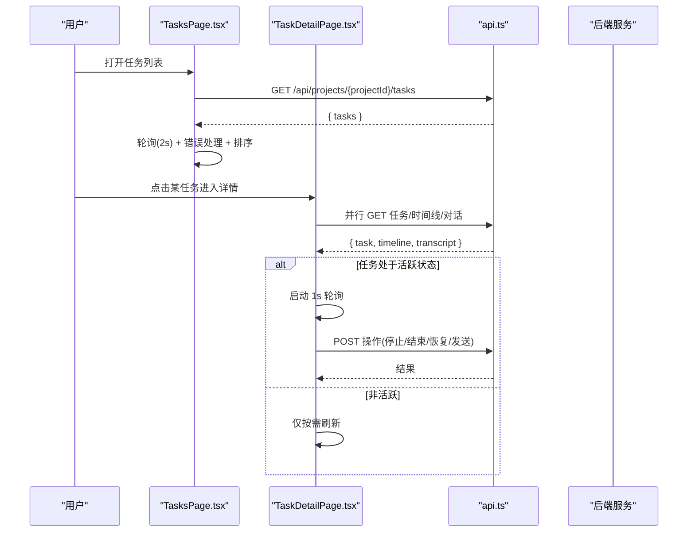
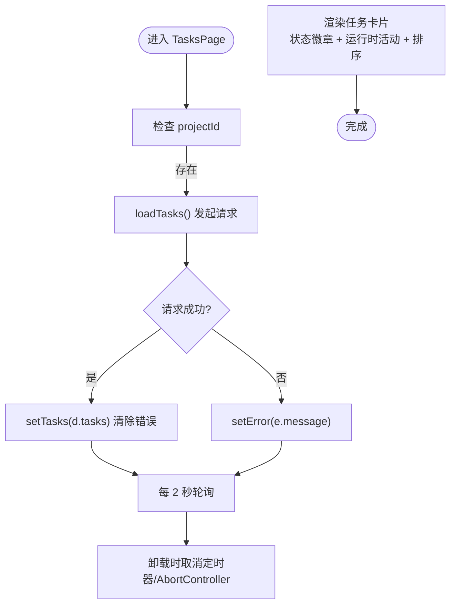
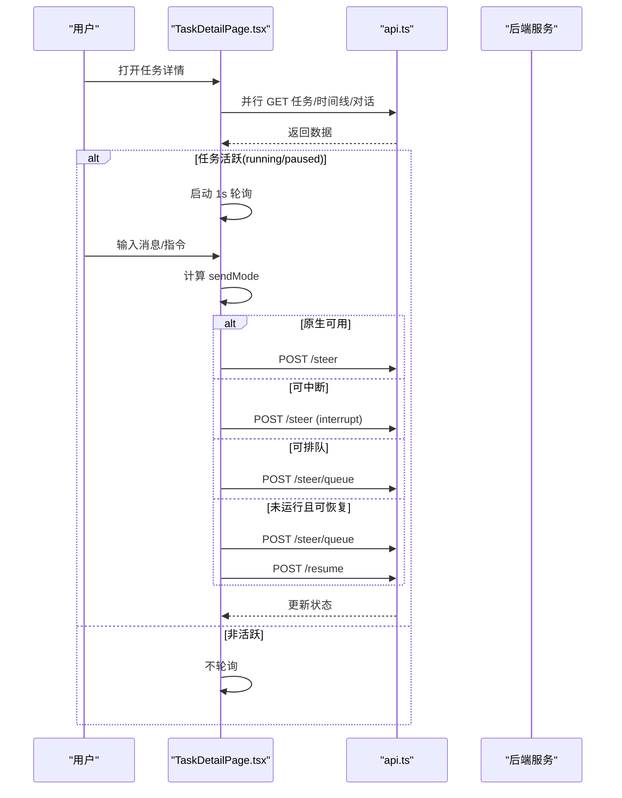
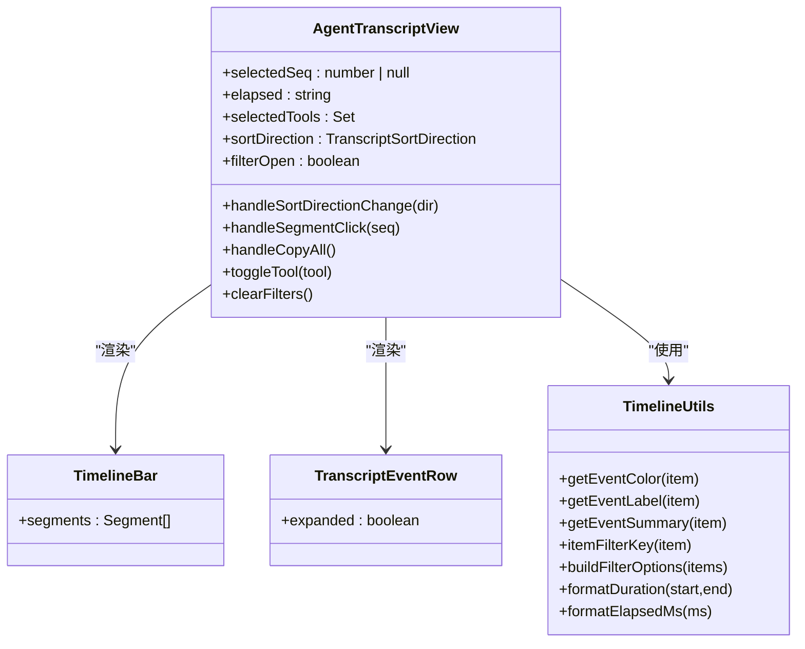
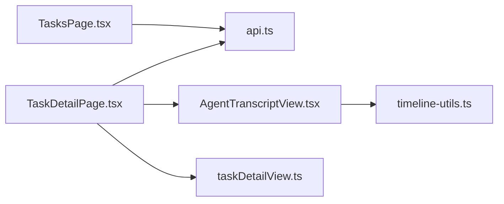

# 任务列表管理

<cite>
**本文引用的文件**   
- [TasksPage.tsx](file://web/src/pages/TasksPage.tsx)
- [TaskDetailPage.tsx](file://web/src/pages/TaskDetailPage.tsx)
- [AgentTranscriptView.tsx](file://web/src/components/task-transcript/AgentTranscriptView.tsx)
- [timeline-utils.ts](file://web/src/components/task-transcript/timeline-utils.ts)
- [taskDetailView.ts](file://web/src/pages/taskDetailView.ts)
- [api.ts](file://web/src/lib/api.ts)
</cite>

## 目录
1. [简介](#简介)
2. [项目结构](#项目结构)
3. [核心组件](#核心组件)
4. [架构总览](#架构总览)
5. [详细组件分析](#详细组件分析)
6. [依赖关系分析](#依赖关系分析)
7. [性能考虑](#性能考虑)
8. [故障排查指南](#故障排查指南)
9. [结论](#结论)
10. [附录](#附录)

## 简介
本文件聚焦“任务列表管理”页面与相关子系统的实现，覆盖以下关键主题：
- 任务卡片组件的实现细节：状态徽章、运行时活动指示器、时间排序逻辑
- 任务数据获取机制：轮询策略、错误处理、生命周期管理（含 AbortController 与 generation 防竞态）
- 任务状态映射系统（running、completed、pending、paused、failed 等）与视觉反馈
- 筛选、搜索与批量操作的实现方案（当前以工具过滤为主）
- 性能优化技巧与用户体验改进建议

## 项目结构
与任务列表相关的代码主要位于前端 React 应用中：
- 任务列表页：TasksPage.tsx
- 任务详情页：TaskDetailPage.tsx
- 代理对话/时间线视图：AgentTranscriptView.tsx
- 时间线工具与颜色/标签/摘要等辅助函数：timeline-utils.ts
- 事件摘要与展示规则：taskDetailView.ts
- API 客户端与类型定义：api.ts

```mermaid
graph TB
subgraph "页面"
TP["TasksPage.tsx"]
TDP["TaskDetailPage.tsx"]
end
subgraph "组件"
ATV["AgentTranscriptView.tsx"]
end
subgraph "工具"
TU["timeline-utils.ts"]
TDV["taskDetailView.ts"]
end
subgraph "API"
API["api.ts"]
end
TP --> API
TDP --> API
TDP --> ATV
ATV --> TU
TDP --> TDV
```

图表来源
- [TasksPage.tsx:1-158](file://web/src/pages/TasksPage.tsx#L1-L158)
- [TaskDetailPage.tsx:1-800](file://web/src/pages/TaskDetailPage.tsx#L1-L800)
- [AgentTranscriptView.tsx:1-533](file://web/src/components/task-transcript/AgentTranscriptView.tsx#L1-L533)
- [timeline-utils.ts:1-136](file://web/src/components/task-transcript/timeline-utils.ts#L1-L136)
- [taskDetailView.ts:1-306](file://web/src/pages/taskDetailView.ts#L1-L306)
- [api.ts:1-535](file://web/src/lib/api.ts#L1-L535)

章节来源
- [TasksPage.tsx:1-158](file://web/src/pages/TasksPage.tsx#L1-L158)
- [TaskDetailPage.tsx:1-800](file://web/src/pages/TaskDetailPage.tsx#L1-L800)
- [AgentTranscriptView.tsx:1-533](file://web/src/components/task-transcript/AgentTranscriptView.tsx#L1-L533)
- [timeline-utils.ts:1-136](file://web/src/components/task-transcript/timeline-utils.ts#L1-L136)
- [taskDetailView.ts:1-306](file://web/src/pages/taskDetailView.ts#L1-L306)
- [api.ts:1-535](file://web/src/lib/api.ts#L1-L535)

## 核心组件
- 任务列表页（TasksPage）
  - 负责拉取项目下所有任务、轮询刷新、渲染任务卡片、显示状态徽章与运行时活动指示器、按运行中优先+创建时间倒序排序。
- 任务详情页（TaskDetailPage）
  - 负责并行加载任务、时间线、对话记录；在活跃状态下高频轮询；提供停止、结束、删除、恢复、发送消息/指令等操作；根据运行时控制能力决定发送模式。
- 代理时间线视图（AgentTranscriptView）
  - 负责渲染时间线条目、工具过滤、排序方向切换、复制内容、滚动定位、时长统计等。
- 工具与辅助（timeline-utils.ts、taskDetailView.ts）
  - 提供事件颜色、标签、摘要、过滤键、持续时间格式化、时间线可见性判断等。
- API 客户端（api.ts）
  - 统一请求封装、鉴权头注入、错误提取与结构化错误解析、领域类型定义。

章节来源
- [TasksPage.tsx:1-158](file://web/src/pages/TasksPage.tsx#L1-L158)
- [TaskDetailPage.tsx:1-800](file://web/src/pages/TaskDetailPage.tsx#L1-L800)
- [AgentTranscriptView.tsx:1-533](file://web/src/components/task-transcript/AgentTranscriptView.tsx#L1-L533)
- [timeline-utils.ts:1-136](file://web/src/components/task-transcript/timeline-utils.ts#L1-L136)
- [taskDetailView.ts:1-306](file://web/src/pages/taskDetailView.ts#L1-L306)
- [api.ts:1-535](file://web/src/lib/api.ts#L1-L535)

## 架构总览
任务列表与详情通过 REST API 与后端交互，采用轮询方式保持 UI 实时性；详情页在活跃任务时提高轮询频率，并基于运行时控制能力动态选择发送路径（原生中断、队列、恢复后发送）。



图表来源
- [TasksPage.tsx:30-61](file://web/src/pages/TasksPage.tsx#L30-L61)
- [TaskDetailPage.tsx:55-96](file://web/src/pages/TaskDetailPage.tsx#L55-L96)
- [TaskDetailPage.tsx:143-148](file://web/src/pages/TaskDetailPage.tsx#L143-L148)
- [api.ts:20-97](file://web/src/lib/api.ts#L20-L97)

## 详细组件分析

### 任务列表页（TasksPage）
- 数据获取与轮询
  - 使用 useEffect 监听 projectId，首次调用 loadTasks，随后每 2 秒轮询一次。
  - 每次请求前 abort 上一次控制器，避免竞态；使用 generation 标记确保旧响应不覆盖新数据。
  - 错误捕获后设置 error 状态用于提示。
- 任务卡片渲染
  - 每个任务卡片包含目标文本、创建时间、runner 信息。
  - 右侧显示 TaskStatusBadge 与 RuntimeActivityBadge。
- 状态徽章（TaskStatusBadge）
  - 将 status 映射到 variant 与图标；running 状态附加旋转动画。
- 运行时活动指示器（RuntimeActivityBadge）
  - 读取 runtime_activity.liveness 与 turn_activity，生成 label 与 variant；tooltip 显示 warning 或 label。
- 排序逻辑（sortTasksForDisplay）
  - 优先将 running 的任务置顶，其次按 created_at 倒序。



图表来源
- [TasksPage.tsx:30-61](file://web/src/pages/TasksPage.tsx#L30-L61)
- [TasksPage.tsx:90-117](file://web/src/pages/TasksPage.tsx#L90-L117)
- [TasksPage.tsx:121-149](file://web/src/pages/TasksPage.tsx#L121-L149)
- [TasksPage.tsx:151-157](file://web/src/pages/TasksPage.tsx#L151-L157)

章节来源
- [TasksPage.tsx:1-158](file://web/src/pages/TasksPage.tsx#L1-L158)

### 任务详情页（TaskDetailPage）
- 数据获取与并发
  - 使用 Promise.all 并行加载任务、时间线、对话；使用 generation 与 AbortController 防止竞态。
- 轮询策略
  - 当任务状态为 running/paused 时，每 1 秒轮询一次；其他状态不轮询。
- 运行时控制与发送模式
  - 根据 controls 的 native/interrupt/queue/resume 能力计算 sendMode，决定发送路径。
  - 支持“切换模型提供者”场景：若需要重启则先入队消息，再 stop 然后 resume。
- 自动跟随与滚动
  - 监听滚动位置决定是否自动跟随最新内容；提供顶部/底部快速跳转。
- 权限请求
  - 展示 Provider permission requests，并提供 allow/deny 操作。



图表来源
- [TaskDetailPage.tsx:55-96](file://web/src/pages/TaskDetailPage.tsx#L55-L96)
- [TaskDetailPage.tsx:143-148](file://web/src/pages/TaskDetailPage.tsx#L143-L148)
- [TaskDetailPage.tsx:267-337](file://web/src/pages/TaskDetailPage.tsx#L267-L337)
- [TaskDetailPage.tsx:433-458](file://web/src/pages/TaskDetailPage.tsx#L433-L458)
- [api.ts:83-97](file://web/src/lib/api.ts#L83-L97)

章节来源
- [TaskDetailPage.tsx:1-800](file://web/src/pages/TaskDetailPage.tsx#L1-L800)

### 代理时间线视图（AgentTranscriptView）
- 功能要点
  - 工具过滤：基于 itemFilterKey 聚合 tool 名称与 type，构建 filterOptions，支持多选过滤。
  - 排序方向：支持“最新在前/最旧在前”，切换后滚动至顶部。
  - 复制内容：将当前显示项的标签与摘要拼接复制到剪贴板。
  - 滚动定位：点击时间线条段跳转到对应事件行。
  - 时长统计：isLive 时每秒刷新 elapsed；非 live 且任务结束时显示 duration。
- 视觉反馈
  - 使用 getEventColor/getEventLabel/getEventSummary 渲染不同事件类型的颜色、标签与摘要。
  - 顶部状态徽章根据 isLive 与任务状态显示 Running/Completed/Failed 或其他状态。



图表来源
- [AgentTranscriptView.tsx:40-127](file://web/src/components/task-transcript/AgentTranscriptView.tsx#L40-L127)
- [AgentTranscriptView.tsx:341-401](file://web/src/components/task-transcript/AgentTranscriptView.tsx#L341-L401)
- [AgentTranscriptView.tsx:403-490](file://web/src/components/task-transcript/AgentTranscriptView.tsx#L403-L490)
- [timeline-utils.ts:3-136](file://web/src/components/task-transcript/timeline-utils.ts#L3-L136)

章节来源
- [AgentTranscriptView.tsx:1-533](file://web/src/components/task-transcript/AgentTranscriptView.tsx#L1-L533)
- [timeline-utils.ts:1-136](file://web/src/components/task-transcript/timeline-utils.ts#L1-L136)

### 事件摘要与展示规则（taskDetailView.ts）
- 时间线可见性：shouldShowInTimeline 过滤纯工具输出，保留生命周期、引导、对话与非工具类运行时输出。
- 摘要生成：summarizeTaskEvent 对 lifecycle/steering/conversation/runtime_output 进行友好摘要。
- 标题折叠：collapsedTranscriptTitle 针对 tool_call/tool_result/runtime_output 生成简洁标题。
- 工具参数展示：toolCallFields 将 input 扁平化为带标签的字段，长文本/代码块使用多行展示。

章节来源
- [taskDetailView.ts:1-306](file://web/src/pages/taskDetailView.ts#L1-L306)

### API 客户端与类型（api.ts）
- 请求封装：request 统一处理 headers、认证 token、错误体解析与抛出 ApiError。
- 方法导出：apiGet/apiPost/apiPut/apiPatch/apiDelete。
- 领域类型：Task/RuntimeActivity/RuntimeControls/TaskTimelineItem/TaskTranscriptEntry 等。
- 错误提取：extractErrorMessage 兼容 daemon 控制错误与 Blackboard v2 结构化错误。

章节来源
- [api.ts:1-535](file://web/src/lib/api.ts#L1-L535)

## 依赖关系分析
- 页面层依赖 API 客户端获取数据与执行操作。
- 详情页依赖时间线视图组件与工具函数进行可视化。
- 工具函数集中处理颜色、标签、摘要与过滤键，降低页面复杂度。
- 类型定义集中在 api.ts，保证前后端数据结构一致性。



图表来源
- [TasksPage.tsx:1-158](file://web/src/pages/TasksPage.tsx#L1-L158)
- [TaskDetailPage.tsx:1-800](file://web/src/pages/TaskDetailPage.tsx#L1-L800)
- [AgentTranscriptView.tsx:1-533](file://web/src/components/task-transcript/AgentTranscriptView.tsx#L1-L533)
- [timeline-utils.ts:1-136](file://web/src/components/task-transcript/timeline-utils.ts#L1-L136)
- [taskDetailView.ts:1-306](file://web/src/pages/taskDetailView.ts#L1-L306)
- [api.ts:1-535](file://web/src/lib/api.ts#L1-L535)

章节来源
- [TasksPage.tsx:1-158](file://web/src/pages/TasksPage.tsx#L1-L158)
- [TaskDetailPage.tsx:1-800](file://web/src/pages/TaskDetailPage.tsx#L1-L800)
- [AgentTranscriptView.tsx:1-533](file://web/src/components/task-transcript/AgentTranscriptView.tsx#L1-L533)
- [timeline-utils.ts:1-136](file://web/src/components/task-transcript/timeline-utils.ts#L1-L136)
- [taskDetailView.ts:1-306](file://web/src/pages/taskDetailView.ts#L1-L306)
- [api.ts:1-535](file://web/src/lib/api.ts#L1-L535)

## 性能考虑
- 轮询节流与去重
  - 列表页 2 秒轮询，详情页在活跃时 1 秒轮询，避免频繁刷新造成抖动。
  - 使用 AbortController 取消未完成请求，generation 标记丢弃过期响应，减少无效渲染。
- 并发加载
  - 详情页使用 Promise.all 并行获取任务、时间线、对话，缩短首屏等待时间。
- 渲染优化
  - 时间线使用 content-visibility 与 contain-intrinsic-size 提升长列表滚动性能。
  - 工具过滤与排序在 useMemo 中缓存，避免重复计算。
- 网络与错误
  - 统一错误提取与结构化错误解析，避免 UI 崩溃；失败时仅设置错误提示，不影响已加载数据。

[本节为通用指导，无需具体文件引用]

## 故障排查指南
- 常见问题
  - 列表不刷新：检查轮询是否被清理（组件卸载会 clearInterval 与 abort），确认 projectId 变化是否正确触发 effect。
  - 详情页无数据：查看并行请求是否全部成功，关注 generation 与 AbortController 的状态。
  - 发送消息失败：核对 controls 的能力位（native/interrupt/queue/resume），确认 sendMode 与后端支持一致。
  - 运行时活动异常：观察 liveness 与 warning 字段，offline/orphaned/unknown 需结合后端日志排查。
- 调试建议
  - 在浏览器控制台打印 ApiError 的 status/body，定位后端错误码与消息。
  - 使用测试标识 data-testid 定位 DOM 元素，验证渲染分支是否符合预期。

章节来源
- [api.ts:20-97](file://web/src/lib/api.ts#L20-L97)
- [api.ts:515-534](file://web/src/lib/api.ts#L515-L534)
- [TaskDetailPage.tsx:267-337](file://web/src/pages/TaskDetailPage.tsx#L267-L337)
- [TasksPage.tsx:30-61](file://web/src/pages/TasksPage.tsx#L30-L61)

## 结论
任务列表与详情页通过清晰的轮询策略、并发加载与完善的错误处理，提供了良好的实时性与稳定性。状态徽章与运行时活动指示器直观反映任务健康度；时间线视图具备工具过滤、排序与复制能力，便于诊断与分析。后续可在搜索、批量操作方面进一步增强，同时继续优化长列表渲染与网络请求效率。

[本节为总结，无需具体文件引用]

## 附录

### 任务状态映射与视觉反馈
- 状态集合：running、completed、pending、paused、failed、stopped、interrupted
- 视觉映射
  - running → primary + Loader2 旋转
  - completed → success + CheckCircle2
  - pending → outline + Circle
  - paused → warning + PauseCircle
  - failed → destructive + AlertTriangle
  - stopped → outline + Square
  - interrupted → warning + AlertTriangle

章节来源
- [TasksPage.tsx:9-23](file://web/src/pages/TasksPage.tsx#L9-L23)
- [TasksPage.tsx:121-130](file://web/src/pages/TasksPage.tsx#L121-L130)

### 运行时活动指示器
- 字段说明
  - liveness：live | offline | orphaned | unknown
  - turn_activity：busy | idle（仅在 live 时）
  - warning：解释未知情况但不暗示失败
- 显示规则
  - 当 liveness=live 且有 turn_activity，显示 “runtime live · {turn}”
  - 否则显示 “runtime {liveness}”
  - variant 依据 liveness 值选择 primary/outline/warning

章节来源
- [TasksPage.tsx:132-149](file://web/src/pages/TasksPage.tsx#L132-L149)
- [api.ts:337-345](file://web/src/lib/api.ts#L337-L345)

### 时间排序逻辑
- 列表页排序
  - 优先 running 任务置顶
  - 同优先级按 created_at 倒序
- 时间线排序
  - 支持“最新在前/最旧在前”，切换后滚动至顶部

章节来源
- [TasksPage.tsx:151-157](file://web/src/pages/TasksPage.tsx#L151-L157)
- [AgentTranscriptView.tsx:83-90](file://web/src/components/task-transcript/AgentTranscriptView.tsx#L83-L90)

### 筛选、搜索与批量操作
- 当前实现
  - 工具过滤：基于 tool 名称与 type 的多选过滤，支持清空过滤
  - 复制：支持复制全部或过滤后的摘要
- 扩展建议
  - 增加关键词搜索（goal、runner、status）
  - 批量操作：批量停止/结束/删除（需后端支持与二次确认）

章节来源
- [AgentTranscriptView.tsx:51-119](file://web/src/components/task-transcript/AgentTranscriptView.tsx#L51-L119)
- [timeline-utils.ts:98-118](file://web/src/components/task-transcript/timeline-utils.ts#L98-L118)