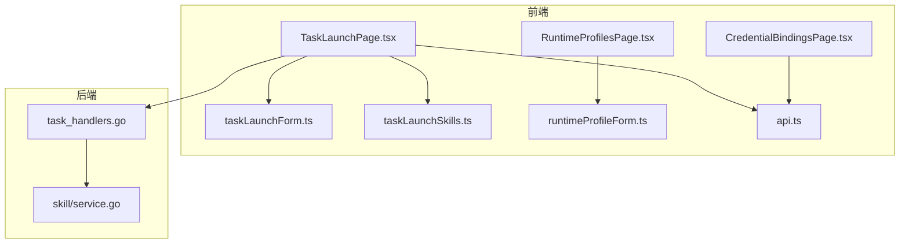
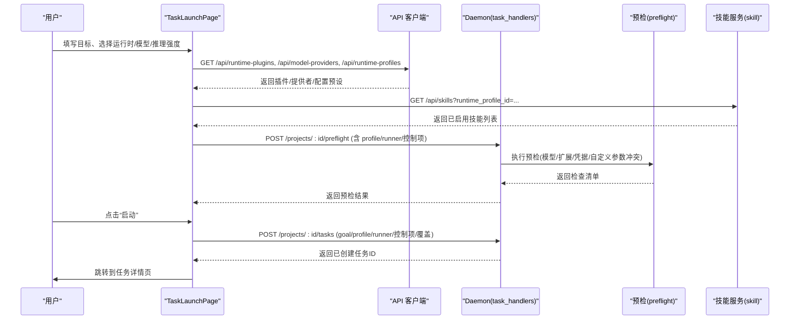
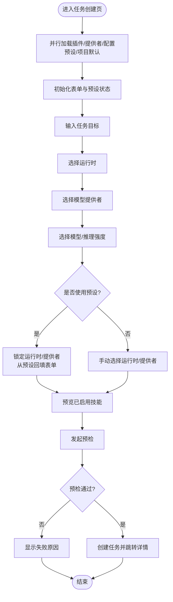
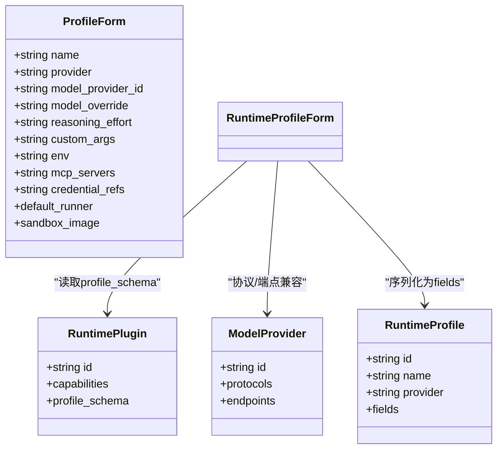
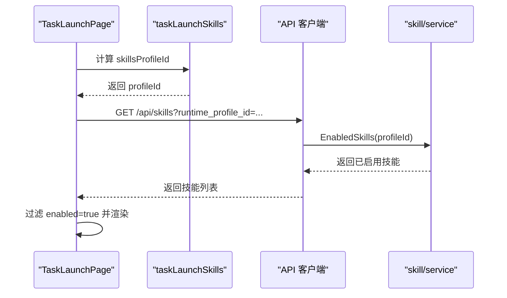
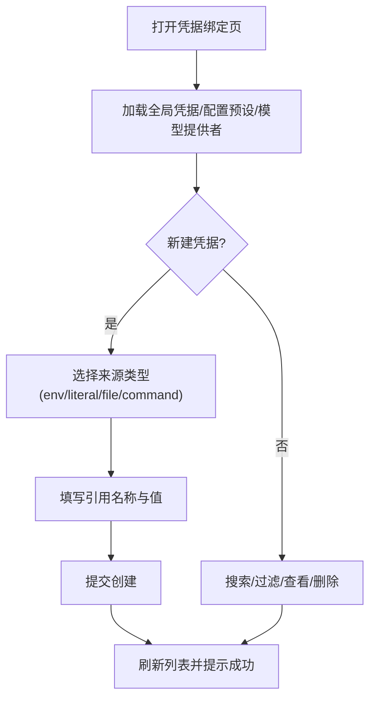
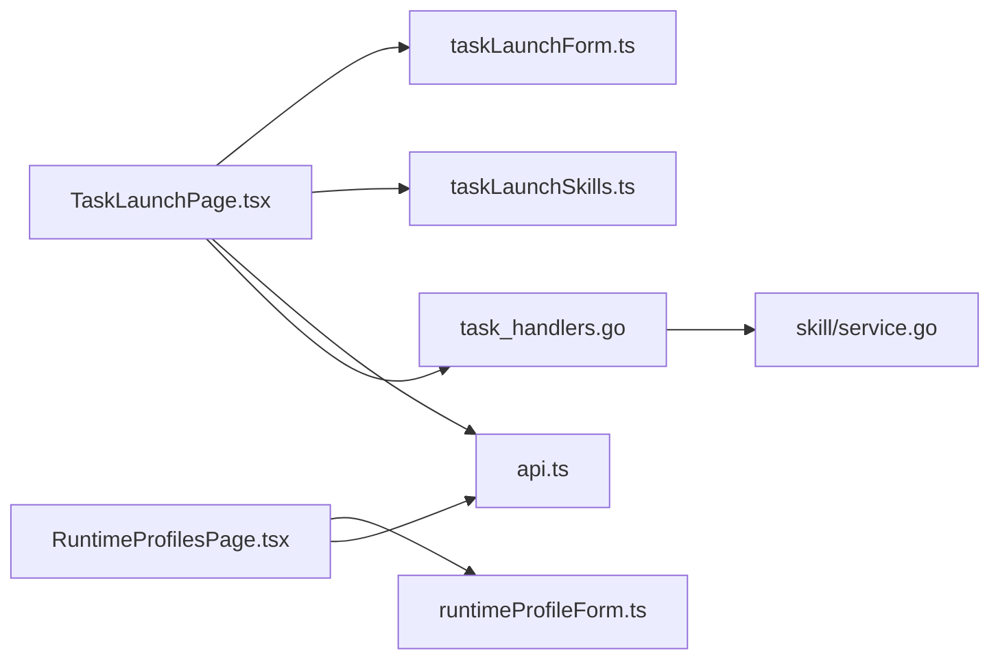

# 任务创建向导

<cite>
**本文引用的文件**   
- [TaskLaunchPage.tsx](file://web/src/pages/TaskLaunchPage.tsx)
- [taskLaunchForm.ts](file://web/src/pages/taskLaunchForm.ts)
- [taskLaunchSkills.ts](file://web/src/pages/taskLaunchSkills.ts)
- [CredentialBindingsPage.tsx](file://web/src/pages/CredentialBindingsPage.tsx)
- [RuntimeProfilesPage.tsx](file://web/src/pages/RuntimeProfilesPage.tsx)
- [runtimeProfileForm.ts](file://web/src/pages/runtimeProfileForm.ts)
- [api.ts](file://web/src/lib/api.ts)
- [task_handlers.go](file://internal/daemon/task_handlers.go)
- [service.go](file://internal/skill/service.go)
</cite>

## 目录
1. [简介](#简介)
2. [项目结构](#项目结构)
3. [核心组件](#核心组件)
4. [架构总览](#架构总览)
5. [详细组件分析](#详细组件分析)
6. [依赖关系分析](#依赖关系分析)
7. [性能与可用性考虑](#性能与可用性考虑)
8. [故障排查指南](#故障排查指南)
9. [结论](#结论)
10. [附录](#附录)

## 简介
本文件面向“任务创建向导”页面，系统性说明以下能力：
- 任务表单的构建过程：目标描述输入、运行时配置选择、技能绑定预览。
- 运行时配置文件（Runtime Profile）的管理与验证机制。
- 技能选择器的实现：内置与自定义技能的展示与过滤。
- 凭据绑定的用户界面设计与安全考量。
- 表单验证规则、错误提示与用户引导流程。
- 任务参数预填充与模板（预设）功能的实现方案。

## 项目结构
任务创建向导由前端 React 页面与后端 Daemon HTTP 服务协同完成。前端负责表单交互、状态管理与 API 调用；后端负责校验、解析、预检与任务启动。

图表来源
- [TaskLaunchPage.tsx:1-658](file://web/src/pages/TaskLaunchPage.tsx#L1-L658)
- [taskLaunchForm.ts:1-265](file://web/src/pages/taskLaunchForm.ts#L1-L265)
- [taskLaunchSkills.ts:1-24](file://web/src/pages/taskLaunchSkills.ts#L1-L24)
- [CredentialBindingsPage.tsx:1-506](file://web/src/pages/CredentialBindingsPage.tsx#L1-L506)
- [RuntimeProfilesPage.tsx:1-800](file://web/src/pages/RuntimeProfilesPage.tsx#L1-L800)
- [runtimeProfileForm.ts:1-264](file://web/src/pages/runtimeProfileForm.ts#L1-L264)
- [api.ts:1-535](file://web/src/lib/api.ts#L1-L535)
- [task_handlers.go:73-167](file://internal/daemon/task_handlers.go#L73-L167)
- [service.go:252-282](file://internal/skill/service.go#L252-L282)

章节来源
- [TaskLaunchPage.tsx:1-658](file://web/src/pages/TaskLaunchPage.tsx#L1-L658)
- [taskLaunchForm.ts:1-265](file://web/src/pages/taskLaunchForm.ts#L1-L265)
- [taskLaunchSkills.ts:1-24](file://web/src/pages/taskLaunchSkills.ts#L1-L24)
- [CredentialBindingsPage.tsx:1-506](file://web/src/pages/CredentialBindingsPage.tsx#L1-L506)
- [RuntimeProfilesPage.tsx:1-800](file://web/src/pages/RuntimeProfilesPage.tsx#L1-L800)
- [runtimeProfileForm.ts:1-264](file://web/src/pages/runtimeProfileForm.ts#L1-L264)
- [api.ts:1-535](file://web/src/lib/api.ts#L1-L535)
- [task_handlers.go:73-167](file://internal/daemon/task_handlers.go#L73-L167)
- [service.go:252-282](file://internal/skill/service.go#L252-L282)

## 核心组件
- 任务创建页（TaskLaunchPage）：聚合运行时插件、模型提供者、运行时配置预设、技能预览、预检与任务创建。
- 表单逻辑（taskLaunchForm）：封装 LaunchForm 类型、默认值推导、预设匹配与覆盖、推理强度映射等。
- 技能预览（taskLaunchSkills）：根据当前选择计算用于技能预览的 profileId，并过滤已启用的技能。
- 凭据绑定（CredentialBindingsPage）：全局凭据库管理，支持 env/literal/file/command 多种来源。
- 运行时配置（RuntimeProfilesPage + runtimeProfileForm）：运行时的 MCP、扩展、Runner 默认值、凭据引用等高级配置。
- API 客户端（api.ts）：统一请求封装、错误提取、领域类型定义。
- 后端任务处理（task_handlers.go）：接收创建请求、应用默认值、执行预检、创建任务并后台启动。
- 技能服务（skill/service.go）：按 profile 查询启用技能集合、维护 opt-out 表。

章节来源
- [TaskLaunchPage.tsx:1-658](file://web/src/pages/TaskLaunchPage.tsx#L1-L658)
- [taskLaunchForm.ts:1-265](file://web/src/pages/taskLaunchForm.ts#L1-L265)
- [taskLaunchSkills.ts:1-24](file://web/src/pages/taskLaunchSkills.ts#L1-L24)
- [CredentialBindingsPage.tsx:1-506](file://web/src/pages/CredentialBindingsPage.tsx#L1-L506)
- [RuntimeProfilesPage.tsx:1-800](file://web/src/pages/RuntimeProfilesPage.tsx#L1-L800)
- [runtimeProfileForm.ts:1-264](file://web/src/pages/runtimeProfileForm.ts#L1-L264)
- [api.ts:1-535](file://web/src/lib/api.ts#L1-L535)
- [task_handlers.go:73-167](file://internal/daemon/task_handlers.go#L73-L167)
- [service.go:252-282](file://internal/skill/service.go#L252-L282)

## 架构总览
任务创建的关键时序如下：

图表来源
- [TaskLaunchPage.tsx:97-128](file://web/src/pages/TaskLaunchPage.tsx#L97-L128)
- [TaskLaunchPage.tsx:130-178](file://web/src/pages/TaskLaunchPage.tsx#L130-L178)
- [TaskLaunchPage.tsx:220-265](file://web/src/pages/TaskLaunchPage.tsx#L220-L265)
- [task_handlers.go:73-167](file://internal/daemon/task_handlers.go#L73-L167)
- [service.go:252-282](file://internal/skill/service.go#L252-L282)

## 详细组件分析

### 任务表单构建与验证
- 目标描述输入：文本域，必填，为空时禁用启动按钮并给出明确提示。
- 运行时选择：仅允许受支持的运行时插件（如 codex、claude_code、pi），在预设模式下锁定不可改。
- Runner 选择：sandbox/host；host 需要显式勾选确认框才允许启动。
- 模型提供者与模型：根据所选运行时过滤兼容的提供者；若未选提供者且非预设模式，禁止启动。
- 推理强度：固定五档枚举，始终发送显式值。
- 预设（保存的配置）：可展开使用已保存的运行时配置预设；选择后锁定运行时与提供者，自动回填表单字段。
- 预检：提交前调用预检接口，显示检查清单、模型提供者信息、运行时扩展与已启用技能。
- 错误提示：统一通过 API 客户端的错误提取器将结构化错误转换为可读消息。

图表来源
- [TaskLaunchPage.tsx:97-128](file://web/src/pages/TaskLaunchPage.tsx#L97-L128)
- [TaskLaunchPage.tsx:130-178](file://web/src/pages/TaskLaunchPage.tsx#L130-L178)
- [TaskLaunchPage.tsx:220-265](file://web/src/pages/TaskLaunchPage.tsx#L220-L265)
- [taskLaunchForm.ts:20-31](file://web/src/pages/taskLaunchForm.ts#L20-L31)
- [taskLaunchForm.ts:117-137](file://web/src/pages/taskLaunchForm.ts#L117-L137)
- [taskLaunchForm.ts:192-209](file://web/src/pages/taskLaunchForm.ts#L192-L209)
- [taskLaunchForm.ts:211-236](file://web/src/pages/taskLaunchForm.ts#L211-L236)
- [taskLaunchForm.ts:238-264](file://web/src/pages/taskLaunchForm.ts#L238-L264)
- [api.ts:515-534](file://web/src/lib/api.ts#L515-L534)

章节来源
- [TaskLaunchPage.tsx:281-564](file://web/src/pages/TaskLaunchPage.tsx#L281-L564)
- [taskLaunchForm.ts:5-18](file://web/src/pages/taskLaunchForm.ts#L5-L18)
- [taskLaunchForm.ts:20-31](file://web/src/pages/taskLaunchForm.ts#L20-L31)
- [taskLaunchForm.ts:117-137](file://web/src/pages/taskLaunchForm.ts#L117-L137)
- [taskLaunchForm.ts:192-209](file://web/src/pages/taskLaunchForm.ts#L192-L209)
- [taskLaunchForm.ts:211-236](file://web/src/pages/taskLaunchForm.ts#L211-L236)
- [taskLaunchForm.ts:238-264](file://web/src/pages/taskLaunchForm.ts#L238-L264)
- [api.ts:515-534](file://web/src/lib/api.ts#L515-L534)

### 运行时配置文件的管理与验证
- 配置预设（Runtime Profiles）：包含 MCP 服务器、运行时扩展、Runner 默认值、沙箱镜像、凭据引用等。
- 创建/编辑：提供表单构建与字段序列化，支持 JSON 或行式键值对的环境变量、MCP 服务器数组等。
- 兼容性：根据运行时插件能力与模型提供者协议进行筛选与提示。
- 预检联动：创建任务时，后端会基于 profile 与覆盖项执行预检，包括自定义参数冲突检测、凭据解析、扩展安装源等。

图表来源
- [RuntimeProfilesPage.tsx:155-589](file://web/src/pages/RuntimeProfilesPage.tsx#L155-L589)
- [runtimeProfileForm.ts:139-181](file://web/src/pages/runtimeProfileForm.ts#L139-L181)
- [api.ts:248-278](file://web/src/lib/api.ts#L248-L278)
- [api.ts:154-178](file://web/src/lib/api.ts#L154-L178)

章节来源
- [RuntimeProfilesPage.tsx:155-589](file://web/src/pages/RuntimeProfilesPage.tsx#L155-L589)
- [runtimeProfileForm.ts:1-264](file://web/src/pages/runtimeProfileForm.ts#L1-L264)
- [task_handlers.go:110-127](file://internal/daemon/task_handlers.go#L110-L127)

### 技能选择器与预览
- 预览触发条件：当选择了运行时与模型提供者，或使用了预设时，自动计算用于预览的 profileId。
- 数据获取：根据 profileId 调用技能接口，返回该 profile 下已启用的技能列表。
- 过滤与展示：仅展示 enabled=true 的技能，并提供加载与错误状态反馈。
- 后端实现：按 profile 查询启用技能，排除被 opt-out 的技能。

图表来源
- [taskLaunchSkills.ts:5-12](file://web/src/pages/taskLaunchSkills.ts#L5-L12)
- [TaskLaunchPage.tsx:130-178](file://web/src/pages/TaskLaunchPage.tsx#L130-L178)
- [service.go:252-282](file://internal/skill/service.go#L252-L282)

章节来源
- [taskLaunchSkills.ts:1-24](file://web/src/pages/taskLaunchSkills.ts#L1-L24)
- [TaskLaunchPage.tsx:130-178](file://web/src/pages/TaskLaunchPage.tsx#L130-L178)
- [service.go:252-282](file://internal/skill/service.go#L252-L282)

### 凭据绑定的用户界面与安全考虑
- 凭据来源种类：环境变量名、字面量密钥、文件路径、命令输出。
- 界面设计：列表+搜索+状态/来源过滤；新建凭据时动态切换输入类型与占位符；删除需二次确认。
- 安全要点：
  - 字面量值在前端以密码输入框呈现，并在列表中脱敏显示。
  - 优先推荐环境变量方式，避免在 UI 中持久化敏感值。
  - 与模型提供者 API Key 分离：模型提供者 API Key 通常在“模型提供者”页面管理，全局凭据库用于运行时其他凭据引用。
  - 预检阶段解析凭据引用，确保运行时能正确注入。

图表来源
- [CredentialBindingsPage.tsx:41-114](file://web/src/pages/CredentialBindingsPage.tsx#L41-L114)
- [CredentialBindingsPage.tsx:116-152](file://web/src/pages/CredentialBindingsPage.tsx#L116-L152)
- [CredentialBindingsPage.tsx:433-493](file://web/src/pages/CredentialBindingsPage.tsx#L433-L493)

章节来源
- [CredentialBindingsPage.tsx:1-506](file://web/src/pages/CredentialBindingsPage.tsx#L1-L506)

### 表单验证规则、错误提示与用户引导
- 前端验证：
  - 目标必填、运行时必填、非预设模式下需提供模型提供者。
  - Host runner 必须显式勾选确认。
  - 启动按钮在未满足条件时禁用，并显示具体原因。
- 后端验证：
  - 预检失败返回结构化检查清单，包含模型提供者、扩展、技能等信息。
  - 自定义参数冲突由后端拒绝并返回 400，前端保留草稿不重写。
- 错误提示：
  - API 客户端统一提取结构化错误码与消息，便于用户理解。
  - 预检结果卡片直观展示 pass/fail 与详情。

章节来源
- [TaskLaunchPage.tsx:567-590](file://web/src/pages/TaskLaunchPage.tsx#L567-L590)
- [task_handlers.go:110-127](file://internal/daemon/task_handlers.go#L110-L127)
- [api.ts:515-534](file://web/src/lib/api.ts#L515-L534)

### 任务参数预填充与模板（预设）功能
- 项目默认：首次加载时读取项目默认 runner 与默认 runtime profile，并据此初始化表单。
- 预设选择：
  - 下拉选择已保存的运行时配置预设，自动锁定运行时与提供者，回填模型与推理强度等。
  - 预设匹配函数确保所选预设与当前运行时一致。
- 自动解析：
  - 未选择预设时，提交前调用 resolve-launch 接口，根据运行时、提供者与模型覆盖项解析最小可用 profile。
  - 最终使用的 profileId 为“预设ID 或 解析得到的 ID”。

章节来源
- [TaskLaunchPage.tsx:97-128](file://web/src/pages/TaskLaunchPage.tsx#L97-L128)
- [taskLaunchForm.ts:88-115](file://web/src/pages/taskLaunchForm.ts#L88-L115)
- [taskLaunchForm.ts:117-137](file://web/src/pages/taskLaunchForm.ts#L117-L137)
- [taskLaunchForm.ts:139-141](file://web/src/pages/taskLaunchForm.ts#L139-L141)
- [task_handlers.go:463-483](file://internal/daemon/task_handlers.go#L463-L483)

## 依赖关系分析
- 前端模块耦合：
  - TaskLaunchPage 依赖 taskLaunchForm 与 taskLaunchSkills 进行表单与技能预览逻辑。
  - RuntimeProfilesPage 依赖 runtimeProfileForm 进行字段序列化与兼容性判断。
  - 所有页面通过 api.ts 与后端通信。
- 前后端契约：
  - 任务创建接口要求 goal、runtime_profile_id、runner、run_controls 及可选覆盖项。
  - 预检接口返回 checks、skills、runtime_extensions、model_provider 等。
- 技能服务依赖：
  - 按 profile 查询启用技能，维护 opt-out 表，保证默认启用但可显式关闭。

图表来源
- [TaskLaunchPage.tsx:1-658](file://web/src/pages/TaskLaunchPage.tsx#L1-L658)
- [taskLaunchForm.ts:1-265](file://web/src/pages/taskLaunchForm.ts#L1-L265)
- [taskLaunchSkills.ts:1-24](file://web/src/pages/taskLaunchSkills.ts#L1-L24)
- [RuntimeProfilesPage.tsx:1-800](file://web/src/pages/RuntimeProfilesPage.tsx#L1-L800)
- [runtimeProfileForm.ts:1-264](file://web/src/pages/runtimeProfileForm.ts#L1-L264)
- [api.ts:1-535](file://web/src/lib/api.ts#L1-L535)
- [task_handlers.go:73-167](file://internal/daemon/task_handlers.go#L73-L167)
- [service.go:252-282](file://internal/skill/service.go#L252-L282)

章节来源
- [TaskLaunchPage.tsx:1-658](file://web/src/pages/TaskLaunchPage.tsx#L1-L658)
- [taskLaunchForm.ts:1-265](file://web/src/pages/taskLaunchForm.ts#L1-L265)
- [taskLaunchSkills.ts:1-24](file://web/src/pages/taskLaunchSkills.ts#L1-L24)
- [RuntimeProfilesPage.tsx:1-800](file://web/src/pages/RuntimeProfilesPage.tsx#L1-L800)
- [runtimeProfileForm.ts:1-264](file://web/src/pages/runtimeProfileForm.ts#L1-L264)
- [api.ts:1-535](file://web/src/lib/api.ts#L1-L535)
- [task_handlers.go:73-167](file://internal/daemon/task_handlers.go#L73-L167)
- [service.go:252-282](file://internal/skill/service.go#L252-L282)

## 性能与可用性考虑
- 并发加载：页面初始化并行拉取插件、提供者、配置预设与项目信息，减少首屏等待。
- 防抖预览：技能预览采用延迟触发与取消机制，避免频繁请求。
- 选择性更新：预检结果随关键字段变化重置，避免无关变更导致重复计算。
- 友好提示：Host runner 风险高亮、预检结果可视化、错误消息结构化，提升可诊断性。

[本节为通用指导，无需特定文件来源]

## 故障排查指南
- 预检失败：
  - 检查模型提供者是否配置了有效的 API Key 或环境变量。
  - 检查自定义参数是否存在冲突（后端会返回 400）。
  - 检查运行时扩展是否需要安装或存在兼容性问题。
- 无法启动：
  - 确认已选择运行时与模型提供者（非预设模式）。
  - Host runner 需勾选确认框。
  - 目标描述不能为空。
- 凭据问题：
  - 确认凭据引用名称与来源类型正确。
  - 字面量值仅在必要时使用，优先环境变量。
  - 检查模型提供者 API Key 是否在对应页面配置。

章节来源
- [task_handlers.go:110-127](file://internal/daemon/task_handlers.go#L110-L127)
- [TaskLaunchPage.tsx:567-590](file://web/src/pages/TaskLaunchPage.tsx#L567-L590)
- [CredentialBindingsPage.tsx:433-493](file://web/src/pages/CredentialBindingsPage.tsx#L433-L493)

## 结论
任务创建向导通过清晰的表单引导、强大的预设与预检机制、以及完善的凭据与技能管理能力，为用户提供了高效、安全的任务启动体验。前后端协作紧密，错误提示与用户引导完善，适合复杂渗透测试场景下的快速配置与执行。

[本节为总结，无需特定文件来源]

## 附录
- 关键类型与接口参考：
  - LaunchForm、PreflightResult、RuntimeProfile、ModelProvider、Skill、CredentialBinding 等定义见 API 客户端类型。
- 常用 API 路径：
  - /api/runtime-plugins
  - /api/model-providers
  - /api/runtime-profiles
  - /api/runtime-profiles/resolve-launch
  - /api/projects/:id/preflight
  - /api/projects/:id/tasks
  - /api/skills?runtime_profile_id=...
  - /api/credential-bindings

章节来源
- [api.ts:154-178](file://web/src/lib/api.ts#L154-L178)
- [api.ts:248-278](file://web/src/lib/api.ts#L248-L278)
- [api.ts:308-335](file://web/src/lib/api.ts#L308-L335)
- [api.ts:469-506](file://web/src/lib/api.ts#L469-L506)