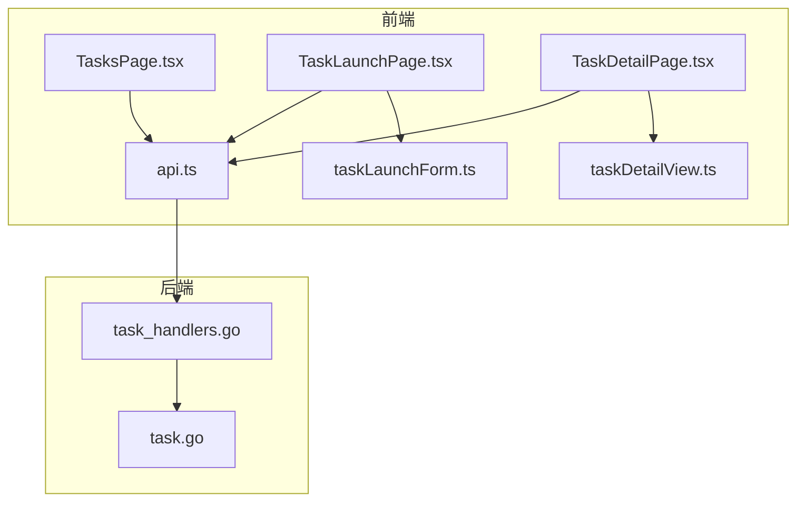
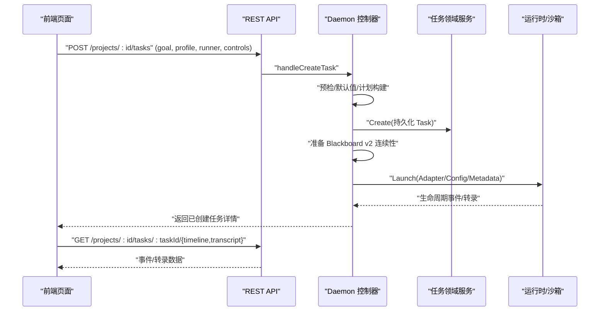
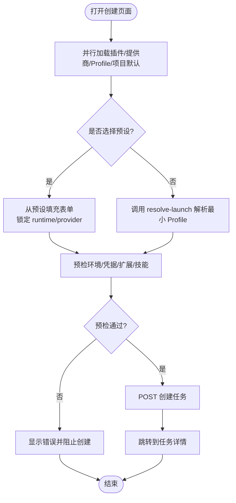
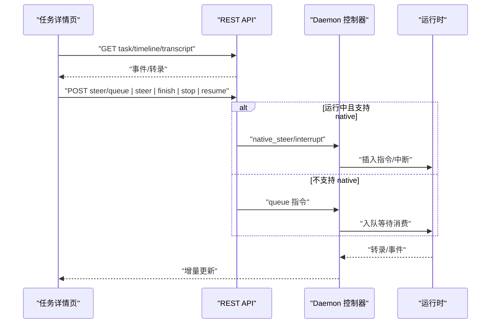
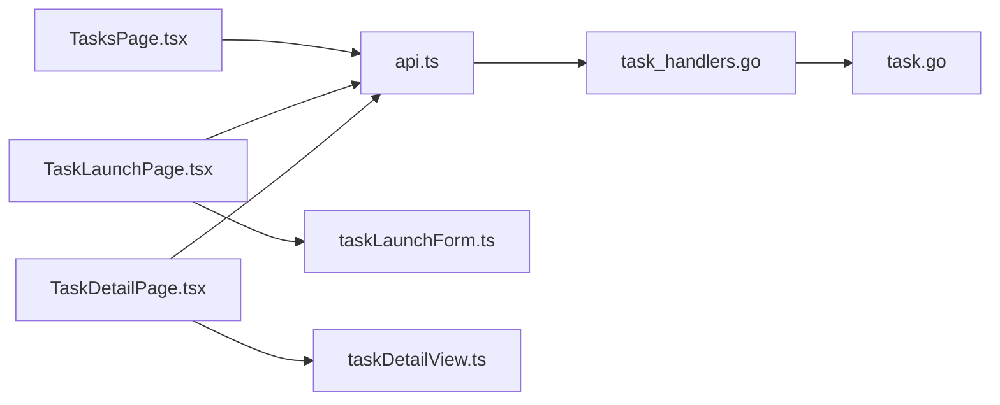

# 任务编排页面

<cite>
**本文引用的文件列表**
- [TasksPage.tsx](file://web/src/pages/TasksPage.tsx)
- [TaskLaunchPage.tsx](file://web/src/pages/TaskLaunchPage.tsx)
- [TaskDetailPage.tsx](file://web/src/pages/TaskDetailPage.tsx)
- [taskLaunchForm.ts](file://web/src/pages/taskLaunchForm.ts)
- [taskDetailView.ts](file://web/src/pages/taskDetailView.ts)
- [api.ts](file://web/src/lib/api.ts)
- [task_handlers.go](file://internal/daemon/task_handlers.go)
- [task.go](file://internal/task/task.go)
</cite>

## 目录
1. [简介](#简介)
2. [项目结构](#项目结构)
3. [核心组件](#核心组件)
4. [架构总览](#架构总览)
5. [详细组件分析](#详细组件分析)
6. [依赖关系分析](#依赖关系分析)
7. [性能与实时性](#性能与实时性)
8. [故障排查指南](#故障排查指南)
9. [结论](#结论)
10. [附录：API 契约与状态流转](#附录api-契约与状态流转)

## 简介
本文件面向“任务编排”相关的前端页面与后端控制面，系统性说明以下能力：
- 任务列表管理：列出、排序、状态与运行时活动展示。
- 任务创建向导：运行时代码选择、模型提供商与模型覆盖、推理强度、Runner 选择、预设配置、预检与技能预览。
- 任务详情查看：对话式交互、时间线视图、权限审批、停止/完成/删除、继续执行（Resume）、消息排队与原生中断。
- 生命周期与状态流转：任务与 Continuation 的状态定义、转换约束与可操作边界。
- 运行时选择与进度监控：插件能力、网络隔离、进程健康、轮询策略。
- 日志与错误诊断：事件流、转录摘要、失败根因提示。
- 参数配置、技能绑定与凭据管理：Profile 字段、MCP 服务器、扩展包、凭据注入与投影。
- 与运行时系统集成：Blackboard v2 启动头、可信 MCP、持久化会话、跨 Provider 切换策略。

## 项目结构
任务编排涉及前端页面、表单逻辑、类型定义以及后端的 HTTP 处理与领域服务。

图表来源
- [TasksPage.tsx:1-158](file://web/src/pages/TasksPage.tsx#L1-L158)
- [TaskLaunchPage.tsx:1-658](file://web/src/pages/TaskLaunchPage.tsx#L1-L658)
- [TaskDetailPage.tsx:1-800](file://web/src/pages/TaskDetailPage.tsx#L1-L800)
- [taskLaunchForm.ts:1-265](file://web/src/pages/taskLaunchForm.ts#L1-L265)
- [taskDetailView.ts:1-306](file://web/src/pages/taskDetailView.ts#L1-L306)
- [api.ts:1-535](file://web/src/lib/api.ts#L1-L535)
- [task_handlers.go:1-800](file://internal/daemon/task_handlers.go#L1-L800)
- [task.go:1-800](file://internal/task/task.go#L1-L800)

章节来源
- [TasksPage.tsx:1-158](file://web/src/pages/TasksPage.tsx#L1-L158)
- [TaskLaunchPage.tsx:1-658](file://web/src/pages/TaskLaunchPage.tsx#L1-L658)
- [TaskDetailPage.tsx:1-800](file://web/src/pages/TaskDetailPage.tsx#L1-L800)
- [taskLaunchForm.ts:1-265](file://web/src/pages/taskLaunchForm.ts#L1-L265)
- [taskDetailView.ts:1-306](file://web/src/pages/taskDetailView.ts#L1-L306)
- [api.ts:1-535](file://web/src/lib/api.ts#L1-L535)
- [task_handlers.go:1-800](file://internal/daemon/task_handlers.go#L1-L800)
- [task.go:1-800](file://internal/task/task.go#L1-L800)

## 核心组件
- 任务列表页：按项目维度拉取任务，轮询更新，显示状态徽章与运行时活动。
- 任务创建向导：加载插件、模型提供商、运行时 Profile；支持预设模式与自动解析；预检通过后创建任务并跳转详情。
- 任务详情页：双视图（对话/时间线），支持发送消息、队列指令、中断恢复、权限审批、停止/完成/删除、焦点模式。
- 表单与工具函数：模型选项推导、预设匹配、推理强度映射、Payload 构造。
- 类型与 API 客户端：统一请求封装、错误提取、领域类型定义。
- 后端任务处理：创建任务、构建 Launch Plan、Blackboard v2 连续性、Provider 会话绑定、启动与错误记录。
- 任务领域模型：状态、RunControls、RuntimeControls、Continuation、事件与转录。

章节来源
- [TasksPage.tsx:1-158](file://web/src/pages/TasksPage.tsx#L1-L158)
- [TaskLaunchPage.tsx:1-658](file://web/src/pages/TaskLaunchPage.tsx#L1-L658)
- [TaskDetailPage.tsx:1-800](file://web/src/pages/TaskDetailPage.tsx#L1-L800)
- [taskLaunchForm.ts:1-265](file://web/src/pages/taskLaunchForm.ts#L1-L265)
- [taskDetailView.ts:1-306](file://web/src/pages/taskDetailView.ts#L1-L306)
- [api.ts:1-535](file://web/src/lib/api.ts#L1-L535)
- [task_handlers.go:1-800](file://internal/daemon/task_handlers.go#L1-L800)
- [task.go:1-800](file://internal/task/task.go#L1-L800)

## 架构总览
任务编排由前端页面驱动，通过 REST API 与 Daemon 交互；Daemon 负责校验、投影、持久化与调度到具体 Runtime（容器或宿主机）。

图表来源
- [task_handlers.go:73-167](file://internal/daemon/task_handlers.go#L73-L167)
- [task_handlers.go:196-285](file://internal/daemon/task_handlers.go#L196-L285)
- [task.go:317-374](file://internal/task/task.go#L317-L374)
- [TaskLaunchPage.tsx:220-265](file://web/src/pages/TaskLaunchPage.tsx#L220-L265)
- [TaskDetailPage.tsx:55-96](file://web/src/pages/TaskDetailPage.tsx#L55-L96)

## 详细组件分析

### 任务列表管理（TasksPage）
- 功能要点
  - 按项目 ID 拉取任务列表，每 2 秒轮询一次以反映活跃任务的运行时活动。
  - 使用 AbortController 取消旧请求，避免竞态导致的数据覆盖。
  - 状态徽章根据状态映射图标与变体；运行时活动徽章区分 live/offline/orphaned/unknown。
  - 将 running 的任务置顶，其次按创建时间倒序。
- 关键实现路径
  - 列表获取与轮询：[TasksPage.tsx:30-61](file://web/src/pages/TasksPage.tsx#L30-L61)
  - 状态元信息与渲染：[TasksPage.tsx:9-23](file://web/src/pages/TasksPage.tsx#L9-L23)、[TasksPage.tsx:121-149](file://web/src/pages/TasksPage.tsx#L121-L149)
  - 排序逻辑：[TasksPage.tsx:151-157](file://web/src/pages/TasksPage.tsx#L151-L157)

章节来源
- [TasksPage.tsx:1-158](file://web/src/pages/TasksPage.tsx#L1-L158)

### 任务创建向导（TaskLaunchPage）
- 功能要点
  - 并行加载运行时插件、模型提供商、运行时 Profile 与项目默认值。
  - 支持两种模式：
    - 预设模式：锁定 runtime/provider，直接填充表单。
    - 自动解析模式：调用 resolve-launch 得到最小可用 Profile。
  - 预检：检查环境、凭据、扩展包、技能等，失败则阻止创建。
  - 安全开关：host runner 需要显式勾选确认；sandbox 可选网络模式。
  - 技能预览：根据当前 Profile 动态拉取启用的技能清单。
  - 提交：先 preflight，再创建任务，成功后跳转到任务详情。
- 关键实现路径
  - 初始化与数据加载：[TaskLaunchPage.tsx:97-128](file://web/src/pages/TaskLaunchPage.tsx#L97-L128)
  - 预设与表单联动：[TaskLaunchPage.tsx:180-218](file://web/src/pages/TaskLaunchPage.tsx#L180-L218)
  - 预检与创建流程：[TaskLaunchPage.tsx:220-265](file://web/src/pages/TaskLaunchPage.tsx#L220-L265)
  - 宿主 Runner 安全提示与禁用原因：[TaskLaunchPage.tsx:458-482](file://web/src/pages/TaskLaunchPage.tsx#L458-L482)、[TaskLaunchPage.tsx:567-590](file://web/src/pages/TaskLaunchPage.tsx#L567-L590)
  - 表单逻辑与 Payload 构造：[taskLaunchForm.ts:59-79](file://web/src/pages/taskLaunchForm.ts#L59-L79)、[taskLaunchForm.ts:159-182](file://web/src/pages/taskLaunchForm.ts#L159-L182)

图表来源
- [TaskLaunchPage.tsx:97-128](file://web/src/pages/TaskLaunchPage.tsx#L97-L128)
- [TaskLaunchPage.tsx:220-265](file://web/src/pages/TaskLaunchPage.tsx#L220-L265)
- [taskLaunchForm.ts:59-79](file://web/src/pages/taskLaunchForm.ts#L59-L79)

章节来源
- [TaskLaunchPage.tsx:1-658](file://web/src/pages/TaskLaunchPage.tsx#L1-L658)
- [taskLaunchForm.ts:1-265](file://web/src/pages/taskLaunchForm.ts#L1-L265)

### 任务详情查看（TaskDetailPage）
- 功能要点
  - 并发拉取任务、时间线、转录；在 active 状态下每秒轮询。
  - 双视图：对话（AgentTranscriptView）与时间线（结构化事件）。
  - 会话控制：
    - 原生直发/native interrupt：当运行时支持且处于运行中。
    - 队列消息：不可中断时排队等待。
    - 恢复并发送：非运行中且允许 resume。
    - 切换 Provider：若不在 Pi 的 projected set 内，需先 stop 再 resume。
  - 权限审批：提供“允许/拒绝”按钮响应 Provider 权限请求。
  - 生命周期操作：停止、完成（Finish）、删除（仅终态）。
  - 焦点模式：全屏沉浸查看。
- 关键实现路径
  - 初始加载与轮询：[TaskDetailPage.tsx:55-96](file://web/src/pages/TaskDetailPage.tsx#L55-L96)、[TaskDetailPage.tsx:143-148](file://web/src/pages/TaskDetailPage.tsx#L143-L148)
  - 发送消息路由与 Provider 切换：[TaskDetailPage.tsx:267-337](file://web/src/pages/TaskDetailPage.tsx#L267-L337)
  - 权限审批回调：[TaskDetailPage.tsx:345-359](file://web/src/pages/TaskDetailPage.tsx#L345-L359)
  - 停止/完成/删除：[TaskDetailPage.tsx:206-236](file://web/src/pages/TaskDetailPage.tsx#L206-L236)
  - 转录与时间线摘要逻辑：[taskDetailView.ts:1-306](file://web/src/pages/taskDetailView.ts#L1-L306)

图表来源
- [TaskDetailPage.tsx:267-337](file://web/src/pages/TaskDetailPage.tsx#L267-L337)
- [taskDetailView.ts:1-306](file://web/src/pages/taskDetailView.ts#L1-L306)

章节来源
- [TaskDetailPage.tsx:1-800](file://web/src/pages/TaskDetailPage.tsx#L1-L800)
- [taskDetailView.ts:1-306](file://web/src/pages/taskDetailView.ts#L1-L306)

### 表单与工具函数（taskLaunchForm）
- 功能要点
  - 限定可启动的运行时插件集合。
  - 模型选项推导：合并 catalog 手动/刷新列表，保留默认项优先。
  - 预设匹配与回退：根据 provider/model_override 精确匹配 Profile。
  - 推理强度映射：始终向服务端发送显式的 reasoning_effort。
  - 初始表单生成：基于项目默认与 Profile 字段智能填充。
- 关键实现路径
  - 可启动运行时过滤：[taskLaunchForm.ts:15-18](file://web/src/pages/taskLaunchForm.ts#L15-L18)
  - 模型选项推导：[taskLaunchForm.ts:33-46](file://web/src/pages/taskLaunchForm.ts#L33-L46)
  - 预设匹配与表单填充：[taskLaunchForm.ts:117-137](file://web/src/pages/taskLaunchForm.ts#L117-L137)、[taskLaunchForm.ts:143-157](file://web/src/pages/taskLaunchForm.ts#L143-L157)
  - 推理强度载荷：[taskLaunchForm.ts:178-182](file://web/src/pages/taskLaunchForm.ts#L178-L182)

章节来源
- [taskLaunchForm.ts:1-265](file://web/src/pages/taskLaunchForm.ts#L1-L265)

### 类型与 API 客户端（api.ts）
- 功能要点
  - 统一请求封装，自动附加 Bearer Token。
  - 错误提取：兼容 daemon 标准错误与 Blackboard v2 结构化错误。
  - 领域类型：Task、RuntimeControls、TaskEvent、TaskTranscriptEntry、PreflightResult 等。
- 关键实现路径
  - 请求封装与错误提取：[api.ts:20-39](file://web/src/lib/api.ts#L20-L39)、[api.ts:515-534](file://web/src/lib/api.ts#L515-L534)
  - 任务与运行时控制类型：[api.ts:347-467](file://web/src/lib/api.ts#L347-L467)

章节来源
- [api.ts:1-535](file://web/src/lib/api.ts#L1-L535)

### 后端任务处理（task_handlers.go）
- 功能要点
  - 创建任务：解析输入、应用默认值、预检、验证 Runner 激活、持久化 Task、构建 Launch Plan、后台启动。
  - Blackboard v2 连续性：Precommit/BindGrant 钩子、固定于启动时的投影集、清理敏感投影。
  - Provider 会话工厂：持久化会话绑定、初始 Turn Selection 设置、异常失败标记。
  - 宿主相对路径：Host runner 下避免绝对路径泄露 TaskID。
- 关键实现路径
  - 创建任务入口与预检：[task_handlers.go:73-167](file://internal/daemon/task_handlers.go#L73-L167)
  - 后台启动与生命周期日志：[task_handlers.go:196-285](file://internal/daemon/task_handlers.go#L196-L285)
  - Blackboard v2 连续性准备：[task_handlers.go:311-397](file://internal/daemon/task_handlers.go#L311-L397)
  - 固定字段合并与敏感信息清理：[task_handlers.go:399-421](file://internal/daemon/task_handlers.go#L399-L421)
  - Host 相对路径处理：[task_handlers.go:736-740](file://internal/daemon/task_handlers.go#L736-L740)

章节来源
- [task_handlers.go:1-800](file://internal/daemon/task_handlers.go#L1-L800)

### 任务领域模型（task.go）
- 功能要点
  - 状态枚举：pending、running、paused、completed、failed、stopped、interrupted。
  - RunControls：宿主激活、沙箱网络、备注、扩展参数。
  - RuntimeControls：原生恢复/转向能力、队列/中断可用性、Finish 门控、TurnSelection、Provider 权限请求等。
  - Continuation：每次运行时实例的生命周期与重连状态。
  - 事件系统：有序追加、去重与消费、配置版本化。
- 关键实现路径
  - 状态与常量：[task.go:31-42](file://internal/task/task.go#L31-L42)
  - RunControls/RuntimeControls：[task.go:44-160](file://internal/task/task.go#L44-L160)
  - Task/Continuation 结构：[task.go:100-118](file://internal/task/task.go#L100-L118)、[task.go:201-218](file://internal/task/task.go#L201-L218)
  - 事件追加与顺序保证：[task.go:481-551](file://internal/task/task.go#L481-L551)
  - 配置版本与 Continuation 启动事务：[task.go:629-767](file://internal/task/task.go#L629-L767)

章节来源
- [task.go:1-800](file://internal/task/task.go#L1-L800)

## 依赖关系分析
- 前端模块耦合
  - 页面层依赖 api.ts 的类型与请求方法。
  - 创建页依赖 taskLaunchForm.ts 的表单逻辑与 Payload 构造。
  - 详情页依赖 taskDetailView.ts 的事件摘要与转录标题生成。
- 前后端契约
  - 任务创建/查询/控制接口与 Task/RuntimeControls/PreflightResult 等类型严格对齐。
  - 错误格式兼容 daemon 标准与 Blackboard v2 结构化错误。
- 后端内部依赖
  - Daemon 控制器依赖 task 领域服务、runtimeprofile、skill、modelprovider、blackboardv2 连续性、runner 适配器等。
  - 任务领域服务依赖 store 与 project 服务（用于 scope 快照）。

图表来源
- [TasksPage.tsx:1-158](file://web/src/pages/TasksPage.tsx#L1-L158)
- [TaskLaunchPage.tsx:1-658](file://web/src/pages/TaskLaunchPage.tsx#L1-L658)
- [TaskDetailPage.tsx:1-800](file://web/src/pages/TaskDetailPage.tsx#L1-L800)
- [taskLaunchForm.ts:1-265](file://web/src/pages/taskLaunchForm.ts#L1-L265)
- [taskDetailView.ts:1-306](file://web/src/pages/taskDetailView.ts#L1-L306)
- [api.ts:1-535](file://web/src/lib/api.ts#L1-L535)
- [task_handlers.go:1-800](file://internal/daemon/task_handlers.go#L1-L800)
- [task.go:1-800](file://internal/task/task.go#L1-L800)

章节来源
- [TasksPage.tsx:1-158](file://web/src/pages/TasksPage.tsx#L1-L158)
- [TaskLaunchPage.tsx:1-658](file://web/src/pages/TaskLaunchPage.tsx#L1-L658)
- [TaskDetailPage.tsx:1-800](file://web/src/pages/TaskDetailPage.tsx#L1-L800)
- [taskLaunchForm.ts:1-265](file://web/src/pages/taskLaunchForm.ts#L1-L265)
- [taskDetailView.ts:1-306](file://web/src/pages/taskDetailView.ts#L1-L306)
- [api.ts:1-535](file://web/src/lib/api.ts#L1-L535)
- [task_handlers.go:1-800](file://internal/daemon/task_handlers.go#L1-L800)
- [task.go:1-800](file://internal/task/task.go#L1-L800)

## 性能与实时性
- 轮询策略
  - 任务列表页每 2 秒轮询，仅在存在活跃任务时提升感知度。
  - 任务详情页在 running/paused 状态下每秒轮询，其他状态停止轮询。
- 请求去重与竞态保护
  - 使用 AbortController 与 generation 计数器防止慢请求覆盖新数据。
- 滚动与自动跟随
  - 对话区监听滚动位置，接近底部时自动跟随最新内容。
- 资源优化
  - 按需加载：仅在需要时拉取 skills 预览与运行时插件/提供商列表。
  - 文本摘要：时间线条目对冗长 JSON 进行摘要，减少渲染开销。

章节来源
- [TasksPage.tsx:30-61](file://web/src/pages/TasksPage.tsx#L30-L61)
- [TaskDetailPage.tsx:143-148](file://web/src/pages/TaskDetailPage.tsx#L143-L148)
- [taskDetailView.ts:1-306](file://web/src/pages/taskDetailView.ts#L1-L306)

## 故障排查指南
- 常见错误来源
  - 预检失败：环境缺失、凭据未配置、扩展包不可用、技能不匹配。
  - 宿主 Runner 未激活：必须显式勾选确认。
  - Provider 切换受限：Pi 的 projected set 不包含目标 Provider 时需 restart。
  - 权限审批阻塞：需在 UI 上响应 allow/deny。
- 定位步骤
  - 查看预检结果卡片中的 checks 明细与 model_provider 信息。
  - 在任务详情页的时间线中查看 lifecycle/steering/runtime_output 事件。
  - 关注 RuntimeActivity 的 liveness/turn_activity/warning 字段。
  - 对于黑屏或无输出，检查 sandbox_network 与宿主代理配置。
- 建议
  - 使用“队列消息”而非强制中断，避免丢失用户指令。
  - 在切换 Provider 前确认 projected_model_provider_ids 是否包含目标。
  - 对 host runner 谨慎启用，确保命令执行范围受控。

章节来源
- [TaskLaunchPage.tsx:458-590](file://web/src/pages/TaskLaunchPage.tsx#L458-L590)
- [TaskDetailPage.tsx:267-337](file://web/src/pages/TaskDetailPage.tsx#L267-L337)
- [task.go:132-160](file://internal/task/task.go#L132-L160)

## 结论
任务编排页面围绕“创建—运行—观察—干预”的主循环展开，通过严格的预检、清晰的权限审批、稳健的轮询与摘要机制，为渗透测试代理提供了直观而强大的控制面。后端以 Blackboard v2 连续性为核心，结合 Provider 会话工厂与 Runner 抽象，实现了跨运行时的一致体验与安全边界。

## 附录：API 契约与状态流转

### 任务状态与流转
- 状态定义
  - pending、running、paused、completed、failed、stopped、interrupted
- 典型流转
  - 创建 → pending → running → completed/stopped/failed/interrupted
  - running → paused（暂停）→ resumed → running
  - failed/stopped/interrupted → 可删除（终态）
- 可操作门控
  - Finish：仅当 Runtime Activity 为 live 且 idle 时可用。
  - Resume：非运行中或支持 native_resume_available。
  - Delete：仅终态可删。

章节来源
- [task.go:31-42](file://internal/task/task.go#L31-L42)
- [task.go:132-160](file://internal/task/task.go#L132-L160)
- [TaskDetailPage.tsx:206-236](file://web/src/pages/TaskDetailPage.tsx#L206-L236)

### 运行时选择与集成
- 插件能力
  - sandbox/host、mcp_config、streaming_transcript、resume 等能力声明。
- 模型提供商
  - 支持多协议与端点，catalog 提供模型清单与默认模型。
- 凭据与投影
  - 凭据材料化、环境变量注入、MCP 服务器配置、扩展包投影。
- Blackboard v2 启动头
  - 包含 runner、scope/blackboard 路径、schema/revision，供运行时上下文使用。

章节来源
- [api.ts:230-278](file://web/src/lib/api.ts#L230-L278)
- [api.ts:154-178](file://web/src/lib/api.ts#L154-L178)
- [task_handlers.go:311-397](file://internal/daemon/task_handlers.go#L311-L397)