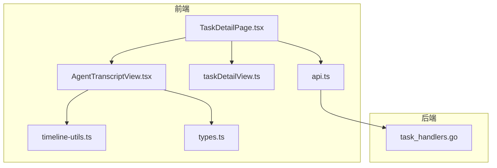
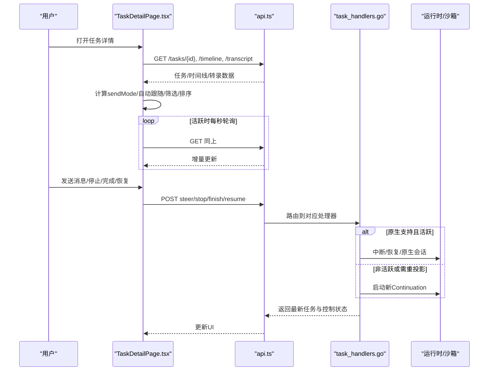
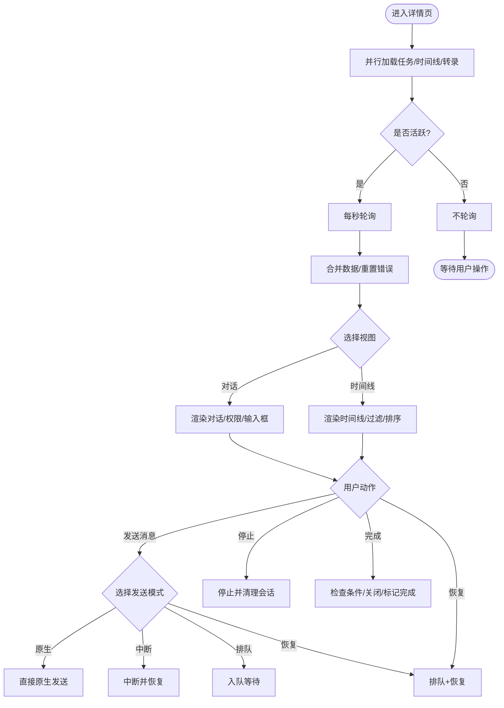
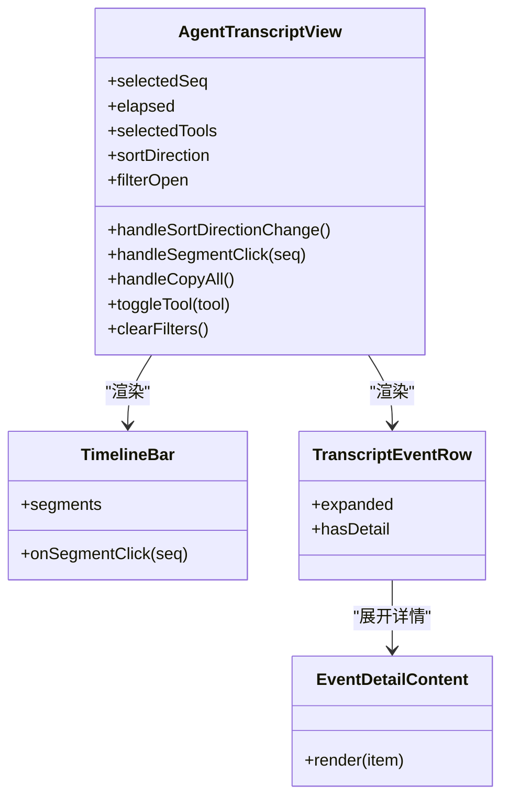
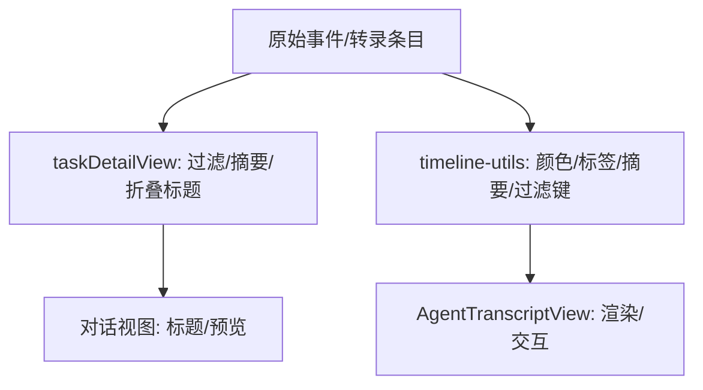
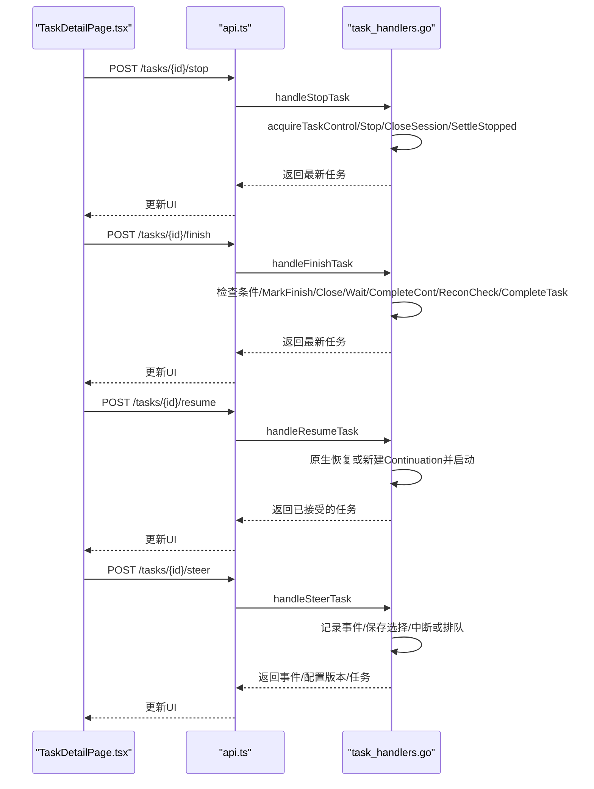
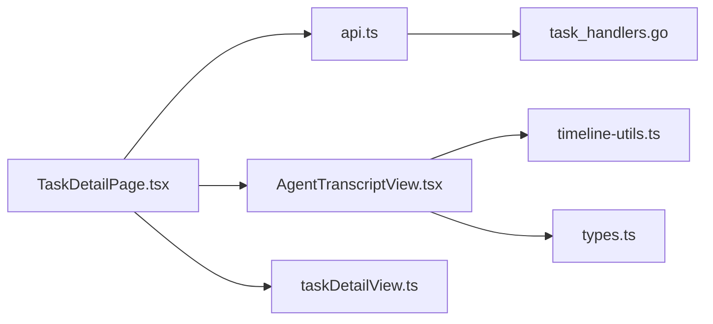

# 任务详情查看

<cite>
**本文引用的文件**   
- [TaskDetailPage.tsx](file://web/src/pages/TaskDetailPage.tsx)
- [AgentTranscriptView.tsx](file://web/src/components/task-transcript/AgentTranscriptView.tsx)
- [timeline-utils.ts](file://web/src/components/task-transcript/timeline-utils.ts)
- [taskDetailView.ts](file://web/src/pages/taskDetailView.ts)
- [types.ts](file://web/src/components/task-transcript/types.ts)
- [api.ts](file://web/src/lib/api.ts)
- [task_handlers.go](file://internal/daemon/task_handlers.go)
</cite>

## 目录
1. [简介](#简介)
2. [项目结构](#项目结构)
3. [核心组件](#核心组件)
4. [架构总览](#架构总览)
5. [详细组件分析](#详细组件分析)
6. [依赖关系分析](#依赖关系分析)
7. [性能考虑](#性能考虑)
8. [故障排查指南](#故障排查指南)
9. [结论](#结论)
10. [附录](#附录)

## 简介
本文件面向“任务详情查看”页面，系统性说明任务状态监控、实时状态更新、进度指示器与活动日志显示的实现；深入解析转录视图（AI代理对话记录、工具调用历史与执行轨迹可视化）；解释任务控制操作（暂停、停止、重启/恢复）的前端交互与后端API集成；并给出错误诊断信息展示、调试工具集成、任务元数据展示格式与可访问性设计要点，以及性能监控与资源使用可视化的建议方案。

## 项目结构
任务详情查看由前端页面与转录视图组件构成，并通过HTTP API与后端守护进程通信。关键文件组织如下：
- 页面层：任务详情页负责状态轮询、视图切换、控制面板与消息发送路由。
- 转录视图：时间线事件聚合、过滤、排序与可视化。
- 类型与工具：统一的数据结构与格式化/摘要逻辑。
- API客户端：类型化请求封装与错误提取。
- 后端处理：任务生命周期控制、转写/时间线数据提供、权限与原生会话控制。

图表来源
- [TaskDetailPage.tsx:1-120](file://web/src/pages/TaskDetailPage.tsx#L1-L120)
- [AgentTranscriptView.tsx:1-120](file://web/src/components/task-transcript/AgentTranscriptView.tsx#L1-L120)
- [timeline-utils.ts:1-136](file://web/src/components/task-transcript/timeline-utils.ts#L1-L136)
- [taskDetailView.ts:1-120](file://web/src/pages/taskDetailView.ts#L1-L120)
- [types.ts:1-16](file://web/src/components/task-transcript/types.ts#L1-L16)
- [api.ts:1-120](file://web/src/lib/api.ts#L1-L120)
- [task_handlers.go:1468-1700](file://internal/daemon/task_handlers.go#L1468-L1700)

章节来源
- [TaskDetailPage.tsx:1-120](file://web/src/pages/TaskDetailPage.tsx#L1-L120)
- [AgentTranscriptView.tsx:1-120](file://web/src/components/task-transcript/AgentTranscriptView.tsx#L1-L120)
- [api.ts:1-120](file://web/src/lib/api.ts#L1-L120)
- [task_handlers.go:1468-1700](file://internal/daemon/task_handlers.go#L1468-L1700)

## 核心组件
- 任务详情页（TaskDetailPage）
  - 负责加载任务、时间线与转录数据，维护活跃视图（对话/时间线）、自动跟随滚动、轮询刷新、模型选择与推理强度设置、权限审批、消息发送策略（原生/中断/排队/恢复）。
- 转录视图（AgentTranscriptView）
  - 渲染时间线事件条、事件行、展开详情、工具过滤、排序方向、复制摘要、运行时长与统计。
- 工具与类型（timeline-utils / types / taskDetailView）
  - 事件颜色/标签/摘要、路径缩短、过滤键生成、持续时间/耗时格式化、转录标题折叠与工具参数扁平化。
- API客户端（api.ts）
  - 统一的GET/POST/DELETE封装、鉴权头注入、结构化错误提取、领域类型定义（Task/RuntimeControls/Transcript/Timeline等）。
- 后端控制（task_handlers.go）
  - 停止/完成/恢复/引导（steer）等接口实现，含并发控制、提供者会话管理、原生会话恢复、配置投影与持久化。

章节来源
- [TaskDetailPage.tsx:23-120](file://web/src/pages/TaskDetailPage.tsx#L23-L120)
- [AgentTranscriptView.tsx:40-120](file://web/src/components/task-transcript/AgentTranscriptView.tsx#L40-L120)
- [timeline-utils.ts:1-136](file://web/src/components/task-transcript/timeline-utils.ts#L1-L136)
- [taskDetailView.ts:1-120](file://web/src/pages/taskDetailView.ts#L1-L120)
- [types.ts:1-16](file://web/src/components/task-transcript/types.ts#L1-L16)
- [api.ts:200-535](file://web/src/lib/api.ts#L200-L535)
- [task_handlers.go:1815-2014](file://internal/daemon/task_handlers.go#L1815-L2014)

## 架构总览
任务详情查看采用“前端轮询 + 后端受控执行”的架构。前端每1秒轮询任务详情、时间线与转录，结合运行时活动与RuntimeControls决定UI行为；用户操作通过REST API触发后端控制流程，包括停止、完成、恢复与引导（steer），并在必要时进行原生会话恢复或配置重投影。

图表来源
- [TaskDetailPage.tsx:140-170](file://web/src/pages/TaskDetailPage.tsx#L140-L170)
- [api.ts:83-97](file://web/src/lib/api.ts#L83-L97)
- [task_handlers.go:1468-1700](file://internal/daemon/task_handlers.go#L1468-L1700)
- [task_handlers.go:1815-2014](file://internal/daemon/task_handlers.go#L1815-L2014)
- [task_handlers.go:2175-2400](file://internal/daemon/task_handlers.go#L2175-L2400)

## 详细组件分析

### 任务详情页（TaskDetailPage）
- 实时状态与轮询
  - 当任务处于活跃状态（running/paused）时，每秒轮询任务详情、时间线与转录，并使用单调递增的loadGeneration与AbortController避免竞态覆盖。
- 视图与滚动
  - 支持“对话/时间线”双视图切换；对话视图具备自动跟随与手动置顶/置底能力，基于滚动位置阈值动态切换autoFollow。
- 模型与推理强度
  - 根据当前运行时插件与全局模型提供商列表，动态计算可选模型与推理强度；在Provider切换场景下，若不支持原生跨Provider，则走“排队+停止+恢复”的流程。
- 控制操作
  - 停止：调用停止接口，等待运行时退出并清理提供者会话，最终落盘stopped状态。
  - 完成：仅在运行时live+idle时允许，先标记Finish意图、关闭会话、等待退出，再唯一地标记Continuation为completed并校验重同步标记后，将Task标记为completed。
  - 恢复：优先尝试原生会话恢复，否则从任务上下文重建Continuation并启动。
- 引导（Steer）
  - 根据当前状态与能力选择native/interrupt/queue/resume四种模式；对Provider变更进行安全判断，必要时走重投影与重启。
- 权限审批
  - 展示Provider权限请求，支持Allow/Deny响应，并携带幂等request_id。

图表来源
- [TaskDetailPage.tsx:55-96](file://web/src/pages/TaskDetailPage.tsx#L55-L96)
- [TaskDetailPage.tsx:140-170](file://web/src/pages/TaskDetailPage.tsx#L140-L170)
- [TaskDetailPage.tsx:206-337](file://web/src/pages/TaskDetailPage.tsx#L206-L337)
- [TaskDetailPage.tsx:433-458](file://web/src/pages/TaskDetailPage.tsx#L433-L458)

章节来源
- [TaskDetailPage.tsx:23-120](file://web/src/pages/TaskDetailPage.tsx#L23-L120)
- [TaskDetailPage.tsx:140-170](file://web/src/pages/TaskDetailPage.tsx#L140-L170)
- [TaskDetailPage.tsx:206-337](file://web/src/pages/TaskDetailPage.tsx#L206-L337)
- [TaskDetailPage.tsx:433-458](file://web/src/pages/TaskDetailPage.tsx#L433-L458)

### 转录视图（AgentTranscriptView）
- 事件聚合与可视化
  - 顶部显示Agent名称、状态徽章、运行时长、工具调用计数、事件总数与创建时间；中间为按颜色分段的TimelineBar，点击跳转至对应事件。
- 过滤与排序
  - 支持按工具名与事件类型过滤，支持“最早/最新”排序；过滤选项动态构建，支持一键清空。
- 事件行与详情
  - 每条事件包含类型标签、摘要、序号与时间戳；支持展开查看tool_use/tool_result/thinking/text/error详细内容，超长输出截断显示。
- 可访问性与体验
  - 使用aria-label/title提升无障碍体验；尊重prefers-reduced-motion减少动画；内容可见性优化（contain-intrinsic-size/content-visibility）提升长列表性能。

图表来源
- [AgentTranscriptView.tsx:40-120](file://web/src/components/task-transcript/AgentTranscriptView.tsx#L40-L120)
- [AgentTranscriptView.tsx:341-401](file://web/src/components/task-transcript/AgentTranscriptView.tsx#L341-L401)
- [AgentTranscriptView.tsx:403-528](file://web/src/components/task-transcript/AgentTranscriptView.tsx#L403-L528)

章节来源
- [AgentTranscriptView.tsx:40-120](file://web/src/components/task-transcript/AgentTranscriptView.tsx#L40-L120)
- [AgentTranscriptView.tsx:341-401](file://web/src/components/task-transcript/AgentTranscriptView.tsx#L341-L401)
- [AgentTranscriptView.tsx:403-528](file://web/src/components/task-transcript/AgentTranscriptView.tsx#L403-L528)

### 工具与类型（timeline-utils / types / taskDetailView）
- timeline-utils
  - 事件颜色映射、标签/摘要生成、路径缩短、过滤键与选项构建、持续时长/耗时格式化。
- types
  - 统一TimelineItem类型、排序方向与事件颜色枚举。
- taskDetailView
  - 时间线事件过滤规则（仅工具流的事件不在时间线中显示）、事件摘要与转录标题折叠、工具参数扁平化为可读字段（代码类字段以块形式展示）。

图表来源
- [timeline-utils.ts:1-136](file://web/src/components/task-transcript/timeline-utils.ts#L1-L136)
- [types.ts:1-16](file://web/src/components/task-transcript/types.ts#L1-L16)
- [taskDetailView.ts:1-120](file://web/src/pages/taskDetailView.ts#L1-L120)

章节来源
- [timeline-utils.ts:1-136](file://web/src/components/task-transcript/timeline-utils.ts#L1-L136)
- [types.ts:1-16](file://web/src/components/task-transcript/types.ts#L1-L16)
- [taskDetailView.ts:1-120](file://web/src/pages/taskDetailView.ts#L1-L120)

### API与后端集成
- API客户端
  - 统一封装GET/POST/PUT/PATCH/DELETE，自动注入Authorization头，解析结构化错误体（含code/message/path），抛出ApiError供上层捕获。
- 任务控制接口
  - 停止：确保独占控制、停止运行时、关闭提供者会话、落盘stopped状态。
  - 完成：严格前置条件（live+idle）、标记Finish意图、关闭会话、等待退出、唯一地标记Continuation completed并校验重同步标记、最后标记Task completed。
  - 恢复：优先原生会话恢复，否则准备新Continuation并启动。
  - 引导：支持native/interrupt/queue三种模式，记录事件与配置版本，必要时中断并恢复。

图表来源
- [api.ts:83-97](file://web/src/lib/api.ts#L83-L97)
- [task_handlers.go:1468-1700](file://internal/daemon/task_handlers.go#L1468-L1700)
- [task_handlers.go:1815-2014](file://internal/daemon/task_handlers.go#L1815-L2014)
- [task_handlers.go:2175-2400](file://internal/daemon/task_handlers.go#L2175-L2400)

章节来源
- [api.ts:83-97](file://web/src/lib/api.ts#L83-L97)
- [task_handlers.go:1468-1700](file://internal/daemon/task_handlers.go#L1468-L1700)
- [task_handlers.go:1815-2014](file://internal/daemon/task_handlers.go#L1815-L2014)
- [task_handlers.go:2175-2400](file://internal/daemon/task_handlers.go#L2175-L2400)

## 依赖关系分析
- 前端内部依赖
  - TaskDetailPage依赖api.ts获取数据与发起控制请求；依赖AgentTranscriptView渲染时间线；依赖taskDetailView进行转录标题与事件摘要；依赖timeline-utils进行事件样式与过滤。
- 前后端契约
  - api.ts中的类型定义与后端Go结构保持一致（Task/RuntimeControls/Transcript/Timeline等），确保强类型对接。
- 并发与一致性
  - 前端使用loadGeneration与AbortController保证轮询结果不被旧请求覆盖；后端通过acquireTaskControl串行化控制操作，避免竞态。

图表来源
- [TaskDetailPage.tsx:1-120](file://web/src/pages/TaskDetailPage.tsx#L1-L120)
- [AgentTranscriptView.tsx:1-120](file://web/src/components/task-transcript/AgentTranscriptView.tsx#L1-L120)
- [timeline-utils.ts:1-136](file://web/src/components/task-transcript/timeline-utils.ts#L1-L136)
- [taskDetailView.ts:1-120](file://web/src/pages/taskDetailView.ts#L1-L120)
- [api.ts:1-120](file://web/src/lib/api.ts#L1-L120)
- [task_handlers.go:1468-1700](file://internal/daemon/task_handlers.go#L1468-L1700)

章节来源
- [TaskDetailPage.tsx:1-120](file://web/src/pages/TaskDetailPage.tsx#L1-L120)
- [api.ts:1-120](file://web/src/lib/api.ts#L1-L120)
- [task_handlers.go:1468-1700](file://internal/daemon/task_handlers.go#L1468-L1700)

## 性能考虑
- 前端
  - 使用content-visibility与contain-intrinsic-size优化长列表渲染；按需展开详情避免一次性渲染大文本；尊重prefers-reduced-motion减少动画开销。
  - 轮询节流：仅在活跃状态下启用1s轮询，非活跃时停止，降低网络与CPU压力。
  - 去抖与幂等：发送消息前生成request_id，避免重复提交；AbortController取消过期请求。
- 后端
  - 控制操作加锁串行化，避免并发冲突；Finish路径严格校验重同步标记，防止不一致状态。
  - 原生会话优先恢复，减少不必要的重启成本。

[本节为通用性能建议，无需特定文件引用]

## 故障排查指南
- 常见错误来源
  - API错误：ApiError携带status与结构化body，前端extractErrorMessage会提取code/message/path用于友好提示。
  - 控制冲突：后端可能返回“任务控制操作已在进行中”、“运行时未在规定时间内停止”、“提供者会话未关闭”等错误。
  - 条件拒绝：完成操作需要live+idle，否则返回冲突错误。
- 定位步骤
  - 查看任务runtime_activity与runtime_controls字段，确认liveness/turn_activity与可用能力。
  - 检查时间线事件中的lifecycle/steering事件，定位中断/恢复/失败阶段。
  - 关注转录中的error条目与tool_result输出，快速定位问题根因。
  - 对于Provider权限请求，及时Allow/Deny以避免阻塞。

章节来源
- [api.ts:515-535](file://web/src/lib/api.ts#L515-L535)
- [task_handlers.go:1574-1700](file://internal/daemon/task_handlers.go#L1574-L1700)
- [task_handlers.go:2175-2400](file://internal/daemon/task_handlers.go#L2175-L2400)

## 结论
任务详情查看页面通过稳健的轮询机制、清晰的视图分层与完善的控制流程，提供了直观的任务状态监控与交互式调试能力。转录视图将复杂的执行轨迹转化为可读的时间线，配合过滤与排序显著提升排障效率。后端在并发控制、原生会话恢复与重同步校验方面保证了状态一致性与安全性。建议在后续迭代中引入WebSocket/SSE替代轮询，进一步提升实时性与资源利用率。

[本节为总结性内容，无需特定文件引用]

## 附录

### 任务元数据展示与可访问性
- 元数据展示
  - 头部显示任务目标、状态徽章、运行时活动、continuation编号、运行时与runner、continuation状态、原生会话捕获标志、same_runtime_provider_only限制等。
  - 转录视图顶部显示runner、profile名称、运行时长、工具调用数、事件总数与创建时间。
- 可访问性
  - 按钮与控件提供aria-label/title；键盘Enter快捷发送；尊重系统偏好减少动画；语义化标签与分组便于屏幕阅读器理解。

章节来源
- [TaskDetailPage.tsx:460-519](file://web/src/pages/TaskDetailPage.tsx#L460-L519)
- [AgentTranscriptView.tsx:151-245](file://web/src/components/task-transcript/AgentTranscriptView.tsx#L151-L245)

### 错误诊断信息与调试工具集成
- 错误信息
  - 前端集中提取结构化错误码与路径，便于快速定位；对话框与Toast提示用户操作结果。
- 调试辅助
  - 时间线事件与转录条目可作为排障线索；支持复制全部或过滤后的摘要，便于粘贴到工单或聊天工具。
  - Provider权限请求面板可直接Allow/Deny，避免阻塞流程。

章节来源
- [api.ts:515-535](file://web/src/lib/api.ts#L515-L535)
- [AgentTranscriptView.tsx:100-120](file://web/src/components/task-transcript/AgentTranscriptView.tsx#L100-L120)
- [TaskDetailPage.tsx:730-775](file://web/src/pages/TaskDetailPage.tsx#L730-L775)

### 性能监控与资源使用可视化方案（建议）
- 指标采集
  - 前端：页面加载时间、轮询间隔、网络请求耗时、渲染帧率、内存占用估算。
  - 后端：任务生命周期耗时、停止/完成/恢复成功率、原生会话恢复命中率、重同步延迟。
- 可视化呈现
  - 在任务详情页增加“性能”标签页，展示关键指标趋势图与告警阈值；在转录视图中嵌入耗时标注（如tool_use→tool_result耗时）。
- 集成方式
  - 通过独立API拉取性能快照，或使用浏览器Performance API与后端Prometheus/Grafana集成。

[本节为概念性建议，无需特定文件引用]