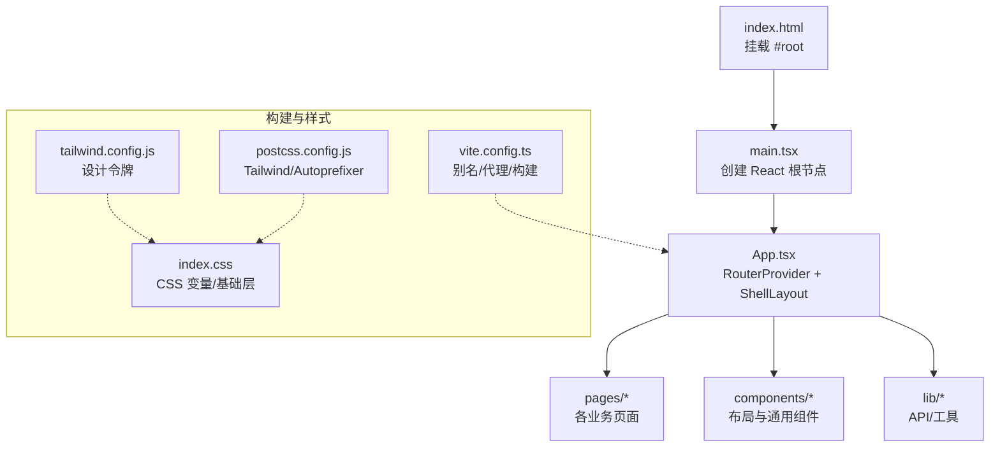
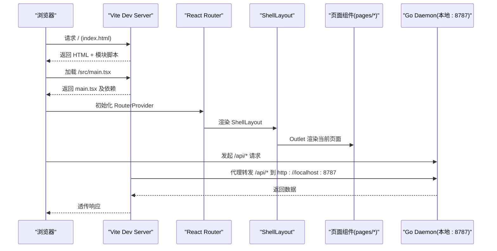
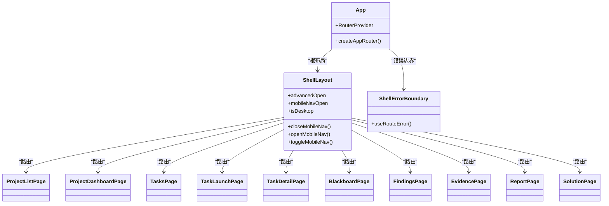
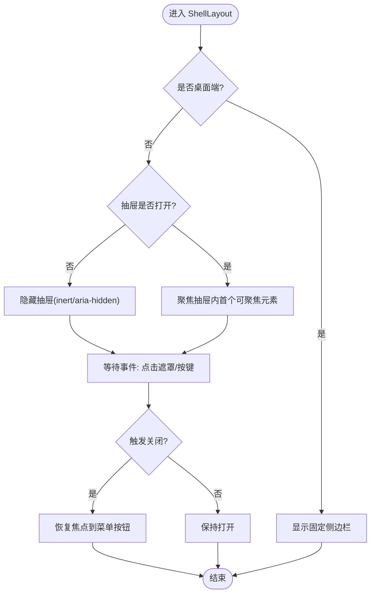
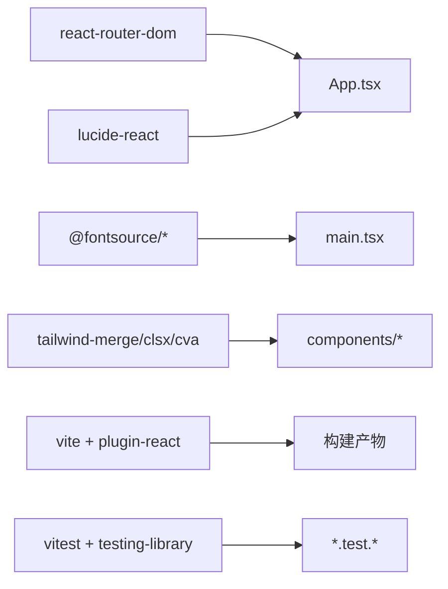

# 应用架构与路由

<cite>
**本文引用的文件**   
- [web/src/main.tsx](file://web/src/main.tsx)
- [web/src/App.tsx](file://web/src/App.tsx)
- [web/vite.config.ts](file://web/vite.config.ts)
- [web/tsconfig.json](file://web/tsconfig.json)
- [web/index.html](file://web/index.html)
- [web/postcss.config.js](file://web/postcss.config.js)
- [web/tailwind.config.js](file://web/tailwind.config.js)
- [web/src/index.css](file://web/src/index.css)
- [web/src/components/ThemeProvider.tsx](file://web/src/components/ThemeProvider.tsx)
- [web/src/components/ProjectPageShell.tsx](file://web/src/components/ProjectPageShell.tsx)
</cite>

## 目录
1. [简介](#简介)
2. [项目结构](#项目结构)
3. [核心组件](#核心组件)
4. [架构总览](#架构总览)
5. [详细组件分析](#详细组件分析)
6. [依赖分析](#依赖分析)
7. [性能考虑](#性能考虑)
8. [故障排查指南](#故障排查指南)
9. [结论](#结论)
10. [附录](#附录)

## 简介
本文件面向 CyberPenda 前端（React + TypeScript + Vite）的 Web 应用，聚焦整体架构、入口点、路由配置、布局与错误边界、响应式 ShellLayout、移动端导航抽屉与可访问性支持，以及 Vite 构建、模块别名与开发环境设置。文档同时提供前端项目结构与最佳实践建议，帮助读者快速理解并高效扩展该 Dashboard。

## 项目结构
前端位于 web 子目录，采用功能与页面分层组织：
- src/main.tsx：应用启动与根渲染
- src/App.tsx：全局布局、路由定义、错误边界与主题切换入口
- src/pages/*：按业务域划分的页面组件
- src/components/*：通用 UI 与布局组件（如 ProjectPageShell、ThemeProvider）
- src/lib/*：API 客户端、工具函数等
- index.html：HTML 模板与入口脚本挂载点
- vite.config.ts：Vite 插件、别名、开发代理与构建输出
- tailwind.config.js / postcss.config.js / index.css：样式系统与主题变量
- tsconfig.json：TypeScript 多项目引用

图表来源
- [web/index.html:1-16](file://web/index.html#L1-L16)
- [web/src/main.tsx:1-20](file://web/src/main.tsx#L1-L20)
- [web/src/App.tsx:1-350](file://web/src/App.tsx#L1-L350)
- [web/vite.config.ts:1-25](file://web/vite.config.ts#L1-L25)
- [web/tailwind.config.js:1-92](file://web/tailwind.config.js#L1-L92)
- [web/postcss.config.js:1-6](file://web/postcss.config.js#L1-L6)
- [web/src/index.css:1-60](file://web/src/index.css#L1-L60)

章节来源
- [web/index.html:1-16](file://web/index.html#L1-L16)
- [web/src/main.tsx:1-20](file://web/src/main.tsx#L1-L20)
- [web/src/App.tsx:1-350](file://web/src/App.tsx#L1-L350)
- [web/vite.config.ts:1-25](file://web/vite.config.ts#L1-L25)
- [web/tailwind.config.js:1-92](file://web/tailwind.config.js#L1-L92)
- [web/postcss.config.js:1-6](file://web/postcss.config.js#L1-L6)
- [web/src/index.css:1-60](file://web/src/index.css#L1-L60)

## 核心组件
- 应用入口 main.tsx
  - 使用 createRoot 挂载到 #root
  - 包裹 StrictMode 与 ThemeProvider，确保主题上下文在整棵树上可用
- 全局布局与路由 App.tsx
  - 通过 createBrowserRouter 声明路由树
  - 顶层 ShellLayout 作为所有页面的外壳，包含侧边栏、顶部栏与主内容区
  - 提供 ShellErrorBoundary 捕获路由级错误
  - useIsDesktopMd 基于 matchMedia 判断桌面端断点
- 主题系统 components/ThemeProvider.tsx
  - 提供 ThemeProvider 与 ThemeToggle
  - 监听系统主题变化并在 localStorage 中持久化用户选择
  - 通过给 <html> 添加 .dark 类实现暗色模式
- 项目页壳 components/ProjectPageShell.tsx
  - 统一的项目内页面容器，固定“返回全部项目”与项目导航区域
  - 可选头部标题、描述与操作按钮，承载页面主体内容

章节来源
- [web/src/main.tsx:1-20](file://web/src/main.tsx#L1-L20)
- [web/src/App.tsx:1-350](file://web/src/App.tsx#L1-L350)
- [web/src/components/ThemeProvider.tsx:1-87](file://web/src/components/ThemeProvider.tsx#L1-L87)
- [web/src/components/ProjectPageShell.tsx:1-83](file://web/src/components/ProjectPageShell.tsx#L1-L83)

## 架构总览
下图展示从 HTML 到 React 路由与布局的加载流程，以及开发期对后端 API 的代理转发。

图表来源
- [web/index.html:1-16](file://web/index.html#L1-L16)
- [web/src/main.tsx:1-20](file://web/src/main.tsx#L1-L20)
- [web/src/App.tsx:1-350](file://web/src/App.tsx#L1-L350)
- [web/vite.config.ts:1-25](file://web/vite.config.ts#L1-L25)

## 详细组件分析

### 入口与主题注入（main.tsx）
- 职责
  - 创建 React 根节点并挂载到 #root
  - 引入字体与全局样式
  - 以 ThemeProvider 包裹 App，使主题状态全局可用
- 关键点
  - 使用 StrictMode 提升开发体验
  - 将主题上下文置于路由之上，保证所有页面均可读取/切换主题

章节来源
- [web/src/main.tsx:1-20](file://web/src/main.tsx#L1-L20)
- [web/src/components/ThemeProvider.tsx:1-87](file://web/src/components/ThemeProvider.tsx#L1-L87)

### 全局布局与路由（App.tsx）
- 路由树
  - 根布局为 ShellLayout，其下挂载多个页面路由，包括项目列表、任务、黑板、报告等
  - 使用嵌套路由与参数路径（如 /projects/:projectId/tasks/:taskId）
- 错误边界
  - ShellErrorBoundary 使用 useRouteError 获取路由级错误信息并友好展示
- 响应式与可访问性
  - useIsDesktopMd 基于 min-width: 768px 断点判断桌面端
  - 移动端抽屉导航具备键盘 Escape 关闭、焦点管理、aria-expanded/aria-controls/inert/sr-only 等无障碍属性
  - 提供“跳转到主内容”的快捷链接，便于键盘用户快速定位

图表来源
- [web/src/App.tsx:1-350](file://web/src/App.tsx#L1-L350)

章节来源
- [web/src/App.tsx:1-350](file://web/src/App.tsx#L1-L350)

### ShellLayout 响应式与抽屉机制
- 断点策略
  - 使用 matchMedia("(min-width: 768px)") 判定桌面端；小于断点时侧边栏为离屏抽屉
- 交互与可访问性
  - 移动端顶部栏提供菜单按钮，点击打开/关闭抽屉
  - 打开抽屉时：
    - 将焦点移动到抽屉内首个可聚焦元素
    - 监听 Escape 键关闭抽屉
    - 遮罩层点击关闭
  - 关闭抽屉时：
    - 可选择恢复焦点到菜单按钮
  - 使用 aria-expanded、aria-controls、inert、aria-hidden 控制可见性与可访问性树
  - 提供 sr-only “跳转到主内容”链接，改善键盘导航体验

图表来源
- [web/src/App.tsx:53-120](file://web/src/App.tsx#L53-L120)
- [web/src/App.tsx:121-255](file://web/src/App.tsx#L121-L255)

章节来源
- [web/src/App.tsx:53-120](file://web/src/App.tsx#L53-L120)
- [web/src/App.tsx:121-255](file://web/src/App.tsx#L121-L255)

### 主题系统（ThemeProvider.tsx）
- 能力
  - 默认跟随系统主题，若用户手动切换则持久化到 localStorage
  - 监听系统主题变化，在未显式选择时自动同步
  - 通过向 <html> 添加/移除 .dark 类切换暗色模式
- 组件
  - ThemeProvider：提供 theme/setTheme/toggleTheme 上下文
  - ThemeToggle：切换按钮，带无障碍标签与提示

章节来源
- [web/src/components/ThemeProvider.tsx:1-87](file://web/src/components/ThemeProvider.tsx#L1-L87)

### 项目页壳（ProjectPageShell.tsx）
- 作用
  - 统一项目内页面的顶部“返回全部项目”与项目导航区域
  - 提供可选标题、描述与操作按钮区域
  - 承载页面主体内容，保持一致的间距与最大宽度
- 适用场景
  - 任务、黑板、证据、报告等项目相关页面

章节来源
- [web/src/components/ProjectPageShell.tsx:1-83](file://web/src/components/ProjectPageShell.tsx#L1-L83)

## 依赖分析
- 运行时依赖
  - react、react-dom：UI 框架
  - react-router-dom：客户端路由
  - lucide-react：图标库
  - tailwind-merge、clsx、class-variance-authority：样式组合与条件类名
  - @fontsource/geist*：字体资源
- 开发依赖
  - vite、@vitejs/plugin-react：构建与热更新
  - typescript、tsconfig 引用：类型检查与编译
  - vitest、@testing-library/*：测试
  - tailwindcss、autoprefixer、postcss：样式处理
  - eslint 生态：代码质量

图表来源
- [web/package.json:1-48](file://web/package.json#L1-L48)
- [web/src/App.tsx:1-350](file://web/src/App.tsx#L1-L350)
- [web/src/main.tsx:1-20](file://web/src/main.tsx#L1-L20)

章节来源
- [web/package.json:1-48](file://web/package.json#L1-L48)

## 性能考虑
- 路由与布局
  - 使用 createBrowserRouter 与 RouterProvider 进行客户端路由，避免整页刷新
  - ShellLayout 仅负责布局与导航，具体页面按需加载
- 构建优化
  - Vite 生产构建输出至 dist/，由 Go 后端嵌入静态资源
  - Tailwind 按需生成样式，减少 CSS 体积
- 主题切换
  - 通过 CSS 变量与类切换，避免重绘大面积 DOM
- 字体与图标
  - 使用 @fontsource 按需加载指定字重，减小首屏体积
  - 图标库按需导入，避免打包冗余

[本节为通用指导，不直接分析具体文件]

## 故障排查指南
- 开发环境无法访问后端 API
  - 确认 Vite 已配置 /api 与 /health 代理到 http://localhost:8787
  - 检查本地 Go daemon 是否在 8787 端口运行
- 路由未生效或页面空白
  - 检查 createBrowserRouter 的路径与嵌套关系
  - 确认 ShellLayout 的 Outlet 是否正确渲染
- 移动端抽屉不可用或键盘无法操作
  - 检查 aria-expanded、aria-controls、inert 等属性是否正确绑定
  - 确认 Escape 键监听与焦点恢复逻辑是否执行
- 主题切换无效
  - 检查 <html> 是否被正确添加/移除 .dark 类
  - 确认 localStorage 中的主题值未被覆盖

章节来源
- [web/vite.config.ts:1-25](file://web/vite.config.ts#L1-L25)
- [web/src/App.tsx:1-350](file://web/src/App.tsx#L1-L350)
- [web/src/components/ThemeProvider.tsx:1-87](file://web/src/components/ThemeProvider.tsx#L1-L87)

## 结论
该前端应用以 React + TypeScript + Vite 为基础，采用单根布局 ShellLayout 统一管理导航与响应式行为，结合 React Router 的嵌套路由组织业务页面。主题系统通过 CSS 变量与类切换实现轻量且可扩展的明暗模式。开发期通过 Vite 代理与 Go 后端无缝协作，生产构建产物由后端嵌入分发。整体结构清晰、关注点分离良好，易于维护与扩展。

[本节为总结性内容，不直接分析具体文件]

## 附录

### Vite 构建与开发环境
- 插件与别名
  - 启用 @vitejs/plugin-react
  - 配置 @ 指向 ./src，简化模块导入
- 开发服务器
  - 端口 5173
  - 代理 /api 与 /health 到 http://localhost:8787
- 构建输出
  - 输出目录 dist/，供后端嵌入

章节来源
- [web/vite.config.ts:1-25](file://web/vite.config.ts#L1-L25)

### TypeScript 配置
- 多项目引用
  - tsconfig.json 引用 tsconfig.app.json 与 tsconfig.node.json，分别用于应用与 Node/Vite 配置的类型检查

章节来源
- [web/tsconfig.json:1-8](file://web/tsconfig.json#L1-L8)

### 样式系统与主题
- Tailwind 配置
  - 使用 class-based dark mode
  - 扩展颜色、圆角、阴影、字体与缓动函数，映射到 CSS 变量
- PostCSS
  - 启用 tailwindcss 与 autoprefixer
- 全局样式
  - index.css 定义基础层与 CSS 变量，支撑 Tailwind 的设计令牌

章节来源
- [web/tailwind.config.js:1-92](file://web/tailwind.config.js#L1-L92)
- [web/postcss.config.js:1-6](file://web/postcss.config.js#L1-L6)
- [web/src/index.css:1-60](file://web/src/index.css#L1-L60)

### 前端项目结构与最佳实践
- 结构建议
  - pages/* 按业务域组织页面
  - components/* 放置可复用 UI 与布局组件
  - lib/* 集中 API 客户端与工具函数
- 路由约定
  - 使用嵌套路由表达层级关系（如项目 -> 任务 -> 详情）
  - 在 ShellLayout 中统一处理导航与错误边界
- 可访问性
  - 为关键交互提供 aria-* 属性与键盘支持
  - 提供“跳过导航”链接，提升键盘用户体验
- 主题与样式
  - 通过 CSS 变量与 Tailwind 扩展保持一致的设计令牌
  - 使用 class-based 暗色模式，配合 ThemeProvider 管理状态
- 开发与构建
  - 开发期使用 Vite 代理对接后端
  - 生产构建产物由后端嵌入，简化部署

[本节为通用指导，不直接分析具体文件]