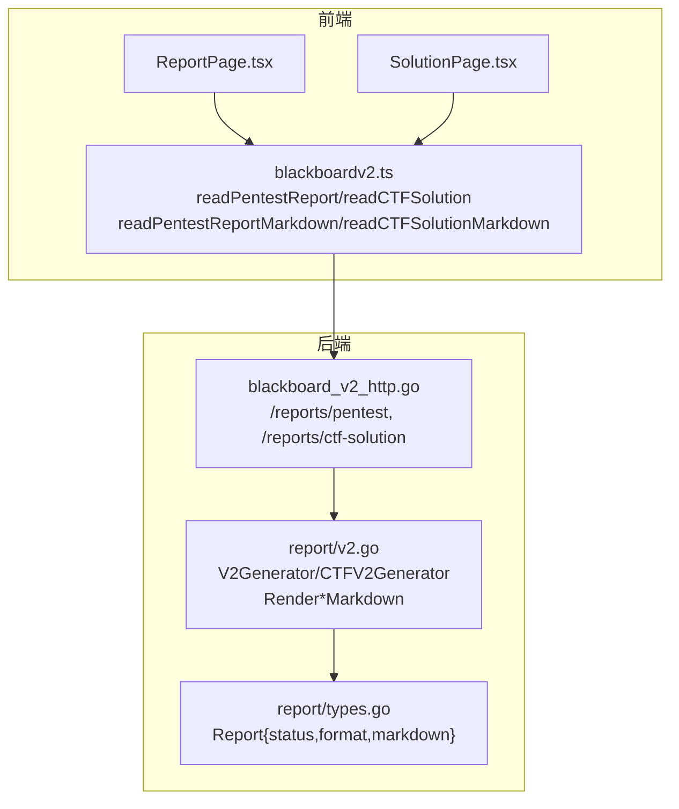
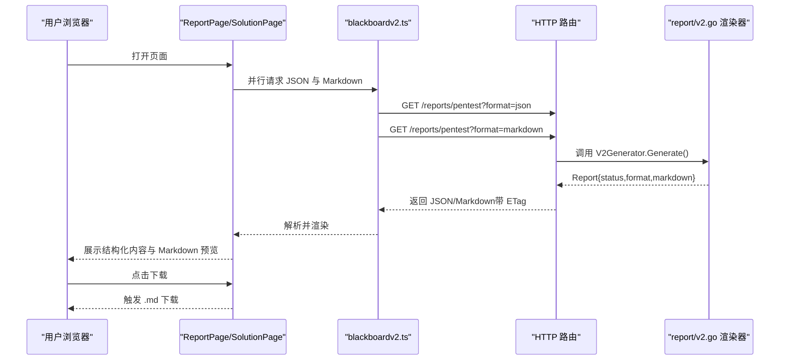
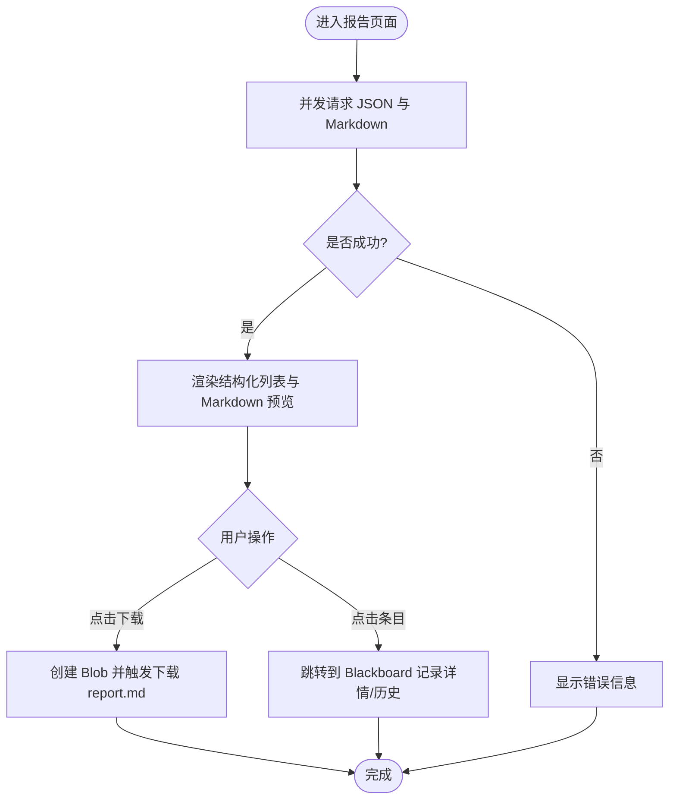
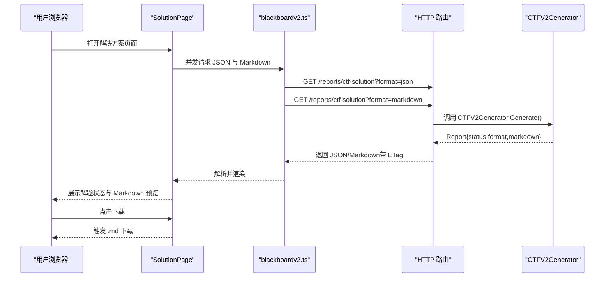
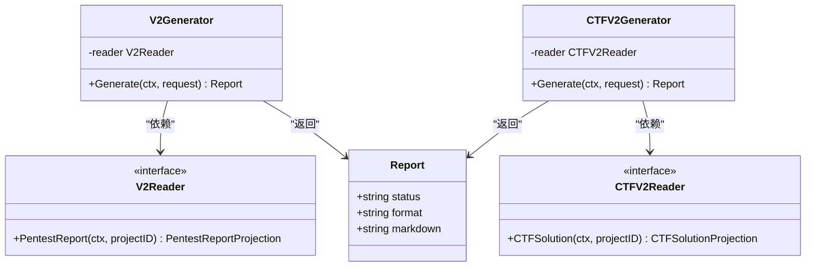
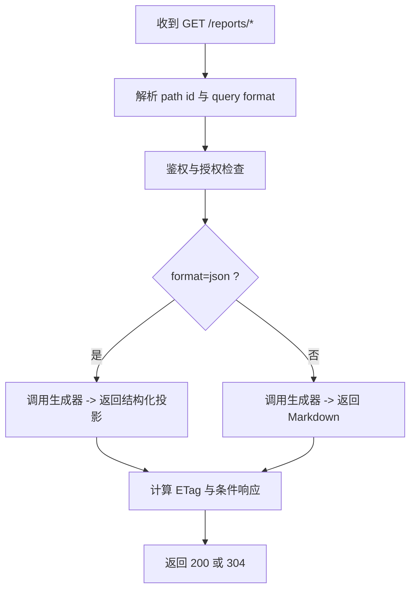
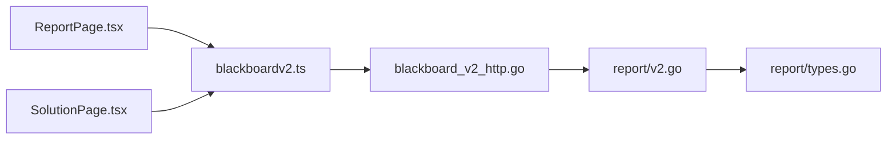

# 报告与解决方案页面

<cite>
**本文引用的文件**   
- [ReportPage.tsx](file://web/src/pages/ReportPage.tsx)
- [SolutionPage.tsx](file://web/src/pages/SolutionPage.tsx)
- [blackboardv2.ts](file://web/src/lib/blackboardv2.ts)
- [blackboard_v2_http.go](file://internal/daemon/blackboard_v2_http.go)
- [types.go](file://internal/report/types.go)
- [v2.go](file://internal/report/v2.go)
- [openapi.json](file://internal/blackboardv2contract/contractdata/openapi.json)
</cite>

## 目录
1. [简介](#简介)
2. [项目结构](#项目结构)
3. [核心组件](#核心组件)
4. [架构总览](#架构总览)
5. [详细组件分析](#详细组件分析)
6. [依赖关系分析](#依赖关系分析)
7. [性能考虑](#性能考虑)
8. [故障排查指南](#故障排查指南)
9. [结论](#结论)
10. [附录](#附录)

## 简介
本文件聚焦“报告生成”和“解决方案管理”两个前端页面，以及其背后的 Markdown 渲染、导出、预览、与黑板数据（Blackboard v2）的关联机制。内容覆盖：
- 渗透测试报告与 CTF 解决方案页面的数据来源、结构化投影与 Markdown 预览
- 后端 HTTP 路由、语义投影与 Markdown 生成器
- 下载导出流程、缓存与 ETag 策略
- 与黑板键（Blackboard Key）的导航联动
- 模板化与样式定制的技术方案建议
- 协作与版本控制的工作流说明（基于当前代码能力）

## 项目结构
- 前端页面
  - 报告页面：展示结构化 Pentest 报告与 Markdown 预览，支持下载 .md
  - 解决方案页面：展示 CTF 解题状态与证据，支持下载 .md
- 前端 API 客户端
  - 封装 /reports/pentest 与 /reports/ctf-solution 的 JSON 与 Markdown 读取
- 后端 HTTP 服务
  - 注册报告相关路由，鉴权、条件响应（ETag）、错误包装
- 报告渲染层
  - 从 Blackboard v2 语义投影生成确定性 Markdown

图表来源
- [ReportPage.tsx:1-291](file://web/src/pages/ReportPage.tsx#L1-L291)
- [SolutionPage.tsx:1-259](file://web/src/pages/SolutionPage.tsx#L1-L259)
- [blackboardv2.ts:1536-1562](file://web/src/lib/blackboardv2.ts#L1536-L1562)
- [blackboard_v2_http.go:269-310](file://internal/daemon/blackboard_v2_http.go#L269-L310)
- [v2.go:26-74](file://internal/report/v2.go#L26-L74)
- [types.go:1-9](file://internal/report/types.go#L1-L9)

章节来源
- [ReportPage.tsx:1-291](file://web/src/pages/ReportPage.tsx#L1-L291)
- [SolutionPage.tsx:1-259](file://web/src/pages/SolutionPage.tsx#L1-L259)
- [blackboardv2.ts:1536-1562](file://web/src/lib/blackboardv2.ts#L1536-L1562)
- [blackboard_v2_http.go:269-310](file://internal/daemon/blackboard_v2_http.go#L269-L310)
- [v2.go:26-74](file://internal/report/v2.go#L26-L74)
- [types.go:1-9](file://internal/report/types.go#L1-L9)

## 核心组件
- 报告页面（ReportPage）
  - 并行请求结构化 JSON 与 Markdown，分别用于交互展示与下载
  - 通过 Blackboard Key 链接到记录详情/历史
  - 提供 Markdown 预览与下载按钮
- 解决方案页面（SolutionPage）
  - 基于已验证 Flag 的 Solution 判定 Solved 状态
  - 展示 Verified/Candidate Flags、Answers、Procedures、Facts、Evidence
  - 提供 Markdown 预览与下载
- 报告渲染器（report/v2.go）
  - V2Generator/CTFV2Generator：从语义投影生成 Markdown
  - 输出为 Report{status, format, markdown}
- HTTP 路由（daemon/blackboard_v2_http.go）
  - GET /api/v2/projects/{id}/reports/pentest
  - GET /api/v2/projects/{id}/reports/ctf-solution
  - 支持 format=json|markdown；返回 ETag 与条件响应

章节来源
- [ReportPage.tsx:1-291](file://web/src/pages/ReportPage.tsx#L1-L291)
- [SolutionPage.tsx:1-259](file://web/src/pages/SolutionPage.tsx#L1-L259)
- [v2.go:26-74](file://internal/report/v2.go#L26-L74)
- [types.go:1-9](file://internal/report/types.go#L1-L9)
- [blackboard_v2_http.go:269-310](file://internal/daemon/blackboard_v2_http.go#L269-L310)

## 架构总览
报告与解决方案的数据流遵循“语义投影 + 可交付产物”的分离设计：
- 结构化投影（JSON）：面向 UI 交互、导航、筛选
- Markdown 产物：面向下载与分享的可交付文档

图表来源
- [ReportPage.tsx:28-50](file://web/src/pages/ReportPage.tsx#L28-L50)
- [SolutionPage.tsx:28-50](file://web/src/pages/SolutionPage.tsx#L28-L50)
- [blackboardv2.ts:1536-1562](file://web/src/lib/blackboardv2.ts#L1536-L1562)
- [blackboard_v2_http.go:269-310](file://internal/daemon/blackboard_v2_http.go#L269-L310)
- [v2.go:46-74](file://internal/report/v2.go#L46-L74)

## 详细组件分析

### 报告页面（ReportPage）
- 功能要点
  - 使用 readPentestReport 获取结构化投影，用于展示确认/未确认发现、事实及证据
  - 使用 readPentestReportMarkdown 获取 Markdown 预览与下载
  - 通过 recordHref 将每个条目链接到 Blackboard 记录详情/历史
- 交互流程
  - 页面加载时并发拉取 JSON 与 Markdown
  - 错误统一格式化显示
  - 点击 Download 按钮以 Blob 方式下载 report.md

图表来源
- [ReportPage.tsx:28-61](file://web/src/pages/ReportPage.tsx#L28-L61)
- [ReportPage.tsx:96-150](file://web/src/pages/ReportPage.tsx#L96-L150)
- [blackboardv2.ts:1543-1548](file://web/src/lib/blackboardv2.ts#L1543-L1548)
- [blackboardv2.ts:1536-1541](file://web/src/lib/blackboardv2.ts#L1536-L1541)

章节来源
- [ReportPage.tsx:1-291](file://web/src/pages/ReportPage.tsx#L1-L291)
- [blackboardv2.ts:1536-1548](file://web/src/lib/blackboardv2.ts#L1536-L1548)

### 解决方案页面（SolutionPage）
- 功能要点
  - 使用 readCTFSolution 获取结构化投影，包含 verified/candidate flags、answers、procedures、facts、evidence
  - 使用 readCTFSolutionMarkdown 获取 Markdown 预览与下载
  - solved 状态仅由已验证的 Flag 决定
- 交互流程
  - 页面加载时并发拉取 JSON 与 Markdown
  - 点击 Download 按钮以 Blob 方式下载 solution.md

图表来源
- [SolutionPage.tsx:28-61](file://web/src/pages/SolutionPage.tsx#L28-L61)
- [blackboardv2.ts:1557-1562](file://web/src/lib/blackboardv2.ts#L1557-L1562)
- [blackboardv2.ts:1550-1555](file://web/src/lib/blackboardv2.ts#L1550-L1555)
- [blackboard_v2_http.go:294-310](file://internal/daemon/blackboard_v2_http.go#L294-L310)
- [v2.go:56-64](file://internal/report/v2.go#L56-L64)

章节来源
- [SolutionPage.tsx:1-259](file://web/src/pages/SolutionPage.tsx#L1-L259)
- [blackboardv2.ts:1550-1562](file://web/src/lib/blackboardv2.ts#L1550-L1562)

### 报告渲染器（report/v2.go）
- 职责
  - 从 Blackboard v2 语义投影生成确定性 Markdown
  - 区分确认/未确认发现、确认/试探性事实，并附带证据引用
  - 对多行文本进行字面块处理，转义 Markdown 元字符
- 关键类型
  - Report{status, format, markdown}：渲染产物
  - V2Generator/CTFV2Generator：分别对应 Pentest 与 CTF 场景

图表来源
- [types.go:1-9](file://internal/report/types.go#L1-L9)
- [v2.go:11-64](file://internal/report/v2.go#L11-L64)

章节来源
- [v2.go:26-74](file://internal/report/v2.go#L26-L74)
- [types.go:1-9](file://internal/report/types.go#L1-L9)

### HTTP 路由与条件响应（daemon/blackboard_v2_http.go）
- 路由
  - GET /api/v2/projects/{id}/reports/pentest
  - GET /api/v2/projects/{id}/reports/ctf-solution
- 查询参数
  - format：json | markdown（默认 markdown）
- 条件响应
  - 返回 ETag（基于 revision），支持 If-None-Match 实现 304 Not Modified
  - 错误响应携带标准化错误信封，必要时附加同步附件

图表来源
- [blackboard_v2_http.go:269-310](file://internal/daemon/blackboard_v2_http.go#L269-L310)
- [blackboard_v2_http.go:500-513](file://internal/daemon/blackboard_v2_http.go#L500-L513)
- [openapi.json:696-738](file://internal/blackboardv2contract/contractdata/openapi.json#L696-L738)

章节来源
- [blackboard_v2_http.go:269-310](file://internal/daemon/blackboard_v2_http.go#L269-L310)
- [blackboard_v2_http.go:500-513](file://internal/daemon/blackboard_v2_http.go#L500-L513)
- [openapi.json:696-738](file://internal/blackboardv2contract/contractdata/openapi.json#L696-L738)

### 与黑板数据的关联与导航
- 结构化投影中的 key 字段用于构建 recordHref，指向 Blackboard 记录详情/历史
- 报告与解决方案页面均通过该机制实现“从报告到证据/事实/发现的溯源跳转”

章节来源
- [ReportPage.tsx:176-238](file://web/src/pages/ReportPage.tsx#L176-L238)
- [SolutionPage.tsx:136-149](file://web/src/pages/SolutionPage.tsx#L136-L149)
- [blackboardv2.ts:417-419](file://web/src/lib/blackboardv2.ts#L417-L419)

## 依赖关系分析
- 前端页面依赖 blackboardv2.ts 提供的 API 函数
- blackboardv2.ts 调用后端 /reports/* 路由
- 后端路由调用 report/v2.go 的生成器
- 生成器返回 types.go 定义的 Report 结构

图表来源
- [ReportPage.tsx:1-291](file://web/src/pages/ReportPage.tsx#L1-L291)
- [SolutionPage.tsx:1-259](file://web/src/pages/SolutionPage.tsx#L1-L259)
- [blackboardv2.ts:1536-1562](file://web/src/lib/blackboardv2.ts#L1536-L1562)
- [blackboard_v2_http.go:269-310](file://internal/daemon/blackboard_v2_http.go#L269-L310)
- [v2.go:26-74](file://internal/report/v2.go#L26-L74)
- [types.go:1-9](file://internal/report/types.go#L1-L9)

章节来源
- [ReportPage.tsx:1-291](file://web/src/pages/ReportPage.tsx#L1-L291)
- [SolutionPage.tsx:1-259](file://web/src/pages/SolutionPage.tsx#L1-L259)
- [blackboardv2.ts:1536-1562](file://web/src/lib/blackboardv2.ts#L1536-L1562)
- [blackboard_v2_http.go:269-310](file://internal/daemon/blackboard_v2_http.go#L269-L310)
- [v2.go:26-74](file://internal/report/v2.go#L26-L74)
- [types.go:1-9](file://internal/report/types.go#L1-L9)

## 性能考虑
- 并发请求：页面在挂载时并发拉取 JSON 与 Markdown，减少首屏等待
- 条件响应：服务端基于 revision 的 ETag 支持 304，避免重复传输
- 大文本渲染：Markdown 预览采用固定高度滚动区域，避免长文档阻塞布局
- 下载优化：使用 Blob URL 即时生成下载，无需二次网络请求

[本节为通用指导，不直接分析具体文件]

## 故障排查指南
- 常见错误
  - 权限不足：缺少 Continuation Interface 能力或 token 无效
  - 存储繁忙：SQLite 写入锁冲突，服务端返回 503 并提示重试
  - 语义校验失败：非法 schema、字段缺失等，返回 422
- 定位方法
  - 查看页面错误提示（已统一格式化）
  - 检查请求路径与 format 参数是否正确
  - 关注响应头 ETag 与状态码（200/304/4xx/5xx）

章节来源
- [blackboard_v2_http.go:539-584](file://internal/daemon/blackboard_v2_http.go#L539-L584)
- [blackboard_v2_http.go:612-643](file://internal/daemon/blackboard_v2_http.go#L612-L643)
- [ReportPage.tsx:41-45](file://web/src/pages/ReportPage.tsx#L41-L45)
- [SolutionPage.tsx:41-45](file://web/src/pages/SolutionPage.tsx#L41-L45)

## 结论
- 报告与解决方案页面通过“结构化投影 + Markdown 产物”的双通道设计，兼顾交互体验与可交付性
- 渲染器保证输出确定性与可读性，便于自动化与分享
- 与 Blackboard 的键级导航实现了从报告到原始证据/事实的完整溯源
- 当前实现未内置富文本编辑器与在线协作编辑能力，但提供了清晰的扩展点（见附录）

[本节为总结性内容，不直接分析具体文件]

## 附录

### 模板渲染与导出现状
- 当前 Markdown 渲染由后端生成器负责，输出格式固定
- 前端仅提供预览与下载，无在线模板编辑

章节来源
- [v2.go:66-74](file://internal/report/v2.go#L66-L74)
- [ReportPage.tsx:52-61](file://web/src/pages/ReportPage.tsx#L52-L61)
- [SolutionPage.tsx:52-61](file://web/src/pages/SolutionPage.tsx#L52-L61)

### 报告定制与样式配置方案（建议）
- 模板抽象
  - 引入模板引擎（如 Go text/template 或第三方库），将渲染逻辑与数据解耦
  - 定义主题变量（标题、颜色、字体、边距等）与环境变量注入
- 多格式导出
  - 在现有 Markdown 基础上增加 HTML/PDF 导出管线（例如 pandoc 或 headless 浏览器）
- 样式配置
  - 在前端新增“报告样式设置”面板，保存至本地或后端配置项
  - 通过模板变量驱动不同品牌/客户化的外观

[本节为概念性建议，不直接分析具体文件]

### 富文本编辑器、预览与分享机制（建议）
- 富文本编辑器
  - 集成轻量级编辑器（如 TipTap/Quill），支持 Markdown 模式与所见即所得切换
- 实时预览
  - 前端侧将输入转换为 Markdown 并渲染预览区
- 分享机制
  - 生成只读链接（短链），后端按 revision 提供 304 支持
  - 可选添加访问令牌与过期时间控制

[本节为概念性建议，不直接分析具体文件]

### 版本控制与协作工作流（基于当前能力）
- 版本控制
  - 服务端基于 revision 的 ETag 与条件响应，天然具备幂等与增量更新基础
- 协作
  - 当前页面为只读消费视图；如需多人协作编辑，可在上层引入变更批处理与冲突解决（参考 Blackboard v2 的变更语义）

章节来源
- [blackboard_v2_http.go:500-513](file://internal/daemon/blackboard_v2_http.go#L500-L513)
- [openapi.json:696-738](file://internal/blackboardv2contract/contractdata/openapi.json#L696-L738)