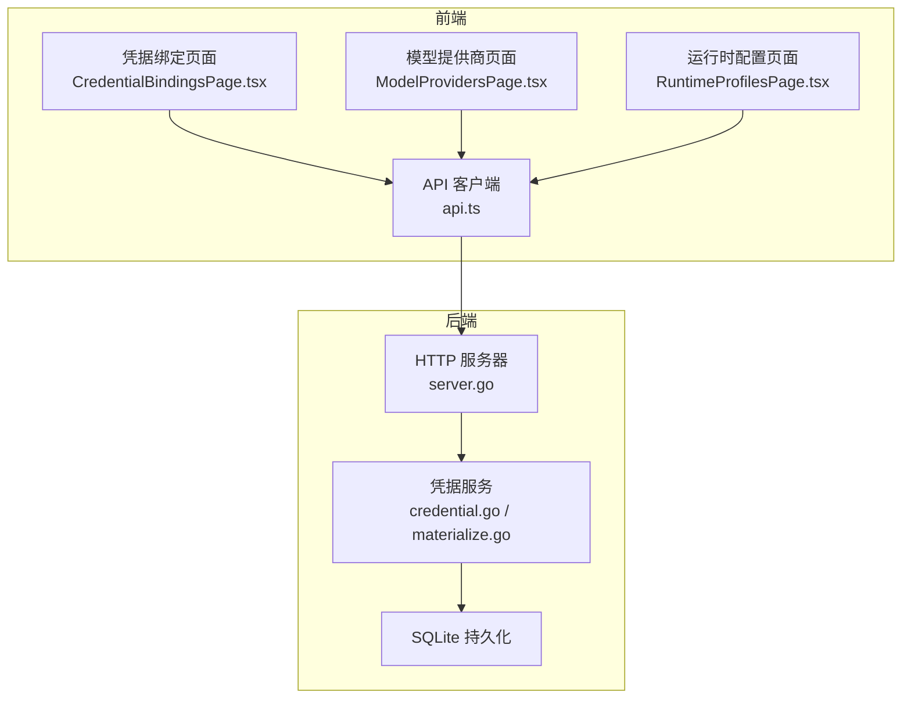
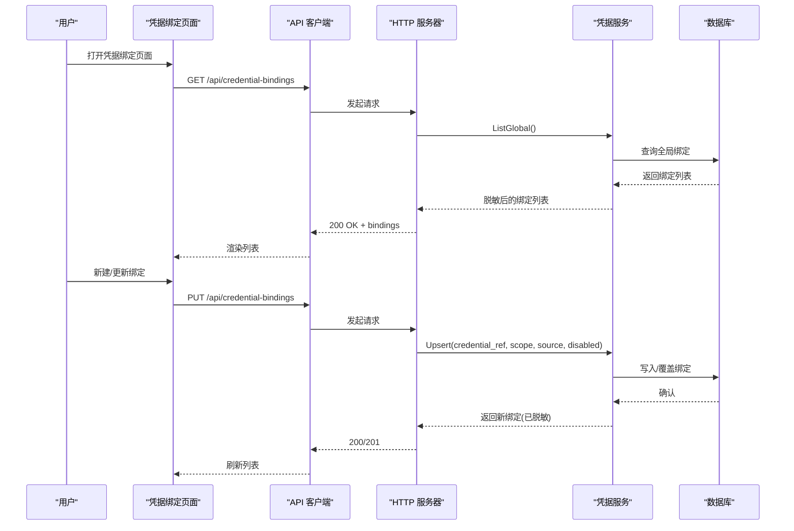
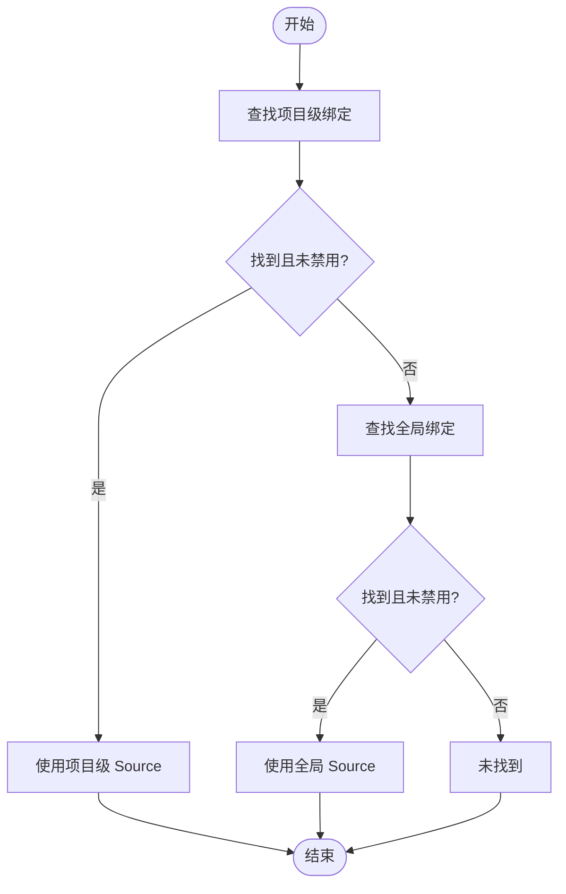
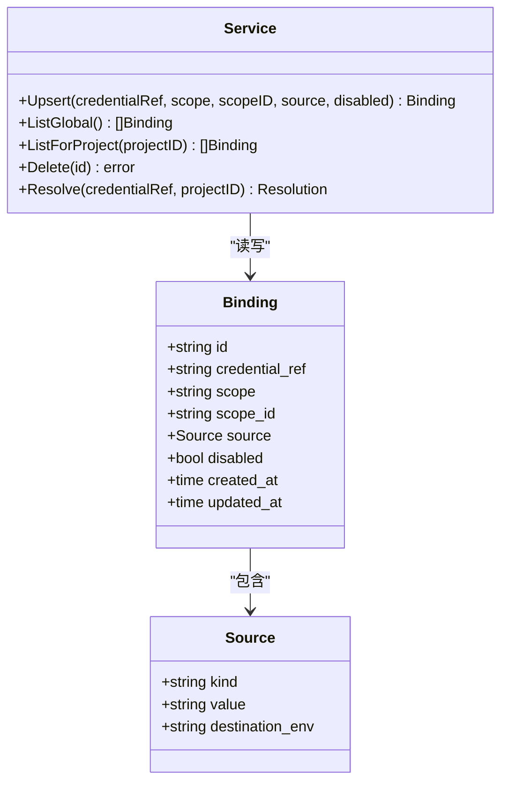
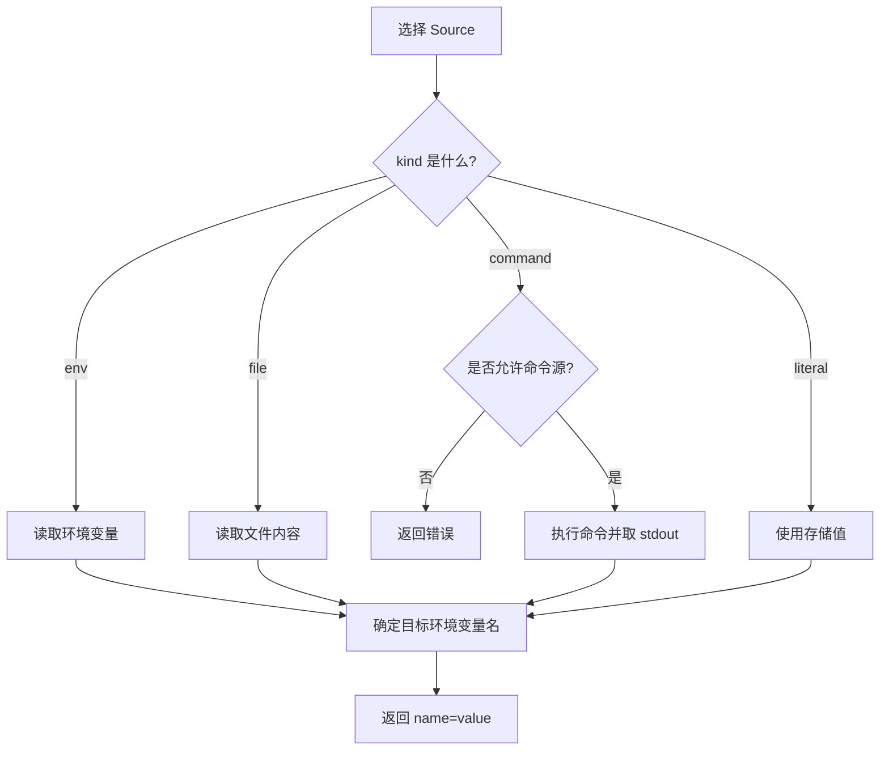
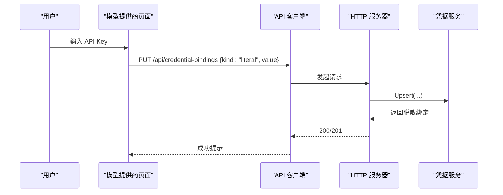
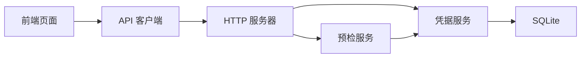

# 凭据绑定管理

<cite>
**本文引用的文件**   
- [internal/credential/credential.go](file://internal/credential/credential.go)
- [internal/credential/materialize.go](file://internal/credential/materialize.go)
- [internal/daemon/server.go](file://internal/daemon/server.go)
- [web/src/pages/CredentialBindingsPage.tsx](file://web/src/pages/CredentialBindingsPage.tsx)
- [web/src/lib/api.ts](file://web/src/lib/api.ts)
- [web/src/pages/ModelProvidersPage.tsx](file://web/src/pages/ModelProvidersPage.tsx)
- [web/src/pages/RuntimeProfilesPage.tsx](file://web/src/pages/RuntimeProfilesPage.tsx)
- [internal/daemon/credential_test.go](file://internal/daemon/credential_test.go)
</cite>

## 目录
1. [简介](#简介)
2. [项目结构](#项目结构)
3. [核心组件](#核心组件)
4. [架构总览](#架构总览)
5. [详细组件分析](#详细组件分析)
6. [依赖关系分析](#依赖关系分析)
7. [性能与可扩展性](#性能与可扩展性)
8. [故障排查指南](#故障排查指南)
9. [结论](#结论)
10. [附录](#附录)

## 简介
本文件围绕“凭据绑定管理”能力，系统性说明以下方面：
- 支持的凭据源类型：环境变量、文件路径、命令执行（受控）、字面量值。
- 生命周期管理：创建、更新、禁用、删除的完整流程与语义。
- 安全机制：敏感信息隐藏、访问控制、审计日志建议。
- 模板与批量导入导出：基于现有 API 的实现方案。
- 验证与用户体验：前端校验、错误提示与可用性设计。
- 集成方式：与模型提供商、运行时配置及预检流程的协作。

## 项目结构
凭据绑定由后端服务层与前端页面共同实现：
- 后端领域逻辑位于 credential 包，提供绑定存储、解析、材料化等能力。
- Daemon HTTP 路由暴露全局与项目级凭据绑定的增删改查接口。
- 前端在设置页提供可视化操作界面，并与模型提供商、运行时配置联动。

图表来源
- [internal/daemon/server.go:619-625](file://internal/daemon/server.go#L619-L625)
- [internal/daemon/server.go:994-1080](file://internal/daemon/server.go#L994-L1080)
- [internal/credential/credential.go:1-120](file://internal/credential/credential.go#L1-L120)
- [internal/credential/materialize.go:1-80](file://internal/credential/materialize.go#L1-L80)
- [web/src/pages/CredentialBindingsPage.tsx:41-120](file://web/src/pages/CredentialBindingsPage.tsx#L41-L120)
- [web/src/lib/api.ts:308-317](file://web/src/lib/api.ts#L308-L317)
- [web/src/pages/ModelProvidersPage.tsx:663-670](file://web/src/pages/ModelProvidersPage.tsx#L663-L670)
- [web/src/pages/RuntimeProfilesPage.tsx:1088-1102](file://web/src/pages/RuntimeProfilesPage.tsx#L1088-L1102)

章节来源
- [internal/daemon/server.go:619-625](file://internal/daemon/server.go#L619-L625)
- [internal/daemon/server.go:994-1080](file://internal/daemon/server.go#L994-L1080)
- [internal/credential/credential.go:1-120](file://internal/credential/credential.go#L1-L120)
- [internal/credential/materialize.go:1-80](file://internal/credential/materialize.go#L1-L80)
- [web/src/pages/CredentialBindingsPage.tsx:41-120](file://web/src/pages/CredentialBindingsPage.tsx#L41-L120)
- [web/src/lib/api.ts:308-317](file://web/src/lib/api.ts#L308-L317)
- [web/src/pages/ModelProvidersPage.tsx:663-670](file://web/src/pages/ModelProvidersPage.tsx#L663-L670)
- [web/src/pages/RuntimeProfilesPage.tsx:1088-1102](file://web/src/pages/RuntimeProfilesPage.tsx#L1088-L1102)

## 核心组件
- 凭据源类型
  - env：引用一个环境变量名，运行时读取其值。
  - file：读取指定文件内容作为凭据。
  - command：通过 shell 命令输出获取凭据（默认禁用，需显式开启）。
  - literal：直接存储本地密文值（对外响应会被脱敏）。
- 作用域与覆盖
  - global：全局生效，所有项目共享。
  - project：针对特定项目覆盖或禁用全局绑定。
- 解析顺序
  - 先查找项目级绑定；若存在且未禁用则使用；否则回退到全局绑定；均未找到则为未找到。
- 安全与脱敏
  - 对外返回的 literal 值统一替换为占位符，避免泄露。
  - 对 env 源进行“看起来像密文”的输入校验，防止误用。
- 材料化与环境映射
  - 将绑定解析为最终的环境变量名与值，供运行时注入。
  - destination_env 用于指定目标环境变量名；env 源可省略，其他源必须声明。

章节来源
- [internal/credential/credential.go:37-113](file://internal/credential/credential.go#L37-L113)
- [internal/credential/credential.go:211-245](file://internal/credential/credential.go#L211-L245)
- [internal/credential/credential.go:309-344](file://internal/credential/credential.go#L309-L344)
- [internal/credential/credential.go:346-364](file://internal/credential/credential.go#L346-L364)
- [internal/credential/materialize.go:28-80](file://internal/credential/materialize.go#L28-L80)
- [internal/credential/materialize.go:118-143](file://internal/credential/materialize.go#L118-L143)

## 架构总览
凭据绑定管理的端到端交互如下：

图表来源
- [internal/daemon/server.go:619-625](file://internal/daemon/server.go#L619-L625)
- [internal/daemon/server.go:994-1080](file://internal/daemon/server.go#L994-L1080)
- [internal/credential/credential.go:125-183](file://internal/credential/credential.go#L125-L183)
- [web/src/pages/CredentialBindingsPage.tsx:86-103](file://web/src/pages/CredentialBindingsPage.tsx#L86-L103)
- [web/src/lib/api.ts:308-317](file://web/src/lib/api.ts#L308-L317)

## 详细组件分析

### 数据模型与解析流程
- Binding：包含 ID、引用名、作用域、作用域标识、Source、是否禁用、时间戳。
- Source：包含 kind、value、destination_env。
- Resolution：解析结果，包含是否找到、是否禁用、实际 Source。
- 解析算法
  - 优先项目级绑定；如被禁用则阻断回退。
  - 其次全局绑定。
  - 均不存在则标记未找到。

图表来源
- [internal/credential/credential.go:211-245](file://internal/credential/credential.go#L211-L245)

章节来源
- [internal/credential/credential.go:77-99](file://internal/credential/credential.go#L77-L99)
- [internal/credential/credential.go:211-245](file://internal/credential/credential.go#L211-L245)

### 生命周期管理（创建、更新、禁用、删除）
- 创建/更新（幂等）
  - 同一 (credential_ref, scope, scope_id) 的多次 PUT 会覆盖而非重复。
  - 支持仅禁用而不提供 Source（project 级）。
- 删除
  - 按绑定 ID 删除；不存在时返回 404。
- 状态展示
  - 列表显示 active/disabled 计数与过滤。
  - 禁用项不解析、不注入。

图表来源
- [internal/credential/credential.go:115-183](file://internal/credential/credential.go#L115-L183)
- [internal/credential/credential.go:185-209](file://internal/credential/credential.go#L185-L209)
- [internal/credential/credential.go:289-307](file://internal/credential/credential.go#L289-L307)

章节来源
- [internal/daemon/server.go:994-1080](file://internal/daemon/server.go#L994-L1080)
- [internal/daemon/credential_test.go:13-59](file://internal/daemon/credential_test.go#L13-L59)
- [internal/daemon/credential_test.go:194-220](file://internal/daemon/credential_test.go#L194-L220)
- [internal/daemon/credential_test.go:222-276](file://internal/daemon/credential_test.go#L222-L276)

### 安全机制（敏感信息隐藏、访问控制、审计日志）
- 敏感信息隐藏
  - 对外返回的 literal 值统一替换为占位符，避免泄露。
  - 前端对 literal 值以掩码形式展示。
- 访问控制
  - 非环回监听需要设置认证令牌；所有变更路由受鉴权中间件保护。
  - DNS 重绑定防护：拒绝非预期 Origin 的请求。
- 审计日志
  - 当前代码未内置凭据变更审计；建议在 HTTP 层记录关键变更事件（如 Upsert/Delete），并关联用户身份与时间戳。

章节来源
- [internal/credential/credential.go:346-364](file://internal/credential/credential.go#L346-L364)
- [web/src/pages/CredentialBindingsPage.tsx:451-492](file://web/src/pages/CredentialBindingsPage.tsx#L451-L492)
- [internal/daemon/server.go:383-400](file://internal/daemon/server.go#L383-L400)

### 凭据材料化与环境映射
- 材料化规则
  - env：从进程环境读取对应变量。
  - file：读取文件内容并去除空白。
  - command：仅在显式允许时执行命令，取 stdout 作为值。
  - literal：直接使用存储的值（但对外不可见）。
- 目标环境变量映射
  - 若声明 destination_env，则以该名称注入。
  - env 源可省略，默认以 value 作为变量名。
  - 其他源必须声明 destination_env，否则会报错。

图表来源
- [internal/credential/materialize.go:28-80](file://internal/credential/materialize.go#L28-L80)
- [internal/credential/materialize.go:118-143](file://internal/credential/materialize.go#L118-L143)

章节来源
- [internal/credential/materialize.go:28-80](file://internal/credential/materialize.go#L28-L80)
- [internal/credential/materialize.go:118-143](file://internal/credential/materialize.go#L118-L143)

### 前端页面与用户体验
- 功能要点
  - 列表展示：引用名、作用域、源类型、值摘要、使用方（运行时配置/模型提供商）。
  - 筛选与搜索：按状态（全部/启用/禁用）、源类型过滤；全文检索。
  - 新建表单：选择源类型与填写值；literal 使用密码输入框。
  - 删除确认：二次确认后调用删除接口。
- 与模型提供商联动
  - 模型提供商页面的 API Key 可直接保存为全局 literal 绑定。
- 与运行时配置联动
  - 运行时配置中声明的 credential_refs 会在预检阶段解析并注入。

图表来源
- [web/src/pages/ModelProvidersPage.tsx:663-670](file://web/src/pages/ModelProvidersPage.tsx#L663-L670)
- [internal/daemon/server.go:994-1080](file://internal/daemon/server.go#L994-L1080)

章节来源
- [web/src/pages/CredentialBindingsPage.tsx:41-120](file://web/src/pages/CredentialBindingsPage.tsx#L41-L120)
- [web/src/pages/CredentialBindingsPage.tsx:126-152](file://web/src/pages/CredentialBindingsPage.tsx#L126-L152)
- [web/src/pages/CredentialBindingsPage.tsx:451-492](file://web/src/pages/CredentialBindingsPage.tsx#L451-L492)
- [web/src/pages/ModelProvidersPage.tsx:663-670](file://web/src/pages/ModelProvidersPage.tsx#L663-L670)
- [web/src/pages/RuntimeProfilesPage.tsx:1088-1102](file://web/src/pages/RuntimeProfilesPage.tsx#L1088-L1102)

### 与模型提供商和其他组件的集成
- 模型提供商
  - 通过保存 literal 绑定，将 API Key 与 provider 的 api_key_env 对齐。
- 运行时配置
  - 在运行时配置的字段中声明 credential_refs，预检阶段解析并注入。
- 预检流程
  - 启动前校验凭据可用性与可投影性，确保运行时无缺失。

章节来源
- [web/src/pages/ModelProvidersPage.tsx:663-670](file://web/src/pages/ModelProvidersPage.tsx#L663-L670)
- [web/src/pages/RuntimeProfilesPage.tsx:1088-1102](file://web/src/pages/RuntimeProfilesPage.tsx#L1088-L1102)
- [internal/daemon/server.go:1082-1129](file://internal/daemon/server.go#L1082-L1129)

## 依赖关系分析
- 组件耦合
  - HTTP 层依赖凭据服务；凭据服务依赖 SQLite 存储。
  - 前端依赖后端 API；同时消费模型提供商与运行时配置数据以增强上下文。
- 外部依赖
  - 文件系统（file 源）、环境变量（env 源）、shell 命令（command 源，受控）。
- 潜在循环依赖
  - 无循环依赖迹象；各模块职责清晰。

图表来源
- [internal/daemon/server.go:619-625](file://internal/daemon/server.go#L619-L625)
- [internal/daemon/server.go:1082-1129](file://internal/daemon/server.go#L1082-L1129)
- [internal/credential/credential.go:115-183](file://internal/credential/credential.go#L115-L183)

章节来源
- [internal/daemon/server.go:619-625](file://internal/daemon/server.go#L619-L625)
- [internal/daemon/server.go:1082-1129](file://internal/daemon/server.go#L1082-L1129)
- [internal/credential/credential.go:115-183](file://internal/credential/credential.go#L115-L183)

## 性能与可扩展性
- 性能
  - 列表与单条操作均为轻量 SQL 查询/写入，开销低。
  - 列表返回前进行脱敏处理，计算量小。
- 可扩展性
  - 新增源类型需在 Source 定义与 validateSource/Materialize 中扩展。
  - 如需引入外部密钥管理服务，可在 Materialize 中增加新的 kind 分支，并在前端表单中提供相应选项。

[本节为通用指导，无需源码引用]

## 故障排查指南
- 常见错误与定位
  - 400 Bad Request：参数校验失败（如 env 源看起来像密文、缺少必填字段）。
  - 404 Not Found：删除不存在的绑定、项目不存在。
  - 403 Forbidden：Origin 检查失败或鉴权失败。
- 快速自检
  - 确认环境变量是否存在（env 源）。
  - 确认文件路径可读（file 源）。
  - 确认是否启用了命令源（command 源需显式开启）。
  - 确认 destination_env 是否正确声明（非 env 源必须声明）。
- 测试用例参考
  - 幂等更新、禁止 env 源形似密文、literal 脱敏、项目级覆盖与禁用、删除行为等均有测试覆盖。

章节来源
- [internal/daemon/credential_test.go:61-74](file://internal/daemon/credential_test.go#L61-L74)
- [internal/daemon/credential_test.go:76-117](file://internal/daemon/credential_test.go#L76-L117)
- [internal/daemon/credential_test.go:136-192](file://internal/daemon/credential_test.go#L136-L192)
- [internal/daemon/credential_test.go:194-220](file://internal/daemon/credential_test.go#L194-L220)
- [internal/daemon/credential_test.go:222-276](file://internal/daemon/credential_test.go#L222-L276)
- [internal/daemon/server.go:383-400](file://internal/daemon/server.go#L383-L400)

## 结论
凭据绑定管理提供了灵活、安全的凭据注入机制，支持多种源类型与作用域覆盖，并通过严格的校验与脱敏策略保障安全性。结合模型提供商与运行时配置，形成统一的凭据治理体系。建议后续补充审计日志与批量导入导出能力，以提升运维效率与合规性。

[本节为总结，无需源码引用]

## 附录

### API 概览（凭据绑定）
- 全局范围
  - PUT /api/credential-bindings：创建或更新全局绑定（幂等）。
  - GET /api/credential-bindings：列出全局绑定。
  - DELETE /api/credential-bindings/{binding_id}：删除绑定。
- 项目范围
  - PUT /api/projects/{id}/credential-bindings：创建或更新项目级绑定。
  - GET /api/projects/{id}/credential-bindings：列出项目级绑定。

章节来源
- [internal/daemon/server.go:619-625](file://internal/daemon/server.go#L619-L625)
- [internal/daemon/server.go:994-1080](file://internal/daemon/server.go#L994-L1080)

### 前端数据结构
- CredentialBinding：包含 id、credential_ref、scope、source、disabled、时间戳等字段。

章节来源
- [web/src/lib/api.ts:308-317](file://web/src/lib/api.ts#L308-L317)

### 模板与批量导入导出方案
- 模板
  - 在前端维护若干常用模板（如 OpenAI、Claude 等），点击后自动填充 credential_ref、kind、value 或 destination_env。
- 批量导入
  - 提供 JSON 文件上传，逐条调用 PUT /api/credential-bindings 完成导入。
- 批量导出
  - 调用 GET /api/credential-bindings 拉取列表，生成 JSON 文件下载。
- 注意
  - 导出时需忽略 literal 的实际值（已被脱敏），仅保留元数据。
  - 导入时应对每条记录进行服务端校验，失败行应报告具体错误。

[本节为方案设计，无需源码引用]